# TPS-OMS — System Architecture (02)

> **Definitive technical architecture reference.** Every statement is derived from the actual source in this repository. Where a fact cannot be confirmed from source, it is marked **"Not Verifiable from Source Code"**. This document describes *what the code does*; it contains no recommendations or improvements (by instruction). Active code and legacy/deprecated code are explicitly distinguished.
>
> **Repo:** `/Users/tarunsingh/Documents/Projects/tps-oms` · **Live:** `https://portal.tpsxpert.com`
> Companion: `docs/01_PROJECT_INVENTORY.md` (facts here were independently re-verified against source).

---

## 1. Executive Summary

TPS-OMS is a **serverless, single-page application** for an FSSAI/food-safety regulatory consultancy. The browser runs a React 18 + Vite SPA (TypeScript) served as static assets from **GitHub Pages** (`public/CNAME` → `portal.tpsxpert.com`). All backend capability is provided by **Supabase**: PostgreSQL (with Row-Level Security, PL/pgSQL functions, triggers, `pg_cron`), Auth (JWT), Storage (4 buckets), and **13 Deno Edge Functions**. There is **no custom application server** — the SPA talks directly to Supabase via `@supabase/supabase-js` (PostgREST for tables/RPC, Storage API, and `functions.invoke` for edge functions).

The system's architectural spine is: **React Query hooks → supabase-js client → (PostgREST | RPC | Edge Function) → RLS-enforced PostgreSQL / external APIs**. Security is enforced primarily at the database layer (RLS + `SECURITY DEFINER` RPCs), not in a middleware tier. External integrations: **AWS Rekognition** (face), **Meta WhatsApp Cloud API**, **ZeptoMail** (email), **Google Drive API** (documents), **Google Sheets** (client sync).

---

## 2. Overall System Architecture

**Layers (verified):**

1. **Presentation (SPA):** `src/pages/**`, `src/components/**` — React Router v6 routes, Radix UI, Tailwind.
2. **State/Data-access:** `src/hooks/**` (TanStack React Query) + `src/lib/supabase.ts` (single client).
3. **Auth/session:** `src/contexts/AuthContext.tsx` + Supabase Auth (JWT in `localStorage`/`sessionStorage`).
4. **BaaS API:** Supabase PostgREST (tables + RPC), Storage API, Edge Functions (`supabase/functions/**`).
5. **Data & logic:** PostgreSQL — 40 tables, 11 enums, 52 functions, 27 triggers, 2 views, RLS on all tables (`supabase/migrations/001…077`).
6. **External services:** AWS Rekognition, Meta WhatsApp, ZeptoMail, Google Drive/Sheets.
7. **Delivery:** GitHub Actions → GitHub Pages (`.github/workflows/deploy.yml`).

No traditional 3-tier server exists; the "application server" role is split between **RLS-protected Postgres** and **Edge Functions**.

---

## 3. High-Level Architecture Diagram

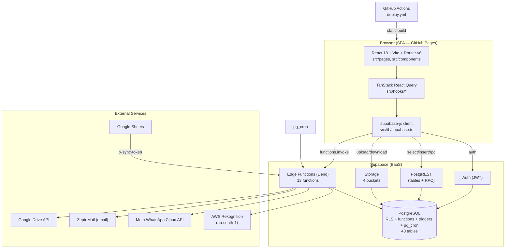

---

## 4. Frontend Architecture

- **Bootstrap:** `src/main.tsx` → `<StrictMode><App/></StrictMode>`. `src/App.tsx` composes providers in this exact order: **`ErrorBoundary` → `QueryClientProvider` → `AuthProvider` → `ToastProvider` → `BrowserRouter` → `Routes`** (verified in `App.tsx`). `QueryClient` options: `staleTime: 0, retry: 1, refetchOnWindowFocus: true`.
- **Routing:** React Router v6, one public route (`/login`) and a protected layout tree under `/` wrapped by `ProtectedRoute` → `AppShell` (`<Outlet/>`). 22 `path` routes + 1 `index` redirect (`RoleBasedRedirect`) + `*` catch-all → `/`.
- **Layout:** `AppShell.tsx` (sidebar + main; mounts `useIdleLogout()`), `Sidebar.tsx` (role-filtered nav + unread badge), `TopBar.tsx` (title, avatar menu: change photo → `avatars` bucket, change password → `auth.updateUser`, sign out), `NotificationPanel.tsx` (bell dropdown).
- **Data access:** every feature has a hook in `src/hooks/*` using React Query; hooks call `supabase.from(...)`, `supabase.rpc(...)`, `supabase.storage`, or `supabase.functions.invoke(...)`.
- **Styling:** Tailwind (`tailwind.config.ts`) — "Arctic Precision" theme (Manrope/Inter/JetBrains Mono, mesh-gradient), Material Symbols via `Sym.tsx`. Theme values `ocean|slate|sand|forest|white` persisted to `profiles.dashboard_theme` + localStorage (`useTheme.ts`).
- **Aliases:** `@` → `./src` (`vite.config.ts`, `vitest.config.ts`, tsconfig).

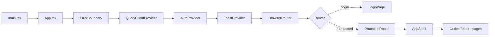

---

## 5. Backend Architecture

There is **no Node/Express/Nest backend**. Backend logic lives in two places:

1. **PostgreSQL** — business rules via `SECURITY DEFINER` RPCs (e.g., `punch_attendance`, `store_fssai_credential`, `admin_create_user`, `delete_project`), triggers (auto-codes, timeline capture, payment rollup, notifications), and RLS policies.
2. **Deno Edge Functions** (`supabase/functions/**`) — anything needing external APIs or service-role privileges: AWS face calls, WhatsApp/email dispatch, Google Drive/Sheets, user invite.

Edge functions are individually HTTP-invoked (from the SPA via `functions.invoke`, from `pg_cron` via `pg_net`, or from Google Sheets via a token header). Auth posture per function is explicit in code (JWT-verified vs public vs token-guarded) — see §25.

---

## 6. Database Architecture

- **Engine:** Supabase PostgreSQL. **Migrations:** `supabase/migrations/001…077` (77 files).
- **Extensions:** `uuid-ossp`, `pg_cron`, `supabase_vault`, `moddatetime`, `pg_net` (migration 001, 005, 028).
- **Objects (exact):** 40 tables, 11 enum types, 52 functions, 27 triggers, 2 views (`attendance_days`, `v_stage_timeline` — both SECURITY INVOKER).
- **Domain groups:** auth/profiles; clients/licenses/credential-vault; projects/stages/stage_templates/stage_timeline/stage_documents; authority_queries/query_points; soi_archive/soi_products; payments/block_requests/project_transfers/cancel_requests/delete_requests; documents/notifications/notification_log; tasks/task_comments/task_extension_requests; attendance (office_locations/attendance_settings/attendance_punches); knowledge_base/performance_reports; audit (audit_log/stage_audit_log/credential_access_log/whatsapp_log); config (app_settings/reminder_settings/code_counters).
- **Codes:** auto-generated via triggers — `projects.project_code` (`TPS-YYYY-NNNN`), `clients.client_code` (`TPS-CLI-NNNN`), `tasks.task_code` (`TSK-NNNN`), query codes (`QRY-NNNN`).
- **Money:** stored in **paise** (integer) — `projects.quoted_amount/paid_amount`, `payments.amount`.

---

## 7. Storage Architecture

Supabase Storage, four buckets (RLS on `storage.objects`), plus Google Drive as the primary document store.

| Bucket | Visibility | Contents | Path | Migration |
|---|---|---|---|---|
| `avatars` | Public | Profile photos | `<uid>/…` | 015 |
| `documents` | Private | Legacy client/stage attachments | `clients/`, `stages/` | 002, 009, 034 |
| `attendance` | Private | Punch selfies (signed URL 1h) | `<uid>/<date>/<ts>.jpg` | 019 |
| `face-refs` | Private | One reference face per user | `<uid>/reference.jpg` | 075 |

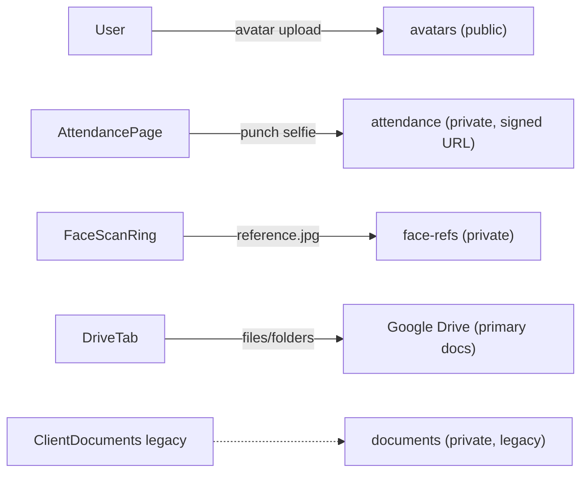

---

## 8. Authentication Architecture

Supabase Auth (JWT). Client configured in `src/lib/supabase.ts`: `persistSession: true`, `storageKey: 'tps-oms-auth'`, `autoRefreshToken: true`, custom `storage: rememberStorage`.

**Two login mechanisms (both active):**
1. **Password** (`LoginPage.tsx`): brute-force gate `check_login_locked` → (if not an email) `resolve_login_email` → `supabase.auth.signInWithPassword` → `record_login_attempt`.
2. **Face (passwordless)** (`LoginPage.tsx` + `face-login` edge fn): `PlainCapture` photo → `face-login` (AWS CompareFaces vs `face-refs/<uid>/reference.jpg`) → returns magic-link `token_hash` → `supabase.auth.verifyOtp({type:'magiclink'})`.

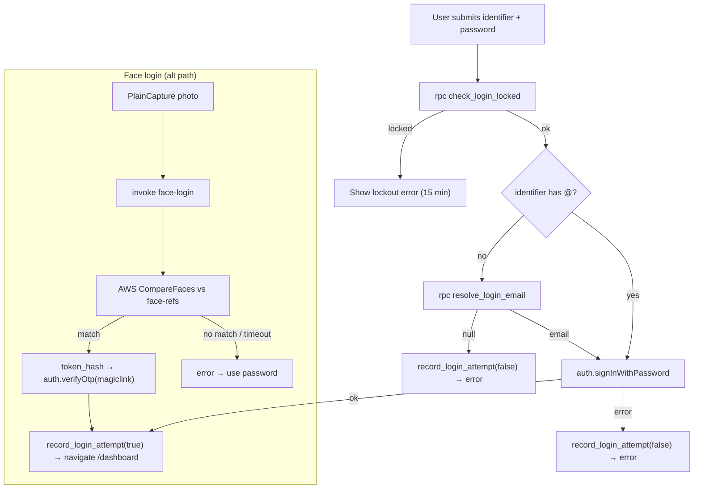

---

## 9. Authorization Architecture

Two enforcement layers, both active:

1. **Client-side route gating** (`ProtectedRoute.tsx`): while `loading` → skeleton; if `!user` → `Navigate /login`; if `allowedRoles` set and (`!profile` OR role ∉ list) → `Navigate /dashboard`; else render. `RoleGuard` renders content conditionally by role. **This is UX gating, not a security boundary.**
2. **Database RLS** (authoritative): every table has RLS; policies use `has_role(variadic user_role[])` / `auth_role()` (SECURITY DEFINER, stable) plus owner checks (`auth.uid()`, `created_by`, `assigned_to`). Privileged actions run as `SECURITY DEFINER` RPCs; anon `EXECUTE` revoked on admin RPCs (migration 074).

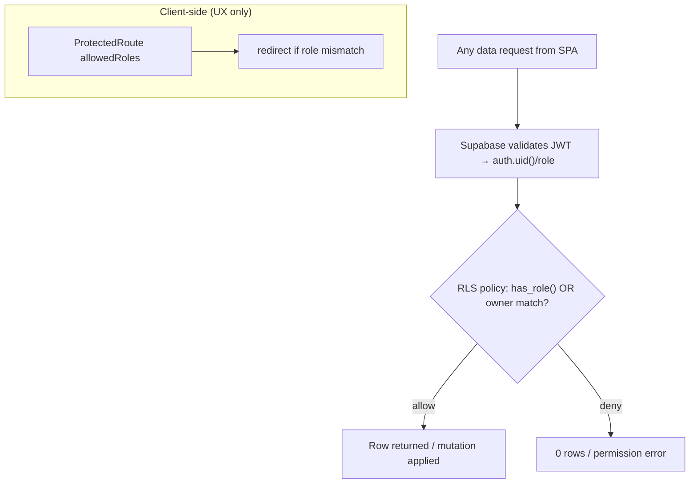

---

## 10. User Role Architecture

Enum `user_role` (migration 001), **7 roles**: `super_admin, director, manager, executive, accounts, hr, auditor`.

Role → landing page (`RoleBasedRedirect.tsx`): super_admin/director→`/director`; manager→`/operations`; executive/accounts→`/dashboard`; hr→`/employees`; auditor→`/reports/performance`; fallback→`/dashboard`.

Fine-grained `profiles` flags: `can_edit_clients`, `can_be_assigned`, `can_assign`, `can_view_all_projects`, `report_permissions` (JSON array). Permission constant sets in `src/types/index.ts`.

---

## 11. Face ID Architecture

**Active = server-side AWS Rekognition.** Legacy on-device engine present but unused.

- **Shared signer:** `supabase/functions/_shared/rekognition.ts` — hand-rolled AWS SigV4, region `ap-south-1`, actions `DetectFaces`/`CompareFaces`.
- **Enroll:** `attendance-enroll-face` — `want:'center'` validates a clean frontal face (confidence ≥90; centre cx 0.30–0.70, cy 0.24–0.74; width ≥0.20) → stores `face-refs/<uid>/reference.jpg` + sets `profiles.face_enrolled_at`; `want:'scan'` returns head-pose direction; `reset:true` deletes reference + clears flag.
- **Verify punch:** `attendance-verify-punch` — DetectFaces quality gate (6s timeout, never blocks on infra failure) → CompareFaces (8s timeout) → `verified|no_match|unverified` (`attendanceGeo.mapVerification`) → upload photo → `punch_attendance` RPC → set `verification_status`. **Allow-and-flag** (records, never blocks on face).
- **Face login:** `face-login` — CompareFaces → magic-link token.
- **Capture UI:** `PlainCapture.tsx` (downscaled JPEG, no on-device model).

**Legacy (present, NOT used in active flow):** `src/lib/faceEngine.ts`, `src/pages/attendance/FaceCapture.tsx`, `src/hooks/useFaceEnrollment.ts`, `public/models/{blazeface,faceres}.*` (`@vladmandic/human`). Legacy columns `profiles.face_descriptor`, `profiles.face_model` no longer populated by the active flow.

```mermaid
flowchart TD
    subgraph Enroll["Enrollment (guided ring)"]
      E1["FaceScanRing: center capture"] --> E2["invoke attendance-enroll-face want=center"]
      E2 --> E3["AWS DetectFaces (quality/pose)"]
      E3 -->|ok| E4["store face-refs/<uid>/reference.jpg + set face_enrolled_at"]
      E1b["move head U/D/L/R"] --> E5["want=scan → pose direction (liveness)"]
    end
    subgraph Verify["Punch verification"]
      V1["PlainCapture photo + GPS"] --> V2["invoke attendance-verify-punch"]
      V2 --> V3["DetectFaces quality gate (6s)"]
      V3 -->|needs_retake| V1
      V3 -->|ok| V4["CompareFaces vs reference (8s)"]
      V4 --> V5["map verified/no_match/unverified"]
      V5 --> V6["upload attendance photo"]
      V6 --> V7["rpc punch_attendance (records)"]
      V7 --> V8["update verification_status"]
    end
```

---

## 12. Attendance Architecture

- **Files:** `src/pages/attendance/*`, `src/hooks/useAttendance.ts`, `src/lib/attendanceGeo.ts`. **RPC:** `punch_attendance`. **Edge fns:** enroll/verify. **Tables:** `attendance_settings` (singleton), `attendance_punches`, `office_locations`; **view** `attendance_days`.
- **Modes** (from `attendance_settings`): `none` (GPS only), `photo` (selfie stored, not matched), `face` (server-side verified). Chosen in `AttendanceSettingsSection.tsx`.
- **Recording gate — `punch_attendance` (migrations 019→076→077, current logic):** `auth.uid()` required → **accuracy gate** (reject if `> accuracy_threshold_m`) → nearest-office haversine loop (sets `within_fence`) → **selfie gate** (if `selfie_required` and no path) → **geofence block for non-field staff** (raise if `not is_field and not within`) → INSERT punch. **No face gate in the RPC** (moved to edge/AWS; face is allow-and-flag). Field staff (`is_field_staff`) may punch anywhere.

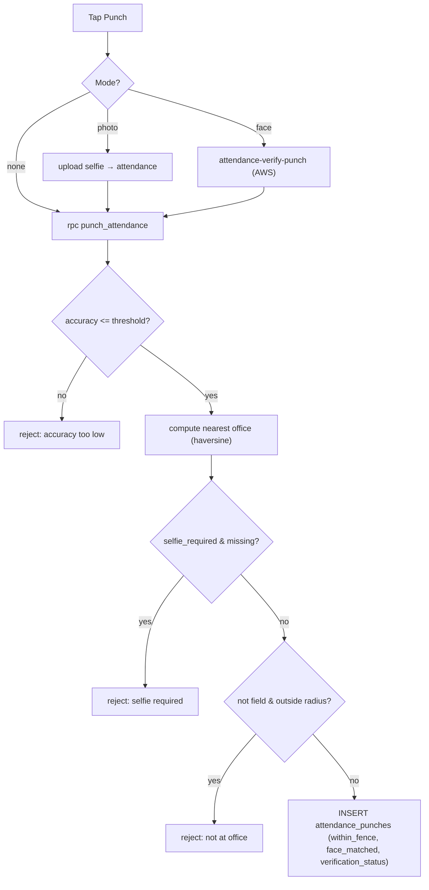

---

## 13. GPS / Location Flow

- **Capture:** browser `navigator.geolocation.getCurrentPosition` (in `AttendancePage.tsx`; also `AttendanceSettingsSection.tsx` "use my location").
- **Distance:** `haversineMeters` (`src/lib/attendanceGeo.ts`, unit-tested) client-side; authoritative geofence computed server-side in `punch_attendance` via inline haversine over `office_locations` (active rows).
- **Fields recorded:** `latitude, longitude, accuracy_m, distance_m, office_id, within_fence, is_field`.
- **Policy:** office staff blocked outside the nearest office `radius_m`; field staff exempt (§12).

---

## 14. Client Management Workflow

- **Files:** `src/pages/clients/*`, hooks `useClients`, `useLicenses`, `useReferrals`. **Tables:** `clients`, `licenses`, `credential_access_log`, `referrals`. **RPCs:** `store_fssai_credential`, `reveal_fssai_credential`, `delete_client`.
- **Vault:** FSSAI portal passwords stored via `store_fssai_credential` (Supabase Vault); `reveal_fssai_credential` decrypts + logs to `credential_access_log` (manager+; 30s auto-hide in `CredentialReveal.tsx`).
- **Docs:** primary store is Google Drive (client-level folder via `DriveTab`); `ClientDocuments.tsx` (Supabase `documents` bucket) is legacy.

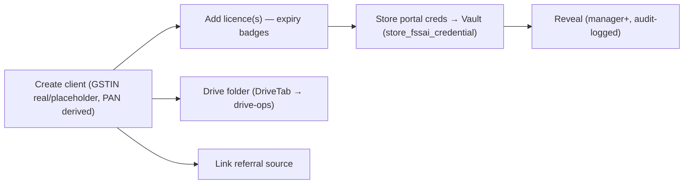

---

## 15. Employee Management Workflow

- **Files:** `src/pages/employees/*`, hooks `useEmployees`, `useEmployee`, `useEmployeeDetails`, `useUpsertEmployeeDetails`, `useUpdateEmployeeProfile`.
- **Tables:** `profiles` (operational: employee_code, designation, department, hod_email, is_field_staff) + `employee_details` (sensitive PII — DOB, Aadhaar, PAN, addresses, emergency contact; strict RLS restricting to the employee or HR/admin).
- **Flow:** admin/HR set employment fields → employee (or HR/admin) fills personal details → password self-change (`auth.updateUser`) → attendance days shown on detail page.

---

## 16. Project Lifecycle

- **Files:** `src/pages/projects/*` (+ `tabs/`), hooks `useProjects`, `useProjectTransfers`, `useStageDocuments`, `usePayments`, `useAuthorityQueries`. **Tables:** projects, stages, stage_templates, stage_timeline, stage_documents, authority_queries, query_points, soi_archive, soi_products, payments, block_requests, cancel_requests, project_transfers, project_products, project_remarks. **RPCs:** approve_block_request, unblock_project, approve_cancel_request, initiate/respond/cancel_project_transfer, delete_project, generate_artwork_product_stages.
- **Auto-behavior (triggers):** project insert → `create_stages_from_template` (stages from `stage_templates`) + `generate_project_code` + `notify_project_created`; stage changes → `trg_stage_timeline_capture` (append `stage_timeline`) + `fn_audit_stage_changes`; stage/payment changes → `fn_sync_project_completion` + `fn_recalc_project_payment`.
- **Clocks:** per-stage `active_clock` (employee/client/authority); timeline durations from `stage_timeline`.

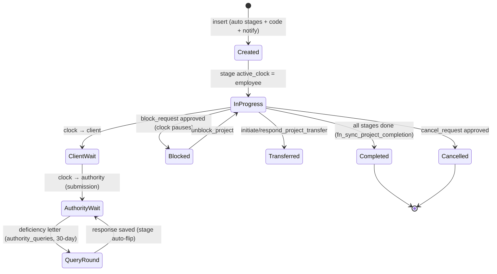

---

## 17. Task Lifecycle

- **Files:** `src/pages/tasks/*`, `src/hooks/useTasks.ts`. **Tables:** tasks, task_comments, task_extension_requests. **Triggers:** `tasks_stamp_completed`, `tasks_guard_update`. **RPCs:** `request_task_extension`, `decide_task_extension`. **Edge fn:** `urgent-alerts` (best-effort email on create/done/extension).
- **Flow:** create → assignee updates status (done requires confirm; assigner/admin can edit — enforced by `tasks_guard_update`) → extension request → manager decision. `task_code` auto (`TSK-NNNN`).

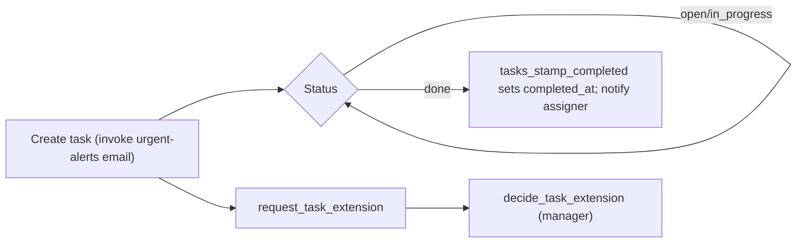

---

## 18. Payment Workflow

- **Files:** `src/pages/projects/tabs/PaymentsTab.tsx`, `src/hooks/usePayments.ts`. **Table:** `payments`; project rollup columns `quoted_amount`, `paid_amount`, `payment_status` (paise). **Trigger:** `fn_recalc_project_payment` (payment insert → recompute `paid_amount` + `payment_status`). Mark-complete/unlock (migration 062). **Weekly WhatsApp:** `notify-payment-weekly` edge fn.

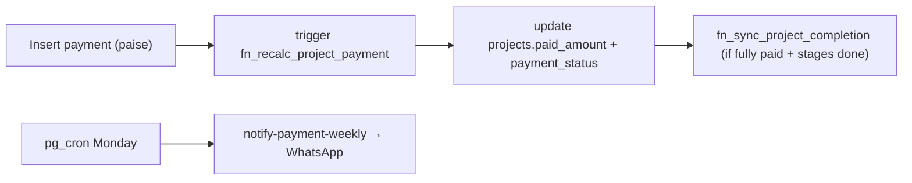

---

## 19. Reporting Architecture

- **Files:** `src/pages/reports/PerformancePage.tsx`, `QueriesReportPage.tsx`. **Backing RPCs (migration 056):** `rpc_project_timeline`, `rpc_stage_performance`, `rpc_employee_timeline`, `rpc_ontime_report`, `rpc_employee_summary`. **View:** `v_stage_timeline` (SECURITY INVOKER, migration 071). **Access:** role OR `profiles.report_permissions` (grantable tabs: `pending_payments`, `queries`, `govt_fees`).
- Exact per-tab UI rendering was **Not Verifiable from Source Code** in full depth (RPCs confirmed; some tab render paths not exhaustively traced).

---

## 20. Dashboard Architecture

- **Dashboard** (`DashboardPage.tsx`, `useDashboard.ts`): parallel loads — my active/overdue projects, recent notifications, today's punches, pending payments, quick-add task; director KPIs for admins.
- **Director** (`DirectorPage.tsx`): KPI cards, revenue (billed/quoted/pending), clock distribution, pipeline.
- **Operations** (`OperationsPage.tsx`): clock summary + block/unblock/cancel approval inbox + clock-bucket-filtered projects.

---

## 21. Notification Architecture

Three channels: **in-app** (`notifications` table, real-time subscription in `useNotifications`), **WhatsApp** (Meta Cloud API via `send-whatsapp`), **email** (ZeptoMail).

- **Producers:** DB triggers insert `notifications` rows (`notify_project_created`, `fn_notify_block_request`, `fn_notify_cancel_request`, `fn_notify_admins`, stage/completion notifiers).
- **WhatsApp dispatch:** `notify-dispatch` (pg_cron; polls unsent `notifications`, ≤50/run, maps type→template), plus `block-escalate`, `notify-payment-weekly`, `daily-reminders`.
- **Dedup:** `notification_log`; WhatsApp audit `whatsapp_log`. Config gate `app_settings.whatsapp_enabled` + `whatsapp_api_key` + `whatsapp_phone_number_id`.

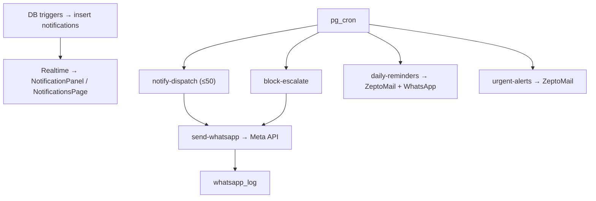

---

## 22. Email Architecture

- **Provider (verified in code):** **ZeptoMail** (Zoho, India DC). Secrets: `ZEPTOMAIL_TOKEN`, `MAIL_FROM`.
- **Senders:** `daily-reminders` (09:00 IST digest: tasks/licences/queries), `urgent-alerts` (hourly: new tasks, completions, extensions, new projects), `test-mail` (one-shot verification). Dedup via `notification_log`.
- Note: some project context references "Resend"; the **code uses ZeptoMail** (authoritative).

---

## 23. File Upload Architecture

- **Google Drive (primary):** `DriveTab.tsx` → `drive-ops` edge fn (Drive API v3): create folder / GDoc / GSheet, list, upload file or folder (`webkitdirectory`), trash, download, Workspace→PDF export. Auth via a Google service-account JSON in **Supabase Vault** (`get_google_sa_json` RPC), domain-wide delegation (`DRIVE_SUB_EMAIL`); CORS locked to `portal.tpsxpert.com`. Entity↔folder link via `set_entity_drive_folder`.
- **Supabase Storage uploads:** avatars (TopBar), attendance selfies (edge fn / selfie mode), face reference (enroll), legacy `documents`.

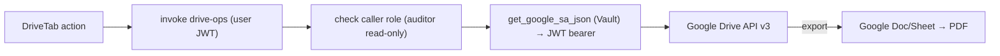

---

## 24. API Architecture

The application exposes/consumes three call styles through one client (`supabase-js`):

1. **PostgREST** — `supabase.from(table).select/insert/update/delete` (RLS-enforced).
2. **RPC** — `supabase.rpc(fn, args)` for `SECURITY DEFINER` business logic (52 DB functions; e.g., `punch_attendance`, credential vault, admin ops, reporting).
3. **Edge Functions** — `supabase.functions.invoke(name, {body})` (13 functions; §25).

There is **no REST/GraphQL API authored in this repo** beyond Supabase's generated PostgREST and the edge functions.

```mermaid
flowchart LR
    H["React Query hook"] --> CL["supabase-js"]
    CL -->|from()| PR["PostgREST → RLS → tables"]
    CL -->|rpc()| FN["PL/pgSQL SECURITY DEFINER"]
    CL -->|functions.invoke()| EF["Edge Function (Deno)"]
    CL -->|storage| ST["Storage API"]
```

---

## 25. Edge Function Architecture

**13 functions + 1 shared library** (`_shared/rekognition.ts`). Auth posture is explicit per function.

| Function | Trigger | Auth (from code) | External | Notable |
|---|---|---|---|---|
| `attendance-enroll-face` | SPA | user JWT | AWS DetectFaces | ring enroll, `face-refs`, sets `face_enrolled_at` |
| `attendance-verify-punch` | SPA | user JWT | AWS Detect+Compare | quality gate + allow-and-flag → `punch_attendance` |
| `face-login` | SPA (login) | **public** (`verify_jwt=false`) | AWS CompareFaces | magic-link `token_hash` |
| `invite-user` | SPA (admin) | user JWT (admin) | Supabase Auth | create/invite + upsert profile |
| `drive-ops` | SPA | user JWT | Google Drive | Vault SA, CORS-locked |
| `sheets-sync` | Google Sheets | `x-sync-token` | — | client pull/push upsert on gstin |
| `send-whatsapp` | internal/UI | service key | Meta WhatsApp | dispatcher, `whatsapp_log` |
| `notify-dispatch` | pg_cron | public | Meta WhatsApp | poll `notifications`, ≤50 |
| `block-escalate` | pg_cron | public | Meta WhatsApp | stale block escalation |
| `notify-payment-weekly` | pg_cron | public | Meta WhatsApp | Monday payment summary |
| `daily-reminders` | pg_cron | public | ZeptoMail + WhatsApp | morning digest |
| `urgent-alerts` | pg_cron | public | ZeptoMail | hourly alerts |
| `test-mail` | SPA | public | ZeptoMail | one-shot test |

---

## 26. Database Relationship Overview

Key relationships (verified from migrations + hook queries; not the full column set):

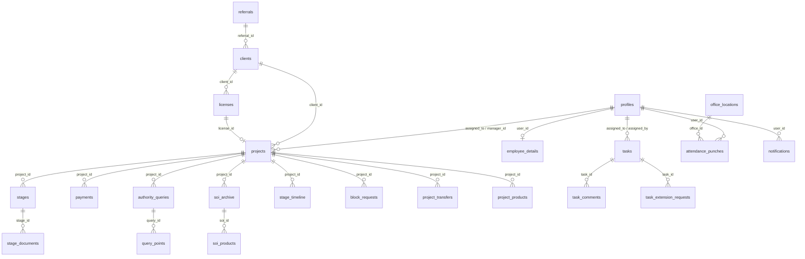

Exact foreign-key constraint list per table beyond the above was **not exhaustively enumerated** here (see §41 note); relationships shown are those confirmed in migrations/hooks.

---

## 27. Request Lifecycle

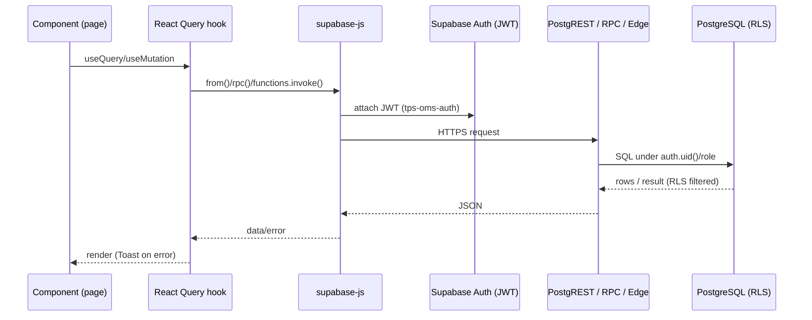

---

## 28. Login Flow

See §8 diagram. Password path: `LoginPage.handleSubmit` → `check_login_locked` → `resolve_login_email` (if code) → `signInWithPassword` → `record_login_attempt` → `navigate('/dashboard')`. Face path: `onFaceCapture` → `face-login` → `verifyOtp(magiclink)` → dashboard. On success, `AuthContext.onAuthStateChange` fires → `loadProfile`.

---

## 29. Logout Flow

Two triggers, both call `AuthContext.signOut()` → `supabase.auth.signOut()` → clears session/user/profile:
1. **Manual:** Sidebar/TopBar "Sign out".
2. **Idle:** `useIdleLogout.ts` — after **15 min** (`IDLE_MS = 15*60*1000`) of no `mousemove/mousedown/keydown/scroll/touchstart/click` → `signOut()` → toast → `navigate('/login')`. *(Legacy note: the toast string literal still reads "30 minutes" though the constant is 15 — cosmetic inconsistency, unmodified.)*

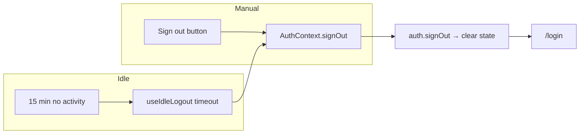

---

## 30. Session Flow

- **Storage:** `rememberStorage` (`src/lib/supabase.ts`) — reads from `sessionStorage` first, else `localStorage`; writes to `localStorage` unless `localStorage.tps_remember === 'false'` (then `sessionStorage`). Flag set by `LoginPage` before sign-in. Key `tps-oms-auth`; `autoRefreshToken: true`.
- **Load:** `AuthContext` `getSession()` on mount → `onAuthStateChange` subscription → `loadProfile(getProfile)` populates `profile` (role, flags).

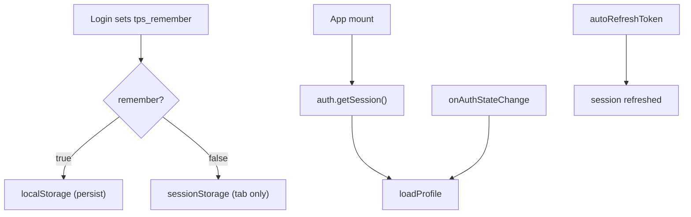

---

## 31. Error Handling Flow

- **React render errors:** `ErrorBoundary.tsx` (class component) — dev shows message+stack, prod shows generic + reload.
- **Async/data errors:** React Query error state; user-facing `Toast` (`toast.error/success/info`, `src/components/shared/Toast.tsx`). Some hooks wrap errors (e.g., `useFaceVerify.ts` `invoke()` parses edge-fn error body).
- **Edge functions:** each `serve` wraps logic in `try/catch` returning JSON `{error}` with 4xx/5xx; timeouts (DetectFaces 6s, CompareFaces 8s) resolve to non-blocking outcomes.
- **DB:** `raise exception` in RPCs surfaces as PostgREST error → hook error → Toast.

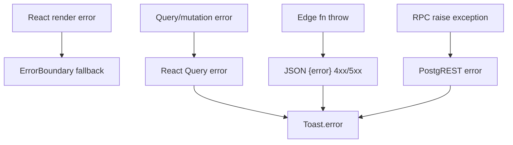

---

## 32. Logging Architecture

- **Application audit tables:** `audit_log`, `stage_audit_log`, `credential_access_log`, `whatsapp_log`, `notification_log` (written by triggers/functions/edge fns).
- **Client:** `ErrorBoundary` (console in dev). No client telemetry SDK.
- **Platform logs:** Supabase edge-function/Postgres/storage logs exist at the platform level (used during operations) but are **not a repository artifact — Not Verifiable from Source Code** here.
- **No external log aggregation** in the repository.

---

## 33. Security Architecture

- **RLS on all tables**; role checks via `has_role()`/`auth_role()`; owner fallbacks.
- **SECURITY DEFINER RPCs** with `search_path=public` pinned on 11 functions (migration 071); anon `EXECUTE` revoked on `admin_create_user/admin_reset_password/delete_client/delete_project` (074).
- **Credential vault** (Supabase Vault) for FSSAI passwords; reveals role-gated + audit-logged.
- **Brute-force lockout** (5/15 min) via `check_login_locked`/`record_login_attempt`.
- **Idle auto-logout** (15 min).
- **Private storage** (documents/attendance/face-refs) with owner+manager read; signed URLs (1h) for attendance.
- **Edge auth posture** explicit per function (JWT / public / token); privilege-escalation guard (only super_admin mints super_admin).
- **CORS** restricted to `portal.tpsxpert.com` on `drive-ops`.
- **Secrets** never in repo (`.env.local` gitignored; only `VITE_*` public keys reach the client; edge secrets + Vault server-side).
- **CAPA hardening** migrations 071–074 (view→INVOKER, scoped RLS, FK indexes, revokes).

---

## 34. Deployment Architecture

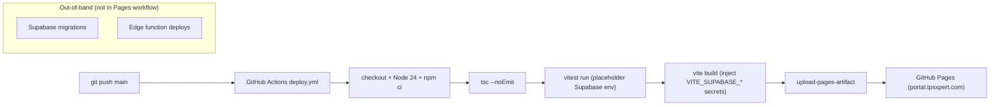

- SPA on GitHub Pages; custom domain via `public/CNAME`; SPA deep-links via `public/404.html` + `index.html` restore script.
- Migrations and edge functions are deployed to Supabase **outside** the Pages workflow (Supabase CLI/tooling) — **Not Verifiable from Source Code** which exact tool/pipeline performs those deploys.
- Secondary manual path: `npm run deploy` (`gh-pages -d dist`).

---

## 35. Production Infrastructure

Verifiable from source: **GitHub Pages** (static hosting, `CNAME` = portal.tpsxpert.com, Node 24 CI) + **Supabase** project (PostgreSQL, Auth, Storage, Edge Functions; region ap-south-1 inferred from AWS region + Supabase project). External: AWS Rekognition (ap-south-1), Meta WhatsApp, ZeptoMail, Google APIs. Exact Supabase plan/region/compute and any CDN/WAF settings are **Not Verifiable from Source Code**.

---

## 36. Environment Configuration

- **Frontend (public, build-time):** `VITE_SUPABASE_URL`, `VITE_SUPABASE_ANON_KEY` (only two referenced in `src/`). `VITE_APP_NAME`, `VITE_APP_URL` declared (`.env.example`, CI) but **not referenced in `src/`**.
- **Edge secrets (names only):** `SUPABASE_URL`, `SUPABASE_SERVICE_ROLE_KEY`, `SUPABASE_ANON_KEY`, `AWS_ACCESS_KEY_ID`, `AWS_SECRET_ACCESS_KEY`, `ZEPTOMAIL_TOKEN`, `MAIL_FROM`, `DRIVE_SUB_EMAIL`, `SITE_URL`, `SHEETS_SYNC_TOKEN`.
- **DB-stored config:** `app_settings` (whatsapp_enabled, whatsapp_api_key, whatsapp_phone_number_id, drive folder), `attendance_settings`, `reminder_settings`; Google SA JSON in Vault.
- **Local dev:** `.claude/launch.json` (`npm run dev`, port 5173). Config files: `vite.config.ts`, `vitest.config.ts`, `tailwind.config.ts`, `postcss.config.js`, `tsconfig*.json`.

---

## 37. External Services & Integrations

| Service | Integration point | Auth mechanism |
|---|---|---|
| Supabase | entire backend | anon key (client) / service role (edge) |
| AWS Rekognition (ap-south-1) | `_shared/rekognition.ts` | SigV4 (`AWS_ACCESS_KEY_ID/SECRET`) |
| Meta WhatsApp Cloud API v20 | `send-whatsapp` | token in `app_settings` |
| ZeptoMail | email edge fns | `ZEPTOMAIL_TOKEN` |
| Google Drive API v3 | `drive-ops` | Vault service-account JWT + delegation |
| Google Sheets | `sheets-sync` + `google-sheets/sync-clients.gs` | `x-sync-token` |
| GitHub Pages/Actions | hosting + CI/CD | GitHub secrets |

---

## 38. Module Interaction Matrix

| Module | Depends on (verified) |
|---|---|
| Attendance | AuthContext, useAttendance, edge (enroll/verify), punch_attendance RPC, attendance/face-refs buckets, office_locations |
| Face ID | rekognition lib, face-refs bucket, attendance_settings, enroll/verify/face-login |
| Login | supabase auth, RPCs (lock/resolve/record), face-login, AuthContext |
| Projects | clients, licenses, stages, stage_templates, stage_timeline, payments, authority_queries, soi_archive, block/transfer/cancel RPCs, profiles |
| Payments | projects (rollup trigger), notify-payment-weekly |
| Tasks | profiles, projects/clients, urgent-alerts |
| Notifications | notifications table (triggers), notify-dispatch/send-whatsapp, email fns |
| Clients | licenses, referrals, credential vault RPCs, Drive (drive-ops) |
| Reports | 056 RPCs, v_stage_timeline, report_permissions |
| Dashboard/Director/Operations | projects, notifications, attendance, block/cancel approvals |
| User Management | profiles, invite-user, admin_reset_password, useResetFace |

---

## 39. Data Flow Between Modules

```mermaid
flowchart LR
    CL["Clients"] --> LIC["Licenses"] --> PROJ["Projects"]
    REF["Referrals"] --> CL
    PROJ --> STG["Stages/Timeline"] --> DOCS["Stage Docs"]
    PROJ --> PAY["Payments"] --> NOTIF["Notifications"]
    PROJ --> QRY["Authority Queries"] --> NOTIF
    PROJ --> SOI["SOI Archive"]
    PROJ --> BLK["Blocks/Transfers/Cancel"] --> NOTIF
    PROF["Profiles/Employees"] --> ATT["Attendance"] --> FACE["Face-refs"]
    PROF --> TASK["Tasks"] --> NOTIF
    NOTIF --> WA["WhatsApp"]
    NOTIF --> EMAIL["ZeptoMail"]
    PROJ --> DRIVE["Google Drive"]
```

---

## 40. Architecture Decisions Observed in the Code

1. **Serverless BaaS + SPA** — no custom server; Supabase is the backend.
2. **Security at the database** — RLS + `SECURITY DEFINER` RPCs as the authoritative boundary; client route-guards are UX only.
3. **Edge functions for external I/O and privilege** — face (AWS), messaging (WhatsApp/email), Google, admin.
4. **Server-side face over on-device** — active flow uses AWS Rekognition; on-device `@vladmandic/human` retained but unused (dual implementation, one active).
5. **Allow-and-flag attendance for face**, hard geofence for office staff (migrations 076→077).
6. **Money in paise (integers)**; auto-generated business codes via triggers.
7. **Append-only audit tables** for credentials/stages/whatsapp/notifications.
8. **CI does typecheck + tests + build**; DB/edge deploys are out-of-band.
9. **Single supabase client** with a custom remember-me storage adapter.
10. **CAPA-driven hardening** (071–074) applied post-hoc.

---

## 41. Current Architectural Limitations (observed, factual)

- **Client-side authorization is advisory** — real enforcement is RLS; a route guard bypass does not grant data (RLS still applies), but UI gating alone is not a security boundary.
- **Dual face implementations** — legacy on-device code (`faceEngine.ts`, `FaceCapture.tsx`, `useFaceEnrollment.ts`, `public/models/*`) and legacy `profiles.face_descriptor/face_model` columns remain in the tree though unused by the active flow.
- **Public cron edge functions** — dispatcher functions (`notify-dispatch`, `block-escalate`, `daily-reminders`, `urgent-alerts`, `notify-payment-weekly`) are `verify_jwt=false` (invoked by pg_cron); `send-whatsapp` relies on service-key callers.
- **Idle-logout copy mismatch** — toast says "30 minutes" while timeout is 15.
- **Reporting/knowledge UI** — backing RPCs exist; not every tab's render path was source-traced.
- **Edge/migration deployment pipeline** is not represented in the repo (only the Pages workflow is) — **Not Verifiable from Source Code**.
- **Full FK constraint set** beyond documented relationships was not exhaustively enumerated.
- **Exact live `pg_cron` schedule set** exceeds what migrations define (repo defines 004/028; additional schedules exist operationally) — **Not Verifiable from Source Code** from the repo alone.

---

## 42. Technical Risks (observed, factual — no remediation given)

- **Single-vendor coupling** to Supabase (auth, DB, storage, edge) and to AWS/Meta/Google/ZeptoMail secrets held server-side.
- **Face verification depends on external AWS availability**; mitigated in code by timeouts + allow-and-flag (never blocks a punch on AWS failure).
- **WhatsApp templates must be authored in "English (en)"** (code comment notes en_US fails, error 132001) — an external-config dependency.
- **No monitoring/APM in repo** — operational visibility relies on Supabase platform logs + DB audit tables.
- **Public cron endpoints** are reachable HTTP endpoints (mitigated by idempotent/dedup logic + limited effect).

---

## 43. Scalability Considerations (observed, factual)

- **Static SPA** scales via GitHub Pages/CDN (stateless client).
- **PostgreSQL** is the central bottleneck; migration 073 added **45 FK covering indexes** (performance CAPA). `notify-dispatch` batches ≤50 per run.
- **Edge functions** are stateless and horizontally scaled by Supabase.
- Exact compute limits / connection pooling / rate limits are **Not Verifiable from Source Code**.

---

## 44. Maintainability Assessment (observed, factual)

- **Typed end-to-end** — TypeScript + generated `src/types/database.ts`; domain enums/types in `src/types/index.ts`.
- **Feature-oriented structure** — `pages/<feature>` + `hooks/use<Feature>` + matching tables/RPCs.
- **Migrations are additive & numbered** (001–077) with descriptive names; CAPA migrations documented inline.
- **Minimal automated tests** — 2 unit files (`attendanceGeo.test.ts`, `faceEngine.test.ts`); no integration/E2E suite (factual).
- **Legacy code retained** (on-device face) increases surface area (factual).

---

## 45. Architecture Summary

TPS-OMS is a **database-centric, serverless SPA**: a React/Vite frontend on GitHub Pages talking directly to Supabase, with security enforced by PostgreSQL RLS + SECURITY DEFINER RPCs and all external/privileged I/O isolated into 13 Deno edge functions. The domain model (40 tables, 52 functions, 27 triggers) encodes the FSSAI consulting workflow (clients→licenses→projects→stages/clocks→queries/SOI/payments) plus attendance (geofenced + AWS face) and a multi-channel notification layer (in-app/WhatsApp/email). Active vs legacy code is clearly separable (server-side face active; on-device face dormant). Deployment is GitHub Actions → Pages for the SPA, with DB/edge deploys performed out-of-band.

---

*Generated by read-only source inspection. No application code was modified. Every claim is grounded in the repository; unverifiable items are explicitly marked "Not Verifiable from Source Code".*
