# TPS-OMS — Business Workflows (03)

**Purpose:** Document the end-to-end business processes the system implements, as encoded in the actual source (pages, hooks, RPCs, triggers, edge functions).
**Scope:** Business/operational workflows only. Technical architecture is in Doc 02; module internals in Doc 04.
**Related Documents:** `01_PROJECT_INVENTORY.md`, `02_SYSTEM_ARCHITECTURE.md`, `04_MODULE_DOCUMENTATION.md`, `05_DATABASE_DOCUMENTATION.md`.
**Version:** 1.0 · **Creation Date:** 2026-07-14 · **Last Verification Date:** 2026-07-14
**Repository Branch:** `main` · **Commit Hash:** `9558f90` (working tree; documentation files uncommitted)

> Every workflow below is grounded in named source files/DB objects. Where a business rule is not encoded in source, it is marked **Not Verifiable from Source Code**. Legacy/deprecated paths are flagged.

## Table of Contents
1. Business Context
2. Actor / Role Model
3. Client Onboarding & Licensing
4. FSSAI Credential Vault
5. Project Lifecycle (core workflow)
6. Stage Clock Model
7. Blocking & Unblocking
8. Project Transfer
9. Project Cancellation
10. Authority Query (Deficiency) Rounds
11. SOI Archive
12. Payment Workflow
13. Task Workflow
14. Attendance Punch
15. Face Enrollment
16. Face Login
17. Notification & Reminder Workflows
18. Referral Tracking
19. Cross-Workflow Automation (triggers)

---

## 1. Business Context

TPS-OMS operates an FSSAI/food-safety regulatory consultancy. Core business objects: **Clients** (food business operators) → **Licences** (FSSAI Central/State) → **Projects** (application/renewal/modification engagements) → **Stages** (workflow steps with accountability clocks) → **Payments / Queries / SOI**. Supporting workflows: attendance (with geofence + face), tasks, notifications, referrals.

## 2. Actor / Role Model

Roles (`user_role` enum, migration 001): `super_admin, director, manager, executive, accounts, hr, auditor`. Role capabilities are enforced by RLS + `has_role()` and permission flags on `profiles` (`can_edit_clients`, `can_assign`, `can_view_all_projects`, `report_permissions`). Detailed matrix in Doc 07 §Authorization.

## 3. Client Onboarding & Licensing

**Source:** `src/pages/clients/*`, `useClients`, `useLicenses`; tables `clients`, `licenses`; trigger `fn_set_client_code` (client_code `TPS-CLI-NNNN`).

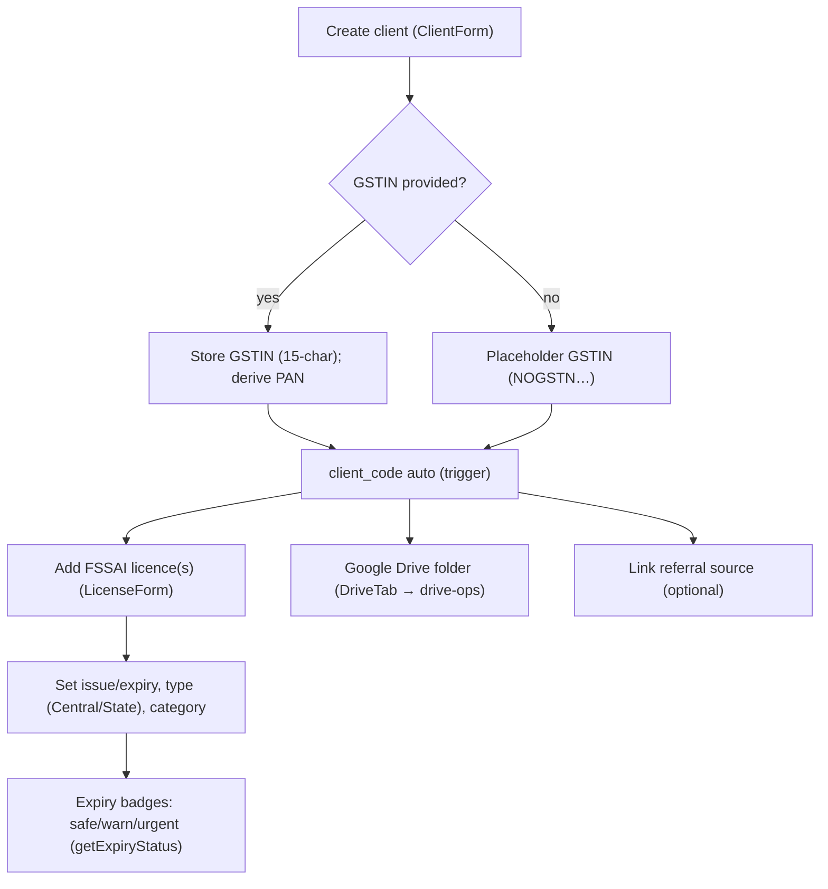

**Rules encoded:** duplicate-name warning for no-GSTIN clients; PAN auto-extraction from GSTIN; expiry status thresholds in `src/lib/utils.ts` `getExpiryStatus` (>90d safe, >30d warn, ≤30d urgent).

## 4. FSSAI Credential Vault

**Source:** RPCs `store_fssai_credential`, `reveal_fssai_credential` (migrations 004/008/060); `CredentialReveal.tsx`; table `credential_access_log`.

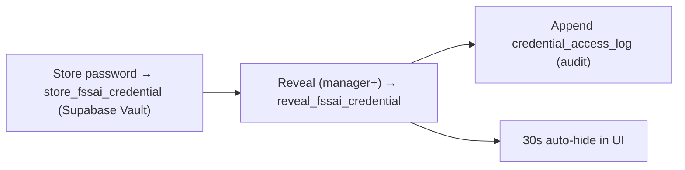

Access is role-gated (`ROLES_WITH_CREDENTIAL_ACCESS` = super_admin/director/manager) and **every reveal is audit-logged**.

## 5. Project Lifecycle (core workflow)

**Source:** `src/pages/projects/*`, `useProjects`; tables `projects`, `stages`, `stage_templates`, `stage_timeline`; triggers `create_stages_from_template`, `generate_project_code`, `notify_project_created`, `fn_sync_project_completion`.

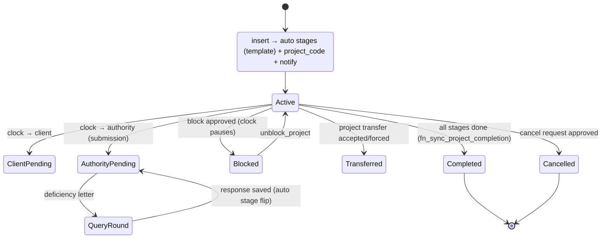

**Service types (from `stage_templates`):** New Application, Renewal, Modification, Annual Return, Form II, Artwork (multi-product via `generate_artwork_product_stages`), Claim Check. Form II uses parallel stages 1–3 then gated 4+ (`stage_order`).

## 6. Stage Clock Model

Each in-progress stage carries an `active_clock` ∈ {employee, client, authority} (enum `clock_type`). Clock transitions are captured append-only into `stage_timeline` by trigger `trg_stage_timeline_capture` (migration 055); durations derive from timeline rows. Client-side aggregation in `src/lib/projectClock.ts` (`computeStageClocks`, `clockBucket`, `isAuthorityOnly`). This drives Operations/Director clock distributions.

## 7. Blocking & Unblocking

**Source:** `BlockRequestForm.tsx`, table `block_requests`, RPCs `approve_block_request`, `unblock_project`; trigger `fn_notify_block_request`; edge `block-escalate` (pg_cron).

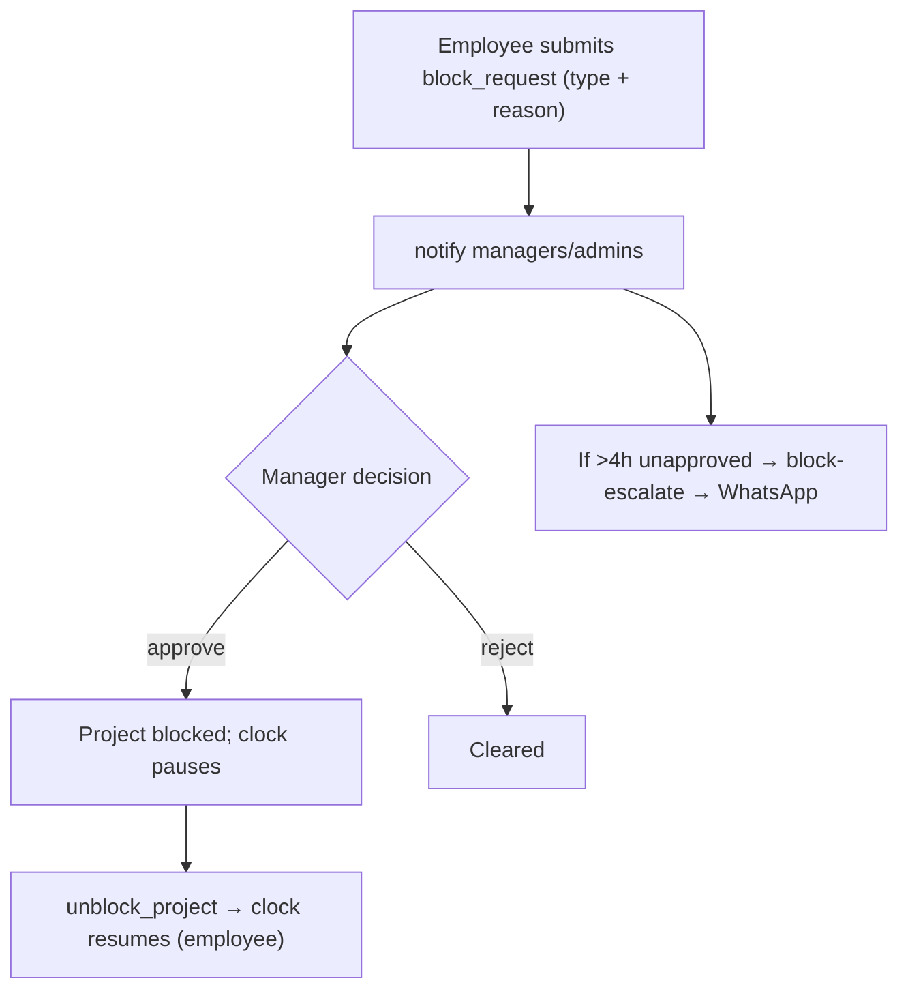

Block types (enum `block_type`): document_pending, client_unresponsive, authority_delay, payment_pending, internal_review, other.

## 8. Project Transfer

**Source:** `ProjectTransfer.tsx`, table `project_transfers`, RPCs `initiate_project_transfer`, `respond_project_transfer`, `cancel_project_transfer`; trigger reassigns timeline (`trg_stage_timeline_reassign`).

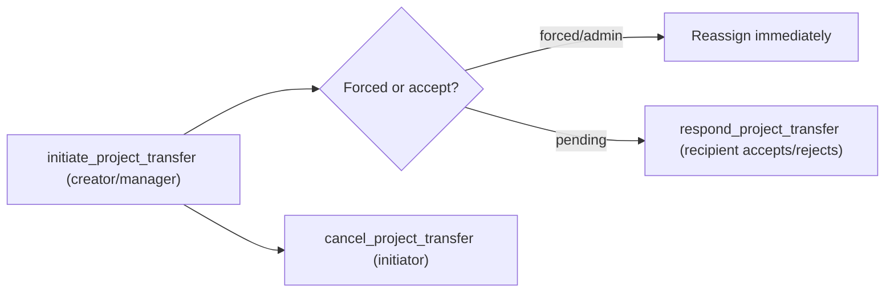

## 9. Project Cancellation

**Source:** table `cancel_requests`, RPC `approve_cancel_request`; trigger `fn_notify_cancel_request`.

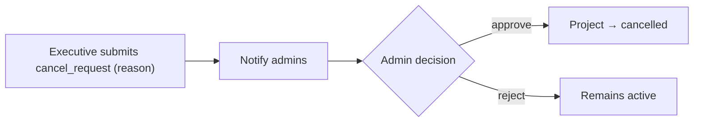

## 10. Authority Query (Deficiency) Rounds

**Source:** `tabs/QueriesTab.tsx`, `useAuthorityQueries`; tables `authority_queries` (append-only), `query_points`.

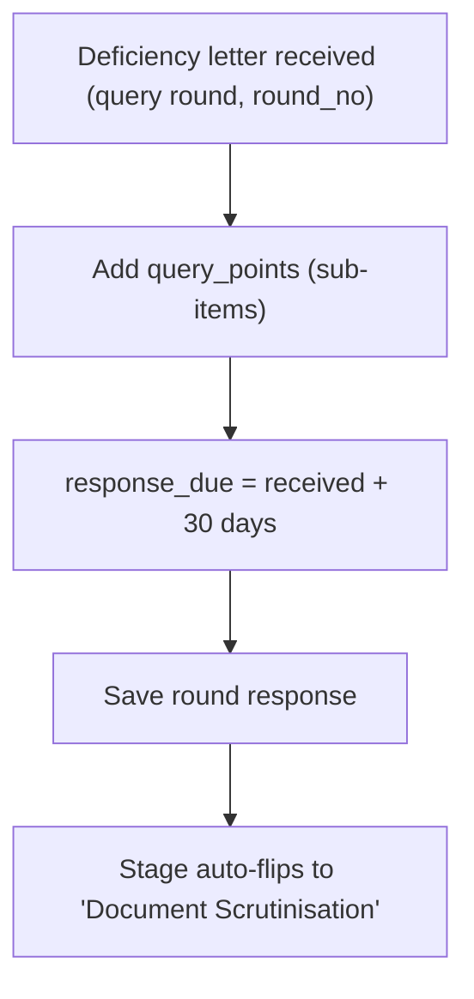

## 11. SOI Archive

**Source:** `tabs/SoiTab.tsx`, `useSoiArchive`; tables `soi_archive`, `soi_products` (dynamic columns via `data` jsonb). Domestic/export records; smart FSSAI table parser; edit-in-place; delete policy (migration 067).

## 12. Payment Workflow

**Source:** `tabs/PaymentsTab.tsx`, `usePayments`; table `payments`; project rollup columns; trigger `fn_recalc_project_payment`; mark-complete/unlock (migration 062); edge `notify-payment-weekly`.

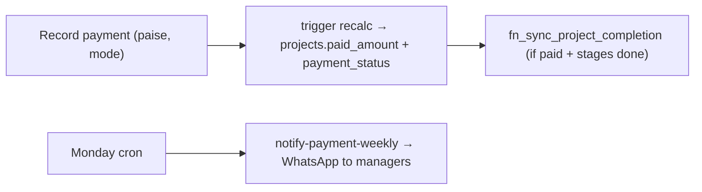

Payment statuses (enum `payment_status`): pending, partial, paid, overdue, refunded. Money in paise.

## 13. Task Workflow

**Source:** `src/pages/tasks/*`, `useTasks`; tables `tasks`, `task_comments`, `task_extension_requests`; triggers `tasks_stamp_completed`, `tasks_guard_update`; RPCs `request_task_extension`, `decide_task_extension`; edge `urgent-alerts`.

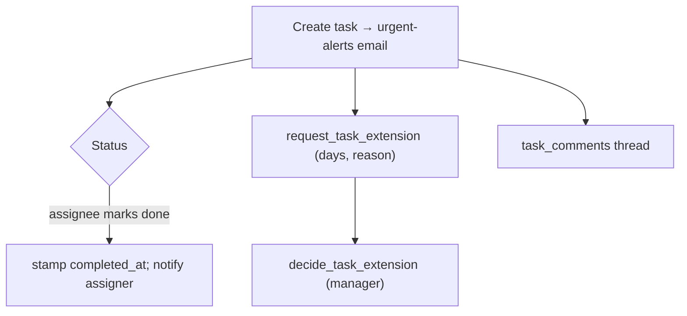

Edit/done permissions enforced by `tasks_guard_update` (assignee can mark done; assigner/admin can edit).

## 14. Attendance Punch

**Source:** `AttendancePage.tsx`, `useAttendance`, `punch_attendance` RPC (migrations 019→076→077), edge `attendance-verify-punch`.

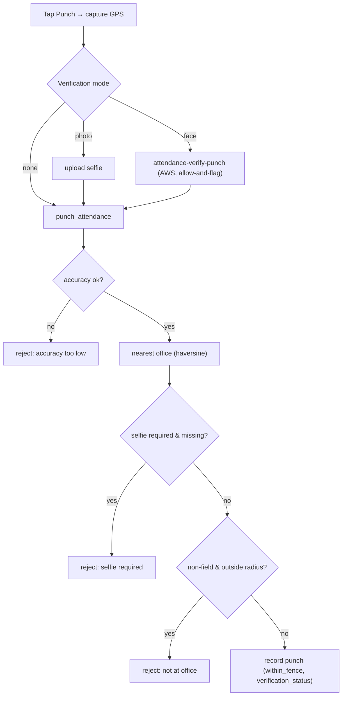

**Business rules:** office staff must be within office `radius_m`; field staff (`is_field_staff`) exempt; face never blocks a punch (records + flags verified/no_match/unverified).

## 15. Face Enrollment

**Source:** `FaceScanRing.tsx`, edge `attendance-enroll-face`. First punch with no reference → guided ring (look center → move head U/D/L/R). Center capture stored to `face-refs/<uid>/reference.jpg`; `profiles.face_enrolled_at` set. Admin/self reset supported. **Legacy** on-device enrollment (`useFaceEnrollment.ts`, `FaceCapture.tsx`) is present but **not used**.

## 16. Face Login

**Source:** `LoginPage.tsx`, edge `face-login`. Identifier + face photo → AWS CompareFaces vs reference → magic-link token → `verifyOtp`. Password login is always available as fallback.

## 17. Notification & Reminder Workflows

**Source:** DB triggers (`notify_project_created`, `fn_notify_block_request`, `fn_notify_cancel_request`, `fn_notify_admins`); edge dispatchers (`notify-dispatch`, `block-escalate`, `daily-reminders`, `urgent-alerts`, `notify-payment-weekly`); `send-whatsapp`.

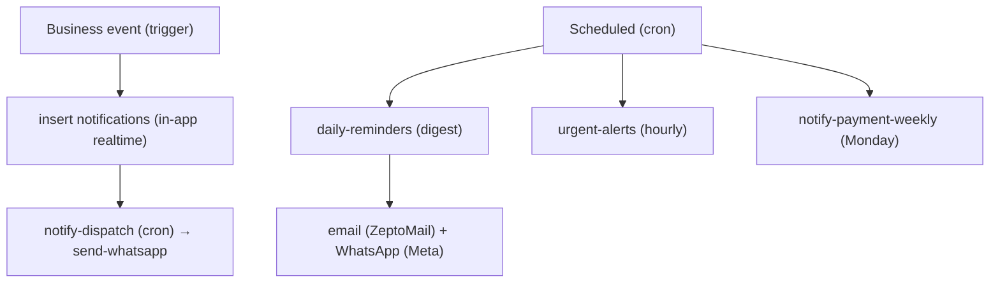

Dedup via `notification_log`; WhatsApp gated by `app_settings.whatsapp_enabled`; templates authored in "English (en)".

## 18. Referral Tracking

**Source:** `ReferralsPage.tsx`, `useReferrals`; tables `referrals`, `clients.referral_id`. Referral sources link to clients; revenue rollup per referral.

## 19. Cross-Workflow Automation (triggers)

| Event | Trigger/Function | Effect |
|---|---|---|
| Project insert | `create_stages_from_template`, `generate_project_code`, `notify_project_created` | stages seeded, code assigned, notification |
| Stage status/clock change | `trg_stage_timeline_capture`, `fn_audit_stage_changes` | timeline row, audit log |
| Payment insert | `fn_recalc_project_payment` | project payment rollup |
| Stage/payment change | `fn_sync_project_completion` | auto-complete project |
| Block/cancel request | `fn_notify_block_request`, `fn_notify_cancel_request` | admin notifications |
| Any updated_at | `moddatetime` | timestamp maintenance |

---

*Grounded in source at commit `9558f90`. No application code modified.*
