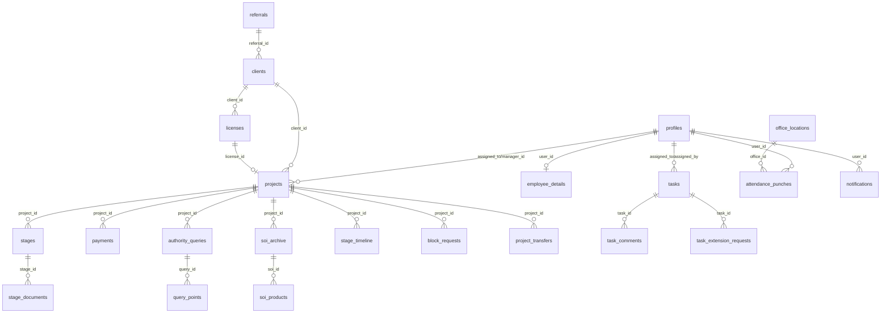

# TPS-OMS — Database Documentation (05)

**Purpose:** Definitive PostgreSQL reference — extensions, enums, tables, functions, triggers, views, RLS, storage, and scheduled jobs, all derived from `supabase/migrations/*`.
**Scope:** Database layer only. API surface in Doc 06; security analysis in Doc 07.
**Related Documents:** `01_PROJECT_INVENTORY.md`, `02_SYSTEM_ARCHITECTURE.md`, `06_API_REFERENCE.md`, `07_SECURITY_AUDIT.md`.
**Version:** 1.0 · **Creation Date:** 2026-07-14 · **Last Verification Date:** 2026-07-14
**Repository Branch:** `main` · **Commit Hash:** `9558f90` (working tree; docs uncommitted)

> All object counts are exact and command-verified against `supabase/migrations/001…077` (77 migrations). Live database objects created outside migrations are marked **Not Verifiable from Source Code**.

## Table of Contents
1. Overview & Counts
2. Extensions
3. Enum Types (11)
4. Tables (40)
5. Functions / RPCs (52)
6. Triggers (27)
7. Views (2)
8. Row-Level Security Model
9. Storage Buckets
10. Scheduled Jobs (pg_cron)
11. Entity Relationships
12. CAPA / Security Migrations (071–074)
13. Money & Code Conventions

---

## 1. Overview & Counts (exact)

| Object | Count |
|---|---|
| Migrations | 77 (001–077), 5,409 LOC |
| Extensions | 5 |
| Enum types | 11 |
| Tables | 40 |
| Functions/RPCs (distinct names) | 52 |
| Triggers (distinct names) | 27 |
| Views | 2 (SECURITY INVOKER) |
| Storage buckets (created in migrations) | 3 (+1 referenced, not created in migrations) |

## 2. Extensions

`uuid-ossp`, `pg_cron`, `supabase_vault`, `moddatetime` (migration 001); `pg_net` (005/028).

## 3. Enum Types (11) — exact values from source

| Enum | Values | Migration |
|---|---|---|
| `user_role` | super_admin, director, manager, executive, accounts, hr, auditor | 001 |
| `clock_type` | employee, client, authority | 001 |
| `block_type` | document_pending, client_unresponsive, authority_delay, payment_pending, internal_review, other | 001 |
| `project_status` | active, on_hold, completed, cancelled, archived | 001 |
| `stage_status` | pending, in_progress, blocked, completed, skipped **+ not_required** | 001 (+030) |
| `payment_status` | pending, partial, paid, overdue, refunded | 001 |
| `document_type` | client_upload, tps_prepared, authority_issued, soi, invoice, other | 001 |
| `query_type` | deficiency_letter, additional_info, inspection_notice, show_cause, other | 001 |
| `notification_type` | stage_overdue, expiry_warning, block_request, block_approved, payment_overdue, query_received, license_expiring, project_assigned **+ block_rejected, unblock_request, cancel_request, cancel_approved, cancel_rejected** | 001 (+068) |
| `client_document_category` | gst, pan, fssai, other | 009 |
| `project_transfer_status` | pending, accepted, rejected, cancelled | 012 |

## 4. Tables (40)

| # | Table | Purpose | First migration |
|---|---|---|---|
| 1 | `profiles` | user accounts (extends auth.users); role, permission flags, employee fields, face fields | 002 |
| 2 | `employee_details` | sensitive HR PII (Aadhaar/PAN/address), strict RLS | 018 |
| 3 | `clients` | client companies (GSTIN/PAN, client_code, referral_id) | 002 |
| 4 | `licenses` | FSSAI licences per client (type, dates, vault credential ref) | 002 |
| 5 | `credential_access_log` | append-only credential reveal audit | 002 |
| 6 | `client_documents` | client-level document attachments (legacy path) | 009 |
| 7 | `referrals` | referral sources | 025 |
| 8 | `projects` | engagements (project_code, service_type, clocks, block, payment rollup) | 002 |
| 9 | `code_counters` | per-year project code counter | 010 |
| 10 | `project_products` | products per project (artwork) | 031 |
| 11 | `project_remarks` | project annotations | 069 |
| 12 | `stages` | workflow stages (status, active_clock, doc_status, fssai_status, meta) | 002 |
| 13 | `stage_templates` | service_type → stage sequence blueprint | 004 |
| 14 | `stage_timeline` | append-only clock history (duration_min generated) | 002 |
| 15 | `stage_documents` | versioned stage attachments | 034 |
| 16 | `authority_queries` | deficiency letters (round_no, response_due) | 002 |
| 17 | `query_points` | sub-items within a query | 069 |
| 18 | `soi_archive` | Statement of Intent records | 002 |
| 19 | `soi_products` | SOI products with dynamic `data` jsonb | 040 |
| 20 | `payments` | payment records (paise, mode) | 002 |
| 21 | `block_requests` | employee block requests + manager decision | 002 |
| 22 | `documents` | project/authority documents (versioned) | 002 |
| 23 | `notifications` | in-app notifications (+ whatsapp_sent_at) | 002 |
| 24 | `notification_log` | dedup log for generated notifications | 027 |
| 25 | `knowledge_base` | internal wiki articles | 002 |
| 26 | `performance_reports` | periodic staff metrics | 002 |
| 27 | `stage_audit_log` | append-only stage change log | 065 |
| 28 | `audit_log` | append-only system actions | 002 |
| 29 | `cancel_requests` | project cancellation requests | 006 |
| 30 | `delete_requests` | data deletion requests | 006 |
| 31 | `office_locations` | attendance geofence anchors | 019 |
| 32 | `attendance_settings` | singleton attendance config | 019 |
| 33 | `attendance_punches` | immutable punch records | 019 |
| 34 | `tasks` | tasks (task_code, status, priority) | 027 |
| 35 | `task_comments` | task discussion | 029 |
| 36 | `task_extension_requests` | deadline extensions | 029 |
| 37 | `reminder_settings` | notification preferences | 047 |
| 38 | `app_settings` | singleton app config (whatsapp, drive) | 005 |
| 39 | `whatsapp_log` | WhatsApp send audit | 005 |
| 40 | `project_transfers` | project handoff workflow | 012 |

## 5. Functions / RPCs (52)

Grouped (all names verified as distinct `CREATE FUNCTION` targets):

- **Auth/session:** `has_role`, `auth_role`, `admin_create_user`, `admin_reset_password`, `resolve_login_email`, `check_login_locked`, `record_login_attempt`.
- **Credentials:** `store_fssai_credential`, `reveal_fssai_credential`.
- **Project lifecycle:** `generate_project_code`, `delete_client`, `delete_project`, `generate_artwork_product_stages`, `create_stages_from_template`, `fn_add_working_days`.
- **Blocks/cancel:** `approve_block_request`, `unblock_project`, `approve_cancel_request`.
- **Transfers:** `initiate_project_transfer`, `respond_project_transfer`, `cancel_project_transfer`.
- **Attendance:** `punch_attendance`.
- **Tasks:** `request_task_extension`, `decide_task_extension`, `tasks_stamp_completed`, `tasks_guard_update`.
- **Payments/completion:** `fn_recalc_project_payment`, `fn_sync_project_completion`.
- **Notifications:** `notify_project_created`, `fn_notify_project_completed`, `fn_notify_stage_assigned`, `fn_notify_block_request`, `fn_notify_cancel_request`, `fn_notify_admins`.
- **Timeline/reporting:** `trg_stage_timeline_capture`, `close_open_timeline_row`, `trg_project_assigned_at`, `trg_stage_timeline_reassign`, `create_initial_timeline`, `rpc_project_timeline`, `rpc_stage_performance`, `rpc_employee_timeline`, `rpc_ontime_report`, `rpc_employee_summary`.
- **Codes/clients:** `fn_set_client_code`, `generate_query_code`, `generate_task_code`, `fn_can_edit_clients`, `fn_can_view_all_projects`, `fn_can_assign`.
- **Audit/drive:** `fn_audit_stage_changes`, `set_entity_drive_folder`.

*(Exact per-function argument lists and SECURITY DEFINER/INVOKER classification are captured in Doc 06 §RPC for the callable RPCs; the remainder are trigger functions.)*

## 6. Triggers (27)

Categories: `moddatetime` (updated_at maintenance on profiles/clients/licenses/projects/stages/knowledge_base/tasks); code generators (project/client/query/task); `create_stages_from_template` + `create_initial_timeline` (project/stage insert); `trg_stage_timeline_capture` + `trg_project_assigned_at` + `trg_stage_timeline_reassign` (timeline); `fn_recalc_project_payment` + `fn_sync_project_completion` (payments/completion); notification triggers (project created/completed, stage assigned, block/cancel request); `fn_audit_stage_changes`; task completion/guard triggers.

## 7. Views (2)

| View | Security | Purpose | Migration |
|---|---|---|---|
| `attendance_days` | INVOKER | daily punch rollup (first_in, last_out, worked_minutes) | 019 |
| `v_stage_timeline` | INVOKER (set in 071) | clock timeline for reporting | 056 / 071 |

## 8. Row-Level Security Model

- **RLS enabled on all tables.** Primary predicate: `has_role(variadic user_role[])` (SECURITY DEFINER, stable) / `auth_role()`, with owner fallbacks (`auth.uid()`, `created_by`, `assigned_to`).
- **Read-broad, write-scoped** for operational tables (clients/projects/stages/payments: all staff read; manager+/owner write).
- **Strict** on `employee_details` (self or HR/admin), `credential_access_log` (append-only), audit tables (no update/delete).
- **Singleton settings** (`attendance_settings`, `app_settings`): authenticated read, director+ write.
- Hardened in migrations 052, 072, 074 (see §12).

## 9. Storage Buckets

| Bucket | Created in migration? | Visibility | Purpose |
|---|---|---|---|
| `avatars` | Yes (015) | Public | profile photos |
| `attendance` | Yes (019) | Private | punch selfies |
| `face-refs` | Yes (075) | Private | reference faces |
| `documents` | **No — referenced by RLS policies only (009, 034); no `insert into storage.buckets`** | Private (per policy) | client/stage attachments |

> The `documents` bucket's **creation is Not Verifiable from Source Code** — RLS policies in 009/034 assume it exists (likely created via the Supabase dashboard). Its RLS: read by authenticated for `clients/`/`stages/` prefixes; write/delete scoped.

## 10. Scheduled Jobs (pg_cron)

Cron schedules present in migration source: **004** (vault/cron seed — multiple jobs), **005** (WhatsApp schema — 2 jobs), **028** (`tps-daily-reminders` `30 3 * * *`, `tps-urgent-alerts` `0 * * * *`). Migration 027 notes reminder cron "added later".

> The **live database contains additional cron jobs** (e.g., invoking `notify-dispatch`, `block-escalate`, `notify-payment-weekly`) observed operationally. Which migration (if any) schedules each of those is **Not Verifiable from Source Code** in this pass; treat migrations 004/005/028 as the authoritative repo-defined schedule set.

## 11. Entity Relationships

Full FK constraint enumeration per table beyond the above is **not exhaustively listed** here; migration 073 added 45 FK covering indexes.

## 12. CAPA / Security Migrations (071–074)

- **071:** `v_stage_timeline` → SECURITY INVOKER; `search_path=public` pinned on 11 functions.
- **072:** replaced `USING(true)` permissive RLS on `cancel_requests`, `delete_requests`, `query_points`, `soi_products` with scoped policies.
- **073:** added 45 FK covering indexes.
- **074:** dropped duplicate `stage_timeline_stage_idx`; revoked anon `EXECUTE` on `admin_create_user`, `admin_reset_password`, `delete_client`, `delete_project`.

## 13. Money & Code Conventions

- **Money in paise** (integer): `projects.quoted_amount/paid_amount`, `payments.amount`.
- **Auto codes** (triggers): `TPS-YYYY-NNNN` (projects), `TPS-CLI-NNNN` (clients), `TSK-NNNN` (tasks), `QRY-NNNN` (queries).

---

*Grounded in migration source at commit `9558f90`. No application code modified.*
