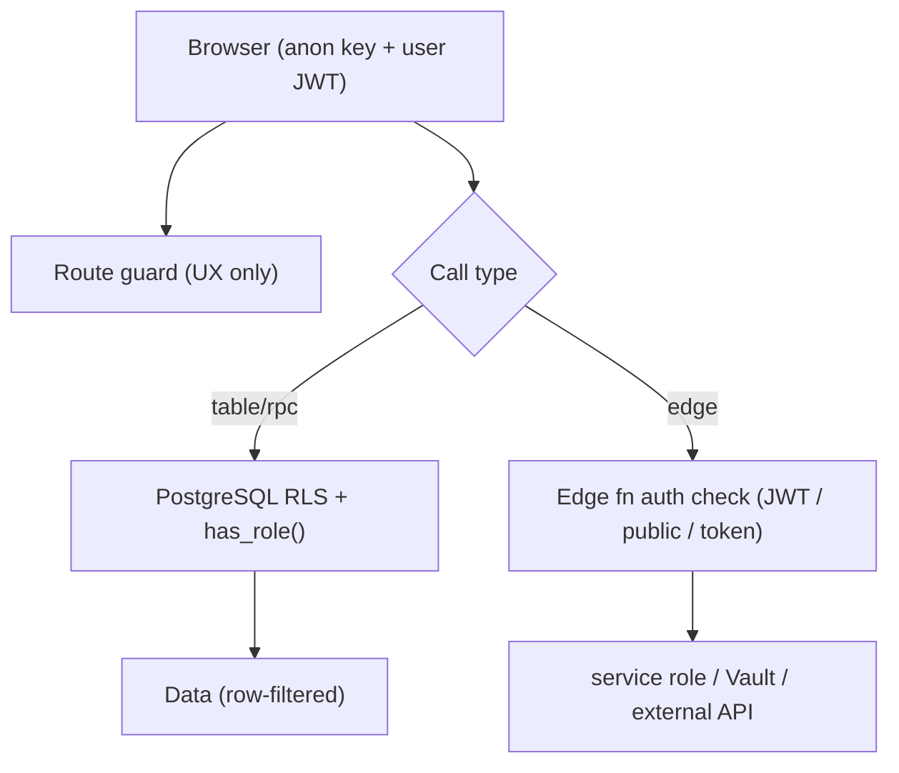

# TPS-OMS — Security Audit (07)

**Purpose:** Document the security controls actually implemented in the repository and observed gaps — a source-grounded security posture assessment (observations are factual, not remediation plans).
**Scope:** AuthN/AuthZ, secrets, RLS, edge-function posture, storage, transport, audit logging. Deployment security in Doc 08.
**Related Documents:** `02_SYSTEM_ARCHITECTURE.md`, `05_DATABASE_DOCUMENTATION.md`, `06_API_REFERENCE.md`, `08_DEPLOYMENT_INFRASTRUCTURE.md`.
**Version:** 1.0 · **Creation Date:** 2026-07-14 · **Last Verification Date:** 2026-07-14
**Repository Branch:** `main` · **Commit Hash:** `9558f90` (working tree; docs uncommitted)

> Every control is cited to source. Where a control's runtime configuration lives outside the repo (Supabase dashboard/secrets), it is marked **Not Verifiable from Source Code**.

## Table of Contents
1. Security Model Summary
2. Authentication Controls
3. Authorization Controls (RLS + roles)
4. Role & Permission Matrix
5. Secrets Management
6. Edge Function Auth Posture
7. Credential Vault
8. Storage Security
9. Transport & CORS
10. Audit Logging
11. Session Security
12. CAPA Security Hardening (071–074)
13. Observed Security Characteristics & Gaps
14. Not Verifiable / Out-of-Repo Controls

---

## 1. Security Model Summary

Security is enforced **primarily at the database** (Row-Level Security + `SECURITY DEFINER` RPCs), with the SPA route-guards providing UX gating only. External/privileged operations are isolated into edge functions with explicit auth checks. Secrets never reach the repo or the browser (only `VITE_*` public keys are client-exposed).

## 2. Authentication Controls

- **Supabase Auth (JWT).** Client config `src/lib/supabase.ts` (`persistSession`, `autoRefreshToken`, `storageKey tps-oms-auth`).
- **Password login** (`LoginPage.tsx`): `check_login_locked` → `resolve_login_email` → `signInWithPassword` → `record_login_attempt`.
- **Brute-force lockout:** 5 failed attempts / 15 min lock (`check_login_locked` + `record_login_attempt`, migrations 020/021/023/024).
- **Face login (passwordless):** `face-login` edge → magic-link `verifyOtp`. Password fallback always present.
- **Password reset:** admin via `admin_reset_password` (revokes sessions, migration 024); self via `auth.updateUser`.

## 3. Authorization Controls

- **RLS on all tables** (Doc 05 §8). Predicate: `has_role(variadic user_role[])`/`auth_role()` (SECURITY DEFINER, stable) + owner checks.
- **SECURITY DEFINER RPCs** for privileged actions; `search_path=public` pinned (071); anon `EXECUTE` revoked on admin RPCs (074).
- **Client guard** (`ProtectedRoute.tsx`) — redirects unauthenticated → `/login`, role-mismatch → `/dashboard`. **Advisory only**; RLS is the real boundary. A null-profile bypass was explicitly closed (comment in `ProtectedRoute.tsx` lines 46–51).

## 4. Role & Permission Matrix

Roles: super_admin, director, manager, executive, accounts, hr, auditor. Constants in `src/types/index.ts`; DB helpers `fn_can_edit_clients`, `fn_can_view_all_projects`, `fn_can_assign`.

| Capability | Roles (from source constants) |
|---|---|
| Payment access | super_admin, director, manager, accounts |
| Close project | super_admin, director, manager |
| Reveal credentials | super_admin, director, manager |
| Assign work | super_admin, director, manager |
| Approve blocks | super_admin, director, manager |
| Edit clients | super_admin OR `can_edit_clients` flag |
| Settings / User Mgmt (routes) | super_admin, director |
| Employees (route) | super_admin, director, manager, hr |
| Reports/queries (route) | super_admin, director, manager (or `report_permissions`) |

Per-user flags on `profiles`: `can_edit_clients`, `can_be_assigned`, `can_assign`, `can_view_all_projects`, `report_permissions`.

## 5. Secrets Management

- **Client:** only `VITE_SUPABASE_URL`, `VITE_SUPABASE_ANON_KEY` reach the browser (public by design). `.env.local` gitignored; `.env.example` placeholders only.
- **Edge secrets (server-side, names only):** `SUPABASE_SERVICE_ROLE_KEY`, `AWS_ACCESS_KEY_ID/SECRET`, `ZEPTOMAIL_TOKEN`, `MAIL_FROM`, `DRIVE_SUB_EMAIL`, `SITE_URL`, `SHEETS_SYNC_TOKEN`.
- **DB-stored config:** `app_settings.whatsapp_api_key`, `whatsapp_phone_number_id`; Google service-account JSON in **Supabase Vault** (`get_google_sa_json`).
- Actual secret values are **Not Verifiable from Source Code** (correctly absent from repo).

## 6. Edge Function Auth Posture (from code)

| Function | Posture | Note |
|---|---|---|
| `attendance-enroll-face`, `attendance-verify-punch`, `invite-user`, `drive-ops` | **User JWT verified** | `getUser(token)`; `invite-user`/`drive-ops` add role checks |
| `face-login` | **Public** (`verify_jwt=false`) | pre-auth by necessity; AWS match gates token issuance |
| `sheets-sync` | **Token** (`x-sync-token`) | 401 on mismatch |
| `send-whatsapp` | **Service-key caller** | public endpoint; relies on caller holding service role |
| `notify-dispatch`, `block-escalate`, `daily-reminders`, `urgent-alerts`, `notify-payment-weekly`, `test-mail` | **Public** | invoked by pg_cron; idempotent/dedup logic limits effect |

## 7. Credential Vault

FSSAI portal passwords stored via `store_fssai_credential` (Supabase Vault). `reveal_fssai_credential` decrypts, is role-gated (manager+), and **appends `credential_access_log`** (append-only). UI auto-hides after 30s (`CredentialReveal.tsx`).

## 8. Storage Security

- `avatars` public; `documents`/`attendance`/`face-refs` private with owner+manager read policies.
- Attendance photos served via **short-lived signed URLs (1h)** (`AttendancePhotosPage.tsx`).
- `face-refs` write restricted to owner; read owner+manager.
- Storage deletes blocked at SQL level (must use Storage API) — observed operationally (migration/policy design).

## 9. Transport & CORS

- All traffic over HTTPS (Supabase + GitHub Pages).
- `drive-ops` restricts CORS to `https://portal.tpsxpert.com`; other edge functions use permissive CORS headers (`*`) in code.
- `index.html` sets `noindex`.

## 10. Audit Logging

Append-only audit tables: `audit_log`, `stage_audit_log`, `credential_access_log`, `whatsapp_log`, `notification_log`. Login attempts recorded via `record_login_attempt`. No external SIEM in repo.

## 11. Session Security

- Remember-me: `localStorage` (persist) vs `sessionStorage` (tab-only) via `tps_remember` flag (`src/lib/supabase.ts`).
- **Idle auto-logout: 15 min** (`useIdleLogout.ts`). *(Toast copy still reads "30 minutes" — cosmetic inconsistency, not a control defect.)*
- `autoRefreshToken` on; admin password reset revokes sessions (024).

## 12. CAPA Security Hardening (071–074)

- 071: view→SECURITY INVOKER; `search_path` pinned on 11 functions (mutable search_path hardening).
- 072: removed `USING(true)` permissive RLS on 4 tables.
- 073: 45 FK indexes (perf, indirectly DoS-resistance).
- 074: dropped duplicate index; revoked anon EXECUTE on 4 admin RPCs.

## 13. Observed Security Characteristics & Gaps (factual)

- **Client-side authorization is advisory**; data protection depends on RLS (a route bypass yields no data). *(Design characteristic.)*
- **Public cron edge endpoints** (`verify_jwt=false`) are reachable HTTP endpoints; effect limited by idempotency/dedup/limits, but they accept unauthenticated POSTs.
- **`send-whatsapp`** trusts callers holding the service key; a leaked service key would allow arbitrary sends (secret handling is out-of-repo).
- **Permissive CORS (`*`)** on most edge functions (except `drive-ops`).
- **No monitoring/alerting for auth anomalies** in repo (audit tables exist; no active alerting).
- **Legacy face columns/models** remain (`profiles.face_descriptor`, `public/models/*`) though unused — dormant surface area.
- **Face verification is "allow-and-flag"** — a non-matching/uncertain face does not block a punch (business decision; recorded + flagged for review).

## 14. Not Verifiable / Out-of-Repo Controls

- Actual secret values, Supabase RLS deployment state on the live DB, and the live `pg_cron` job set.
- MFA/2FA configuration, password policy, rate limiting at the Supabase/edge gateway.
- WAF/CDN/DDoS protections at the hosting layer.
- Whether all migrations are applied identically to production.

---

*Grounded in source at commit `9558f90`. No application code modified. This is an observational audit, not a remediation plan.*
