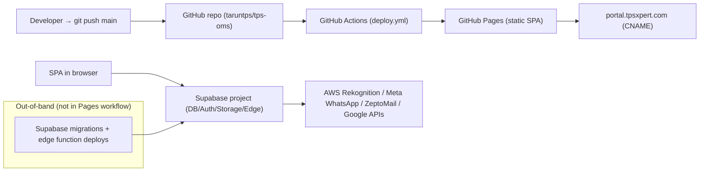
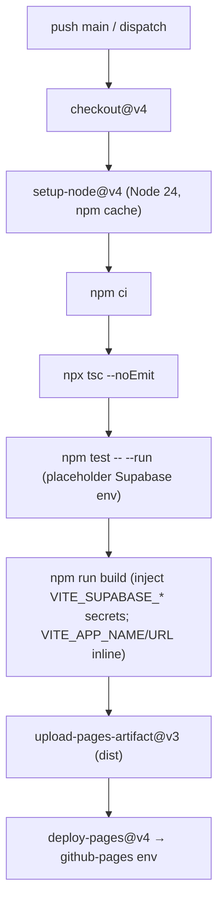

# TPS-OMS — Deployment & Infrastructure (08)

**Purpose:** Document how the system is built, deployed, hosted, and configured, based on repository CI/CD and config files.
**Scope:** Build, CI/CD, hosting, domain, environment config, and out-of-band deploys. Runtime security in Doc 07.
**Related Documents:** `02_SYSTEM_ARCHITECTURE.md`, `07_SECURITY_AUDIT.md`, `09_PRODUCTION_READINESS.md`.
**Version:** 1.0 · **Creation Date:** 2026-07-14 · **Last Verification Date:** 2026-07-14
**Repository Branch:** `main` · **Commit Hash:** `9558f90` (working tree; docs uncommitted)

## Table of Contents
1. Topology
2. Build Pipeline (`package.json`)
3. CI/CD (`deploy.yml`)
4. Hosting & Domain
5. SPA Routing on Static Host
6. Supabase Deployment (out-of-band)
7. Environment Configuration
8. Local Development
9. Infrastructure Not Verifiable from Source

---

## 1. Topology

## 2. Build Pipeline (`package.json`)

- `dev`: `vite` (port 5173)
- `build`: `tsc -b && vite build`
- `preview`: `vite preview`
- `lint`: `eslint src --ext ts,tsx`
- `test`: `vitest run`
- `predeploy`: `npm run build`; `deploy`: `gh-pages -d dist` (secondary manual path)

Build config: `vite.config.ts` (React plugin, `@`→`src`, `base:'/'`), `tailwind.config.ts`, `postcss.config.js`, `tsconfig*.json`.

## 3. CI/CD (`.github/workflows/deploy.yml`)

**Trigger:** push to `main` or manual `workflow_dispatch`. **Permissions:** `pages: write`, `id-token: write`. **Concurrency:** single (`group: pages`, cancel-in-progress).

- **Build-time secrets:** `secrets.VITE_SUPABASE_URL`, `secrets.VITE_SUPABASE_ANON_KEY`.
- **Test stage** runs with placeholder Supabase env (`https://placeholder.supabase.co` / `placeholder`).
- Gate order enforces typecheck + tests before build.

## 4. Hosting & Domain

- **Host:** GitHub Pages (static). **Artifact:** `dist/`.
- **Domain:** `public/CNAME` = `portal.tpsxpert.com`.
- **Favicon/SEO:** `index.html` (`logo.png`, `noindex`), Google Fonts + Material Symbols preconnect.

## 5. SPA Routing on Static Host

`public/404.html` stores the requested deep-link path in `sessionStorage`; `index.html` restores it on load (GitHub Pages SPA pattern). React Router (`BrowserRouter`) then renders the route.

## 6. Supabase Deployment (out-of-band)

- **Migrations** (`supabase/migrations/001…077`) and **edge functions** (`supabase/functions/*`) are deployed to Supabase **outside** the GitHub Pages workflow. The exact tool/pipeline (Supabase CLI, MCP, or dashboard) is **Not Verifiable from Source Code** — the repo contains no Supabase deploy workflow.
- No `supabase/config.toml` deploy automation is present in `.github/workflows/`.

## 7. Environment Configuration

| Scope | Variables (names only) | Source |
|---|---|---|
| Frontend (public) | `VITE_SUPABASE_URL`, `VITE_SUPABASE_ANON_KEY` (used); `VITE_APP_NAME`, `VITE_APP_URL` (declared, unused in `src/`) | `.env.example`, `deploy.yml` |
| Edge secrets | `SUPABASE_SERVICE_ROLE_KEY`, `AWS_ACCESS_KEY_ID/SECRET`, `ZEPTOMAIL_TOKEN`, `MAIL_FROM`, `DRIVE_SUB_EMAIL`, `SITE_URL`, `SHEETS_SYNC_TOKEN` | edge fn source |
| DB config | `app_settings` (whatsapp), `attendance_settings`, `reminder_settings`; Vault (Google SA) | migrations |

## 8. Local Development

- `.claude/launch.json`: `npm run dev` on port 5173.
- `.gitignore`: `node_modules`, `dist`, `.env.local`, `.env`, `*.local`, `.DS_Store`.

## 9. Infrastructure Not Verifiable from Source

- Supabase project plan/region/compute size, connection pooler settings, backups/PITR.
- GitHub Pages CDN/edge caching, custom TLS specifics.
- Live secret values and which secrets are actually configured in GitHub/Supabase.
- Whether all 77 migrations are applied to production identically.
- Any WAF/DDoS/monitoring at hosting or Supabase layer.

---

*Grounded in source at commit `9558f90`. No application code modified.*
