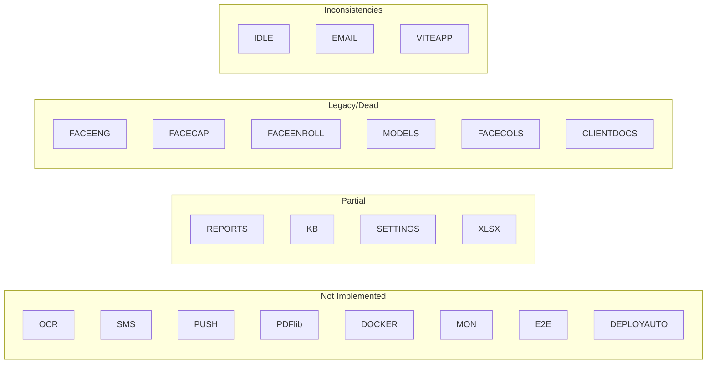

# TPS-OMS — Gap Analysis (10)

**Purpose:** Enumerate gaps observable in the repository — not-implemented features, partial implementations, inconsistencies, legacy/dead code, and verification gaps — each with evidence.
**Scope:** Factual gap identification only (no remediation plans, per instruction).
**Related Documents:** `01_PROJECT_INVENTORY.md`, `04_MODULE_DOCUMENTATION.md`, `07_SECURITY_AUDIT.md`, `09_PRODUCTION_READINESS.md`.
**Version:** 1.0 · **Creation Date:** 2026-07-14 · **Last Verification Date:** 2026-07-14
**Repository Branch:** `main` · **Commit Hash:** `9558f90` (working tree; docs uncommitted)

## Table of Contents
1. Method
2. Not-Implemented Features
3. Partial Implementations
4. Inconsistencies (code vs code / doc vs code)
5. Legacy / Dead Code
6. Configuration Gaps
7. Verification Gaps (Not Verifiable from Source Code)
8. Gap Register (summary table)

---

## 1. Method

Gaps were identified by (a) searching for absent capabilities in `package.json` + `src/` + `supabase/`, (b) cross-referencing Docs 01–09 against source, and (c) noting runtime facts confirmed during prior inspection. Every gap cites evidence. No gap is inferred without a source basis.

## 2. Not-Implemented Features (absent from repository)

| Feature | Evidence of absence |
|---|---|
| **OCR** | no OCR library or code path |
| **SMS** | no SMS provider; messaging is WhatsApp + email + in-app only |
| **Web/mobile push notifications** | no service worker / FCM / web-push |
| **Standalone PDF generation** | only Google Workspace→PDF export via `drive-ops`; no PDF library |
| **Docker / containerization** | no Dockerfile/compose |
| **Monitoring / APM / alerting** | no Sentry/Datadog/uptime config |
| **Health-check endpoint** | none in `src/` or edge functions |
| **Integration / E2E tests** | only 2 unit files |
| **Migration/edge-fn deploy automation** | no Supabase deploy workflow in `.github/` |
| **Backup / DR configuration** | none in repo (platform-managed) |

## 3. Partial Implementations

| Area | State | Evidence |
|---|---|---|
| **Reports UI** | RPCs (056) implemented; not every tab's render path traced | `PerformancePage.tsx`, `QueriesReportPage.tsx` |
| **Knowledge Base** | list/category UI present; full CRUD not fully traced | `KnowledgePage.tsx` |
| **Settings (Notification/Reminder sections)** | Attendance section fully wired; other sections' data wiring partially traced | `NotificationControlsSection.tsx`, `ReminderSettingsSection.tsx` |
| **`xlsx` (Excel export)** | dependency present; specific export call-sites not enumerated | `package.json` |
| **`documents` bucket** | referenced by RLS policies but never created in migrations | migrations 009/034 |

## 4. Inconsistencies

| Inconsistency | Evidence | Type |
|---|---|---|
| **Idle-logout copy** — toast says "30 minutes" but timeout is 15 min | `useIdleLogout.ts` line 6 (`IDLE_MS=15*60*1000`) vs line 25 (toast text) | Cosmetic (code) |
| **Email provider naming** — global project context references "Resend"; code uses **ZeptoMail** | edge fns use `ZEPTOMAIL_TOKEN`/`MAIL_FROM` | Doc-vs-code (code authoritative) |
| **`VITE_APP_NAME`/`VITE_APP_URL`** declared but unused in `src/` | grep: only 2 `VITE_*` vars referenced | Config-vs-code |
| **Two face implementations** — server-side active, on-device legacy both in tree | `faceEngine.ts`/`FaceCapture.tsx` vs `PlainCapture`/edge fns | Dual implementation |
| **`profiles.face_descriptor`/`face_model`** legacy columns unpopulated by active flow | migration 042 columns; active flow uses `face-refs` + `face_enrolled_at` | Schema legacy |

## 5. Legacy / Dead Code (present, not deleted per instruction)

| Item | Status |
|---|---|
| `src/lib/faceEngine.ts` | Legacy (on-device engine) |
| `src/pages/attendance/FaceCapture.tsx` | Legacy (unused in active flow) |
| `src/hooks/useFaceEnrollment.ts` | Legacy |
| `public/models/blazeface.*`, `faceres.*` | Legacy model weights |
| `profiles.face_descriptor`, `profiles.face_model` | Legacy columns |
| `src/pages/clients/ClientDocuments.tsx` (+ `documents` bucket path) | Superseded by Google Drive |

## 6. Configuration Gaps

- `documents` storage bucket creation absent from migrations (assumed dashboard-created).
- Live `pg_cron` schedule set exceeds migration-defined jobs (004/005/028); the scheduling of `notify-dispatch`/`block-escalate`/`notify-payment-weekly` is not confirmed in a migration.
- `@vladmandic/human` remains a `package.json` dependency though its code path is legacy (build weight impact).

## 7. Verification Gaps (Not Verifiable from Source Code)

- Whether all 77 migrations are applied to production identically.
- Live secret configuration (GitHub/Supabase) and Vault contents.
- Supabase plan/region/compute, backups/PITR, connection pooling.
- The exact tool that deploys migrations/edge functions.
- Full FK constraint set per table (only documented relationships verified).
- Per-report-tab and per-knowledge-CRUD render/data paths not exhaustively traced.

## 8. Gap Register (summary)

| Category | Count |
|---|---|
| Not-implemented features | 10 |
| Partial implementations | 5 |
| Inconsistencies | 5 |
| Legacy/dead items | 6 |
| Verification gaps | 6 |

---

*Grounded in source at commit `9558f90`. No application code modified. No remediation is prescribed here (by instruction).*
