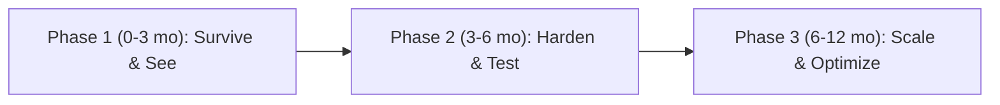

# TPS-OMS — Enterprise Architecture Review (14)

**Purpose:** A critical, CTO-level engineering-quality review of the platform, assessed for a 10-year horizon. Unlike Docs 01–13 (which describe the system), this document **evaluates** it and **recommends** improvements.
**Scope:** Engineering quality across ~40 dimensions; scores; maturity; ranked improvements; phased roadmap.
**Related Documents:** `01`–`13` (facts referenced here are verified there against source).
**Version:** 1.0 · **Creation Date:** 2026-07-14 · **Last Verification Date:** 2026-07-14
**Repository Branch:** `main` · **Commit Hash:** `9558f90` (working tree; docs uncommitted)

> All *facts* are source-verified (Docs 01–13). All *judgements/recommendations* are the reviewer's professional assessment. Items outside the repo are marked **Not Verifiable from Source Code**. No application code was modified. Effort scale: **S** ≤1 wk, **M** 1–4 wks, **L** 1–3 mo, **XL** 3 mo+ (single-engineer-equivalent).

## Table of Contents
1. Executive Verdict
2. Scores & Maturity
3. Category Reviews (1–40)
4. Top 100 Engineering Improvements (ranked)
5. Phased Roadmap (P1/P2/P3)
6. Closing Assessment

---

## 1. Executive Verdict

TPS-OMS is a **well-structured, security-forward serverless SPA** that already runs the business. Its standout strengths are **database-enforced authorization (RLS + SECURITY DEFINER RPCs)**, **typed end-to-end TypeScript**, a **clean feature-oriented structure**, and **pragmatic serverless simplicity** (no server to operate). It is genuinely impressive for a small team.

For a **10-year enterprise horizon**, the material risks are not in the domain logic but in the **operational envelope**: total single-vendor coupling to Supabase, **static hosting on GitHub Pages** for a business-critical app, **no monitoring/observability/alerting**, **near-zero automated test coverage**, **out-of-band (unversioned) database & edge-function deploys**, **no code splitting** (single ~1.3 MB bundle), **no disaster-recovery strategy in-repo**, and **retained legacy/dead code** (on-device face engine + 6.7 MB model dependency). None are fatal; all are addressable.

**Bottom line:** solid architecture, **early operational maturity**. Invest in observability, testing, deploy automation, and DR before scaling headcount or client volume.

## 2. Scores & Maturity

All scores 0–100, **higher = better**.

| Dimension | Score | Basis |
|---|---|---|
| **Overall Architecture** | **73** | clean serverless design + RLS; − vendor lock-in, hosting, deploy gaps |
| **Enterprise Readiness** | **57** | functional/secure; − observability, DR, testing, SLAs |
| **Technical-Debt Health** (100 = debt-free) | **64** | typed & modular; − legacy face code, single bundle, 2 tests |
| **Scalability** | **70** | SPA/edge scale; Postgres bottleneck; no cache/queue |
| **Security** | **80** | RLS + vault + hardening (071–074); − public cron, permissive CORS, no auth alerting |
| **Maintainability** | **77** | feature structure, types, migrations; − tests, dead code, OOB deploys |

**Production Maturity Level: 2.5 / 5** — between **Managed (2)** and **Defined (3)** on a 5-level scale (1 Initial → 2 Managed → 3 Defined → 4 Measured → 5 Optimizing). Rationale: repeatable build/deploy (CI gate) and consistent patterns (Defined traits), but no measurement/observability, DR, or test discipline (below Measured).

---

## 3. Category Reviews

Each: **Current → Strengths → Weaknesses → Risks → Severity → Recommendation → Effort → Business impact.**

### 1. Overall Architecture
- **Current:** Serverless SPA (React/Vite on GitHub Pages) + Supabase (DB/Auth/Storage/13 edge fns). No app server.
- **Strengths:** minimal ops surface; clear layering; DB-centric security.
- **Weaknesses:** all capability concentrated in one vendor; hosting mismatch (static host for a business app).
- **Risks:** vendor outage/price change; no abstraction seam to migrate off Supabase.
- **Severity:** High. **Recommend:** define a portability seam (data-access layer already exists via hooks; formalize it), evaluate managed hosting (Vercel/Cloudflare/Netlify) for edge/rollback/preview. **Effort:** M–L. **Impact:** resilience, negotiating leverage.

### 2. Frontend Architecture
- **Current:** React 18 + Router 6 + React Query; feature folders; Radix/Tailwind; single bundle (no splitting).
- **Strengths:** typed, consistent hook pattern, good separation.
- **Weaknesses:** **no code splitting** (one ~1.3 MB JS chunk; build warns >500 kB); legacy `@vladmandic/human` (6.7 MB models) still a dependency.
- **Risks:** slow first load on weak mobile networks (the very users punching attendance).
- **Severity:** Medium. **Recommend:** route-level `React.lazy`; drop the legacy face dependency; add `manualChunks`. **Effort:** S–M. **Impact:** faster field usage, lower bounce.

### 3. Backend Architecture
- **Current:** logic in Postgres (RPCs/triggers) + Deno edge functions.
- **Strengths:** no server to run; privileged logic isolated; strong RLS.
- **Weaknesses:** business rules split across SQL + edge + client; edge functions duplicated inline (e.g., rekognition inlined for MCP deploys — see Doc history).
- **Risks:** rule drift; hard to trace a workflow across 3 layers.
- **Severity:** Medium. **Recommend:** a source-of-truth map (Doc 03 helps); shared edge libraries; keep repo = deployed.  **Effort:** M. **Impact:** maintainability.

### 4. Database Architecture
- **Current:** 40 tables, 52 fns, 27 triggers, RLS everywhere; 77 additive migrations.
- **Strengths:** normalized, coded conventions, CAPA-hardened, FK-indexed (073).
- **Weaknesses:** heavy trigger/RPC logic (business logic in DB); some enums extended piecemeal (030/068); `documents` bucket not created in migrations.
- **Risks:** trigger cascades hard to test; migration-vs-prod drift **Not Verifiable**.
- **Severity:** Medium. **Recommend:** migration parity checks in CI; pgTAP tests for RPCs/RLS; document trigger side-effects. **Effort:** M–L. **Impact:** correctness, safe change.

### 5. Authentication
- **Current:** Supabase Auth (JWT); password + face; brute-force lockout; employee-code login.
- **Strengths:** lockout, magic-link face path, session strategy.
- **Weaknesses:** no MFA; password policy **Not Verifiable**; face-login is public edge fn.
- **Risks:** account takeover without MFA for admin roles.
- **Severity:** High (for admin roles). **Recommend:** MFA for super_admin/director; enforce password policy; rate-limit face-login. **Effort:** M. **Impact:** breach prevention.

### 6. Authorization
- **Current:** RLS + `has_role()` + SECURITY DEFINER; client guards advisory.
- **Strengths:** authoritative at DB; hardened (072/074).
- **Weaknesses:** policy text not tested; permission flags sprawl (`can_*`, `report_permissions`).
- **Risks:** a mis-scoped policy silently over-exposes rows.
- **Severity:** High. **Recommend:** automated RLS test suite (pgTAP / seeded roles); centralize permission logic. **Effort:** M. **Impact:** data-exposure prevention.

### 7. Face ID Implementation
- **Current:** server-side AWS Rekognition (active) + on-device `@vladmandic/human` (legacy, unused).
- **Strengths:** robust, non-blocking (allow-and-flag), timeouts, quality gate.
- **Weaknesses:** dual implementation; **no liveness/anti-spoof** (printed photo can pass); AWS cost per call.
- **Risks:** spoofed attendance; dead code confusion.
- **Severity:** Medium. **Recommend:** remove legacy path; add liveness (challenge already exists via head-turn during enroll — extend to punch); cost monitoring. **Effort:** M. **Impact:** integrity + cleanliness.

### 8. Attendance Architecture
- **Current:** geofence (haversine in RPC) + optional face; allow-and-flag; field-staff exemption.
- **Strengths:** never blocks a legit punch; admin review of photos.
- **Weaknesses:** geofence radius is a single data value (was 4 km → 500 m); no anti-GPS-spoof.
- **Risks:** location spoofing on rooted devices.
- **Severity:** Low–Medium. **Recommend:** device-integrity signals if available; per-office radius review. **Effort:** S–M. **Impact:** attendance trust.

### 9. Storage Architecture
- **Current:** 4 buckets (avatars/documents/attendance/face-refs) + Google Drive primary docs.
- **Strengths:** private buckets, signed URLs, owner/manager scoping.
- **Weaknesses:** `documents` bucket creation outside migrations; no lifecycle/retention policy; Drive dependency adds a second doc system.
- **Risks:** unbounded storage growth; two doc systems confuse users.
- **Severity:** Low. **Recommend:** retention/cleanup jobs; consolidate doc strategy; codify bucket creation. **Effort:** S–M. **Impact:** cost, clarity.

### 10. API Architecture
- **Current:** PostgREST + RPC + edge + storage via one client.
- **Strengths:** uniform, typed, RLS-filtered.
- **Weaknesses:** no API versioning; edge contracts implicit; no schema/OpenAPI for edge fns.
- **Risks:** breaking changes to edge payloads ripple silently.
- **Severity:** Medium. **Recommend:** version edge endpoints; document/validate payloads (zod at edge). **Effort:** M. **Impact:** safe evolution.

### 11. Edge Functions
- **Current:** 13 Deno functions; explicit auth posture.
- **Strengths:** isolation of external I/O; timeouts; allow-and-flag.
- **Weaknesses:** public cron endpoints (`verify_jwt=false`); permissive CORS; some inline-duplicated code; no per-function tests.
- **Risks:** unauthenticated POST abuse; drift between repo & deployed.
- **Severity:** Medium–High. **Recommend:** shared secret/header for cron endpoints; tighten CORS; edge unit tests; deploy from repo via CI. **Effort:** M. **Impact:** security + reliability.

### 12. Business Workflows
- **Current:** rich FSSAI workflow engine (stages/clocks/blocks/transfers/queries/SOI).
- **Strengths:** domain-faithful; automated via triggers.
- **Weaknesses:** complex trigger interplay; limited automated verification.
- **Risks:** silent workflow regressions on schema change.
- **Severity:** Medium. **Recommend:** workflow integration tests; state-machine documentation (Doc 03 started). **Effort:** M–L. **Impact:** correctness at scale.

### 13. Deployment
- **Current:** GitHub Actions → Pages (SPA). Migrations/edge deployed **out-of-band**.
- **Strengths:** CI gate (typecheck+test+build); single-concurrency.
- **Weaknesses:** DB/edge deploys not in CI, not versioned; no preview envs; no rollback story for DB.
- **Risks:** prod DB diverges from repo; risky manual deploys.
- **Severity:** High. **Recommend:** Supabase CLI deploy in CI (migrations + functions); staging project; migration parity check. **Effort:** M. **Impact:** deploy safety.

### 14. DevOps
- **Current:** one CI workflow; manual DB/edge ops.
- **Strengths:** reproducible frontend build.
- **Weaknesses:** no IaC, no environments (dev/stage/prod), no release process.
- **Risks:** change management gaps; human error.
- **Severity:** High. **Recommend:** environments + IaC (Supabase config as code); release checklist. **Effort:** L. **Impact:** operational safety.

### 15. Security
- **Current:** strong DB security + vault + hardening; see Doc 07.
- **Strengths:** RLS-first, audit tables, secrets server-side.
- **Weaknesses:** no MFA, public cron endpoints, permissive CORS, no auth-anomaly alerting, secret rotation **Not Verifiable**.
- **Risks:** admin compromise; abuse of open endpoints.
- **Severity:** High. **Recommend:** MFA, secret rotation policy, CORS tightening, alerting on failed logins/credential reveals. **Effort:** M–L. **Impact:** breach prevention.

### 16. Scalability
- **Current:** stateless SPA/edge; Postgres central; batch limits (≤50 notify).
- **Strengths:** horizontal on client/edge.
- **Weaknesses:** no caching layer, no queue, DB the bottleneck; realtime subscriptions per client.
- **Risks:** contention at higher concurrency; connection limits.
- **Severity:** Medium. **Recommend:** connection pooling review, read replicas if needed, queue for notifications, cache hot reads. **Effort:** L. **Impact:** growth headroom.

### 17. Reliability
- **Current:** allow-and-flag + timeouts prevent hard failures on face/AWS.
- **Strengths:** graceful degradation on external failure.
- **Weaknesses:** no retries/DLQ for cron dispatch; WhatsApp 502s observed (Doc logs); single region.
- **Risks:** dropped notifications; regional outage.
- **Severity:** Medium. **Recommend:** retry + dead-letter for dispatchers; idempotency keys; health checks. **Effort:** M. **Impact:** message delivery trust.

### 18. Availability
- **Current:** Pages + Supabase uptime (platform SLAs — **Not Verifiable** in repo).
- **Strengths:** static frontend is highly available.
- **Weaknesses:** no multi-region; no status page; RTO/RPO undefined.
- **Risks:** single-region Supabase outage = full outage.
- **Severity:** High. **Recommend:** define SLA/RTO/RPO; evaluate multi-region/read replica; status page. **Effort:** L–XL. **Impact:** business continuity.

### 19. Disaster Recovery
- **Current:** **none in repo**; relies on Supabase platform backups (**Not Verifiable**).
- **Weaknesses:** no documented restore drill, no export automation.
- **Risks:** data loss / long recovery on catastrophic failure.
- **Severity:** **Critical**. **Recommend:** automated DB backups + periodic restore drills; storage bucket backup; documented DR runbook. **Effort:** M. **Impact:** existential data protection.

### 20. Backup Strategy
- **Current:** platform-managed only (**Not Verifiable**); no repo artifact.
- **Severity:** **Critical**. **Recommend:** scheduled `pg_dump` to independent storage; storage snapshot; retention policy; verify restores. **Effort:** M. **Impact:** data safety.

### 21. Monitoring
- **Current:** **none in repo** (no APM/uptime/health).
- **Severity:** **Critical**. **Recommend:** uptime monitor, DB metrics dashboards, edge-fn error rates, synthetic checks on login/punch. **Effort:** M. **Impact:** MTTR, incident awareness.

### 22. Observability
- **Current:** audit tables + platform logs; no tracing/correlation IDs.
- **Severity:** High. **Recommend:** structured logs + correlation IDs across SPA→edge→DB; error tracking (Sentry). **Effort:** M. **Impact:** debuggability.

### 23. Logging
- **Current:** app audit tables (audit_log, credential_access_log, whatsapp_log, notification_log, stage_audit_log); login attempts.
- **Strengths:** good domain audit trail.
- **Weaknesses:** no centralized/queryable log store; no retention policy; no client error capture.
- **Severity:** Medium. **Recommend:** ship logs to a store; client error reporting; retention. **Effort:** M. **Impact:** forensics.

### 24. Maintainability
- **Current:** typed, feature-organized, numbered migrations.
- **Strengths:** consistency; strong docs (01–13).
- **Weaknesses:** legacy dead code; DB logic sprawl; minimal tests.
- **Severity:** Medium. **Recommend:** delete legacy; test critical paths; ADR discipline (Doc 12 started). **Effort:** M. **Impact:** velocity.

### 25. Testability
- **Current:** 2 unit test files; CI runs them.
- **Weaknesses:** no integration/E2E/component/RLS tests; DB logic largely untested.
- **Severity:** High. **Recommend:** pgTAP (RLS/RPC), Playwright (critical flows: login, punch, project create), component tests. **Effort:** L. **Impact:** regression safety.

### 26. Performance
- **Current:** single large bundle; indexed DB (073); realtime.
- **Weaknesses:** no code splitting; no CDN caching strategy documented; no query performance budget.
- **Severity:** Medium. **Recommend:** split bundle, lazy routes, image/asset optimization, query budgets. **Effort:** S–M. **Impact:** UX on mobile.

### 27. Technical Debt
- **Current:** legacy face engine + 6.7 MB dep; `documents` legacy path; idle-logout copy bug; enum piecemeal extensions.
- **Severity:** Medium. **Recommend:** debt backlog + scheduled paydown; remove dead code. **Effort:** M. **Impact:** long-term velocity.

### 28. Modularity
- **Current:** feature-based modules; shared libs.
- **Strengths:** good boundaries at page/hook level.
- **Weaknesses:** some large files (Doc 01 notes); cross-cutting logic in DB.
- **Severity:** Low. **Recommend:** split oversized files; extract shared domain logic. **Effort:** S–M. **Impact:** readability.

### 29. Separation of Concerns
- **Current:** UI/hooks/lib/DB reasonably separated.
- **Weaknesses:** business rules in 3 layers (client/edge/DB) blur ownership.
- **Severity:** Medium. **Recommend:** define which layer owns which rule; keep validation consistent (zod client + DB constraints). **Effort:** M. **Impact:** clarity.

### 30. Folder Structure
- **Current:** clean `pages/hooks/lib/components/types`; `supabase/{functions,migrations}`.
- **Strengths:** intuitive, scalable.
- **Weaknesses:** none material.
- **Severity:** Low. **Recommend:** keep; add `tests/` and `edge/_shared` conventions. **Effort:** S. **Impact:** onboarding.

### 31. Naming Conventions
- **Current:** consistent `use*` hooks, `fn_*`/`rpc_*`/`trg_*` DB names, coded IDs.
- **Strengths:** predictable.
- **Weaknesses:** `documents` overloaded (table + bucket); minor.
- **Severity:** Low. **Recommend:** disambiguate overloaded names in docs. **Effort:** S. **Impact:** clarity.

### 32. Coding Standards
- **Current:** ESLint + TS; typed.
- **Weaknesses:** no Prettier/format check in CI **Not Verifiable**; no pre-commit hooks in repo.
- **Severity:** Low. **Recommend:** add format + lint gates + pre-commit. **Effort:** S. **Impact:** consistency.

### 33. Error Handling
- **Current:** ErrorBoundary + Toast + edge try/catch + timeouts + RPC raises.
- **Strengths:** consistent, non-blocking on external failure.
- **Weaknesses:** errors not centrally captured/reported.
- **Severity:** Medium. **Recommend:** error tracking + user-facing error taxonomy. **Effort:** S–M. **Impact:** support.

### 34. Configuration Management
- **Current:** `VITE_*` (2 used), edge secrets, `app_settings`/`attendance_settings` in DB, Vault.
- **Strengths:** secrets server-side; runtime config in DB.
- **Weaknesses:** config spread across env/DB/Vault; 2 declared-unused `VITE_*` vars.
- **Severity:** Low. **Recommend:** config inventory + validation at startup. **Effort:** S. **Impact:** fewer misconfigs.

### 35. Environment Management
- **Current:** effectively single environment (prod); placeholder env in CI tests.
- **Weaknesses:** no staging; migrations tested against prod only (**Not Verifiable**).
- **Severity:** High. **Recommend:** dedicated staging Supabase project + preview deploys. **Effort:** M. **Impact:** safe change.

### 36. Dependencies
- **Current:** 57 dependency entries; modern versions; legacy `@vladmandic/human`.
- **Strengths:** mainstream, maintained libs.
- **Weaknesses:** heavy unused dep; no automated dependency scanning/updates (Dependabot) **Not Verifiable**.
- **Severity:** Medium. **Recommend:** Dependabot + audit in CI; drop unused. **Effort:** S. **Impact:** supply-chain safety.

### 37. Upgrade Strategy
- **Current:** none documented.
- **Severity:** Low–Medium. **Recommend:** periodic upgrade cadence; pin + test; Supabase/Deno runtime upgrade plan. **Effort:** S. **Impact:** avoid EOL drift.

### 38. Vendor Lock-in
- **Current:** deep Supabase coupling (auth/DB/storage/edge) + AWS/Meta/Google/ZeptoMail.
- **Weaknesses:** RLS, edge, Vault, auth are Supabase-specific; migration cost is high.
- **Risks:** pricing/roadmap/outage exposure.
- **Severity:** High. **Recommend:** keep the data-access seam (hooks) clean; standard SQL where possible; document exit cost. **Effort:** L. **Impact:** strategic flexibility.

### 39. Cost Optimization
- **Current:** GitHub Pages (free), Supabase, per-call AWS Rekognition, WhatsApp/email usage.
- **Weaknesses:** no cost monitoring; AWS per-punch cost scales with headcount; 6.7 MB dep inflates bandwidth.
- **Severity:** Medium. **Recommend:** cost dashboards; cache/limit AWS calls; drop unused deps; storage retention. **Effort:** S–M. **Impact:** unit economics.

### 40. Future Extensibility
- **Current:** feature-modular; HRM Phase 1 designed (specs in docs).
- **Strengths:** adding a module = page + hook + tables + policies.
- **Weaknesses:** DB-logic sprawl and lack of tests slow safe extension.
- **Severity:** Medium. **Recommend:** test harness + module template + ADRs to scale team. **Effort:** M. **Impact:** feature velocity.

---

## 4. Top 100 Engineering Improvements (ranked)

**Tier P0 — Critical (do first):**
1. Automated DB backups to independent storage + retention.
2. Periodic restore drills (verify backups).
3. DR runbook (RTO/RPO defined).
4. Uptime + synthetic monitoring (login/punch).
5. Error tracking (Sentry) across SPA + edge.
6. Edge-function error-rate & latency dashboards.
7. Staging Supabase project (stop testing on prod).
8. Migrations + edge deploys via CI (Supabase CLI).
9. Migration parity check (repo vs prod).
10. MFA for super_admin/director.
11. Secret rotation policy + inventory.
12. RLS automated test suite (pgTAP, seeded roles).
13. Backup of storage buckets (attendance/face-refs/documents).
14. Alerting on failed logins & credential reveals.
15. Auth-anomaly detection (lockout events dashboard).

**Tier P1 — High:**
16. Route-level code splitting (`React.lazy`).
17. Remove legacy `@vladmandic/human` + models (−6.7 MB).
18. `manualChunks` / vendor chunking.
19. Playwright E2E for login, punch, project-create, payment.
20. pgTAP tests for critical RPCs (punch_attendance, credential vault).
21. Tighten CORS on all edge functions.
22. Shared-secret/header auth for cron edge endpoints.
23. Retry + dead-letter for notification dispatchers.
24. Idempotency keys for WhatsApp/email sends.
25. Structured logging + correlation IDs.
26. Centralized log store + retention.
27. Client error reporting.
28. Zod validation at edge-function boundaries.
29. Edge-function unit tests.
30. Versioning strategy for edge endpoints.
31. Delete dead code (FaceCapture, faceEngine, useFaceEnrollment).
32. Codify `documents` bucket creation in a migration.
33. Reconcile live pg_cron with migrations (version all cron).
34. Password policy enforcement.
35. Rate-limit `face-login`.
36. Dependabot + `npm audit` in CI.
37. Liveness/anti-spoof for face punch.
38. Connection pooling review (Supabase pooler).
39. Define SLA/RTO/RPO + status page.
40. IaC for Supabase config (roles/policies/functions).
41. Release checklist + change-management process.
42. Preview deployments per PR.
43. Query performance budgets + slow-query monitoring.
44. Storage retention/cleanup jobs.
45. Cost dashboards (Supabase/AWS/WhatsApp).

**Tier P2 — Medium:**
46. Fix idle-logout toast copy (15 min).
47. Split oversized components/files.
48. Prettier + format check in CI.
49. Pre-commit hooks (lint/format/typecheck).
50. Consolidate document strategy (Drive vs Supabase).
51. Consolidate permission logic (reduce `can_*` sprawl).
52. Trigger side-effect documentation + tests.
53. Workflow integration tests (stage transitions).
54. Component test coverage for shared UI.
55. OpenAPI/contract docs for edge functions.
56. Startup config validation (fail fast on missing config).
57. Enum management convention (avoid piecemeal extends).
58. Image/asset optimization pipeline.
59. Caching for hot read queries.
60. Notification queue (decouple from cron).
61. Multi-region/read-replica evaluation.
62. Device-integrity/GPS-spoof signals for attendance.
63. AWS Rekognition call caching/limits.
64. Remove unused `VITE_APP_*` or wire them in.
65. Data-retention policy for audit tables.
66. Accessibility audit (a11y) of key screens.
67. i18n readiness (if multi-language needed).
68. Mobile/PWA offline handling for punches.
69. Reports UI completion + tests.
70. Knowledge Base CRUD completion + tests.
71. Excel export call-site inventory + tests.
72. Standardize error taxonomy + user messaging.
73. Bundle-size budget in CI.
74. Lighthouse/perf CI check.
75. Document exit/migration cost from Supabase.

**Tier P3 — Low / Hygiene:**
76. Disambiguate `documents` (table vs bucket) naming.
77. Add `tests/` + `edge/_shared` folder conventions.
78. Docs versioning/changelog for docs 01–14.
79. ADR discipline going forward (extend Doc 12).
80. Legacy-code banner convention.
81. Glossary cross-linking.
82. Dependency upgrade cadence.
83. Deno/Supabase runtime upgrade plan.
84. Consistent JSDoc on shared libs.
85. Storybook for shared components.
86. Seed/fixtures for local dev.
87. Local Supabase dev parity (docker).
88. Feature-flag mechanism.
89. Rate-limit dashboards for external APIs.
90. Data-quality checks (orphan rows, stale sessions).
91. Automated migration linting.
92. RLS policy naming standard.
93. Health-check endpoint (edge) for monitors.
94. Contract tests for WhatsApp/email templates.
95. Backup encryption verification.
96. PII data-handling policy doc (Aadhaar/PAN).
97. Consent/retention for face data (compliance).
98. Audit-log immutability verification.
99. Performance regression tracking.
100. Quarterly architecture review cadence.

## 5. Phased Roadmap

**Phase 1 — Survive & See (0–3 months): resilience + visibility**
Backups + restore drills + DR runbook (P0 1–3); monitoring + error tracking + dashboards (P0 4–6, 14–15); staging env + CI-deployed migrations/edge + parity check (P0 7–9); MFA + secret rotation (P0 10–11); RLS test suite + bucket backups (P0 12–13). *Outcome: no unrecoverable data loss, incidents are visible, deploys are safe.*

**Phase 2 — Harden & Test (3–6 months): quality + security depth**
Code splitting + drop legacy dep (P1 16–18, 31); E2E + pgTAP + edge tests (P1 19–20, 29); CORS/cron-auth/retries/idempotency (P1 21–24); structured logging + correlation + client errors (P1 25–27); zod at edges, versioning, Dependabot (P1 28, 30, 36); liveness, rate-limits, password policy (P1 34–35, 37); IaC + release process + preview envs (P1 40–42). *Outcome: regressions caught, endpoints hardened, changes reviewable.*

**Phase 3 — Scale & Optimize (6–12 months): growth + economics**
Pooling/replicas/queue/cache (P1 38, 43; P2 59–61); SLA/RTO/RPO + status page + multi-region eval (P1 39; P2 61); cost dashboards + AWS/storage optimization (P1 44–45; P2 62–63, 65); complete Reports/Knowledge + a11y/PWA (P2 66–70); tech-debt paydown + module template + ADRs (P2/P3). *Outcome: predictable scale, controlled cost, faster feature delivery.*

## 6. Closing Assessment

The **domain and security architecture are strong**; the **operational maturity is early**. For a 10-year horizon, prioritize **data durability (backup/DR), visibility (monitoring/observability), deploy safety (staging + CI DB/edge), and test coverage** — these convert a well-built app into an enterprise-grade platform. Vendor lock-in is the strategic watch-item; keep the hook-based data seam clean to preserve optionality.

**Recomputed headline scores:** Architecture **73** · Enterprise Readiness **57** · Technical-Debt Health **64** · Scalability **70** · Security **80** · Maintainability **77** · **Maturity 2.5/5**.

---

*Assessment grounded in verified facts (Docs 01–13) at commit `9558f90`. Recommendations are the reviewer's professional opinion. No application code was modified.*
