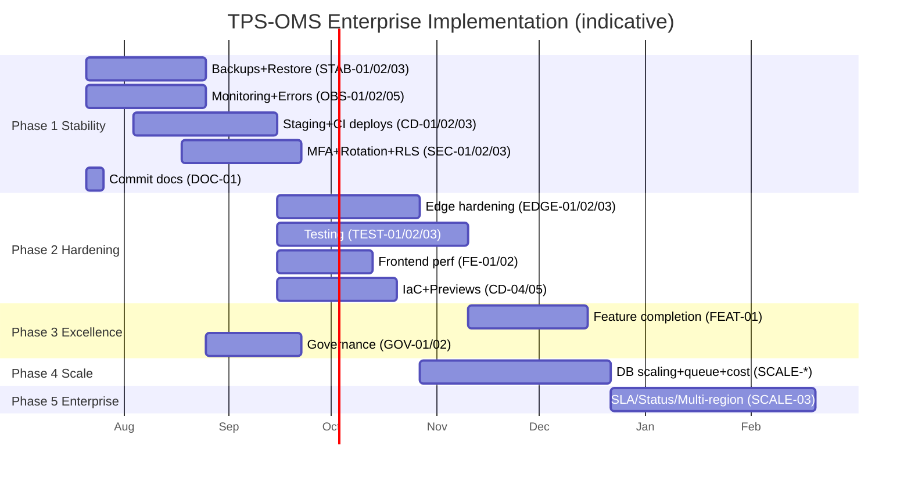

# TPS-OMS — Enterprise Implementation Masterplan (15)

**Purpose:** The single executable source of truth for every future engineering activity. Consolidates all issues, risks, weaknesses, technical-debt items, and recommendations from Docs 07/09/10/14 into deduplicated, workstream-organized **work items** with full execution metadata, a **5-phase roadmap**, and **project-management + execution artifacts**.
**Scope:** Planning/execution only. Facts referenced are verified in Docs 01–13; recommendations originate in Doc 14. **No application code is modified by this document.**
**Related Documents:** `07_SECURITY_AUDIT.md`, `09_PRODUCTION_READINESS.md`, `10_GAP_ANALYSIS.md`, `14_ENTERPRISE_ARCHITECTURE_REVIEW.md`.
**Version:** 1.0 · **Creation Date:** 2026-07-14 · **Last Verification Date:** 2026-07-14
**Repository Branch:** `main` · **Commit Hash:** `9558f90` (working tree; documentation files uncommitted)

> This is not a review. It is a build plan. Effort scale **S** ≤1 wk · **M** 1–4 wks · **L** 1–3 mo · **XL** 3 mo+. Priority: **Critical / High / Medium / Low**. Each work item consolidates one or more Doc-14 Top-100 IDs (noted as `[T#…]`).

## Table of Contents
1. How to Use This Plan
2. Consolidation Summary
3. Workstreams
4. Work Items (full specs)
5. Phased Roadmap (Phases 1–5)
6. Milestones
7. Priority Matrix
8. Risk Matrix
9. Dependency Matrix
10. Dependency Diagram (Mermaid)
11. Gantt Timeline (Mermaid)
12. Parallel vs Sequential Work
13. Execution Plan (Top-25, downtime, staging, migration, rollback)
14. Complete Implementation Sequence

---

## 1. How to Use This Plan

- Each **work item** (e.g., `STAB-01`) is independently schedulable and carries its own Definition of Done.
- **Phases** bundle work items by business priority; complete a phase's **Exit Criteria** before advancing.
- The **Dependency Matrix + Diagram** define ordering; the **Parallel** section defines what may run concurrently.
- Treat `docs/15` as the backlog spine; create tickets 1:1 from work items.

## 2. Consolidation Summary

Doc 14 produced **100 ranked improvements** across 40 categories; Docs 07/09/10 contributed security gaps, readiness gaps, and gap-analysis items. After **de-duplication and merging overlapping tasks**, these collapse into **36 work items** across **13 workstreams**. Overlaps removed include: monitoring/error-tracking/dashboards → one OBS stream; multiple test types → one TEST stream with sub-deliverables; CORS/cron-auth/rate-limits → one EDGE hardening item + SEC items; "remove legacy face" appeared in Frontend, Face ID, Dependencies, Tech-Debt → single `FE-02`.

| Source | Items in | Merged into |
|---|---|---|
| Doc 14 Top-100 | 100 | 36 work items |
| Doc 10 gaps | 26 | mapped to same 36 |
| Doc 07 security | 14 | SEC/EDGE items |
| Doc 09 readiness | 13 scorecard rows | STAB/OBS/TEST/CD items |

## 3. Workstreams

| Code | Workstream |
|---|---|
| STAB | Stability, Backup & Disaster Recovery |
| OBS | Observability, Monitoring & Logging |
| CD | Deployment, Environments & CI/CD/IaC |
| SEC | Security, Authentication & Authorization |
| TEST | Testing & Quality Assurance |
| FE | Frontend Performance, UX & Tech-Debt |
| EDGE | Edge Functions & API Hardening |
| DB | Database & Workflow Integrity |
| SCALE | Scalability, Reliability, Availability & Cost |
| FACE | Face ID & Attendance Integrity |
| FEAT | Feature Completion |
| GOV | Compliance & Data Governance |
| DOC | Documentation & Engineering Process |

## 4. Work Items (full specs)

> Field order per item: **Objective · Business justification · Technical justification · Current · Desired · Dependencies · Risks · Priority · Effort · Impact · Skills · Repo areas · DB / Backend / Frontend / Infra impact · Breaking? · Downtime? · Rollback · Validation · Acceptance · DoD.**

### STAB — Stability, Backup & DR

**STAB-01 — Automated database backups** `[T1,T13]`
Objective: independent, scheduled `pg_dump` + storage-bucket snapshots to external storage. · Business: prevents catastrophic data loss (existential). · Technical: repo has no backup artifact; relies on platform (Not Verifiable). · Current: none in repo. · Desired: scheduled encrypted backups + retention, off Supabase. · Dependencies: CD-01 (secrets/env). · Risks: backup contains PII → must encrypt. · Priority: Critical · Effort: M · Impact: data durability. · Skills: DevOps, DBA. · Repo: new `ops/backup/*`, CI. · DB: read-only dump. Backend: n/a. Frontend: n/a. Infra: external storage bucket. · Breaking: No · Downtime: No · Rollback: disable job. · Validation: backup files exist + checksum. · Acceptance: nightly backup + weekly storage snapshot verified. · DoD: runbook + monitored job + 1 successful restore.

**STAB-02 — Restore drills** `[T2]`
Objective: periodic, documented restore of a backup to a scratch project. · Business: proves recoverability (backups are worthless untested). · Technical: no restore process exists. · Current: none. · Desired: quarterly restore drill with time-to-restore recorded. · Dependencies: STAB-01. · Risks: drill touching prod data. · Priority: Critical · Effort: M · Impact: verified RPO/RTO. · Skills: DBA/DevOps. · Repo: `ops/dr/*`. · DB: restore to scratch. Others: n/a. · Breaking: No · Downtime: No · Rollback: n/a. · Validation: app boots against restored DB. · Acceptance: documented drill result. · DoD: signed-off drill + recorded RTO.

**STAB-03 — DR runbook + RTO/RPO** `[T3,T39]`
Objective: define/publish RTO, RPO, failover steps. · Business: continuity SLA. · Technical: undefined today. · Current: none. · Desired: runbook in `docs/ops`. · Dependencies: STAB-01/02. · Priority: Critical · Effort: S · Impact: preparedness. · Repo: docs. · All impacts: none (doc). · Breaking/Downtime: No. · Rollback: n/a. · Validation: tabletop exercise. · Acceptance: approved runbook. · DoD: published + reviewed.

**STAB-04 — Storage & audit retention policy** `[T44,T65,T95]`
Objective: retention/cleanup for attendance photos, face-refs, audit tables; encryption verified. · Business: cost + compliance. · Technical: unbounded growth. · Current: none. · Desired: lifecycle jobs + retention config. · Dependencies: STAB-01, GOV-02. · Priority: Medium · Effort: M · Impact: cost/compliance. · DB: deletes old rows. Infra: storage lifecycle. · Breaking: No · Downtime: No · Rollback: disable job. · Validation: old objects purged per policy. · Acceptance: policy doc + jobs. · DoD: automated + monitored.

### OBS — Observability, Monitoring & Logging

**OBS-01 — Uptime + synthetic monitoring** `[T4]`
Objective: external uptime checks + synthetic login/punch. · Business: know outages before users report. · Technical: no monitoring in repo. · Current: none. · Desired: monitors on app URL + critical edge endpoints. · Dependencies: OBS-04 (health endpoint) optional. · Priority: Critical · Effort: M · Impact: MTTR. · Skills: DevOps/SRE. · Infra: monitoring service. · Breaking/Downtime: No. · Rollback: remove monitors. · Validation: alert fires on induced failure. · Acceptance: alerts to on-call. · DoD: dashboards + paging.

**OBS-02 — Error tracking (SPA + edge)** `[T5,T27]`
Objective: capture client + edge errors centrally. · Business: faster fixes, fewer silent failures. · Technical: only ErrorBoundary/Toast today. · Current: none (no Sentry dep). · Desired: error SDK in SPA + edge try/catch reporting. · Dependencies: none. · Priority: Critical · Effort: M · Impact: debuggability. · Frontend: add SDK init. Backend: edge report. · Breaking: No · Downtime: No · Rollback: remove SDK. · Validation: test error appears in dashboard. · Acceptance: SPA+edge errors flow. · DoD: alerting on error spikes.

**OBS-03 — Metrics dashboards** `[T6,T43]`
Objective: DB metrics, edge error/latency, slow queries. · Priority: High · Effort: M · Dependencies: OBS-01. · Current: platform logs only. · Desired: dashboards + slow-query monitoring. · Impacts: infra/observability config. · Breaking/Downtime: No. · Rollback: n/a. · Validation: dashboards populate. · Acceptance/DoD: reviewed dashboards + query budget alerts.

**OBS-04 — Structured logging + correlation IDs + log store** `[T25,T26,T23]`
Objective: correlation ID SPA→edge→DB; ship logs to a queryable store. · Priority: High · Effort: M · Dependencies: OBS-02. · Current: audit tables + platform logs, no correlation. · Desired: request IDs + centralized logs + retention. · Backend/Frontend: header propagation. · Breaking: No · Downtime: No · Rollback: revert logging. · Validation: trace a request end-to-end. · Acceptance/DoD: correlated logs searchable.

**OBS-05 — Auth-anomaly & sensitive-action alerting** `[T14,T15]`
Objective: alert on failed-login spikes + credential reveals. · Business: breach detection. · Technical: `credential_access_log`/login attempts exist but unmonitored. · Priority: Critical · Effort: S–M · Dependencies: OBS-02/03. · DB: read audit tables. · Breaking/Downtime: No. · Rollback: remove alerts. · Validation: alert on induced pattern. · Acceptance/DoD: alerts routed to security.

### CD — Deployment, Environments & CI/CD/IaC

**CD-01 — Staging Supabase project** `[T7,T35]`
Objective: dedicated non-prod DB/Auth/Storage/edge. · Business: stop validating on prod. · Technical: effectively single env today. · Priority: Critical · Effort: M · Dependencies: none. · Infra: new Supabase project + secrets. · Breaking: No · Downtime: No · Rollback: decommission. · Validation: app runs against staging. · Acceptance/DoD: staging reachable + seeded.

**CD-02 — CI-deployed migrations + edge functions** `[T8]`
Objective: deploy `supabase/migrations` + `functions` via Supabase CLI in CI (staging→prod, gated). · Business: eliminate risky manual/out-of-band deploys. · Technical: Pages workflow excludes DB/edge. · Priority: Critical · Effort: M · Dependencies: CD-01. · Infra/CI: new workflow. · DB: applies migrations. · Breaking: possibly (migrations) · Downtime: No (online migrations) · Rollback: down-migration/revert + restore (STAB). · Validation: staging apply green before prod. · Acceptance/DoD: repo = deployed; manual DB deploys retired.

**CD-03 — Migration parity check** `[T9,T12]`
Objective: CI check that prod schema == migrations. · Priority: High · Effort: M · Dependencies: CD-02. · DB: read schema. · Breaking/Downtime: No. · Rollback: n/a. · Validation: drift detected in test. · Acceptance/DoD: parity gate in CI.

**CD-04 — Preview deploys per PR** `[T42]`
Objective: ephemeral preview of the SPA per PR. · Priority: High · Effort: M · Dependencies: CD-01. · Infra: hosting with previews (evaluate Vercel/Cloudflare/Netlify). · Breaking/Downtime: No. · Rollback: n/a. · Validation: PR shows preview URL. · Acceptance/DoD: reviewers use previews.

**CD-05 — IaC for Supabase config + release process** `[T40,T41]`
Objective: roles/policies/functions/cron as code; documented release checklist. · Priority: High · Effort: L · Dependencies: CD-02. · Infra: config-as-code. · Breaking: No · Downtime: No · Rollback: re-apply prior config. · Validation: reproducible env from code. · Acceptance/DoD: env buildable from repo + release runbook.

### SEC — Security, Authentication & Authorization

**SEC-01 — MFA for admin roles** `[T10,T34]`
Objective: MFA for super_admin/director (+ password policy). · Business: prevent admin takeover. · Technical: no MFA today. · Priority: Critical · Effort: M · Dependencies: CD-01. · Frontend: MFA flow. Backend: Supabase MFA. · Breaking: No (opt-in→enforced) · Downtime: No · Rollback: disable enforcement. · Validation: admin login requires 2FA. · Acceptance/DoD: enforced for admin roles + policy set.

**SEC-02 — Secret rotation policy + inventory** `[T11]`
Objective: rotate AWS/Zepto/WhatsApp/service keys on cadence; inventory. · Priority: Critical · Effort: M · Dependencies: none. · Infra: secret store. · Breaking: No · Downtime: No (rolling) · Rollback: restore prior secret. · Validation: post-rotation smoke tests. · Acceptance/DoD: documented rotation + inventory.

**SEC-03 — RLS automated test suite** `[T12,T20]`
Objective: pgTAP tests seeding each role, asserting row visibility per table. · Business: prevent silent over-exposure. · Priority: Critical · Effort: M–L · Dependencies: CD-01. · DB: test schema. · Breaking/Downtime: No. · Rollback: n/a. · Validation: tests fail on a loosened policy. · Acceptance/DoD: RLS tests in CI, green.

**SEC-04 — Dependency scanning + audit gate** `[T36]`
Objective: Dependabot + `npm audit` in CI. · Priority: High · Effort: S · Dependencies: none. · CI only. · Breaking/Downtime: No. · Rollback: n/a. · Validation: known-vuln flagged. · Acceptance/DoD: CI blocks critical vulns.

### EDGE — Edge Functions & API Hardening

**EDGE-01 — Cron endpoint auth + CORS tightening** `[T21,T22]`
Objective: shared-secret/header on cron edge fns; restrict CORS to app origin. · Business: close unauthenticated POST surface. · Technical: several `verify_jwt=false` + `*` CORS. · Priority: High · Effort: M · Dependencies: CD-02. · Backend: edge. · Breaking: possibly (callers must send secret) · Downtime: No · Rollback: revert edge deploy. · Validation: unauthenticated call rejected. · Acceptance/DoD: cron auth + scoped CORS live.

**EDGE-02 — Payload validation + versioning** `[T28,T30,T55]`
Objective: zod validation at edge boundaries; version endpoints; contract docs. · Priority: High · Effort: M · Dependencies: none. · Backend: edge. · Breaking: No (additive) · Downtime: No · Rollback: revert. · Validation: bad payload rejected cleanly. · Acceptance/DoD: validated, versioned contracts.

**EDGE-03 — Delivery reliability (retry/DLQ/idempotency)** `[T23,T24]`
Objective: retries + dead-letter + idempotency keys for WhatsApp/email dispatch. · Business: no dropped notifications (502s observed). · Priority: High · Effort: M · Dependencies: EDGE-02. · Backend: edge + a queue/log table. · DB: dead-letter table (migration). · Breaking: No · Downtime: No · Rollback: revert. · Validation: induced failure retried then DLQ'd. · Acceptance/DoD: delivery SLA + DLQ dashboard.

**EDGE-04 — Health-check endpoint + edge tests** `[T29,T93]`
Objective: lightweight health endpoint; unit tests per edge fn. · Priority: Medium · Effort: M · Dependencies: TEST-01. · Backend: edge. · Breaking/Downtime: No. · Rollback: n/a. · Validation: health 200; tests green. · Acceptance/DoD: monitored health + edge tests in CI.

### TEST — Testing & Quality Assurance

**TEST-01 — E2E critical flows** `[T19]`
Objective: Playwright for login (password+face), punch, project-create, payment. · Business: protect revenue-critical paths. · Current: 2 unit files only. · Priority: High · Effort: L · Dependencies: CD-01 (staging target). · Frontend/CI. · Breaking/Downtime: No. · Rollback: n/a. · Validation: flows pass on staging. · Acceptance/DoD: E2E suite in CI.

**TEST-02 — DB/RPC tests (pgTAP) + workflow integration** `[T20,T52,T53]`
Objective: test punch_attendance, vault, stage transitions, triggers. · Priority: High · Effort: L · Dependencies: CD-01. · DB. · Breaking/Downtime: No. · Rollback: n/a. · Validation: regressions caught. · Acceptance/DoD: DB tests in CI.

**TEST-03 — Component tests + quality gates** `[T48,T49,T54,T73,T74]`
Objective: component tests; Prettier + format check; pre-commit hooks; bundle-size + Lighthouse budgets in CI. · Priority: Medium · Effort: M · Dependencies: none. · CI/Frontend. · Breaking/Downtime: No. · Rollback: relax gates. · Validation: gate fails on oversize/format drift. · Acceptance/DoD: gates enforced.

### FE — Frontend Performance, UX & Tech-Debt

**FE-01 — Route-level code splitting + chunking** `[T16,T18,T58]`
Objective: `React.lazy` routes + `manualChunks` + asset optimization. · Business: faster mobile first-load for field punchers. · Technical: single ~1.3 MB bundle. · Priority: High · Effort: S–M · Dependencies: none. · Frontend/build. · Breaking: No · Downtime: No · Rollback: revert config. · Validation: main chunk < budget; TTI improves. · Acceptance/DoD: split bundles + budget.

**FE-02 — Remove legacy face path + dependency** `[T17,T31]`
Objective: delete `faceEngine.ts`, `FaceCapture.tsx`, `useFaceEnrollment.ts`, `public/models/*`, drop `@vladmandic/human`; optionally deprecate `profiles.face_descriptor/face_model`. · Business: −6.7 MB, less confusion. · Technical: legacy, unused (verified). · Priority: High · Effort: S–M · Dependencies: SEC-03/TEST (ensure unused), FACE-01 (liveness may reuse concepts). · Frontend + package.json + (optional DB migration to drop columns). · DB: optional column drop (migration). · Breaking: No (if truly unused) · Downtime: No · Rollback: restore files/dep. · Validation: build + E2E green without it. · Acceptance/DoD: dead code gone; app unaffected.

**FE-03 — UX polish & tech-debt hygiene** `[T46,T47,T64,T66,T68,T76]`
Objective: fix idle-logout copy (15 min); split oversized files; remove/wire unused `VITE_APP_*`; a11y audit; PWA offline punch handling; disambiguate `documents` naming in docs. · Priority: Medium · Effort: M · Dependencies: none. · Frontend + docs. · Breaking/Downtime: No. · Rollback: revert. · Validation: a11y score; offline punch queues. · Acceptance/DoD: items closed with tests where applicable.

### DB — Database & Workflow Integrity

**DB-01 — Codify storage bucket + cron in migrations** `[T32,T33,T57,T91,T92]`
Objective: add `documents` bucket creation migration; move all `pg_cron` schedules into migrations; enum-management convention; migration linting; RLS policy naming standard. · Business: repo = truth; reproducible env. · Technical: `documents` bucket + several cron jobs not migration-defined (verified). · Priority: High · Effort: M · Dependencies: CD-02. · DB (migrations). · Breaking: No (idempotent) · Downtime: No · Rollback: revert migration. · Validation: fresh project reproduces all objects. · Acceptance/DoD: no dashboard-only objects.

**DB-02 — Trigger/constraint documentation + FK completeness** `[T12,T52,T90]`
Objective: document trigger side-effects; enumerate FKs/constraints; data-quality checks (orphans/stale sessions). · Priority: Medium · Effort: M · Dependencies: TEST-02. · DB + docs. · Breaking/Downtime: No. · Rollback: n/a. · Validation: data-quality job clean. · Acceptance/DoD: constraint map + checks.

### SCALE — Scalability, Reliability, Availability & Cost

**SCALE-01 — DB scaling foundations** `[T38,T43,T59]`
Objective: connection pooling review, query budgets, hot-read caching. · Priority: Medium · Effort: L · Dependencies: OBS-03. · DB/infra. · Breaking/Downtime: No. · Rollback: revert cache. · Validation: p95 query latency within budget under load. · Acceptance/DoD: pooling + caching + budgets.

**SCALE-02 — Notification queue decoupling** `[T60]`
Objective: move dispatch to a queue (decouple from cron). · Priority: Medium · Effort: M · Dependencies: EDGE-03. · Backend/DB. · Breaking: No · Downtime: No · Rollback: fall back to cron. · Validation: throughput under burst. · Acceptance/DoD: queue-backed dispatch.

**SCALE-03 — SLA/RTO/RPO, status page, multi-region eval** `[T39,T61]`
Objective: publish SLAs; status page; evaluate read-replica/multi-region. · Priority: Medium · Effort: L–XL · Dependencies: STAB-03, OBS-01. · Infra/docs. · Breaking/Downtime: No. · Rollback: n/a. · Validation: status page live; eval documented. · Acceptance/DoD: SLA + decision record.

**SCALE-04 — Cost optimization + dashboards** `[T44,T45,T63]`
Objective: cost dashboards (Supabase/AWS/WhatsApp); cache/limit AWS Rekognition; storage retention (with STAB-04). · Priority: Medium · Effort: M · Dependencies: OBS-03. · Infra. · Breaking/Downtime: No. · Rollback: n/a. · Validation: unit cost per punch tracked. · Acceptance/DoD: cost visibility + reductions.

### FACE — Face ID & Attendance Integrity

**FACE-01 — Liveness / anti-spoof for punch + GPS integrity** `[T37,T62]`
Objective: extend enroll head-turn liveness to punch; device-integrity/GPS-spoof signals. · Business: prevent buddy-punching/photo spoof. · Technical: no liveness on punch today; allow-and-flag. · Priority: Medium · Effort: M · Dependencies: EDGE-02. · Frontend + edge. · Breaking: No · Downtime: No · Rollback: disable liveness (fall back to current). · Validation: printed-photo/spoof rejected/flagged. · Acceptance/DoD: liveness live behind setting.

### FEAT — Feature Completion

**FEAT-01 — Complete Reports & Knowledge Base** `[T69,T70,T71]`
Objective: finish Reports tab rendering (RPCs exist), Knowledge CRUD, enumerate/verify Excel export. · Priority: Medium · Effort: M · Dependencies: TEST-01. · Frontend. · Breaking/Downtime: No. · Rollback: revert. · Validation: tabs render real data; CRUD works; export verified. · Acceptance/DoD: coverage → ~100% with tests.

### GOV — Compliance & Data Governance

**GOV-01 — PII & face-data governance** `[T96,T97]`
Objective: PII policy (Aadhaar/PAN); consent + retention for face data. · Business: regulatory compliance for biometric/PII. · Priority: High · Effort: M · Dependencies: STAB-04. · Docs + DB retention. · Breaking/Downtime: No. · Rollback: n/a. · Validation: policy applied to storage/retention. · Acceptance/DoD: approved governance doc + enforced retention.

**GOV-02 — Audit-log immutability verification** `[T98]`
Objective: verify append-only guarantees on audit tables. · Priority: Low–Medium · Effort: S · Dependencies: SEC-03. · DB. · Breaking/Downtime: No. · Rollback: n/a. · Validation: update/delete blocked by policy. · Acceptance/DoD: tested immutability.

### DOC — Documentation & Engineering Process

**DOC-01 — Commit & version the docs set** `[T78,T79]`
Objective: commit `docs/01–15`; add docs changelog + ADR discipline. · Priority: High · Effort: S · Dependencies: none. · Repo/docs. · Breaking/Downtime: No. · Rollback: n/a. · Validation: docs tracked in git. · Acceptance/DoD: committed + changelog.

**DOC-02 — Engineering process cadence** `[T100,T82,T83]`
Objective: quarterly architecture review; dependency-upgrade cadence; Deno/Supabase runtime upgrade plan. · Priority: Low · Effort: S · Dependencies: none. · Process/docs. · Breaking/Downtime: No. · Rollback: n/a. · Validation: cadence scheduled. · Acceptance/DoD: recurring reviews established.

*(36 work items total. Doc-14 items T50–51,56,67,72,75,77,80–89,94,99 are folded into FE-03/DB-01/DB-02/DOC-01/DOC-02/SCALE-04 as sub-tasks; nothing dropped.)*

## 5. Phased Roadmap

### Phase 1 — Critical Production Stability (0–3 mo)
- **Objectives:** eliminate data-loss risk; make incidents visible; make deploys safe.
- **Deliverables:** STAB-01/02/03, OBS-01/02/05, CD-01/02/03, SEC-01/02/03, DOC-01.
- **Risks:** migrations via CI could disrupt if untested → mitigated by staging (CD-01) first.
- **Dependencies:** CD-01 precedes CD-02/03, SEC-03, TEST.
- **Duration:** ~10–12 weeks.
- **Exit Criteria:** verified backup + restore drill; monitoring + error tracking live; staging + CI DB/edge deploys with parity gate; MFA for admins; RLS test suite green; docs committed.

### Phase 2 — Production Hardening (3–6 mo)
- **Objectives:** harden endpoints; establish test discipline; reliable delivery; frontend perf.
- **Deliverables:** EDGE-01/02/03, TEST-01/02/03, FE-01/02, OBS-03/04, SEC-04, CD-04/05, DB-01.
- **Risks:** EDGE-01 cron-secret change could break dispatch → coordinate with EDGE-02 + staging.
- **Dependencies:** CD-02 before EDGE-01/DB-01; CD-01 before TEST-01/02.
- **Duration:** ~12–14 weeks.
- **Exit Criteria:** E2E + pgTAP in CI; cron endpoints authenticated + CORS scoped; retries/DLQ live; bundle split; legacy face removed; IaC + release process.

### Phase 3 — Engineering Excellence (6–9 mo)
- **Objectives:** completeness, governance, quality depth.
- **Deliverables:** FEAT-01, FE-03, DB-02, GOV-01/02, EDGE-04, DOC-02.
- **Risks:** governance retention could delete needed data → dry-run first.
- **Dependencies:** TEST-01 before FEAT-01; STAB-04 before GOV-01.
- **Duration:** ~10–12 weeks.
- **Exit Criteria:** Reports/Knowledge complete + tested; PII/face governance enforced; a11y/PWA; health checks + edge tests.

### Phase 4 — Performance & Scalability (9–12 mo)
- **Objectives:** scale headroom + cost control.
- **Deliverables:** SCALE-01/02/04, STAB-04.
- **Risks:** caching correctness/staleness.
- **Dependencies:** OBS-03 before SCALE items; EDGE-03 before SCALE-02.
- **Duration:** ~10–12 weeks.
- **Exit Criteria:** pooling/caching/budgets; queue-backed dispatch; cost dashboards + reductions; retention automated.

### Phase 5 — Enterprise Expansion (12 mo+)
- **Objectives:** availability guarantees + strategic optionality.
- **Deliverables:** SCALE-03 (SLA/RTO/RPO, status page, multi-region eval), vendor-exit seam formalization, HRM Phase 1 (existing spec) onboarding to this process.
- **Risks:** multi-region cost/complexity.
- **Dependencies:** Phases 1–4.
- **Duration:** ongoing.
- **Exit Criteria:** published SLAs + status page; documented exit strategy; new modules built via the plan's standards.

## 6. Milestones

| M# | Milestone | Phase | Gate |
|---|---|---|---|
| M1 | Recoverable (backup + restore proven) | 1 | STAB-01/02 |
| M2 | Observable (monitoring + errors + alerts) | 1 | OBS-01/02/05 |
| M3 | Safe deploys (staging + CI DB/edge + parity) | 1 | CD-01/02/03 |
| M4 | Admin-secure (MFA + rotation + RLS tests) | 1 | SEC-01/02/03 |
| M5 | Hardened endpoints + tests | 2 | EDGE + TEST |
| M6 | Fast + clean frontend | 2 | FE-01/02 |
| M7 | Feature-complete + governed | 3 | FEAT-01 + GOV |
| M8 | Scalable + cost-controlled | 4 | SCALE-01/02/04 |
| M9 | Enterprise SLAs | 5 | SCALE-03 |

## 7. Priority Matrix

| Priority | Work items |
|---|---|
| **Critical** | STAB-01, STAB-02, STAB-03, OBS-01, OBS-02, OBS-05, CD-01, CD-02, SEC-01, SEC-02, SEC-03 |
| **High** | CD-03, CD-04, CD-05, OBS-03, OBS-04, SEC-04, EDGE-01, EDGE-02, EDGE-03, TEST-01, TEST-02, FE-01, FE-02, DB-01, GOV-01, DOC-01 |
| **Medium** | STAB-04, EDGE-04, TEST-03, FE-03, DB-02, SCALE-01, SCALE-02, SCALE-03, SCALE-04, FACE-01, FEAT-01 |
| **Low** | GOV-02, DOC-02 |

## 8. Risk Matrix

| Risk | Likelihood | Impact | Mitigation (work item) |
|---|---|---|---|
| Catastrophic data loss | Low | Critical | STAB-01/02/03 |
| Undetected outage/incident | Medium | High | OBS-01/02/05 |
| Prod/repo drift from manual deploys | High | High | CD-02/03, DB-01 |
| Admin account compromise | Medium | Critical | SEC-01/02 |
| RLS over-exposure regression | Medium | Critical | SEC-03, TEST-02 |
| Dropped notifications | Medium | Medium | EDGE-03 |
| Slow mobile load hurts field punching | High | Medium | FE-01 |
| Biometric/PII non-compliance | Medium | High | GOV-01 |
| Vendor lock-in / price shock | Medium | High | CD-04 (hosting eval), SCALE-03 seam |

## 9. Dependency Matrix

| Work item | Depends on |
|---|---|
| CD-02, CD-03, CD-04, CD-05 | CD-01 |
| SEC-03, TEST-01, TEST-02 | CD-01 |
| EDGE-01, DB-01 | CD-02 |
| EDGE-03, SCALE-02 | EDGE-02 |
| OBS-03, OBS-05 | OBS-01/02 |
| SCALE-01/03/04 | OBS-03 |
| STAB-02/03/04 | STAB-01 |
| GOV-01 | STAB-04 |
| FEAT-01 | TEST-01 |
| FACE-01 | EDGE-02 |
| FE-02 | TEST (verify unused) |

## 10. Dependency Diagram

```mermaid
flowchart TD
    CD01[CD-01 Staging] --> CD02[CD-02 CI DB/edge deploy]
    CD02 --> CD03[CD-03 Parity]
    CD01 --> CD04[CD-04 Previews]
    CD02 --> CD05[CD-05 IaC]
    CD01 --> SEC03[SEC-03 RLS tests]
    CD01 --> TEST01[TEST-01 E2E]
    CD01 --> TEST02[TEST-02 DB tests]
    CD02 --> EDGE01[EDGE-01 Cron auth/CORS]
    CD02 --> DB01[DB-01 Codify buckets/cron]
    EDGE02[EDGE-02 Validation/versioning] --> EDGE03[EDGE-03 Retry/DLQ]
    EDGE03 --> SCALE02[SCALE-02 Queue]
    STAB01[STAB-01 Backups] --> STAB02[STAB-02 Restore drill]
    STAB02 --> STAB03[STAB-03 DR runbook]
    STAB01 --> STAB04[STAB-04 Retention]
    STAB04 --> GOV01[GOV-01 PII/face governance]
    OBS01[OBS-01 Uptime] --> OBS03[OBS-03 Dashboards]
    OBS02[OBS-02 Error tracking] --> OBS04[OBS-04 Structured logs]
    OBS02 --> OBS05[OBS-05 Auth alerts]
    OBS03 --> SCALE01[SCALE-01 DB scaling]
    OBS03 --> SCALE04[SCALE-04 Cost]
    TEST01 --> FEAT01[FEAT-01 Reports/KB]
    EDGE02 --> FACE01[FACE-01 Liveness]
    TEST01 --> FE02[FE-02 Remove legacy]
```

## 11. Gantt Timeline

## 12. Parallel vs Sequential Work

**Parallelizable (independent tracks, run concurrently):**
- STAB (backup/DR) ∥ OBS (monitoring) ∥ DOC-01 — no shared code.
- After CD-01: SEC-03 ∥ TEST-01 ∥ TEST-02 (all just need staging).
- FE-01 ∥ FE-02 ∥ EDGE-02 (frontend vs edge, different areas).
- GOV-01 ∥ SCALE-04 (docs/retention vs cost dashboards).

**Sequential (must order):**
- CD-01 → CD-02 → CD-03 (env before deploy before parity).
- STAB-01 → STAB-02 → STAB-03 (backup before drill before runbook).
- EDGE-02 → EDGE-03 → SCALE-02 (validation before reliability before queue).
- OBS-01/02 → OBS-03/04/05 (base telemetry before dashboards/alerts).
- TEST/FE verification → FE-02 (confirm legacy unused before deletion).

**Never run simultaneously:**
- CD-02 (migration deploy) **and** STAB-02 (restore drill) on the same project.
- Two migration-bearing items applying to the **same** environment at once (serialize: DB-01, CD-02, FE-02 column drop, EDGE-03 DLQ table).
- SEC-01 MFA rollout **and** SEC-02 secret rotation in the same window (auth flux) — stagger.

## 13. Execution Plan

**Top-25 tasks to complete first (in order):**
1. DOC-01 commit docs · 2. CD-01 staging · 3. STAB-01 backups · 4. OBS-02 error tracking · 5. OBS-01 uptime · 6. STAB-02 restore drill · 7. CD-02 CI DB/edge deploy · 8. CD-03 parity check · 9. SEC-03 RLS tests · 10. STAB-03 DR runbook · 11. OBS-05 auth alerts · 12. SEC-01 MFA · 13. SEC-02 secret rotation · 14. OBS-03 dashboards · 15. SEC-04 dep scanning · 16. EDGE-02 validation/versioning · 17. EDGE-01 cron auth/CORS · 18. TEST-01 E2E · 19. TEST-02 DB tests · 20. FE-01 code splitting · 21. EDGE-03 retry/DLQ · 22. DB-01 codify buckets/cron · 23. OBS-04 structured logs · 24. FE-02 remove legacy · 25. CD-05 IaC.

**Tasks executable in parallel:** STAB-*, OBS-*, DOC-01 at start; post-CD-01 → SEC-03 ∥ TEST-01 ∥ TEST-02; FE-01 ∥ EDGE-02; GOV-01 ∥ SCALE-04.

**Tasks that must never run simultaneously:** any two migration-applying items on the same env (DB-01, CD-02, EDGE-03 DLQ, FE-02 column drop); CD-02 vs STAB-02; SEC-01 vs SEC-02.

**Tasks requiring production downtime:** **None mandatory** — all migrations are additive/online; MFA/secret rotation are rolling. (Only a botched migration would; mitigated by staging + backups.)

**Tasks requiring staging validation (before prod):** CD-02, CD-03, EDGE-01/02/03, DB-01, FE-02 (column drop), SEC-01, SCALE-02, FACE-01, EDGE-04.

**Tasks requiring database migration:** DB-01 (bucket+cron), EDGE-03 (DLQ table), FE-02 (optional column drop), SCALE-02 (queue table), GOV-02 (immutability constraints), plus any policy changes in SEC-03 fixtures.

**Tasks requiring rollback plans:** all migration items (down-migration + STAB restore), EDGE-01 (revert deploy), SEC-01 (disable enforcement), SEC-02 (restore prior secret), FE-01/02 (revert), CD-02 (revert workflow + migration).

## 14. Complete Implementation Sequence (first task → enterprise-ready)

1. **Commit docs** (DOC-01) → establish the plan as tracked truth.
2. **Stand up staging** (CD-01).
3. **In parallel:** backups (STAB-01) + error tracking (OBS-02) + uptime (OBS-01).
4. **Prove recovery** (STAB-02) → **DR runbook** (STAB-03).
5. **Automate DB/edge deploys** (CD-02) → **parity gate** (CD-03).
6. **Security core:** RLS tests (SEC-03) → auth alerts (OBS-05) → MFA (SEC-01) → secret rotation (SEC-02).
7. **Phase-1 exit** (M1–M4 met).
8. **Harden edges:** validation/versioning (EDGE-02) → cron auth/CORS (EDGE-01) → retry/DLQ (EDGE-03).
9. **Establish testing:** E2E (TEST-01) + DB tests (TEST-02) + gates (TEST-03).
10. **Frontend:** code splitting (FE-01) → remove legacy face (FE-02, after tests confirm unused).
11. **Repo=truth:** codify buckets/cron (DB-01); IaC + release process (CD-05); previews (CD-04).
12. **Phase-2 exit** (M5–M6).
13. **Complete features** (FEAT-01) + **governance** (GOV-01/02) + **UX/tech-debt** (FE-03) + health/edge tests (EDGE-04) + trigger/constraint docs (DB-02).
14. **Phase-3 exit** (M7).
15. **Scale:** DB scaling (SCALE-01) + queue (SCALE-02) + cost (SCALE-04) + retention (STAB-04).
16. **Phase-4 exit** (M8).
17. **Enterprise SLAs:** RTO/RPO/status/multi-region (SCALE-03); formalize vendor-exit seam; onboard new modules (HRM) through this plan.
18. **Phase-5 / enterprise-ready** (M9).

---

*Consolidated from Docs 07/09/10/14 (facts verified in Docs 01–13) at commit `9558f90`. This is the execution reference for all future work. No application code was modified.*
