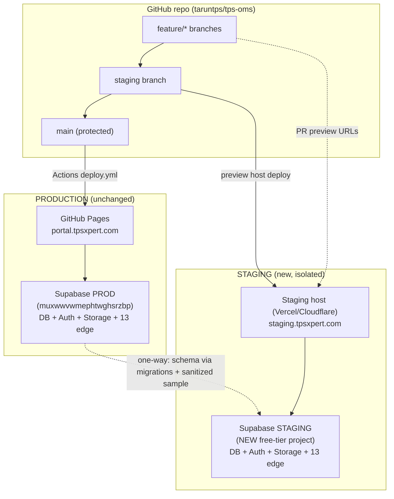
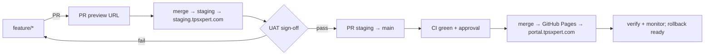

# TPS-OMS — Staging Environment Implementation Plan (16)

**Purpose:** The safest, repo-specific plan to create isolated **Development**, **Staging**, and **Production** environments plus a release workflow, **without any interruption to the live portal** (`portal.tpsxpert.com`).
**Scope:** Planning only. **Nothing is implemented, no branches/projects/environments created, no code changed.** Every recommendation is justified from the current repository.
**Related Documents:** `02_SYSTEM_ARCHITECTURE.md`, `08_DEPLOYMENT_INFRASTRUCTURE.md`, `15_ENTERPRISE_IMPLEMENTATION_MASTERPLAN.md` (this operationalizes masterplan items CD-01…CD-05, STAB-01/02).
**Version:** 1.0 · **Creation Date:** 2026-07-14 · **Last Verification Date:** 2026-07-14
**Repository Branch:** `main` · **Commit Hash:** `9558f90` (working tree; docs uncommitted)
**Decision:** **Option A** — staging clone + promote changes; the production database remains the single home for live data.

## Table of Contents
1. Current-State Analysis (verified)
2. Constraints & Gotchas Specific to This Repo
3. Key Recommendation (Supabase project vs preview vs other)
4. Target Topology (diagram)
5. Implementation Plan (15 required sections)
6. Release Flow (diagram)
7. What NOT To Do
8. Open Inputs Needed From You

---

## 1. Current-State Analysis (verified from the repository)

| Area | Current state (verified) |
|---|---|
| **Git repo** | `origin = github.com/taruntps/tps-oms.git` (single remote) |
| **Branches** | `main` (local+remote); `gh-pages` (**remote-only**, legacy artifact of `npm run deploy`) |
| **GitHub workflows** | one: `.github/workflows/deploy.yml` |
| **Deploy trigger** | `push` to **`main`** + manual `workflow_dispatch` |
| **Deployment process** | Actions: checkout → Node 24 → `npm ci` → `tsc --noEmit` → `vitest run` (placeholder env) → `vite build` (inject `VITE_SUPABASE_*` secrets) → `upload-pages-artifact` → `deploy-pages` |
| **Hosting** | **GitHub Pages** (single site per repo), custom domain `public/CNAME = portal.tpsxpert.com` |
| **Supabase config** | **No `supabase/config.toml`** — Supabase project is **not CLI-linked** in the repo. Only `supabase/functions/` (13) and `supabase/migrations/` (77) exist |
| **Migrations** | 77 (`001…077`) — additive, sequential |
| **Edge Functions** | 13 (+ `_shared/rekognition.ts` lib); deployed **out-of-band** (not in CI) |
| **Storage buckets** | `avatars`, `attendance`, `face-refs` (created in migrations 015/019/075); `documents` (referenced by RLS, **not created in migrations**) |
| **Authentication** | Supabase Auth (JWT); config in `src/lib/supabase.ts` (single client) |
| **Environment variables** | Frontend: `VITE_SUPABASE_URL`, `VITE_SUPABASE_ANON_KEY` (used); `VITE_APP_NAME`, `VITE_APP_URL` (declared, unused). CI secrets: `secrets.VITE_SUPABASE_URL/ANON_KEY`. Edge secrets: server-side (AWS/Zepto/WhatsApp/Drive/Sheets) |
| **Custom domains** | `portal.tpsxpert.com` (Pages CNAME) |
| **Build** | Vite (`base:'/'`), `@`→`src` alias |
| **CI/CD** | GitHub Actions (build gate: typecheck + test + build) |
| **Preview deployment capability** | **None today** — GitHub Pages has no per-branch/PR preview; one site per repo |
| **Production deploy trigger** | any push to `main` → live in minutes |

## 2. Constraints & Gotchas Specific to This Repo

1. **One GitHub Pages site per repo.** The official `deploy-pages` action deploys a single `github-pages` environment. **You cannot host both production and staging from this repo's Pages.** → Staging must use a different host (or a second repo).
2. **No `supabase/config.toml`.** DB/edge deploys are manual (MCP/dashboard). A staging environment is the right moment to introduce a linked config + CLI, but that's a *plan* item, not a change now.
3. **Legacy `gh-pages` branch** exists from `npm run deploy`. Harmless but a second, stale deploy path. Leave it; note for later cleanup.
4. **`documents` bucket is not created by any migration** — staging setup must create it explicitly, or it will be missing.
5. **Edge functions were deployed with `_shared` inlined** (history) because the MCP bundler can't resolve `../_shared/`. Staging edge deploys via the Supabase **CLI** *can* resolve `_shared` normally — so staging is also a chance to standardize deploys.
6. **PII in storage** (attendance selfies, `face-refs`). **Do not copy real face/selfie data to staging.** Use synthetic data.
7. **Production trigger is a bare push to `main`.** Until `main` is protected, an accidental push deploys to production.

## 3. Key Recommendation

**Q: Separate Supabase project, preview deployment, or another approach?**

- **A separate Supabase project for staging is REQUIRED.** Justification (from this repo): the app's logic lives in the **database** (RLS, 52 functions, 27 triggers, 77 migrations) and in **13 edge functions** — testing schema/RLS/edge/destructive changes against the **production** database is exactly the risk we must eliminate. A frontend-only preview is **insufficient**, because a preview build still reads `VITE_SUPABASE_URL` → it would point at **production data**. True isolation requires a **separate database + storage + auth**, i.e., a separate Supabase project.
- **Supabase "branching" (preview branches)** is a valid alternative **only if the org is on a paid plan** (branching is a Pro+ feature and is GitHub-integrated/ephemeral). For a **persistent, always-on staging** with minimal cost, a **dedicated Supabase project on the free tier** is simpler and fully isolated. **Recommendation: dedicated staging Supabase project.**
- **Hosting for the staging frontend:** because GitHub Pages can't serve two sites per repo, deploy staging from a **`staging` branch to a preview-capable host** (Cloudflare Pages / Vercel / Netlify — free tier), pointing at the **staging Supabase**. **Production stays exactly as-is on GitHub Pages (zero change to the live pipeline).** This also unlocks **per-PR preview URLs** (which Pages lacks). *Alternative (all-GitHub):* a second repo `tps-oms-staging` with its own Pages site + `staging.tpsxpert.com` — more overhead, no PR previews; not recommended.

**Net recommendation:** *Separate Supabase staging project* + *staging frontend on a preview-capable host from a `staging` branch* + *production untouched on GitHub Pages*. Justified by: DB-centric logic (needs DB isolation), Pages' one-site limit (needs a different staging host), and zero-disruption requirement (don't touch the live pipeline).

## 4. Target Topology

## 5. Implementation Plan

### 5.1 Branch Strategy
- **`main`** = production (protected; deploys to Pages).
- **`staging`** = long-lived integration branch (deploys to the staging host + staging Supabase).
- **`feature/*`** = short-lived; branch off `staging`, PR back into `staging`.
- Promotion: `feature/* → staging` (test/UAT) → `staging → main` (production).
- Retire/ignore the stale `gh-pages` branch (do not delete now; note for cleanup).

### 5.2 GitHub Strategy
- Enable **branch protection on `main`**: require PR, require green CI (`tsc`+`vitest`), require 1 review (self-review acceptable for solo), disallow force-push.
- Optionally protect `staging` similarly (lighter).
- Add **`CODEOWNERS`** (optional) and a PR template with a UAT checklist.
- Keep the single repo (no fork needed for Option A).

### 5.3 Deployment Strategy
- **Production:** **no change** — keep `deploy.yml` deploying `main` → GitHub Pages. (This is the zero-disruption guarantee.)
- **Staging:** new deployment on a **preview-capable host** (Vercel/Cloudflare/Netlify), connected to the repo, building the **`staging`** branch (and PR previews), with **staging** env vars. Production Pages pipeline is not modified.

### 5.4 Staging Deployment URL
- Primary: **`staging.tpsxpert.com`** — a **new DNS subdomain** (CNAME to the staging host). This **does not touch** the existing `portal.tpsxpert.com` record.
- Fallback: the host's default domain (`*.vercel.app` / `*.pages.dev`) until DNS is added.

### 5.5 Production Deployment Protection
- Protect `main` (5.2) so production only updates via reviewed, CI-passed PRs.
- Add a **GitHub Environment protection rule** on `github-pages` (required reviewer) so even a merged change pauses for one approval before going live.
- Keep `workflow_dispatch` for manual re-deploy/rollback.

### 5.6 Supabase Staging Strategy
- **Create a dedicated staging Supabase project** (free tier), same region (`ap-south-1`) for parity.
- Recreate the full schema by **replaying all 77 migrations** (`supabase db push` / apply in order) → guarantees parity with prod schema.
- Create storage buckets: `avatars`, `attendance`, `face-refs`, **and `documents`** (explicitly — it's missing from migrations).
- Configure **separate edge secrets** for staging: use **sandbox/test credentials** where possible (AWS test IAM, WhatsApp test number, ZeptoMail test sender) so staging never sends real messages or bills prod quotas.
- Introduce a committed **`supabase/config.toml`** (staging-linked) to enable CLI deploys (plan item; not now).

### 5.7 Database Synchronization Strategy
- **Schema:** migrations are the source of truth → apply `001…077` to staging; thereafter every new migration goes **staging-first**, then to prod (expand-contract for any breaking change).
- **Data:** **one-directional only, prod → staging**, and **only a sanitized/anonymized sample** for realistic testing (mask names/emails/phones/Aadhaar/PAN). **Never staging → prod.**
- **Production remains the single source of truth for live data** — there is **no "data shift" at cutover**, because production DB is never replaced (Option A).
- Optionally schedule a periodic staging refresh (e.g., weekly sanitized snapshot).

### 5.8 Storage Synchronization Strategy
- Recreate buckets on staging (5.6). **Do not copy real `attendance`/`face-refs` (PII/biometric).** Use synthetic images for testing.
- If sample docs are needed, copy a **small, non-sensitive** subset from `documents`/`avatars` only.
- Direction is **prod → staging** only, sanitized.

### 5.9 Edge Function Deployment Strategy
- Deploy all 13 functions to the **staging** project first (via Supabase CLI, which resolves `_shared` cleanly), with **staging secrets**.
- Validate on staging → then deploy the same functions to prod (versioned; revertible).
- Long-term: move edge + migration deploys into CI (masterplan CD-02), staging→prod gated.

### 5.10 Environment Variable Management
| Var | Production | Staging |
|---|---|---|
| `VITE_SUPABASE_URL` | prod project URL (GitHub secret) | **staging** project URL (staging host env) |
| `VITE_SUPABASE_ANON_KEY` | prod anon (GitHub secret) | **staging** anon (staging host env) |
| `VITE_APP_URL` | `https://portal.tpsxpert.com` | `https://staging.tpsxpert.com` |
| Edge secrets (AWS/Zepto/WhatsApp/Drive/Sheets) | prod values (prod Supabase) | **test/sandbox** values (staging Supabase) |
- Keep the two sets **strictly separate**; never point staging frontend at prod keys (that would defeat isolation).

### 5.11 Rollback Strategy
- **Frontend (prod):** revert the merge commit on `main` → Actions redeploys previous build (or `workflow_dispatch` on the prior commit). Instant.
- **Frontend (staging host):** provider one-click "rollback to previous deployment."
- **Edge functions:** redeploy the previous function version.
- **Database:** apply a **down-migration**; for data-affecting changes, restore from a **pre-change backup** (masterplan STAB-01/02 — set up before any prod migration).
- **Golden rule:** never run a prod migration without a fresh backup + a tested rollback path.

### 5.12 Release Strategy
1. `feature/*` off `staging` → PR → **PR preview URL** auto-built.
2. Merge to `staging` → deploys to `staging.tpsxpert.com` + staging Supabase.
3. Test + UAT on staging (5.13/5.14).
4. Open PR `staging → main`; CI green + approval.
5. Merge → (optional environment approval) → Pages deploys to production.
6. Apply any prod DB migration in the agreed **low-traffic window** (expand-contract; backup first).
7. Tag the release (`vX.Y.Z`); record in a CHANGELOG.

### 5.13 Testing Strategy
- **CI (both branches):** `tsc --noEmit` + `vitest run` (existing gate).
- **On staging:** manual smoke of critical flows — **login (password + face), attendance punch, project create, payment, notifications** — plus edge-function checks and RLS spot-checks.
- Grow into automated E2E/pgTAP later (masterplan TEST-01/02).

### 5.14 User Acceptance Testing (UAT) Process
- Maintain a **UAT checklist** (login, punch in/out at office + off-site, face enroll/verify, create client/project/payment, run a report, receive a notification).
- Designated tester runs the checklist on `staging.tpsxpert.com` against **staging** data.
- **Sign-off recorded on the PR** before `staging → main` is merged.

### 5.15 Final Production Promotion Process
1. UAT signed off on staging.
2. **Backup production DB** (STAB-01) before any prod migration.
3. Apply additive prod migration(s) in the low-traffic window (if any).
4. Merge `staging → main` (approved) → Pages deploys.
5. **Verify:** confirm the new live bundle hash, run the smoke checklist on `portal.tpsxpert.com`, watch for errors.
6. Keep the previous commit ready for instant rollback (5.11).

## 6. Release Flow

## 7. What NOT To Do (protect production)

- ❌ Do **not** point the staging frontend at the **production** Supabase keys.
- ❌ Do **not** copy real attendance selfies / `face-refs` (biometric PII) to staging.
- ❌ Do **not** sync data **staging → prod**.
- ❌ Do **not** run schema/edge experiments against the **prod** Supabase.
- ❌ Do **not** change the existing `deploy.yml` / Pages pipeline while standing up staging.
- ❌ Do **not** run a prod migration without a fresh backup + rollback.
- ❌ Do **not** leave `main` unprotected once staging exists.

## 8. Open Inputs Needed From You (to turn this plan into steps)

1. **Staging host preference:** Cloudflare Pages, Vercel, or Netlify (all free; Cloudflare/Vercel give the cleanest PR previews)? Or the all-GitHub second-repo alternative?
2. **Staging Supabase project:** authorize creating a **new free-tier project** (same region ap-south-1)? Confirm the org to create it under.
3. **Low-traffic window** for applying additive prod migrations (e.g., Sunday night IST) so promotions never overlap punch-in times.
4. **Staging subdomain:** OK to add `staging.tpsxpert.com` DNS (does not touch `portal`)?
5. **Sandbox credentials:** availability of test AWS/WhatsApp/ZeptoMail creds for staging (else staging uses prod integrations in a limited/dry-run mode).

---

*Plan grounded in the current repository at commit `9558f90`. No environments, branches, or code were created or modified. Implementation awaits your go on Section 8.*
