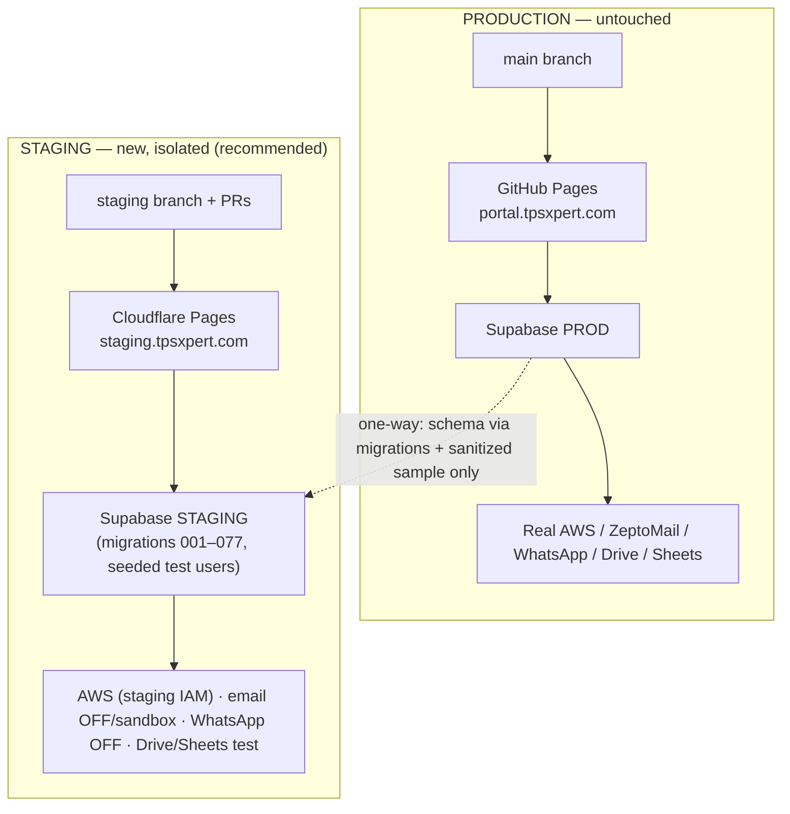

# TPS-OMS — Staging Hosting & Supabase Strategy (17)

**Purpose:** A complete, repo-specific decision plan for **where** to host the staging frontend and **how** to build a fully isolated staging Supabase + integrations — so we can pick one architecture before any implementation.
**Scope:** Analysis, comparison, and recommendation only. **No infrastructure is created or changed.** Phase 1 (`staging` branch) is done; this prepares Phase 2.
**Related Documents:** `08_DEPLOYMENT_INFRASTRUCTURE.md`, `15_ENTERPRISE_IMPLEMENTATION_MASTERPLAN.md`, `16_STAGING_ENVIRONMENT_IMPLEMENTATION_PLAN.md`.
**Version:** 1.0 · **Creation Date:** 2026-07-14 · **Last Verification Date:** 2026-07-14
**Repository Branch:** `staging` (active) · **Commit Hash:** `9558f90` (identical to `main`; docs uncommitted)

> Verified constraints driving this plan: the frontend is a **pure static Vite SPA** reading env at **build time** (`import.meta.env.VITE_SUPABASE_URL/ANON_KEY`), `base:'/'`, SPA deep-links handled by a GitHub-Pages `404.html` hack, backend entirely on Supabase (13 edge fns, 77 migrations, 4 buckets), and integration **config gates** (`email_enabled`, `whatsapp_enabled`) already exist. Production is on GitHub Pages (`portal.tpsxpert.com`) and must not be touched.

## Table of Contents
1. What "Staging Host" Must Do Here
2. Hosting Options Comparison
3. Recommended Host
4. Supabase Staging Strategy (project, DB, storage, edge, auth, Face ID, env, integrations)
5. Integration Isolation Matrix (critical safety)
6. Recommended Architecture (ONE) + Justification + Rejections
7. Diagram
8. Pre-Implementation Checklist / Inputs

---

## 1. What "Staging Host" Must Do Here

Because the app is a **static SPA + Supabase backend**, the staging host only needs to: (a) build a Vite bundle with **staging** `VITE_*` env vars, (b) serve static files with **SPA fallback** (all routes → `index.html`), (c) deploy from the **`staging`** branch (and ideally PR previews), (d) offer **instant rollback**, and (e) **never touch** the production Pages pipeline. No server-side rendering, no serverless functions on the host (that's Supabase). This makes **every** candidate technically compatible; the decision is about **operational features**, not capability.

## 2. Hosting Options Comparison

| Criterion | Cloudflare Pages | Vercel | Netlify | Render (Static Site) | GitHub Pages (separate repo) |
|---|---|---|---|---|---|
| **Compatibility** (static Vite SPA) | ✅ full | ✅ full | ✅ full | ✅ full | ✅ full |
| **Build from `staging` branch** | ✅ native | ✅ native | ✅ native | ✅ native | ⚠️ needs 2nd repo/mirror |
| **Per-PR preview URLs** | ✅ | ✅ (best UX) | ✅ | ⚠️ limited | ❌ none |
| **Per-env build env vars** | ✅ UI | ✅ UI | ✅ UI | ✅ UI | ⚠️ via Actions secrets only |
| **SPA fallback config** | ✅ native (`_redirects`/rules) | ✅ native | ✅ native (`_redirects`) | ✅ native | ⚠️ uses existing `404.html` hack |
| **Instant rollback** | ✅ one-click | ✅ one-click | ✅ one-click | ✅ | ⚠️ re-deploy prev commit |
| **Custom subdomain** (`staging.tpsxpert.com`) | ✅ | ✅ | ✅ | ✅ | ✅ |
| **Cost (this workload)** | **Free** (generous) | Free (Hobby; non-commercial caveat) | Free (100 GB/mo) | Free static | Free |
| **Ease of maintenance** | High | High | High | Medium | Medium (repo sync overhead) |
| **Risk to production** | **None** (separate host) | None | None | None | None (separate repo) but sync risk |
| **Similarity to prod** (prod = Pages) | Medium (diff host, same static output) | Medium | Medium | Medium | **Highest** (same platform) |
| **Recommendation** | **Primary** | Strong alt | Viable | Weaker | Only if "must stay on GitHub" |

**Per-option notes (project-specific):**
- **Cloudflare Pages** — ideal for a static SPA: free, fast global CDN, native SPA routing, per-branch + PR previews, per-env vars, one-click rollback. No serverless needed (Supabase is the backend). Lowest cost, lowest risk, easiest ongoing maintenance.
- **Vercel** — best PR-preview developer UX and env management; equally capable. Caveat: the free "Hobby" plan is intended for **non-commercial** use — this is a **commercial** business app, so a paid seat may be required for compliant use (adds cost). Otherwise excellent.
- **Netlify** — very similar to Cloudflare/Vercel; native `_redirects` SPA fallback; free tier fine for staging bandwidth. Solid alternative; nothing project-specific favors it over Cloudflare.
- **Render (Static Site)** — works, but preview/branch UX is weaker than the three above and offers less for the same effort; better suited to services than static SPAs.
- **GitHub Pages (separate repo, e.g. `tps-oms-staging`)** — highest *similarity* to production (same platform, same `404.html` SPA hack), and keeps everything on GitHub. But: **no PR previews**, env only via Actions secrets, requires **mirroring/syncing** the `staging` branch into a second repo (extra maintenance + drift risk), and rollback is a re-deploy. Chosen only if there is a hard requirement to stay 100% on GitHub.

## 3. Recommended Host

**Cloudflare Pages** (primary), with **Vercel** as the equal-quality alternative if you prefer its PR-preview UX and are willing to pay for a commercial seat. Rationale: the app is a pure static SPA, so we want the host that maximizes **previews + env isolation + instant rollback at zero cost and zero production risk** — Cloudflare Pages delivers all of that on a free, commercial-friendly tier.

## 4. Supabase Staging Strategy

### 4.1 Staging Supabase project — **separate project (recommended)**
Create a **dedicated staging Supabase project** (free tier), **same region `ap-south-1`** for parity. A separate project gives fully isolated DB + Auth + Storage + edge + secrets. *(Supabase preview branches are an alternative but require a paid plan and are ephemeral/GitHub-tied; a persistent free-tier project is simpler and always-on.)*

### 4.2 Cloning the database structure — **replay migrations, not data**
- The **77 migrations are the source of truth.** Apply `001…077` in order to the staging project (via Supabase CLI `db push` or SQL) → exact schema parity (40 tables, 11 enums, 52 functions, 27 triggers, RLS, 2 views).
- Add a committed **`supabase/config.toml`** (staging-linked) so the CLI can deploy migrations + functions reproducibly (this is the moment to introduce CLI-based deploys).
- **Do not restore a production dump as the schema source** — migrations keep staging = repo. (A schema-only dump is a fallback if migration replay reveals drift.)
- **Data:** seed a **small synthetic/anonymized** set for testing; **never copy real client/employee/attendance data**. Direction is always **prod → staging, sanitized**, never reverse.

### 4.3 Storage buckets
- Recreate all four: `avatars`, `attendance`, `face-refs` (from migrations 015/019/075) **and `documents` explicitly** (it is *not* created by any migration — a known gap; staging must create it or document features break).
- **Do NOT copy** real `attendance` selfies or `face-refs` (biometric/PII). Seed **synthetic** images for testing.

### 4.4 Edge Functions
- Deploy all **13** functions to staging via the **Supabase CLI** (`supabase functions deploy`) — the CLI resolves `_shared/rekognition.ts` cleanly (unlike the MCP bundler, which required inlining). Staging is the place to standardize on CLI deploys.
- Set **staging** edge secrets (see 4.7/§5). Deploy to prod only after staging validation.

### 4.5 Authentication
- Use staging's **own Supabase Auth** (fresh). **Create a handful of seeded test users** covering each role (super_admin, director, manager, executive, accounts, hr, auditor) via the staging `admin_create_user`/dashboard.
- **Do not migrate production auth users** (PII + you should not move password hashes). Testers use dedicated staging accounts.

### 4.6 Face ID
- Enrollment/verification will call **AWS Rekognition** from staging edge functions. Use a **separate AWS IAM access key scoped for staging** (same account is fine) so staging usage/cost/blast-radius is isolated and revocable. `face-refs` starts **empty**; testers enroll **their own** faces on staging. No production face data is copied. Liveness is unchanged (not implemented yet either side).

### 4.7 Environment variables
| Variable | Production | Staging |
|---|---|---|
| `VITE_SUPABASE_URL` / `_ANON_KEY` | prod project (GitHub secret) | **staging project** (host env UI) |
| `VITE_APP_URL` | `portal.tpsxpert.com` | `staging.tpsxpert.com` |
| Edge secrets (`AWS_*`, `ZEPTOMAIL_TOKEN`, `MAIL_FROM`, `DRIVE_SUB_EMAIL`, `SHEETS_SYNC_TOKEN`, `SITE_URL`) | prod values (prod project) | **test/sandbox values** (staging project) |
- Two strictly separate sets. The staging frontend must **never** hold prod Supabase keys (that would defeat isolation).

### 4.8 Third-party integrations — **isolate or disable** (see §5)
This is the highest-risk area: several integrations, if pointed at production resources, cause **real-world side effects** (emails to clients, WhatsApp to staff, Drive folder creation/trashing on the real client Drive). Each must be neutralized on staging.

## 5. Integration Isolation Matrix (critical safety)

| Integration | Risk if pointed at prod | Safe staging approach |
|---|---|---|
| **AWS Rekognition** (face) | Cost only (read-only compare) | Separate staging IAM key; low risk; enroll test faces |
| **ZeptoMail** (email) | **Sends real emails to staff/clients** | Set `reminder_settings.email_enabled=false` on staging, **or** use a sandbox sender + internal-only test inbox allowlist. Never real recipients. |
| **Meta WhatsApp** | **Sends real WhatsApp to staff** | Set `app_settings.whatsapp_enabled=false` on staging (gate already exists), **or** a Meta **test number**. Never real numbers. |
| **Google Drive** | **Creates/trashes real client folders** | Separate Google **service account + test root folder**, or disable `drive-ops` on staging. Never the prod Drive. |
| **Google Sheets** (client sync) | **Overwrites the real client sheet** | Different `SHEETS_SYNC_TOKEN` + a **test sheet**. Never connect the real sheet. |
| **pg_cron** (reminders) | Replayed migrations schedule cron that **calls the above** | After migration replay, ensure staging integration flags are **off/sandbox before cron runs**, or drop/disable the staging cron jobs. |

> **Key point:** replaying migrations on staging will recreate the `pg_cron` reminder jobs; those jobs call the notification edge functions. So the email/WhatsApp/Drive isolation above **must be in place before** (or instead of) enabling staging cron — otherwise a staging cron tick could message real people.

## 6. Recommended Architecture (ONE)

**Staging frontend on Cloudflare Pages (from the `staging` branch, with PR previews) → a dedicated staging Supabase project (free tier, ap-south-1) built by replaying the 77 migrations + CLI-deployed edge functions, with all third-party integrations set to sandbox/disabled. Production stays entirely on GitHub Pages + the existing Supabase project — untouched.**

```
staging branch → Cloudflare Pages (staging.tpsxpert.com)
                       │  VITE_* = STAGING keys (build-time)
                       ▼
        Staging Supabase project (isolated)
        DB (migrations 001–077) · Storage (4 buckets, synthetic) ·
        Auth (seeded test users) · 13 edge fns (sandbox secrets) ·
        integrations: email OFF/sandbox, WhatsApp OFF, Drive/Sheets test
```

**Justification (specific to this project):**
- The app is a **static SPA** → Cloudflare Pages is the cheapest, lowest-risk host that adds **previews + env isolation + instant rollback**, which production's GitHub Pages lacks — and it **never touches** the live pipeline.
- Backend logic lives in **DB + edge** → only a **separate Supabase project** provides true isolation; migration-replay guarantees **schema parity with the repo** (not a data copy), avoiding the data-drift/cutover problem entirely (Option A).
- Existing **config gates** (`whatsapp_enabled`, `email_enabled`) make integration isolation cheap and reliable.

**Why the other options were rejected:**
- **Vercel** — equally capable and slightly better PR-preview UX, but the free tier is **non-commercial**; this is a commercial app, so compliant use likely needs a **paid seat**. Rejected as *primary* on cost/licensing, kept as the recommended paid alternative.
- **Netlify** — no project-specific advantage over Cloudflare Pages; comparable but not better. Rejected as a tie-breaker loss (Cloudflare's free tier + CDN are marginally better for this static workload).
- **Render** — weaker preview/branch workflow for static SPAs; more suited to long-running services. Rejected on developer-workflow fit.
- **GitHub Pages (separate repo)** — highest prod-similarity but **no PR previews**, env only via Actions secrets, and requires **maintaining a second repo in sync** (drift + overhead). The static output is identical across hosts, so the "similarity" edge is negligible while the workflow cost is real. Rejected on maintainability/features.
- **Shared/production Supabase for staging (preview-only)** — rejected outright: the frontend reads `VITE_SUPABASE_URL` at build, so a preview would hit **production data** — the exact risk we are eliminating.

## 7. Diagram



## 8. Pre-Implementation Checklist / Inputs (awaiting your approval)

To execute Phase 2 I will need you to confirm/provide:
1. **Host:** Cloudflare Pages (recommended) or Vercel?
2. **Authorize** creating the **staging Supabase project** (free tier, ap-south-1) and the org to use.
3. **Subdomain:** approve `staging.tpsxpert.com` DNS (does not touch `portal`).
4. **Integration creds for staging:** a staging AWS IAM key; decision to **disable** email/WhatsApp on staging vs use sandbox; a **test Google service account + folder** and **test Sheet + token** (or disable Drive/Sheets on staging).
5. **Test users:** who should have staging login accounts (which roles).

---

*Plan grounded in the current repository at commit `9558f90` on branch `staging`. No infrastructure, code, or configuration was created or modified. Implementation awaits your approval on Section 8.*
