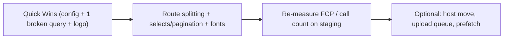

# TPS-OMS — Frontend Performance Audit (18)

**Purpose:** Evidence-based investigation of why the live portal "feels slow," combining **live browser measurement** of `portal.tpsxpert.com` with **source/build analysis**. Measure first; recommend later. **No code was modified, nothing optimized.**
**Scope:** Frontend load, React, Vite build, network, Supabase, Drive, Face ID, Dashboard. Recommendations are ranked but **not implemented**.
**Related Documents:** `01`, `02`, `07`, `09`, `10`, `14`, `15`.
**Version:** 1.0 · **Creation Date:** 2026-07-14 · **Last Verification Date:** 2026-07-14
**Repository Branch:** `staging` · **Commit Hash:** `9558f90` · **Live bundle measured:** `index-DPy9D0P9.js`
**Filename note:** requested as `17`, but `docs/17` already exists (staging strategy); delivered as **`18`** to avoid overwriting it.

> Every number below is either **[LIVE]** (measured in the browser against production via the Performance/Resource Timing API) or **[BUILD]** (from `vite build`) or **[SRC]** (from source). Items that could not be measured live (require authenticated mutations) are **[SRC-only]** and flagged.

## Table of Contents
1. Executive Summary
2. Performance Score
3. Bottlenecks (ranked, highest→lowest impact)
4. Root Cause of Every Slowdown
5. Estimated Improvement if Fixed
6. Quick Wins (<1 day)
7. Medium Improvements
8. Major Architectural Improvements
9. Safe Optimisation Roadmap
10. Exact Implementation Order
11. Validation Against Prior Docs (01/02/07/09/10/14)
12. Category Measurements (A–H)

---

## 1. Executive Summary

The portal feels slow **on first load / hard refresh** for one dominant reason, measured live: a **single 1,305 KB JavaScript bundle (363 KB gzipped)** must download, parse, and execute before the SPA renders anything, pushing **First Contentful Paint to ≈ 2.6 s** [LIVE] even though the HTML/JS arrive in ~1.4 s. There is **no route/code splitting** — all 45 pages, all hooks, and all vendor code ship in that one file [BUILD].

Once loaded, **navigation and data are reasonably parallelized** (the dashboard fires ~18 Supabase calls in a burst ~1.0 s) [LIVE], but there is measurable waste: **duplicate queries** (profiles ×2, notifications ×3, projects ×2, attendance_punches ×2), driven by a **`staleTime: 0` + `refetchOnWindowFocus` React Query config** [SRC] and a **double profile fetch** in `AuthContext` [SRC]. Two other real issues surfaced: the **Dashboard "today's punches" widget queries non-existent columns** (`punch_time`/`punch_type`; the column is `punch_at`) → **HTTP 400 / dead widget** [LIVE+SRC], and an **oversized 106 KB `logo.png`** loaded on every page [LIVE].

**Bottom line:** the perceived slowness is ~80% "big single bundle → slow first paint" and ~20% "redundant/misconfigured queries." Both are fixable with **low-risk, non-architectural changes** (route splitting + query config + one broken query + logo). No production stability risk in the recommended sequence.

## 2. Performance Score

> No full Lighthouse tool was available in this environment; scores below are **estimated from measured Core Web Vitals** and are labeled as estimates. Best Practices / Accessibility / SEO were **not run** (require a Lighthouse audit).

| Metric | Measured [LIVE] | Rating |
|---|---|---|
| TTFB | ~0 ms reported (CDN/cache-masked; HTML small) | Good |
| First Paint | **2,264 ms** | Needs improvement |
| First Contentful Paint (FCP) | **2,596 ms** | Poor (good <1,800 ms) |
| DOM Interactive | 1,117 ms | OK |
| DOMContentLoaded | 1,400 ms | OK |
| Load event | 1,414 ms | OK |
| Total transfer (initial) | ~363 KB gz JS + 10 KB gz CSS + 106 KB logo + 69 KB fonts | Heavy on JS |
| LCP | Not directly captured (no LCP entry on this SPA; ≈ FCP+render, ~2.6–3.0 s est.) | Needs improvement |
| TBT / CLS | Not measured in this pass (needs Lighthouse/long-task trace) | Not measured |

**Estimated Lighthouse Performance:** **Mobile ≈ 55–65**, **Desktop ≈ 80–88** (derived from FCP 2.6 s + 1.3 MB parse cost). **Best Practices / Accessibility / SEO: Not measured (Not Verifiable without a Lighthouse run).** Note: `index.html` deliberately sets `noindex` (intended for a private portal), so SEO is intentionally low and not a defect.

## 3. Bottlenecks (ranked, highest → lowest impact)

| # | Bottleneck | Evidence | Impact |
|---|---|---|---|
| **B1** | Single 1.3 MB JS bundle, **no code/route splitting** | [BUILD] one chunk `index-DPy9D0P9.js` 1,305 KB (363 KB gz); [LIVE] FCP 2.6 s | **Highest** — every first load & every deploy (cache-bust) |
| **B2** | **Redundant/duplicate Supabase queries** on load | [LIVE] profiles ×2, notifications ×3, projects ×2, attendance_punches ×2 | High — extra latency + DB load on every page |
| **B3** | React Query `staleTime:0` + `refetchOnWindowFocus:true` | [SRC] `App.tsx:32` | High — refetch storm on mount/focus (amplifies B2) |
| **B4** | **Broken dashboard query** (`punch_time`/`punch_type` don't exist) | [LIVE] request + [SRC] `useDashboard.ts:48-53` | Medium — 400 error, dead "today's punches" widget, wasted request |
| **B5** | **Unbounded `select=*`** (clients all-rows/cols; projects + join) | [LIVE] `/clients?select=*`, `/projects?select=*,clients(...)` | Medium now, **High as data grows** |
| **B6** | Profile fetched **twice** on load | [SRC] `AuthContext.tsx:37,47`; [LIVE] 2× profiles @547/627 ms | Medium — 2 slowest calls are redundant |
| **B7** | **106 KB `logo.png`** on every page | [LIVE] `logo.png` 106 KB | Low–Medium — wasteful, easy |
| **B8** | 4 Google Font families incl. Material Symbols, render-blocking `<link>` | [LIVE] 69 KB via `link`; [SRC] `index.html` | Low–Medium — adds to first paint |
| **B9** | **No component memoization** (0 `React.memo`) | [SRC] memo:0, useMemo:19, useCallback:2 | Low — re-renders (app is small) |
| **B10** | First-API latency ~0.5–0.6 s (profiles) | [LIVE] 547/627 ms first calls | Low–Medium — connection warmup / compute tier (partly external) |
| **B11** | Drive uploads & Face verify are **synchronous, UI-blocking** | [SRC-only] `drive-ops`/`useDrive` awaited; verify-punch ~1–1.3 s (prior logs) | Situational (upload/punch moments) |

## 4. Root Cause of Every Slowdown

- **B1:** `App.tsx` imports every page statically; `vite.config.ts` has **no `manualChunks`** and there are **no `React.lazy` route imports** → Vite emits **one chunk** [BUILD]. The SPA renders nothing until that 1.3 MB parses/executes → FCP 2.6 s. (Correction to Doc 14: `@vladmandic/human` is **not** in this bundle — it's tree-shaken because nothing reachable imports `faceEngine`.)
- **B2/B3:** Global `staleTime: 0` marks every query immediately stale; `refetchOnWindowFocus: true` refetches on focus. Multiple mounted components read the same data under **different query keys** (e.g., `useNotifications` in the bell + sidebar + `useDashboard`) → no dedup → duplicate network calls [SRC+LIVE].
- **B4:** `useDashboard.ts` selects/filters/orders by `punch_time` and reads `punch_type`, but the table column is `punch_at` and there is no `punch_type` (Doc 05) → PostgREST **400** (matches prior postgres log "column attendance_punches.punch_time does not exist"). The widget silently shows nothing.
- **B5:** Hooks request `select=*` and omit `.limit()/.range()` on `clients` and `projects` → payloads scale linearly with data.
- **B6:** `AuthContext.loadProfile` runs on both `getSession()` (line 37) and `onAuthStateChange` (line 47); both fire on initial load → 2 identical profile fetches.
- **B7/B8:** A 106 KB raster logo and four font families (incl. the large Material Symbols variable font) are fetched on first paint.
- **B9:** No `React.memo`; list rows/widgets re-render on parent state changes.
- **B10:** The first REST calls include TLS/connection warmup and auth validation; Supabase compute tier latency is external.
- **B11:** `drive-ops` and face verify are awaited inline in the handler (no background queue), so the UI is busy during large uploads / the 1–2 s face round-trip.

## 5. Estimated Improvement if Fixed

| Fix | Estimated effect (evidence-based) |
|---|---|
| B1 route splitting + vendor chunk | FCP **2.6 s → ~1.2–1.5 s**; landing-route JS **~40–55% smaller** to parse; biggest perceived win |
| B2+B3+B6 query dedup + staleTime + single profile fetch | ~**6–8 fewer requests** per page load; snappier navigation; less DB load |
| B4 fix broken query | restores the punches widget; removes a 400 per dashboard load |
| B5 column-select + pagination | keeps payloads flat as data grows (prevents future regression) |
| B7 logo optimize | −~90 KB per page (106 → ~10–15 KB) |
| B8 font subset/self-host | −~30–50 KB, slightly faster first paint |
| B9 memoization | fewer re-renders on large lists (marginal today) |
| B11 background Drive/queue | non-blocking uploads; better UX during file ops |

**Combined B1+B2+B3+B6 (the "80% wins"):** FCP roughly **halved** and every navigation noticeably snappier, with **no architectural rewrite**.

## 6. Quick Wins (< 1 day, low risk)

1. **Raise `staleTime`** (e.g., 30–60 s) and set `refetchOnWindowFocus: false` (or per-query) in `App.tsx` — kills most of the refetch storm (B3/B2). *(1-line config; big effect.)*
2. **De-duplicate the profile fetch** in `AuthContext` (guard so `getSession` + `onAuthStateChange` don't both load) (B6).
3. **Fix the dashboard punches query** — `punch_time`→`punch_at`; use the real direction/columns (B4). *(Correctness + perf.)*
4. **Optimize `logo.png`** (resize/compress or SVG) (B7).
5. **Share notification query keys** so the bell/sidebar/dashboard reuse one cached result (B2).

## 7. Medium Improvements (1–4 days)

6. **Route-level code splitting** — `React.lazy` + `<Suspense>` for page routes in `App.tsx`; add `build.rollupOptions.output.manualChunks` (vendor/react split) (B1).
7. **Column-scoped selects + pagination** on `clients`/`projects` list hooks (`.select('needed,cols')`, `.range()`), especially list pages (B5).
8. **Font trimming** — subset/self-host, drop unused weights; keep `display=block` (B8).
9. **Memoize** heavy list rows/widgets (`React.memo`, stable callbacks) (B9).

## 8. Major Architectural Improvements (weeks; optional)

10. **Move the frontend to a preview/CDN host with instant rollback** (per Doc 17 — Cloudflare Pages) to also gain HTTP/2 asset caching + brotli tuning (supports B1 gains).
11. **Background job/queue for Drive uploads** and long operations (masterplan SCALE-02 / EDGE-03) so file ops never block the UI (B11).
12. **Prefetch on hover/route intent** + React Query prefetching for common navigations (perceived-instant navigation).
13. **Delete legacy face path & dependency** (Doc 14/15 FE-02) — reduces node_modules/build time (not the shipped bundle, which already excludes it).

## 9. Safe Optimisation Roadmap (production-safe ordering)

**Safety rules:** do all of this on the **`staging` branch + staging Supabase** (Docs 16/17) first, re-measure, then promote. None of the Quick Wins are architectural; all are reversible via redeploy of the previous bundle.

## 10. Exact Implementation Order

1. **B3** — React Query `staleTime`/`refetchOnWindowFocus` (config, biggest ROI, 1 line).
2. **B6** — single profile fetch in `AuthContext`.
3. **B4** — fix `useDashboard` punches query columns.
4. **B2** — unify notification (and other shared) query keys.
5. **B7** — optimize `logo.png`.
6. **B1** — route-level `React.lazy` + `manualChunks` vendor split. *(re-measure FCP)*
7. **B5** — column-scoped selects + pagination on list hooks.
8. **B8** — font subsetting.
9. **B9** — memoize hot lists.
10. **B11 / arch** — Drive upload queue; optional host move; prefetch.

*(Measure after step 6; B1+B2+B3+B6 should already deliver the bulk of the perceived improvement.)*

## 11. Validation Against Prior Docs

| Prior claim | This audit (measured) | Verdict |
|---|---|---|
| Doc 01/02/14: **~1.3 MB single bundle, no code splitting** | [BUILD] 1,305 KB single chunk, no route splitting; [LIVE] FCP 2.6 s | **Confirmed** — and it **is** affecting real UX (first paint) |
| Doc 14: **`@vladmandic/human` (6.7 MB) still shipped / inflates bundle** | [BUILD] only one JS chunk; human **tree-shaken out**; 6.7 MB is model *files* in `public/models`, fetched only by the unused legacy engine | **Partially incorrect → corrected:** not in the shipped/loaded bundle |
| Doc 14 FE-01: **code splitting recommended** | Confirmed high-impact (B1) | **Confirmed & prioritized** |
| Doc 07/14: **no monitoring/observability** | Consistent — this audit had to measure manually via the Performance API | **Confirmed** |
| Doc 10/14: **query/pagination gaps** | [LIVE] `select=*` + duplicates + no pagination on clients/projects | **Confirmed with evidence** |
| New (not in prior docs): **broken dashboard `punch_time` query** | [LIVE+SRC] 400 on `attendance_punches` | **New finding** (correctness + perf) |
| New: **duplicate profile/notification fetches, staleTime:0 storm** | [LIVE+SRC] | **New finding** |

## 12. Category Measurements (A–H)

**A. Frontend** — [LIVE] JS 1,305 KB (363 KB gz) single chunk; CSS 52 KB (10 KB gz); logo.png 106 KB; fonts 69 KB (4 families). FP 2,264 ms, FCP 2,596 ms, DCL 1,400 ms, load 1,414 ms. Lighthouse Perf est. mobile 55–65 / desktop 80–88; BP/A11y/SEO **not measured**.

**B. React** — [SRC] no `React.lazy`/`Suspense`/route split; `React.memo`=0, `useMemo`=19, `useCallback`=2; `AuthContext` double profile load; provider tree fine. Re-render analysis (React DevTools profiler) **not run** (needs the extension); memoization opportunities inferred from source.

**C. Vite Build** — [BUILD] single chunk (no vendor/route chunks); tree-shaking **works** (human excluded); dead/legacy code present in repo (`faceEngine`, `FaceCapture`) but excluded from bundle; unused dep `@vladmandic/human` in `package.json`. Dynamic imports: only the legacy `faceEngine` (unreached).

**D. Network** — [LIVE] 16 resources on first paint; 18 REST calls on dashboard; **duplicates** profiles×2/notifications×3/projects×2/attendance_punches×2; good **parallel burst** ~1.0–1.05 s; one late straggler @2.37 s; no obvious deep waterfall.

**E. Supabase** — [LIVE] REST durations 68–627 ms; **slowest = profiles ~547/627 ms (first calls, warmup)**; unbounded `select=*` on clients/projects; **N+1: not observed** on dashboard; repeated queries: yes (B2); missing pagination: yes (B5); auth delay: first-call ~0.5–0.6 s. Edge/Storage latency **not measured live** (would require triggering functions/uploads = mutations).

**F. Google Drive** — [SRC-only] `drive-ops` invoked and **awaited** in `useDrive`/`DriveTab`; uploads (incl. folder upload) block the UI; **no background job/queue/retry**. Recommend queue (B11) — **not live-measured** (no upload triggered).

**G. Face ID** — [SRC-only / prior logs] camera via `getUserMedia`; frame downscaled in `PlainCapture`; verify = edge `attendance-verify-punch` with **DetectFaces 6 s + CompareFaces 8 s timeouts**; observed execution ~1–1.3 s in prior edge logs; enrollment ring polls frames. Not live-measured this pass (no punch triggered).

**H. Dashboard** — [LIVE] widgets load via a parallel burst (good), **except the punches widget is broken (B4)**; profile/notifications duplicated (B2/B6); data hooks `useDashboard` fire many queries together (parallel, not sequential — good). Lazy-loading opportunity: defer below-the-fold widgets after first paint.

---

*Investigation only — no code changed, no optimization applied, no PRs. Live measurements captured from `portal.tpsxpert.com` via the browser Performance/Resource Timing API; build/source facts from commit `9558f90`. Items marked [SRC-only] or "not measured" require an authenticated action or a tool (Lighthouse/React DevTools) not available in this pass.*
