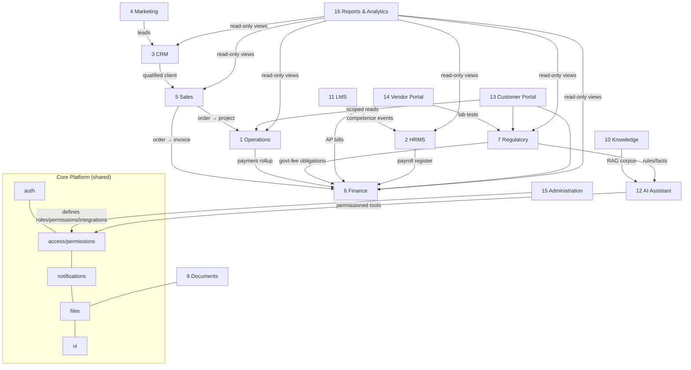

# TPS Enterprise Platform — Module Portfolio & Build Sequence

Companion to `00_ENTERPRISE_ARCHITECTURE.md`. Indexes the module designs, maps their
cross-module dependencies, and recommends the implementation order. **All module designs are
complete. Wave 1 (Administration + Document Management + Knowledge Base) is now implemented and
frozen (tag `wave-1`, staging-only) — see [`03_WAVE1_AS_BUILT.md`](03_WAVE1_AS_BUILT.md); the
remaining modules are design-only. Coding of new modules begins only after approval.**

> **v1.1 (post-validation):** Enterprise Architecture Validation added 2 modules (Expenses & Travel,
> Management System / QMS), corrected a money-unit bug, and made cross-cutting unifications.
> See **`02_ENTERPRISE_ARCHITECTURE_VALIDATION.md`** (the binding amendment layer) and the
> **Wave-1 minimal-table cut** in §3.
>
> **Scope v2.0 (TPS Platform V2 Constitution):** The **Certification Body business is removed** from
> this platform (separate legal entity → separate future platform). The **Certification** module and
> the **Management System / QMS** module are **out of scope**. **Expenses & Travel** is folded into
> **HRMS + Finance** as a sub-domain (no longer a standalone module). Final scope = **Core + 15 feature
> modules**. Reserved docs for the removed capability now live in `_reserved-certification-platform/`.

## 1. Module index

| # | Module | Design | Tables (new/ext) | Anchor entities |
|---|---|---|---|---|
| 1 | Operations | *(migrated to registry; existing)* | reuse | project, stage, task |
| 2 | HRMS | [hrms.md](modules/hrms.md) | 16 new / 2 ext | employee, leave, payroll, attendance |
| 3 | CRM | [crm.md](modules/crm.md) | 8 new / 2 ext | lead, client, contact, referral |
| 4 | Marketing | [marketing.md](modules/marketing.md) | 16 | campaign, segment, content, landing_page |
| 5 | Sales | [sales.md](modules/sales.md) | 16 | deal, quotation, order, price |
| 6 | Finance & Accounts | [finance.md](modules/finance.md) | 11 (absorbs payments) | invoice, payment, govt_fee, ledger |
| 7 | Regulatory | [regulatory.md](modules/regulatory.md) | 9 new / 3 ext | licence, authority_query, soi, compliance |
| 9 | Document Management | [documents.md](modules/documents.md) | 10 (unifies doc tables) | document, version, folder, signature |
| 10 | Knowledge Base | [knowledge.md](modules/knowledge.md) | 8 (evolves knowledge_base) | article, category, embedding |
| 11 | Learning Management | [lms.md](modules/lms.md) | 20 | course, lesson, enrolment, certificate |
| 12 | AI Assistant | [ai-assistant.md](modules/ai-assistant.md) | 8 (pgvector) | conversation, message, tool_call, embedding |
| 13 | Customer Portal | [customer-portal.md](modules/customer-portal.md) | 12 + 6 views | client_user, upload_request, approval, ticket |
| 14 | Vendor Portal | [vendor-portal.md](modules/vendor-portal.md) | 9 | vendor, purchase_order, assignment, deliverable |
| 15 | Administration | [administration.md](modules/administration.md) | 14 new / 2 reuse | role, permission, integration, feature_flag |
| 16 | Reports & Analytics | [reports-analytics.md](modules/reports-analytics.md) | 6 + views layer | saved_report, kpi, schedule |

*(Module numbers 8 and 17–18 are retired: **8 Certification** and **18 Management System / QMS** are
out of scope, and **Expenses & Travel** is no longer a numbered module — the number gap is kept so
existing cross-references stay valid.)*

> **Scope v2.0 note — Expenses & Travel (T&E):** folded into **HRMS + Finance** as a sub-domain
> (employee claim/travel-request/reimbursement in HRMS; approval → payout → bill-to-client in Finance).
> It is **not** a standalone module. The reserved **Certification** and **Management System / QMS**
> docs move to `_reserved-certification-platform/` and are excluded from this scope.

**Core + 15 feature modules** (greenfield + expand-contract on existing). Every design delivers all
13 template sections + ER, flow, screen, and architecture diagrams. The reduced scope keeps early
waves lean — see the **Wave-1 minimal-table cut** in §3 and
`02_ENTERPRISE_ARCHITECTURE_VALIDATION.md` §6.

## 2. Cross-module dependency map

**Read the arrows as "depends on / feeds".** Everything sits on Core; Administration governs
access for all; Reports reads all (read-only, RLS-aware); the two Portals are the only external
surfaces and are tenant-isolated.

## 3. Recommended build sequence (dependency-ordered, post-approval)

Each wave is shippable and testable before the next. Build on `staging`, promote per the
V2→prod plan once ready.

| Wave | Modules | Why this order |
|---|---|---|
| **0 — done** | Core Platform, Operations (registry) | Foundation + proof of pattern (already committed) |
| **1 — ✅ DONE / FROZEN** | Administration, Document Management, Knowledge Base | Permissions registry + DMS + KB underpin every other module. **Shipped** (tag `wave-1`, commit `2546143`, staging-only, additive/EXPAND). As-built record: [`03_WAVE1_AS_BUILT.md`](03_WAVE1_AS_BUILT.md) is the single source of truth for what exists |
| **2 — Revenue spine** | CRM → Sales → Finance | The lead→deal→order→invoice→collection flow; wires into existing Operations. Finance also hosts the Expenses **payout/bill-to-client** sub-domain |
| **3 — Regulated delivery & people** | Regulatory, HRMS | Extend existing licences/queries/SOI + attendance; core consultancy + people ops. HRMS hosts the Expenses **claim/travel-request** sub-domain (T&E folded into HRMS + Finance, not a standalone wave) |
| **4 — Growth & enablement** | Marketing, LMS, AI Assistant | Marketing feeds CRM; LMS feeds HR competence; AI rides on KB + tools |
| **5 — External surfaces** | Customer Portal, Vendor Portal | Tenant-isolated; depend on the internal modules they expose |
| **6 — Insight** | Reports & Analytics | Reads across all modules; built last so its views are stable |

## 4. Platform-wide invariants (verified across all 15 designs)

- **Security in the DB:** every module's tables carry RLS; the two portals use a separate
  external identity (`client_users` / `vendor_users`) with `FORCE ROW LEVEL SECURITY` and a
  SECURITY DEFINER tenant-key helper — provably disjoint from internal `has_role()` policies.
- **Expand-contract everywhere existing tables are touched** (payments, clients, referrals,
  licenses, authority_queries, soi_archive, knowledge_base, documents, attendance) — additive
  first, never destructive; production data model preserved.
- **Notifications/email/WhatsApp only via `core/notifications`** (gated by settings — staging
  stays sandboxed).
- **AI tools + portals never bypass RLS** — they run under the caller's own JWT.
- **New Postgres extensions required for KB/AI:** `vector` (pgvector) + `pg_trgm` — flagged as
  expand-step prerequisites (a DB change to schedule under change-control).

## 5. Approval gate

Per the mandate, **no new module is coded until its design here is approved.** On approval,
implementation proceeds wave-by-wave (each with its own migration set applied to **staging
first**, build-verified, then promoted). Any breaking DB change, new extension, external
account, or billing step will be surfaced for explicit sign-off before it runs.
