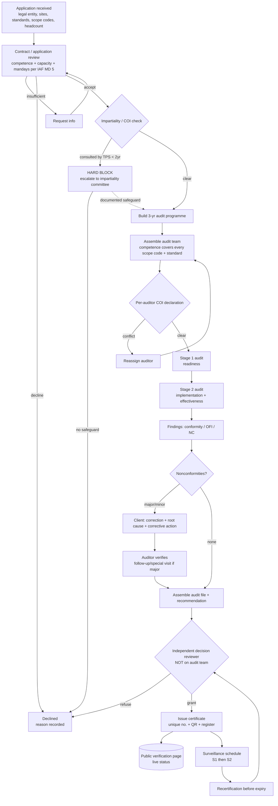
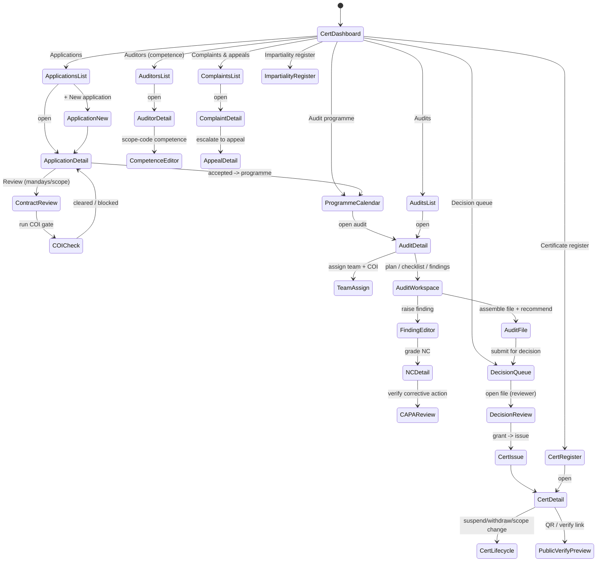
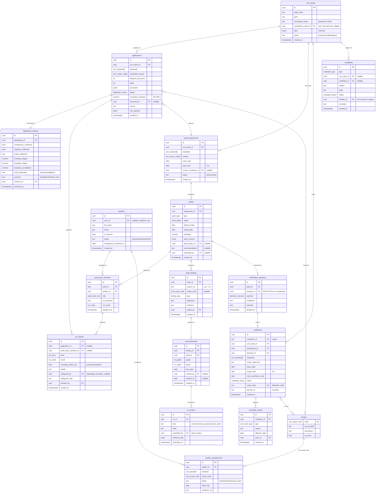
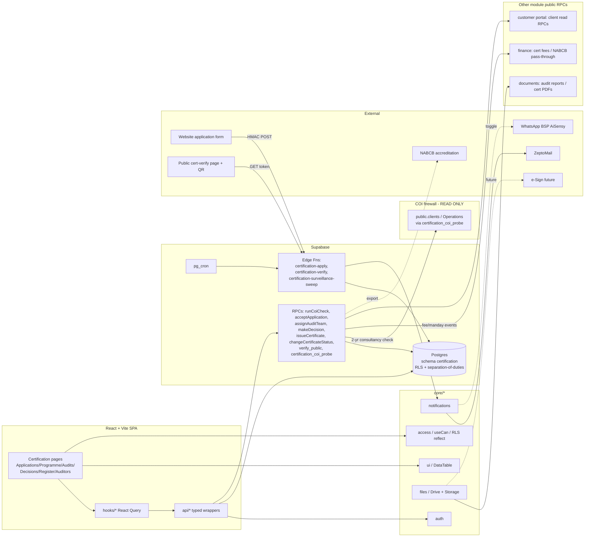

# Certification — Certification Body Management (Module Design)

**Status:** Design (Phase D). Design-only — no code until approved.
**Module key:** `certification`
**Anchor entities:** Application, Audit, Audit finding, Nonconformity, Certification decision, Certificate, Auditor, Scope
**Primary users:** Certification (scheme) manager, Scheme coordinator, CB auditors (lead/team/technical expert), Independent decision reviewers, Impartiality committee, Directors, Accounts (read-only billing), Certified clients (via Customer Portal — read-only).
**Depends on:** `@/core/*` (auth, access, notifications, files, ui, utils). Reads consultancy `public.clients` / Operations **only through a COI firewall** (public read RPC, never shared write). Feeds **Finance** (certification fees, NABCB pass-through), **Documents** (audit reports, certificates), and the **public certificate-verification page** (QR).

> Governed by `docs/architecture/00_ENTERPRISE_ARCHITECTURE.md`. Follows §5 cross-cutting standards. Permission namespace `certification.<entity>.<action>`. All schema changes are expand-contract (§1.4). **This module implements a regulated management system (ISO/IEC 17021-1:2015 + IAF MD 5:2019) for TPS Xperts Global Certification Pvt Ltd — a legally separate business from the consultancy. Impartiality is a first-class, DB-enforced concern, not a UI nicety.**

---

## 1. Purpose & scope

**Business capability.** Certification is the operating system of the **certification body (CB)**. It runs the full ISO/IEC 17021-1 lifecycle for management-system certification: receiving and reviewing **applications**, performing the mandatory **impartiality / conflict-of-interest (COI)** check, building the **audit programme** across the three-year cycle (Stage 1 → Stage 2 → Surveillance 1 → Surveillance 2 → Recertification), assigning **competent auditors** matched to EA/IAF scope codes and standards, executing **audits** (plans, checklists, findings), managing **nonconformities** (major/minor → correction → root-cause → corrective action → verification), taking an **independent certification decision** (made by a reviewer who was not part of the audit team), issuing **certificates** into a tamper-evident **register** with a unique certificate number and **QR verification** (wired to the existing public cert-verify page), and handling **suspension / withdrawal / scope change**, **surveillance scheduling**, and **complaints & appeals**.

**Who uses it.**
- **Scheme (certification) manager** — owns the audit programme, auditor competence register, and scheduling; assembles audit teams; cannot make the certification decision on audits they managed if that breaches independence.
- **Scheme coordinator** — day-to-day: logs applications, books audits, chases NC closure, prepares packs for review.
- **CB auditor** (lead auditor / team auditor / technical expert / auditor-in-training / observer) — plans and executes audits, raises findings and NCs, verifies corrective actions. May be **employee or contracted external** auditor.
- **Independent decision reviewer** — reviews the complete audit file and makes the **certification decision**; must be independent of the audit (ISO 17021 §9.5). Distinct person from anyone who audited that client.
- **Impartiality committee** — oversight body; reviews the impartiality-risk register and safeguards (ISO 17021 §5.2, §6.2); can veto.
- **Director / super_admin** — full visibility, appoints reviewers, signs certificates, owns suspension/withdrawal authority, handles appeals.
- **Accounts** — read-only certification fee/pass-through view (billing runs in Finance).
- **Certified client** — read-only status, findings, NC actions, certificate & schedule via the **Customer Portal** (external surface owned by module 13; this module exposes the read RPCs).

**In scope.** Application & contract review (competence to deliver, scope, mandays per IAF MD 5); impartiality/COI check (org-level 2-year consultancy cooling-off + auditor-level per-assignment declaration); audit programme across the 3-yr cycle; auditor competence register & scope-code assignment; audit planning, checklists, execution, findings; nonconformity lifecycle with root-cause & CA verification; **independent certification decision (separation of duties)**; certificate issue/register/QR; suspension, withdrawal, scope change, reinstatement; surveillance scheduling; complaints & appeals.

**Explicitly NOT in scope (owned elsewhere).**
- **Invoicing / payments / NABCB & lab fee pass-through accounting** → **Finance & Accounts** (this module records fee *events* and mandays; Finance bills and reconciles).
- **Public certificate-verification web page rendering** → the existing public site; this module owns the **verification RPC + register data + QR token**, the public page only *reads* it.
- **Consultancy projects / FSSAI licensing work** → **Operations / Regulatory** (queried read-only across the COI firewall — never merged).
- **Document storage mechanics** → `core/files` (audit reports, certificates stored via Storage/Drive; this module holds metadata + links).
- **External auditor onboarding as platform users / HR records** → **Administration / HRMS** (this module holds the auditor *competence* record; login/identity is Core auth).
- **Email/WhatsApp sending** → `core/notifications` (this module raises typed events; Core delivers).
- **Accreditation body (NABCB) assessment of TPS itself** → tracked as documents/tasks outside this transactional module.
- **The CB's OWN management system (QMS)** → the certification body's *internal* ISO/IEC 17021-1 management system — its own **management review**, **internal audits** of the CB, **CAPA on the CB's own nonconformities** (raised by NABCB or internal audit, as opposed to client NCs which live here), the standing **impartiality committee** as a governance body, and **NABCB self-assessment / accreditation-readiness** — lives in the new **Management System / QMS module** (`management-system.md`). This module owns the *client-facing* certification lifecycle and the *per-audit* impartiality/COI gate; the CB-as-organization's own conformity lives next door. The boundary: client NCs → here; the CB's own NCs → Management System / QMS.

---

## 2. Business workflow

TPS Xperts Global Certification certifies food & QMS clients to **ISO 9001:2015** and **ISO 22000:2018** within EA/IAF scope codes **01, 03, 13, 30**. The end-to-end ISO 17021 motion:

1. **Application.** A prospective client applies (web enquiry → Edge Function, or coordinator entry). Captured: legal entity, sites, standard(s), requested scope codes, employee count / shifts / processes (drives mandays), and any prior certification. Source and any consultancy history are stamped.
2. **Contract / application review (ISO 17021 §9.1.2).** The CB confirms it has the **competence and capacity** for the requested scope, the information is sufficient, differences from any prior understanding are resolved, and it computes **audit duration (mandays)** per **IAF MD 5:2019** (effective personnel + complexity + reductions/additions). Output: accept / decline / more-info, an agreed scope statement, and a quotation handoff to Finance.
3. **Impartiality / COI check (ISO 17021 §5.2, §5.3 — MANDATORY GATE).** Two firewalls, both enforced:
   - **Organization level:** the platform also runs the TPS *consultancy*. The check queries — across the COI firewall RPC — whether the applicant (matched by GSTIN / normalized name) received **management-system consultancy from TPS in the last 2 years**. A hit is a **hard block** (a CB may not certify a client it consulted; ISO 17021 §5.2.5 — minimum 2-year cooling-off) unless the impartiality committee records a documented, justified safeguard.
   - **Body/personnel level:** financial, ownership, or relationship ties are declared and risk-assessed into the **impartiality risk register**; safeguards recorded; committee oversight.
4. **Audit programme (ISO 17021 §9.1.3).** On acceptance, the manager generates the **3-year programme**: Stage 1, Stage 2 (initial certification), then **Surveillance 1** and **Surveillance 2** (at least once/calendar year, first within 12 months of Stage 2 decision), then **Recertification** before the 3-year expiry. Dates, mandays, and standards per event are planned.
5. **Auditor competence & assignment (ISO 17021 §7, §9.2.2).** For each audit the manager assembles a team whose competence **covers every requested scope code and standard** (validated against the auditor competence register). **Each assigned auditor signs a per-assignment COI declaration** — an auditor who consulted, is employed by, or has ties to the client is blocked from that assignment.
6. **Audit planning & execution (ISO 17021 §9.2, §9.3, §9.4).** Lead auditor issues an **audit plan** (objectives, scope, criteria, schedule) to the client, runs opening → evidence gathering against a **checklist** → findings (conformity / opportunity-for-improvement / nonconformity) → closing meeting. A **Stage 1** checks readiness (documentation, site-specific conditions, management-system understanding) and sets Stage 2 focus; **Stage 2** evaluates implementation & effectiveness.
7. **Nonconformities (ISO 17021 §9.4.8, §9.5).** Each NC is graded **major** or **minor**. The client submits **correction**, **root-cause analysis**, and **corrective action**; the auditor **verifies** (evidence review, or a follow-up/special visit for majors). Majors typically must be closed before a positive decision; minors may close with a committed plan verified at next surveillance.
8. **Certification decision (ISO 17021 §9.5 — INDEPENDENT REVIEW & DECISION).** The complete audit file (plan, findings, NCs + verification, recommendation) goes to a **decision reviewer who was not a member of the audit team**. The reviewer confirms the evidence, resolves any conflict, and **grants / refuses / grants-with-conditions**. The system **hard-prevents** the same person from auditing and deciding the same client (separation of duties enforced at the DB).
9. **Certificate issuance & register (ISO 17021 §8.3, §9.5).** On a grant, a **certificate** is issued: unique **certificate number**, standard, scope statement, scope codes, site(s), issue/expiry (3-yr) and surveillance-due dates, and a **QR/verification token**. It lands in the **public register**, and the QR resolves to the existing **public verification page** showing live status.
10. **Surveillance & maintenance.** The programme drives surveillance scheduling; each surveillance can raise NCs and confirm continued conformity; missing a surveillance triggers **suspension** rules.
11. **Suspension / withdrawal / scope change (ISO 17021 §8.5, §9.6).** Certificates can be **suspended** (e.g., unclosed major NC, missed surveillance, misuse of mark), **restored**, **withdrawn**, or have **scope reduced/extended** (extension may need an extra audit). Every transition is logged and **immediately reflected on the public verification page**.
12. **Recertification (ISO 17021 §9.6).** Before expiry, a recertification audit evaluates the whole system + performance over the cycle → decision → new 3-year certificate.
13. **Complaints & appeals (ISO 17021 §9.7, §9.8).** Complaints about a certified client or the CB, and appeals against CB decisions, are logged, investigated by persons **not involved in the subject matter**, and resolved with records; appeal handling is independent.

---

## 3. Screen flow

Routes are lazy-loaded under `/certification`. List state (tab/filter/search/page) persists to the URL via `core/hooks` `useUrlFilters`. The **audit workspace** and **decision review** are deliberately separate surfaces to reinforce separation of duties.

**Screen inventory**

| Route | Screen | Purpose | Guard (permission) |
|---|---|---|---|
| `/certification` | CertDashboard | KPIs: due surveillances, open NCs, decision queue, expiring certs | `certification.dashboard.view` |
| `/certification/applications` | ApplicationsList | Filter/search applications | `certification.application.view` |
| `/certification/applications/new` | ApplicationNew | Log new application | `certification.application.create` |
| `/certification/applications/:id` | ApplicationDetail | Fields, docs, review, COI status | `certification.application.view` |
| `/certification/applications/:id/review` | ContractReview | Competence, scope, IAF MD 5 mandays | `certification.application.review` |
| `/certification/applications/:id/coi` | COICheck | Org + personnel COI gate result | `certification.impartiality.check` |
| `/certification/programme` | ProgrammeCalendar | 3-yr cycle calendar, surveillance due | `certification.programme.view` |
| `/certification/audits` | AuditsList | All audit events | `certification.audit.view` |
| `/certification/audits/:id` | AuditDetail | Audit header, team, plan, status | `certification.audit.view` |
| `/certification/audits/:id/team` | TeamAssign | Assign auditors + capture COI | `certification.audit.assign` |
| `/certification/audits/:id/workspace` | AuditWorkspace | Plan, checklist, findings capture | `certification.audit.execute` |
| `/certification/audits/:id/findings/:fid` | FindingEditor | Raise/edit finding | `certification.finding.create` |
| `/certification/nc/:id` | NCDetail | NC grade, correction, root cause, CA | `certification.nc.view` |
| `/certification/nc/:id/verify` | CAPAReview | Verify corrective action / close | `certification.nc.verify` |
| `/certification/audits/:id/file` | AuditFile | Assemble file + recommendation, submit | `certification.audit.execute` |
| `/certification/decisions` | DecisionQueue | Files awaiting independent decision | `certification.decision.view` |
| `/certification/decisions/:id` | DecisionReview | Reviewer reads file, decides | `certification.decision.make` |
| `/certification/certificates` | CertRegister | Certificate register (internal) | `certification.certificate.view` |
| `/certification/certificates/:id` | CertDetail | Certificate + lifecycle + QR | `certification.certificate.view` |
| `/certification/certificates/:id/lifecycle` | CertLifecycle | Suspend/withdraw/scope change/restore | `certification.certificate.suspend` |
| `/certification/auditors` | AuditorsList | Auditor competence register | `certification.auditor.view` |
| `/certification/auditors/:id` | AuditorDetail | Profile, competence, COI history | `certification.auditor.view` |
| `/certification/auditors/:id/competence` | CompetenceEditor | Scope-code / standard competence grants | `certification.auditor.edit` |
| `/certification/complaints` | ComplaintsList | Complaints & appeals queue | `certification.complaint.view` |
| `/certification/complaints/:id` | ComplaintDetail | Investigation & resolution | `certification.complaint.view` |
| `/certification/appeals/:id` | AppealDetail | Appeal handling (independent) | `certification.appeal.view` |
| `/certification/impartiality` | ImpartialityRegister | Risk register + committee reviews | `certification.impartiality.view` |

---

## 4. Database design

Schema `certification` for all new tables. **Certified organizations are held in `certification.cert_clients` — deliberately SEPARATE from consultancy `public.clients`** to keep the impartiality wall; the only link is a nullable `consultancy_client_id` used **read-only by the COI check**, never for shared writes. New enums live in `certification` (module-local, no cross-module reuse needed). `snake_case` throughout.

**Enums.**
- `cert_standard`: `iso_9001_2015, iso_22000_2018`
- `cert_scope_code`: `ea_01, ea_03, ea_13, ea_30` *(EA/IAF codes; extensible)*
- `application_status`: `draft, submitted, under_review, info_requested, coi_blocked, accepted, declined, withdrawn`
- `audit_type`: `stage_1, stage_2, surveillance_1, surveillance_2, recertification, special, follow_up, scope_extension`
- `audit_status`: `planned, scheduled, plan_issued, in_progress, closing, report_draft, submitted_for_decision, completed, cancelled`
- `audit_team_role`: `lead_auditor, team_auditor, technical_expert, auditor_in_training, observer`
- `finding_type`: `conformity, observation, opportunity_for_improvement, nonconformity`
- `nc_grade`: `major, minor`
- `nc_status`: `open, correction_submitted, root_cause_submitted, ca_submitted, under_verification, verified_closed, escalated`
- `decision_outcome`: `grant, grant_with_conditions, refuse, defer`
- `certificate_status`: `draft, active, suspended, withdrawn, expired, superseded`
- `cert_event_type`: `issued, surveillance_confirmed, suspended, restored, withdrawn, scope_extended, scope_reduced, recertified, expired`
- `coi_level`: `organization, auditor, personnel`
- `coi_result`: `clear, flagged, blocked, safeguarded`
- `complaint_type`: `complaint, appeal`
- `complaint_status`: `received, under_investigation, resolved, closed, rejected`

**Tables (18 new).**

| Table | Role | Key notes |
|---|---|---|
| `certification.cert_clients` | Certified-organization master | **Separate from consultancy `clients`**; `consultancy_client_id` is COI-read-only. `normalized_name`+`gstin` for COI matching. |
| `certification.applications` | Application intake | `requested_scopes[]`, headcount/shifts drive `computed_mandays`. `raw_payload` echoes web source. |
| `certification.application_reviews` | Contract review (ISO §9.1.2) | Competence/capacity flags + **IAF MD 5 manday** breakdown + justification. |
| `certification.coi_checks` | Impartiality gate (ISO §5.2/§5.3) | Polymorphic: org-level (per application) or auditor-level (per assignment). `consulted_within_2yr` = hard-block driver. |
| `certification.audit_programmes` | 3-yr cycle plan | One active programme per client/scope; ties to current certificate. |
| `certification.audits` | Audit events | Stage 1/2, surveillance, recert, special/follow-up. Holds `recommendation` (not decision). |
| `certification.auditors` | Auditor person master | Employee or external (`is_external`); links to platform `user_id` when they log in. |
| `certification.auditor_competencies` | Competence register (ISO §7) | Per `standard` × `scope_code` × `grade`, with validity + evidence. Drives assignment eligibility. |
| `certification.scopes` | EA/IAF scope-code reference | Seeded `ea_01, ea_03, ea_13, ea_30`; extensible. |
| `certification.audit_team_members` | Team assignment | Per-auditor `coi_declared` + `coi_result`; **assignment blocked if not clear**. |
| `certification.audit_findings` | Findings | Clause-referenced; typed conformity/OFI/NC. |
| `certification.nonconformities` | NC lifecycle | `grade` major/minor; `status` machine; `verified_by`/`verified_on`. |
| `certification.nc_actions` | Correction/RCA/CA submissions | Client-submitted; `evidence_files` via `core/files`. |
| `certification.certification_decisions` | Independent decision (ISO §9.5) | `reviewer_id` **DB-constrained** to be absent from the audit's team. |
| `certification.certificates` | Certificate register | Unique `certificate_no`; `verify_token` for QR; 3-yr `expiry_date`; `pdf_file_id`. |
| `certificate_events` (`certification`) | Certificate lifecycle log | issue/suspend/restore/withdraw/scope change/recert/expire — public-status source. |
| `certification.complaints` | Complaints & appeals (ISO §9.7/§9.8) | `handler_id` must differ from subject-matter participants. |
| `certification.impartiality_risks` *(register)* | Impartiality risk & safeguards (ISO §5.2) | Body/personnel risks + committee review; referenced by `coi_checks.safeguard_by`. |

**RLS intent per table.**
- **Separation of duties (the critical control):** `certification_decisions` INSERT is gated by a policy that runs a `NOT EXISTS` against `audit_team_members` for the same `audit_id` and `auth.uid()` — the decider **cannot** have been on that audit's team. Enforced at the DB, mirrored in UI by hiding the decision action.
- **Impartiality firewall:** `cert_clients.consultancy_client_id` and any consultancy read are exposed **only** through the `certification_coi_probe()` `SECURITY DEFINER` RPC; no certification role gets direct SELECT on `public.clients`. Consultancy roles get **no** access to `certification.*`.
- `applications`, `audits`, `audit_findings`, `nonconformities`: read for `certification.*.view` holders; auditors write only on audits where they are an `audit_team_members` row (`auditor.user_id = auth.uid()`); manager/director see all.
- `audit_team_members`: assignment write gated to `certification.audit.assign` (manager/director); the auditor may update only their own `coi_declared`.
- `certificates` / `certificate_events`: read for `certificate.view`; issue only via decision RPC (service/decision path); suspend/withdraw gated to `certificate.suspend` (manager/director). **A minimal public-safe projection** (cert no, status, standard, scope, client legal name, validity) is exposed via the public verify RPC only.
- `auditors` / `auditor_competencies`: read for CB users; competence edits gated to `auditor.edit` (manager/director).
- `complaints` / `impartiality_risks`: read for CB users; investigation/committee actions gated to director/committee roles.
- All tables: `super_admin` bypass via `has_role('super_admin')`.

**Expand-contract notes.** All tables are **new** (greenfield CB, going live) — no in-place migration of prod data. The only cross-schema touch is a **read-only** `certification_coi_probe(gstin, normalized_name)` RPC over `public.clients`/Operations; it is additive and never writes. Scope codes and standards are enum + reference table so new EA/IAF codes and standards (e.g., ISO 45001, ISO 14001) are added by extending the enum + seeding `scopes` (additive). The public `verify_token` is immutable once issued; status changes flow through `certificate_events`, never by mutating issued fields — the register stays tamper-evident.

---

## 5. API design

Module `api/*` = thin typed Supabase wrappers; hooks wrap in React Query with keys `['certification', entity, ...params]`, staleTime 60s. Transactional / rule-heavy ops are RPCs; untrusted ingress and public verification are Edge Functions.

| Function | Kind | Inputs | Output | Authz |
|---|---|---|---|---|
| `listApplications(filters)` | api | `{status?, standard?, q?, page}` | `Application[]` + count | RLS + `certification.application.view` |
| `createApplication(input)` | api | application fields | `Application` | `certification.application.create` |
| `reviewApplication(id, review)` | rpc | competence/capacity, scope, mandays | `ApplicationReview` | `certification.application.review`; sets status |
| `computeMandays(input)` | rpc | `{personnel, shifts, complexity, reductions}` | `{stage1, stage2, surveillance}` | `certification.application.review`; IAF MD 5 calc |
| `runCoiCheck(applicationId)` | rpc | `application_id` | `CoiCheck` (`clear/flagged/blocked`) | `certification.impartiality.check`; calls `certification_coi_probe`, writes `coi_checks`; **hard-blocks on 2-yr consultancy hit** |
| `safeguardCoi(id, note)` | rpc | `coi_id, note` | `CoiCheck` | `certification.impartiality.safeguard` (committee/director only) |
| `acceptApplication(id)` | rpc | `id` | `AuditProgramme` | `certification.application.review`; **requires COI cleared/safeguarded**; spawns 3-yr programme |
| `listProgramme(clientId?)` | api | `{client?, dueBefore?}` | programme + audits | `certification.programme.view` |
| `scheduleAudit(input)` | api | `{programme_id, type, planned_date, mandays}` | `Audit` | `certification.programme.edit` |
| `assignAuditTeam(auditId, members)` | rpc | `[{auditor_id, role}]` | `AuditTeamMember[]` | `certification.audit.assign`; **validates competence covers all scope codes + no unresolved COI + auditor availability (no overlapping booking) + within mandays-utilisation ceiling** (see §10, §11) |
| `declareAuditorCoi(memberId, result, note)` | rpc | — | `AuditTeamMember` | assigned auditor (self); `blocked` unassigns |
| `issueAuditPlan(auditId, plan)` | api | plan fields | `Audit` | `certification.audit.execute` (lead) |
| `upsertFinding(input)` | api | `{audit_id, clause_ref, type, statement, evidence}` | `Finding` | `certification.finding.create` (team member on audit) |
| `gradeNonconformity(findingId, grade)` | rpc | `finding_id, major/minor` | `Nonconformity` | `certification.finding.create`; creates NC + due date |
| `submitNcAction(ncId, action)` | api | `{kind, body, evidence}` | `NcAction` | `certification.nc.respond` (client/coordinator) |
| `verifyNc(ncId, decision)` | rpc | `nc_id, close/reject` | `Nonconformity` | `certification.nc.verify` (team auditor); majors may require follow-up audit |
| `submitAuditFile(auditId, recommendation)` | rpc | `audit_id, recommendation` | `Audit` | `certification.audit.execute`; locks audit, enqueues for decision |
| `listDecisionQueue()` | api | — | `Audit[]` awaiting decision | `certification.decision.view` |
| `makeDecision(auditId, decision)` | rpc | `outcome, conditions, rationale` | `CertificationDecision` (+ `Certificate` on grant) | `certification.decision.make`; **RPC rejects if `auth.uid()` ∈ audit team** (separation of duties); on grant → issues certificate atomically |
| `issueCertificate(decisionId)` | rpc | `decision_id` | `Certificate` | internal (called by `makeDecision`); generates `certificate_no` + `verify_token`, renders PDF via `core/files`, register + `issued` event |
| `changeCertificateStatus(id, event)` | rpc | `{type, reason, effective_date}` | `Certificate` | `certification.certificate.suspend`/`.withdraw`; writes `certificate_events`; **public status updates immediately** |
| `extendScope(certId, scopes)` | rpc | new scope codes | `Audit`(extension) or `Certificate` | `certification.certificate.scope`; may spawn scope-extension audit |
| `listCertificates(filters)` | api | `{status?, standard?, expiringBefore?}` | `Certificate[]` | `certification.certificate.view` |
| `upsertAuditor(input)` / `setCompetence(input)` | api | — | `Auditor` / `AuditorCompetency` | `certification.auditor.edit` |
| `logComplaint(input)` / `resolveComplaint(id, res)` | api/rpc | — | `Complaint` | `certification.complaint.create` / `.resolve` (independent handler) |
| **`certification-apply`** | Edge Function | web application POST (HMAC-signed) | `202` | Public ingress; validates + rate-limits → `createApplication` |
| **`certification-verify`** | Edge Function | `GET ?token=` (public, unauthenticated) | public cert JSON | **Public**; reads register via `verify_public(token)` `SECURITY DEFINER` RPC — minimal safe projection only |
| **`certification-surveillance-sweep`** | Edge Function | pg_cron | — | Service role; finds due surveillances / expiring certs / overdue NCs → `notify()` |

**Public certificate-verification integration (the key seam).** The existing public cert-verify page (on the public site) calls **`certification-verify`** with the QR `token`. That function calls `verify_public(token)` — a `SECURITY DEFINER` RPC returning **only** a safe projection: `certificate_no`, `status` (live, from latest `certificate_events`), `standards`, `scope_statement`, `client_legal_name`, `issue_date`, `expiry_date`, and a boolean `is_valid`. Suspended/withdrawn/expired certs return their real status so the public sees the truth immediately. No auth, no internal fields, no PII beyond the legal entity name that appears on the certificate itself. The QR encodes `https://<public-site>/verify?token=<verify_token>`.

---

## 6. Permissions

Namespace `certification.<entity>.<action>`. Aggregated into `PERMISSIONS` by `core/access` via the module registry. Columns are the **certification functional roles** (assigned via a `certification_role` grant on top of the platform role); `director`/`super_admin` are platform roles. `auditor` here = **CB auditor person** (not the platform read-only "auditor" role).

| Permission | super_admin | director | cert_manager | coordinator | cb_auditor | decision_reviewer | impartiality_cmte | accounts |
|---|:--:|:--:|:--:|:--:|:--:|:--:|:--:|:--:|
| `certification.dashboard.view` | ✓ | ✓ | ✓ | ✓ | ✓ | ✓ | ✓ | ✓ |
| `certification.application.view` | ✓ | ✓ | ✓ | ✓ | – | – | ✓ | ✓ |
| `certification.application.create` | ✓ | ✓ | ✓ | ✓ | – | – | – | – |
| `certification.application.review` | ✓ | ✓ | ✓ | – | – | – | – | – |
| `certification.impartiality.check` | ✓ | ✓ | ✓ | ✓ | – | – | ✓ | – |
| `certification.impartiality.safeguard` | ✓ | ✓ | – | – | – | – | ✓ | – |
| `certification.impartiality.view` | ✓ | ✓ | ✓ | – | – | ✓ | ✓ | – |
| `certification.programme.view` | ✓ | ✓ | ✓ | ✓ | ✓ | ✓ | – | – |
| `certification.programme.edit` | ✓ | ✓ | ✓ | – | – | – | – | – |
| `certification.audit.view` | ✓ | ✓ | ✓ | ✓ | own | ✓ | – | – |
| `certification.audit.assign` | ✓ | ✓ | ✓ | – | – | – | – | – |
| `certification.audit.execute` | ✓ | – | – | – | own team | – | – | – |
| `certification.finding.create` | ✓ | – | – | – | own team | – | – | – |
| `certification.nc.view` | ✓ | ✓ | ✓ | ✓ | own team | ✓ | – | – |
| `certification.nc.respond` | ✓ | – | – | ✓ | – | – | – | – |
| `certification.nc.verify` | ✓ | – | – | – | own team | – | – | – |
| `certification.decision.view` | ✓ | ✓ | ✓ | – | – | ✓ | – | – |
| `certification.decision.make` | ✓ | ✓ | – | – | – | ✓ (not on team) | – | – |
| `certification.certificate.view` | ✓ | ✓ | ✓ | ✓ | – | ✓ | – | ✓ |
| `certification.certificate.suspend` | ✓ | ✓ | ✓ | – | – | – | – | – |
| `certification.certificate.withdraw` | ✓ | ✓ | – | – | – | – | – | – |
| `certification.certificate.scope` | ✓ | ✓ | ✓ | – | – | – | – | – |
| `certification.auditor.view` | ✓ | ✓ | ✓ | ✓ | – | – | – | – |
| `certification.auditor.edit` | ✓ | ✓ | ✓ | – | – | – | – | – |
| `certification.complaint.view` | ✓ | ✓ | ✓ | ✓ | – | – | ✓ | – |
| `certification.complaint.create` | ✓ | ✓ | ✓ | ✓ | – | – | – | – |
| `certification.complaint.resolve` | ✓ | ✓ | – | – | – | – | ✓ | – |
| `certification.appeal.view` | ✓ | ✓ | – | – | – | – | ✓ | – |

**RLS mapping.** Each `.view/.edit` maps to a Postgres policy using `has_role()`/`auth_role()` + `certification_role` + `auth.uid()`. **"own team"** resolves via an `EXISTS` on `audit_team_members(audit_id, auditor.user_id = auth.uid())` — an auditor only touches audits they are staffed on. **`certification.decision.make`** additionally enforces the **separation-of-duties predicate** (`NOT EXISTS` in that audit's team) at the DB — the single most important control in this module. **`certification.impartiality.safeguard`** and `certificate.withdraw` are director/committee-gated at the DB, not just UI. The public verify path uses **no** row-level user context — it goes through a dedicated `SECURITY DEFINER` projection RPC.

---

## 7. Dashboard

Widgets on `/certification`, each backed by an indexed query or small aggregate RPC, role-scoped (auditor sees own audits; manager/director see all).

| Widget | Metric | Source |
|---|---|---|
| Surveillance due | Audits due in next 30/60/90d | `audits` where `type in (surveillance_*, recert)` + `planned_date` |
| Certificates expiring | Certs expiring in 90d | `certificates.expiry_date` |
| Open nonconformities | Count by `grade` past `due_date` | `nonconformities` (RLS-scoped) |
| Decision queue | Files awaiting independent decision | `audits.status = submitted_for_decision` |
| COI blocks / safeguards | Applications blocked / safeguarded | `coi_checks` |
| Certificate status mix | active/suspended/withdrawn/expired | `certificates` + latest `certificate_events` |
| Auditor utilisation | Assigned mandays per auditor (window) | `audit_team_members` + `audits.mandays` |
| Competence gaps / expiries | Competencies expiring; scope codes with < N eligible auditors | `auditor_competencies` |
| Complaints & appeals open | Count by status/type | `complaints` |
| Cycle throughput | Applications → certified, avg days | `applications` + `certificates` |

---

## 8. Reports

Exportable CSV/XLSX (via `core/files`); PDF for the certificate itself, audit reports, and the accreditation-facing certificate schedule. All honor URL filters and RLS.

| Report | Columns | Filters | Formats |
|---|---|---|---|
| Certificate register (accreditation) | cert_no, client legal name, standard(s), scope statement, scope codes, sites, issue/expiry, status | standard, status, scope code, date range | CSV, XLSX, PDF |
| Audit programme / schedule | client, type, planned/actual date, mandays, lead auditor, status | client, type, date range | CSV, XLSX |
| Nonconformity register | cert_no/audit, clause, grade, status, raised, due, verified | grade, status, auditor, date range | CSV, XLSX |
| Auditor competence matrix | auditor, standard × scope code, grade, valid_until | standard, scope code, external? | CSV, XLSX |
| Impartiality / COI log | application/audit, level, result, 2-yr hit, safeguard, decided_by | level, result, date range | CSV, XLSX |
| Certification decisions | audit, reviewer, outcome, conditions, decided_at | outcome, date range | CSV, XLSX |
| Suspensions & withdrawals | cert_no, client, event, reason, effective_date, actor | event type, date range | CSV, XLSX |
| Complaints & appeals | type, subject, status, handler, resolution, days-open | type, status, date range | CSV, XLSX |
| Mandays vs IAF MD 5 | client, computed vs actual mandays, justification | standard, date range | XLSX |

---

## 9. Notifications

Via `core/notifications` only — the module calls `notify({ userId, type, title, body, ref, channels })`; Core gates channels by `reminder_settings`/`app_settings`. Typed `notification_type` values registered by Certification.

| Event | notification_type | Recipients | Channels |
|---|---|---|---|
| New application (web/manual) | `cert_application_new` | Cert manager, coordinator | in-app, email |
| COI blocked | `cert_coi_blocked` | Cert manager, director, impartiality committee | in-app, email |
| Application accepted / programme created | `cert_application_accepted` | Coordinator, client contact | in-app, email |
| Audit scheduled / plan issued | `cert_audit_scheduled` | Assigned auditors, client | in-app, email |
| Auditor assigned (COI declaration required) | `cert_auditor_assigned` | Assigned auditor | in-app, email |
| Nonconformity raised | `cert_nc_raised` | Client contact, coordinator | in-app, email, WhatsApp (if enabled) |
| NC corrective action submitted | `cert_nc_action_submitted` | Verifying auditor | in-app, email |
| NC due / overdue | `cert_nc_due` | Client contact, coordinator | in-app, email, WhatsApp (if enabled) |
| Audit file submitted for decision | `cert_decision_pending` | Decision reviewer(s), director | in-app, email |
| Certification decision made | `cert_decision_made` | Cert manager, coordinator, client | in-app, email |
| Certificate issued | `cert_certificate_issued` | Client, coordinator, director | in-app, email |
| Surveillance due (60/30d) | `cert_surveillance_due` | Cert manager, coordinator, client | in-app, email, WhatsApp (if enabled) |
| Certificate expiring (90d) | `cert_certificate_expiring` | Cert manager, coordinator, client | in-app, email |
| Certificate suspended / withdrawn / restored | `cert_certificate_status` | Client, director, coordinator | in-app, email |
| Complaint / appeal received | `cert_complaint_received` | Director, impartiality committee | in-app, email |

WhatsApp routes through the BSP (AiSensy) but stays a **stub/toggle** until the sender number is live (per project memory); email via ZeptoMail; delivery decided by Core, so staging stays sandboxed.

---

## 10. Automations

| Job | Type | Trigger / cadence | Action |
|---|---|---|---|
| Surveillance & expiry sweep | Scheduled | pg_cron daily → `certification-surveillance-sweep` | Due surveillances, certs expiring, overdue NCs → `notify()`; flag certs for auto-suspension if surveillance overdue past grace |
| Auto-suspend on missed surveillance | Scheduled | pg_cron daily | Certs whose mandated surveillance is overdue beyond grace → propose `suspended` event (director confirms) |
| COI probe on application | Event | inside `runCoiCheck` (called on submit) | Query `certification_coi_probe` → write `coi_checks`; **hard-block** on 2-yr consultancy hit |
| Manday compute | Event | on application review save | Recompute IAF MD 5 mandays from personnel/shifts/complexity |
| Assignment competence guard | Event | inside `assignAuditTeam` | Reject assignment unless team competence covers every requested scope code + standard, and no unresolved COI |
| Auditor availability / double-booking guard | Event | inside `assignAuditTeam` | Reject (or warn+require override) if the auditor is already booked on an overlapping audit date, or if the assignment would push the auditor **past their mandays-utilisation ceiling** for the window — availability + capacity, not just competence + COI |
| Two-way calendar sync | Scheduled + Event | pg_cron hourly + on audit schedule/reschedule | Push each planned/actual audit as a calendar event to the assigned auditors' **Google/Outlook** calendars; pull back external busy/free so the availability guard sees off-platform commitments. Gated by a settings flag; per-auditor OAuth token in the integration config |
| Separation-of-duties guard | Event | RLS + inside `makeDecision` | Reject decision if `auth.uid()` was on the audit team |
| Certificate status → public | Event | DB trigger on `certificate_events` insert | Refresh public verify projection / cache so the QR page reflects status immediately |
| Programme auto-generation | Event | inside `acceptApplication` | Create Stage 1/2 + S1/S2 + recert placeholders across the 3-yr cycle |
| NC escalation | Scheduled | pg_cron daily | Major NC unresolved past due → escalate to cert manager + block positive decision |
| Audit-file lock | Event | DB trigger on `submitAuditFile` | Lock findings/NCs against edit once submitted for decision (integrity of the reviewed file) |

All scheduled work is **gated by settings flags** (§5) so staging never fires real messages.

---

## 11. Integrations

| System | Purpose | Boundary / adapter |
|---|---|---|
| **Public certificate-verification page** | QR → live certificate status | `certification-verify` Edge Function → `verify_public(token)` `SECURITY DEFINER` RPC (minimal safe projection). QR encodes public `/verify?token=`. Read-only, unauthenticated, no internal fields. |
| **Consultancy / Operations (COI firewall)** | Detect 2-yr consultancy conflict | `certification_coi_probe(gstin, normalized_name)` read-only RPC over `public.clients`/Operations. **No shared writes; no direct table grants.** |
| **Finance & Accounts** | Certification fees, NABCB/lab pass-through, mandays → billing | Certification emits fee/manday *events*; Finance's `govt_fees` (`authority = NABCB/Lab`) + invoices own the money. Read Finance summary via its public RPC for dashboards. |
| **Documents module / `core/files`** | Audit reports, certificate PDFs, NC evidence | `useDrive()`/`uploadFile()` into `certification` bucket; `disableConversionToGoogleType: true`. Metadata + `file_id` stored on rows. |
| **Website application form** | Inbound applications | `certification-apply` Edge Function; HMAC-verified, rate-limited, schema-validated → `createApplication`. Never trusts payload as commands. |
| **Customer Portal (module 13)** | Client sees status, findings, NC actions, certificate | Certification exposes read RPCs (`client_certificates`, `client_audits`, `client_ncs`); portal renders. |
| **NABCB (accreditation body)** | Certificate register / schedule for accreditation & witness audits | Register export report (PDF/XLSX); no live API — manual submission adapter. |
| **Calendar (Google / Outlook)** | Two-way audit-programme sync + auditor availability | Per-auditor OAuth (Google Calendar / Microsoft Graph) behind a settings flag. **Push:** each planned/actual audit → auditor's calendar as an event on schedule/reschedule. **Pull:** external busy/free feeds the availability / double-booking guard in `assignAuditTeam` so off-platform commitments are respected. Read/write scoped to a dedicated CB calendar; no other calendar data ingested. |
| **AI Assistant (module 12)** | Optional NC root-cause suggestion + CAPA adequacy pre-check | Behind a settings flag: when an NC is raised, an AI tool may **suggest candidate root causes**; when a client submits a CAPA, it may **flag likely-inadequate corrective actions** *before* auditor verification. Advisory only — the auditor's `verifyNc` decision remains authoritative and human. Detailed in `ai-assistant.md` (cross-ref). |
| **e-Sign (future)** | Digitally sign certificates / decisions | Optional adapter behind a settings flag; stores signed PDF `file_id`. |
| **ZeptoMail** (`core/notifications`) | Transactional email | Core adapter; module only calls `notify()`. |
| **WhatsApp BSP — AiSensy** (`core/notifications`) | NC / surveillance reminders | Core adapter; **toggle stub** until number live. |

Cross-module reads always go through **owning-module public RPCs / Core**, never their internal tables (§1.2). The consultancy read is *deliberately* the narrowest possible (COI probe only).

---

## 12. Future scalability

- **More standards & scope codes.** `cert_standard` and `cert_scope_code` are enums + a `scopes` reference table; adding ISO 45001 / ISO 14001 or EA codes beyond 01/03/13/30 is additive (extend enum, seed `scopes`, add competence rows) — no schema rewrite. Multi-standard integrated audits already modelled via `standards[]` arrays.
- **10× audit / certificate volume.** Indexes on `certificates(status, expiry_date)`, `certificates(verify_token)` (unique, public hot path), `audits(programme_id, planned_date)`, `nonconformities(status, due_date)`, `audit_team_members(auditor_id)`. The public `verify_public` projection is cache-friendly (status changes invalidate); front it with an edge cache if verify traffic grows.
- **Multi-site & group certification (IAF MD 1).** `cert_clients.sites` and `audits.sites_covered` are JSONB today; graduate to a `cert_sites` table + sampling plan when multi-site sampling volume warrants — additive.
- **Auditor pool growth / external auditors.** `auditors.is_external` + competence register already separate person from platform login; scheduling optimisation (utilisation, travel, competence match) slots behind `assignAuditTeam` without schema change.
- **Impartiality at scale.** As the consultancy and CB both grow, the COI probe becomes higher-value; move from on-demand probe to a materialized COI index (normalized name/GSTIN) refreshed on consultancy client changes, keeping the firewall (read-only, no writes back).
- **Second accreditation / multi-entity.** If TPS adds schemes or a second legal entity, add `business_unit_id` to programme/certificate/auditor and extend RLS with an org predicate — additive (expand-contract).
- **Data retention.** Certificates, decisions, audit files, and impartiality records are **regulatory records** (retain per ISO 17021 / NABCB requirements — typically full cycle + one). Archive closed cycles to partitions; never hard-delete a certificate — status→`expired/withdrawn` + `certificate_events` preserves the tamper-evident trail.

---

## 13. Architecture diagram

---

## Validation amendments (v1.1)

- **Auditor availability + capacity in assignment (§5, §10, §11).** `assignAuditTeam` now guards on **availability / double-booking** (no overlapping audit dates) and a **mandays-utilisation ceiling** per auditor window — in addition to competence + COI.
- **Two-way calendar sync (§10, §11).** Google/Outlook calendar integration for the audit programme: push audits to assigned auditors' calendars on schedule/reschedule and pull external busy/free to feed the availability guard. Settings-flag gated, per-auditor OAuth.
- **CB's own management system boundary (§1).** Explicit cross-reference: the CB's own management review, internal audits, CAPA on the CB's own NCs, the impartiality committee as a governance body, and NABCB self-assessment live in the new **Management System / QMS module** (`management-system.md`), not here. Client NCs → here; CB's own NCs → Management System / QMS.
- **NC/CAPA AI assist (§11).** Optional, advisory AI tool (in `ai-assistant.md`) to suggest NC root causes and pre-check client CAPA adequacy before auditor verification; the human `verifyNc` decision stays authoritative.
