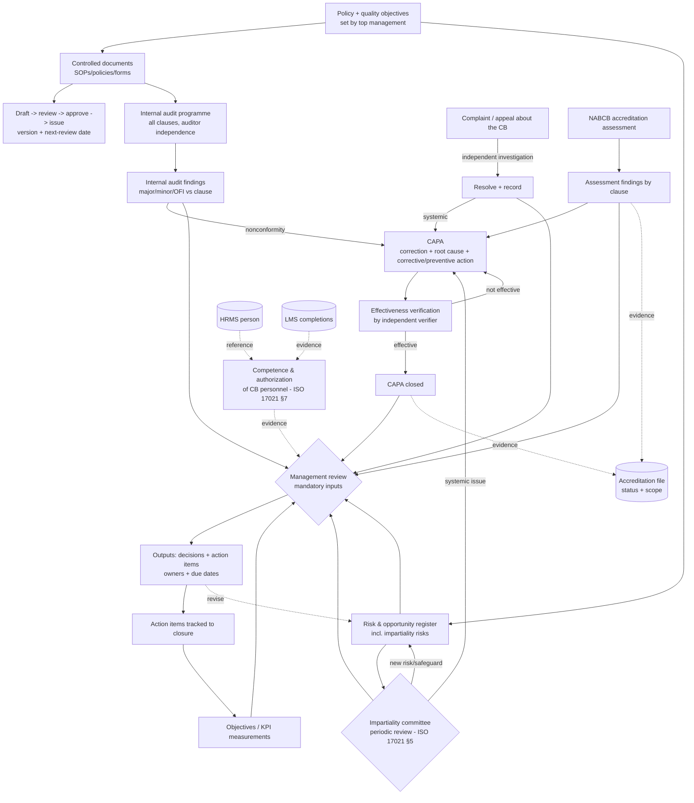
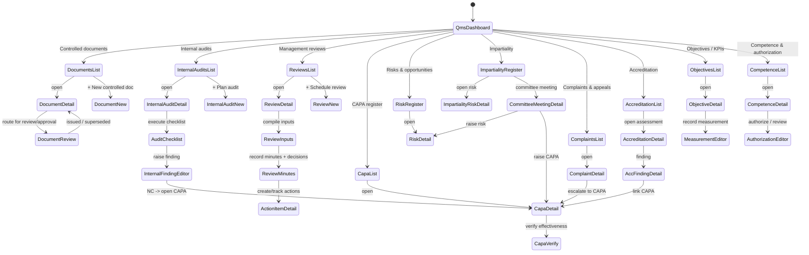
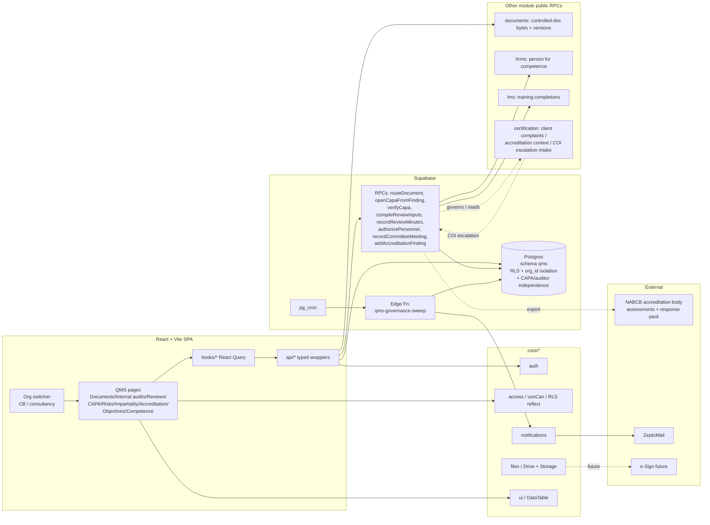

# Management System — Internal QMS / Governance (Module Design)

**Status:** Design (Phase D). Design-only — no code until approved.
**Module key:** `management_system`
**Anchor entities:** QMS document, Internal audit, Internal audit finding, Management review, CAPA, Risk, Impartiality risk, Complaint/appeal (about the CB), Accreditation assessment, Objective/KPI
**Primary users:** Quality manager (management representative), Impartiality committee, Directors / top management, Internal auditors, CB scheme staff (as auditees / action owners), super_admin. Consultancy quality owner for the ISO 9001 self-QMS.
**Depends on:** `@/core/*` (auth, access, notifications, files, ui, utils). Consumes **Document Management** for controlled-document storage/versioning, **HRMS + LMS** for competence/authorization evidence, and **Certification** for the client-side link (client complaints, audit NC context). Feeds nothing operational back into Certification — it *governs* it.

> Governed by `docs/architecture/00_ENTERPRISE_ARCHITECTURE.md`. Follows §5 cross-cutting standards. Permission namespace `qms.<entity>.<action>`. All schema changes are expand-contract (§1.4). **This module is the CB's OWN management system as required by ISO/IEC 17021-1:2015 (esp. §5 impartiality, §8 management-system requirements, §9.x process controls) and is exactly what NABCB assesses. It is DISTINCT from the client-facing certification workflow in `certification.md`: that module runs audits OF clients; this module runs audits OF the CB itself, its management reviews, its own CAPA, its impartiality governance, and its NABCB accreditation.** The same engine also serves the consultancy's ISO 9001 self-QMS — multi-entity via `org_id`.

---

## 1. Purpose & scope

**Business capability.** Management System is the governance and internal-quality operating system for the two legal entities: **TPS Xperts Global Certification Pvt Ltd** (the CB, run under ISO/IEC 17021-1:2015 and NABCB) and **TPS Xperts Group** (the consultancy, ISO 9001-oriented). It owns the "management system that meets ISO 17021-1 §8" for the CB and the equivalent ISO 9001:2015 system for the consultancy, using one engine partitioned by `org_id`. It covers: **controlled document/procedure control** (the CB's own SOPs, policies, forms — versioned, approved, distributed, with review dates), **internal audits of the CB/consultancy itself** (audit programme → checklist → findings), **management review** (scheduled inputs → discussion → decisions/outputs → action items), **CAPA on the organization's OWN nonconformities** (from internal audits, complaints, accreditation findings, incidents — never client audit NCs, which live in Certification), **risk & opportunity register**, **impartiality risk & committee management** (ISO 17021 §5 — the CB-level impartiality governance, distinct from per-application/per-auditor COI checks in Certification), **complaints & appeals about the CB** (linked to, but broader than, certification complaints), **NABCB accreditation-assessment tracking** (assessment → findings → CB CAPA → closure evidence for the accreditation file), **objectives/KPIs** (quality objectives with targets and periodic measurement), and **competence/authorization of CB personnel** (the authorization decisions and their competence evidence, linking out to HRMS records and LMS training completions).

**Who uses it.**
- **Quality manager / management representative** — owns the whole system: document control register, internal audit programme, management-review cycle, CAPA register, risk register, objectives, and the accreditation file. Prepares management-review inputs; drives NC closure.
- **Impartiality committee** — the ISO 17021 §5 oversight body. Reviews the impartiality-risk register and safeguards, receives management-review impartiality inputs, can raise risks and require actions; membership and independence are recorded here.
- **Directors / top management** — chair management reviews, approve policy/objectives, own top-level risks, authorize CB personnel, sign off accreditation responses.
- **Internal auditors** — CB staff (or contracted) trained to audit the CB against ISO 17021/9001; execute internal audits, raise internal findings. An internal auditor must not audit their own work (independence, recorded).
- **CB scheme staff** — appear as **auditees** and **action owners** (CAPA/action items assigned to them); mostly read + respond.
- **Consultancy quality owner** — same engine, `org_id = consultancy`, running the ISO 9001 self-QMS.
- **super_admin** — full visibility/bypass.

**In scope.** Controlled-document metadata & lifecycle (draft → review → approved → issued → superseded/obsolete) with mandatory periodic review dates (actual bytes stored via Document Management); internal audit programme, scheduling, checklists, findings; management review agenda/inputs/minutes/decisions/action items across the mandatory input set; organization-level CAPA (correction + root cause + corrective/preventive action + effectiveness verification); risk & opportunity register with treatment plans; **impartiality risk register + committee register + committee meeting minutes**; complaints & appeals about the CB (intake, investigation by an independent party, resolution, link to any related certificate/certification complaint); NABCB accreditation-assessment cycle tracking (assessment events, findings by clause, responses, linked CAPA, accreditation status/scope); quality objectives/KPIs with targets and measurements; competence & authorization register for CB roles (authorization decisions referencing HRMS person + LMS/training evidence). All partitioned by `org_id` for the two entities.

**Explicitly NOT in scope (owned elsewhere).**
- **Client audit nonconformities, client applications, certificates, per-application COI checks, per-auditor assignment COI declarations** → **Certification** (`certification.md`). This module governs the *system*; Certification runs the *client operations*. Impartiality here = CB-level governance/committee; impartiality there = transactional per-client/per-auditor gates. They cross-reference, never merge.
- **Actual file storage, byte-level versioning, folders, Drive/Storage mechanics** → **Document Management** (`documents`). This module holds the *controlled-document register* (control number, version, owner, approval, review date, status) and links to the stored file/version; it does not store bytes.
- **Employee master records, leave, payroll, attendance** → **HRMS**. Competence/authorization here *references* HRMS person + role; it does not duplicate the employee record.
- **Course content, lessons, quizzes, enrolment, training completion records** → **LMS**. Competence evidence *links* to LMS completions; it does not host courses.
- **Invoicing / accreditation fees** → **Finance & Accounts**.
- **Email/WhatsApp sending** → `core/notifications` (raise typed events; Core delivers).
- **Public certificate verification** → Certification + public site.

---

## 2. Business workflow

The CB must, per ISO 17021-1 §8, operate a documented management system, conduct internal audits and management reviews, act on nonconformities via CAPA, manage impartiality (§5) through a committee, handle complaints/appeals (§9.7/§9.8), and satisfy NABCB assessments. The consultancy runs the ISO 9001:2015 PDCA equivalent on the same engine.

1. **Document & procedure control.** The quality manager registers each CB SOP/policy/form as a **controlled document** (control number, title, owner, `org_id`). A draft is authored (bytes in Document Management), routed for **review** and **approval**, then **issued** with an effective date, a **next-review date**, and a version. Superseding a document marks the prior version **superseded**; withdrawn ones become **obsolete**. Periodic-review dates drive reminders; NABCB expects current, approved, distributed documents.
2. **Objectives & KPIs (Plan).** Top management sets **quality objectives** with measurable targets (e.g., "on-time certification decisions ≥ 95%", "impartiality complaints = 0"). Measurements are recorded per period; trends feed management review.
3. **Risk & opportunity register (Plan).** Risks/opportunities to the management system and to impartiality are identified, scored (likelihood × impact), assigned an owner and a **treatment** (accept/mitigate/transfer/avoid), and tracked to residual risk. Impartiality risks are a specialized sub-register (§7 below).
4. **Impartiality management (ISO 17021 §5 — ongoing).** The **impartiality committee** (recorded members, independence, terms of reference) periodically reviews the **impartiality-risk register**, safeguards, and any escalations from Certification's transactional COI gate. Committee **meetings** produce minutes, decisions, and — where needed — new CAPA or risks. This is the standing governance the per-application COI check in Certification escalates *into*.
5. **Internal audit programme (Do/Check).** The quality manager plans an **internal audit programme** covering all ISO 17021 (or ISO 9001) clauses/processes across a period, ensuring auditor **independence** (no one audits their own work). Each **internal audit** has a scope, criteria, checklist, and produces **internal findings** graded major/minor/observation/OFI against a clause.
6. **CAPA on the CB's own nonconformities (Act).** Every internal finding (and every accreditation finding, upheld complaint, or incident) that is a nonconformity spawns a **CAPA**: **correction** (immediate fix), **root-cause analysis**, **corrective action** (and preventive action where systemic), then **effectiveness verification** by someone other than the action owner. CAPA closes only when effectiveness is confirmed. (These are the CB's *own* NCs — entirely separate from client audit NCs in Certification.)
7. **Complaints & appeals about the CB (ISO 17021 §9.7/§9.8).** Complaints about the CB's conduct/decisions and appeals against decisions are logged, acknowledged, investigated by a person **not involved in the subject matter**, resolved, and recorded. A complaint may link to a Certification-side certificate/complaint but is handled here as a management-system record; systemic issues spawn CAPA.
8. **Management review (ISO 17021 §8 / ISO 9001 §9.3).** On the scheduled cadence, top management holds a **management review** with the mandatory **inputs** (internal & external audit results, accreditation-assessment results, feedback/complaints, status of CAPA, impartiality analysis, objectives performance, risks & opportunities, changes affecting the system, resource adequacy, improvement recommendations). The review produces **outputs/decisions**: improvements, resource decisions, changes — captured as **action items** with owners and due dates. Actions and CAPA feed the next cycle.
9. **NABCB accreditation assessment (ISO 17021 conformity, assessed externally).** NABCB conducts accreditation/surveillance assessments (office + witness). Each **assessment** is tracked with its **findings by clause**; each finding maps to a **CB CAPA**; responses and evidence are compiled into the accreditation file; the assessment closes and the **accreditation status/scope** is updated. This is the evidence NABCB re-checks each cycle.
10. **Competence & authorization of CB personnel (ISO 17021 §7).** For each CB role (auditor, reviewer, scheme manager, etc.) the required competence is defined; each person's **authorization** decision references their HRMS record and LMS/training completions as evidence, with an authorization date and review date. Authorizations are reviewed on cadence; lapses raise a risk/finding.
11. **Continual improvement loop.** Objectives → measurement → internal audit → findings → CAPA → management review → revised objectives/risks: the PDCA cycle NABCB expects to see closing.

---

## 3. Screen flow

Routes are lazy-loaded under `/qms`. List state (tab/filter/search/page) persists to the URL via `core/hooks` `useUrlFilters`. An **org switcher** (CB vs consultancy) scopes every screen by `org_id`; users only see orgs they are granted. The management-review workspace and CAPA workspace are distinct surfaces so their audit trails stay clean.

**Screen inventory**

| Route | Screen | Purpose | Guard (permission) |
|---|---|---|---|
| `/qms` | QmsDashboard | KPIs: overdue CAPA, doc reviews due, next review, open findings, impartiality risks | `qms.dashboard.view` |
| `/qms/documents` | DocumentsList | Controlled-document register (filter by status/owner) | `qms.document.view` |
| `/qms/documents/new` | DocumentNew | Register new controlled document | `qms.document.create` |
| `/qms/documents/:id` | DocumentDetail | Control no, version, owner, review date, links | `qms.document.view` |
| `/qms/documents/:id/review` | DocumentReview | Route for review/approval, issue/supersede | `qms.document.approve` |
| `/qms/internal-audits` | InternalAuditsList | Internal audit programme + audits | `qms.internal_audit.view` |
| `/qms/internal-audits/new` | InternalAuditNew | Plan an internal audit | `qms.internal_audit.plan` |
| `/qms/internal-audits/:id` | InternalAuditDetail | Scope, criteria, auditor, status | `qms.internal_audit.view` |
| `/qms/internal-audits/:id/checklist` | AuditChecklist | Execute checklist, capture evidence | `qms.internal_audit.execute` |
| `/qms/internal-audits/:id/findings/:fid` | InternalFindingEditor | Raise/edit internal finding | `qms.finding.create` |
| `/qms/capa` | CapaList | CAPA register (source, status, due) | `qms.capa.view` |
| `/qms/capa/:id` | CapaDetail | Correction, root cause, corrective/preventive action | `qms.capa.view` |
| `/qms/capa/:id/verify` | CapaVerify | Independent effectiveness verification | `qms.capa.verify` |
| `/qms/risks` | RiskRegister | Risk & opportunity register | `qms.risk.view` |
| `/qms/risks/:id` | RiskDetail | Score, treatment, owner, residual | `qms.risk.view` |
| `/qms/impartiality` | ImpartialityRegister | Impartiality risks + committee | `qms.impartiality.view` |
| `/qms/impartiality/risks/:id` | ImpartialityRiskDetail | Impartiality risk + safeguards | `qms.impartiality.view` |
| `/qms/impartiality/meetings/:id` | CommitteeMeetingDetail | Committee meeting minutes/decisions | `qms.impartiality.review` |
| `/qms/complaints` | ComplaintsList | Complaints & appeals about the CB | `qms.complaint.view` |
| `/qms/complaints/:id` | ComplaintDetail | Investigation & resolution | `qms.complaint.view` |
| `/qms/accreditation` | AccreditationList | NABCB assessment cycle | `qms.accreditation.view` |
| `/qms/accreditation/:id` | AccreditationDetail | Assessment, status, scope | `qms.accreditation.view` |
| `/qms/accreditation/:id/findings/:fid` | AccFindingDetail | Finding by clause → CAPA | `qms.accreditation.view` |
| `/qms/reviews` | ReviewsList | Management reviews | `qms.review.view` |
| `/qms/reviews/new` | ReviewNew | Schedule a management review | `qms.review.schedule` |
| `/qms/reviews/:id` | ReviewDetail | Review header, cadence, attendees | `qms.review.view` |
| `/qms/reviews/:id/inputs` | ReviewInputs | Compile mandatory inputs | `qms.review.conduct` |
| `/qms/reviews/:id/minutes` | ReviewMinutes | Minutes, decisions/outputs | `qms.review.conduct` |
| `/qms/reviews/:id/actions/:aid` | ActionItemDetail | Track review action item | `qms.review.view` |
| `/qms/objectives` | ObjectivesList | Quality objectives / KPIs | `qms.objective.view` |
| `/qms/objectives/:id` | ObjectiveDetail | Target + measurements | `qms.objective.view` |
| `/qms/objectives/:id/measure` | MeasurementEditor | Record a period measurement | `qms.objective.measure` |
| `/qms/competence` | CompetenceList | Competence & authorization register | `qms.competence.view` |
| `/qms/competence/:id` | CompetenceDetail | Person, role, competence evidence | `qms.competence.view` |
| `/qms/competence/:id/authorize` | AuthorizationEditor | Authorize / review CB personnel | `qms.competence.authorize` |

---

## 4. Database design

Schema `qms` for all new tables. Every table carries **`org_id`** (FK to a small `qms_orgs` / core org table) so the two legal entities — CB and consultancy — share the engine but are RLS-isolated. Controlled documents hold **metadata only**; bytes and byte-versioning live in **Document Management** (`documents`), referenced via `document_id` + `document_version_id`. Competence rows reference HRMS person (`hrms_employee_id`) and LMS completions (`lms_completion_id`) rather than duplicating them. `snake_case` throughout. New enums live in `qms`.

**Enums.**
- `qms_org_type`: `certification_body, consultancy`
- `qms_standard`: `iso_17021_2015, iso_9001_2015`
- `document_status`: `draft, in_review, approved, issued, superseded, obsolete`
- `internal_audit_status`: `planned, scheduled, in_progress, findings_open, report_issued, closed, cancelled`
- `finding_grade`: `major, minor, observation, opportunity_for_improvement`
- `finding_source`: `internal_audit, complaint, accreditation, incident, management_review, other`
- `capa_status`: `open, correction_submitted, root_cause_submitted, action_planned, action_implemented, under_verification, closed_effective, closed_ineffective`
- `capa_action_kind`: `correction, root_cause, corrective_action, preventive_action`
- `risk_type`: `risk, opportunity`
- `risk_category`: `impartiality, operational, competence, financial, legal, information_security, reputational, other`
- `risk_treatment`: `accept, mitigate, transfer, avoid`
- `risk_status`: `identified, assessed, treatment_planned, treated, monitoring, closed`
- `impartiality_source`: `ownership, finance, shared_personnel, consultancy_link, marketing, relationship, other`
- `ms_complaint_type`: `complaint, appeal`
- `ms_complaint_status`: `received, acknowledged, under_investigation, resolved, closed, rejected`
- `review_status`: `scheduled, inputs_compiled, held, minuted, actions_open, closed`
- `action_status`: `open, in_progress, done, verified, overdue, cancelled`
- `accreditation_type`: `initial, surveillance, reassessment, special, witness`
- `accreditation_status`: `planned, in_progress, findings_open, response_submitted, granted, maintained, suspended, withdrawn`
- `authorization_status`: `proposed, authorized, suspended, expired, withdrawn`

```mermaid
erDiagram
  qms_orgs ||--o{ qms_documents : "owns"
  qms_orgs ||--o{ internal_audits : "audits itself"
  qms_orgs ||--o{ management_reviews : "reviews"
  qms_orgs ||--o{ capa : "raises"
  qms_orgs ||--o{ risks : "registers"
  qms_orgs ||--o{ impartiality_risks : "governs"
  qms_orgs ||--o{ complaints_appeals : "receives"
  qms_orgs ||--o{ accreditation_assessments : "undergoes"
  qms_orgs ||--o{ objectives : "sets"
  qms_orgs ||--o{ competence_authorizations : "authorizes"

  internal_audits ||--o{ audit_findings_internal : "produces"
  audit_findings_internal ||--o| capa : "nonconformity -> capa"
  capa ||--o{ capa_actions : "resolved by"
  complaints_appeals ||--o| capa : "systemic -> capa"
  accreditation_assessments ||--o{ accreditation_findings : "raises"
  accreditation_findings ||--o| capa : "closed via capa"
  risks }o--o| capa : "treatment via"
  impartiality_risks ||--o{ committee_meetings : "reviewed in"
  impartiality_risks }o--o| risks : "feeds master register"
  committee_meetings ||--o{ committee_members : "attended by"
  management_reviews ||--o{ review_inputs : "compiles"
  management_reviews ||--o{ review_actions : "outputs"
  review_actions }o--o| capa : "may spawn"
  objectives ||--o{ objective_measurements : "measured by"
  competence_authorizations ||--o{ competence_evidence : "evidenced by"

  qms_orgs {
    uuid id PK
    qms_org_type type
    text legal_name
    qms_standard[] standards
    bool is_active
    timestamptz created_at
  }
  qms_documents {
    uuid id PK
    uuid org_id FK
    text control_no "unique per org"
    text title
    text doc_type "policy/sop/form/manual"
    document_status status
    text version
    uuid owner_id FK
    uuid document_id FK "Document Mgmt file, nullable"
    uuid document_version_id FK "Document Mgmt version, nullable"
    date effective_date
    date next_review_date
    uuid approved_by FK "nullable"
    date approved_on "nullable"
    timestamptz created_at
  }
  internal_audits {
    uuid id PK
    uuid org_id FK
    text programme_ref
    qms_standard standard
    text scope
    text criteria "clauses/processes"
    internal_audit_status status
    date planned_date
    date actual_date
    uuid lead_internal_auditor_id FK
    text auditee_area
    timestamptz created_at
  }
  audit_findings_internal {
    uuid id PK
    uuid internal_audit_id FK
    uuid org_id FK
    text clause_ref
    finding_grade grade
    text statement
    text evidence
    uuid raised_by FK
    bool is_nonconformity
    timestamptz created_at
  }
  management_reviews {
    uuid id PK
    uuid org_id FK
    date review_date
    review_status status
    qms_standard standard
    jsonb attendees
    uuid chaired_by FK
    text summary
    timestamptz created_at
  }
  review_inputs {
    uuid id PK
    uuid review_id FK
    text input_type "audit_results/complaints/capa_status/impartiality/objectives/risks/changes/resources/improvement"
    text content
    jsonb refs "linked records"
  }
  review_actions {
    uuid id PK
    uuid review_id FK
    text description
    uuid owner_id FK
    date due_date
    action_status status
    uuid capa_id FK "nullable"
    timestamptz created_at
  }
  capa {
    uuid id PK
    uuid org_id FK
    finding_source source
    uuid source_finding_id FK "nullable (internal finding)"
    uuid source_complaint_id FK "nullable"
    uuid source_accreditation_finding_id FK "nullable"
    text title
    finding_grade grade
    capa_status status
    uuid owner_id FK
    date due_date
    uuid verified_by FK "nullable, != owner"
    date verified_on "nullable"
    bool effectiveness_confirmed
    timestamptz created_at
  }
  capa_actions {
    uuid id PK
    uuid capa_id FK
    capa_action_kind kind
    text body
    uuid submitted_by FK
    jsonb evidence_files
    timestamptz submitted_at
  }
  risks {
    uuid id PK
    uuid org_id FK
    risk_type type
    risk_category category
    text description
    int likelihood "1-5"
    int impact "1-5"
    int score "likelihood*impact"
    risk_treatment treatment
    text treatment_plan
    uuid owner_id FK
    int residual_score "nullable"
    risk_status status
    date review_date
    timestamptz created_at
  }
  impartiality_risks {
    uuid id PK
    uuid org_id FK
    impartiality_source source
    text description
    int likelihood "1-5"
    int impact "1-5"
    text safeguard
    uuid risk_id FK "nullable, master-register link"
    text status "identified/safeguarded/accepted/escalated"
    uuid raised_by FK
    timestamptz created_at
  }
  committee_meetings {
    uuid id PK
    uuid org_id FK
    date meeting_date
    text agenda
    text minutes
    jsonb decisions
    uuid recorded_by FK
    timestamptz created_at
  }
  committee_members {
    uuid id PK
    uuid meeting_id FK
    uuid person_id FK "nullable"
    text name
    text role "chair/member/observer"
    bool is_independent
    bool present
  }
  complaints_appeals {
    uuid id PK
    uuid org_id FK
    ms_complaint_type type
    text subject
    text body
    ms_complaint_status status
    uuid handler_id FK "not involved in subject"
    uuid cert_complaint_id FK "nullable, Certification link"
    uuid certificate_ref "nullable"
    text resolution
    timestamptz created_at
  }
  accreditation_assessments {
    uuid id PK
    uuid org_id FK
    text accreditation_body "NABCB"
    accreditation_type type
    accreditation_status status
    date assessment_date
    text scope_assessed
    uuid lead_assessor_ref "text/nullable"
    timestamptz created_at
  }
  accreditation_findings {
    uuid id PK
    uuid assessment_id FK
    uuid org_id FK
    text clause_ref "ISO 17021 clause"
    finding_grade grade
    text statement
    uuid capa_id FK "nullable"
    text response
    text status "open/responded/accepted/closed"
    timestamptz created_at
  }
  objectives {
    uuid id PK
    uuid org_id FK
    text title
    text metric
    numeric target
    text unit
    text period "annual/quarterly"
    bool is_active
    timestamptz created_at
  }
  objective_measurements {
    uuid id PK
    uuid objective_id FK
    date period_end
    numeric actual
    bool on_target
    text note
    uuid recorded_by FK
    timestamptz created_at
  }
  competence_authorizations {
    uuid id PK
    uuid org_id FK
    uuid hrms_employee_id FK "HRMS ref, nullable for external"
    text person_name
    text cb_role "auditor/reviewer/scheme_manager/..."
    authorization_status status
    date authorized_on
    date review_due
    uuid authorized_by FK
    timestamptz created_at
  }
  competence_evidence {
    uuid id PK
    uuid authorization_id FK
    text kind "training/qualification/experience/witness"
    uuid lms_completion_id FK "LMS ref, nullable"
    text description
    text evidence_ref
    date valid_until
  }
```

**Tables (20 new).**

| Table | Role | Key notes |
|---|---|---|
| `qms.qms_orgs` | Entity register | Two rows: CB + consultancy. `org_id` on every table points here; RLS isolates. |
| `qms.qms_documents` | Controlled-document register | Metadata + control no + version + review date; bytes via **Document Management** (`document_id`/`document_version_id`). |
| `qms.internal_audits` | Internal audits **of the CB** | Distinct from client audits; `lead_internal_auditor_id`; independence enforced (auditor ≠ auditee area owner). |
| `qms.audit_findings_internal` | Internal findings | Clause-referenced; `is_nonconformity` drives CAPA creation. |
| `qms.management_reviews` | Management review events | Cadence + attendees + chair; ISO 17021 §8 / ISO 9001 §9.3. |
| `qms.review_inputs` | Mandatory review inputs | One row per required input type; `refs` links source records. |
| `qms.review_actions` | Review outputs/decisions | Action items with owner/due; may link a `capa_id`. |
| `qms.capa` | **Organization's own** CAPA | Sources: internal finding / complaint / accreditation finding / incident. **Not** client audit NCs. `verified_by != owner_id`. |
| `qms.capa_actions` | Correction/RCA/CA/PA submissions | `evidence_files` via `core/files`/Documents. |
| `qms.risks` | Risk & opportunity register | Likelihood×impact score, treatment, residual. |
| `qms.impartiality_risks` | Impartiality risk sub-register (ISO 17021 §5) | Body/personnel/consultancy-link risks + safeguards; optional link into master `risks`. |
| `qms.committee_meetings` | Impartiality committee minutes | Agenda/minutes/decisions; the standing §5 oversight body. |
| `qms.committee_members` | Committee membership per meeting | `is_independent`, `present` — independence evidence. |
| `qms.complaints_appeals` | Complaints/appeals **about the CB** | Handler ≠ subject participant; optional `cert_complaint_id` link to Certification. |
| `qms.accreditation_assessments` | NABCB assessment cycle | Initial/surveillance/reassessment/witness; drives accreditation status/scope. |
| `qms.accreditation_findings` | Assessment findings by clause | Each maps to a `capa_id`; response + status for the accreditation file. |
| `qms.objectives` | Quality objectives / KPIs | Target + unit + period. |
| `qms.objective_measurements` | Periodic measurements | `on_target` computed; feeds review + dashboard. |
| `qms.competence_authorizations` | Authorization of CB personnel (ISO 17021 §7) | References HRMS person; authorization + review date. |
| `qms.competence_evidence` | Competence evidence | Links **LMS** completions + qualifications; `valid_until` for expiry. |

**RLS intent per table.**
- **Org isolation (the primary control):** every table has `org_id`; every policy is `AND org_id IN (select org_id from qms_org_grants where user_id = auth.uid())`. A consultancy-only user never sees CB rows and vice versa; directors/super_admin may hold both.
- **CAPA independence:** `capa` effectiveness verification (`verified_by`) is gated so `verified_by <> owner_id` (an owner cannot verify their own CAPA) — enforced at the DB, mirrored by hiding the verify action in UI.
- **Internal-audit independence:** `internal_audits` insert/assignment is gated to `qms.internal_audit.plan`; a policy discourages `lead_internal_auditor_id` from being the auditee-area owner (recorded; hard-blocked where the person mapping is known).
- **Impartiality committee:** `committee_meetings` / `impartiality_risks` write gated to `qms.impartiality.review` (committee/director); read for CB QMS users.
- **Documents:** register read for `qms.document.view`; approve/issue gated to `qms.document.approve` (quality manager/director).
- **Complaints/appeals:** read for QMS users; investigation gated to `qms.complaint.investigate`; handler assignment recorded (handler must differ from subject participants).
- **Accreditation:** read for `qms.accreditation.view`; write gated to quality manager/director.
- **Management reviews:** `conduct`/minutes gated to director/quality manager; action items readable by their owners.
- All tables: `super_admin` bypass via `has_role('super_admin')`. No consultancy/CB cross-leak — this is `org_id`, not the COI firewall (that lives in Certification).

**Expand-contract notes.** All tables are **new** (greenfield governance module) — no in-place migration. `org_id` is present from day one so adding a **third entity** later is additive (insert a `qms_orgs` row + grants). New standards (ISO 45001/14001 self-QMS) extend `qms_standard` enum + reference — additive. The **Document Management** link (`document_id`/`document_version_id`) is a nullable FK so the register works even before every doc is uploaded; back-linking is additive. HRMS/LMS references are nullable UUIDs (soft references across module boundaries per §1.2) — no hard cross-schema FK that would couple deploys.

---

## 5. API design

Module `api/*` = thin typed Supabase wrappers; hooks wrap in React Query with keys `['qms', entity, ...params]`, staleTime 60s. Rule-heavy / transactional ops (CAPA creation from findings, review action rollups, authorization) are RPCs; the scheduled sweep is an Edge Function. Every call is `org_id`-scoped.

| Function | Kind | Inputs | Output | Authz |
|---|---|---|---|---|
| `listDocuments(filters)` | api | `{org_id, status?, owner?, reviewDueBefore?, q?}` | `QmsDocument[]` + count | RLS + `qms.document.view` |
| `createDocument(input)` | api | control no, title, type, owner | `QmsDocument` | `qms.document.create` |
| `routeDocument(id, step)` | rpc | `{to: review/approve/issue/supersede/obsolete, notes}` | `QmsDocument` | `qms.document.approve`; sets status + version + review date |
| `linkDocumentFile(id, documentId, versionId)` | api | Document-Mgmt refs | `QmsDocument` | `qms.document.approve` |
| `listInternalAudits(filters)` | api | `{org_id, status?, dateRange?}` | `InternalAudit[]` | `qms.internal_audit.view` |
| `planInternalAudit(input)` | rpc | scope, criteria, lead, planned_date | `InternalAudit` | `qms.internal_audit.plan`; validates auditor independence |
| `upsertInternalFinding(input)` | api | `{internal_audit_id, clause_ref, grade, statement, evidence, is_nonconformity}` | `InternalFinding` | `qms.finding.create` (assigned auditor) |
| `openCapaFromFinding(findingId)` | rpc | `finding_id` | `Capa` | `qms.capa.create`; creates CAPA linked to the internal finding + due date |
| `listCapa(filters)` | api | `{org_id, status?, source?, overdue?}` | `Capa[]` | `qms.capa.view` |
| `submitCapaAction(capaId, action)` | api | `{kind, body, evidence}` | `CapaAction` | `qms.capa.respond` (owner) |
| `verifyCapa(capaId, result)` | rpc | `{effective: bool, note}` | `Capa` | `qms.capa.verify`; **RPC rejects if `auth.uid()` = capa.owner_id** (independence) |
| `listRisks(filters)` | api | `{org_id, type?, category?, status?}` | `Risk[]` | `qms.risk.view` |
| `upsertRisk(input)` | api | risk fields + score | `Risk` | `qms.risk.edit` |
| `listImpartialityRisks(org_id)` | api | `{org_id, status?}` | `ImpartialityRisk[]` | `qms.impartiality.view` |
| `upsertImpartialityRisk(input)` | rpc | source, likelihood, impact, safeguard | `ImpartialityRisk` | `qms.impartiality.review`; may create linked master risk |
| `recordCommitteeMeeting(input)` | rpc | agenda, minutes, decisions, members | `CommitteeMeeting` | `qms.impartiality.review` (committee/director) |
| `listComplaints(filters)` | api | `{org_id, type?, status?}` | `Complaint[]` | `qms.complaint.view` |
| `logComplaint(input)` | api | subject, body, type, cert_complaint_id? | `Complaint` | `qms.complaint.create` |
| `investigateComplaint(id, res)` | rpc | handler, findings, resolution | `Complaint` | `qms.complaint.investigate`; **handler must differ from subject participants**; may spawn CAPA |
| `listAccreditation(org_id)` | api | `{org_id, type?, status?}` | `AccreditationAssessment[]` | `qms.accreditation.view` |
| `upsertAccreditationAssessment(input)` | api | body, type, date, scope | `AccreditationAssessment` | `qms.accreditation.edit` |
| `addAccreditationFinding(input)` | rpc | clause, grade, statement | `AccreditationFinding` (+ auto CAPA option) | `qms.accreditation.edit`; links `capa_id` |
| `listReviews(org_id)` | api | `{org_id, status?}` | `ManagementReview[]` | `qms.review.view` |
| `scheduleReview(input)` | api | date, standard, attendees | `ManagementReview` | `qms.review.schedule` |
| `compileReviewInputs(reviewId)` | rpc | `review_id` | `ReviewInput[]` | `qms.review.conduct`; **auto-aggregates** audit results, CAPA status, complaints, impartiality, objectives, risks, accreditation into the mandatory input set |
| `recordReviewMinutes(reviewId, minutes, actions)` | rpc | minutes + `[{description, owner, due}]` | `ManagementReview` (+ `ReviewAction[]`) | `qms.review.conduct`; creates action items |
| `listObjectives(org_id)` | api | `{org_id, active?}` | `Objective[]` | `qms.objective.view` |
| `recordMeasurement(objectiveId, m)` | api | `{period_end, actual}` | `ObjectiveMeasurement` | `qms.objective.measure`; computes `on_target` |
| `listAuthorizations(org_id)` | api | `{org_id, role?, status?, reviewDueBefore?}` | `CompetenceAuthorization[]` | `qms.competence.view` |
| `authorizePersonnel(input)` | rpc | person, cb_role, evidence[] | `CompetenceAuthorization` | `qms.competence.authorize`; validates competence evidence present (LMS/qualification) |
| **`qms-governance-sweep`** | Edge Function | pg_cron daily | — | Service role; documents past review date, overdue CAPA, upcoming management reviews, authorizations past review-due, objectives without recent measurement → `notify()` |

**Cross-module read seams.** Competence evidence references **HRMS** (`hrms_employee_id`) and **LMS** (`lms_completion_id`) through those modules' public RPCs (`hrms_employee_public`, `lms_completion_public`) — never their internal tables (§1.2). Controlled-document bytes/versions go through **Document Management**'s public API (`documents.registerVersion`, `documents.getVersion`). The **Certification** link is a nullable `cert_complaint_id` on `complaints_appeals` and read-only context lookups — this module governs Certification but does not write into it.

---

## 6. Permissions

Namespace `qms.<entity>.<action>`. Aggregated into `PERMISSIONS` by `core/access` via the module registry. Every permission is additionally **`org_id`-scoped**: holding `qms.capa.view` grants it only for orgs the user is granted (`qms_org_grants`). Columns are the QMS functional roles layered on the platform role; `director`/`super_admin` are platform roles. `quality_mgr` = management representative; `internal_auditor` = CB internal auditor; `impartiality_cmte` = committee member; `consultancy_qms` = the consultancy's ISO 9001 owner (same rights, scoped to `org_id = consultancy`).

| Permission | super_admin | director | quality_mgr | internal_auditor | impartiality_cmte | action_owner | consultancy_qms |
|---|:--:|:--:|:--:|:--:|:--:|:--:|:--:|
| `qms.dashboard.view` | ✓ | ✓ | ✓ | ✓ | ✓ | ✓ | ✓ |
| `qms.document.view` | ✓ | ✓ | ✓ | ✓ | ✓ | ✓ | ✓ |
| `qms.document.create` | ✓ | ✓ | ✓ | – | – | – | ✓ |
| `qms.document.approve` | ✓ | ✓ | ✓ | – | – | – | ✓ |
| `qms.internal_audit.view` | ✓ | ✓ | ✓ | ✓ | – | – | ✓ |
| `qms.internal_audit.plan` | ✓ | ✓ | ✓ | – | – | – | ✓ |
| `qms.internal_audit.execute` | ✓ | – | ✓ | own | – | – | own |
| `qms.finding.create` | ✓ | – | ✓ | own | – | – | own |
| `qms.capa.view` | ✓ | ✓ | ✓ | ✓ | ✓ | own | ✓ |
| `qms.capa.create` | ✓ | ✓ | ✓ | ✓ | – | – | ✓ |
| `qms.capa.respond` | ✓ | – | ✓ | – | – | own | ✓ |
| `qms.capa.verify` | ✓ | ✓ | ✓ (not owner) | – | – | – | ✓ (not owner) |
| `qms.risk.view` | ✓ | ✓ | ✓ | ✓ | ✓ | – | ✓ |
| `qms.risk.edit` | ✓ | ✓ | ✓ | – | – | – | ✓ |
| `qms.impartiality.view` | ✓ | ✓ | ✓ | – | ✓ | – | – |
| `qms.impartiality.review` | ✓ | ✓ | – | – | ✓ | – | – |
| `qms.complaint.view` | ✓ | ✓ | ✓ | – | ✓ | – | ✓ |
| `qms.complaint.create` | ✓ | ✓ | ✓ | ✓ | ✓ | – | ✓ |
| `qms.complaint.investigate` | ✓ | ✓ | ✓ | – | ✓ | – | ✓ |
| `qms.accreditation.view` | ✓ | ✓ | ✓ | ✓ | ✓ | – | – |
| `qms.accreditation.edit` | ✓ | ✓ | ✓ | – | – | – | – |
| `qms.review.view` | ✓ | ✓ | ✓ | ✓ | ✓ | own | ✓ |
| `qms.review.schedule` | ✓ | ✓ | ✓ | – | – | – | ✓ |
| `qms.review.conduct` | ✓ | ✓ | ✓ | – | – | – | ✓ |
| `qms.objective.view` | ✓ | ✓ | ✓ | ✓ | – | – | ✓ |
| `qms.objective.measure` | ✓ | ✓ | ✓ | – | – | – | ✓ |
| `qms.competence.view` | ✓ | ✓ | ✓ | – | – | – | ✓ |
| `qms.competence.authorize` | ✓ | ✓ | ✓ | – | – | – | ✓ |

**RLS mapping.** Each `.view/.edit` maps to a Postgres policy using `has_role()`/`auth_role()` + `qms_role` + `org_id IN (grants)` + `auth.uid()`. **"own"** for `internal_auditor` resolves via the assigned `lead_internal_auditor_id`/`raised_by` = `auth.uid()`; for `action_owner` via `capa.owner_id`/`review_actions.owner_id` = `auth.uid()`. **`qms.capa.verify`** additionally enforces the **verifier ≠ owner** predicate at the DB — the CAPA-independence control mirroring Certification's separation-of-duties. **`qms.impartiality.review`** is committee/director-gated at the DB, not just UI. **`org_id` scoping** is the always-on outer predicate on every table — the mechanism that lets the CB and consultancy share one engine without leaking. Accreditation (`accreditation_body = NABCB`) is CB-only by data, not a separate permission — consultancy has no NABCB rows.

---

## 7. Dashboard

Widgets on `/qms`, each backed by an indexed query or small aggregate RPC, scoped by the active `org_id` and role (action owners see their own actions/CAPA; quality manager/director see all in their orgs).

| Widget | Metric | Source |
|---|---|---|
| Overdue CAPA | Open CAPA past `due_date`, by grade/source | `capa` (RLS-scoped) |
| Documents due for review | Controlled docs where `next_review_date` ≤ 30/60d | `qms_documents.next_review_date` |
| Next management review | Days to next scheduled review + open actions from last | `management_reviews` + `review_actions` |
| Open internal findings | Findings without closed CAPA, by grade | `audit_findings_internal` + `capa` |
| Impartiality risk heat | Impartiality risks by likelihood×impact, unsafeguarded count | `impartiality_risks` |
| Risk register summary | Risks/opportunities by category & residual score | `risks` |
| Objectives on/off target | KPI actual vs target, latest period | `objectives` + `objective_measurements` |
| Accreditation status | NABCB status/scope + open assessment findings | `accreditation_assessments` + `accreditation_findings` |
| Complaints & appeals open | Count by type/status, days-open | `complaints_appeals` |
| Authorizations due for review | CB personnel whose `review_due` ≤ 60d, or expired | `competence_authorizations` |
| CAPA cycle time | Avg days open→closed_effective (window) | `capa` |
| Internal audit coverage | Clauses/processes audited this period vs plan | `internal_audits` + `audit_findings_internal` |

---

## 8. Reports

Exportable CSV/XLSX (via `core/files`); PDF for the management-review minutes, the accreditation-response pack, and the controlled-document master list. All honor URL filters, `org_id`, and RLS.

| Report | Columns | Filters | Formats |
|---|---|---|---|
| Controlled-document master list | control_no, title, type, version, status, owner, effective, next review | org, status, type, review-due | CSV, XLSX, PDF |
| Internal audit programme & findings | audit, standard, scope, date, auditor, finding clause, grade, CAPA status | org, standard, date range, grade | CSV, XLSX |
| CAPA register | id, source, title, grade, status, owner, due, verified_by, effective, cycle days | org, source, status, overdue | CSV, XLSX |
| Risk & opportunity register | category, description, likelihood, impact, score, treatment, owner, residual, status | org, category, type, status | CSV, XLSX |
| Impartiality risk log | source, description, likelihood, impact, safeguard, status, committee ref | org, source, status | CSV, XLSX |
| Management-review record | date, attendees, inputs summary, decisions, actions, owners, due | org, date range | PDF, XLSX |
| Complaints & appeals | type, subject, status, handler, resolution, days-open, cert link | org, type, status, date range | CSV, XLSX |
| Accreditation assessment file | assessment, type, date, clause, finding, grade, response, CAPA, status | org, type, status | XLSX, PDF |
| Objectives / KPI performance | objective, target, period, actual, on-target, trend | org, period, active | XLSX |
| Competence & authorization matrix | person, cb_role, status, authorized_on, review_due, evidence (LMS/qual) | org, role, status | CSV, XLSX |

---

## 9. Notifications

Via `core/notifications` only — the module calls `notify({ userId, type, title, body, ref, channels })`; Core gates channels by `reminder_settings`/`app_settings`. Typed `notification_type` values registered by Management System.

| Event | notification_type | Recipients | Channels |
|---|---|---|---|
| Document due for review | `qms_document_review_due` | Document owner, quality manager | in-app, email |
| Document issued / superseded | `qms_document_issued` | Quality manager, affected staff | in-app, email |
| Internal audit scheduled | `qms_internal_audit_scheduled` | Internal auditor, auditee area | in-app, email |
| Internal finding raised (NC) | `qms_finding_raised` | Quality manager, action owner | in-app, email |
| CAPA assigned | `qms_capa_assigned` | CAPA owner | in-app, email |
| CAPA due / overdue | `qms_capa_due` | CAPA owner, quality manager | in-app, email |
| CAPA verified / closed | `qms_capa_closed` | Quality manager, director | in-app, email |
| Impartiality risk escalated | `qms_impartiality_escalated` | Impartiality committee, director | in-app, email |
| Committee meeting minuted | `qms_committee_minuted` | Committee members, director | in-app, email |
| Complaint / appeal received | `qms_complaint_received` | Quality manager, director | in-app, email |
| Complaint resolved | `qms_complaint_resolved` | Handler, director, complainant (if internal) | in-app, email |
| Accreditation finding raised | `qms_accreditation_finding` | Quality manager, director | in-app, email |
| Management review scheduled | `qms_review_scheduled` | Attendees | in-app, email |
| Review action assigned | `qms_review_action_assigned` | Action owner | in-app, email |
| Objective off target | `qms_objective_off_target` | Objective owner, quality manager | in-app, email |
| Authorization review due / expired | `qms_authorization_review_due` | Quality manager, director | in-app, email |

Email via ZeptoMail; WhatsApp not used for this internal-governance module (in-app + email only); delivery decided by Core so staging stays sandboxed.

---

## 10. Automations

| Job | Type | Trigger / cadence | Action |
|---|---|---|---|
| Governance sweep | Scheduled | pg_cron daily → `qms-governance-sweep` | Documents past `next_review_date`, overdue CAPA, upcoming reviews, authorizations past `review_due`, objectives lacking a recent measurement → `notify()` |
| CAPA from finding | Event | inside `openCapaFromFinding` / `addAccreditationFinding` | Auto-create CAPA linked to internal/accreditation finding with due date + source |
| CAPA independence guard | Event | RLS + inside `verifyCapa` | Reject effectiveness verification if `auth.uid()` = `capa.owner_id` |
| Internal-auditor independence guard | Event | inside `planInternalAudit` | Reject/flag if lead internal auditor owns the auditee area |
| Review-input aggregation | Event | inside `compileReviewInputs` | Pull audit results, CAPA status, complaints, impartiality analysis, objectives, risks, accreditation into the mandatory ISO input set |
| Objective on-target compute | Event | on `recordMeasurement` | Compute `on_target` vs target; flag off-target → notify |
| Document status log | Event | DB trigger on `qms_documents` status change | Write `audit_log` entry; bump version on issue; set `next_review_date` |
| Overdue action escalation | Scheduled | pg_cron daily | Review action items / CAPA past due → escalate to quality manager + director |
| Impartiality escalation intake | Event | RPC called by Certification COI gate | A transactional COI escalation from Certification lands as an `impartiality_risks` row for committee review |

All scheduled work is **gated by settings flags** (§5) so staging never fires real messages.

---

## 11. Integrations

| System | Purpose | Boundary / adapter |
|---|---|---|
| **Document Management** (`documents`) | Controlled-document bytes + byte-level versioning | Register holds metadata; bytes/versions via Documents public API (`registerVersion`, `getVersion`). This module never stores bytes. |
| **HRMS** | Person identity for competence/authorization | `hrms_employee_public` RPC; `competence_authorizations.hrms_employee_id` is a soft reference — no cross-schema FK. |
| **LMS** | Training-completion evidence for competence | `lms_completion_public` RPC; `competence_evidence.lms_completion_id` soft reference. |
| **Certification** (`certification`) | Governance link: client complaints, accreditation context, COI escalation intake | Read-only context + `complaints_appeals.cert_complaint_id` link; Certification's transactional COI gate escalates into `impartiality_risks` via an inbound RPC. **This module governs, never writes into, Certification.** |
| **NABCB (accreditation body)** | Assessment cycle, findings, response pack | No live API; `accreditation_assessments`/`accreditation_findings` tracked internally; response pack exported as PDF/XLSX for manual submission. |
| **`core/files`** | CAPA/finding/committee evidence attachments | `useDrive()`/`uploadFile()` into a `qms` bucket; `disableConversionToGoogleType: true`. |
| **ZeptoMail** (`core/notifications`) | Transactional email for reminders/escalations | Core adapter; module only calls `notify()`. |
| **e-Sign (future)** | Sign management-review minutes / authorization decisions | Optional adapter behind a settings flag; stores signed PDF `file_id`. |

Cross-module reads always go through **owning-module public RPCs / Core**, never their internal tables (§1.2). The consultancy/CB split here is `org_id` isolation — *not* the Certification COI firewall (a different, stronger boundary that lives in `certification.md`).

---

## 12. Future scalability

- **More entities.** `org_id` + `qms_orgs` + `qms_org_grants` are present from day one; a third legal entity or a second CB scheme is an additive data insert, no schema change. RLS already keys off org grants.
- **More standards.** `qms_standard` is an enum + the engine is standard-agnostic (clauses are free-text `clause_ref`); adding ISO 45001/14001 self-QMS or a new accreditation scheme extends the enum + reference — additive.
- **10× record volume.** Indexes on `capa(org_id, status, due_date)`, `qms_documents(org_id, next_review_date)`, `audit_findings_internal(internal_audit_id)`, `review_actions(owner_id, status)`, `accreditation_findings(assessment_id)`, `competence_authorizations(org_id, review_due)`. Closed cycles archive to partitions; management-system records are **regulatory records** (retain per ISO 17021 / NABCB — never hard-delete; status → closed/superseded + `audit_log` preserves the trail).
- **Clause libraries.** `clause_ref` free-text today; graduate to a `clause_catalog` reference table (ISO 17021 / 9001 clause trees) to power coverage analytics and pre-filled checklists — additive.
- **Deeper HRMS/LMS coupling.** Soft references (nullable UUIDs) today; as HRMS/LMS mature, a materialized competence view (person × required-competence × evidence-status) can front `competence_authorizations` without changing the write model.
- **Accreditation API.** If NABCB ever exposes a submission API, the manual export adapter is swapped for a live adapter behind a settings flag — the data model already captures findings/responses by clause.
- **Cross-module governance analytics.** Because CAPA, risks, and findings are typed and `org_id`-scoped, a Reports & Analytics (module 16) rollup across both entities is additive — no restructuring.

---

## 13. Architecture diagram

