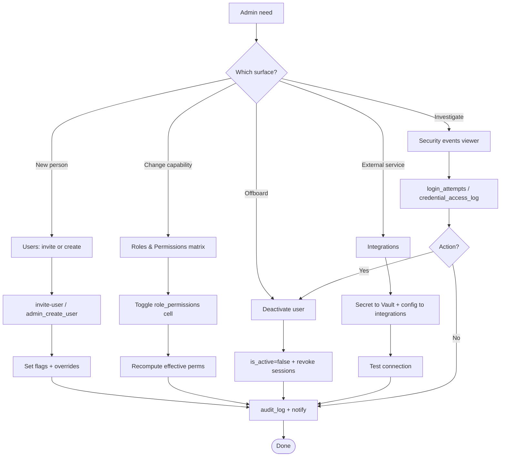
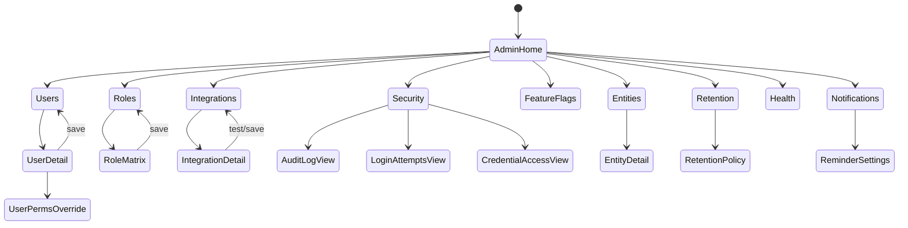
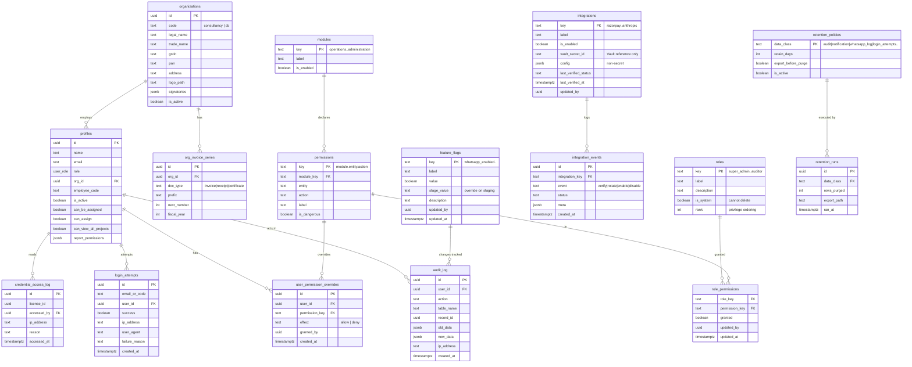
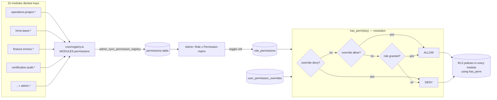
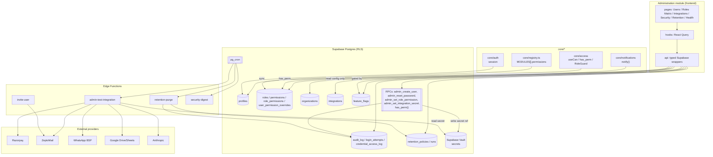

# Module Design — Administration

**Module #15 · Anchor entities:** User, Role, Permission, Setting, Integration, Audit event
**Primary users:** Super Admin, Directors (read-mostly for HR on user lifecycle)
**Status:** Design (Phase D). Formalizes existing V1 admin surfaces (User Management, Settings, Vault, reminder/notification controls) into a first-class module.
**Governs:** the platform-wide **permission registry** — every other module's permission keys roll up here into an assignable role × permission matrix.

> Follows the §6 template of `00_ENTERPRISE_ARCHITECTURE.md` verbatim. Permission keys for this module are namespaced `admin.<entity>.<action>`.

---

## 1. Purpose & scope

**Business capability.** Administration is the platform's control plane. It owns *who can use the system, what they can do, how the two legal entities are configured, which external services are wired in, and the forensic record of security-relevant actions.* It is the only module allowed to mutate the identity, permission, settings, and integration surfaces that every other module depends on.

**Who uses it.**
- **Super Admin** — full control: user lifecycle, role/permission matrix, integration secrets, feature flags, retention policy, security event review.
- **Directors** — most admin views (users, audit, security events, settings) read/write, but *cannot* rotate integration secrets or change retention policy unless also super_admin. Two-person-integrity for the most destructive knobs.
- **HR** (delegated) — may create/deactivate *employee* accounts through a scoped grant, but never assign privileged roles or touch integrations.

**In scope.**
1. **User lifecycle** — invite (email magic-link), create-with-password (code-only staff), deactivate/reactivate, admin password reset, role assignment, employee-code management.
2. **Roles & granular permissions** — the permission *registry* (all 15 modules' keys), a role → permission matrix, and per-user overrides (allow/deny on top of role).
3. **Organization / entity settings** — the two legal entities (TPS Xperts Group — consultancy; TPS Xperts Global Certification — CB): legal name, GSTIN/PAN, addresses, invoice series, logo, signatories.
4. **Integration configuration** — Razorpay, ZeptoMail, WhatsApp BSP (AiSensy), Google (Drive/Sheets), Anthropic. Secrets in **Vault**; non-secret config + enable toggles in `app_settings`/`integrations`.
5. **Feature flags** — formalize the `*_enabled` toggles (e.g. `whatsapp_enabled`, `face_match_enabled`) into a typed, audited registry.
6. **Audit log & security events** — a viewer over the append-only `audit_log`, plus `login_attempts` and `credential_access_log` (credential reveal / FSSAI portal access).
7. **Data retention / backup policy** — declarative retention windows per data class; visibility of Supabase PITR/backup status; export-before-purge.
8. **System health & release info** — DB/Edge/cron heartbeat, migration head, app version/build, integration reachability.
9. **Notification / reminder settings** — the global `reminder_settings` singleton + per-channel controls (already partly built).

**Explicitly NOT in scope (belongs elsewhere).**
- Business data CRUD (clients, projects, invoices) — owned by their modules.
- Notification *delivery* — Administration owns the *toggles*; `core/notifications` owns dispatch.
- Employee HR records (leave, payroll, attendance) — HRMS. Administration only owns the *auth identity* and role/permission layer that a profile carries.
- Defining new permission *keys* — each module declares its own keys in `modules/<x>/permissions.ts`; Administration only **aggregates and assigns** them.
- Secret cryptography — delegated to Supabase **Vault**; Administration never stores plaintext secrets in its own tables.

---

## 2. Business workflow

TPS's real admin operations, as numbered end-to-end flows.

### 2.1 Onboard a new staff member
1. Super Admin (or delegated HR) opens **Users → New**.
2. Chooses entity, name, role, and either an **email** (email-capable staff → invite flow) or an **Employee Code** (field staff without email → create-with-password flow, synthetic `t007@emp.tpsxpert.com` login).
3. For email: `invite-user` Edge Function sends a magic-link (ZeptoMail); the user sets their own password. For code: `admin_create_user` RPC creates auth user + identity + profile atomically with a temp password.
4. Admin sets granular flags (`can_be_assigned`, `can_assign`, `can_view_all_projects`) and any per-user permission overrides.
5. `audit_log` records `user_create`; a welcome notification fires (gated by settings).

### 2.2 Adjust what a role can do (permission matrix)
1. Admin opens **Roles & Permissions → Matrix**.
2. The matrix renders **every permission key from all 15 modules** (rows) × **roles** (columns), pulled from the aggregated registry.
3. Admin toggles a cell (e.g. grant `finance.invoice.void` to `accounts`). Change writes `role_permissions` and stamps `audit_log`.
4. Effective permissions recompute; affected users' UI affordances update on next token refresh; **RLS enforces the new grant immediately** in the DB.

### 2.3 Deactivate an offboarded user
1. Admin opens the user, clicks **Deactivate**.
2. `profiles.is_active = false`; `admin_revoke_sessions` invalidates refresh tokens (existing behavior of the reset path); pending assignments flagged for reassignment.
3. `audit_log` records `user_deactivate`. Data is retained per retention policy — never hard-deleted here.

### 2.4 Wire up / rotate an integration
1. Super Admin opens **Integrations → Razorpay** (or ZeptoMail/WhatsApp/Google/Anthropic).
2. Enters the secret; it goes straight to **Vault** via `admin_set_integration_secret` (service-definer). Only the Vault **reference** + non-secret config land in `integrations`.
3. Admin runs **Test connection** (Edge Function pings the provider with the Vault secret). Result + `last_verified_at` stored.
4. Toggle **Enable**. `audit_log` records `integration_update` (secret value never logged).

### 2.5 Review a security event
1. Admin opens **Security → Events**, filters by type (failed login, credential reveal, permission change, secret access).
2. Drills into a `login_attempts` spike or a `credential_access_log` reveal → sees actor, IP, reason, timestamp.
3. Optionally deactivates the actor or forces a password reset.

---

## 3. Screen flow

**Screen inventory.**

| Route | Screen | Purpose | Guard (permission) |
|---|---|---|---|
| `/admin` | Admin Home | KPI tiles + quick links | `admin.console.view` |
| `/admin/users` | Users list | Search/filter, status, role, entity | `admin.user.view` |
| `/admin/users/:id` | User detail | Edit role, flags, reset password, deactivate | `admin.user.edit` |
| `/admin/users/:id/permissions` | Per-user overrides | Allow/deny specific keys on top of role | `admin.permission.assign` |
| `/admin/roles` | Roles list | The 7 roles + descriptions | `admin.role.view` |
| `/admin/roles/matrix` | **Permission matrix** | All 15 modules' keys × roles, togglable | `admin.permission.assign` |
| `/admin/entities` | Entities list | Consultancy + CB | `admin.entity.view` |
| `/admin/entities/:id` | Entity detail | Legal/tax/invoice/signatory config | `admin.entity.edit` |
| `/admin/integrations` | Integrations | Razorpay/ZeptoMail/WhatsApp/Google/Anthropic | `admin.integration.view` |
| `/admin/integrations/:key` | Integration detail | Secret (Vault), config, test, toggle | `admin.integration.manage` |
| `/admin/flags` | Feature flags | Typed toggles registry | `admin.flag.manage` |
| `/admin/settings` | App & reminder settings | Global settings + digest hour | `admin.settings.edit` |
| `/admin/security` | Security overview | Events summary | `admin.security.view` |
| `/admin/security/audit` | Audit log viewer | Filter who/what/when/before/after | `admin.audit.view` |
| `/admin/security/logins` | Login attempts | Failed/successful, IP, throttle state | `admin.security.view` |
| `/admin/security/credentials` | Credential access | FSSAI reveal / Vault reads | `admin.security.view` |
| `/admin/retention` | Retention & backup | Windows per data class, backup status | `admin.retention.manage` |
| `/admin/health` | System health | DB/Edge/cron/migration/version | `admin.health.view` |

---

## 4. Database design

New tables introduced by this module are prefixed conceptually as the "admin/identity control plane." Existing tables (`profiles`, `app_settings`, `reminder_settings`, `audit_log`, `credential_access_log`, `whatsapp_log`, `notification_log`) are **reused as-is** and only *extended additively* (expand-contract).

**Key design notes.**
- **`roles` table mirrors the `user_role` enum**, it does not replace it. The enum stays the authoritative column type on `profiles` (RLS helpers `has_role()`/`auth_role()` depend on it). `roles` gives the matrix UI labels, ordering, and descriptions. Expand-only: seed the 7 existing enum values.
- **`permissions` is the registry** — one row per key `module.entity.action`, populated by syncing `MODULES[].permissions` from `core/registry.ts` (see §5). This is the join target that makes an *assignable* matrix possible.
- **`role_permissions`** is the base grant matrix (role × permission). **`user_permission_overrides`** layers per-user `allow`/`deny` on top. Effective permission = role grant, then override wins (`deny` beats `allow` beats role).
- **`profiles.org_id`** (new, nullable, additive) ties a user to one of the two entities. Existing granular flag columns (`can_be_assigned`, `can_assign`, `can_view_all_projects`, `report_permissions`) are retained; the permission registry *supersedes* them over time but they remain during coexistence (expand-contract; contract only after all RLS reads move to `has_perm()`).
- **`integrations`** never stores plaintext — only `vault_secret_id` + non-secret `config`. Mirrors the existing FSSAI-credential Vault pattern (`vault.create_secret` → store reference).
- **`feature_flags`** formalizes today's `app_settings` `*_enabled` rows into a typed table with a **`stage_value`** so staging stays sandboxed independent of prod (aligns with the staging-environment memory).
- **Append-only tables** keep their `no_update`/`no_delete` rules: `audit_log`, `credential_access_log`. `login_attempts` is insert-only + purge-by-retention.

**RLS intent per table.**

| Table | SELECT | INSERT/UPDATE/DELETE |
|---|---|---|
| `organizations` | `admin.entity.view` | `admin.entity.edit` (super_admin/director) |
| `roles` | authenticated (labels needed by UI) | `admin.role.manage` (super_admin) |
| `modules` | authenticated | super_admin only |
| `permissions` | authenticated (UI renders matrix) | service/seed only (registry sync) |
| `role_permissions` | authenticated (drives affordances) | `admin.permission.assign` (super_admin) |
| `user_permission_overrides` | self + `admin.permission.assign` | `admin.permission.assign` |
| `profiles` | existing policy (self + visibility) | `admin.user.edit` for privileged fields |
| `integrations` | `admin.integration.view`; **`config` only, never secret** | `admin.integration.manage` (super_admin) |
| `feature_flags` | authenticated (read toggle) | `admin.flag.manage` (super_admin/director) |
| `retention_policies` / `retention_runs` | `admin.retention.manage` | super_admin only |
| `login_attempts` | `admin.security.view` | insert via auth hook (service role) |
| `audit_log` / `credential_access_log` | `admin.audit.view` / `admin.security.view` | insert-only; append-only rules enforced |

---

## 5. API design

Module `api/*` are thin typed Supabase wrappers; privileged mutations go through **SECURITY DEFINER RPCs** (so RLS + admin checks live in the DB). Secrets go through Vault-backed RPCs / Edge Functions only.

### 5.1 Data-access functions (`modules/administration/api/`)
| Function | Inputs | Output | Authz |
|---|---|---|---|
| `listUsers(filter)` | search, role, org, active | `Profile[]` | `admin.user.view` |
| `getUser(id)` | uuid | `Profile` + overrides | `admin.user.view` |
| `listRoles()` | — | `Role[]` | authenticated |
| `getPermissionMatrix()` | — | `{permissions[], roles[], grants[]}` | authenticated |
| `listOrganizations()` | — | `Organization[]` | `admin.entity.view` |
| `listIntegrations()` | — | `Integration[]` (config only) | `admin.integration.view` |
| `listFeatureFlags()` | — | `FeatureFlag[]` | authenticated |
| `getAuditLog(filter)` | actor, action, table, range | `AuditEntry[]` | `admin.audit.view` |
| `getLoginAttempts(filter)` | email/code, success, range | `LoginAttempt[]` | `admin.security.view` |
| `getSystemHealth()` | — | health snapshot | `admin.health.view` |

### 5.2 RPCs (SECURITY DEFINER — existing + new)
| RPC | Inputs | Output | Authz check (in body) |
|---|---|---|---|
| `admin_create_user` *(exists)* | email, password, name, role, employee_code, phone, whatsapp | `uuid` | `has_role('super_admin','director')` |
| `admin_reset_password` *(exists)* | user_id, new_password | void | `has_role('super_admin','director')` |
| `admin_set_user_active` | user_id, active | void | `has_role('super_admin','director')` |
| `admin_assign_role` | user_id, role | void | `has_role('super_admin','director')` + rank guard (cannot self-escalate) |
| `admin_set_permission_override` | user_id, permission_key, effect | void | `has_perm('admin.permission.assign')` |
| `admin_set_role_permission` | role_key, permission_key, granted | void | `has_perm('admin.permission.assign')` + super_admin |
| `admin_sync_permission_registry` | keys jsonb (from registry) | int upserted | super_admin / service |
| `admin_set_integration_secret` | key, secret, config | void | super_admin; writes Vault, stores reference only |
| `admin_set_feature_flag` | key, value, scope(prod\|stage) | void | `has_perm('admin.flag.manage')` |
| `has_perm(key)` **[core helper]** | permission_key | boolean | reads role_permissions ⊕ overrides for `auth.uid()` |

`has_perm()` is the linchpin — a `stable security definer` function the same shape as `has_role()`, so RLS policies across **all** modules can call `using (has_perm('finance.invoice.void'))`.

### 5.3 Edge Functions
| Function | Trigger | Purpose | Secret source |
|---|---|---|---|
| `invite-user` *(exists)* | admin action | Email magic-link invite / create-with-password | service role |
| `admin-test-integration` | admin "Test connection" | Ping Razorpay/ZeptoMail/WhatsApp/Google/Anthropic | Vault |
| `admin-rotate-secret` | admin rotate | Write new Vault secret, verify, flip reference | Vault |
| `retention-purge` | pg_cron nightly | Export + purge per `retention_policies` | service role |
| `security-digest` | pg_cron daily | Summarize failed logins / credential reveals to admins | service role |

---

## 6. Permissions

Keys namespaced `admin.<entity>.<action>` (per the enterprise convention). Default role grants below seed `role_permissions`.

| Permission key | super_admin | director | manager | accounts | hr | executive | auditor |
|---|:--:|:--:|:--:|:--:|:--:|:--:|:--:|
| `admin.console.view` | ✓ | ✓ | | | ✓ | | |
| `admin.user.view` | ✓ | ✓ | | | ✓ | | |
| `admin.user.edit` | ✓ | ✓ | | | ▲ | | |
| `admin.user.deactivate` | ✓ | ✓ | | | ▲ | | |
| `admin.role.view` | ✓ | ✓ | | | | | |
| `admin.role.manage` | ✓ | | | | | | |
| `admin.permission.assign` | ✓ | | | | | | |
| `admin.entity.view` | ✓ | ✓ | | ✓ | | | |
| `admin.entity.edit` | ✓ | ✓ | | | | | |
| `admin.integration.view` | ✓ | ✓ | | | | | |
| `admin.integration.manage` | ✓ | | | | | | |
| `admin.flag.manage` | ✓ | ✓ | | | | | |
| `admin.settings.edit` | ✓ | ✓ | | | | | |
| `admin.audit.view` | ✓ | ✓ | | | | | ✓ |
| `admin.security.view` | ✓ | ✓ | | | | | ✓ |
| `admin.retention.manage` | ✓ | | | | | | |
| `admin.health.view` | ✓ | ✓ | ✓ | | | | |

✓ = granted by default · ▲ = grantable via per-user override (delegated HR account creation), off by default.

**RLS mapping.** Every admin mutation is guarded twice: `useCan('admin.x.y')` in the UI (affordance only) and `has_perm('admin.x.y')` / `has_role(...)` in the DB policy or RPC body (authoritative). The most dangerous actions (`admin.role.manage`, `admin.permission.assign`, `admin.integration.manage`, `admin.retention.manage`) are **super_admin-only regardless of override** — a hard floor in the RPC body, not just a matrix cell — to prevent privilege self-escalation.

### The cross-module permission rollup (the registry → matrix)

This is the module's defining responsibility. Each of the 15 modules declares its own keys in `modules/<x>/permissions.ts`; `core/registry.ts` aggregates them into `PERMISSIONS`; Administration **syncs** that aggregate into the `permissions` table so the matrix UI can render and assign every key in one place.

**Resolution order (authoritative, in `has_perm`):** per-user `deny` → per-user `allow` → role grant → default deny. Super-admin hard-floor bypasses the matrix for platform-critical keys.

---

## 7. Dashboard

Admin Home (`/admin`) widgets and their sources:

| Widget | Metric | Source |
|---|---|---|
| Users by status | active / inactive / invited-pending | `profiles` |
| Users by role | count per role | `profiles` grouped |
| Failed logins (24h) | count + trend | `login_attempts where success=false` |
| Credential reveals (7d) | count + last actor | `credential_access_log` |
| Integrations health | per-integration up/down chip | `integrations.last_verified_status` |
| Feature flags | enabled count, prod vs stage diff | `feature_flags` |
| Recent admin actions | last 10 audit entries | `audit_log` |
| System health | DB/Edge/cron/migration head/app version | `getSystemHealth()` |
| Retention next run | next purge time + last rows purged | `retention_runs` / cron |

---

## 8. Reports

| Report | Columns | Filters | Export |
|---|---|---|---|
| User roster | name, email/code, role, entity, status, last login, created | role, entity, status | CSV, XLSX |
| Permission matrix export | permission key, module, per-role grant | module | CSV, XLSX |
| Effective permissions per user | user, key, source (role/override), effect | user | CSV |
| Audit trail | timestamp, actor, action, table, record, before→after | actor, action, table, date range | CSV, XLSX |
| Login attempts | timestamp, email/code, success, IP, reason | success, date range | CSV |
| Credential access | timestamp, license, actor, reason, IP | actor, date range | CSV |
| Integration event log | timestamp, integration, event, status | integration, event | CSV |
| Retention runs | data class, rows purged, export path, ran_at | data class, date range | CSV |

All exports go through the shared export helper; secret values are **never** exportable (integration reports show config keys only, not secrets).

---

## 9. Notifications

Event → `notification_type` → recipients → channels. Delivery via `core/notifications`, gated by `reminder_settings`/`feature_flags`.

| Event | Type | Recipients | Channels |
|---|---|---|---|
| User invited | `user_invited` | invitee | email (magic-link) |
| Account created (code) | `account_created` | new user (+ HR/admin) | email/in-app |
| Password reset by admin | `password_reset_admin` | affected user | email/in-app |
| Role/permission changed | `permission_changed` | affected user + super_admins | in-app |
| Integration disabled/failed test | `integration_alert` | super_admins | in-app + email |
| Failed-login spike threshold | `security_alert` | super_admins | in-app + email |
| Credential reveal | `credential_reveal_alert` | super_admins | in-app |
| Retention purge completed | `retention_report` | super_admins | in-app |

New `notification_type` enum values are added additively (expand). Administration owns whether a channel is *allowed* (feature flags); it never bypasses `core/notifications` to send directly.

---

## 10. Automations

| Job | Kind | Trigger / cadence | Action |
|---|---|---|---|
| Login attempt capture | event | Supabase auth hook / `security-log` | Insert `login_attempts`; lock/throttle on N failures |
| Failed-login digest | scheduled | pg_cron daily 09:00 IST → `security-digest` | Summarize to super_admins |
| Retention purge | scheduled | pg_cron nightly → `retention-purge` | Export then purge per `retention_policies` |
| Integration heartbeat | scheduled | pg_cron hourly → `admin-test-integration` | Update `last_verified_status/at` |
| Permission registry sync | event | on deploy / admin action → `admin_sync_permission_registry` | Upsert `permissions` from registry |
| Audit trigger | event | DB triggers on sensitive tables | Write `audit_log` (who/what/when/before/after) |
| Session revoke on deactivate | event | `admin_set_user_active(false)` | Invalidate refresh tokens |

All scheduled work is **gated by settings/flags** so staging stays sandboxed (no real emails, no live provider calls) per the staging-environment rule.

---

## 11. Integrations

| System | Purpose | Boundary / adapter | Secret handling |
|---|---|---|---|
| **Razorpay** | Payment gateway (Finance consumes; admin configures) | `integrations.razorpay` + `admin-test-integration` | key/secret in **Vault**; reference only in DB |
| **ZeptoMail** | Transactional email (OTP, invites, digests) | `integrations.zeptomail`; used by `invite-user`/notify | API key in Vault |
| **WhatsApp BSP (AiSensy)** | WhatsApp notifications | `integrations.whatsapp` + `whatsapp_enabled` flag | token in Vault; existing `whatsapp_api_key` migrates from `app_settings` → Vault |
| **Google (Drive/Sheets)** | File storage + sheet sync | `integrations.google`; `core/files` consumes | service-account JSON in Vault; `disableConversionToGoogleType:true` |
| **Anthropic** | AI Assistant module | `integrations.anthropic` | API key in Vault |
| **Supabase Vault** | Secret store | native | authoritative crypto boundary — Administration only stores references |
| **Supabase Auth** | Identity | native | `admin_create_user`, `invite-user`, session revoke |

**Adapter rule.** No module reads a provider secret directly. Administration writes the secret to Vault + a toggle/config row; the consuming module's Edge Function fetches the secret from Vault at call time. This keeps secrets out of the frontend, out of `app_settings`, and out of `audit_log`.

---

## 12. Future scalability

- **10× users / multi-entity.** `profiles.org_id` + `organizations` already model the two legal entities; adding a third entity is a data insert, not a schema change. The permission matrix is entity-agnostic; if per-entity roles are ever needed, add an optional `org_id` to `role_permissions` (additive) without touching `has_perm`'s default path.
- **Toward multi-tenant.** The single-tenant model holds; if tenancy is introduced, `has_perm()` and RLS already centralize authz, so a `tenant_id` predicate can be layered into policies uniformly rather than per-module.
- **Permission volume.** With ~15 modules × ~8 keys ≈ 120 permission rows, the matrix stays a single-screen render; `permissions`/`role_permissions` are tiny and fully cached. `has_perm` is `stable` and index-backed (`role_permissions(role_key, permission_key)`), negligible RLS cost.
- **Audit/log growth.** `audit_log`, `login_attempts`, `whatsapp_log`, `notification_log` are the high-volume tables — the retention policy + nightly purge (with export) bounds them; partition by month if they exceed millions of rows.
- **Registry drift (real risk from prod).** Because repo migrations are known not to reproduce prod exactly, `admin_sync_permission_registry` is *idempotent upsert*, and a **drift check** compares live `permissions` against the deployed `MODULES[].permissions`, flagging orphans/missing keys in System Health rather than silently diverging.
- **Two-person integrity.** As the org grows, the super-admin hard-floor on secret rotation and role management can be extended to require a second approver (a `pending_admin_actions` table) without changing consumers.

---

## 13. Architecture diagram

---

**Cross-module contract summary.** Administration is the *producer* of the identity + permission + settings substrate that every other module *consumes* via `core/access` (`has_perm`), `core/notifications` (flags), and Vault-backed secrets. It defines only `admin.*` keys but **assigns all modules' keys**, making it the single control point for platform-wide authorization.
