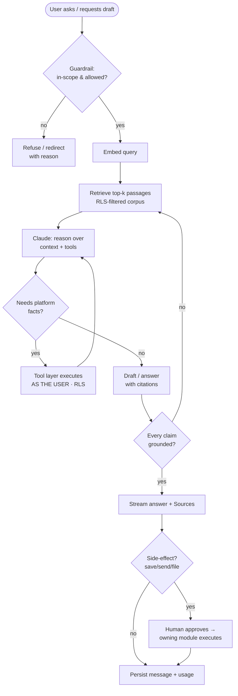
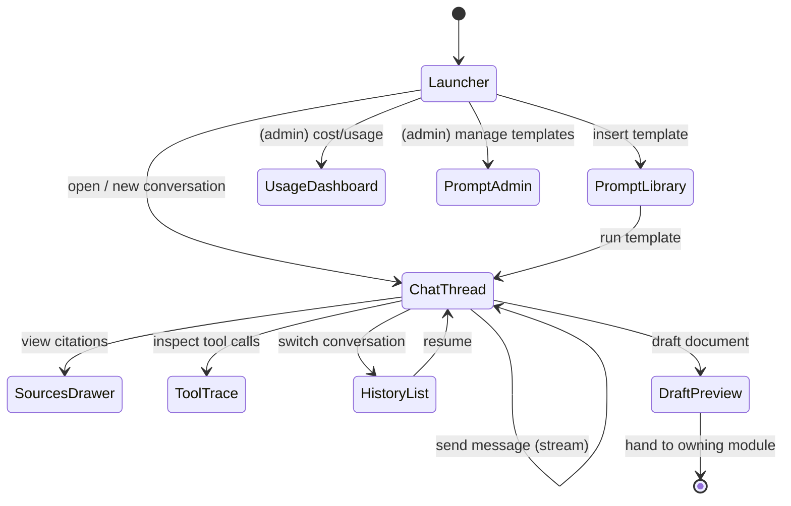
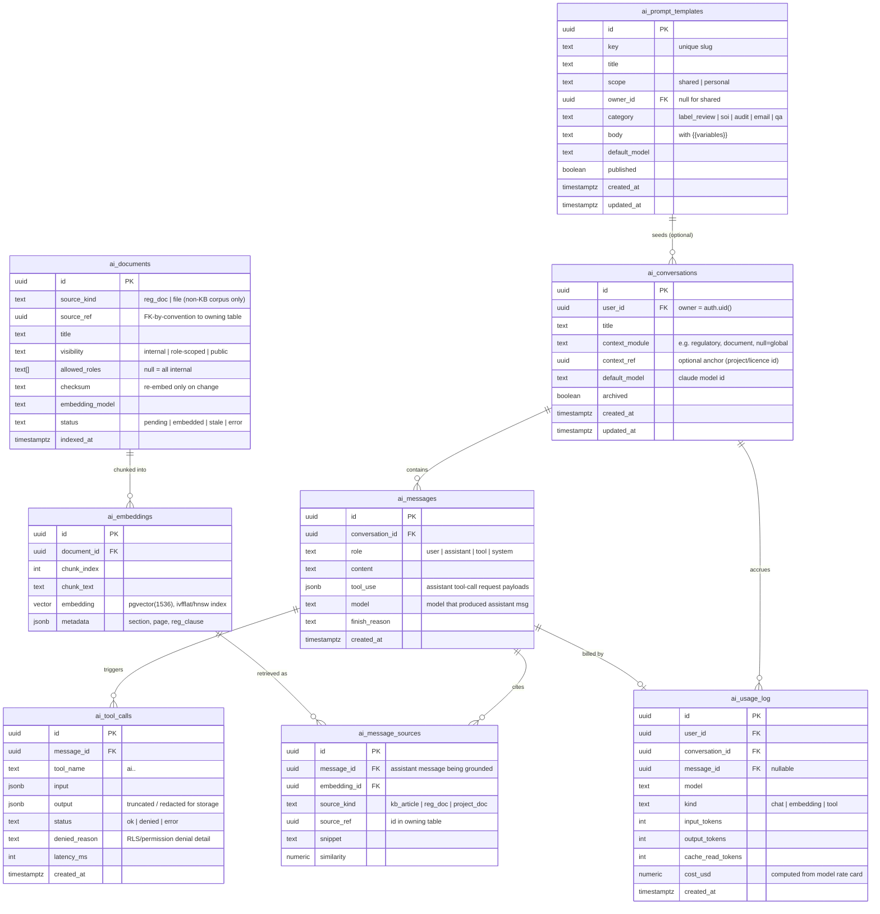
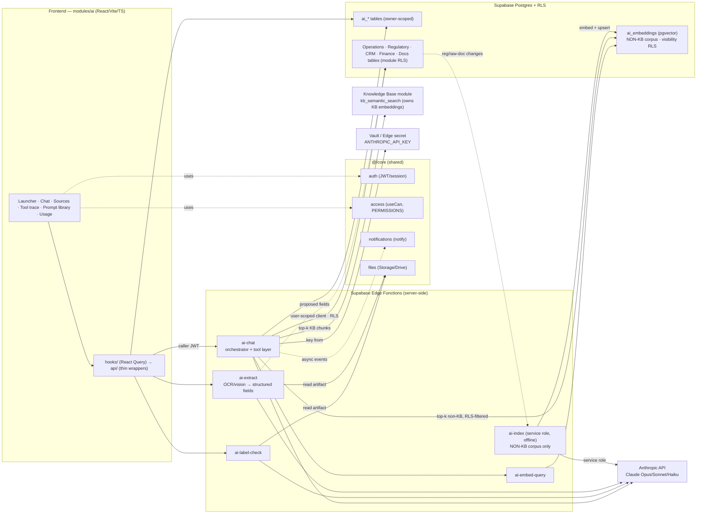

# Module Design — AI Assistant

**Module #12 · Key:** `ai` · **Anchor entity:** Conversation · **Status:** Design (Phase D)
**Depends on:** `@/core/*` (auth, access, notifications, files, ui) · Supabase (Postgres + pgvector + Edge Functions + Vault) · Anthropic API (server-side)
**Governed by:** `docs/architecture/00_ENTERPRISE_ARCHITECTURE.md` (§6 template, cross-cutting standards).

> **North-star constraint:** the assistant is a *thin, permissioned* layer over the platform. It never sees more data than the signed-in user can see, never gives ungrounded legal/regulatory advice, and always cites its sources. Every tool call executes **under the caller's own JWT and RLS** — the model can request data, but the database decides what it gets.

---

## 1. Purpose & scope

**Business capability.** A conversational assistant embedded across the TPS Enterprise Platform that helps staff with (a) **regulatory Q&A** grounded in the Knowledge Base and regulatory reference corpus via RAG (FSSAI / FSSR 2011 / FSS Labelling & Display 2020 / ISO 17021 / NABCB), (b) **document drafting** (label-review notes, SOI notes, audit-report drafts, authority-query replies, client emails), (c) **tool-calling over platform modules** ("list projects due this week", "draft a renewal reminder for licence X") through a permission-gated tool layer, and (d) **SOI / label auto-check assist** that flags likely non-compliances for a human to confirm.

**Who uses it.** All internal roles (`super_admin`, `director`, `manager`, `executive`, `accounts`, `hr`, `auditor`). Each user's reach into platform data is bounded by their existing RLS/permissions — the assistant grants **no** new data access. Not exposed to external Customer/Vendor Portal users in this phase.

**What it explicitly does NOT do.**
- It does **not** give authoritative legal advice or a final regulatory determination. It drafts and cites; a qualified human signs off.
- It does **not** bypass RLS, elevate privileges, or act as a service account when reading/writing business data. Tool reads/writes run as the caller.
- It does **not** perform irreversible or money-moving actions autonomously (submit filings to FoSCoS, send emails/WhatsApp, delete records, issue certificates). It **drafts**; a human approves and executes through the owning module.
- It does **not** train or fine-tune models on TPS data; retrieval is at inference time only.
- It is **not** the notifications engine, the document store, or the KB CMS — it consumes `core/notifications`, `core/files`, and the Knowledge Base module.

---

## 2. Business workflow

TPS staff repeatedly answer regulatory questions, draft the same document types, and pull status across projects. Today that lives in people's heads, Excel, and WhatsApp. Three end-to-end flows:

**A. Grounded regulatory Q&A (RAG)**
1. User opens the assistant (global launcher or in a module context) and asks a question.
2. Backend embeds the query and retrieves top-k passages from **two sources, merged**: (a) **Knowledge Base article chunks** via KB's `kb_semantic_search` / `semanticRetrieve` (KB owns these embeddings — the AI Assistant does **not** re-embed KB content), and (b) `ai_embeddings`, which holds **only non-KB corpus** (raw regulatory documents not yet curated into KB). Both retrievals are filtered to what the user may read.
3. Claude answers **only** from retrieved context, with inline citations to source documents; if context is insufficient it says so rather than inventing.
4. Answer is streamed back with a **Sources** panel; the exchange is persisted to `ai_messages` with the citation set and token/cost usage.

**B. Document drafting + tool-assisted actions**
1. User asks to draft (e.g. "draft a deficiency-letter reply for project TPS-2026-0042").
2. Claude decides it needs facts and issues **tool calls** (`ai.project.get`, `ai.query.list`, `ai.document.search`).
3. The tool layer executes each call **as the user** (their JWT → RLS). Denied/empty results are returned honestly; the model cannot see around RLS.
4. Claude drafts the document grounded in the returned facts + retrieved regulatory context, with citations.
5. User reviews, edits, and **explicitly** pushes the draft into the owning module (save as `document`, create a query response, or hand to `core/notifications` to send). The assistant never sends/files on its own.

**C. SOI / label auto-check assist**
1. From the Regulatory or Document module, user runs "AI check" on a label/SOI artifact.
2. Backend extracts the artifact text (via `core/files`), retrieves the relevant labelling rules, and asks Claude to produce a structured findings list (rule → status → evidence → suggested fix), each finding **cited**.
3. Findings render as an advisory checklist; the human accepts/rejects each. Nothing is marked compliant by the AI alone.

**D. Structured document data-extraction (highest-ROI AI)**
1. During CRM onboarding or a Regulatory review, a user (or an owning-module flow) hands the assistant a client upload — KYC documents, existing FSSAI/manufacturing licences, product **label images**, or lab test reports — fetched via `core/files` / Document Management OCR.
2. Backend runs OCR/text-and-image extraction, then calls Claude with the `ai.extract.document` tool to pull **structured fields** — e.g. GSTIN / PAN / licence number / validity dates / product composition / tested nutrient values — returned as a typed JSON payload with per-field confidence and the source span cited.
3. Extracted fields are surfaced as a **proposed** structured record the user confirms/corrects; on approval they are pushed into the owning module — pre-filling **CRM onboarding** (client master, licences) and feeding the **Regulatory review engine** (composition vs permitted limits, label claims). The AI never writes the record autonomously; a human approves through the owning module's own API + RLS.
4. Works alongside Document Management OCR: OCR produces raw text/tokens, the extraction tool produces the structured, validated fields.



---

## 3. Screen flow

The assistant is both a **global surface** (slide-over launcher available on every route) and **embedded panels** (contextual actions inside Regulatory/Document modules). Admin-only screens manage the prompt library and usage.



| Route | Screen | Purpose | Guard (permission) |
|---|---|---|---|
| global slide-over | **Assistant Launcher** | New/continue chat, pick template, context chip | `ai.chat.use` |
| `/ai` | **Chat Thread** | Streamed conversation, Sources drawer, tool trace | `ai.chat.use` |
| `/ai/history` | **History List** | Past conversations (own by default) | `ai.chat.use` |
| embedded | **Sources Drawer** | Cited passages + links to source docs | `ai.chat.use` |
| embedded | **Tool Trace** | What tools ran, inputs, allow/deny outcome | `ai.chat.use` |
| embedded | **Draft Preview** | Review/edit draft before it leaves the assistant | `ai.chat.use` |
| `/ai/prompts` | **Prompt Library** | Browse/insert shared + personal templates | `ai.prompt.read` |
| `/ai/prompts/admin` | **Prompt Admin** | Create/edit/publish shared templates | `ai.prompt.manage` |
| `/ai/usage` | **Usage Dashboard** | Tokens, cost, per-user/model breakdown | `ai.usage.read` |

---

## 4. Database design

All tables live in the `public` schema with `ai_` prefix, RLS enabled. Embeddings use **pgvector** (`vector(1536)` for a standard embedding model; dimension pinned per `embedding_model`). Source content is *referenced* (regulatory doc id, storage path) rather than duplicated.

> **Embeddings ownership (v1.1).** The **Knowledge Base module owns all KB article embeddings** (`kb_article_embeddings` + `kb_semantic_search`). The AI Assistant does **not** re-embed KB content and does **not** maintain a copy of KB articles. `ai_documents` / `ai_embeddings` retain **only the non-KB corpus** — raw regulatory documents (gazette PDFs, authority circulars, standards text) that are not curated KB articles. At retrieval time `ai-chat` merges KB chunks (from `kb_semantic_search`) with non-KB chunks (from `ai_embeddings`). `ai_message_sources` therefore cites either a KB article (`source_kind='kb_article'`, resolved through KB) or a non-KB `ai_embeddings` row.



**RLS intent (per table).**
- `ai_conversations`, `ai_messages`, `ai_tool_calls`, `ai_message_sources`, `ai_usage_log` — **owner-scoped**: `user_id = auth.uid()` (via join for child tables). Directors/`super_admin` may `select` all for oversight/usage; admins holding `has_perm('ai.usage.read')` may read `ai_usage_log` globally.
- `ai_prompt_templates` — `select` where `scope='shared' and published` **or** `owner_id = auth.uid()`; `insert/update` personal by owner; shared managed only by `has_perm('ai.prompt.manage')` holders.
- `ai_documents`, `ai_embeddings` — **non-KB corpus only**, **read-gated by corpus visibility**: `select` allowed when `visibility='public'`, or `'internal'` for any authenticated staff, or when `auth_role()` is in `allowed_roles`. This is the retrieval RLS that keeps the non-KB regulatory index from leaking role-restricted material. KB article chunks are **not** stored here — they are retrieved through KB's own `kb_semantic_search` (which applies KB's visibility rules). Writes are service-only (indexer Edge Function).

**Expand-contract notes.** New module; all additive. `notification_type` enum extended (expand) with `ai_draft_ready`, `ai_index_failed` before the notify code references them. `vector` dimension is pinned per row via `embedding_model`; a model change adds a new `ai_documents.embedding_model` value and re-indexes into new rows (expand) before retirement of old vectors (contract) — never an in-place ALTER of the column dimension.

---

## 5. API design

Frontend uses thin `modules/ai/api/*` wrappers (React Query hooks in `hooks/*`). All model traffic and tool execution happen **server-side** in Edge Functions; the browser never holds the Anthropic key and never calls Anthropic directly.

**Edge Functions**

| Function | Inputs | Outputs | Authz |
|---|---|---|---|
| `ai-chat` | `{ conversationId?, message, model?, contextModule?, contextRef? }` + caller JWT | SSE stream: tokens, tool-call events, sources, final usage | Requires `ai.chat.use`; runs retrieval + tool layer **as caller** |
| `ai-embed-query` | `{ text }` (internal, called by `ai-chat`) | `vector` | Internal (invoked by `ai-chat`) |
| `ai-index` | `{ sourceKind, sourceRef }` or cron sweep | upserts `ai_documents` + `ai_embeddings` | Service role (indexer); not user-callable |
| `ai-label-check` | `{ fileRef | text, ruleset }` + caller JWT | structured findings[] with citations | `ai.labelcheck.run`; reads artifact via caller RLS |
| `ai-extract` | `{ fileRef \| fileRefs, docType }` + caller JWT | structured fields JSON (typed per `docType`) + per-field confidence + source spans | `ai.extract.run`; reads artifact via caller RLS; runs OCR/vision then Claude extraction |

**Client `api/*` functions (thin Supabase/Edge wrappers)**

| Function | Inputs | Outputs | Authz |
|---|---|---|---|
| `startConversation(input)` | title, contextModule, contextRef | conversation row | RLS insert (owner) |
| `sendMessage(input)` | conversationId, text, model | SSE handle → `ai-chat` | `ai.chat.use` |
| `listConversations(params)` | archived?, q | conversation rows (own) | RLS select |
| `getMessages(conversationId)` | id | messages + sources + tool calls | RLS select |
| `listPromptTemplates(params)` | category, scope | template rows | `ai.prompt.read` |
| `upsertPromptTemplate(input)` | template fields | template row | personal: owner · shared: `ai.prompt.manage` |
| `runLabelCheck(input)` | fileRef/text, ruleset | findings[] | `ai.labelcheck.run` |
| `runExtraction(input)` | fileRef(s), docType (kyc/licence/label_image/lab_report) | structured fields + confidence + citations | `ai.extract.run` |
| `getUsage(params)` | range, groupBy | aggregated usage rows | `ai.usage.read` |

**The permission-respecting tool layer (core of the design).** `ai-chat` defines a **fixed allowlist** of tools, each mapped to a permission `ai.<entity>.<action>` and implemented as a typed function that queries the DB **through a user-scoped Supabase client**:

```
// inside ai-chat Edge Function (pseudocode)
const callerJwt = req.headers.get('Authorization')            // caller's token
const userClient = createClient(SUPABASE_URL, ANON_KEY, {      // NOT service role
  global: { headers: { Authorization: callerJwt } },          // → RLS runs as caller
})
// every tool uses userClient; RLS is the authority.
```

Guarantees that make "AI honours the caller's permissions" true rather than aspirational:
1. **User-scoped client, never service role.** All tool DB access uses `userClient` (anon key + caller JWT). RLS policies of Operations/Regulatory/Finance/etc. apply verbatim. The service role is used *only* by the offline `ai-index` indexer and Anthropic calls — never for business reads on a user's behalf.
2. **Double gate.** Before running a tool, `ai-chat` checks the caller holds the tool's `ai.<entity>.<action>` permission (defence-in-depth / affordance); RLS then enforces row-level access (authority). A tool the user lacks permission for is **not even offered** to the model in that request's tool schema.
3. **Read-first, write-guarded.** Tools are `list`/`get`/`search`/`draft` only. Any state change (save document, create query response, send notification) is returned as a **proposed action** the user confirms; execution goes through the owning module's own API + RLS, not the AI path.
4. **Honest denials.** RLS-empty or permission-denied results are passed back to the model as `denied`/empty — the model reports "you don't have access / no matching records", never fabricates. Denials are logged in `ai_tool_calls`.
5. **Context injection is retrieval-filtered.** RAG passages come only from `ai_embeddings` rows the caller can `select` (corpus visibility RLS), so grounding context itself can't leak role-restricted material.

---

## 6. Permissions

Keys namespaced `ai.*`, aggregated into `PERMISSIONS` by the registry. RLS is the authoritative enforcement; `useCan()` gates UI affordances and the tool schema offered to the model.

| Permission | Meaning | Default roles |
|---|---|---|
| `ai.chat.use` | Open assistant, converse, RAG Q&A, drafting | all internal roles |
| `ai.tool.execute` | May trigger tool-calling (else Q&A/draft only) | director, manager, executive, accounts, hr |
| `ai.project.read` | Tool: list/get projects, stages | manager, executive, director |
| `ai.regulatory.read` | Tool: licences, authority queries, SOI | executive, manager, director |
| `ai.document.read` | Tool: search platform documents | executive, manager, accounts, director |
| `ai.finance.read` | Tool: invoices/payments summaries | accounts, director |
| `ai.labelcheck.run` | Run SOI/label auto-check assist | executive, manager, director |
| `ai.extract.run` | Structured data-extraction from client uploads (KYC/licence/label image/lab report) | executive, manager, director, accounts |
| `ai.prompt.read` | Use prompt library | all internal roles |
| `ai.prompt.manage` | Create/publish shared templates | super_admin, director |
| `ai.usage.read` | View cost/usage dashboard | super_admin, director |

**RLS mapping.** Each `ai.<entity>.read` tool queries the entity's existing tables via the user-scoped client, so the owning module's RLS decides rows. `ai.*` permissions never *widen* data access — a user with `ai.project.read` still only sees the projects their Operations RLS already permits. `ai_*` own tables enforce owner-scoping as in §4.

---

## 7. Dashboard

**Assistant home widgets** (`ai.chat.use`):
- **Recent conversations** — last 5 threads (source: `ai_conversations`).
- **Quick prompts** — top shared templates by category (source: `ai_prompt_templates`).
- **Your usage this month** — tokens + est. cost for the signed-in user (source: `ai_usage_log`, self).

**Admin usage widgets** (`ai.usage.read`):
- **Cost this month** vs budget, sparkline (source: `ai_usage_log` aggregated).
- **Tokens by model** (Opus / Sonnet / Haiku split) — cost-control signal to route cheaper models.
- **Top users / top tools** — adoption + tool-call volume (source: `ai_usage_log`, `ai_tool_calls`).
- **Index health** — `ai_documents` by status (`embedded` / `stale` / `error`); stale count is the RAG-freshness KPI.
- **Denial rate** — share of `ai_tool_calls` with `status='denied'` (guardrail/permission signal).

---

## 8. Reports

| Report | Columns | Filters | Export |
|---|---|---|---|
| **Usage & cost** | date, user, model, kind, input/output/cache tokens, cost_usd | range, user, model, kind | CSV, XLSX |
| **Conversation audit** | conversation, user, #messages, #tool calls, #denials, created | range, user, context_module | CSV |
| **Tool-call log** | timestamp, user, tool_name, status, denied_reason, latency_ms | range, tool, status | CSV |
| **Citation / grounding** | assistant message, #sources, source kinds, avg similarity | range, source_kind | CSV |
| **Index coverage** | document, source_kind, visibility, status, indexed_at, checksum | status, source_kind, visibility | CSV |
| **Label-check outcomes** | artifact, #findings, accepted/rejected, ruleset, user | range, ruleset | CSV, XLSX |

Exports honour the requester's `ai.usage.read` / ownership scope (RLS-filtered).

---

## 9. Notifications

Via `core/notifications` only (`notify({...})`); `notification_type` extended for this module. Delivery gated by `reminder_settings`/`app_settings` (staging stays sandboxed).

| Event | notification_type | Recipients | Channels |
|---|---|---|---|
| Async draft/answer ready (long job) | `ai_draft_ready` | requesting user | in-app |
| Label/SOI check completed | `ai_check_complete` | requesting user | in-app |
| Indexer failed for a source | `ai_index_failed` | super_admin, director | in-app (+ email if configured) |
| Monthly AI spend crossed threshold | `ai_budget_alert` | director, super_admin | in-app + email |

The assistant **never** sends outbound client email/WhatsApp itself; a drafted email is handed to the user, who triggers the owning module's send (which then uses `core/notifications`). This keeps the "no autonomous external messaging" guardrail intact.

---

## 10. Automations

| Job | Type | Trigger / cadence | Action |
|---|---|---|---|
| **Non-KB corpus indexer** | Event | DB trigger on **regulatory / raw-document** insert/update → enqueue | Mark `ai_documents.status='stale'`, checksum-diff, invoke `ai-index` to (re)embed changed chunks. **Does not touch KB articles** — KB embeddings are owned and maintained by the Knowledge Base module's own `kb-embed` pipeline |
| **Nightly re-embed sweep** | Scheduled | pg_cron nightly → `ai-index` | Pick up `stale`/`error` **non-KB** docs, embed, set `embedded`; alert on persistent failures |
| **Usage rollup** | Scheduled | pg_cron hourly | Aggregate `ai_usage_log` into daily/monthly for dashboards (materialized) |
| **Budget watch** | Scheduled | pg_cron daily | Compare month-to-date spend to budget → `ai_budget_alert` |
| **Conversation retention** | Scheduled | pg_cron weekly | Archive/trim conversations per retention policy (soft-archive; no hard delete of audit) |

All scheduled work follows the platform rule: pg_cron → Edge Function, gated by settings so staging does not incur live spend. Embeddings and Anthropic calls in these jobs use the **service role** (offline indexing only — not user-facing reads).

---

## 11. Integrations

| System | Purpose | Boundary / adapter |
|---|---|---|
| **Anthropic API** (Claude Opus 4.8 / Sonnet 5 / Haiku 4.5) | Chat completion, tool-use orchestration, drafting; **Claude is the default** | Server-side only in `ai-chat`/`ai-label-check`. API key in **Supabase Vault / Edge secret** (`ANTHROPIC_API_KEY`), never shipped to the browser. Model chosen per task: Haiku for cheap/classification, Sonnet default, Opus for complex drafting/reasoning |
| **Anthropic Embeddings** (or configured embedding model) | Vectorise query + corpus chunks | `ai-embed-query` (online, query) and `ai-index` (offline, corpus). Dimension pinned per `embedding_model` |
| **Supabase pgvector** | Store + ANN-search embeddings | `ai_embeddings.embedding vector(1536)` with hnsw/ivfflat index; retrieval SQL runs under corpus-visibility RLS |
| **Knowledge Base module** (#10) | Primary grounding corpus | KB **owns all article embeddings** (`kb_article_embeddings` + `kb_semantic_search`); the AI Assistant retrieves published, permission-scoped chunks via `semanticRetrieve` / `kb_semantic_search` (+ `kb_search` keyword). **No re-embedding of KB content here** — the AI never copies or re-indexes KB articles |
| **Regulatory module** (#7) | Regulatory reference + live licence/query/SOI facts; consumes extraction output | Non-KB reference docs → `ai_embeddings` corpus; live entities → tool layer (caller RLS); extracted composition/tested values feed the Regulatory review engine |
| **CRM module** (#3) | Onboarding pre-fill from extracted client documents | `ai-extract` structured fields (GSTIN/PAN/licence no./dates) proposed into client master; human confirms via CRM API + RLS |
| **Operations / Finance modules** | Tool-callable facts ("projects due this week", invoice summaries) | Tool layer via user-scoped client only |
| **Document Management** (#9) / **core/files** (Storage + Drive) | Fetch artifact text/images for label/SOI check, **document extraction**, & context | `uploadFile`/read API; OCR/vision text extraction server-side; `ai-extract` layers structured-field extraction on top of Document Management OCR |
| **core/notifications** | Deliver AI events | `notify()` contract |

**Secrets & key handling.** `ANTHROPIC_API_KEY` and embedding key live in Edge secrets / Vault, read only inside Edge Functions. No credential is ever hardcoded or exposed to the frontend (per global rule). All Anthropic calls are `try/catch`-wrapped with meaningful errors surfaced via `toast()`.

---

## 12. Future scalability

- **10× conversation/message volume.** `ai_messages`/`ai_tool_calls` are append-heavy → partition by month; keep hot index on `conversation_id`. Usage aggregates already materialized, so dashboards don't scan raw logs.
- **Corpus growth (regulatory + KB at scale).** Switch `ivfflat` → `hnsw` for recall/latency; add metadata pre-filters (reg family, clause) before ANN; consider per-tenant/per-domain embedding namespaces. Re-embedding is checksum-gated so only changed chunks recompute.
- **Cost control.** Per-user/role budgets, model routing (Haiku-first with Sonnet/Opus escalation), prompt caching for the large regulatory system prompt, and truncated tool-output storage. Budget-watch automation already in place.
- **Multi-entity / multi-tenant.** The platform is single-tenant today; if TPS Xperts Group and TPS Global Certification later separate, add `entity_id` to `ai_*` tables + corpus visibility, and scope RLS by entity — expand-contract, no rewrite. Tool layer already inherits whatever entity-scoping the owning modules adopt because it queries through the caller's RLS.
- **New tools.** Adding a module tool = register one `ai.<entity>.<action>` permission + a typed handler using the user-scoped client; the allowlist + double-gate pattern means no change to the security model.
- **Streaming/latency.** SSE from `ai-chat`; retrieval and tool round-trips parallelised where independent. Long drafts fall back to async + `ai_draft_ready` notification.
- **Model upgrades.** Model ids are data (`default_model`, `ai_usage_log.model`); adopting a newer Claude is a config change, not a schema migration.

---

## 13. Architecture diagram



**Reading the diagram (permission boundary):** the browser sends the **caller's JWT** to `ai-chat`; every business-data read the tool layer performs uses a **user-scoped client**, so Operations/Regulatory/CRM/Finance/Docs RLS (`MODS`) is the authority. The **service role** appears in exactly one place — the offline `ai-index` indexer (non-KB corpus only) — never on a user-facing read. The Anthropic key never leaves the Edge boundary. This is what makes "the assistant respects the caller's permissions" a structural property, not a policy promise.

---

## Validation amendments (v1.1)

- **KB embeddings de-duplicated (MAJOR).** The Knowledge Base module is now the **single owner of all article embeddings** (`kb_article_embeddings` + `kb_semantic_search`). The AI Assistant no longer defines a KB re-embedding pipeline; it retrieves KB chunks through KB's `semanticRetrieve` / `kb_semantic_search` and merges them with non-KB results at query time. `ai_documents` / `ai_embeddings` now hold **only the non-KB corpus** (raw regulatory documents not curated into KB). Updated §2 (flow A), §4 (ownership note, `ai_documents.source_kind`, RLS intent), §10 (indexer scoped to non-KB), §11 (KB integration), §13 (diagram).
- **Structured document data-extraction added (MAJOR, highest-ROI AI).** New `ai-extract` Edge Function + `ai.extract.run` permission + `runExtraction` wrapper extract STRUCTURED fields (GSTIN/PAN/licence no./validity/composition/tested values) from client uploads (KYC, licences, label **images**, lab reports), working on top of Document Management OCR. Output is a **proposed** record that pre-fills CRM onboarding and feeds the Regulatory review engine after human approval. Added flow D (§2), API rows (§5), permission (§6), integrations (§11, incl. CRM #3 and Document Management #9), and diagram node (§13).
- **Permission helper naming.** RLS text uses the canonical `has_perm(key[, scope])` helper (per `00_ENTERPRISE_ARCHITECTURE.md` §9); `has_permission(...)` is retired.
