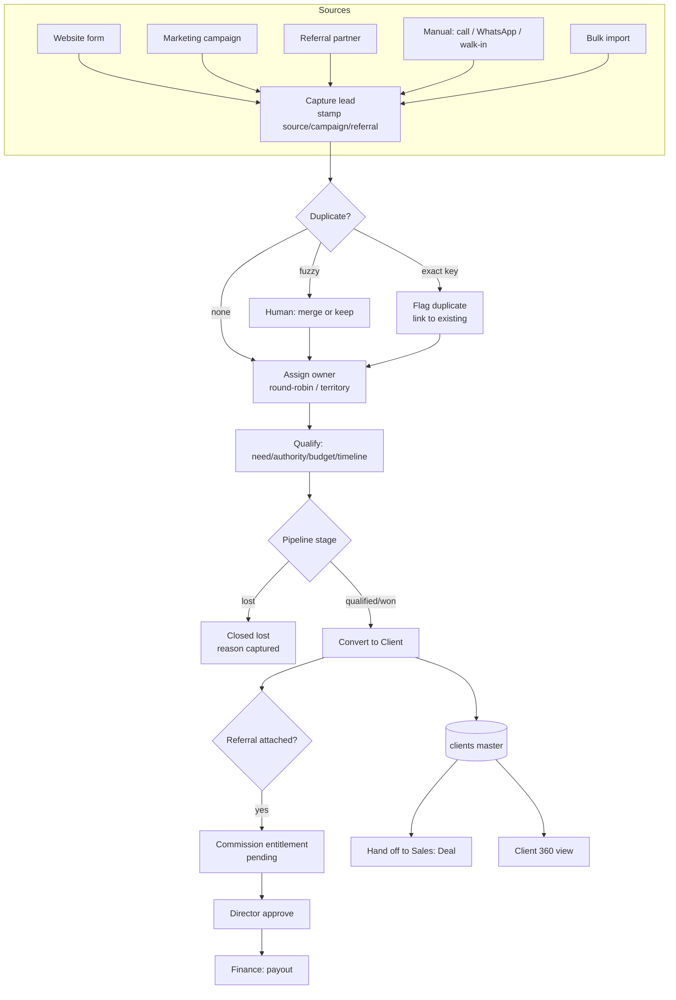
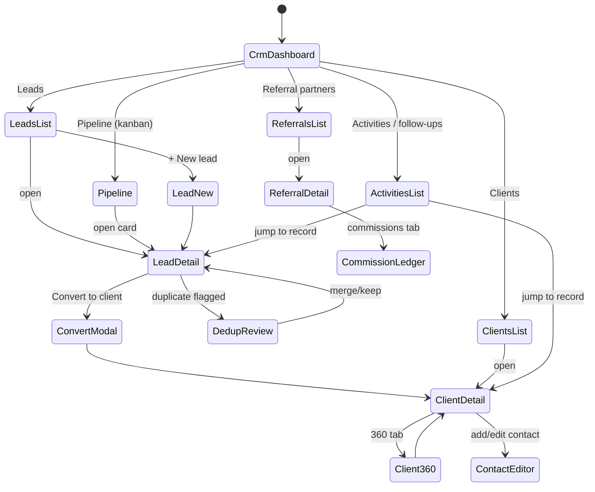
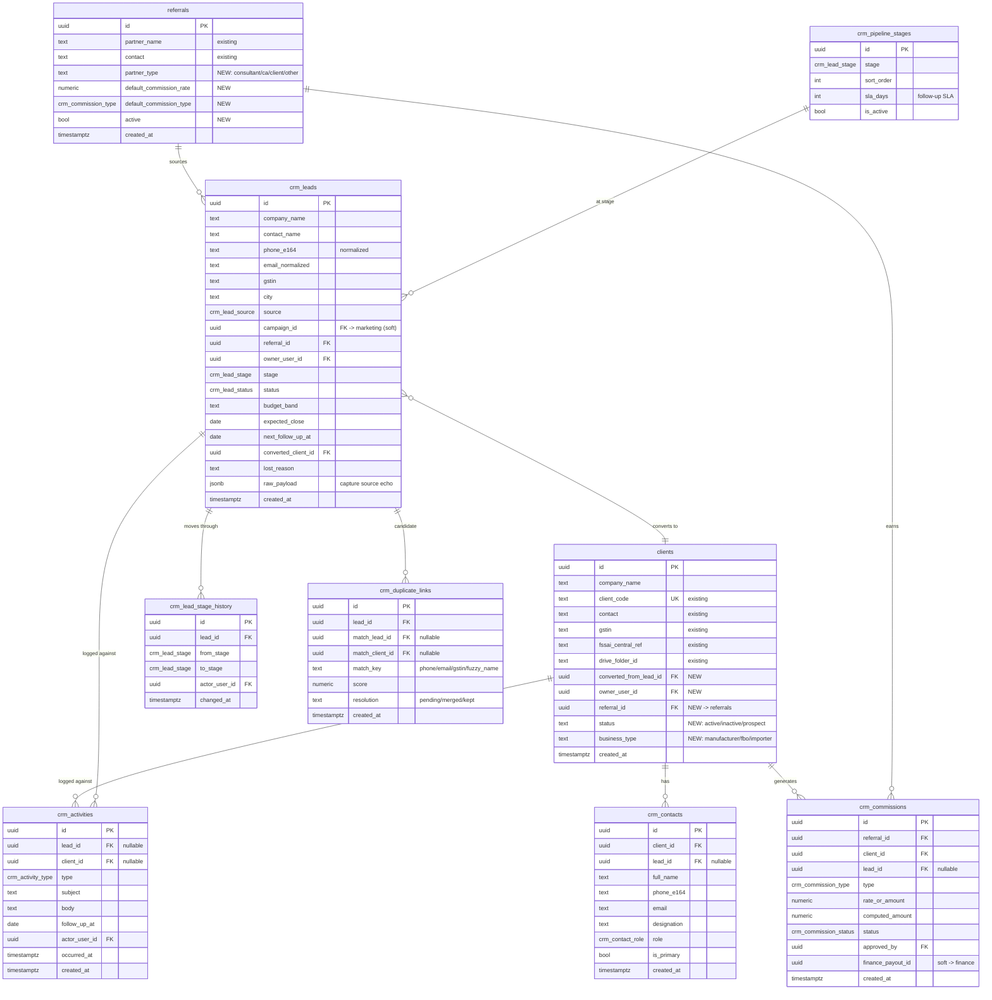
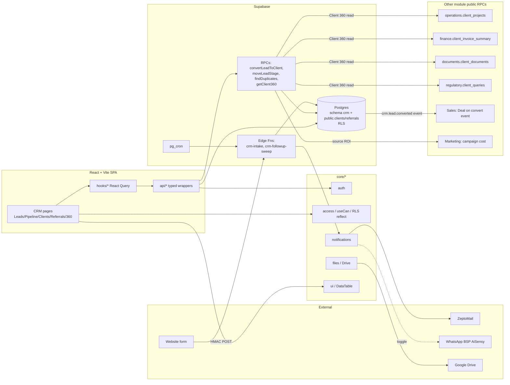

# CRM — Customer Relationship Management (Module Design)

**Status:** Design (Phase D). Design-only — no code until approved.
**Module key:** `crm`
**Anchor entities:** Lead, Client, Contact, Referral partner, Activity
**Primary users:** Sales executives, Managers, Directors (read-all); accounts/executive read-only for Client 360.
**Depends on:** `@/core/*` (auth, access, notifications, files, ui, utils). Absorbs existing `clients` and `referrals` tables. Feeds **Sales** (deals) and **Operations** (projects); reads back from Sales/Operations/Finance/Regulatory/Documents through their public APIs for Client 360.

> Governed by `docs/architecture/00_ENTERPRISE_ARCHITECTURE.md`. Follows §5 cross-cutting standards. Permission namespace `crm.<entity>.<action>`. All schema changes are expand-contract (§1.4).

---

## 1. Purpose & scope

**Business capability.** CRM is the system of record for *who we sell to and who sends us business*. It captures leads from every channel (website, marketing campaigns, referral partners, inbound calls/WhatsApp, walk-ins), qualifies and de-duplicates them, converts qualified leads into **clients**, and maintains the authoritative **client master**, **contacts** (many per client), **referral partners** (with commission terms), and the full **activity/interaction log**. It gives the team a **Client 360** view that stitches together data owned by other modules (projects, invoices, documents, regulatory queries) via their public APIs, and drives **follow-up reminders** so nothing goes cold.

**Who uses it.**
- **Sales executive** — owns leads, logs activities, books follow-ups, converts to client, manages their referral partners.
- **Manager** — assigns/reassigns leads, watches pipeline, approves conversions, oversees a team's activities.
- **Director / super_admin** — full visibility, referral commission approval, org-wide pipeline and source ROI.
- **Accounts / Executive / Auditor** — read-only Client 360 and client master (accounts needs billing contact + GST; auditor read-only).

**In scope.** Lead capture & multi-source intake, dedup/merge, qualification (BANT-lite), pipeline stages, lead→client conversion, client master (absorbs `clients`), multiple contacts per client, referral partners (absorbs `referrals`) + commission ledger, activity/interaction log (call/email/meeting/WhatsApp/note), follow-up reminders, Client 360 aggregation.

**Explicitly NOT in scope (owned elsewhere).**
- **Deals / quotations / orders / pricing** → **Sales** module (a converted client + qualified lead hands off to a Deal).
- **Projects / service delivery / stages** → **Operations**.
- **Invoices / payments / commission *payouts*** → **Finance & Accounts** (CRM records commission *entitlement*; Finance disburses).
- **Marketing campaigns / audience segmentation / content** → **Marketing** (CRM only receives campaign-sourced leads and stores `campaign_id`).
- **Regulatory licences / authority queries** → **Regulatory** (surfaced read-only in Client 360).
- **Email/WhatsApp *sending infrastructure*** → `core/notifications` (CRM logs the interaction, Core delivers).

---

## 2. Business workflow

TPS's real B2B regulatory-services motion: a nutraceutical manufacturer or food business needs an FSSAI licence, product approval, ISO/HACCP certification, or ongoing compliance. Deal cycles are relationship- and referral-heavy (consultants, CAs, existing clients). The CRM process:

1. **Capture.** A lead enters from one of: website enquiry form → Edge Function; a Marketing campaign; a referral partner submission; a manual entry after a call/WhatsApp/walk-in; or a bulk import (trade-fair list). Source, campaign, and referral partner are stamped on the row.
2. **Dedup.** On insert, CRM checks candidate duplicates by normalized phone, email, GSTIN, and fuzzy company name. Exact key match (phone/email/gstin) → flagged `duplicate`, linked to the existing lead/client. Fuzzy hits → surfaced for human "merge or keep".
3. **Assign.** New lead is auto- or manually assigned to a sales executive (round-robin within team, or by territory/source rule). Assignment writes an activity and notifies the owner.
4. **Qualify.** Owner logs discovery activities and sets qualification (need, authority, budget band, timeline) → moves the lead through pipeline stages `new → contacted → qualified → proposal → won → lost`. Each stage change is timestamped for velocity reporting.
5. **Nurture & follow-up.** Every interaction (call/email/meeting/WhatsApp/note) is logged with an optional **next-follow-up date**. Due/overdue follow-ups generate reminders (§9).
6. **Convert.** When a lead reaches `qualified`/`won`, the owner triggers **Convert to Client**: CRM creates (or links to an existing) `clients` row, generates a `client_code`, provisions a Drive folder via `core/files`, copies contacts, and emits a `crm.lead.converted` event. Sales picks this up to open a **Deal**; Operations later opens **Projects**.
7. **Client lifecycle.** The client master is now the hub. Contacts, referral attribution, and activities continue against the client. **Client 360** aggregates cross-module reads (projects, invoices, documents, regulatory queries) for a single pane.
8. **Referral & commission.** If the lead/client came via a referral partner, conversion (or first invoice, per rule) creates a **commission entitlement** row (percentage or flat, per partner terms). Director approves; Finance disburses. CRM tracks status `pending → approved → paid`.



---

## 3. Screen flow

Routes are lazy-loaded under `/crm`. List state (tab/filter/search/page) persists to the URL via `core/hooks` `useUrlFilters`.



**Screen inventory**

| Route | Screen | Purpose | Guard (permission) |
|---|---|---|---|
| `/crm` | CrmDashboard | KPIs, my follow-ups, funnel | `crm.dashboard.view` |
| `/crm/leads` | LeadsList | Filter/search leads, bulk assign | `crm.lead.view` |
| `/crm/leads/new` | LeadNew | Manual lead entry | `crm.lead.create` |
| `/crm/leads/:id` | LeadDetail | Lead 360: fields, activities, stage, dedup, convert | `crm.lead.view` |
| `/crm/leads/:id/dedup` | DedupReview | Compare & merge duplicate candidates | `crm.lead.merge` |
| `/crm/pipeline` | Pipeline | Drag-drop kanban across stages | `crm.lead.view` |
| `/crm/clients` | ClientsList | Client master list | `crm.client.view` |
| `/crm/clients/:id` | ClientDetail | Client master + contacts + activities | `crm.client.view` |
| `/crm/clients/:id/360` | Client360 | Cross-module aggregate (projects/invoices/docs/queries) | `crm.client360.view` |
| `/crm/referrals` | ReferralsList | Referral partner directory | `crm.referral.view` |
| `/crm/referrals/:id` | ReferralDetail | Partner profile + attributed leads/clients | `crm.referral.view` |
| `/crm/referrals/:id/commissions` | CommissionLedger | Entitlements + status | `crm.commission.view` |
| `/crm/activities` | ActivitiesList | Global activity + follow-up queue | `crm.activity.view` |

---

## 4. Database design

Schema `crm` for new tables; **existing `public.clients` and `public.referrals` are absorbed and extended** (expand-contract — add columns, never rename in place during coexistence). New enums live in `public` for cross-module reuse. `snake_case` throughout.

**Enums.**
- `crm_lead_stage`: `new, contacted, qualified, proposal, won, lost`
- `crm_lead_status`: `open, converted, duplicate, dropped`
- `crm_lead_source`: `website, marketing_campaign, referral, inbound_call, whatsapp, walk_in, import, other`
- `crm_activity_type`: `call, email, meeting, whatsapp, note, task, stage_change, assignment`
- `crm_contact_role`: `primary, billing, technical, authorized_signatory, other`
- `crm_commission_type`: `percentage, flat`
- `crm_commission_status`: `pending, approved, rejected, paid`



**Tables (8 new + 2 extended).**

| Table | Role | Key notes |
|---|---|---|
| `public.clients` *(extended)* | Client master hub | +`converted_from_lead_id`, `owner_user_id`, `referral_id`, `status`, `business_type`. Existing columns untouched. |
| `public.referrals` *(extended)* | Referral partner master | +`partner_type`, `default_commission_rate`, `default_commission_type`, `active`. |
| `crm.crm_leads` | Lead capture & pipeline | Normalized `phone_e164`/`email_normalized` for dedup; `raw_payload` keeps source echo. |
| `crm.crm_contacts` | Many contacts per client/lead | `is_primary` partial-unique per client. |
| `crm.crm_activities` | Interaction log | Polymorphic to lead OR client; drives follow-up queue. |
| `crm.crm_lead_stage_history` | Stage audit + velocity | One row per transition. |
| `crm.crm_pipeline_stages` | Stage config + SLA | Seeded; editable by admin. |
| `crm.crm_duplicate_links` | Dedup candidates | Resolution workflow. |
| `crm.crm_commissions` | Commission entitlement ledger | Entitlement only; payout FK is soft to Finance. |

**RLS intent per table.**
- `crm_leads`, `crm_activities`: owner (`owner_user_id`/`actor_user_id` = `auth.uid()`) **or** manager/director/super_admin see all; executives see own + team via `has_role()`. Insert requires `crm.lead.create`.
- `clients`: read for `crm.client.view` holders; write gated to owner + manager/director. Accounts read-only (billing fields).
- `crm_contacts`: follows parent client/lead visibility.
- `crm_commissions`: read `crm.commission.view`; approve restricted to director/super_admin (`crm.commission.approve`); status→`paid` only by Finance service role.
- `crm_pipeline_stages`, `crm_duplicate_links`: read for CRM users; write admin/manager only.
- All tables: `super_admin` bypass via `has_role('super_admin')`.

**Expand-contract notes.** Phase 1 (expand): add nullable columns + backfill `owner_user_id` from existing assignment data, `referral_id` from any legacy join. Phase 2: migrate readers to new columns; legacy `clients.contact` text stays until `crm_contacts` fully populated (backfill job splits it). Phase 3 (contract): once `crm_contacts` is source of truth, deprecate `clients.contact` (keep as generated/read-only). No destructive change during V1↔V2 coexistence.

---

## 5. API design

Module `api/*` = thin typed Supabase wrappers; hooks wrap in React Query with keys `['crm', entity, ...params]`, staleTime 60s. RPCs for multi-table/transactional ops; Edge Functions for untrusted ingress and scheduled work.

| Function | Kind | Inputs | Output | Authz |
|---|---|---|---|---|
| `listLeads(filters)` | api | `{stage?, source?, owner?, q?, page}` | `Lead[]` + count | RLS + `crm.lead.view` |
| `getLead(id)` | api | `id` | `Lead` w/ activities, contacts, dup links | RLS |
| `createLead(input)` | api | lead fields | `Lead` | `crm.lead.create` |
| `updateLead(id, patch)` | api | partial | `Lead` | `crm.lead.edit` (owner/mgr) |
| `moveLeadStage(id, toStage, note?)` | rpc | `id, to_stage` | `Lead` | `crm.lead.edit`; writes `crm_lead_stage_history` + activity atomically |
| `assignLead(id, ownerUserId)` | rpc | `id, owner` | `Lead` | `crm.lead.assign` (mgr/dir); notifies owner |
| `convertLeadToClient(id, opts)` | rpc | `id, {existing_client_id?}` | `Client` | `crm.lead.convert`; creates/links client, `client_code`, Drive folder, copies contacts, commission entitlement, emits event — all in one txn |
| `mergeLeads(primaryId, dupId)` | rpc | ids | `Lead` | `crm.lead.merge`; re-parents activities/contacts, closes dup |
| `findDuplicates(input)` | rpc | `{phone?, email?, gstin?, company_name}` | candidate `[]` w/ score | `crm.lead.view`; called on capture + on demand |
| `listContacts(clientId)` / `upsertContact(input)` | api | — | `Contact[]` / `Contact` | `crm.client.view` / `crm.contact.edit` |
| `logActivity(input)` | api | `{lead_id?/client_id?, type, subject, body, follow_up_at?}` | `Activity` | `crm.activity.create` |
| `listActivities(filters)` | api | `{scope, due?, owner?}` | `Activity[]` | `crm.activity.view` |
| `listReferrals()` / `upsertReferral(input)` | api | — | `Referral[]` / `Referral` | `crm.referral.view` / `crm.referral.edit` |
| `listCommissions(filters)` | api | `{referral?, status?}` | `Commission[]` | `crm.commission.view` |
| `approveCommission(id, decision)` | rpc | `id, approve/reject` | `Commission` | `crm.commission.approve` |
| `getClient360(clientId)` | rpc | `id` | aggregate JSON (see below) | `crm.client360.view` |
| **`crm-intake`** | Edge Function | website/webhook POST (HMAC-signed) | `202` | Public ingress; validates + rate-limits → `createLead` + `findDuplicates` |
| **`crm-followup-sweep`** | Edge Function | pg_cron trigger | — | Service role; scans due `next_follow_up_at` → `notify()` |

**Client 360 cross-module read pattern.** `getClient360` is a **read-only aggregator** that does **not** touch other modules' tables directly. It calls each owning module's **public read API** (server-side, via Postgres `SECURITY DEFINER` RPCs each module exposes, e.g. `operations.client_projects(client_id)`, `finance.client_invoice_summary(client_id)`, `documents.client_documents(client_id)`, `regulatory.client_queries(client_id)`), composes the result, and returns a typed envelope:

```
{ client, contacts[], activities[],
  projects[] (from Operations), invoices_summary (from Finance),
  documents[] (from Documents), regulatory_queries[] (from Regulatory),
  referral, commissions[] }
```

Each owning module's RPC enforces its own RLS, so CRM never inherits authorization it can't guarantee (§1.3). If a module is absent/unauthorized, its section returns empty — Client 360 degrades gracefully. This keeps the seam clean per §1.2 (cross-module via Core/public API only, never internal tables).

---

## 6. Permissions

Namespace `crm.<entity>.<action>`. Aggregated into `PERMISSIONS` by `core/access` via the module registry.

| Permission | super_admin | director | manager | executive (sales) | accounts | hr | auditor |
|---|:--:|:--:|:--:|:--:|:--:|:--:|:--:|
| `crm.dashboard.view` | ✓ | ✓ | ✓ | ✓ | – | – | ✓ |
| `crm.lead.view` | ✓ | ✓ | ✓ | own+team | – | – | ✓ |
| `crm.lead.create` | ✓ | ✓ | ✓ | ✓ | – | – | – |
| `crm.lead.edit` | ✓ | ✓ | ✓ | own | – | – | – |
| `crm.lead.assign` | ✓ | ✓ | ✓ | – | – | – | – |
| `crm.lead.merge` | ✓ | ✓ | ✓ | – | – | – | – |
| `crm.lead.convert` | ✓ | ✓ | ✓ | own | – | – | – |
| `crm.client.view` | ✓ | ✓ | ✓ | ✓ | ✓ | – | ✓ |
| `crm.client.edit` | ✓ | ✓ | ✓ | own | billing-only | – | – |
| `crm.contact.edit` | ✓ | ✓ | ✓ | own | – | – | – |
| `crm.client360.view` | ✓ | ✓ | ✓ | own | read | – | ✓ |
| `crm.activity.view` | ✓ | ✓ | ✓ | own+team | – | – | ✓ |
| `crm.activity.create` | ✓ | ✓ | ✓ | ✓ | – | – | – |
| `crm.referral.view` | ✓ | ✓ | ✓ | own | ✓ | – | ✓ |
| `crm.referral.edit` | ✓ | ✓ | ✓ | own | – | – | – |
| `crm.commission.view` | ✓ | ✓ | ✓ | own | ✓ | – | ✓ |
| `crm.commission.approve` | ✓ | ✓ | – | – | – | – | – |

**RLS mapping.** Each `.view/.edit` maps to a Postgres policy using `has_role()` / `auth_role()` + `auth.uid()` ownership. "own+team" resolves via a `team_members` lookup (or `owner_user_id = auth.uid()`); "billing-only" is a column-scoped policy allowing accounts to read GST/billing contact fields only. `.approve` and Finance `paid` transition are role-gated at the DB, not just UI.

---

## 7. Dashboard

Widgets on `/crm`, each backed by an indexed query or a small aggregate RPC. Scoped by role (executive sees own; manager/director see team/org).

| Widget | Metric | Source |
|---|---|---|
| Funnel | Count per `crm_lead_stage` | `crm_leads` grouped by stage (RLS-scoped) |
| My follow-ups today/overdue | Due `next_follow_up_at` / `crm_activities.follow_up_at` | activity + lead queue |
| New leads (7/30d) | Inserts by day | `crm_leads.created_at` |
| Conversion rate | won ÷ (won+lost) over window | `crm_lead_stage_history` |
| Source mix | Leads & conversions by `source`/`campaign_id` | `crm_leads` |
| Stage velocity | Avg days per stage | `crm_lead_stage_history` deltas |
| Referral leaderboard | Leads/conversions/commission by partner | `crm_leads` + `crm_commissions` |
| Pending commissions | Count/amount `status=pending` | `crm_commissions` |

---

## 8. Reports

Exportable CSV/XLSX (via `core/files`), and PDF for partner statements. All honor URL filters and RLS.

| Report | Columns | Filters | Formats |
|---|---|---|---|
| Lead pipeline | company, owner, stage, source, budget_band, expected_close, next_follow_up | stage, owner, source, date range | CSV, XLSX |
| Conversion / funnel | source, leads, qualified, won, lost, conv%, avg cycle days | date range, owner, source | CSV, XLSX |
| Activity log | date, actor, type, subject, lead/client, follow_up | actor, type, date, scope | CSV, XLSX |
| Client master | company_name, client_code, gstin, fssai_central_ref, owner, status, business_type | status, owner, business_type | CSV, XLSX |
| Referral performance | partner, leads, conversions, revenue-linked, commission earned/paid | partner, date range | CSV, XLSX |
| Commission statement | partner, client, entitlement, rate, computed, status, approved_by | partner, status | PDF, XLSX |
| Source ROI | source/campaign, leads, cost (from Marketing), conversions, CAC | date range | XLSX |

---

## 9. Notifications

Via `core/notifications` only — CRM calls `notify({ userId, type, title, body, ref, channels })`; Core gates channels by `reminder_settings`/`app_settings`. Typed `notification_type` values registered by CRM.

| Event | notification_type | Recipients | Channels |
|---|---|---|---|
| Lead assigned | `crm_lead_assigned` | New owner | in-app, email |
| New web/campaign lead captured | `crm_lead_new` | Owner (or unassigned queue → managers) | in-app, email |
| Follow-up due / overdue | `crm_followup_due` | Owner | in-app, email, WhatsApp (if enabled) |
| Stage change to won | `crm_lead_won` | Owner, manager | in-app |
| Stage change to lost | `crm_lead_lost` | Manager | in-app |
| Lead converted to client | `crm_lead_converted` | Owner, Sales team | in-app, email |
| Duplicate flagged | `crm_duplicate_flagged` | Owner | in-app |
| Commission entitlement created | `crm_commission_pending` | Directors | in-app, email |
| Commission approved | `crm_commission_approved` | Referral owner, Finance | in-app, email |

WhatsApp routes through the BSP (AiSensy) but stays a **stub/toggle** until the sender number is live (per project memory); email via ZeptoMail; delivery decided by Core, so staging stays sandboxed.

---

## 10. Automations

| Job | Type | Trigger / cadence | Action |
|---|---|---|---|
| Follow-up sweep | Scheduled | pg_cron hourly (business hrs) → `crm-followup-sweep` Edge Fn | Find due/overdue `next_follow_up_at`/activity follow-ups → `notify(crm_followup_due)` |
| Stale-lead nudge | Scheduled | pg_cron daily | Leads with no activity > stage SLA (`crm_pipeline_stages.sla_days`) → nudge owner + flag manager |
| Auto-assign new lead | Event | DB trigger on `crm_leads` insert (unassigned) | Round-robin/territory rule sets `owner_user_id` → `notify(crm_lead_assigned)` |
| Stage-history write | Event | DB trigger on `crm_leads.stage` update | Insert `crm_lead_stage_history` + `crm_activities(stage_change)` |
| Dedup on insert | Event | DB trigger / intake fn | Run `findDuplicates`; write `crm_duplicate_links`; flag `status=duplicate` on exact key |
| Commission on convert | Event | Inside `convertLeadToClient` txn (+ optional first-invoice hook from Finance) | Create `crm_commissions(pending)` per referral terms |
| Client 360 cache warm | Scheduled | pg_cron nightly (optional) | Pre-aggregate heavy 360 sections for top clients |

All scheduled work is **gated by settings flags** (§5) so staging never fires real messages.

---

## 11. Integrations

| System | Purpose | Boundary / adapter |
|---|---|---|
| **Website enquiry form** | Inbound lead capture | `crm-intake` Edge Function; HMAC-verified POST, rate-limited, schema-validated → `createLead`. Never trusts payload as commands. |
| **Marketing module** | Campaign-sourced leads, source ROI | Soft FK `campaign_id`; read campaign cost via Marketing public RPC for Source-ROI report. |
| **Sales module** | Deal creation on conversion | CRM emits `crm.lead.converted`; Sales consumes to open Deal. No shared tables. |
| **Operations module** | Projects in Client 360 | Read-only via `operations.client_projects()` RPC. |
| **Finance & Accounts** | Invoices in 360; commission payout | Read `finance.client_invoice_summary()`; commission `paid` transition owned by Finance service role. |
| **Documents module** | Client docs in 360 | Read `documents.client_documents()` RPC. |
| **Regulatory module** | Licences/queries in 360 | Read `regulatory.client_queries()` RPC. |
| **Google Drive** (`core/files`) | Client folder on conversion | `useDrive()`/`uploadFile()`; `disableConversionToGoogleType: true`. Stores `drive_folder_id` on `clients`. |
| **ZeptoMail** (`core/notifications`) | Transactional email | Core adapter; CRM only calls `notify()`. |
| **WhatsApp BSP — AiSensy** (`core/notifications`) | Follow-up nudges | Core adapter; **toggle stub** until number live. |
| **FSSAI FoSCoS** (future) | Enrich `fssai_central_ref`/business type | Read-only lookup adapter; manual for now. |
| **GSTIN validation** (future) | Verify `gstin` on capture | Optional external verify adapter behind a settings flag. |

Cross-module reads always go through **owning-module public RPCs / Core**, never their internal tables (§1.2).

---

## 12. Future scalability

- **10× lead volume.** Indexes on `crm_leads(phone_e164)`, `(email_normalized)`, `(gstin)`, `(owner_user_id, stage)`, `(next_follow_up_at)`. Dedup uses `pg_trgm` GIN index on `company_name` for fuzzy match; move heavy fuzzy scoring to the intake Edge Function if p95 grows. Partition `crm_activities` by month once it passes a few million rows.
- **Client 360 performance.** Aggregator is the hot path; add per-section caching (nightly warm + on-write invalidation) and pagination on activities/projects. Each module RPC must stay `STABLE` and index client_id.
- **Multi-entity / multi-tenant.** Platform is single-tenant today (TPS group). To support a future second business unit or franchises: add `org_id`/`business_unit_id` to `crm_leads`/`clients`/`referrals` and extend RLS with an org predicate — additive (expand-contract), no rewrite.
- **Assignment sophistication.** Round-robin now; territory/skill-based routing and lead scoring (ML on `raw_payload` + source) slot behind the existing auto-assign trigger without schema change.
- **Data volume / archival.** Cold leads (`lost` > N years) archived to a partition; activities summarized. Commission ledger is financial record — retain per statutory period.
- **Dedup at scale.** Graduate from trigger-time exact + trgm to a background match queue with reviewer UI; `crm_duplicate_links` already models candidates and resolution.

---

## 13. Architecture diagram



---

## Changelog

- **Scope v2.0** — removed the certification-body cross-reference from the multi-entity note (Certification Body is a separate legal entity / future platform, out of scope here).
