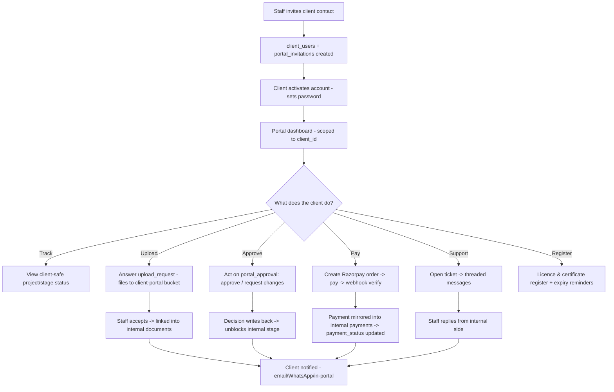
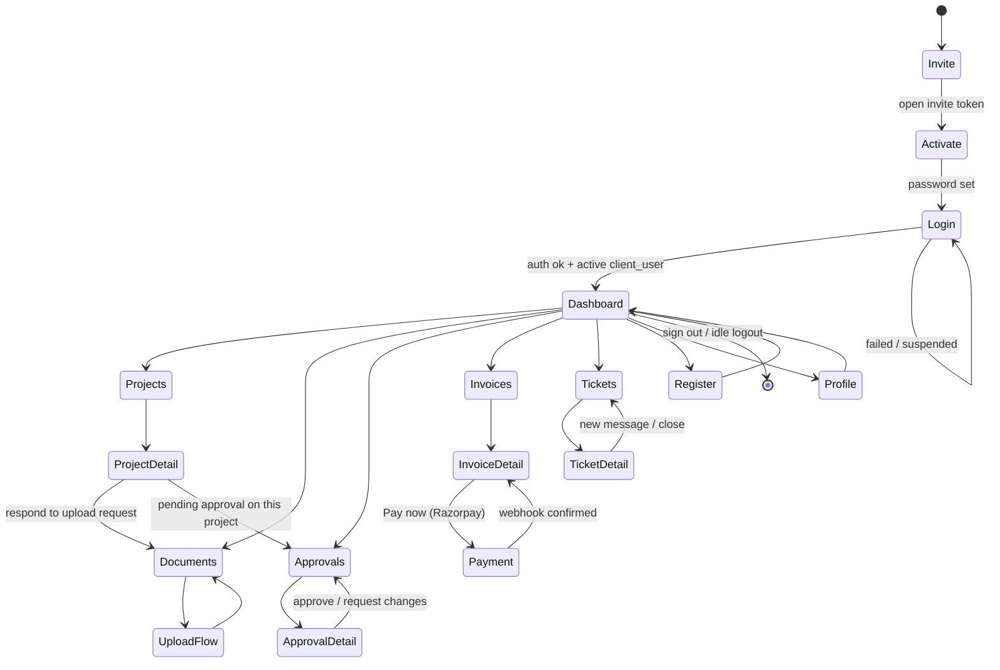
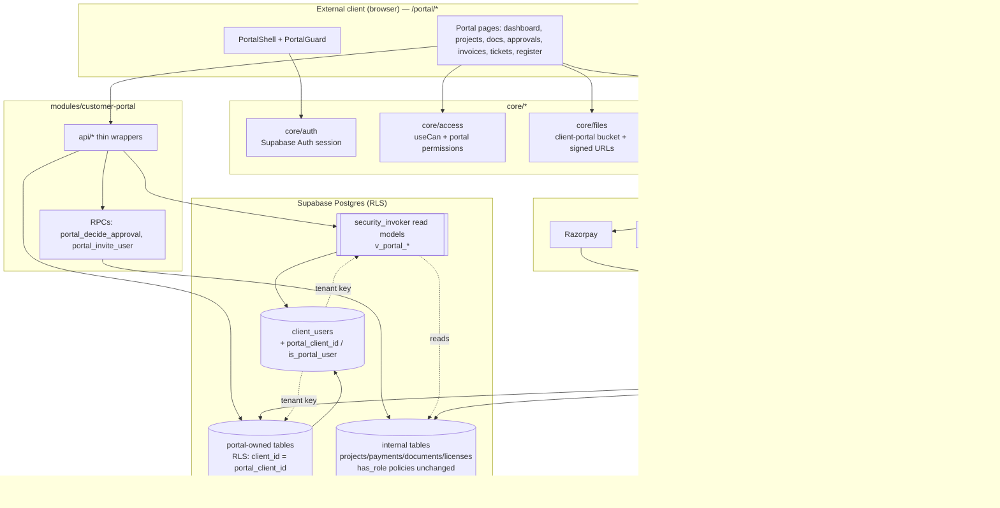

# Module Design — Customer Portal (Module 13)

**Status:** Design (Phase D). Design-only; no code until approved (§5 of the master architecture).
**Anchor entities:** `client_users`, client-facing read models over Operations/Finance/Regulatory.
**Primary users:** External clients (FBOs / nutraceutical companies) — the FSSAI/regulatory consultancy's customers. **No internal staff use this surface.**
**Depends on:** `core/auth`, `core/access`, `core/files`, `core/notifications`, `core/ui`; reads (never writes directly) Operations, Finance, Regulatory data through curated, RLS-guarded read models.
**Security posture:** This is the platform's **only externally-authenticated surface**. Tenant isolation (one client_user → exactly one `client_id`) is the load-bearing security property and is specified explicitly in §4 and §6.

---

## 1. Purpose & scope

### What business capability
A self-service web portal where a consultancy **client** logs in to:
- Track the live status of their FSSAI/regulatory **projects and stages** (a client-safe projection of Operations — no internal notes, no cost/margin, no staff clock mechanics).
- **Exchange documents**: upload documents the TPS team has requested (KYC, product details, label artwork inputs) and download **deliverables** (issued licences, prepared forms, certificates).
- View **invoices** and pay online via **Razorpay**.
- **Approve** items that TPS pushes for client sign-off — draft applications, label/artwork proofs, quotations — feeding the approval back into the internal workflow.
- Raise and track **support tickets / queries**.
- See a **licence & certificate register** with **expiry reminders**.
- Receive **notifications** (email / WhatsApp / in-portal).

### Who uses it
External client users only. A single client company (`clients` row) may have several portal users (owner, staff, accountant) — all scoped to that one `client_id`. Internal staff never authenticate here; they interact through the internal Operations/Finance/Regulatory modules, and their actions surface to the client via this portal's read models.

### What it explicitly does NOT do
- **Does not** let a client see any data outside their own `client_id` — enforced in the database, not the UI (§4, §6).
- **Does not** expose internal-only fields: `projects.notes`, `quoted_amount`/`paid_amount` margin math, three-clock internals (`active_clock`, `blocked_minutes_total`), staff assignments, vault credentials (`licenses.vault_credential_id`, `credential_username`), `credential_access_log`, `audit_log`, `authority_queries` raw government letters (only a client-safe "action required" summary), or any other client's rows.
- **Does not** create/modify internal Operations records directly. Client actions (uploads, approvals, tickets, payments) land in **portal-owned tables**; internal staff triage and promote them. This preserves the internal workflow's integrity and audit trail.
- **Does not** grant a portal user any `user_role` from the internal `user_role` enum. Portal identity is a separate concept (`client_users`), so no internal `has_role(...)` policy can ever match a client (§6).
- **Does not** replace the internal admin/user-management module; portal-user lifecycle (invite/suspend) is a thin capability owned here but surfaced to staff in Administration.

---

## 2. Business workflow

Grounded in TPS's real FSSAI flow: a nutraceutical FBO engages TPS for a Central Licence application; TPS collects documents, drafts the application, gets client approval, submits to FoSCoS, handles authority deficiency letters, and delivers the licence.

**End-to-end process:**
1. **Onboarding / invite.** Staff (Manager+) in the internal app invites the client contact from the `clients` record → creates a `portal_invitations` row + Supabase Auth user (no password yet) + a `client_users` row bound to that `client_id`. An email/WhatsApp invite with a single-use, expiring token goes out via `core/notifications`.
2. **Activation.** Client opens the invite link, sets a password (Supabase Auth), accepts terms. `client_users.status` → `active`. First login recorded in `portal_sessions`.
3. **Dashboard.** Client sees their projects, outstanding document requests, pending approvals, unpaid invoices, open tickets, and upcoming licence expiries — all scoped to their `client_id`.
4. **Track project status.** Client opens a project → sees a client-safe stage timeline (stage name, status, "who we're waiting on" as a friendly label derived from `active_clock`, target date) — never internal notes/margins.
5. **Respond to a document request.** Staff raises an `upload_request` ("Please upload FSSAI Form B, signed"). Client uploads files → stored via `core/files` in the `client-portal` bucket → `portal_upload_files` rows. Staff is notified; on internal acceptance the file is linked into the internal `client_documents`/`documents` set.
6. **Approve a draft/label/quotation.** Staff pushes an item for approval → `portal_approvals` row (`kind` = draft_application | label_artwork | quotation | other) with an attached file. Client reviews, then **Approve** or **Request changes** with remarks. The decision writes back to the internal workflow (mirrors migration 069's approval/remark pattern) and unblocks the relevant stage.
7. **Pay an invoice.** Client opens an unpaid invoice → **Pay now** → a `portal_payment_orders` row + Razorpay order is created via an Edge Function → client completes payment on Razorpay → webhook (Edge Function) verifies signature → records the payment and mirrors it into internal `payments`, updating `projects.payment_status`.
8. **Raise a query/ticket.** Client opens a ticket (`portal_tickets`) with category/priority; threaded messages (`portal_ticket_messages`) flow both ways; staff replies from the internal side; status moves open → in_progress → resolved → closed.
9. **Authority deficiency handling (client-facing).** When TPS logs an `authority_queries` item needing client input, the portal shows a **client-safe "Action required"** card (subject + due date + what's needed) and, if it needs documents, spawns an `upload_request`. Raw government letters stay internal unless a staff member explicitly shares a deliverable.
10. **Delivery & register.** On licence issue, staff shares the deliverable → appears under **Documents → Deliverables** for download, and the licence appears in the client's **Licence register** with an expiry date and reminder schedule.
11. **Ongoing reminders.** Scheduled jobs send expiry reminders (T-60/T-30/T-7) and payment-due reminders through `core/notifications`, respecting per-user channel preferences.



---

## 3. Screen flow

Portal is a **separate route tree** (`/portal/*`) rendered by a distinct shell (`PortalShell`) with its own minimal navigation — not the internal `AppShell`. The router mounts `/portal/*` behind a `PortalGuard` that requires an active `client_users` identity; the internal app mounts everything else behind the staff guard. A staff user hitting `/portal` is redirected out, and a portal user hitting any internal route is redirected to `/portal`.



### Screen inventory

| Route | Screen | Purpose | Key permission |
|---|---|---|---|
| `/portal/invite/:token` | Activate | Set password, accept terms (public + token) | — (token-gated) |
| `/portal/login` | Login | Email/password sign-in (public) | — |
| `/portal` | Dashboard | Status summary, action items, KPIs | `portal.project.read` |
| `/portal/projects` | Projects list | All client's projects (client-safe) | `portal.project.read` |
| `/portal/projects/:id` | Project detail | Client-safe stage timeline + action items | `portal.project.read` |
| `/portal/documents` | Documents | Requested uploads + deliverables to download | `portal.document.read` |
| `/portal/documents/upload/:requestId` | Upload flow | Fulfil an `upload_request` | `portal.document.upload` |
| `/portal/approvals` | Approvals | Items awaiting client sign-off | `portal.approval.read` |
| `/portal/approvals/:id` | Approval detail | Review + approve/request-changes | `portal.approval.act` |
| `/portal/invoices` | Invoices | Invoice list + status | `portal.invoice.read` |
| `/portal/invoices/:id` | Invoice detail | Line items + **Pay now** | `portal.payment.create` |
| `/portal/tickets` | Tickets | Support/query list | `portal.ticket.read` |
| `/portal/tickets/:id` | Ticket detail | Threaded conversation | `portal.ticket.read` |
| `/portal/register` | Licence register | Licences/certificates + expiry | `portal.license.read` |
| `/portal/profile` | Profile & users | Manage own profile; owner invites teammates | `portal.profile.manage` / `portal.user.invite` |

---

## 4. Database design

Portal tables live in the `public` schema alongside existing tables (single Supabase project — modular monolith). Two categories:
- **Portal-owned tables** (client can write, strictly scoped): `client_users`, `portal_sessions`, `portal_invitations`, `upload_requests`, `portal_upload_files`, `portal_approvals`, `portal_tickets`, `portal_ticket_messages`, `portal_payment_orders`, `portal_notification_prefs`, `portal_activity_log`, `portal_document_shares`.
- **Client-safe read models** (`security_invoker` views over internal tables, exposing only client-safe columns): `v_portal_projects`, `v_portal_project_stages`, `v_portal_invoices`, `v_portal_licenses`, `v_portal_deliverables`, `v_portal_authority_actions`.

Money stays in **paise (bigint)** to match `projects`/`payments`. All timestamps `timestamptz`. Amounts, audit and payment tables are **append-only** (rules mirroring `audit_log`/`credential_access_log`).

```mermaid
erDiagram
  clients ||--o{ client_users : "has portal users"
  clients ||--o{ projects : "owns (internal)"
  clients ||--o{ licenses : "holds (internal)"
  clients ||--o{ payments : "billed (internal)"

  client_users ||--o{ portal_sessions : "logs in"
  client_users ||--o{ portal_invitations : "invited via"
  client_users ||--o{ portal_notification_prefs : "channel prefs"
  client_users ||--o{ portal_activity_log : "acts"

  clients ||--o{ upload_requests : "requested from"
  upload_requests ||--o{ portal_upload_files : "fulfilled by"
  client_users ||--o{ portal_upload_files : "uploaded"

  clients ||--o{ portal_approvals : "sign-off items"
  projects ||--o{ portal_approvals : "context (internal)"
  client_users ||--o{ portal_approvals : "acted by"

  clients ||--o{ portal_tickets : "raises"
  portal_tickets ||--o{ portal_ticket_messages : "thread"
  client_users ||--o{ portal_ticket_messages : "author (client side)"

  clients ||--o{ portal_payment_orders : "pays via razorpay"
  payments ||--o| portal_payment_orders : "mirrored to (internal)"

  clients ||--o{ portal_document_shares : "deliverables shared"
  documents ||--o| portal_document_shares : "points to (internal)"

  clients ||--o{ v_portal_projects : "read model"
  clients ||--o{ v_portal_invoices : "read model"
  clients ||--o{ v_portal_licenses : "read model"
```



### Key tables

**`client_users`** — the tenant-binding identity. One row per external login; **exactly one `client_id`**.

| Column | Type | Notes |
|---|---|---|
| `id` | uuid PK | = `auth.users.id` (FK, on delete cascade) — mirrors `profiles` pattern |
| `client_id` | uuid NOT NULL | FK → `clients(id)`; **the isolation key**. Immutable after creation |
| `full_name` | text NOT NULL | |
| `email` | text NOT NULL unique | |
| `phone` | text | for WhatsApp/OTP |
| `portal_role` | enum `portal_role` | `owner` \| `member` \| `viewer` (intra-client roles) |
| `status` | enum `portal_user_status` | `invited` \| `active` \| `suspended` |
| `is_primary` | boolean default false | primary contact for the company |
| `invited_by` | uuid | FK → `profiles(id)` (internal staff) |
| `last_login_at` | timestamptz | |
| `created_at` / `updated_at` | timestamptz | `moddatetime` on update |

> **Invariant:** `client_id` is set at creation and never updatable (enforced by RLS `WITH CHECK` + a `BEFORE UPDATE` trigger that rejects `client_id` changes). This is what makes `portal_client_id()` a stable, trustworthy tenant key.

**`portal_sessions`** — append-only login/security log: `id`, `client_user_id`, `client_id` (denormalized for RLS), `ip_address`, `user_agent`, `login_at`, `logout_at`, `login_method` (password/otp), `is_suspicious`.

**`portal_invitations`** — `id`, `client_id`, `email`, `token_hash` (store hash, never raw token), `expires_at`, `accepted_at`, `invited_by`, `revoked_at`. Single-use, expiring.

**`upload_requests`** — staff → client document ask: `id`, `client_id`, `project_id` (nullable), `title`, `description`, `doc_category` (reuse `client_document_category` / `document_type`), `status` (`open`\|`submitted`\|`accepted`\|`rejected`), `due_date`, `requested_by` (staff), `created_at`.

**`portal_upload_files`** — client's answer: `id`, `upload_request_id`, `client_id`, `storage_path` (bucket `client-portal`), `file_name`, `mime_type`, `file_size_bytes`, `uploaded_by` (client_user), `status` (`pending_review`\|`accepted`\|`rejected`), `linked_document_id` (nullable FK → internal `documents`/`client_documents` once accepted), `created_at`.

**`portal_approvals`** — sign-off items pushed by staff: `id`, `client_id`, `project_id` (nullable), `kind` (`draft_application`\|`label_artwork`\|`quotation`\|`other`), `title`, `storage_path` (proof file), `amount_paise` (nullable, for quotations), `status` (`pending`\|`approved`\|`changes_requested`\|`expired`), `decided_by` (client_user), `decided_at`, `remark` (client's change request), `created_by` (staff), `created_at`.

**`portal_tickets`** — `id`, `client_id`, `raised_by` (client_user), `subject`, `category` (`general`\|`document`\|`payment`\|`technical`\|`regulatory`), `priority`, `status` (`open`\|`in_progress`\|`waiting_client`\|`resolved`\|`closed`), `project_id` (nullable), `assigned_staff` (nullable FK profiles), `created_at`, `updated_at`.

**`portal_ticket_messages`** — `id`, `ticket_id`, `client_id`, `author_client_user` (nullable), `author_staff` (nullable), `body`, `attachment_path` (nullable), `is_internal_note` (boolean — internal notes NOT exposed to client via RLS), `created_at`. Exactly one of `author_client_user`/`author_staff` is set.

**`portal_payment_orders`** — Razorpay bridge (append-only): `id`, `client_id`, `project_id`, `invoice_ref`, `amount_paise`, `razorpay_order_id`, `razorpay_payment_id`, `status` (`created`\|`paid`\|`failed`\|`refunded`), `signature_verified` (boolean), `mirrored_payment_id` (FK → internal `payments`), `created_by` (client_user), `created_at`, `paid_at`.

**`portal_document_shares`** — deliverables staff expose for download: `id`, `client_id`, `document_id` (FK → internal `documents`), `shared_by` (staff), `label`, `shared_at`, `revoked_at`. The portal only ever reads internal `documents` **through** this allow-list, never the raw table.

**`portal_notification_prefs`** — `client_user_id`, `client_id`, `email_enabled`, `whatsapp_enabled`, `expiry_reminders`, `payment_reminders`.

**`portal_activity_log`** — append-only client-action audit: `id`, `client_user_id`, `client_id`, `action`, `entity`, `entity_id`, `ip_address`, `created_at`.

### Read-model views (client-safe projections)

- **`v_portal_projects`** — `project_id`, `client_id`, `project_code`, `project_name`, `service_type`, friendly `status`, `waiting_on` (mapped from `active_clock`: employee→"With TPS", client→"Awaiting your input", authority→"With FSSAI authority"), `start_date`, `target_date`, `completed_date`. **Excludes** notes, amounts, staff ids, clock internals.
- **`v_portal_project_stages`** — `stage_id`, `project_id`, `client_id`, `stage_name`, `status`, `due_date`, `completed_at`. No internal notes/assignee.
- **`v_portal_invoices`** — projection over `payments`/`projects` financials the client is allowed to see: `client_id`, `project_code`, `invoice_no`, `amount_paise`, `paid_amount_paise`, `payment_status`, `due_date`. No cost/margin fields.
- **`v_portal_licenses`** — over `licenses`: `client_id`, `license_number`, `license_type`, `category`, `issue_date`, `expiry_date`, `is_active`. **Never** `vault_credential_id`, `credential_username`, or access-log fields.
- **`v_portal_deliverables`** — over `portal_document_shares` ⋈ `documents`: only shared, non-revoked deliverables.
- **`v_portal_authority_actions`** — client-safe summary of `authority_queries` that need client input: `subject`, `response_due`, `status`. No raw letter body/attachments.

All views are declared `WITH (security_invoker = on)` so RLS on the underlying tables **and** the portal policies both apply — a view never becomes a bypass.

### RLS intent per table

| Table / view | Portal SELECT | Portal INSERT/UPDATE | Internal staff |
|---|---|---|---|
| `client_users` | own row + same-client rows if `owner` | update own profile; `owner` invites (INSERT via RPC) | staff manage via SECURITY DEFINER RPCs |
| `portal_sessions` | own client rows | insert via auth hook (definer) | read for security review |
| `portal_invitations` | none (token flow) | via RPC | staff create/revoke |
| `upload_requests` | `client_id = portal_client_id()` | none (staff-created) | staff CRUD |
| `portal_upload_files` | own client rows | INSERT own client, `pending_review`; no update after submit | staff review/accept |
| `portal_approvals` | own client rows | UPDATE decision fields only, own client, while `pending` | staff create; read decisions |
| `portal_tickets` | own client rows | INSERT/UPDATE own client | staff triage/assign |
| `portal_ticket_messages` | own client rows **AND** `is_internal_note = false` | INSERT own client (author = self) | staff post (incl. internal notes) |
| `portal_payment_orders` | own client rows | INSERT via Edge Function (service role) | read; webhook writes |
| `portal_document_shares` | own client rows | none | staff share/revoke |
| `portal_notification_prefs` | own row | UPDATE own row | — |
| `portal_activity_log` | own client rows | insert via definer helper | read for audit |
| `v_portal_*` views | `client_id = portal_client_id()` | n/a (read-only) | staff use internal tables |

**The single predicate that guarantees isolation** on every portal-readable object is `client_id = portal_client_id()` (details and threat model in §6). Internal tables keep their existing `has_role(...)` policies unchanged; because a portal user has **no `user_role`**, those policies never grant a client anything — the two policy families are disjoint.

### Expand-contract notes
- All portal tables/views are **additive** — zero change to existing internal tables' structure or policies. Nothing in Operations/Finance is altered; the portal only **reads** via new `security_invoker` views and **writes** into new portal-owned tables.
- New enums (`portal_role`, `portal_user_status`, ticket/approval statuses) are new types — no mutation of the existing `user_role` enum (keeping portal identity strictly separate from staff roles is a security decision, not just tidiness).
- The `notification_type` enum gains portal values (expand) via `ALTER TYPE ... ADD VALUE` (mirrors migration 068).
- Storage: a new `client-portal` bucket with its own RLS policies (client can write to `client_id`-prefixed paths only); deliverables served from the existing `documents` bucket **only** through signed URLs gated by `portal_document_shares`.

---

## 5. API design

Module `api/*` functions are thin typed Supabase wrappers (read models + portal tables). Anything that (a) crosses the client/staff trust boundary, (b) touches money, or (c) mutates internal tables is a **SECURITY DEFINER RPC** or an **Edge Function** — never a direct client write.

### `api/*` (client-side, RLS-enforced)
| Function | Inputs | Output | Authz |
|---|---|---|---|
| `getPortalDashboard()` | — | counts + action items | RLS: `portal_client_id()` |
| `listProjects(filters)` | status/search | `v_portal_projects[]` | `portal.project.read` |
| `getProject(id)` | project_id | project + `v_portal_project_stages[]` | RLS scope |
| `listUploadRequests()` | — | `upload_requests[]` | `portal.document.read` |
| `submitUpload(requestId, files)` | files | `portal_upload_files[]` | `portal.document.upload` |
| `listApprovals()` / `getApproval(id)` | — | `portal_approvals` | `portal.approval.read` |
| `listInvoices()` / `getInvoice(id)` | — | `v_portal_invoices` | `portal.invoice.read` |
| `listTickets()` / `getTicket(id)` | — | tickets + messages (non-internal) | `portal.ticket.read` |
| `createTicket(payload)` / `postTicketMessage(id, body)` | — | row | `portal.ticket.create` |
| `getRegister()` | — | `v_portal_licenses[]` + `v_portal_deliverables[]` | `portal.license.read` |
| `getNotificationPrefs()` / `updateNotificationPrefs(p)` | — | prefs | `portal.profile.manage` |

### RPCs (SECURITY DEFINER, `set search_path = public`)
| RPC | Inputs | Does | Authz check inside |
|---|---|---|---|
| `portal_decide_approval(approval_id, decision, remark)` | — | Sets approval status, **writes back to internal workflow** (unblocks stage, appends a `project_remarks`-style note), notifies staff. Mirrors migration 069's `approve_block_request` pattern. | asserts `is_portal_user()` AND row's `client_id = portal_client_id()` AND status `pending` |
| `portal_invite_user(email, name, portal_role)` | — | Owner invites a teammate under the **same** `client_id` (cannot set another client). | asserts caller `portal_role='owner'`; forces `client_id = portal_client_id()` |
| `portal_accept_upload(file_id)` (staff) | — | Links `portal_upload_files` → internal `documents`/`client_documents`. | asserts `has_role('super_admin','director','manager','executive')` |
| `staff_invite_client(client_id, email, name)` (staff) | — | Creates auth user + `client_users` + invitation. | asserts `has_role('super_admin','director','manager')` |

### Edge Functions
| Function | Trigger | Does | Security |
|---|---|---|---|
| `portal-create-order` | client "Pay now" | Creates `portal_payment_orders` + Razorpay order (server-side key). | JWT verified = active client_user; amount read from `v_portal_invoices`, **never trusted from client** |
| `portal-razorpay-webhook` | Razorpay | Verifies HMAC signature, marks order `paid`, **mirrors into internal `payments`**, recomputes `projects.payment_status`, notifies. | verify webhook secret; service role; idempotent on `razorpay_payment_id` |
| `portal-invite-dispatch` | invite created | Sends invite email/WhatsApp via `core/notifications`. | service role; gated by settings |
| `portal-expiry-reminders` | pg_cron | Builds licence-expiry + payment-due reminders. | service role |

**Rule:** the browser never sees the Razorpay secret, never sets an amount, and never writes to internal tables. Every trust-boundary crossing is server-verified.

---

## 6. Permissions & the tenant-isolation security model

### Permission keys (`portal.<entity>.<action>`)
`portal.project.read`, `portal.document.read`, `portal.document.upload`, `portal.document.download`, `portal.invoice.read`, `portal.payment.create`, `portal.approval.read`, `portal.approval.act`, `portal.ticket.read`, `portal.ticket.create`, `portal.license.read`, `portal.profile.manage`, `portal.user.invite`.

### Intra-client roles → permissions (default grants)
| Permission | owner | member | viewer |
|---|:---:|:---:|:---:|
| `portal.project.read` | ✅ | ✅ | ✅ |
| `portal.document.read` / `.download` | ✅ | ✅ | ✅ |
| `portal.document.upload` | ✅ | ✅ | — |
| `portal.invoice.read` | ✅ | ✅ | ✅ |
| `portal.payment.create` | ✅ | ✅ | — |
| `portal.approval.read` | ✅ | ✅ | ✅ |
| `portal.approval.act` | ✅ | — | — |
| `portal.ticket.read` | ✅ | ✅ | ✅ |
| `portal.ticket.create` | ✅ | ✅ | — |
| `portal.license.read` | ✅ | ✅ | ✅ |
| `portal.profile.manage` | ✅ | ✅ (self) | ✅ (self) |
| `portal.user.invite` | ✅ | — | — |

These are **UI affordance** only (`useCan()`); the database is authoritative.

### THE ISOLATION MECHANISM (production-security-critical)

**Goal:** a `client_user` can read and write **only** rows whose `client_id` equals the caller's own client — across projects, invoices, documents, approvals, tickets, everything — with the guarantee living in Postgres RLS, not in application code.

**1. Tenant key from a trusted, immutable link.** Two SECURITY DEFINER helpers are the single source of tenant truth:

```sql
-- Returns the caller's ONE client_id, or NULL if not an active portal user.
create or replace function portal_client_id()
returns uuid language sql stable security definer set search_path = public as $$
  select client_id from client_users
  where id = auth.uid() and status = 'active'
$$;

create or replace function is_portal_user()
returns boolean language sql stable security definer set search_path = public as $$
  select exists (select 1 from client_users
                 where id = auth.uid() and status = 'active')
$$;
```

`client_users.id = auth.users.id` (1:1), and `client_id` is **immutable** (RLS `WITH CHECK` forbids changing it + a `BEFORE UPDATE` trigger rejects any `client_id` change). So `portal_client_id()` cannot be spoofed by the client — it is derived server-side from the authenticated `auth.uid()`, not from any request payload.

**2. Every portal-readable object carries `client_id` and filters on it.** Portal-owned tables have a `client_id` column (denormalized where needed so the check never requires a join the client could influence). Every portal policy is:

```sql
alter table upload_requests enable row level security;

create policy portal_select_own_client on upload_requests
  for select using ( client_id = portal_client_id() );

create policy portal_write_own_client on portal_upload_files
  for insert with check (
    client_id = portal_client_id()
    and uploaded_by = auth.uid()
    and status = 'pending_review'
  );
```

Read models apply the same predicate and are `security_invoker`, so the view runs with the caller's RLS — it can never widen access:

```sql
create view v_portal_projects with (security_invoker = on) as
  select p.id as project_id, p.client_id, p.project_code, p.project_name,
         p.service_type, p.status, p.start_date, p.target_date, p.completed_date,
         case p.active_clock when 'employee' then 'With TPS'
              when 'client' then 'Awaiting your input'
              else 'With FSSAI authority' end as waiting_on
  from projects p
  where p.client_id = portal_client_id();   -- redundant-but-explicit tenant guard
```

**3. Deny-by-default + disjoint policy families.** RLS is `ENABLE` + (where supported) `FORCE` on every portal table; with no matching policy, access is denied. Crucially:
- **Portal users have no `user_role`.** They are absent from `profiles`, so `auth_role()` returns `NULL` and every internal `has_role(...)` policy evaluates false for them. A client therefore gets **nothing** from internal-table policies — only from portal policies that require `client_id = portal_client_id()`.
- **Staff have no `client_users` row,** so `portal_client_id()` returns `NULL` and `x = NULL` is never true — staff read internal tables through their own `has_role` policies, not through portal predicates. The two worlds are cleanly separated; neither can leak into the other.

**4. Writes across the trust boundary are RPC/Edge-only.** Clients never `INSERT/UPDATE` internal tables. Approvals write back via `portal_decide_approval` (definer, re-checks `client_id = portal_client_id()`), and payments mirror in via the webhook Edge Function (service role, signature-verified). This keeps the internal audit trail intact and prevents a client from forging internal state.

**5. Storage isolation.** `client-portal` bucket policies constrain writes to keys prefixed with the caller's `portal_client_id()`; deliverable downloads use short-lived signed URLs issued only after checking `portal_document_shares` for that `client_id`.

**Isolation guarantees (explicit):**
- **G1 — Horizontal isolation:** no client can ever read or write another client's rows; every path filters on `client_id = portal_client_id()`, evaluated in the DB.
- **G2 — No privilege bleed:** a portal user can never obtain a staff `user_role` (separate identity table + separate enum), so internal staff policies are unreachable from the portal.
- **G3 — Field-level minimization:** clients see only curated columns via `security_invoker` views; sensitive fields (vault creds, margins, staff notes, raw authority letters, internal ticket notes) are structurally excluded, not merely hidden in the UI.
- **G4 — Immutable tenancy:** `client_id` on `client_users` cannot be changed post-creation, so the tenant key can't be pivoted.
- **G5 — Server-verified boundary crossings:** money and internal-state writes go only through signature/role-checked RPCs and Edge Functions.
- **G6 — Defense in depth:** UI `useCan()` + view predicate + base-table RLS + `FORCE ROW LEVEL SECURITY`; any single layer failing does not open cross-tenant access.

> **Verification gate (per project rules §Verification):** before go-live, run a two-tenant penetration test — Client A authenticated, attempt to read/write every portal endpoint with Client B's ids (direct PostgREST calls, forged `client_id` in payloads, view queries, storage paths, signed-URL reuse). Expected: 0 rows / permission denied on every cross-tenant attempt. Also run Supabase advisors (`get_advisors` security lint) and confirm no `SECURITY DEFINER` view or missing-RLS finding.

---

## 7. Dashboard

Client dashboard widgets (all scoped by `portal_client_id()`):

| Widget | Metric | Source |
|---|---|---|
| Active projects | count + status breakdown | `v_portal_projects` |
| Action required | # open `upload_requests` + `pending` approvals + `authority_actions` | portal tables + `v_portal_authority_actions` |
| Outstanding balance | sum unpaid `amount_paise` | `v_portal_invoices` |
| Pending approvals | list with due dates | `portal_approvals` |
| Open tickets | count by status | `portal_tickets` |
| Upcoming expiries | licences within 60 days | `v_portal_licenses` |
| Recent activity | last 10 client actions | `portal_activity_log` |

---

## 8. Reports

Client-facing (lightweight — clients don't get internal analytics):

| Report | Columns | Filters | Export |
|---|---|---|---|
| Project status report | code, name, service, status, target date, waiting-on | status, date range | PDF |
| Payment history | invoice no, project, amount, mode, date, status | date range, status | PDF / CSV |
| Document register | file, category, project, uploaded/shared date | category, project | CSV |
| Licence & certificate register | number, type, category, issue, expiry, status | active/expiring | PDF / CSV |
| Approval history | item, kind, decision, date, remark | kind, decision | CSV |

Generation via the shared reporting utility; all queries flow through the `client_id`-scoped views, so a report can never span tenants.

---

## 9. Notifications

Every notification goes through `core/notifications` (`notify()`), respecting `portal_notification_prefs`. Recipients are `client_users` (email/WhatsApp) and, for the reverse direction, internal staff via existing `notifications`.

| Event | notification_type | Recipient | Channels |
|---|---|---|---|
| Invite created | `portal_invite` | client contact | email + WhatsApp |
| Upload requested | `portal_upload_requested` | client (owner/members) | email/WhatsApp/in-portal |
| Upload submitted | `portal_upload_submitted` | assigned staff | in-app |
| Approval requested | `portal_approval_requested` | client | email/WhatsApp/in-portal |
| Approval decided | `portal_approval_decided` | staff | in-app |
| Invoice raised | `portal_invoice_raised` | client | email/WhatsApp |
| Payment received | `portal_payment_received` | client + staff | email/in-app |
| Ticket updated | `portal_ticket_updated` | other party | email/in-portal |
| Licence expiring (T-60/30/7) | `license_expiring` (reuse) | client | email/WhatsApp |

New enum values added via expand (`ALTER TYPE notification_type ADD VALUE`). Staging stays sandboxed because dispatch is gated by settings flags (§3 master).

---

## 10. Automations

| Job | Type | Cadence | Action |
|---|---|---|---|
| Licence-expiry reminders | pg_cron → `portal-expiry-reminders` Edge Fn | daily 07:00 IST | T-60/30/7 reminders from `v_portal_licenses` |
| Payment-due reminders | pg_cron → Edge Fn | daily | unpaid `v_portal_invoices` past due |
| Invitation expiry sweep | pg_cron | hourly | mark stale `portal_invitations` expired |
| Approval SLA nudge | pg_cron | daily | remind clients of `pending` approvals > N days |
| New upload_request | DB trigger → `notify()` | event | notify client |
| Payment webhook | Edge Fn (event) | on Razorpay callback | verify, mirror to `payments`, recompute status, notify |
| Suspicious-login flag | trigger on `portal_sessions` | event | flag + notify staff on new IP/geo |

Scheduled dispatch is gated by settings so staging never messages real clients.

---

## 11. Integrations

| System | Purpose | Boundary / adapter |
|---|---|---|
| **Supabase Auth** | External client identity (separate from staff) | `core/auth`; portal users bound to `client_users`, no `profiles` row, no `user_role` |
| **Supabase Storage** | Client uploads + deliverable downloads | `core/files`; `client-portal` bucket with `client_id`-prefixed RLS; signed URLs for deliverables |
| **Razorpay** | Online invoice payment | Edge Functions only (order create + HMAC-verified webhook); secret never in browser; idempotent on `razorpay_payment_id` |
| **ZeptoMail (email)** | Invites, reminders, receipts | via `core/notifications` adapter |
| **WhatsApp BSP (AiSensy)** | Reminders/notifications | via `core/notifications`; toggle-gated until number is live (per project memory) |
| **Internal Operations/Finance/Regulatory** | Source of read models + write-back targets | `security_invoker` views (read) + SECURITY DEFINER RPCs / Edge Fns (write-back); never direct client writes |
| **FSSAI FoSCoS** | (indirect) status originates internally | not called by portal; surfaced via read models only |

**Design stance (per project rules — challenge assumptions):** the portal deliberately does **not** call FoSCoS or write internal tables directly. Coupling an external surface to government portals or internal write paths would enlarge the attack surface and risk internal-data integrity. Keeping the portal read-mostly with server-verified write-backs is the safer, more maintainable boundary.

---

## 12. Future scalability

- **10× clients/users:** the isolation model is index-friendly — every hot query filters on `client_id`; add composite indexes `(client_id, status)` / `(client_id, created_at desc)` on portal tables (mirrors the internal indexing already in migrations 052/053). `portal_client_id()` is `stable` and can be wrapped in `(select portal_client_id())` in policies so Postgres evaluates it once per query (InitPlan) rather than per row.
- **Multi-entity (TPS Xperts Group + TPS Global Certification):** add a nullable `business_unit` to `client_users`/read models; isolation predicate becomes `client_id = portal_client_id()` unchanged (business unit is an attribute of the client, not a second tenant axis) — so the security model doesn't change shape.
- **True multi-tenant SaaS (many consultancies):** promote `client_id` isolation to a two-level `(org_id, client_id)` key; `portal_client_id()` gains an `org_id` sibling; all policies extend to `AND org_id = portal_org_id()`. The single-predicate design makes this a mechanical, auditable change.
- **Data volume:** payment/audit/session tables are append-only — partition `portal_activity_log`/`portal_sessions` by month at scale; archive closed tickets.
- **Performance:** read models are lazy-loaded routes (code-split, §1.6 master); TanStack Query keys `['portal', entity, params]`, staleTime 60s; heavy PDF export offloaded to an Edge Function.
- **Rate limiting / abuse:** add per-`client_user` throttling on upload and payment-order creation at the Edge; CAPTCHA on login is out of scope for staff to solve but can be enabled for the client login form.

---

## 13. Architecture diagram



---

### Open questions for approval (per project rules — clarify, don't assume)
1. **Invoice source of truth:** the internal model tracks money on `projects` (`quoted_amount`/`paid_amount`) + `payments`, but there is no discrete `invoices` table yet. Should the Customer Portal consume a Finance-module `invoices` table (preferred) once Module 6 is designed, or project-level rollups in the interim? `v_portal_invoices` is written to swap sources without changing the portal.
2. **Approval write-back depth:** should `portal_decide_approval` auto-advance the internal stage, or only flag it for staff confirmation? (Recommend flag-then-confirm to preserve internal control — matches the block-request approval pattern in migration 069.)
3. **WhatsApp go-live:** keep dispatch behind the existing toggle-stub until the AiSensy number is live (per project memory).
4. **Multi-user per client at launch:** launch with owner-only, or enable owner-invites-teammates from day one?

_No code, migration, or schema change is produced by this document. Implementation is gated on explicit per-item approval (project change-control rule)._
