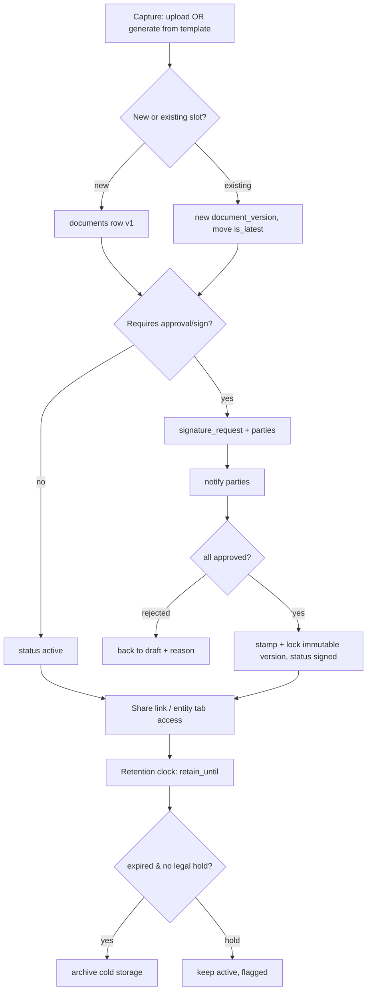
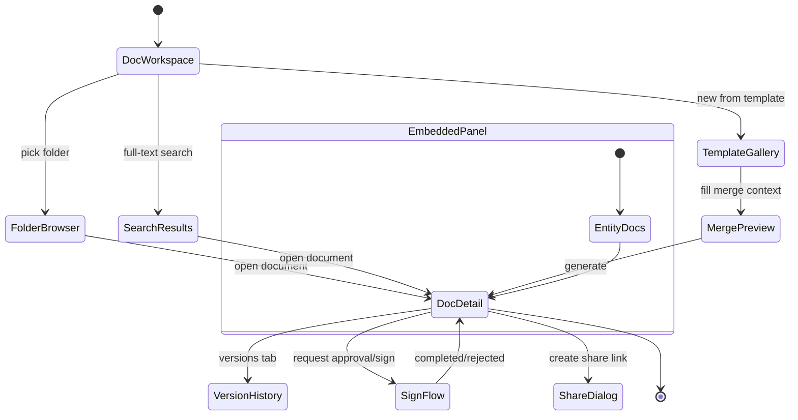
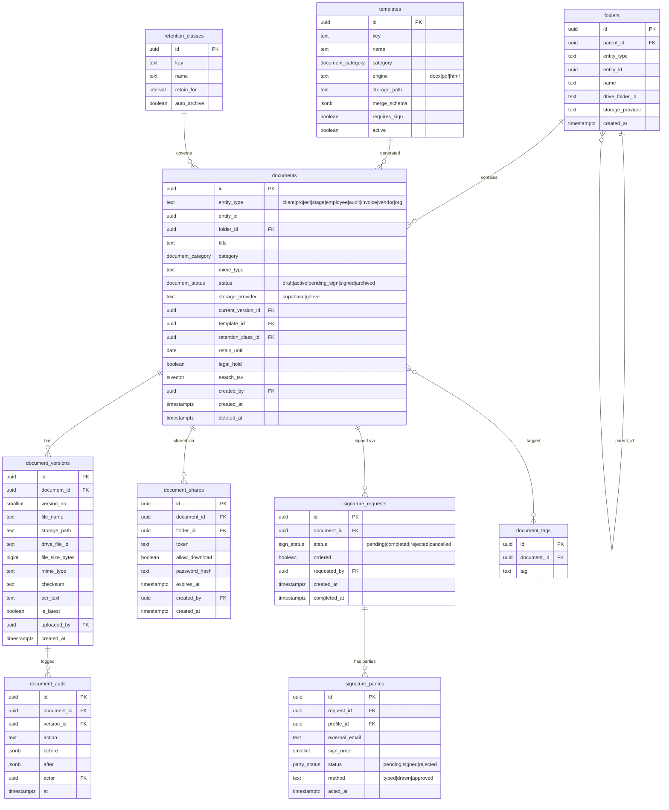

# Module Design — Document Management (DMS)

**Module key:** `documents`
**Status:** Design (Phase D). Design-only; no code until approved.
**Anchor entities:** Document, Document Version, Folder, Template, Signature Request.
**Classification:** Core-adjacent capability. Owns the unified document domain; exposes it through `core/files`. Every other module (Operations, Regulatory, Certification, HRMS, Finance, CRM, Portals) is a consumer, never an owner.
**Depends on:** `core/files`, `core/auth`, `core/access`, `core/notifications`, `core/ui`, `core/utils`; Supabase Storage; Google Drive (via `drive-ops` edge function); ZeptoMail (share-link + e-sign mail).

---

## 1. Purpose & scope

**Business capability.** A single, entity-linked document model for the whole platform: one place to store, version, organize (folders mirrored to Google Drive), template-generate (FSSAI forms, audit reports, certificates, offer letters), search (OCR + full-text), approve/e-sign, share (RLS + expiring links), and retain/archive every file TPS produces or receives.

**Who uses it.**
- **Executives / Regulatory** — client & project files, FSSAI form generation, authority-letter storage.
- **Certification body staff (auditors, scheme managers)** — application docs, audit reports, certificates, NC evidence (ISO 17021 records).
- **HR** — offer letters, employee documents, policy files.
- **Accounts** — invoices, government-fee receipts, ledgers.
- **Directors / Super admin** — approvals, e-sign, retention governance, audit trail.
- **External clients / vendors** (via Customer/Vendor Portals) — scoped read + upload of their own documents through share grants.

**What it explicitly does NOT do.**
- It does **not** own business records (projects, invoices, certificates as *entities*) — it stores and links the *files* about them. The entity tables stay in their own modules.
- It does **not** implement its own auth, storage transport, notification transport, or Drive transport — those live in Core (`core/files`, `core/notifications`). DMS defines the *model, policy, and workflow*; Core provides the *plumbing*.
- It is **not** a real-time collaborative editor. Editing rich docs happens in Google Docs/Word; DMS versions the resulting files.
- No legally-qualified e-sign vendor (Aadhaar eSign/DSC) in v1 — v1 ships an **internal approval + typed/drawn acknowledgement** workflow; qualified e-sign is an integration seam (§11).

---

## 2. Business workflow

TPS's real document lifecycle spans capture → organize → generate → review/sign → publish/share → retain/archive. Four grounded flows:

**A. Inbound capture (client/authority upload).**
1. Executive opens a Client or Project → **Documents** tab.
2. Uploads a file (GST/PAN/FSSAI licence, authority deficiency letter, artwork).
3. `core/files` routes bytes to Supabase Storage (`documents` bucket) or Google Drive per routing policy (§13); a `documents` row is created with `entity_type`/`entity_id`.
4. If a same-named/same-slot document exists, it becomes a **new version** (prior kept, `is_latest` moved).
5. Optional OCR/metadata extraction runs async; text lands in the search index.

**B. Template generation (outbound).**
1. User picks a **Template** (e.g. FSSAI Form B, ISO 22000 audit report, certificate, offer letter).
2. Fills/confirms the merge context (auto-pulled from the linked entity: client, project, employee, audit).
3. Engine renders `docx`/PDF, stores it as a new `documents` row linked to the entity, version 1.
4. Document enters an **approval/sign** flow if the template requires it (certificates, offer letters, audit reports).

**C. Approval & e-sign.**
1. Document owner requests approval/signature → creates a `signature_requests` row with ordered `signature_parties`.
2. Each party is notified (`core/notifications`); they open a secure link, review, and approve/sign (typed/drawn acknowledgement in v1).
3. When all parties complete, the document is stamped (signature block/cert seal), locked as a new immutable version, status → `signed`.
4. Rejection returns the document to `draft` with a reason recorded in history.

**D. Share, retain, archive.**
1. Owner creates a **share link** (scoped to one document/folder, optional expiry + password + download flag).
2. Retention policy assigns each document a class → computed `retain_until`; a nightly job moves expired docs to `archived` (cold) and flags legal-hold exceptions.



---

## 3. Screen flow

DMS is both a **standalone workspace** (`/documents`) and an **embedded tab** every consumer module mounts (`<DocumentsPanel entityType entityId>` from `index.ts`). The panel replaces today's per-module `DocumentsTab` / `ClientDocuments` / stage attachment widgets.



| Screen / Route | Purpose | Entry point |
|---|---|---|
| `/documents` (DocWorkspace) | Global browse, recent, search across all entities user may see | Sidebar nav |
| `/documents/folders/:id` (FolderBrowser) | Folder tree + files, Drive-mirrored | Workspace, entity tab |
| `/documents/:id` (DocDetail) | Preview, metadata, versions, approvals, shares | Anywhere |
| `/documents/:id/versions` (VersionHistory) | Version diff/list, restore-as-new | DocDetail |
| `/documents/templates` (TemplateGallery) | Pick + generate from templates | Workspace, entity actions |
| `/documents/templates/:id/merge` (MergePreview) | Confirm merge fields, render | TemplateGallery |
| `/documents/:id/sign` (SignFlow) | Approval/signature orchestration | DocDetail |
| Embedded `<DocumentsPanel>` | Entity-scoped list/upload/generate | Client/Project/Employee/Audit/Invoice detail pages |
| Public `/share/:token` | External scoped view/download | Share link (unauthenticated) |

---

## 4. Database design

### Reconciliation strategy (expand-contract)

Three legacy tables exist: `documents` (project-scoped, has `version`/`is_latest`), `client_documents` (client-scoped categories), `stage_documents` (versioned stage attachments). All three share the private `documents` storage bucket with path-prefix RLS.

**Decision: unify into one polymorphic `documents` table + `document_versions`, and *retire* `client_documents`/`stage_documents`** via expand-contract — no destructive change during coexistence.

- **Expand.** Add polymorphic columns to the existing `documents` table (`entity_type`, `entity_id`, `folder_id`, `storage_provider`, `drive_file_id`, `category`, `status`, `retain_until`, `checksum`, `search_tsv`). Existing rows backfill `entity_type='project'`, `entity_id=project_id`. Keep legacy `project_id`/`client_id` columns as generated/nullable shadows during coexistence.
- **Migrate.** Backfill `client_documents` → `documents` (`entity_type='client'`, `category` preserved) and `stage_documents` → `documents` (`entity_type='stage'`, versions → `document_versions`). Point new reads at compatibility **views** (`client_documents_v`, `stage_documents_v`) so current hooks keep working while UI flips to the unified `api/*`.
- **Contract.** After all readers use the unified API, drop the legacy tables (keep views one release), then drop the shadow columns.

Versioning moves from the flat `version`/`is_latest` on `documents` to a dedicated `document_versions` table; `documents` holds the logical document + a `current_version_id` pointer.



**Enums (new / extended).**
- `document_category` — supersedes `document_type` + `client_document_category`: `client_upload, tps_prepared, authority_issued, soi, invoice, certificate, audit_report, fssai_form, offer_letter, employee_doc, gst, pan, fssai, policy, other`.
- `document_status` — `draft, active, pending_sign, signed, archived`.
- `sign_status` / `party_status` as above.

**RLS intent (per table).** All tables `enable row level security`. Access is **entity-derived**: a user may see a document iff they may see its linked entity (reuses `has_role()` + existing per-entity checks like `fn_can_edit_clients()`), plus category-level gates (HR docs → HR/director only; finance docs → accounts/director).
- `documents` / `document_versions` — SELECT: entity-visibility + category gate. INSERT/UPDATE: `documents.<entity>.upload`/`.edit`. DELETE (soft): owner or `documents.<entity>.delete`.
- `folders` — mirrors document entity-visibility.
- `templates` — SELECT all staff; write `documents.template.manage` (director/super_admin).
- `signature_*` — parties + requester + director see their request; only the party may act on their own row.
- `document_shares` — creator + `documents.<entity>.share`; the public `/share/:token` path is served by a **SECURITY DEFINER RPC** that validates token/expiry/password and never exposes the table.
- `retention_classes` — read all staff; write `documents.retention.manage`.
- `document_audit` — insert via trigger only; SELECT director/super_admin/auditor.

**Expand-contract notes.** Storage RLS keeps the current path-prefix scheme (`clients/…`, `stages/…`, `<project_id>/…`) during coexistence; the unified model adds `entity_type/entity_id` so future paths become `<entity_type>/<entity_id>/<doc_id>/<version>`. New buckets are **not** required — reuse `documents`; `avatars`/`attendance`/`face-refs` stay owned by HRMS and are out of DMS scope.

---

## 5. API design

`modules/documents/api/*` — thin typed Supabase wrappers; hooks wrap in React Query, keys `['documents', entity, …]`.

| Function | Inputs | Output | Authz |
|---|---|---|---|
| `listDocuments` | `{ entityType, entityId, folderId?, category?, status? }` | `Document[]` | RLS (entity-visibility) |
| `getDocument` | `id` | `Document + versions` | RLS |
| `uploadDocument` | `{ entityType, entityId, folderId?, category, file }` | `Document` | `documents.<entity>.upload` |
| `addVersion` | `{ documentId, file }` | `DocumentVersion` | `.edit` |
| `updateMetadata` | `{ id, title?, category?, tags?, folderId? }` | `Document` | `.edit` |
| `softDeleteDocument` | `id` | `void` | `.delete` |
| `restoreVersion` | `{ documentId, versionId }` | new `DocumentVersion` | `.edit` |
| `createFolder` | `{ entityType, entityId, parentId?, name }` | `Folder` (+ Drive mirror) | `.upload` |
| `moveDocument` | `{ id, folderId }` | `Document` | `.edit` |
| `listTemplates` | `{ category? }` | `Template[]` | staff |
| `generateFromTemplate` (RPC/Edge) | `{ templateId, entityType, entityId, mergeContext }` | `Document` | `.generate` |
| `requestSignatures` | `{ documentId, parties[], ordered }` | `SignatureRequest` | `.sign.request` |
| `actOnSignature` | `{ requestId, partyId, decision, method, signatureBlob? }` | `SignatureParty` | party-scoped |
| `createShareLink` | `{ documentId?, folderId?, expiresAt?, password?, allowDownload }` | `{ token, url }` | `.share` |
| `resolveShare` (SECURITY DEFINER RPC) | `{ token, password? }` | scoped `Document`/`Folder` | public + token valid |
| `searchDocuments` | `{ q, entityType?, category? }` | `Document[]` (ranked) | RLS + FTS |
| `setRetention` | `{ documentId, classId, legalHold? }` | `Document` | `.retention.manage` |

**Edge Functions** (Deno, reuse `_shared`): `template-render` (docx/PDF merge → store; heavy deps), `doc-ocr` (extract text → `document_versions.ocr_text` + `search_tsv`), `share-resolve` (public link gateway with rate-limit). **`generateFromTemplate`, storage routing, and Drive mirror all call the existing `drive-ops` edge function** for Drive-side operations rather than re-implementing Drive auth.

---

## 6. Permissions

Namespaced `documents.<entity>.<action>` plus cross-cutting keys. `<entity>` ∈ `client, project, stage, employee, audit, invoice, vendor, org`.

| Permission key | super_admin | director | manager | executive | accounts | hr | auditor |
|---|:--:|:--:|:--:|:--:|:--:|:--:|:--:|
| `documents.client.upload` / `.edit` | ✓ | ✓ | ✓ | ✓ (if can_edit_clients) | – | – | – |
| `documents.project.upload` / `.edit` | ✓ | ✓ | ✓ | ✓ | – | – | – |
| `documents.stage.upload` / `.edit` | ✓ | ✓ | ✓ | ✓ | – | – | – |
| `documents.employee.upload` / `.edit` | ✓ | ✓ | – | – | – | ✓ | – |
| `documents.invoice.upload` / `.edit` | ✓ | ✓ | – | – | ✓ | – | – |
| `documents.audit.upload` / `.edit` | ✓ | ✓ | ✓ (scheme mgr) | – | – | – | ✓ (own audit) |
| `documents.<entity>.delete` | ✓ | ✓ | – | – | – | – | – |
| `documents.<entity>.share` | ✓ | ✓ | ✓ | ✓ | ✓ | – | – |
| `documents.template.generate` | ✓ | ✓ | ✓ | ✓ | ✓ | ✓ | – |
| `documents.template.manage` | ✓ | ✓ | – | – | – | – | – |
| `documents.sign.request` | ✓ | ✓ | ✓ | – | – | ✓ | – |
| `documents.retention.manage` | ✓ | ✓ | – | – | – | – | – |
| `documents.audit.read` (trail) | ✓ | ✓ | – | – | – | – | ✓ |

**RLS mapping.** Every mutation guarded twice: RLS policy (authoritative, entity-derived helper + category gate) + `useCan()` affordance. SELECT is entity-visibility; category gates enforce that HR/finance docs never leak to general staff even when the parent entity is visible.

---

## 7. Dashboard

`documents` dashboard widgets (data source in parens):

- **Documents by category** donut — count grouped by `category` (`documents`).
- **Pending my signature** list — `signature_parties` where `profile_id = me` and `status='pending'`.
- **Awaiting approval** count — `signature_requests.status='pending'` for docs I own.
- **Expiring share links** — `document_shares.expires_at` within 7 days.
- **Retention due** — `documents.retain_until` within 30 days, not on legal hold.
- **Storage split** — Supabase vs Drive bytes (`document_versions.file_size_bytes` × `storage_provider`).
- **Recent activity** feed — last 20 `document_audit` rows the user may see.

---

## 8. Reports

| Report | Columns | Filters | Export |
|---|---|---|---|
| Document Register | title, entity, category, version, owner, created, status, retain_until | entity_type, category, date range, status | CSV, XLSX |
| Signature/Approval Log | document, request date, parties, method, completed, outcome | status, requester, date | CSV, PDF |
| Retention & Archival | document, class, retain_until, legal_hold, archived_at | class, overdue, hold | CSV, XLSX |
| Template Usage | template, count generated, last used, avg render time | category, date | CSV |
| Storage/Cost | entity, provider, files, total bytes | provider, entity_type | CSV |
| Access/Share Audit | document, token, created_by, expiry, downloads | active/expired | CSV |

Exports via `core/ui` DataTable export + server-side XLSX for large sets.

---

## 9. Notifications

Via `core/notifications` only; `notification_type` extended with document events. Channels gated by settings.

| Event | notification_type | Recipients | Channels |
|---|---|---|---|
| Signature requested | `doc_sign_requested` | each signature party | in-app, email |
| Signature reminder (pending > N days) | `doc_sign_reminder` | pending parties | in-app, email |
| All parties signed | `doc_signed` | requester, doc owner | in-app, email |
| Signature rejected | `doc_sign_rejected` | requester | in-app, email |
| Document shared with internal user | `doc_shared` | grantee | in-app |
| Share link accessed (external) | `doc_share_accessed` | link creator | in-app |
| Retention due soon | `doc_retention_due` | doc owner, director | in-app, email |
| Template generation ready (async) | `doc_generated` | requester | in-app |
| New version uploaded to watched doc | `doc_new_version` | watchers | in-app |

---

## 10. Automations

| Job | Type | Trigger / cadence | Action |
|---|---|---|---|
| OCR + index new version | Event | DB trigger on `document_versions` insert → `doc-ocr` edge fn | extract text, fill `ocr_text` + `search_tsv` |
| `search_tsv` maintenance | Event | trigger on `documents`/version update | keep FTS vector current |
| Retention clock | Scheduled | pg_cron nightly → edge fn | compute/refresh `retain_until` from class |
| Auto-archive expired | Scheduled | pg_cron nightly | move expired non-hold docs → `archived`, cold path |
| Signature reminders | Scheduled | pg_cron daily | notify pending parties past threshold |
| Share-link expiry sweep | Scheduled | pg_cron hourly | invalidate expired `document_shares` |
| Drive mirror reconcile | Scheduled | pg_cron nightly → `drive-ops` | detect drift between DB folders and Drive folder tree |
| Audit-trail write | Event | trigger on `documents`/version state change | append `document_audit` (who/what/before/after) |

All scheduled jobs gated by `app_settings` flags so staging stays sandboxed.

---

## 11. Integrations

| System | Purpose | Boundary / adapter |
|---|---|---|
| **Supabase Storage** | Primary blob store (private `documents` bucket) | `core/files` storage adapter; path `<entity_type>/<entity_id>/<doc_id>/<v>` |
| **Google Drive** | Client-facing folder mirror, large files, Docs/Sheets generation | existing `drive-ops` edge fn (SA via `get_google_sa_json` vault); `set_entity_drive_folder` RPC; `drive_folder_id` on entities |
| **docx / PDF engine** | Template render (FSSAI forms, audit reports, certificates, offer letters) | `template-render` edge fn; templates in `templates.storage_path` |
| **ZeptoMail** | Share-link + signature-request email | `core/notifications` email adapter |
| **WhatsApp BSP (AiSensy)** | Optional signature/share nudges | `core/notifications`; stub until number live |
| **Qualified e-sign (Aadhaar eSign / DSC / DocuSign)** | Legally-binding signatures (future) | adapter seam behind `actOnSignature`; v1 internal ack only |
| **OCR (Tesseract via edge / Google Vision)** | Text extraction for search | `doc-ocr` edge fn; provider swappable |
| **FSSAI FoSCoS** | Source of authority letters/licences (manual upload today) | inbound capture only; no API in v1 |

**Adapter principle:** DMS never calls Drive/Storage/mail SDKs directly — it goes through `core/files` and `core/notifications`. Storage routing (Supabase vs Drive) is a single policy function in `core/files` keyed on entity + size + client-visibility.

---

## 12. Future scalability

- **10× volume.** `documents`/`document_versions` partition candidates by `entity_type` or `created_at`; `search_tsv` GIN index + optional move to a dedicated FTS/vector store if semantic search is added (AI Assistant module). Cold-archive tier keeps hot tables small.
- **Multi-entity / multi-tenant.** Polymorphic `entity_type/entity_id` already supports new consumer modules with zero schema change. A future `org_id` column + RLS predicate makes the model tenant-ready without restructuring.
- **Storage cost.** Routing policy shifts large/cold blobs to Drive; retention/auto-archive caps Supabase Storage growth. Checksums enable dedupe.
- **Performance.** Signed-URL previews (no proxying bytes through app), lazy version loading, list virtualization in `<DocumentsPanel>`. Template render and OCR are async edge jobs — never block the request path.
- **Governance at scale.** Retention classes + legal hold + immutable signed versions + full `document_audit` give an ISO 17021 / NABCB-grade records trail across all modules.

---

## 13. Architecture diagram

```mermaid
flowchart TB
  subgraph UI[modules/documents]
    WS[DocWorkspace / FolderBrowser]
    PANEL[DocumentsPanel embedded in every module]
    TPL[TemplateGallery + MergePreview]
    SIGN[SignFlow]
  end

  subgraph API[modules/documents/api + hooks]
    DAPI[documents api]
  end

  subgraph CORE[core]
    FILES[core/files - storage+drive router]
    NOTIF[core/notifications]
    ACCESS[core/access - useCan/RLS keys]
    AUTH[core/auth]
  end

  subgraph DB[(Supabase Postgres + RLS)]
    T1[documents]
    T2[document_versions]
    T3[folders]
    T4[templates]
    T5[signature_requests/parties]
    T6[document_shares]
    T7[retention_classes]
    T8[document_audit]
  end

  subgraph EDGE[Edge Functions - Deno]
    E1[template-render]
    E2[doc-ocr]
    E3[share-resolve]
    E4[drive-ops existing]
  end

  subgraph EXT[External]
    SS[(Supabase Storage: documents bucket)]
    GD[(Google Drive)]
    ZM[ZeptoMail]
    ESIGN[Qualified e-sign - future]
  end

  WS --> DAPI
  PANEL --> DAPI
  TPL --> DAPI
  SIGN --> DAPI
  DAPI --> ACCESS
  DAPI --> FILES
  DAPI --> DB
  FILES --> SS
  FILES --> E4
  E4 --> GD
  DAPI --> E1
  E1 --> SS
  T2 -->|insert trigger| E2
  E2 --> DB
  T5 -->|state change| NOTIF
  NOTIF --> ZM
  T6 --> E3
  SIGN -. future .-> ESIGN
  DB --> AUTH
```

---

**Reconciliation summary:** `documents` (expanded, polymorphic) + new `document_versions` become the single source of truth; `client_documents` and `stage_documents` migrate in and are dropped in the contract phase (compatibility views bridge existing hooks). Storage stays on the private `documents` bucket; Drive stays behind `drive-ops`. All access is entity-derived RLS with `documents.<entity>.<action>` permission keys.
