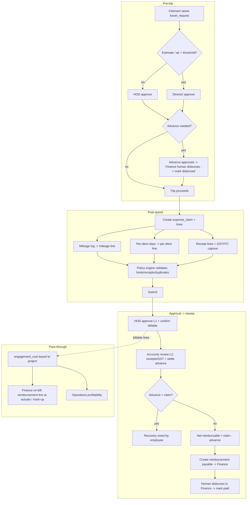
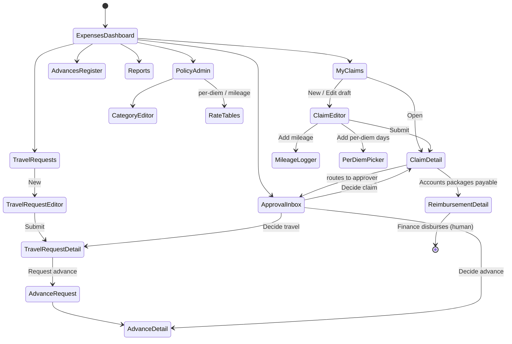
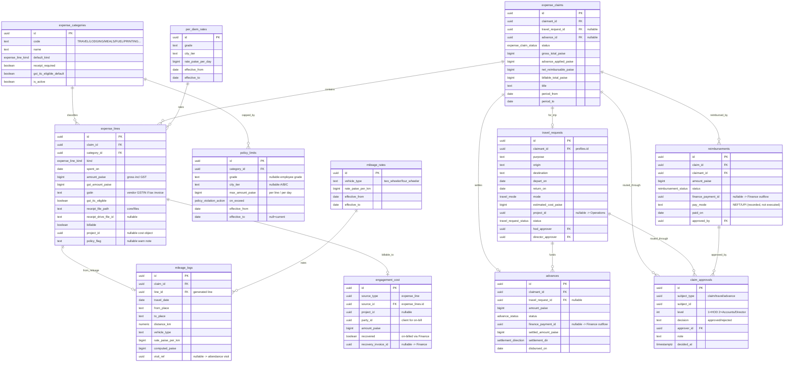
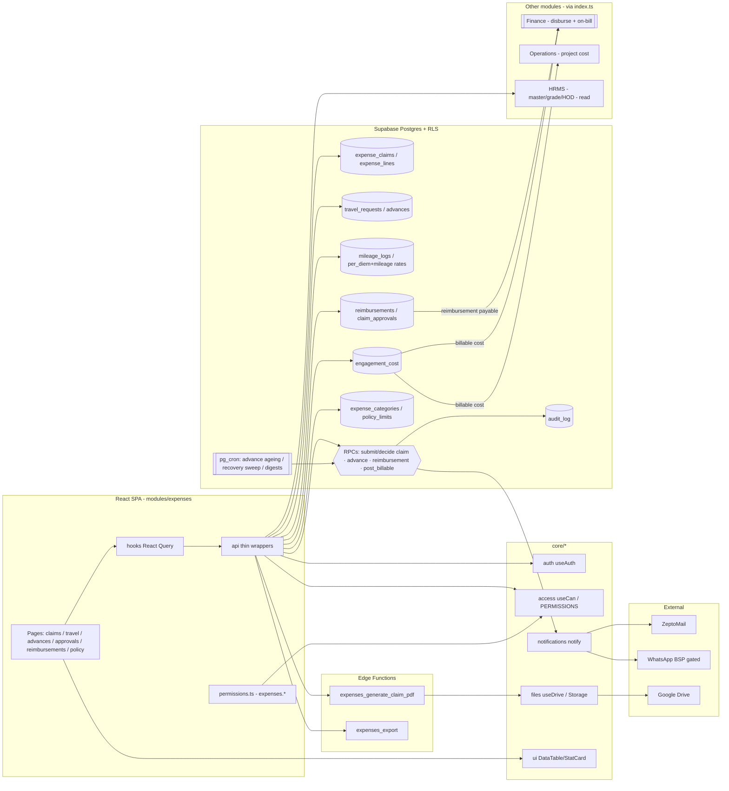

# Module Design — Expenses & Travel (T&E)

**Module key:** `expenses`
**Anchor entities:** Expense claim, Travel request, Advance, Reimbursement
**Primary users:** Executives (field), Managers/HODs, Accounts, Directors
**Status:** Design (Phase D). Follows `00_ENTERPRISE_ARCHITECTURE.md` §6 template verbatim.
**Money:** All amounts stored as **`bigint` paise** (₹1 = 100 paise), matching existing `payments`/`projects`. `formatRupees` renders. Timezone `Asia/Kolkata` (IST).

> **Scope v2.0:** Expenses & Travel is a **shared sub-domain of HRMS + Finance**, not a standalone top-level module. Employee-facing claims/travel = HRMS; reimbursement/GL/on-billing = Finance.

> Grounding: **Consultancy field executives** do geofenced FSSAI/nutraceutical site visits around Punjab/tri-city and beyond, generating travel and out-of-pocket spend — some of it **client-billable pass-through** attributable to a specific project engagement. This module closes a **validated major gap**: today reimbursements are tracked on WhatsApp/Excel. HRMS explicitly excludes reimbursements; Finance books only vendor bills. T&E owns the employee-facing claim/advance/approval surface and hands **money movement to Finance** (human-executed) and **billable cost to the engagement** (Operations profitability).

---

## 1. Purpose & scope

**Business capability.** The system of record for what employees spend and what it costs to send them somewhere: expense claims (categorised, receipt-backed, per-diem, mileage for field visits), travel requests and cash advances (tied to a specific project trip), a manager/HOD → accounts approval chain, reimbursement handoff to Finance for disbursement, **billable-to-client pass-through** so recoverable spend flows into engagement cost and can be on-billed, and the policy/GST layer (category limits, GST input-tax-credit capture where the receipt is a valid tax invoice).

**Who uses it.**
- **Executive / Auditor (claimant)** — self-service: raise travel requests, request advances, file expense claims with receipts, log mileage for field visits, track reimbursement status.
- **Manager / HOD** — first-level approval of their team's travel requests, advances, and claims; policy-limit visibility; marks/confirms billable attribution.
- **Accounts** — second-level review, policy/GST validation, advance settlement, prepares the reimbursement batch for **human** disbursement in Finance; reconciles advances against claims.
- **Directors / super_admin** — policy configuration, high-value approval gate, org-wide T&E spend and billable-recovery reporting.
- **Other modules** — Operations (project = cost object), Finance (reimbursement disbursement + billable on-bill), HRMS (employee master, HOD graph — read-only).

**What it explicitly does NOT do.**
- **Does not move money.** No auto-payout, bank transfer, or UPI initiated here. A reimbursement is *prepared and approved*, then **executed by a human** in the Finance/bank surface (per platform safety rules). T&E emits the payable; Finance disburses and books it.
- **Not vendor AP.** Third-party vendor bills (labs, printers, sub-consultants) remain **Finance `vendor_bills`**. T&E is strictly **employee** out-of-pocket + advances. A billable employee expense *feeds* engagement cost the same way a billable vendor bill does, but it is a distinct source.
- **Not payroll.** Per-diem and mileage reimbursements are **not** salary and never enter the HRMS payroll run (HRMS §1 excludes reimbursements). They settle through Finance as reimbursements, not through payslips.
- **Not the invoicing/on-bill engine.** T&E marks an expense `billable` and attributes it to a project/engagement; **Finance** decides how it appears on the client invoice (reimbursement line at actuals, or with agreed mark-up) — see `finance.md` §2 pass-through.
- **Not statutory GST filing.** T&E captures GST on expense receipts and flags ITC eligibility; the ITC actually claimed flows to Finance/GSTR inputs. Filing happens in the CA tool.
- **Not the geofence/punch engine.** Field-visit location comes from the existing attendance geo-capture; T&E references a visit, it does not re-implement geofencing.

---

## 2. Business workflow

Three interlocking flows: **travel (plan → advance → trip)**, **claim (spend → approve → reimburse)**, and **billable pass-through (mark → attribute → on-bill via Finance)**.

### 2.1 Travel request & advance (pre-trip)
1. Claimant raises a **travel request** (`travel_requests`): purpose, from/to, dates, mode (road/rail/air), estimated cost, and the linked **project** (optional) so a billable trip is provably tied to an engagement.
2. Request routes to **HOD** (level 1). High estimate or air travel escalates to **Director** (level 2) per policy threshold.
3. On approval, claimant may request a **cash/UPI advance** (`advances`) against the trip. Advance is approved by HOD/Accounts, then **disbursed by a human via Finance** (T&E records the advance as `disbursed` once Finance confirms — it never pays).
4. Trip happens. Field visits captured against the request (mileage, per-diem days).

### 2.2 Expense claim (post-spend)
1. Claimant creates an **expense claim** (`expense_claims`) — a container for a trip or a period — and adds **lines** (`expense_lines`): each line has a **category** (`expense_categories`), amount (paise), date, receipt file (via `core/files`), GST fields, and optional **billable** flag + cost object.
2. Special line kinds computed, not hand-typed:
   - **Mileage** (`mileage_logs`): distance (km) × category rate (paise/km) for own-vehicle field travel → generates a mileage expense line.
   - **Per-diem**: eligible days × applicable per-diem rate (grade/city-tier) → generates a per-diem line (typically no receipt, policy-capped).
3. Claim links to the originating `travel_request_id` (if any) and to any `advance_id` to be settled.
4. **Policy engine** validates each line at submit: category limit, receipt-required, per-diem cap, duplicate-receipt guard, date within trip window. Violations → block or soft-flag (policy-configurable).
5. Claimant **submits** → status `submitted`.

### 2.3 Approval chain → reimbursement (human-executed)
1. **HOD approves/rejects** (level 1) — sees policy flags, confirms billable attribution.
2. **Accounts reviews** (level 2) — validates receipts, GST/ITC eligibility, **settles the advance** (claim total − advance = net reimbursable; if advance > claim, claimant **owes a recovery**), then marks the claim `approved`.
3. Approved net reimbursable is packaged into a **reimbursement** (`reimbursements`) — a payable handed to **Finance**. Finance disburses (NEFT/UPI) **by a human** and confirms; T&E flips reimbursement → `paid`. **T&E itself never transfers funds.**
4. **Billable lines** (independently of who is reimbursed) post to **engagement cost**: each billable line becomes an `engagement_cost` row keyed to its project so Operations profitability sees it, and Finance can raise a reimbursement/on-bill line to the client (at actuals or agreed mark-up).

---

## 3. Screen flow

**Screen inventory**

| Route | Screen | Who | Purpose |
|---|---|---|---|
| `/expenses` | T&E dashboard | all | My spend, pending approvals, advances outstanding, billable recovery |
| `/expenses/claims` | My claims | claimant | List/filter own claims + status |
| `/expenses/claims/new` | Claim editor | claimant | Add lines, receipts, categories, billable flags |
| `/expenses/claims/:id` | Claim detail | claimant, approvers | Lines, policy flags, timeline, decide |
| `/expenses/claims/:id/mileage` | Mileage logger | claimant | Log km per field visit → mileage line |
| `/expenses/claims/:id/per-diem` | Per-diem picker | claimant | Select eligible days/city-tier → per-diem line |
| `/expenses/travel` | Travel requests | claimant, approvers | List trips + approval status |
| `/expenses/travel/new` | Travel request editor | claimant | Purpose, route, dates, mode, link project |
| `/expenses/travel/:id` | Travel request detail | claimant, approvers | Estimate, approve/reject, request advance |
| `/expenses/advances` | Advances register | claimant, accounts | Outstanding/settled advances |
| `/expenses/advances/:id` | Advance detail | claimant, accounts | Disbursement + settlement against claim |
| `/expenses/approvals` | Approval inbox | HOD, accounts, director | Unified queue: claims, travel, advances |
| `/expenses/reimbursements/:id` | Reimbursement detail | accounts, director | Payable batch → Finance handoff, mark paid |
| `/expenses/reports` | Reports hub | accounts, director | Spend, billable recovery, advances, GST/ITC |
| `/expenses/policy` | Policy admin | director, super_admin | Categories, per-diem & mileage rate tables, limits |

---

## 4. Database design

Schema: `expenses` (logical). Every table: `bigint` money in **paise**, `created_at/updated_at`, `created_by`, **RLS on** using the existing `has_role()` / `auth_role()` pattern. The cost object references **Operations** (`project_id`) by id (loose FK; the anchor table owns it). Reimbursement payables and billable cost are read by **Finance**.

**New enums**
- `expense_claim_status`: `draft, submitted, hod_approved, accounts_approved, approved, rejected, reimbursed, cancelled`.
- `travel_request_status`: `draft, submitted, hod_approved, director_approved, approved, rejected, cancelled, completed`.
- `advance_status`: `requested, approved, disbursed, partially_settled, settled, recovered, cancelled`.
- `reimbursement_status`: `pending, queued, paid, failed, cancelled` (`paid` set only after human Finance disbursement confirmation).
- `expense_line_kind`: `receipt, per_diem, mileage`.
- `travel_mode`: `road, rail, air, bus, taxi, own_vehicle, other`.
- `policy_violation_action`: `block, warn, none`.
- `settlement_direction`: `reimburse_employee, recover_from_employee`.

**Expand-contract notes**
- New schema only — **no destructive change** to `payments`/`projects`. Money is `bigint` paise from day one (matches existing `payments.amount` convention), so no rupee↔paise migration is needed here.
- New `notification_type` enum values are **appended** (never reordered/removed).
- **Finance seam:** a reimbursement is exposed to Finance as an **outflow payable**; Finance may later add a nullable `source_type='reimbursement'` / `source_id` on its `ledger_entries` (its own expand-contract) — T&E does not write Finance tables.
- **Billable seam:** `engagement_cost` is the single additive contract Operations/Finance read for profitability; adding it does not touch their existing columns.
- Cost-object column (`project_id`) is **nullable** — an internal (non-billable, non-project) expense is valid.

**RLS intent per table** — data scope is **own / team / all**: claimants see **own** rows; HODs see their **team** (via `is_hod_of(claimant)` helper against `profiles.department`/`hod_email`); accounts/director/super_admin see **all**.

| Table | Select | Insert / Update / Delete |
|---|---|---|
| `expense_categories`, `per_diem_rates`, `mileage_rates`, `policy_limits` | any authenticated (needed to compute/display) | `expenses.policy.manage` (director/super_admin) |
| `travel_requests` | own OR team (HOD) OR `accounts/director/super_admin` | insert: self; status transitions via RPC guarded by role |
| `advances` | own OR team (HOD) OR `accounts/director` | insert: self; approve/disburse via RPC (accounts/HOD); Finance link set by RPC |
| `expense_claims` | own OR team (HOD) OR `accounts/director/super_admin` | insert/edit draft: self; transitions via RPC by role |
| `expense_lines`, `mileage_logs` | follows parent claim | self while claim `draft/rejected`; locked once `submitted` (edits via new revision) |
| `claim_approvals` | own subject OR approver OR `accounts/director` | inserted only by decision RPC (SECURITY DEFINER) |
| `reimbursements` | own OR `accounts/director/super_admin` | created/updated by `accounts` RPC; `paid` set only on Finance confirmation |
| `engagement_cost` | `accounts/director` + originating Operations read own project rows | written only by SECURITY DEFINER on billable approval; `recovered`/`recovery_invoice_id` set by Finance |

---

## 5. API design

Module `api/*` are thin typed Supabase wrappers; hooks wrap them in React Query (`['expenses', entity, ...params]`, staleTime 60s). Anything that enforces invariants — policy validation, advance settlement, approval transitions, reimbursement payable creation, billable posting — is a **SECURITY DEFINER RPC / Edge Function**, permission-checked server-side.

**Data-access functions (`modules/expenses/api/`)**

| Function | Inputs | Output | Authz |
|---|---|---|---|
| `listMyClaims(filter)` | status, period | `ExpenseClaim[]` | self |
| `getClaim(id)` | id | `Claim + lines + approvals` | own / team / `expenses.claim.review` |
| `saveDraftClaim(payload)` | header + lines | `ExpenseClaim` | self (`expenses.claim.create`) |
| `listTravelRequests(filter)` | scope, status | `TravelRequest[]` | scoped by role |
| `getTravelRequest(id)` | id | `TravelRequest` | own / team / accounts |
| `listAdvances(filter)` | scope, status | `Advance[]` | own / team / accounts |
| `listApprovalQueue(scope)` | claim/travel/advance | mixed queue | `expenses.*.approve` |
| `getRateTables(asOf)` | date | per-diem + mileage rates | any authenticated |
| `listReimbursements(filter)` | status, period | `Reimbursement[]` | `expenses.reimbursement.view` |
| `getEngagementSpend(costObject)` | project id | billable spend rollup | `expenses.report.view` + owning module |

**RPCs / Edge Functions (authoritative)**

| Name | Kind | Inputs | Output | Authz (in fn) |
|---|---|---|---|---|
| `expenses_submit_claim` | RPC (definer) | claim_id | claim (validated) | self; runs policy engine (limits/receipts/duplicates), computes totals |
| `expenses_decide_claim` | RPC (definer) | claim_id, decision, level | claim | HOD (L1) / accounts (L2); settles advance atomically; writes `claim_approvals` |
| `expenses_add_mileage` | RPC (definer) | claim_id, from,to,km,vehicle,date | line | self; rate × km → line, immutable rate snapshot |
| `expenses_add_per_diem` | RPC (definer) | claim_id, days[], city_tier | line | self; grade/tier rate × days, cap-checked |
| `expenses_submit_travel` | RPC (definer) | travel payload | request | self; routes L1/L2 by estimate/air threshold |
| `expenses_decide_travel` | RPC (definer) | request_id, decision, level | request | HOD/director |
| `expenses_request_advance` | RPC (definer) | travel_id, amount | advance | self; ≤ policy % of estimate |
| `expenses_decide_advance` | RPC (definer) | advance_id, decision | advance | HOD/accounts |
| `expenses_mark_advance_disbursed` | RPC (definer) | advance_id, finance_payment_id | advance | accounts, **after human Finance disbursement** |
| `expenses_create_reimbursement` | RPC (definer) | claim_id | reimbursement (pending) | accounts; only from `approved` claim; net-of-advance |
| `expenses_mark_reimbursement_paid` | RPC (definer) | reimbursement_id, finance_payment_id | reimbursement (paid) | accounts, **after human Finance disbursement** |
| `expenses_post_billable` | RPC (definer) | claim_id | engagement_cost rows | fired on L1 approve; posts billable lines to cost objects |
| `expenses_generate_claim_pdf` | Edge Function | claim_id | pdf path | renders claim voucher + receipts, stores in `expense-docs` |
| `expenses_export` | Edge Function | report, filters | CSV/XLSX | `expenses.report.export`; heavy exports async |

All async wrapped in try/catch; user-facing errors via `toast()`; every state change writes `audit_log` (who/what/when/before/after). **No RPC transfers funds** — disbursement RPCs only *record* a Finance-confirmed payment id.

---

## 6. Permissions

Namespace `expenses.<entity>.<action>`. Aggregated into `PERMISSIONS` by the registry; every mutation guarded by RLS (authoritative) + `useCan()` (affordance). **Data scope** column: `self` = own rows only; `team` = HOD sees their department; `all` = org-wide.

| Permission key | super_admin | director | accounts | manager (HOD) | executive | auditor | Data scope |
|---|:--:|:--:|:--:|:--:|:--:|:--:|---|
| `expenses.dashboard.view` | ✓ | ✓ | ✓ | ✓ | ✓ | ✓ | self/team/all by role |
| `expenses.claim.create` | self | self | self | self | self | self | self |
| `expenses.claim.view` | all | all | all | team | self | self | own/team/all |
| `expenses.claim.review` | ✓ | ✓ | ✓ | team | — | — | team/all |
| `expenses.claim.approve.hod` | ✓ | ✓ | — | team | — | — | team |
| `expenses.claim.approve.accounts` | ✓ | ✓ | ✓ | — | — | — | all |
| `expenses.travel.create` | self | self | self | self | self | self | self |
| `expenses.travel.approve.hod` | ✓ | ✓ | — | team | — | — | team |
| `expenses.travel.approve.director` | ✓ | ✓ | — | — | — | — | all |
| `expenses.advance.request` | self | self | self | self | self | self | self |
| `expenses.advance.approve` | ✓ | ✓ | ✓ | team | — | — | team/all |
| `expenses.advance.settle` | ✓ | ✓ | ✓ | — | — | — | all |
| `expenses.reimbursement.view` | ✓ | ✓ | ✓ | — | — | — | all |
| `expenses.reimbursement.prepare` | ✓ | ✓ | ✓ | — | — | — | all |
| `expenses.reimbursement.markpaid` | ✓ | ✓ | ✓ | — | — | — | all |
| `expenses.billable.attribute` | ✓ | ✓ | ✓ | team | self | self | own line / team |
| `expenses.report.view` | ✓ | ✓ | ✓ | team | — | — | team/all |
| `expenses.report.export` | ✓ | ✓ | ✓ | — | — | — | all |
| `expenses.policy.manage` | ✓ | ✓ | — | — | — | — | all |

RLS mapping: each key maps to the `has_role()`/`has_permission()` predicate in §4's RLS table. `team` is enforced by the `is_hod_of(target_user)` helper (matches `profiles.department`/`hod_email`) inside RLS/RPC. Reimbursement `markpaid` and advance `disbursed` require a Finance-confirmed `finance_payment_id` — there is no code path that pays.

---

## 7. Dashboard

T&E dashboard (`/expenses`) widgets and sources:

| Widget | Metric | Source |
|---|---|---|
| My pending reimbursement | Σ `net_reimbursable_paise` of my `approved`/`reimbursed` claims not yet paid | `expense_claims` (self) |
| Approvals awaiting me | Count of claims/travel/advances in my queue | `claim_approvals` scope + statuses |
| Advances outstanding | Σ `amount_paise − settled_amount_paise` per employee | `advances` where status in (disbursed, partially_settled) |
| Billable recovery pending | Σ `engagement_cost.amount_paise` where `recovered=false` | `engagement_cost` |
| Spend this month (by category) | Σ `expense_lines.amount_paise` grouped | `expense_lines` (period) |
| Policy exceptions | Claims with `policy_flag` lines needing attention | `expense_lines` |
| GST ITC capturable | Σ `gst_amount_paise` where `gst_itc_eligible=true`, not yet in Finance | `expense_lines` |
| Travel in progress | Approved trips with dates spanning today | `travel_requests` |
| Reimbursements to disburse | Count/amount `pending`/`queued` for Finance | `reimbursements` |

Directors/accounts additionally see **T&E spend vs budget** and **billable recovery rate** (recovered ÷ billable). Self-service view (field executive) is scoped to own claims, advances, and reimbursement status.

---

## 8. Reports

| Report | Columns | Filters | Export |
|---|---|---|---|
| Expense claim register | claim, claimant, period, gross, advance applied, net, status | period, department, status | CSV, PDF |
| Category spend analysis | category, count, total, avg, over-limit count | period, department, category | XLSX |
| Advances outstanding | employee, advance, disbursed, settled, balance, age | status, employee | CSV, PDF |
| Reimbursement batch | claimant, claim, net, pay mode, paid_on, Finance ref | period, status | CSV |
| Billable recovery (T&E) | project, party, billable spend, recovered, outstanding | cost object, recovered | CSV, PDF |
| Per-diem & mileage | employee, days/km, rate, computed, trip | period, employee | CSV |
| GST / ITC on expenses | line, GSTIN, gross, GST, ITC-eligible | period, eligibility | CSV |
| Travel requests log | request, route, mode, estimate, actual (claim), variance | period, mode, status | XLSX |
| Policy exceptions | claim, line, category, limit, breach, action | period, action | CSV |

Exports go through `core/files` / `expenses.report.export`; heavy exports run as Edge Functions; every export writes an `audit_log` line (who/when/scope) — no PII in URLs.

---

## 9. Notifications

Via `core/notifications` `notify()` only (email = ZeptoMail, WhatsApp = BSP gated off, in-app always). **New `notification_type` values appended:** `expense_claim_submitted, expense_claim_hod_decided, expense_claim_accounts_decided, expense_reimbursement_ready, expense_reimbursement_paid, travel_request_submitted, travel_request_decided, advance_requested, advance_decided, advance_disbursed, advance_recovery_due, expense_policy_flag, billable_recovery_pending`.

| Event | notification_type | Recipients | Channels |
|---|---|---|---|
| Claim submitted | `expense_claim_submitted` | HOD (of claimant) | in-app, email |
| HOD decides claim | `expense_claim_hod_decided` | claimant + accounts | in-app, email |
| Accounts decides claim | `expense_claim_accounts_decided` | claimant | in-app, email |
| Reimbursement prepared | `expense_reimbursement_ready` | accounts, director | in-app, email |
| Reimbursement paid (human-confirmed) | `expense_reimbursement_paid` | claimant | in-app, email, WhatsApp(gated) |
| Travel request submitted | `travel_request_submitted` | HOD (+ director if escalated) | in-app, email |
| Travel decided | `travel_request_decided` | claimant | in-app, email |
| Advance requested | `advance_requested` | HOD/accounts | in-app |
| Advance decided | `advance_decided` | claimant | in-app, email |
| Advance disbursed | `advance_disbursed` | claimant | in-app, email |
| Unsettled advance ageing | `advance_recovery_due` | claimant, accounts | in-app, email |
| Policy limit breach on submit | `expense_policy_flag` | claimant (+ HOD) | in-app |
| Billable spend awaiting on-bill | `billable_recovery_pending` | accounts | in-app |

Delivery honors `reminder_settings`/`app_settings` flags so staging stays sandboxed.

---

## 10. Automations

Scheduled = `pg_cron` → Edge Function (gated by settings); event = DB trigger → `notify()` / `audit_log`.

| Job | Type | Cadence / trigger | Action |
|---|---|---|---|
| Advance-ageing sweep | pg_cron | daily 09:00 IST | Flag advances `disbursed`/`partially_settled` older than N days → `advance_recovery_due` |
| Unsubmitted-claim reminder | pg_cron | weekly Mon 09:30 IST | Nudge claimants with `draft` claims against a completed trip |
| Billable-recovery sweep | pg_cron | weekly Mon 09:45 IST | List `engagement_cost` `recovered=false` → notify accounts / Finance |
| Reimbursement-pending digest | pg_cron | daily 10:00 IST | Digest of `pending`/`queued` reimbursements awaiting human disbursement |
| Month-close T&E snapshot | pg_cron | 1st of month 01:30 IST | Snapshot spend by category/cost-object for prior month |
| Policy validation | trigger before submit | on `expenses_submit_claim` | Enforce limits/receipts/duplicate-receipt/date-window; set `policy_flag` or block |
| Totals recompute | trigger on `expense_lines` change | event | Recompute claim `gross/advance_applied/net/billable` totals |
| Billable post | trigger on L1 approve | on `expenses_decide_claim` (approved) | Write/refresh `engagement_cost` rows for billable lines |
| Advance-settlement guard | trigger on `expenses_create_reimbursement` | event | Ensure advance netted; set `settlement_direction`; block double-settle |
| Audit trail | trigger on all T&E state tables | event | Write who/what/when/before/after to `audit_log` |
| Claim PDF render | event (on accounts approve) | on `approved` | Render voucher + receipts, store, notify |

---

## 11. Integrations

| External / internal system | Boundary / adapter | Use |
|---|---|---|
| **Finance & Accounts module** | internal public API (`financeModule` index) | Reimbursement = **outflow payable** Finance disburses (human) + books; billable `engagement_cost` → reimbursement/on-bill line at actuals or mark-up; GST ITC on expenses feeds Finance input-credit. **T&E never pays.** |
| **Operations module** | `operationsModule` index | `project_id` cost object; billable spend feeds project profitability |
| **HRMS module** | `hrmsModule` index (read-only) | Employee master, grade (per-diem/mileage tier), department/`hod_email` (approval graph). **No payroll coupling** — reimbursements never enter payslips |
| **Attendance (existing)** | reference id `visit_ref` | Field-visit location/mileage origin; geofence engine reused, not re-implemented |
| **ZeptoMail** | `core/notifications` email dispatch | Claim/travel/advance/reimbursement emails |
| **WhatsApp BSP (AiSensy)** | `core/notifications` (gated flag) | Reimbursement-paid / approval alerts (when number live) |
| **Google Drive** | `core/files` `useDrive()` (`disableConversionToGoogleType:true`) | Long-term receipt/voucher archive (`receipt_drive_file_id`) |
| **Supabase Storage** | `core/files` bucket `expense-docs` | Receipt uploads, claim voucher PDFs |
| **Bank / Razorpay** | **not direct** — via Finance | Actual disbursement; T&E only records a Finance-confirmed `finance_payment_id` |
| **GST portal (ITC)** | **export only** via Finance | ITC-eligible expense GST flows to Finance GSTR inputs; no direct filing |

Boundary rule: T&E calls Core services or another module's `index.ts` only — never another module's internals or an external SDK directly.

---

## 12. Future scalability

- **10× claims/travel (500+ staff):** partition `expense_lines`/`mileage_logs` by month; index `expense_claims(claimant_id, status)`, `engagement_cost(project_id)`, `advances(status, claimant_id)`. Claim-PDF and export generation are Edge-Function/async so heavy months never block UI.
- **Multi-entity:** should a second legal employer/biller be added later, add nullable `legal_entity_id` (expand) to `expense_claims`, `advances`, `reimbursements`, `engagement_cost` so reimbursements are disbursed per entity and billable recovery is on-billed by the correct Finance `legal_entities` seller — matches HRMS/Finance multi-entity seam.
- **Configurable policy engine:** per-diem/mileage/limit rates already live in versioned effective-dated tables (`per_diem_rates`, `mileage_rates`, `policy_limits`) — rate/policy changes are **data, not code**. A future rules DSL (e.g. "air only ≥ 500 km") slots behind the same `expenses_submit_claim` validation hook.
- **Receipt OCR / auto-categorise:** an Edge Function can pre-fill `expense_lines` (amount, GSTIN, category) from a receipt image via `core/files`; the module surface is unchanged.
- **Corporate cards / travel-desk feed:** a future adapter can ingest card statements or a TMV booking feed as draft lines/advances behind the same claim model.
- **Data volume:** receipt images/voucher PDFs archived to Drive after 24 months; settled advances and reimbursed claims cold-archived after N years while `engagement_cost` rollups persist for profitability history.

---

## 13. Architecture diagram

---

**Cross-module dependencies:** **Finance & Accounts** (disburses reimbursements — human-executed — and on-bills billable `engagement_cost`; receives GST/ITC on expenses; T&E never moves money), **Operations** (`project_id` cost object for field-executive spend + profitability), **HRMS** (read-only: employee master, grade for per-diem/mileage tier, `hod_email`/department for the approval graph — no payroll coupling; reimbursements never enter payslips), and **Core** (access, notifications, files, ui). Attendance is referenced loosely (`visit_ref`) for field-visit mileage origin.

---

## Changelog

- **Scope v2.0** — reframed Expenses & Travel as a **shared HRMS + Finance sub-domain** (not a standalone top-level module) via a prominent top note. Removed the `certification_audit_id` travel/cost-object linkage and all certification-body / CB-auditor references (grounding, users, schema columns in `travel_requests`/`expense_lines`/`engagement_cost`, RLS row, "Auditor travel by engagement" report, Certification integration, diagram node). Retained the Operations `project_id` cost object and the billable pass-through.
