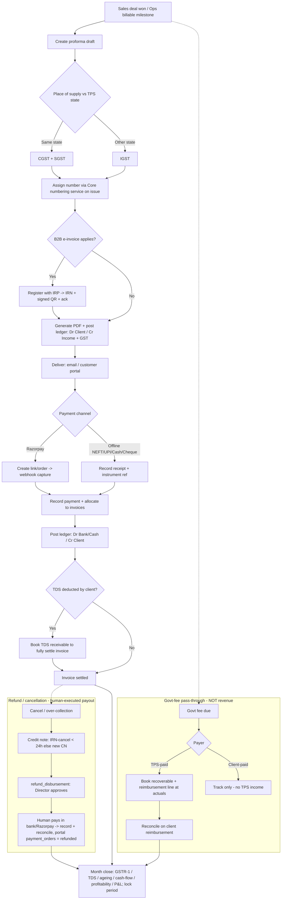
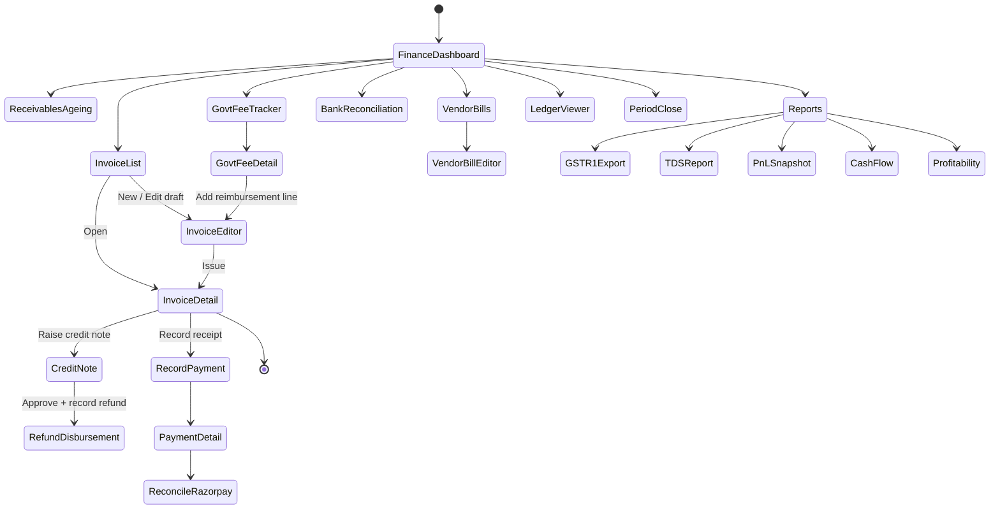
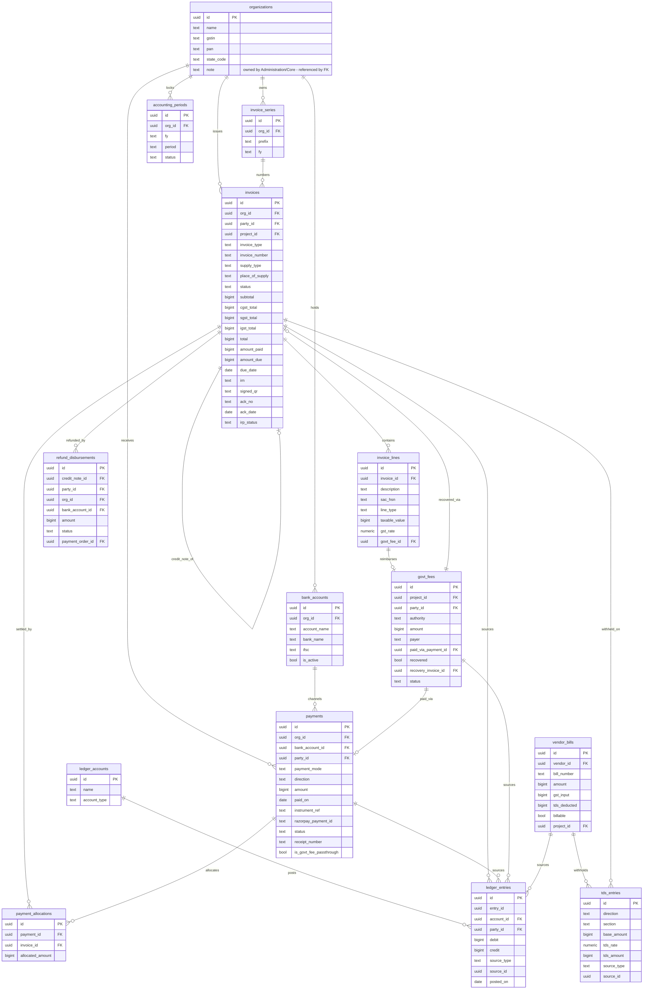

# Module Design — Finance & Accounts

**Module key:** `finance`
**Anchor entities:** Invoice, Payment, Govt-fee, Ledger

> **Billing engine (Wave-2 decision):** GST invoicing/billing is issued through **GetSwipe** via a
> swappable **Billing Provider Adapter** — the ERP never talks to GetSwipe directly. Finance business
> logic depends only on the internal **Invoice Service**; GetSwipe (and any future Zoho/Tally/Busy) is
> one replaceable adapter behind it. The ERP remains the system of record; GetSwipe is the billing
> engine (serial no., IRN/e-invoice, QR, PDF). Full design + GetSwipe API research + sync strategy +
> limitations: **[`finance-billing-adapter.md`](finance-billing-adapter.md)**. (Razorpay remains the
> payment-collection gateway — a separate concern from invoice issuance.)
**Primary users:** Accounts, Directors
**Status:** Design (Phase D). Follows `00_ENTERPRISE_ARCHITECTURE.md` §6 template.
**Absorbs:** existing `payments` table + `projects.quoted_amount / paid_amount / payment_status` + live Razorpay integration.

> **Scope v2.0: Certification-Body references removed (separate platform).**

---

## 1. Purpose & scope

**Business capability.** The financial system of record for TPS Xperts Group (consultancy). It turns delivered work into GST-compliant tax invoices, records money received against them, tracks government fees paid on behalf of clients as a pass-through (not revenue), keeps a simple double-entry ledger per client, captures vendor bills and expenses, and produces the statutory (GSTR-1, TDS) and management (P&L snapshot, receivables ageing, collections) numbers the Directors run the business on.

**Who uses it.**
- **Accounts** — raise invoices, record receipts, reconcile Razorpay, enter vendor bills/expenses, track govt-fee reimbursements, prepare GST/TDS exports.
- **Directors** — approve credit notes/write-offs, view P&L snapshot, outstanding, collections; sign off ageing actions.
- **Other modules (read/write via events)** — Sales (a won deal/quotation seeds a proforma), Operations (a project's `quoted_amount/paid_amount/payment_status` is derived here), Regulatory (govt fees originate from its workflows), Vendor Portal (vendor bills), Customer Portal (client sees own invoices/receipts).

**What it explicitly does NOT do.**
- **Not a full accrual accounting/ERP suite.** Double-entry here is a *client-ledger + control-account* model for cash position, receivables and pass-through clarity — it is not a GAAP general ledger with trial balance close, depreciation schedules, or inventory. Statutory filing itself happens in the CA's tool (Tally/portal); this module *exports data* (GSTR-1, TDS) and does not file returns.
- **Not payroll.** Salary, PF/ESI, professional tax = HRMS module. Finance only receives a payroll *expense journal* summary.
- **Does not move money.** No auto-debit, no payouts, no bank transfers initiated here. Razorpay is read/reconcile + hosted collection links only; actual bank ops are done by humans in the bank/Razorpay dashboard (per platform safety rules — no fund transfers executed by the system).
- **Not the quotation builder.** Quotations/deals live in Sales; Finance consumes an approved quotation to pre-fill a proforma/invoice.

---

## 2. Business workflow

TPS is a **services firm** (SAC 9983/9985-type professional, technical and regulatory consulting). Two money flows dominate:

**A. Fee revenue (our service fee).** Client engages TPS → work is delivered by Operations/Regulatory → Accounts raises a GST tax invoice → client pays (NEFT/UPI/cheque/cash/Razorpay) → receipt issued → ledger settled → receivable cleared.

**B. Government-fee pass-through (NOT revenue).** Many engagements require statutory fees paid to authorities (FSSAI/FoSCoS licence fees, testing-lab charges). Two sub-cases:
- **TPS-paid** pass-through — TPS pays the authority first from its own funds, then **reimburses itself** by recovering the exact amount from the client. This is a *balance-sheet* movement (an advance/recoverable), **never** booked to income, and generally invoiced as a **pure reimbursement / "reimbursement of expenses"** line with **no GST margin** (recovered at actuals as a disbursement).
- **Client-paid** pass-through — the client pays the authority directly (or hands cash to TPS strictly to remit onward). TPS only records it for tracking/receipt completeness; it never touches TPS income.

### End-to-end steps (fee cycle)

1. **Trigger.** Sales marks a deal *won* / Operations reaches a billable milestone → a **proforma invoice** (draft) is created, pre-filled from the project/quotation (party, place of supply, line items, HSN/SAC).
2. **Tax determination.** Place of supply vs TPS's state (Punjab/Chandigarh registration) decides **intra-state → CGST+SGST** or **inter-state → IGST**. GST rate per SAC applied. Reverse-charge/exempt flags handled per line.
3. **Numbering.** On *issue* (not on draft), the invoice is stamped from the correct **series** (e.g. `TPSX/25-26/0007`) — gap-free, per financial year, per legal entity.
4. **Issue & deliver.** On issue, if e-invoicing applies (B2B and turnover threshold met), the invoice is registered with the **IRP (NIC/GSP)** which returns an **IRN, signed QR and ack no/date** (`irp_status` → `registered`); the QR is embedded on the PDF. Invoice PDF generated (Edge Function), stored, emailed via ZeptoMail / surfaced in Customer Portal. Ledger posts: **Dr Client (receivable) / Cr Fee income + Cr GST output**. An **issued invoice is immutable**; an **e-way bill** is generated only where physical goods move (rare for TPS services). If an issued/registered invoice is wrong: **cancel the IRN only within the 24-hour IRP window**; after that, correct via **credit note**.
5. **Collection.** Client pays. If Razorpay: a collection link/order is created; webhook confirms capture. If offline: Accounts records the receipt with mode (NEFT/UPI/Cash/Cheque) and UTR/instrument ref.
6. **Receipt & allocation.** A **payment** is recorded and *allocated* to one or more invoices (partial/advance supported). Ledger posts **Dr Bank/Cash / Cr Client**. `projects.paid_amount / payment_status` are recomputed from allocations.
7. **Reconciliation.** Razorpay settlements matched to bank credit and to receipts; TDS deducted by client is booked as **TDS receivable** so the invoice can be fully squared even though cash received is net of TDS.
8. **Govt-fee handling (parallel).** When a govt fee is due, a `govt_fees` record is raised (payer = client-paid | TPS-paid). TPS-paid → recorded as recoverable, then added as a **reimbursement line** on an invoice (or a separate reimbursement invoice) to recover at actuals. Reconciled when client reimburses.
9. **Vendor/expense side.** Vendor bills (labs, printers, sub-consultants) and internal expenses are booked; those attributable to a client engagement can be marked **billable/pass-through** and flow back into step 8.
10. **Refund / cancellation (when work is cancelled or over-collected).** A cancellation or client refund runs an explicit chain: **credit note** raised against the original invoice (reverses income + GST proportionally, within the IRP window uses IRN-cancel, otherwise a fresh credit-note IRN) → a **`refund_disbursements`** record is created and **Director-approved** → the actual pay-out is **executed by a human** in the bank/Razorpay dashboard and then recorded/reconciled here (the system **never** initiates the transfer). Where the original receipt came through the Customer Portal, the linked `payment_orders` row is flipped to **`refunded`**. Ledger posts: **Dr Fee income + Dr GST output / Cr Client** (credit note), then **Dr Client / Cr Bank** (disbursement).
11. **Period close (light).** Month-end: collections, outstanding ageing, GSTR-1 export (B2B/B2C/CDN), TDS summary, P&L snapshot, cash-flow and engagement-profitability review. The `accounting_periods` row is flipped to **`closed`**, which **blocks any back-dated invoice or ledger post** into that month. Directors review; nothing is *filed* here.



---

## 3. Screen flow



**Screen inventory**

| Route | Screen | Purpose | Primary permission |
|---|---|---|---|
| `/finance` | Finance Dashboard | KPIs, quick actions | `finance.dashboard.view` |
| `/finance/invoices` | Invoice List | Filter/search invoices, ageing status | `finance.invoice.view` |
| `/finance/invoices/new` | Invoice Editor (proforma/draft) | Build line items, tax, HSN/SAC | `finance.invoice.create` |
| `/finance/invoices/:id` | Invoice Detail | View, PDF, issue, allocations, credit note | `finance.invoice.view` |
| `/finance/payments` | Payment List | All receipts, mode, allocation status | `finance.payment.view` |
| `/finance/payments/new` | Record Payment | Record receipt + allocate to invoices | `finance.payment.create` |
| `/finance/payments/:id` | Payment Detail | Receipt PDF, reconciliation link | `finance.payment.view` |
| `/finance/reconcile` | Razorpay Reconciliation | Match settlements ↔ receipts | `finance.payment.reconcile` |
| `/finance/bank-reconcile` | Bank Reconciliation | Import bank statement (CSV) per `bank_account`, match to receipts/payments | `finance.payment.reconcile` |
| `/finance/refunds/:creditNoteId` | Refund Disbursement | Approve + record human-executed refund against a credit note | `finance.refund.approve` |
| `/finance/periods` | Accounting Periods | Open/close months; month-close locks the period | `finance.period.close` |
| `/finance/govt-fees` | Govt-fee Tracker | Client-paid vs TPS-paid, reimbursement status | `finance.govt_fee.view` |
| `/finance/govt-fees/:id` | Govt-fee Detail | Payer, recovery, linked invoice | `finance.govt_fee.view` |
| `/finance/receivables` | Receivables & Ageing | 0-30/31-60/61-90/90+ buckets | `finance.report.view` |
| `/finance/ledgers/:clientId` | Client Ledger | Statement of account, running balance | `finance.ledger.view` |
| `/finance/vendor-bills` | Vendor Bills & Expenses | AP entry, billable flag | `finance.expense.view` |
| `/finance/reports` | Reports hub | GSTR-1, TDS, P&L, collections | `finance.report.view` |

---

## 4. Database design

Schema: `finance` (logical). Every table has `created_at/updated_at`, `created_by`, and RLS enabled.

> **Money unit convention.** All money columns across this module (`invoices`, `invoice_lines`, `payments`, `payment_allocations`, `govt_fees`, `ledger_entries`, `vendor_bills`, `tds_entries`, `bank_accounts`) are stored as **`bigint` in paise** (integer, 1 rupee = 100 paise) — matching the live database, where `payments.amount`, `projects.quoted_amount` and `projects.paid_amount` are already `bigint` paise and the app divides by 100 to display rupees. **Never** use `numeric`/float rupees for money — mixing units is a 100× data-corruption bug. `formatRupees()` (Core utils) divides by 100 for display; all arithmetic is integer paise.

> **Entity master (single source).** Finance does **not** define its own `legal_entities` master. TPS's legal entity(ies) live in the single **`organizations`** table owned by Administration/Core. Every finance table that needs an entity dimension carries an `org_id` FK → `organizations`. Invoice **numbering** likewise uses the single **Core numbering service** (per-series), not a Finance-local sequence generator — see `invoice_series` note below.

### Key tables

- **`bank_accounts`** — one row per legal entity's bank account (`org_id` → `organizations`, `account_name`, `bank_name`, `account_number` (masked at rest), `ifsc`, `account_type`, `is_active`). Referenced by receipts, refund disbursements, vendor payouts, and bank reconciliation. Bank-statement imports (CSV) are matched against the `bank_account_id` they belong to.
- **`accounting_periods`** — period lock register (`org_id`, `fy`, `period` e.g. `2025-07`, `status` (`open` | `closed`), `closed_by`, `closed_on`). A **closed** period blocks any back-dated invoice issue or `ledger_entries` post with `posted_on` inside it; month-close flips the period to `closed`. Promoted from "future" into v1.
- **`invoices`** — header. `org_id` (→ `organizations`, the issuing legal entity), `party_id` (→ CRM client), `project_id` (nullable → Operations), `invoice_type` (`tax` | `proforma` | `reimbursement` | `credit_note` | `debit_note`), `series_id`, `invoice_number` (null until issued), `place_of_supply` (state code), `supply_type` (`intra` | `inter`), `status`, subtotal, tax totals (cgst/sgst/igst), `round_off`, `total`, `amount_paid`, `amount_due`, `reverse_charge`, `due_date`, `notes`. Money split rendered from lines. **E-invoicing (IRP) fields:** `irn` (64-char Invoice Reference Number, null until registered), `signed_qr` (signed QR payload from IRP), `ack_no`, `ack_date`, `irp_status` (`na` | `pending` | `registered` | `cancelled` | `failed`), `irn_cancel_reason`, `irn_cancelled_on`. Once an invoice is **issued** (numbered) it is immutable; once an **IRN is registered** it may be cancelled only within the **24-hour IRP cancellation window** — after that, corrections are made by **credit note**, never by editing the invoice.
- **`invoice_lines`** — one row per line. `invoice_id`, `description`, `sac_hsn`, `line_type` (`service` | `reimbursement` | `discount`), `qty`, `unit_price`, `taxable_value`, `gst_rate`, `cgst_amt`, `sgst_amt`, `igst_amt`, `govt_fee_id` (nullable → links a reimbursement line to its pass-through record so it is provably at-actuals, no margin).
- **`invoice_series`** — per `org_id` + FY + document class; `prefix`, `fy` (`25-26`), `format`. **Sequence allocation is delegated to the Core numbering service** (single, platform-wide, gap-free, row-locked per series) rather than a Finance-local `next_seq` — Finance passes the series key and receives the next number on issue.
- **`payments`** — **absorbs the existing table** (see expand-contract). Receipt of money. `org_id`, `bank_account_id` (nullable → `bank_accounts`, which account the money landed in / was disbursed from), `party_id`, `payment_mode` (`NEFT`|`UPI`|`Cash`|`Cheque`|`Razorpay`|`Client-paid`|`TPS-paid`), `direction` (`inflow`|`outflow`), `amount`, `paid_on`, `instrument_ref` (UTR/cheque no), `razorpay_payment_id`, `status`, `receipt_number`, `is_govt_fee_passthrough` (bool). NOTE: `Client-paid`/`TPS-paid` values are retained for pass-through remittances that are **not** TPS revenue.
- **`payment_allocations`** — many-to-many receipt↔invoice. `payment_id`, `invoice_id`, `allocated_amount`. Enables partial payments, advances, one payment across many invoices. Advances = payment with unallocated remainder.
- **`govt_fees`** — pass-through register. `project_id`, `party_id`, `authority` (`FSSAI`|`Lab`|`Other`), `purpose`, `amount`, `payer` (`client_paid`|`tps_paid`), `paid_on`, `paid_via_payment_id` (nullable, when TPS-paid → outflow payment), `recovered` (bool), `recovery_invoice_id` (nullable → reimbursement invoice/line), `recovered_amount`, `status`. **Never touches income accounts.**
- **`ledger_accounts`** — chart-of-accounts (light): control accounts (Accounts Receivable, Bank, Cash, GST Output, GST Input, Fee Income, TDS Receivable, **Govt-fee Recoverable (asset)**, Vendor Payable, Expense). `account_type` (`asset`|`liability`|`income`|`expense`|`control`).
- **`ledger_entries`** — double-entry journal lines. `entry_id` (groups a balanced journal), `account_id`, `party_id` (nullable), `debit`, `credit`, `source_type` (`invoice`|`payment`|`govt_fee`|`vendor_bill`|`manual`), `source_id`, `narration`, `posted_on`. Sum(debit)=Sum(credit) per `entry_id` enforced by trigger.
- **`vendor_bills`** — AP. `vendor_id` (→ Vendor Portal), `bill_number`, `bill_date`, `amount`, `gst_input`, `tds_deducted`, `billable` (bool), `project_id`, `party_id` (if pass-through/billable), `status`.
- **`tds_entries`** — both sides: TDS *deducted by clients* on our invoices (receivable, Form 26AS reconciliation) and TDS *we deduct* on vendor bills (payable). `direction`, `section` (194J/194C…), `base_amount`, `tds_rate`, `tds_amount`, `source_type`, `source_id`, `pan`.
- **`credit_notes`** view/subtype handled via `invoices.invoice_type='credit_note'` referencing `original_invoice_id`.
- **`refund_disbursements`** — the money-out leg of a refund/cancellation. `credit_note_id` (→ the credit note that authorises the refund), `party_id`, `org_id`, `bank_account_id` (source account), `amount`, `mode`, `status` (`pending` | `approved` | `disbursed` | `failed`), `payment_order_id` (nullable → Customer Portal `payment_orders`, set when a portal-collected payment is being refunded), `approved_by`, `disbursed_on`, `instrument_ref`. **Disbursement is human-executed** in the bank/Razorpay dashboard — the system records and reconciles it but **never initiates a transfer** (platform safety rule). Approval gated by `finance.refund.approve`.

### ER diagram



### RLS intent per table

| Table | Read | Write |
|---|---|---|
| `organizations` | (Core-owned) all authenticated for display; Finance only reads via FK | Administration/Core, **not** Finance |
| `bank_accounts` | `finance.settings.view` (account_number masked to non-managers) | `finance.settings.manage` |
| `accounting_periods` | `finance.report.view` | `finance.period.close` (director/super-admin); month-close RPC only |
| `invoices`, `invoice_lines` | holders of `finance.invoice.view` **and `auditor` (read-only)**; **clients** see own via Customer Portal policy (`party_id` = their client) | `finance.invoice.*` |
| `invoice_series` | `finance.settings.view` | `finance.settings.manage` only; sequence allocated solely by the Core numbering service inside the issuing RPC (SECURITY DEFINER) |
| `payments`, `payment_allocations` | `finance.payment.view` **and `auditor` (read-only)**; client sees own receipts | `finance.payment.*` |
| `refund_disbursements` | `finance.payment.view` **and `auditor` (read-only)** | `finance.refund.*`; disbursement recorded (not initiated) by Accounts, approved by Director |
| `govt_fees` | `finance.govt_fee.view` **and `auditor` (read-only)**; originating module (Regulatory) may read its own | `finance.govt_fee.*` |
| `ledger_accounts` | `finance.ledger.view` **and `auditor` (read-only)** | `finance.settings.manage` |
| `ledger_entries` | `finance.ledger.view` **and `auditor` (read-only)**; client sees own party rows in portal statement | **no direct client write** — posted only by SECURITY DEFINER functions/triggers |
| `vendor_bills` | `finance.expense.view` **and `auditor` (read-only)**; vendor sees own via Vendor Portal | `finance.expense.*` |
| `tds_entries` | `finance.report.view` **and `auditor` (read-only)** | `finance.payment.*` / `finance.expense.*` |

> **Auditor access.** The internal `auditor` role gets **read-only** access to all finance data and reports (finance is an audited domain — walling it off would defeat internal audit). Auditors hold no write/issue/approve keys and cannot post ledger entries; their reads are covered by a dedicated `finance.audit.read` grant surfaced through the read policies above.

### Expand-contract notes (vs existing `payments`)

The existing `payments` table and `projects.quoted_amount/paid_amount/payment_status` stay live. Migration is **additive-first**:

1. **Expand** — add new nullable columns to `payments` (`org_id` → `organizations`, `bank_account_id`, `direction` default `inflow`, `receipt_number`, `is_govt_fee_passthrough` default false, `party_id`, allocation via new `payment_allocations` table). `payments.amount` **stays `bigint` paise** — no unit change. Existing rows keep working; `payment_mode` enum is *extended* (not replaced) so historical `Client-paid`/`TPS-paid` values remain valid.
2. **Backfill** — set `org_id` = the consultancy `organizations` row for legacy rows; derive `party_id` from `project_id`; create one `payment_allocations` row per legacy payment linking it to its project's (soon-to-be-backfilled) invoice, or leave as on-account advance if no invoice exists yet.
3. **Derive** — `projects.paid_amount / payment_status` become **computed** from `payment_allocations` (via a view or trigger) rather than hand-maintained; a compatibility trigger keeps the old columns in sync during coexistence so Operations V1 keeps reading them.
4. **Contract** — once Operations reads the derived source, retire hand-updates to `projects.paid_amount`. No destructive drop of existing columns until all readers move (per §1.4 of the master doc).

---

## 5. API design

Module `api/*` are thin typed Supabase wrappers; anything that must be atomic, gap-free, or authoritative is an **RPC / Edge Function** (SECURITY DEFINER, permission-checked inside).

**Client `api/*` (React Query hooks over these):**

| Function | Inputs | Output | Authz |
|---|---|---|---|
| `listInvoices(filters)` | status, party, entity, date-range, ageing bucket | `Invoice[]` | `finance.invoice.view` |
| `getInvoice(id)` | id | `Invoice + lines + allocations` | `finance.invoice.view` |
| `saveDraftInvoice(payload)` | header + lines (proforma) | `Invoice` | `finance.invoice.create/edit` |
| `listPayments(filters)` | mode, party, reconciled, date | `Payment[]` | `finance.payment.view` |
| `recordPayment(payload)` | party, entity, mode, amount, allocations[] | `Payment` | `finance.payment.create` |
| `listGovtFees(filters)` | payer, authority, recovered | `GovtFee[]` | `finance.govt_fee.view` |
| `upsertGovtFee(payload)` | project, party, authority, amount, payer | `GovtFee` | `finance.govt_fee.manage` |
| `getClientLedger(partyId, range)` | party, date-range | `LedgerEntry[]` + running balance | `finance.ledger.view` |
| `listVendorBills(filters)` | vendor, billable, status | `VendorBill[]` | `finance.expense.view` |
| `getAgeing(asOf)` | as-of date | buckets by party | `finance.report.view` |

**RPCs / Edge Functions (authoritative):**

| Name | Type | Inputs | Outputs | Notes / authz |
|---|---|---|---|---|
| `finance_issue_invoice` | RPC (SECURITY DEFINER) | `invoice_id` | issued `invoice_number` | Requests the gap-free number from the **Core numbering service** (per series), computes CGST/SGST vs IGST from place-of-supply, **rejects if the target `accounting_periods` month is closed**, posts balanced `ledger_entries` (Dr AR / Cr Income + GST). `finance.invoice.issue`. |
| `finance_register_irn` | Edge Function | `invoice_id` | IRN + signed QR + ack | Calls the **IRP (NIC/GSP) adapter** on issue for eligible B2B invoices; stores `irn`/`signed_qr`/`ack_no`/`ack_date`, sets `irp_status='registered'`; idempotent per invoice. `finance.invoice.issue`. |
| `finance_cancel_irn` | Edge Function | `invoice_id`, reason | cancel ack | Cancels the IRN **only inside the 24-hour IRP window**; sets `irp_status='cancelled'`. Outside the window the call is refused and the UI routes to credit-note instead. `finance.invoice.cancel`. |
| `finance_generate_invoice_pdf` | Edge Function | `invoice_id` | stored PDF path | Renders GST tax-invoice PDF (embeds signed QR when present), saves to `documents` bucket, returns signed URL. |
| `finance_record_payment` | RPC | payment + allocations | `payment_id` | Validates Σallocations ≤ amount, posts Dr Bank/Cash / Cr Client, recomputes `invoices.amount_due` + project rollup. `finance.payment.create`. |
| `finance_razorpay_webhook` | Edge Function | Razorpay signed event | 200/ack | HMAC-verify signature; on `payment.captured` create/reconcile a `payments` row + allocation; idempotent on `razorpay_payment_id`. Adapter isolates Razorpay shape. |
| `finance_reconcile_razorpay` | RPC | settlement batch | matched count | Matches Razorpay settlement ↔ receipts ↔ bank; flags unmatched. `finance.payment.reconcile`. |
| `finance_recover_govt_fee` | RPC | `govt_fee_id`, invoice/line | updated `govt_fees` | Adds at-actuals reimbursement line (no GST margin), links `govt_fee_id`, marks recoverable; posts Dr AR / Cr Govt-fee Recoverable. `finance.govt_fee.manage`. |
| `finance_export_gstr1` | Edge Function | `org_id`, period | GSTR-1 JSON/CSV (B2B/B2CS/CDNR) | Read-only aggregation of issued invoices + credit notes; excludes pass-through non-supply lines. `finance.report.export`. |
| `finance_export_tds` | Edge Function | period, direction | TDS CSV | 26AS-style receivable + payable summary. `finance.report.export`. |
| `finance_export_tally` | Edge Function | `org_id`, period | Tally XML / Zoho Books payload | Vouchers + masters (ledgers, parties, tax) in Tally-compatible XML and/or Zoho Books API shape. `finance.report.export`. |
| `finance_pnl_snapshot` | RPC | period, `org_id` | income/expense/margin | Per legal entity; excludes govt-fee pass-through from both income and expense. `finance.report.view`. |
| `finance_record_refund` | RPC | `credit_note_id`, refund payload | `refund_disbursement_id` | Creates the refund record after credit note; requires Director approval; posts Dr Client / Cr Bank on recording the **human-executed** payout; flips linked Customer-Portal `payment_orders.refunded`. **Never initiates a transfer.** `finance.refund.approve`. |
| `finance_import_bank_statement` | RPC | `bank_account_id`, CSV rows | matched/unmatched | Ingests a bank statement against a `bank_accounts` row, auto-matches to receipts/payments, flags the remainder. `finance.payment.reconcile`. |
| `finance_close_period` | RPC | `org_id`, period | closed period | Flips `accounting_periods` to `closed`; thereafter back-dated issue/ledger posts into that month are rejected. `finance.period.close`. |
| `finance_cashflow_statement` | Edge Function | `org_id`, period | cash-in/out + forecast | Operating/investing/financing cash movements + short-horizon forecast from AR due-dates and AP dues. `finance.report.view`. |
| `finance_engagement_profitability` | Edge Function | `project_id` / period | fee vs cost margin | Fee billed − (staff-time cost + govt-fee + vendor/lab cost + billable expenses) per engagement. `finance.report.view`. |

All RPCs re-check permissions server-side and write `audit_log`; the UI `useCan()` is affordance only.

---

## 6. Permissions

Keys namespaced `finance.<entity>.<action>`. Aggregated into `PERMISSIONS` via the module registry.

| Permission | accounts | director | super_admin | auditor | Notes |
|---|:--:|:--:|:--:|:--:|---|
| `finance.dashboard.view` | ✓ | ✓ | ✓ | ✓ | Auditor read-only |
| `finance.invoice.view` | ✓ | ✓ | ✓ | ✓ | Clients get scoped read via Customer Portal RLS, not this key |
| `finance.invoice.create` | ✓ | ✓ | ✓ | – | |
| `finance.invoice.edit` | ✓ | ✓ | ✓ | – | Only drafts editable; issued = immutable |
| `finance.invoice.issue` | ✓ | ✓ | ✓ | – | Requests number from Core numbering service, registers IRN, posts ledger |
| `finance.invoice.cancel` | – | ✓ | ✓ | – | IRN-cancel < 24h else credit note only |
| `finance.payment.view` | ✓ | ✓ | ✓ | ✓ | |
| `finance.payment.create` | ✓ | ✓ | ✓ | – | |
| `finance.payment.reconcile` | ✓ | ✓ | ✓ | – | Razorpay + bank-statement matching |
| `finance.refund.approve` | – | ✓ | ✓ | – | Approve refund_disbursement; payout still human-executed |
| `finance.govt_fee.view` | ✓ | ✓ | ✓ | ✓ | Regulatory gets read on own rows |
| `finance.govt_fee.manage` | ✓ | ✓ | ✓ | – | Payer, recovery |
| `finance.ledger.view` | ✓ | ✓ | ✓ | ✓ | Client statement scoped in portal |
| `finance.expense.view` | ✓ | ✓ | ✓ | ✓ | |
| `finance.expense.manage` | ✓ | ✓ | ✓ | – | Vendor bills, billable flag |
| `finance.report.view` | ✓ | ✓ | ✓ | ✓ | Incl. cash-flow + profitability |
| `finance.report.export` | ✓ | ✓ | ✓ | ✓ | GSTR-1/TDS/collections export |
| `finance.period.close` | – | ✓ | ✓ | – | Open/close accounting periods |
| `finance.audit.read` | – | – | – | ✓ | Blanket read grant surfaced through finance read policies |
| `finance.creditnote.approve` | – | ✓ | ✓ | – | Director gate |
| `finance.writeoff.approve` | – | ✓ | ✓ | – | Bad-debt write-off |
| `finance.settings.view` | ✓ | ✓ | ✓ | ✓ | Series, bank accounts, accounts (numbers masked) |
| `finance.settings.manage` | – | ✓ | ✓ | – | Series prefixes, chart of accounts, bank accounts (entity GSTIN lives on Core `organizations`) |

**RLS mapping.** Every table policy checks `auth_role()`/`has_permission('finance.<x>.<action>')`, with the `auditor` role additionally granted read via `finance.audit.read`. Client/vendor scoped reads use `party_id`/`vendor_id = current portal identity`. Ledger entries, refund disbursements and invoice-series sequence allocation are writable only inside SECURITY DEFINER RPCs — no direct client mutation path exists.

---

## 7. Dashboard

| Widget | Metric | Source |
|---|---|---|
| Outstanding receivable | Σ `invoices.amount_due` (issued, unpaid) | `invoices` |
| Ageing mini-bars | 0-30 / 31-60 / 61-90 / 90+ | `getAgeing()` |
| Collections (MTD/FY) | Σ inflow `payments` allocated | `payments` + `payment_allocations` |
| Revenue (FY, ex-passthrough) | Σ fee income lines, **excl. reimbursement** | `ledger_entries` (income accounts) |
| Govt-fee recoverable | Σ TPS-paid, not yet recovered | `govt_fees` |
| Razorpay unreconciled | count/amount pending match | `payments` where `status='unreconciled'` |
| GST output payable (period) | Σ CGST+SGST+IGST issued − input credit | `invoices` + `vendor_bills` |
| TDS receivable | Σ client-deducted, not in 26AS | `tds_entries` |
| Overdue invoices | count past `due_date` | `invoices` |
| Draft proformas | count awaiting issue | `invoices` where `status='draft'` |
| Payables ageing (AP) | Σ unpaid `vendor_bills` in 0-30 / 31-60 / 61-90 / 90+ | `vendor_bills` |
| Cash-out (next 30d) | Σ vendor bills + approved refunds due | `vendor_bills` + `refund_disbursements` |
| Pending refunds | count/amount approved not yet disbursed | `refund_disbursements` |

Widgets are scoped by `org_id` so each legal entity's receivables/payables read separately (with an "all entities" roll-up for Directors). Directors also see a **Cash position** tile (Bank + Cash control balances per `bank_accounts`) and **P&L snapshot** (income − expense, pass-through excluded, per entity).

---

## 8. Reports

| Report | Columns | Filters | Export |
|---|---|---|---|
| Invoice register | number, date, party, entity, taxable, CGST, SGST, IGST, total, paid, due, status | entity, FY, party, status, date | CSV, PDF |
| Receivables ageing | party, total due, 0-30, 31-60, 61-90, 90+, oldest invoice | entity, as-of date | CSV, PDF |
| Collections | date, party, mode, amount, allocated invoices, UTR/ref | entity, mode, date | CSV |
| Client ledger / SOA | date, particulars, debit, credit, running balance | party, date-range | PDF, CSV |
| GSTR-1 export | B2B, B2CS, CDNR, HSN summary (govt portal shape) | entity, tax period | JSON, CSV |
| TDS summary | section, party/vendor, base, rate, TDS, direction | period, direction | CSV |
| Govt-fee pass-through | project, party, authority, amount, payer, recovered, recovery invoice | payer, authority, recovered | CSV, PDF |
| Vendor bills / AP | vendor, bill no, date, amount, GST input, TDS, billable, status | vendor, status, date | CSV |
| P&L snapshot | income (ex-passthrough), expense, gross margin, GST payable | period, entity | PDF |
| Reimbursement recovery | govt fee, paid, recovered, outstanding | payer, status | CSV |
| Cash-flow statement / forecast | opening, cash-in (collections), cash-out (vendor/refund/govt-fee), closing, short-horizon forecast | entity, period | PDF, CSV |
| Engagement profitability | project, fee billed, staff-time cost, govt-fee cost, vendor/lab cost, billable expenses, net margin | entity, project, period | CSV, PDF |
| Refund register | credit note, party, amount, status, approved by, disbursed on | entity, status | CSV |

All money-carrying reports are filterable and sub-totalled **per `org_id`** so each legal entity's financials (P&L, receivables, cash-flow) stay separated, with an optional consolidated view for Directors.

All exports route through `finance.report.export`; every export writes an `audit_log` line (who/when/scope) — no PII in URLs.

---

## 9. Notifications

Via `core/notifications` only; `notification_type` enum extended per this module. Channels gated by settings flags (email = ZeptoMail; WhatsApp = BSP stub until number live).

| Event | notification_type | Recipients | Channels |
|---|---|---|---|
| Invoice issued | `finance.invoice_issued` | Client (portal + email), owning manager | in-app, email |
| Payment received / receipt | `finance.payment_received` | Client, Accounts, owning manager | in-app, email |
| Invoice due in 3 days | `finance.invoice_due_soon` | Client, Accounts | in-app, email, (WhatsApp when live) |
| Invoice overdue | `finance.invoice_overdue` | Client, Accounts, Director | in-app, email, (WhatsApp) |
| Razorpay capture | `finance.razorpay_captured` | Accounts | in-app |
| Razorpay reconciliation mismatch | `finance.recon_mismatch` | Accounts | in-app, email |
| Govt-fee recoverable overdue | `finance.govt_fee_unrecovered` | Accounts, Director | in-app, email |
| Credit note issued | `finance.credit_note_issued` | Client, Director | in-app, email |
| Refund approved / disbursed | `finance.refund_disbursed` | Client, Accounts, Director | in-app, email |
| IRN registration failed | `finance.irn_failed` | Accounts | in-app, email |
| Accounting period closed | `finance.period_closed` | Accounts, Director | in-app |
| Vendor bill due | `finance.vendor_bill_due` | Accounts | in-app, email |
| GST/TDS export ready | `finance.export_ready` | requester | in-app |

---

## 10. Automations

Scheduled = pg_cron → Edge Function (gated by settings); event = DB trigger → `notify()` / ledger post.

| Job | Type | Cadence / trigger | Action |
|---|---|---|---|
| Ageing recompute | pg_cron | daily 02:00 IST | Refresh ageing buckets, flag overdue |
| Due-soon reminders | pg_cron | daily 09:00 IST | `finance.invoice_due_soon` for T-3 invoices |
| Overdue escalation | pg_cron | daily 09:15 IST | `finance.invoice_overdue`; escalate 90+ to Director |
| Govt-fee recovery sweep | pg_cron | weekly Mon 09:00 | Flag TPS-paid not recovered → notify |
| Razorpay settlement pull | pg_cron | daily 08:00 | Fetch settlements, pre-match, flag mismatches |
| Auto-generate IRN on issue | DB trigger → Edge Fn | on `finance_issue_invoice` (eligible B2B) | Call `finance_register_irn`; store IRN/QR/ack; on failure notify `finance.irn_failed` |
| Ledger post on issue | DB trigger | on `finance_issue_invoice` | Insert balanced `ledger_entries` |
| Ledger post on payment | DB trigger | on `finance_record_payment` | Insert Dr Bank/Cash / Cr Client |
| Project rollup sync | DB trigger | on `payment_allocations` change | Recompute `projects.paid_amount/payment_status` (coexistence) |
| Balanced-journal guard | DB trigger | before insert `ledger_entries` | Reject if Σdebit ≠ Σcredit per `entry_id` |
| Period-lock guard | DB trigger | before insert/update `invoices`(issue) / `ledger_entries` | Reject if the target month's `accounting_periods` row is `closed` |
| Month-close pre-aggregation | pg_cron | 1st of month 01:00 | Snapshot P&L, cash-flow, GSTR-1 staging for prior month |
| Month-close lock | RPC (manual) | Director runs `finance_close_period` | Flip `accounting_periods` to `closed`; notify `finance.period_closed` |

---

## 11. Integrations

| System | Purpose | Boundary / adapter |
|---|---|---|
| **Razorpay (live)** | Hosted collection links/orders, webhook capture, settlement reconciliation | `razorpayAdapter` in `finance/api` + `finance_razorpay_webhook` Edge Function. HMAC signature verify; idempotent on `razorpay_payment_id`. **No payouts/transfers initiated** — collection + read only. Keys in Supabase secrets, never client-side. |
| **ZeptoMail** | Invoice/receipt/reminder email | via `core/notifications` dispatch only |
| **WhatsApp BSP (AiSensy)** | Payment reminders | via `core/notifications`; stub/toggle OFF until number live (per memory) |
| **Google Drive / `documents` bucket** | Invoice/receipt PDF storage | via `core/files`; `disableConversionToGoogleType: true` |
| **IRP (NIC / GSP)** | GST e-invoicing — register IRN, fetch signed QR + ack, cancel within 24h | `irpAdapter` in `finance/api` + `finance_register_irn` / `finance_cancel_irn` Edge Functions. Isolates the NIC/GSP request shape; credentials in Supabase secrets. E-way bill only where goods move (rare for services). |
| **GST portal (GSTR-1)** | Statutory return | **Export only** — JSON/CSV in portal-compatible shape; no direct API filing |
| **CA tool (Tally / Zoho Books)** | Statutory filing, book keeping handoff | **Export** in richer shapes than CSV: **Tally-compatible XML** (`<ENVELOPE>` vouchers + masters — ledgers, parties, tax classes) and/or **Zoho Books API** payloads (invoices, credit notes, payments, contacts). This module is source data, not the filer. |
| **Bank** | Receipts, refunds, vendor payouts, reconciliation | Per `bank_accounts` row; **statement import (CSV/statement)** matched against receipts/payments. No bank API and **no transfers initiated** — all payouts/refunds executed by humans. |
| **Sales / Operations / Regulatory** | Proforma seed, govt-fee origin, project rollup | internal via each module's `index.ts` public API + shared events, never internals |
| **Vendor Portal / Customer Portal** | Vendor bills in; client invoice/receipt views out | scoped RLS by `vendor_id` / `party_id` |

```mermaid
flowchart LR
  subgraph UI[Finance module UI]
    INV[Invoice Editor/Detail]
    PAY[Record Payment / Reconcile]
    GF[Govt-fee Tracker]
    RPT[Reports / Ledger]
  end
  subgraph CORE[Core platform]
    ACC[core/access - useCan/RLS]
    NOT[core/notifications]
    FILES[core/files]
    UIC[core/ui + DataTable]
  end
  subgraph DB[(Supabase Postgres + RLS)]
    T1[invoices / invoice_lines]
    T2[payments / allocations]
    T3[govt_fees]
    T4[ledger_accounts / entries]
    T5[vendor_bills / tds_entries]
    RPC[[SECURITY DEFINER RPCs<br/>issue / record / recover]]
  end
  subgraph EF[Edge Functions]
    WH[razorpay_webhook]
    PDF[invoice_pdf]
    GST[gstr1 / tds / tally / zoho export]
    IRNF[register / cancel IRN]
  end
  subgraph EXT[External]
    RZP[(Razorpay live)]
    IRP[(IRP NIC/GSP)]
    ZEP[(ZeptoMail)]
    WA[(WhatsApp BSP)]
    GDRV[(Drive/Storage)]
  end
  INV --> ACC
  PAY --> ACC
  GF --> ACC
  RPT --> ACC
  ACC --> DB
  INV --> RPC
  PAY --> RPC
  GF --> RPC
  RPC --> T1 & T2 & T3 & T4 & T5
  RZP -->|signed webhook| WH --> T2
  PAY -->|create link/order| RZP
  RPC --> PDF --> FILES --> GDRV
  RPC --> IRNF <-->|register/cancel| IRP
  RPT --> GST
  DB --> NOT
  NOT --> ZEP & WA
  RPT --> UIC
```

---

## 12. Future scalability

- **10× volume.** Invoices/ledger_entries partition candidates by `org_id` + FY; ageing served from a materialized view refreshed by cron. Query keys already scoped per entity/period. Ledger append-only → cheap to index on `(account_id, posted_on)` and `(party_id, posted_on)`.
- **Multi-entity → multi-tenant.** The single Core `organizations` table already separates TPS's legal entity(ies), and every finance table carries `org_id` + per-entity numbering series; the model generalizes to N entities without schema change. A future true multi-tenant split would add a `tenant_id` and expand RLS — the `org_id` boundary is the seam.
- **Full accrual/close.** Period lock (`accounting_periods`) ships in v1; the light double-entry can grow into a fuller GL (trial balance, opening balances, a per-entry lock flag) without disturbing invoicing/payments.
- **Statutory API filing.** GSTR-1/TDS is export-only today (IRN e-invoicing is already live via the IRP adapter); a GSTR-1 filer adapter (GSP API) can be added behind the same export functions when compliance/appetite allows.
- **Performance.** PDF/IRN registration and exports are Edge-Function/async so heavy months don't block UI; Razorpay reconciliation is batched. Integer `bigint` paise avoids float rounding and gives headroom well beyond ~92,00,00,00,00,00,00,000 (no practical ceiling per line).
- **Data integrity at scale.** Gap-free numbering and balanced-journal guards are DB-enforced, so correctness holds regardless of client count or concurrency.

---

## 13. Architecture diagram

```mermaid
flowchart TB
  subgraph FE[React + Vite - modules/finance]
    P[pages: invoices, payments, govt-fees, ledgers, reports]
    H[hooks - TanStack Query]
    A[api - typed Supabase wrappers + razorpayAdapter]
    PERM[permissions.ts - finance.*]
  end
  subgraph CORE[@/core]
    AUTH[auth]
    ACCESS[access - useCan / PERMISSIONS]
    NOTIF[notifications]
    FILES[files]
    UI[ui - DataTable/StatCard]
  end
  subgraph SB[Supabase]
    PG[(Postgres + RLS)]
    RLS[RLS policies -> finance.*]
    RPCS[[RPCs: issue_invoice / record_payment / recover_govt_fee / reconcile]]
    EDGE[Edge Fns: razorpay_webhook / invoice_pdf / register_irn / gstr1 / tds / tally / zoho / cashflow / profitability]
    CRON[pg_cron: ageing / reminders / settlement pull / period-close]
    STORE[(Storage: documents bucket)]
  end
  subgraph OTHERS[Other modules - via index.ts]
    SALES[Sales]
    OPS[Operations]
    REG[Regulatory]
    VP[Vendor Portal]
    CP[Customer Portal]
  end
  subgraph EXT[External]
    RZP[(Razorpay live)]
    IRPP[(IRP NIC/GSP)]
    MAIL[(ZeptoMail)]
    WAP[(WhatsApp BSP)]
  end

  P --> H --> A
  A --> ACCESS
  A --> PG
  A --> RPCS
  PERM --> ACCESS
  RPCS --> PG
  RPCS --> RLS
  EDGE --> PG
  CRON --> EDGE
  RZP <-->|links + signed webhook| EDGE
  IRPP <-->|register/cancel IRN| EDGE
  EDGE --> STORE
  FILES --> STORE
  PG --> NOTIF
  NOTIF --> MAIL & WAP
  SALES -->|proforma seed| A
  OPS -->|project rollup| PG
  REG -->|govt-fee origin| PG
  VP -->|vendor bills| PG
  CP -->|scoped invoice/receipt read| RLS
  H --> UI
  A --> AUTH
```

---

**Cross-module dependencies:** Administration/Core (single `organizations` legal-entity master via `org_id` FK + the Core invoice-numbering service), Sales (proforma seed from won deal/quotation), Operations (project `quoted_amount/paid_amount/payment_status` rollup — expand-contract), Regulatory (origin of govt-fee pass-throughs), Vendor Portal (vendor bills/AP), Customer Portal (scoped invoice/receipt/ledger reads + `payment_orders.refunded` on refund), Core (access, notifications, files, ui). External: Razorpay (live), IRP NIC/GSP (e-invoicing), ZeptoMail, WhatsApp BSP, Drive/Storage.

---

## Validation amendments (v1.1)

Applied validated architecture-review findings (design-only; no code):

1. **Money unit (CRITICAL).** Corrected the entire doc from `numeric(14,2)` rupees to **`bigint` paise** for every money column (invoices, lines, payments, allocations, govt_fees, ledger, vendor_bills, tds, bank_accounts, refunds); added a "Money unit" convention note in §4 and fixed the §12 headroom note. Matches the live DB (app divides by 100).
2. **GST e-invoicing (IRP).** Added IRN / signed-QR / ack_no / ack_date / irp_status columns to `invoices`; modelled the 24-hour IRN-cancellation window, issued-invoice immutability and cancel-vs-credit-note rule; wired IRP into §2 workflow, §5 API (`finance_register_irn` / `finance_cancel_irn`), §10 automations, §11 + §13 integrations (IRP adapter); noted e-way bill only where goods move.
3. **Bank accounts.** Added `bank_accounts` (per legal entity) for receipts, refunds, vendor payouts and bank-statement reconciliation; added `finance_import_bank_statement` + a Bank Reconciliation screen.
4. **Accounting period lock.** Promoted `accounting_periods` into v1 (§4, §5 `finance_close_period`, §10 period-lock guard + month-close); closed months block back-dated invoices/ledger posts.
5. **Refund workflow.** Added the cancellation → credit-note → `refund_disbursements` → human-executed payout chain (never auto-initiated), wired to Customer-Portal `payment_orders.refunded` (§2, §3, §5, §6, §9).
6. **Cash-flow + profitability.** Added a cash-flow statement/forecast and an engagement-profitability report (§8) and an AP/payables-ageing + cash-out view to the dashboard (§7).
7. **Per-legal-entity financials.** Every invoice/payment/report now carries `org_id`; P&L, receivables and cash-flow separate the two entities with an optional consolidated view.
8. **Tally/Zoho export.** §11 now specifies Tally-compatible XML (vouchers/masters) and/or Zoho Books API payloads, not just CSV.
9. **Single entity master + numbering.** Replaced the Finance-local `legal_entities` master with an FK to the single Core `organizations` table; invoice numbering delegated to the single Core numbering service (dropped the local `next_seq`).
10. **Auditor read access.** Added the internal `auditor` role (read-only via `finance.audit.read`) across finance data and reports in §4 RLS and §6 permissions.
