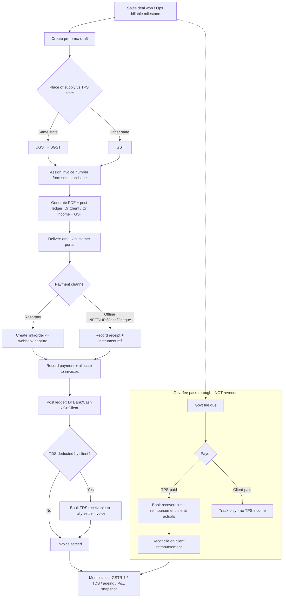
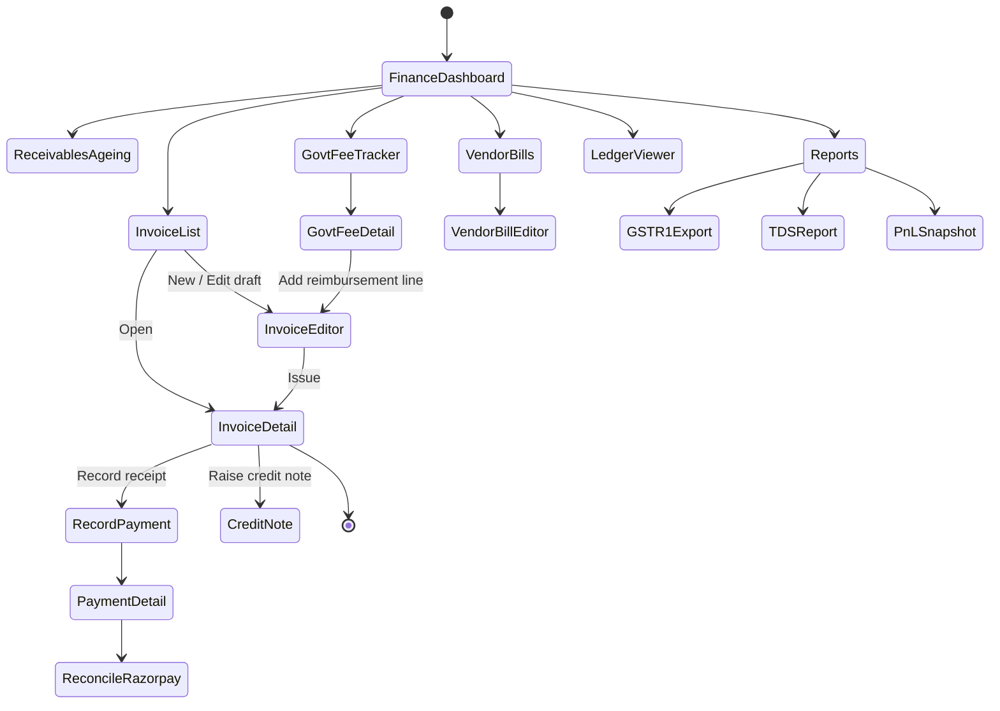
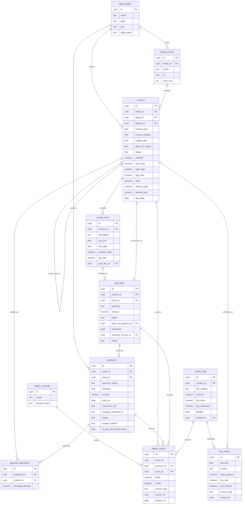

# Module Design — Finance & Accounts

**Module key:** `finance`
**Anchor entities:** Invoice, Payment, Govt-fee, Ledger
**Primary users:** Accounts, Directors
**Status:** Design (Phase D). Follows `00_ENTERPRISE_ARCHITECTURE.md` §6 template.
**Absorbs:** existing `payments` table + `projects.quoted_amount / paid_amount / payment_status` + live Razorpay integration.

---

## 1. Purpose & scope

**Business capability.** The financial system of record for TPS Xperts Group (consultancy) and TPS Xperts Global Certification (NABCB certification body). It turns delivered work into GST-compliant tax invoices, records money received against them, tracks government fees paid on behalf of clients as a pass-through (not revenue), keeps a simple double-entry ledger per client, captures vendor bills and expenses, and produces the statutory (GSTR-1, TDS) and management (P&L snapshot, receivables ageing, collections) numbers the Directors run the business on.

**Who uses it.**
- **Accounts** — raise invoices, record receipts, reconcile Razorpay, enter vendor bills/expenses, track govt-fee reimbursements, prepare GST/TDS exports.
- **Directors** — approve credit notes/write-offs, view P&L snapshot, outstanding, collections; sign off ageing actions.
- **Other modules (read/write via events)** — Sales (a won deal/quotation seeds a proforma), Operations (a project's `quoted_amount/paid_amount/payment_status` is derived here), Regulatory & Certification (govt fees originate from their workflows), Vendor Portal (vendor bills), Customer Portal (client sees own invoices/receipts).

**What it explicitly does NOT do.**
- **Not a full accrual accounting/ERP suite.** Double-entry here is a *client-ledger + control-account* model for cash position, receivables and pass-through clarity — it is not a GAAP general ledger with trial balance close, depreciation schedules, or inventory. Statutory filing itself happens in the CA's tool (Tally/portal); this module *exports data* (GSTR-1, TDS) and does not file returns.
- **Not payroll.** Salary, PF/ESI, professional tax = HRMS module. Finance only receives a payroll *expense journal* summary.
- **Does not move money.** No auto-debit, no payouts, no bank transfers initiated here. Razorpay is read/reconcile + hosted collection links only; actual bank ops are done by humans in the bank/Razorpay dashboard (per platform safety rules — no fund transfers executed by the system).
- **Not the quotation builder.** Quotations/deals live in Sales; Finance consumes an approved quotation to pre-fill a proforma/invoice.

---

## 2. Business workflow

TPS is a **services firm** (SAC 9983/9985-type professional, technical and regulatory consulting; certification services). Two money flows dominate:

**A. Fee revenue (our service fee).** Client engages TPS → work is delivered by Operations/Regulatory/Certification → Accounts raises a GST tax invoice → client pays (NEFT/UPI/cheque/cash/Razorpay) → receipt issued → ledger settled → receivable cleared.

**B. Government-fee pass-through (NOT revenue).** Many engagements require statutory fees paid to authorities (FSSAI/FoSCoS licence fees, NABCB/accreditation fees, testing-lab charges). Two sub-cases:
- **TPS-paid** pass-through — TPS pays the authority first from its own funds, then **reimburses itself** by recovering the exact amount from the client. This is a *balance-sheet* movement (an advance/recoverable), **never** booked to income, and generally invoiced as a **pure reimbursement / "reimbursement of expenses"** line with **no GST margin** (recovered at actuals as a disbursement).
- **Client-paid** pass-through — the client pays the authority directly (or hands cash to TPS strictly to remit onward). TPS only records it for tracking/receipt completeness; it never touches TPS income.

### End-to-end steps (fee cycle)

1. **Trigger.** Sales marks a deal *won* / Operations reaches a billable milestone → a **proforma invoice** (draft) is created, pre-filled from the project/quotation (party, place of supply, line items, HSN/SAC).
2. **Tax determination.** Place of supply vs TPS's state (Punjab/Chandigarh registration) decides **intra-state → CGST+SGST** or **inter-state → IGST**. GST rate per SAC applied. Reverse-charge/exempt flags handled per line.
3. **Numbering.** On *issue* (not on draft), the invoice is stamped from the correct **series** (e.g. `TPSX/25-26/0007` for consultancy vs `TPSGC/25-26/…` for the cert body) — gap-free, per financial year, per legal entity.
4. **Issue & deliver.** Invoice PDF generated (Edge Function), stored, emailed via ZeptoMail / surfaced in Customer Portal. Ledger posts: **Dr Client (receivable) / Cr Fee income + Cr GST output**.
5. **Collection.** Client pays. If Razorpay: a collection link/order is created; webhook confirms capture. If offline: Accounts records the receipt with mode (NEFT/UPI/Cash/Cheque) and UTR/instrument ref.
6. **Receipt & allocation.** A **payment** is recorded and *allocated* to one or more invoices (partial/advance supported). Ledger posts **Dr Bank/Cash / Cr Client**. `projects.paid_amount / payment_status` are recomputed from allocations.
7. **Reconciliation.** Razorpay settlements matched to bank credit and to receipts; TDS deducted by client is booked as **TDS receivable** so the invoice can be fully squared even though cash received is net of TDS.
8. **Govt-fee handling (parallel).** When a govt fee is due, a `govt_fees` record is raised (payer = client-paid | TPS-paid). TPS-paid → recorded as recoverable, then added as a **reimbursement line** on an invoice (or a separate reimbursement invoice) to recover at actuals. Reconciled when client reimburses.
9. **Vendor/expense side.** Vendor bills (labs, printers, sub-consultants) and internal expenses are booked; those attributable to a client engagement can be marked **billable/pass-through** and flow back into step 8.
10. **Period close (light).** Month-end: collections, outstanding ageing, GSTR-1 export (B2B/B2C/CDN), TDS summary, P&L snapshot. Directors review; nothing is *filed* here.



---

## 3. Screen flow



**Screen inventory**

| Route | Screen | Purpose | Primary permission |
|---|---|---|---|
| `/finance` | Finance Dashboard | KPIs, quick actions | `finance.dashboard.view` |
| `/finance/invoices` | Invoice List | Filter/search invoices, ageing status | `finance.invoice.view` |
| `/finance/invoices/new` | Invoice Editor (proforma/draft) | Build line items, tax, HSN/SAC | `finance.invoice.create` |
| `/finance/invoices/:id` | Invoice Detail | View, PDF, issue, allocations, credit note | `finance.invoice.view` |
| `/finance/payments` | Payment List | All receipts, mode, allocation status | `finance.payment.view` |
| `/finance/payments/new` | Record Payment | Record receipt + allocate to invoices | `finance.payment.create` |
| `/finance/payments/:id` | Payment Detail | Receipt PDF, reconciliation link | `finance.payment.view` |
| `/finance/reconcile` | Razorpay Reconciliation | Match settlements ↔ receipts | `finance.payment.reconcile` |
| `/finance/govt-fees` | Govt-fee Tracker | Client-paid vs TPS-paid, reimbursement status | `finance.govt_fee.view` |
| `/finance/govt-fees/:id` | Govt-fee Detail | Payer, recovery, linked invoice | `finance.govt_fee.view` |
| `/finance/receivables` | Receivables & Ageing | 0-30/31-60/61-90/90+ buckets | `finance.report.view` |
| `/finance/ledgers/:clientId` | Client Ledger | Statement of account, running balance | `finance.ledger.view` |
| `/finance/vendor-bills` | Vendor Bills & Expenses | AP entry, billable flag | `finance.expense.view` |
| `/finance/reports` | Reports hub | GSTR-1, TDS, P&L, collections | `finance.report.view` |

---

## 4. Database design

Schema: `finance` (logical). All amounts `numeric(14,2)` in INR; every table has `created_at/updated_at`, `created_by`, and RLS enabled. Money is stored **in rupees** to match existing `payments`.

### Key tables

- **`legal_entities`** — the two billing entities (consultancy, cert body). Holds GSTIN, PAN, state_code, address, invoice-series prefixes. Drives CGST/SGST vs IGST (seller state) and numbering namespace.
- **`invoices`** — header. `entity_id`, `party_id` (→ CRM client), `project_id` (nullable → Operations), `invoice_type` (`tax` | `proforma` | `reimbursement` | `credit_note` | `debit_note`), `series_id`, `invoice_number` (null until issued), `place_of_supply` (state code), `supply_type` (`intra` | `inter`), `status`, subtotal, tax totals (cgst/sgst/igst), `round_off`, `total`, `amount_paid`, `amount_due`, `reverse_charge`, `due_date`, `notes`. Money split rendered from lines.
- **`invoice_lines`** — one row per line. `invoice_id`, `description`, `sac_hsn`, `line_type` (`service` | `reimbursement` | `discount`), `qty`, `unit_price`, `taxable_value`, `gst_rate`, `cgst_amt`, `sgst_amt`, `igst_amt`, `govt_fee_id` (nullable → links a reimbursement line to its pass-through record so it is provably at-actuals, no margin).
- **`invoice_series`** — per entity + FY + document class; `prefix`, `fy` (`25-26`), `next_seq`, `format`. Gap-free numbering via row lock on issue.
- **`payments`** — **absorbs the existing table** (see expand-contract). Receipt of money. `entity_id`, `party_id`, `payment_mode` (`NEFT`|`UPI`|`Cash`|`Cheque`|`Razorpay`|`Client-paid`|`TPS-paid`), `direction` (`inflow`|`outflow`), `amount`, `paid_on`, `instrument_ref` (UTR/cheque no), `razorpay_payment_id`, `status`, `receipt_number`, `is_govt_fee_passthrough` (bool). NOTE: `Client-paid`/`TPS-paid` values are retained for pass-through remittances that are **not** TPS revenue.
- **`payment_allocations`** — many-to-many receipt↔invoice. `payment_id`, `invoice_id`, `allocated_amount`. Enables partial payments, advances, one payment across many invoices. Advances = payment with unallocated remainder.
- **`govt_fees`** — pass-through register. `project_id`, `party_id`, `authority` (`FSSAI`|`NABCB`|`Lab`|`Other`), `purpose`, `amount`, `payer` (`client_paid`|`tps_paid`), `paid_on`, `paid_via_payment_id` (nullable, when TPS-paid → outflow payment), `recovered` (bool), `recovery_invoice_id` (nullable → reimbursement invoice/line), `recovered_amount`, `status`. **Never touches income accounts.**
- **`ledger_accounts`** — chart-of-accounts (light): control accounts (Accounts Receivable, Bank, Cash, GST Output, GST Input, Fee Income, TDS Receivable, **Govt-fee Recoverable (asset)**, Vendor Payable, Expense). `account_type` (`asset`|`liability`|`income`|`expense`|`control`).
- **`ledger_entries`** — double-entry journal lines. `entry_id` (groups a balanced journal), `account_id`, `party_id` (nullable), `debit`, `credit`, `source_type` (`invoice`|`payment`|`govt_fee`|`vendor_bill`|`manual`), `source_id`, `narration`, `posted_on`. Sum(debit)=Sum(credit) per `entry_id` enforced by trigger.
- **`vendor_bills`** — AP. `vendor_id` (→ Vendor Portal), `bill_number`, `bill_date`, `amount`, `gst_input`, `tds_deducted`, `billable` (bool), `project_id`, `party_id` (if pass-through/billable), `status`.
- **`tds_entries`** — both sides: TDS *deducted by clients* on our invoices (receivable, Form 26AS reconciliation) and TDS *we deduct* on vendor bills (payable). `direction`, `section` (194J/194C…), `base_amount`, `tds_rate`, `tds_amount`, `source_type`, `source_id`, `pan`.
- **`credit_notes`** view/subtype handled via `invoices.invoice_type='credit_note'` referencing `original_invoice_id`.

### ER diagram



### RLS intent per table

| Table | Read | Write |
|---|---|---|
| `legal_entities` | all authenticated (needed for display) | `finance.settings.manage` (director/super-admin) |
| `invoices`, `invoice_lines` | holders of `finance.invoice.view`; **clients** see own via Customer Portal policy (`party_id` = their client) | `finance.invoice.*` |
| `invoice_series` | `finance.settings.view` | `finance.settings.manage` only; `next_seq` mutated solely by issuing RPC (SECURITY DEFINER) |
| `payments`, `payment_allocations` | `finance.payment.view`; client sees own receipts | `finance.payment.*` |
| `govt_fees` | `finance.govt_fee.view`; originating module (Regulatory/Certification) may read its own | `finance.govt_fee.*` |
| `ledger_accounts` | `finance.ledger.view` | `finance.settings.manage` |
| `ledger_entries` | `finance.ledger.view`; client sees own party rows in portal statement | **no direct client write** — posted only by SECURITY DEFINER functions/triggers |
| `vendor_bills` | `finance.expense.view`; vendor sees own via Vendor Portal | `finance.expense.*` |
| `tds_entries` | `finance.report.view` | `finance.payment.*` / `finance.expense.*` |

### Expand-contract notes (vs existing `payments`)

The existing `payments` table and `projects.quoted_amount/paid_amount/payment_status` stay live. Migration is **additive-first**:

1. **Expand** — add new nullable columns to `payments` (`entity_id`, `direction` default `inflow`, `receipt_number`, `is_govt_fee_passthrough` default false, `party_id`, allocation via new `payment_allocations` table). Existing rows keep working; `payment_mode` enum is *extended* (not replaced) so historical `Client-paid`/`TPS-paid` values remain valid.
2. **Backfill** — set `entity_id` = consultancy entity for legacy rows; derive `party_id` from `project_id`; create one `payment_allocations` row per legacy payment linking it to its project's (soon-to-be-backfilled) invoice, or leave as on-account advance if no invoice exists yet.
3. **Derive** — `projects.paid_amount / payment_status` become **computed** from `payment_allocations` (via a view or trigger) rather than hand-maintained; a compatibility trigger keeps the old columns in sync during coexistence so Operations V1 keeps reading them.
4. **Contract** — once Operations reads the derived source, retire hand-updates to `projects.paid_amount`. No destructive drop of existing columns until all readers move (per §1.4 of the master doc).

---

## 5. API design

Module `api/*` are thin typed Supabase wrappers; anything that must be atomic, gap-free, or authoritative is an **RPC / Edge Function** (SECURITY DEFINER, permission-checked inside).

**Client `api/*` (React Query hooks over these):**

| Function | Inputs | Output | Authz |
|---|---|---|---|
| `listInvoices(filters)` | status, party, entity, date-range, ageing bucket | `Invoice[]` | `finance.invoice.view` |
| `getInvoice(id)` | id | `Invoice + lines + allocations` | `finance.invoice.view` |
| `saveDraftInvoice(payload)` | header + lines (proforma) | `Invoice` | `finance.invoice.create/edit` |
| `listPayments(filters)` | mode, party, reconciled, date | `Payment[]` | `finance.payment.view` |
| `recordPayment(payload)` | party, entity, mode, amount, allocations[] | `Payment` | `finance.payment.create` |
| `listGovtFees(filters)` | payer, authority, recovered | `GovtFee[]` | `finance.govt_fee.view` |
| `upsertGovtFee(payload)` | project, party, authority, amount, payer | `GovtFee` | `finance.govt_fee.manage` |
| `getClientLedger(partyId, range)` | party, date-range | `LedgerEntry[]` + running balance | `finance.ledger.view` |
| `listVendorBills(filters)` | vendor, billable, status | `VendorBill[]` | `finance.expense.view` |
| `getAgeing(asOf)` | as-of date | buckets by party | `finance.report.view` |

**RPCs / Edge Functions (authoritative):**

| Name | Type | Inputs | Outputs | Notes / authz |
|---|---|---|---|---|
| `finance_issue_invoice` | RPC (SECURITY DEFINER) | `invoice_id` | issued `invoice_number` | Locks `invoice_series` row, assigns gap-free number, computes CGST/SGST vs IGST from place-of-supply, posts balanced `ledger_entries` (Dr AR / Cr Income + GST). `finance.invoice.issue`. |
| `finance_generate_invoice_pdf` | Edge Function | `invoice_id` | stored PDF path | Renders GST tax-invoice PDF, saves to `documents` bucket, returns signed URL. |
| `finance_record_payment` | RPC | payment + allocations | `payment_id` | Validates Σallocations ≤ amount, posts Dr Bank/Cash / Cr Client, recomputes `invoices.amount_due` + project rollup. `finance.payment.create`. |
| `finance_razorpay_webhook` | Edge Function | Razorpay signed event | 200/ack | HMAC-verify signature; on `payment.captured` create/reconcile a `payments` row + allocation; idempotent on `razorpay_payment_id`. Adapter isolates Razorpay shape. |
| `finance_reconcile_razorpay` | RPC | settlement batch | matched count | Matches Razorpay settlement ↔ receipts ↔ bank; flags unmatched. `finance.payment.reconcile`. |
| `finance_recover_govt_fee` | RPC | `govt_fee_id`, invoice/line | updated `govt_fees` | Adds at-actuals reimbursement line (no GST margin), links `govt_fee_id`, marks recoverable; posts Dr AR / Cr Govt-fee Recoverable. `finance.govt_fee.manage`. |
| `finance_export_gstr1` | Edge Function | `entity_id`, period | GSTR-1 JSON/CSV (B2B/B2CS/CDNR) | Read-only aggregation of issued invoices + credit notes; excludes pass-through non-supply lines. `finance.report.export`. |
| `finance_export_tds` | Edge Function | period, direction | TDS CSV | 26AS-style receivable + payable summary. `finance.report.export`. |
| `finance_pnl_snapshot` | RPC | period | income/expense/margin | Excludes govt-fee pass-through from both income and expense. `finance.report.view`. |

All RPCs re-check permissions server-side and write `audit_log`; the UI `useCan()` is affordance only.

---

## 6. Permissions

Keys namespaced `finance.<entity>.<action>`. Aggregated into `PERMISSIONS` via the module registry.

| Permission | accounts | director | super_admin | Notes |
|---|:--:|:--:|:--:|---|
| `finance.dashboard.view` | ✓ | ✓ | ✓ | |
| `finance.invoice.view` | ✓ | ✓ | ✓ | Clients get scoped read via Customer Portal RLS, not this key |
| `finance.invoice.create` | ✓ | ✓ | ✓ | |
| `finance.invoice.edit` | ✓ | ✓ | ✓ | Only drafts editable; issued = immutable |
| `finance.invoice.issue` | ✓ | ✓ | ✓ | Stamps number, posts ledger |
| `finance.invoice.cancel` | – | ✓ | ✓ | Issued invoice cancel → credit note only |
| `finance.payment.view` | ✓ | ✓ | ✓ | |
| `finance.payment.create` | ✓ | ✓ | ✓ | |
| `finance.payment.reconcile` | ✓ | ✓ | ✓ | Razorpay/bank matching |
| `finance.govt_fee.view` | ✓ | ✓ | ✓ | Regulatory/Certification get read on own rows |
| `finance.govt_fee.manage` | ✓ | ✓ | ✓ | Payer, recovery |
| `finance.ledger.view` | ✓ | ✓ | ✓ | Client statement scoped in portal |
| `finance.expense.view` | ✓ | ✓ | ✓ | |
| `finance.expense.manage` | ✓ | ✓ | ✓ | Vendor bills, billable flag |
| `finance.report.view` | ✓ | ✓ | ✓ | |
| `finance.report.export` | ✓ | ✓ | ✓ | GSTR-1/TDS/collections export |
| `finance.creditnote.approve` | – | ✓ | ✓ | Director gate |
| `finance.writeoff.approve` | – | ✓ | ✓ | Bad-debt write-off |
| `finance.settings.view` | ✓ | ✓ | ✓ | Series, entities, accounts |
| `finance.settings.manage` | – | ✓ | ✓ | Series prefixes, chart of accounts, entity GSTIN |

**RLS mapping.** Every table policy checks `auth_role()`/`has_permission('finance.<x>.<action>')`. Client/vendor scoped reads use `party_id`/`vendor_id = current portal identity`. Ledger and series `next_seq` are writable only inside SECURITY DEFINER RPCs — no direct client mutation path exists.

---

## 7. Dashboard

| Widget | Metric | Source |
|---|---|---|
| Outstanding receivable | Σ `invoices.amount_due` (issued, unpaid) | `invoices` |
| Ageing mini-bars | 0-30 / 31-60 / 61-90 / 90+ | `getAgeing()` |
| Collections (MTD/FY) | Σ inflow `payments` allocated | `payments` + `payment_allocations` |
| Revenue (FY, ex-passthrough) | Σ fee income lines, **excl. reimbursement** | `ledger_entries` (income accounts) |
| Govt-fee recoverable | Σ TPS-paid, not yet recovered | `govt_fees` |
| Razorpay unreconciled | count/amount pending match | `payments` where `status='unreconciled'` |
| GST output payable (period) | Σ CGST+SGST+IGST issued − input credit | `invoices` + `vendor_bills` |
| TDS receivable | Σ client-deducted, not in 26AS | `tds_entries` |
| Overdue invoices | count past `due_date` | `invoices` |
| Draft proformas | count awaiting issue | `invoices` where `status='draft'` |

Directors also see a **Cash position** tile (Bank + Cash control balances) and **P&L snapshot** (income − expense, pass-through excluded).

---

## 8. Reports

| Report | Columns | Filters | Export |
|---|---|---|---|
| Invoice register | number, date, party, entity, taxable, CGST, SGST, IGST, total, paid, due, status | entity, FY, party, status, date | CSV, PDF |
| Receivables ageing | party, total due, 0-30, 31-60, 61-90, 90+, oldest invoice | entity, as-of date | CSV, PDF |
| Collections | date, party, mode, amount, allocated invoices, UTR/ref | entity, mode, date | CSV |
| Client ledger / SOA | date, particulars, debit, credit, running balance | party, date-range | PDF, CSV |
| GSTR-1 export | B2B, B2CS, CDNR, HSN summary (govt portal shape) | entity, tax period | JSON, CSV |
| TDS summary | section, party/vendor, base, rate, TDS, direction | period, direction | CSV |
| Govt-fee pass-through | project, party, authority, amount, payer, recovered, recovery invoice | payer, authority, recovered | CSV, PDF |
| Vendor bills / AP | vendor, bill no, date, amount, GST input, TDS, billable, status | vendor, status, date | CSV |
| P&L snapshot | income (ex-passthrough), expense, gross margin, GST payable | period, entity | PDF |
| Reimbursement recovery | govt fee, paid, recovered, outstanding | payer, status | CSV |

All exports route through `finance.report.export`; every export writes an `audit_log` line (who/when/scope) — no PII in URLs.

---

## 9. Notifications

Via `core/notifications` only; `notification_type` enum extended per this module. Channels gated by settings flags (email = ZeptoMail; WhatsApp = BSP stub until number live).

| Event | notification_type | Recipients | Channels |
|---|---|---|---|
| Invoice issued | `finance.invoice_issued` | Client (portal + email), owning manager | in-app, email |
| Payment received / receipt | `finance.payment_received` | Client, Accounts, owning manager | in-app, email |
| Invoice due in 3 days | `finance.invoice_due_soon` | Client, Accounts | in-app, email, (WhatsApp when live) |
| Invoice overdue | `finance.invoice_overdue` | Client, Accounts, Director | in-app, email, (WhatsApp) |
| Razorpay capture | `finance.razorpay_captured` | Accounts | in-app |
| Razorpay reconciliation mismatch | `finance.recon_mismatch` | Accounts | in-app, email |
| Govt-fee recoverable overdue | `finance.govt_fee_unrecovered` | Accounts, Director | in-app, email |
| Credit note issued | `finance.credit_note_issued` | Client, Director | in-app, email |
| Vendor bill due | `finance.vendor_bill_due` | Accounts | in-app, email |
| GST/TDS export ready | `finance.export_ready` | requester | in-app |

---

## 10. Automations

Scheduled = pg_cron → Edge Function (gated by settings); event = DB trigger → `notify()` / ledger post.

| Job | Type | Cadence / trigger | Action |
|---|---|---|---|
| Ageing recompute | pg_cron | daily 02:00 IST | Refresh ageing buckets, flag overdue |
| Due-soon reminders | pg_cron | daily 09:00 IST | `finance.invoice_due_soon` for T-3 invoices |
| Overdue escalation | pg_cron | daily 09:15 IST | `finance.invoice_overdue`; escalate 90+ to Director |
| Govt-fee recovery sweep | pg_cron | weekly Mon 09:00 | Flag TPS-paid not recovered → notify |
| Razorpay settlement pull | pg_cron | daily 08:00 | Fetch settlements, pre-match, flag mismatches |
| Ledger post on issue | DB trigger | on `finance_issue_invoice` | Insert balanced `ledger_entries` |
| Ledger post on payment | DB trigger | on `finance_record_payment` | Insert Dr Bank/Cash / Cr Client |
| Project rollup sync | DB trigger | on `payment_allocations` change | Recompute `projects.paid_amount/payment_status` (coexistence) |
| Balanced-journal guard | DB trigger | before insert `ledger_entries` | Reject if Σdebit ≠ Σcredit per `entry_id` |
| Month-close pre-aggregation | pg_cron | 1st of month 01:00 | Snapshot P&L, GSTR-1 staging for prior month |

---

## 11. Integrations

| System | Purpose | Boundary / adapter |
|---|---|---|
| **Razorpay (live)** | Hosted collection links/orders, webhook capture, settlement reconciliation | `razorpayAdapter` in `finance/api` + `finance_razorpay_webhook` Edge Function. HMAC signature verify; idempotent on `razorpay_payment_id`. **No payouts/transfers initiated** — collection + read only. Keys in Supabase secrets, never client-side. |
| **ZeptoMail** | Invoice/receipt/reminder email | via `core/notifications` dispatch only |
| **WhatsApp BSP (AiSensy)** | Payment reminders | via `core/notifications`; stub/toggle OFF until number live (per memory) |
| **Google Drive / `documents` bucket** | Invoice/receipt PDF storage | via `core/files`; `disableConversionToGoogleType: true` |
| **GST portal (GSTR-1)** | Statutory return | **Export only** — JSON/CSV in portal-compatible shape; no direct API filing |
| **CA tool (Tally / portal)** | Statutory filing, TDS challans | export handoff (CSV); this module is source data, not the filer |
| **Bank** | Reconciliation reference | manual statement import (CSV) for matching; no bank API/transfers |
| **Sales / Operations / Regulatory / Certification** | Proforma seed, govt-fee origin, project rollup | internal via each module's `index.ts` public API + shared events, never internals |
| **Vendor Portal / Customer Portal** | Vendor bills in; client invoice/receipt views out | scoped RLS by `vendor_id` / `party_id` |

```mermaid
flowchart LR
  subgraph UI[Finance module UI]
    INV[Invoice Editor/Detail]
    PAY[Record Payment / Reconcile]
    GF[Govt-fee Tracker]
    RPT[Reports / Ledger]
  end
  subgraph CORE[Core platform]
    ACC[core/access - useCan/RLS]
    NOT[core/notifications]
    FILES[core/files]
    UIC[core/ui + DataTable]
  end
  subgraph DB[(Supabase Postgres + RLS)]
    T1[invoices / invoice_lines]
    T2[payments / allocations]
    T3[govt_fees]
    T4[ledger_accounts / entries]
    T5[vendor_bills / tds_entries]
    RPC[[SECURITY DEFINER RPCs<br/>issue / record / recover]]
  end
  subgraph EF[Edge Functions]
    WH[razorpay_webhook]
    PDF[invoice_pdf]
    GST[gstr1 / tds export]
  end
  subgraph EXT[External]
    RZP[(Razorpay live)]
    ZEP[(ZeptoMail)]
    WA[(WhatsApp BSP)]
    GDRV[(Drive/Storage)]
  end
  INV --> ACC
  PAY --> ACC
  GF --> ACC
  RPT --> ACC
  ACC --> DB
  INV --> RPC
  PAY --> RPC
  GF --> RPC
  RPC --> T1 & T2 & T3 & T4 & T5
  RZP -->|signed webhook| WH --> T2
  PAY -->|create link/order| RZP
  RPC --> PDF --> FILES --> GDRV
  RPT --> GST
  DB --> NOT
  NOT --> ZEP & WA
  RPT --> UIC
```

---

## 12. Future scalability

- **10× volume.** Invoices/ledger_entries partition candidates by `entity_id` + FY; ageing served from a materialized view refreshed by cron. Query keys already scoped per entity/period. Ledger append-only → cheap to index on `(account_id, posted_on)` and `(party_id, posted_on)`.
- **Multi-entity → multi-tenant.** `legal_entities` already separates the two TPS entities and their numbering series; the model generalizes to N entities without schema change. A future true multi-tenant split would add a `tenant_id` and expand RLS — the entity boundary is the seam.
- **Full accrual/close.** The light double-entry can grow into a fuller GL (trial balance, period-lock, opening balances) by adding `accounting_periods` + a lock flag on `ledger_entries` without disturbing invoicing/payments.
- **Statutory API filing.** GSTR-1/TDS is export-only today; a filer adapter (GSP API) can be added behind the same export functions when compliance/appetite allows.
- **Performance.** PDF generation and exports are Edge-Function/async so heavy months don't block UI; Razorpay reconciliation is batched. `numeric(14,2)` headroom to ~99 crore per line.
- **Data integrity at scale.** Gap-free numbering and balanced-journal guards are DB-enforced, so correctness holds regardless of client count or concurrency.

---

## 13. Architecture diagram

```mermaid
flowchart TB
  subgraph FE[React + Vite - modules/finance]
    P[pages: invoices, payments, govt-fees, ledgers, reports]
    H[hooks - TanStack Query]
    A[api - typed Supabase wrappers + razorpayAdapter]
    PERM[permissions.ts - finance.*]
  end
  subgraph CORE[@/core]
    AUTH[auth]
    ACCESS[access - useCan / PERMISSIONS]
    NOTIF[notifications]
    FILES[files]
    UI[ui - DataTable/StatCard]
  end
  subgraph SB[Supabase]
    PG[(Postgres + RLS)]
    RLS[RLS policies -> finance.*]
    RPCS[[RPCs: issue_invoice / record_payment / recover_govt_fee / reconcile]]
    EDGE[Edge Fns: razorpay_webhook / invoice_pdf / gstr1_export / tds_export]
    CRON[pg_cron: ageing / reminders / settlement pull]
    STORE[(Storage: documents bucket)]
  end
  subgraph OTHERS[Other modules - via index.ts]
    SALES[Sales]
    OPS[Operations]
    REG[Regulatory/Certification]
    VP[Vendor Portal]
    CP[Customer Portal]
  end
  subgraph EXT[External]
    RZP[(Razorpay live)]
    MAIL[(ZeptoMail)]
    WAP[(WhatsApp BSP)]
  end

  P --> H --> A
  A --> ACCESS
  A --> PG
  A --> RPCS
  PERM --> ACCESS
  RPCS --> PG
  RPCS --> RLS
  EDGE --> PG
  CRON --> EDGE
  RZP <-->|links + signed webhook| EDGE
  EDGE --> STORE
  FILES --> STORE
  PG --> NOTIF
  NOTIF --> MAIL & WAP
  SALES -->|proforma seed| A
  OPS -->|project rollup| PG
  REG -->|govt-fee origin| PG
  VP -->|vendor bills| PG
  CP -->|scoped invoice/receipt read| RLS
  H --> UI
  A --> AUTH
```

---

**Cross-module dependencies:** Sales (proforma seed from won deal/quotation), Operations (project `quoted_amount/paid_amount/payment_status` rollup — expand-contract), Regulatory & Certification (origin of govt-fee pass-throughs), Vendor Portal (vendor bills/AP), Customer Portal (scoped invoice/receipt/ledger reads), Core (access, notifications, files, ui). External: Razorpay (live), ZeptoMail, WhatsApp BSP, Drive/Storage.
