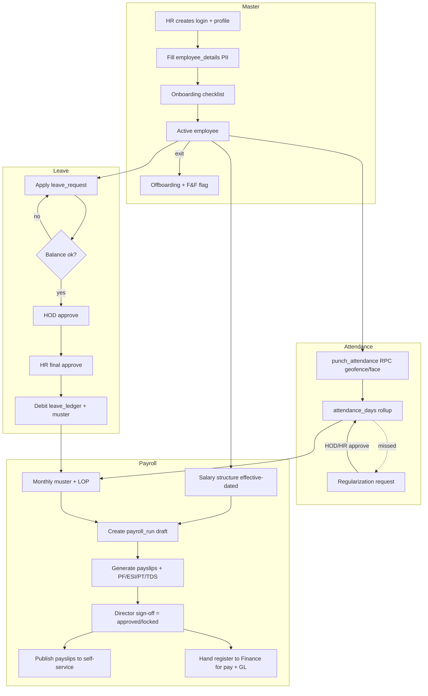
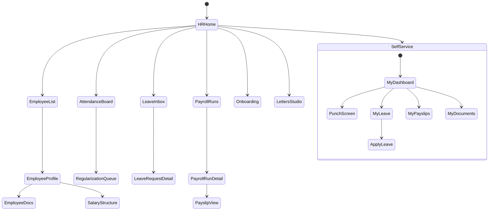
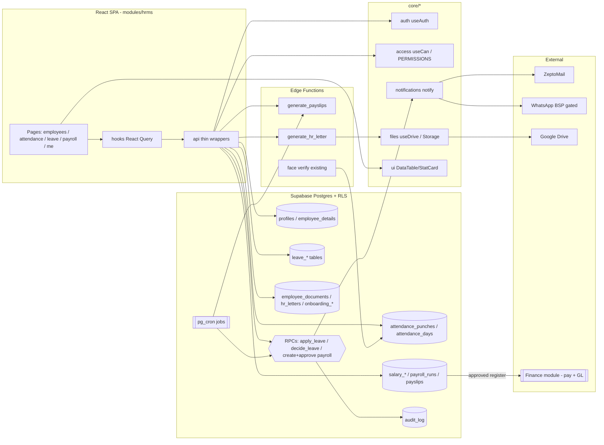

# Module Design — HRMS (Human Resource Management)

**Module key:** `hrms` · **Anchor entities:** Employee, Attendance, Leave, Payroll
**Status:** Design (Phase D) — follows the §6 template of `docs/architecture/00_ENTERPRISE_ARCHITECTURE.md` verbatim.
**Primary users:** HR, Directors, HODs (managers), all employees (self-service).
**Timezone:** All wall-clock logic is `Asia/Kolkata` (IST). Currency: INR (`formatRupees`).

> Grounding: TPS Xperts Group is an Indian SMB regulatory consultancy (~15–50 staff) with office staff (Mohali, CP67) and field staff (`profiles.is_field_staff`). This module **extends existing tables** (`profiles`, `employee_details`, `office_locations`, `attendance_punches`, `attendance_settings`) rather than duplicating them, and adds Leave, Payroll, Documents, Onboarding/Offboarding, and HR-letter capabilities. Every schema change is **expand-contract** (additive first).

---

## 1. Purpose & scope

**Business capability.** A single system of record for the workforce: who works here (employee master), whether they showed up (attendance), time off (leave), what they are paid (payroll + Indian statutory), their documents and letters, and their lifecycle (onboarding → offboarding).

**Who uses it.**
- **Employees** — self-service: view profile, punch attendance, apply for leave, download payslips and letters, upload documents.
- **HOD (manager)** — first-level leave approval for their department; team attendance visibility.
- **HR** — employee master, leave/payroll administration, letters, onboarding/offboarding, statutory registers.
- **Directors / super_admin** — approvals, salary structures, payroll sign-off, org-wide reports.
- **Accounts** — consumes the approved payroll run for disbursement + GL posting (via Finance module).

**Explicitly NOT in scope (handled elsewhere / later).**
- Bank disbursement, payment execution, and GL posting → **Finance & Accounts module** (HRMS produces the approved payroll register; Finance pays and books it).
- Recruitment/ATS (job posts, candidate pipeline) → future CRM/Recruitment surface; HRMS starts at "offer accepted".
- Training courses/quizzes (FoSTaC-style) → **LMS module**; HRMS only stores training *records* referenced from documents.
- Performance appraisals / OKRs → future HRMS phase 2 (schema leaves room; not designed here).
- The raw geofence + face-match punch engine already lives in Core-adjacent attendance tables; HRMS **owns the HR-facing surface** (regularization, monthly muster, leave interplay) but reuses the existing `punch_attendance()` RPC unchanged.

---

## 2. Business workflow

### 2.1 Employee lifecycle (master)
1. HR creates a login (Administration module → `auth.users` + `profiles`), sets `role`, `employee_code`, `designation`, `department`, `hod_email`, `is_field_staff`.
2. HR completes sensitive PII in `employee_details` (DOB, DOJ, Aadhaar, PAN, addresses) — strict RLS.
3. HR runs **onboarding checklist** (`onboarding_tasks`) — issue-asset, collect-docs, create email, assign HOD, define salary structure.
4. Employee is **active**; participates in attendance/leave/payroll.
5. On exit, HR runs **offboarding checklist**, sets `date_of_leaving`, deactivates login (`profiles.is_active=false`), triggers **Full & Final** payroll flag.

### 2.2 Attendance (reuse existing engine)
1. Employee punches via existing `punch_attendance()` RPC (geofence + accuracy gate + optional face-match). Office staff must be inside a fence; field staff bypass fence (`is_field`).
2. Punches are an **immutable** audit trail. Daily rollup via existing `attendance_days` view (first_in/last_out/worked_minutes).
3. **New:** if a punch is missed/wrong, employee raises an **attendance regularization request**; HOD/HR approves → materializes a correction row (not an edit of the immutable punch).
4. Monthly **muster/LOP** is computed by combining `attendance_days` + approved `leave_requests` + `holidays` + `weekly_offs`.

### 2.3 Leave
1. Yearly, HR/cron **allocates balances** per `leave_type` (CL/SL/EL/…) into `leave_balances` (with EL carry-forward cap).
2. Employee submits a `leave_request` (type, from/to, half-day flag, reason) → status `pending`. System validates available balance and overlap.
3. **HOD approves/rejects** (first level). On approve → `hod_approved`.
4. **HR approves/rejects** (final). On final approve → `approved`, balance is decremented (`leave_ledger` debit), attendance muster reflects leave.
5. Cancellation before start date → balance credited back.

### 2.4 Payroll (monthly, India)
1. HR defines/updates a **salary structure** per employee (`salary_structures` + `salary_components`: Basic, HRA, conveyance, special allowance, employer PF, etc.), effective-dated.
2. HR **creates a payroll run** for a month (`payroll_runs`, status `draft`).
3. System **generates payslips** (`payslips` + `payslip_lines`): prorates for LOP/joining/leaving days from muster, computes statutory:
   - **PF** (employee 12% of PF-wage, employer 12%/13% split), **ESI** (0.75% employee / 3.25% employer, if gross ≤ ₹21,000), **PT** (state slab — Punjab/relevant state), **TDS** (as per declared regime/investment proofs).
4. HR reviews → **Director sign-off** moves run to `approved` (locked).
5. Approved register is **handed to Finance** for disbursement + GL; payslips are **published** to employee self-service; statutory registers (PF ECR, ESI, PT, Form 16 inputs) are exportable.
6. Full & Final for leavers computed on the offboarding month (leave encashment of EL balance + dues − recoveries).

---

## 3. Screen flow

**Screen inventory**

| Route | Screen | Who | Purpose |
|---|---|---|---|
| `/hrms` | HR dashboard | HR, director | KPIs, pending approvals, headcount |
| `/hrms/employees` | Employee list | HR, director, manager | Search/filter by dept/status/field |
| `/hrms/employees/:id` | Employee profile | HR, self | Master + PII + tabs (docs, salary, leave, attendance) |
| `/hrms/attendance` | Attendance board | HR, manager | Team muster, calendar, exceptions |
| `/hrms/attendance/regularizations` | Regularization queue | HOD, HR | Approve missed/mispunch corrections |
| `/hrms/leave` | Leave inbox | HOD, HR | Approve/reject; balances |
| `/hrms/leave/:id` | Leave request detail | HOD, HR, self | Timeline, approve/reject |
| `/hrms/payroll` | Payroll runs | HR, director | Monthly runs list + status |
| `/hrms/payroll/:runId` | Payroll run detail | HR, director | Payslip grid, statutory totals, sign-off |
| `/hrms/payroll/:runId/:payslipId` | Payslip | HR, director, self | Earnings/deductions/net |
| `/hrms/onboarding` | Onboarding/offboarding | HR | Checklists per joiner/leaver |
| `/hrms/letters` | Letters studio | HR | Generate offer/appointment/experience/relieving |
| `/hrms/me` | My dashboard | all | Self-service hub |
| `/hrms/me/punch` | Punch screen | all | Geofenced/face punch (existing engine) |
| `/hrms/me/leave` | My leave | all | Balances + apply + history |
| `/hrms/me/payslips` | My payslips | all | Published payslips |
| `/hrms/me/documents` | My documents | all | Upload/view HR docs |

---

## 4. Database design

All new tables get **RLS on** and follow the existing `has_role()` pattern. Reuse existing `profiles`, `employee_details`, `office_locations`, `attendance_punches`, `attendance_settings`, `attendance_days` view.

**New enums**
- `leave_type_code`: `CL, SL, EL, LWP, COMP_OFF, MATERNITY, PATERNITY, BEREAVEMENT` (seeded, extensible).
- `leave_request_status`: `pending, hod_approved, approved, rejected, cancelled`.
- `payroll_run_status`: `draft, processing, review, approved, published, paid`.
- `pay_component_type`: `earning, deduction, employer_contribution`.
- `regularization_status`: `pending, approved, rejected`.
- `onboarding_status`: `not_started, in_progress, complete`.

**Expand-contract notes**
- `profiles` / `employee_details` are extended with **additive nullable columns only** (`employee_details.date_of_leaving`, `employment_type`, `pf_uan`, `esi_ip_no`, `bank_*`). No existing column changes.
- New `notification_type` enum values are appended (never reordered/removed).
- `attendance_punches` stays immutable; corrections live in a separate `attendance_regularizations` table — we never UPDATE a punch.

```mermaid
erDiagram
    profiles ||--|| employee_details : "1:1 PII"
    profiles ||--o{ attendance_punches : "punches"
    profiles ||--o{ attendance_regularizations : "requests"
    profiles ||--o{ leave_requests : "applies"
    profiles ||--o{ leave_balances : "holds"
    profiles ||--o{ leave_ledger : "debits/credits"
    profiles ||--o{ salary_structures : "current+history"
    profiles ||--o{ payslips : "receives"
    profiles ||--o{ employee_documents : "owns"
    profiles ||--o{ onboarding_cases : "joiner/leaver"
    profiles ||--o{ hr_letters : "issued"
    leave_types ||--o{ leave_balances : "typed"
    leave_types ||--o{ leave_requests : "typed"
    leave_types ||--o{ leave_ledger : "typed"
    salary_structures ||--o{ salary_components : "lines"
    payroll_runs ||--o{ payslips : "contains"
    payslips ||--o{ payslip_lines : "earn/deduct"
    onboarding_cases ||--o{ onboarding_tasks : "checklist"
    holidays }o--|| office_locations : "optional-scope"

    employee_details {
        uuid user_id PK "FK profiles.id"
        date date_of_joining
        date date_of_leaving "NEW additive"
        text employment_type "NEW full_time/contract/probation"
        text pf_uan "NEW"
        text esi_ip_no "NEW"
        text bank_account_no "NEW"
        text bank_ifsc "NEW"
        text aadhar_no
        text pan_no
    }
    leave_types {
        uuid id PK
        text code "CL/SL/EL..."
        text name
        numeric default_annual_qty
        boolean is_paid
        boolean carry_forward
        numeric carry_forward_cap
        boolean half_day_allowed
        boolean is_active
    }
    leave_balances {
        uuid id PK
        uuid user_id FK
        uuid leave_type_id FK
        int year
        numeric allocated
        numeric used
        numeric carried_forward
    }
    leave_requests {
        uuid id PK
        uuid user_id FK
        uuid leave_type_id FK
        date from_date
        date to_date
        boolean half_day
        numeric days
        text reason
        leave_request_status status
        uuid hod_approver FK
        uuid hr_approver FK
        timestamptz created_at
    }
    leave_ledger {
        uuid id PK
        uuid user_id FK
        uuid leave_type_id FK
        uuid request_id FK
        numeric delta "debit- / credit+"
        text note
        timestamptz created_at
    }
    attendance_regularizations {
        uuid id PK
        uuid user_id FK
        date work_date
        time proposed_in
        time proposed_out
        text reason
        regularization_status status
        uuid approver FK
    }
    holidays {
        uuid id PK
        date holiday_date
        text name
        boolean is_optional
        uuid office_id FK "nullable"
        int year
    }
    salary_structures {
        uuid id PK
        uuid user_id FK
        date effective_from
        date effective_to "null=current"
        numeric ctc_annual
        text pay_frequency "monthly"
        boolean is_active
    }
    salary_components {
        uuid id PK
        uuid structure_id FK
        pay_component_type kind
        text code "BASIC/HRA/PF_EE..."
        text name
        numeric amount_monthly
        text calc_basis "fixed/percent_of_basic"
        numeric percent_value
    }
    payroll_runs {
        uuid id PK
        int period_year
        int period_month
        payroll_run_status status
        numeric gross_total
        numeric deduction_total
        numeric net_total
        uuid created_by FK
        uuid approved_by FK
        timestamptz approved_at
    }
    payslips {
        uuid id PK
        uuid run_id FK
        uuid user_id FK
        numeric paid_days
        numeric lop_days
        numeric gross
        numeric total_deductions
        numeric net_pay
        numeric pf_ee
        numeric pf_er
        numeric esi_ee
        numeric esi_er
        numeric pt
        numeric tds
        text pdf_path
        boolean is_ff "full-and-final"
    }
    payslip_lines {
        uuid id PK
        uuid payslip_id FK
        pay_component_type kind
        text code
        text name
        numeric amount
    }
    employee_documents {
        uuid id PK
        uuid user_id FK
        text doc_type "aadhaar/pan/offer/degree..."
        text file_path
        text drive_file_id "nullable"
        date expires_on "nullable"
        uuid uploaded_by FK
    }
    onboarding_cases {
        uuid id PK
        uuid user_id FK
        text kind "onboarding/offboarding"
        onboarding_status status
        date target_date
    }
    onboarding_tasks {
        uuid id PK
        uuid case_id FK
        text label
        boolean done
        uuid owner FK
        date due_date
    }
    hr_letters {
        uuid id PK
        uuid user_id FK
        text letter_type "offer/appointment/experience/relieving/salary_cert"
        jsonb payload
        text pdf_path
        uuid issued_by FK
        timestamptz issued_at
    }
```

**RLS intent per table**

| Table | Select | Insert/Update/Delete |
|---|---|---|
| `leave_types`, `holidays` | any authenticated | `super_admin, director, hr` |
| `leave_balances`, `leave_ledger` | own row OR `super_admin/director/hr` | HR/cron/RPC only (writes via SECURITY DEFINER) |
| `leave_requests` | own OR `hr/director` OR HOD-of-department | insert: self; status transitions via RPC guarded by role |
| `attendance_regularizations` | own OR `hr/director/manager` | insert: self; approve via RPC (HOD/HR) |
| `salary_structures`, `salary_components` | own (read-only) OR `super_admin/director/hr` | `super_admin, director, hr` |
| `payroll_runs`, `payslips`, `payslip_lines` | own payslip OR `super_admin/director/hr` (accounts read on approved) | run mgmt: `hr`; sign-off: `director/super_admin` |
| `employee_documents` | own OR `super_admin/director/hr` | own insert; HR manage |
| `onboarding_cases`, `onboarding_tasks` | `super_admin/director/hr` (+ assignee) | `super_admin/director/hr` |
| `hr_letters` | own OR `super_admin/director/hr` | `super_admin, director, hr` |

Reused: `attendance_punches` select = own OR `super_admin/director/hr/manager` (unchanged); inserts only via `punch_attendance()`.

---

## 5. API design

Module `api/*` are thin typed Supabase wrappers; hooks wrap them in React Query (`['hrms', entity, ...params]`). Mutating flows that cross rows or enforce invariants go through **SECURITY DEFINER RPCs** so RLS + business rules can't be bypassed.

**Data-access functions (`modules/hrms/api/`)**
| Function | Inputs | Output | Authz |
|---|---|---|---|
| `listEmployees(filter)` | dept, status, field, search | `Employee[]` | `hrms.employee.read` |
| `getEmployee(id)` | id | `Employee + details` | self or `hrms.employee.read` |
| `upsertEmployeeDetails(id, patch)` | PII patch | `EmployeeDetails` | self (limited) / `hrms.employee.manage` |
| `listLeaveBalances(userId, year)` | userId, year | `LeaveBalance[]` | self / HR |
| `listLeaveRequests(filter)` | scope, status | `LeaveRequest[]` | scoped by role |
| `getMyPayslips()` | — | `Payslip[]` (published) | self |
| `listPayrollRuns(year)` | year | `PayrollRun[]` | `hrms.payroll.read` |
| `getPayslip(id)` | id | `Payslip + lines` | owner / HR |
| `listEmployeeDocuments(userId)` | userId | `EmployeeDocument[]` | self / HR |
| `listOnboardingCases(kind)` | kind | `OnboardingCase[]` | HR |

**RPCs / Edge Functions**
| Name | Kind | Inputs | Output | Authz (enforced in fn) |
|---|---|---|---|---|
| `punch_attendance` (existing, reused) | RPC (definer) | lat,lng,accuracy,selfie,face | punch result | authenticated |
| `apply_leave` | RPC (definer) | type_id, from, to, half_day, reason | request row | self; validates balance + overlap |
| `decide_leave` | RPC (definer) | request_id, decision, level | request row | HOD (level1) / HR (level2); writes `leave_ledger` atomically on final approve |
| `cancel_leave` | RPC (definer) | request_id | request row | self before start; credits ledger |
| `request_regularization` | RPC (definer) | work_date, in, out, reason | regularization row | self |
| `decide_regularization` | RPC (definer) | id, decision | row | HOD/HR |
| `allocate_leave_year` | RPC (definer) | year | count | `hr/director`; also called by cron |
| `create_payroll_run` | RPC (definer) | year, month | run | `hr` |
| `generate_payslips` | Edge Function | run_id | totals | `hr`; computes muster proration + PF/ESI/PT/TDS |
| `approve_payroll_run` | RPC (definer) | run_id | run (locked) | `director/super_admin` |
| `publish_payroll_run` | RPC (definer) | run_id | run | `hr` after approval; triggers payslip PDFs + notify + Finance handoff row |
| `generate_hr_letter` | Edge Function | user_id, letter_type, payload | pdf_path | `hr`; renders docx/pdf, stores in `hr-docs` |

All async wrapped in try/catch; user-facing errors via `toast()`; state changes write `audit_log` (via shared helper/trigger).

---

## 6. Permissions

Namespace: `hrms.<entity>.<action>`. Aggregated into `PERMISSIONS` by the registry; every mutation guarded by RLS (authoritative) + `useCan()` (affordance).

| Permission key | super_admin | director | hr | manager (HOD) | accounts | executive/auditor |
|---|:--:|:--:|:--:|:--:|:--:|:--:|
| `hrms.employee.read` | ✓ | ✓ | ✓ | team | — | auditor: read |
| `hrms.employee.manage` | ✓ | ✓ | ✓ | — | — | — |
| `hrms.employee.pii.read` | ✓ | ✓ | ✓ | — | — | — |
| `hrms.attendance.read` | ✓ | ✓ | ✓ | team | — | auditor: read |
| `hrms.attendance.punch` | self | self | self | self | self | self |
| `hrms.attendance.regularize.approve` | ✓ | ✓ | ✓ | team | — | — |
| `hrms.leave.apply` | self | self | self | self | self | self |
| `hrms.leave.approve.hod` | ✓ | ✓ | ✓ | team | — | — |
| `hrms.leave.approve.hr` | ✓ | ✓ | ✓ | — | — | — |
| `hrms.leave.admin` (types/balances) | ✓ | ✓ | ✓ | — | — | — |
| `hrms.payroll.read` | ✓ | ✓ | ✓ | — | approved only | auditor: read |
| `hrms.payroll.structure.manage` | ✓ | ✓ | ✓ | — | — | — |
| `hrms.payroll.run.manage` | ✓ | — | ✓ | — | — | — |
| `hrms.payroll.run.approve` | ✓ | ✓ | — | — | — | — |
| `hrms.payslip.read.self` | self | self | self | self | self | self |
| `hrms.document.manage` | ✓ | ✓ | ✓ | — | — | — |
| `hrms.onboarding.manage` | ✓ | ✓ | ✓ | — | — | — |
| `hrms.letter.issue` | ✓ | ✓ | ✓ | — | — | — |

RLS mapping: each key maps to the `has_role()` predicate in §4's RLS table. "team" = HOD scope enforced by matching `profiles.department`/`hod_email` inside the RPC or an RLS helper `is_hod_of(target_user)`.

---

## 7. Dashboard

HR dashboard (`/hrms`) widgets and sources:

| Widget | Metric | Source |
|---|---|---|
| Headcount | Active employees, by department, field vs office | `profiles` + `employee_details` |
| Present today | Punched-in count, % of active, late count vs `attendance_settings.expected_start_time` | `attendance_days` (today) |
| Pending leave approvals | Count needing HOD / HR action | `leave_requests` where status in (pending, hod_approved) |
| On leave today | Who is off + type | approved `leave_requests` ∩ today |
| Regularizations pending | Count | `attendance_regularizations` pending |
| Payroll status | Current month run state + net payable | latest `payroll_runs` |
| Upcoming exits/joins | Next 30 days | `onboarding_cases.target_date` |
| Document/statutory alerts | Expiring employee docs, missing PAN/UAN | `employee_documents.expires_on`, null PII |
| Birthdays / anniversaries | This month | `employee_details.date_of_birth`, `date_of_joining` |

Self-service dashboard (`/hrms/me`): my leave balances (CL/SL/EL), last punch + today's status, latest payslip, pending documents, my upcoming approved leave.

---

## 8. Reports

| Report | Columns | Filters | Export |
|---|---|---|---|
| Monthly muster / attendance register | employee, present, WO, holiday, leave, LOP, worked hrs | month, department, field/office | CSV, PDF |
| Leave balance register | employee, CL/SL/EL allocated/used/balance, carry-forward | year, department | CSV, XLSX |
| Leave transactions | employee, type, dates, days, status, approvers | date range, status | CSV |
| Payroll register | employee, gross, Basic/HRA/…, PF, ESI, PT, TDS, net | month, run | XLSX, PDF |
| PF ECR (statutory) | UAN, name, wages, EE 12%, ER 12%, EPS | month | ECR text/CSV |
| ESI contribution | IP no, name, wages, EE 0.75%, ER 3.25% | month | CSV |
| Professional Tax | employee, state, gross, PT slab amount | month, state | CSV |
| TDS / Form 16 inputs | employee, PAN, taxable, TDS deducted | quarter/year | CSV |
| Full & Final statement | employee, dues, EL encashment, recoveries, net | on demand | PDF |
| Headcount / attrition | joins, exits, active, attrition % | period | XLSX |

Exports go through `core/files`; heavy exports run as Edge Functions.

---

## 9. Notifications

Via `core/notifications` `notify()` only (email = ZeptoMail, WhatsApp = BSP gated off, in-app always). **New `notification_type` values appended:** `leave_requested, leave_hod_decided, leave_hr_decided, leave_cancelled, regularization_requested, regularization_decided, payslip_published, payroll_run_approved, doc_expiring, onboarding_task_due, birthday_anniversary`.

| Event | notification_type | Recipients | Channels |
|---|---|---|---|
| Employee applies leave | `leave_requested` | HOD (of dept) | in-app, email |
| HOD approves/rejects | `leave_hod_decided` | employee + HR | in-app, email |
| HR final decision | `leave_hr_decided` | employee | in-app, email, WhatsApp(gated) |
| Leave cancelled | `leave_cancelled` | HOD, HR | in-app |
| Regularization raised | `regularization_requested` | HOD/HR | in-app |
| Regularization decided | `regularization_decided` | employee | in-app |
| Payslip published | `payslip_published` | employee | in-app, email |
| Payroll run approved | `payroll_run_approved` | HR, accounts, director | in-app, email |
| Employee doc expiring (≤30d) | `doc_expiring` | HR + employee | in-app, email |
| Onboarding task due | `onboarding_task_due` | task owner | in-app, email |
| Birthday/anniversary | `birthday_anniversary` | HR (+ optional all) | in-app |

Delivery honors `reminder_settings`/`app_settings` flags so staging stays sandboxed.

---

## 10. Automations

Scheduled = `pg_cron` → Edge Function (gated by settings); event = DB trigger → `notify()`/`audit_log`.

| Job | Type | Cadence | Action |
|---|---|---|---|
| Yearly leave allocation | pg_cron → `allocate_leave_year` | Apr 1 (FY start) 00:30 IST | Allocate CL/SL/EL; carry-forward EL up to cap; open new `leave_balances` year |
| EL carry-forward / lapse | pg_cron | Mar 31 23:30 IST | Cap EL carry-forward, lapse excess CL/SL |
| Missing-punch sweep | pg_cron | daily 20:00 IST | Flag active employees with no punch and no approved leave → notify HR |
| Late-mark computation | pg_cron | daily 20:05 IST | Compare `attendance_days.first_in` vs expected_start_time → late flag |
| Monthly payroll pre-draft | pg_cron | last working day 06:00 IST | Auto-create `payroll_runs` draft for HR review |
| Document expiry scan | pg_cron | daily 07:00 IST | `doc_expiring` notifications |
| Birthday/anniversary | pg_cron | daily 07:30 IST | `birthday_anniversary` notifications |
| Leave-balance guard | trigger on `leave_ledger` | event | Prevent negative paid-leave balance (unless LWP) |
| Audit trail | trigger on all HR state tables | event | Write who/what/when/before/after to `audit_log` |
| Payslip PDF render | event (on publish) | on `publish_payroll_run` | Render + store PDFs, then notify |

---

## 11. Integrations

| External system | Boundary / adapter | Use |
|---|---|---|
| **ZeptoMail** | `core/notifications` email dispatch | Leave/payroll/doc emails, payslip delivery |
| **WhatsApp BSP** | `core/notifications` (gated flag) | Leave decisions, payslip ready (when number live) |
| **Google Drive** | `core/files` `useDrive()` (`disableConversionToGoogleType:true`) | Long-term employee document archive (`drive_file_id` on `employee_documents`) |
| **Supabase Storage** | `core/files` buckets `hr-docs`, existing `attendance`, `face-refs` | Payslip PDFs, letters, doc uploads, selfies |
| **Finance & Accounts module** | internal public API (`financeModule` index) | Approved payroll register → disbursement + GL posting; PT/PF/ESI/TDS payable entries |
| **Razorpay / Bank** | **not direct** — via Finance module | Actual salary disbursement (HRMS never pays) |
| **Statutory portals (EPFO/ESIC/Income-Tax)** | Export files (ECR/CSV), manual upload | HRMS generates registers; filing is manual/out-of-band |
| **e-sign (future)** | adapter stub | Sign offer/appointment/relieving letters |
| **Face verification** | existing Edge Function + `face-refs` bucket (Rekognition threshold) | Reused as-is by punch flow |

Boundary rule: HRMS calls Core services or a module's `index.ts` only — it never touches another module's internals or an external SDK directly.

---

## 12. Future scalability

- **10× staff (500+):** partition `attendance_punches` by month; materialize `attendance_days` into a table refreshed nightly; index `payslips(run_id)`, `leave_requests(status, user_id)`. Payslip generation moves to batched/queued Edge Function invocation.
- **Multi-entity:** TPS Xperts Group + TPS Global Certification are separate legal employers. Add nullable `legal_entity_id` (expand) to `salary_structures`, `payroll_runs`, `payslips`, `holidays`; PT/PF registers filed per entity. Single Supabase project, entity as a column (matches "modular monolith" principle) — full multi-tenant only if needed.
- **State-wise PT / multi-office:** `holidays.office_id` and a `pt_slabs(state, from_amount, to_amount, amount)` reference table let payroll scale across states as field offices open.
- **Configurable payroll engine:** move statutory rates (PF %, ESI ceiling, PT slabs, TDS regime) into a versioned `payroll_config` table so rule changes are data, not code.
- **Performance module (phase 2):** appraisal cycles, goals — designed later; schema seams (`profiles`, `employee_details`) already isolate PII.
- **Data volume:** payslip PDFs archived to Drive after 24 months; punches older than N years cold-archived.

---

## 13. Architecture diagram

---

**Cross-module dependencies assumed:** **Finance & Accounts** (consumes the approved payroll register for salary disbursement + GL/statutory-liability posting — HRMS never pays), **Administration** (login/role provisioning + `app_settings`/`reminder_settings` gates), and **Core notifications** (ZeptoMail/WhatsApp dispatch). LMS is referenced only for training-record documents (loose coupling, not required for HRMS to function).
