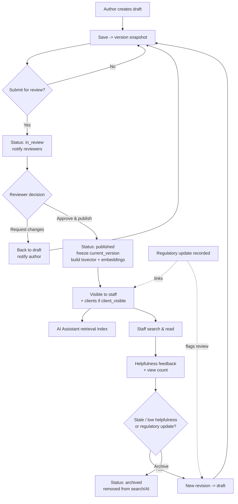
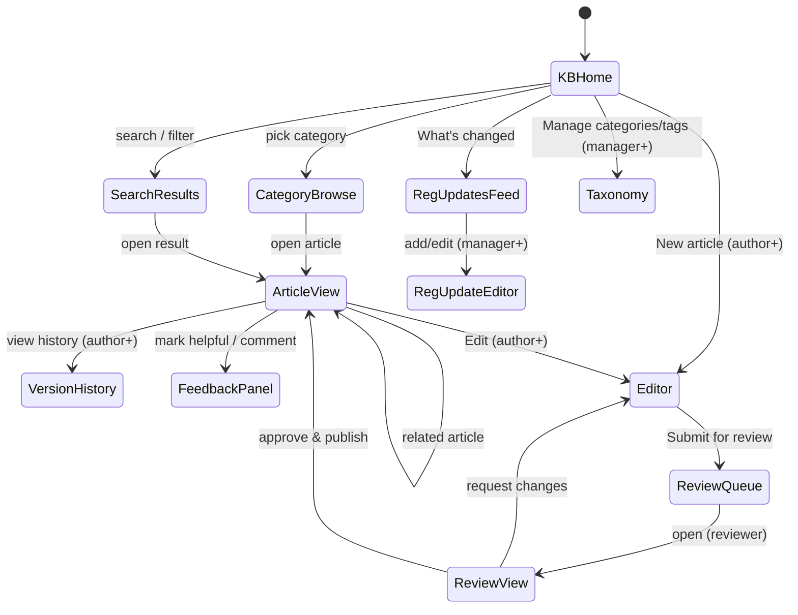
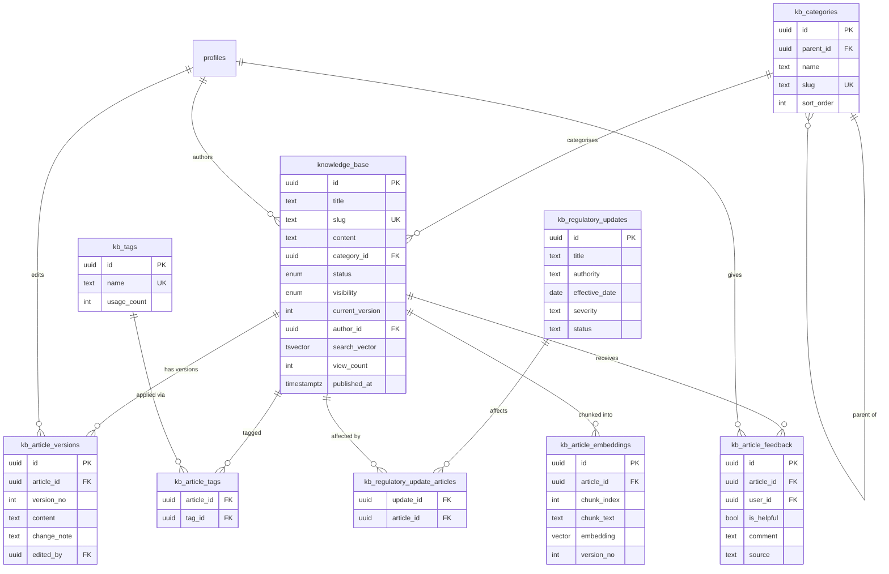
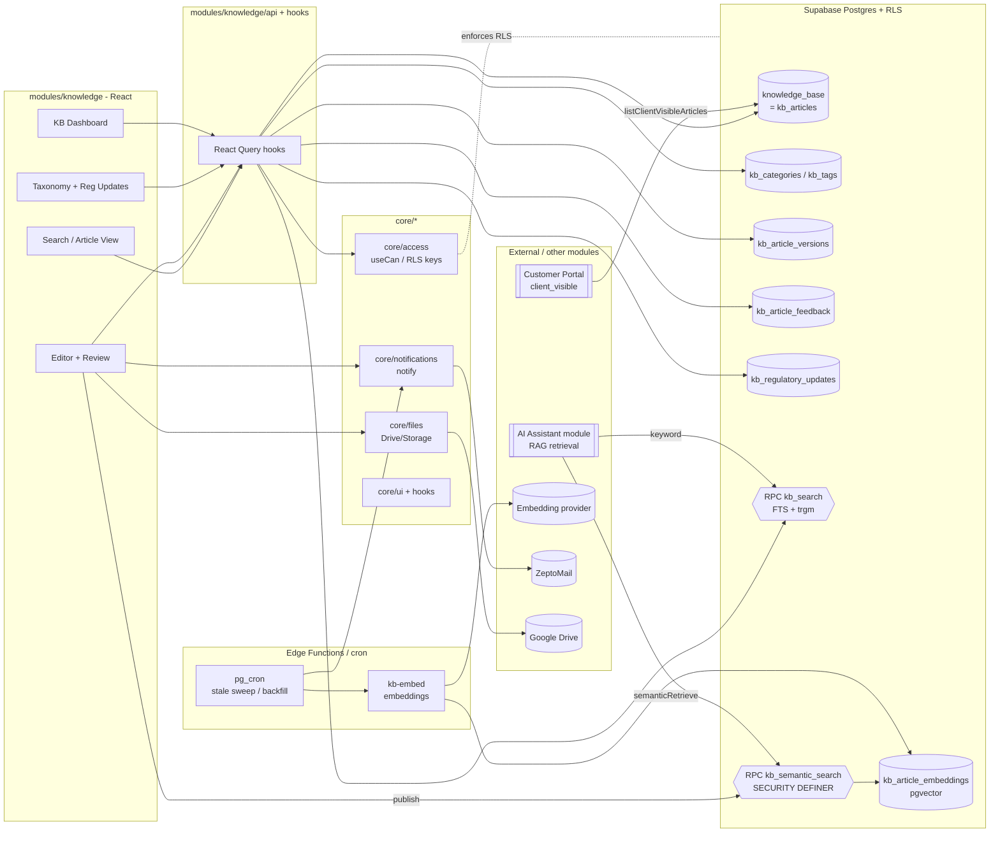

# Module Design — Knowledge Base

**Module key:** `knowledge`
**Anchor entities:** Article, Category, Version, Feedback, Regulatory Update
**Primary users:** All staff (read); Executives (author drafts); Managers & Directors (review, publish, govern taxonomy)
**Status:** Design (Phase D). Absorbs & extends the existing `knowledge_base` table.
**Depends on Core:** `core/auth`, `core/access`, `core/notifications`, `core/files`, `core/ui`, `core/hooks`, `core/utils`. Consumed by the **AI Assistant** module (as a retrieval source) and the **Customer Portal** module (client-visible articles).

---

## 1. Purpose & scope

**Business capability.** A single internal source of truth for TPS's institutional knowledge: Standard Operating Procedures (SOPs), regulatory reference material (FSSR 2011, FSS Labelling & Display Regulations 2020, ISO 22000/9001/17021 clauses, IAF MD 5), work instructions, templates, and FAQs. It turns tribal knowledge (currently spread across WhatsApp, Drive, and people's heads) into curated, versioned, searchable, governed articles that also feed the AI Assistant.

**Who uses it.**
- **All staff** — search and read published articles while executing regulatory/certification work.
- **Executives / Regulatory / Auditors** — author drafts, submit for review, give helpfulness feedback.
- **Managers / Directors** — review, approve, publish, retire; own categories/taxonomy and the regulatory update feed.
- **AI Assistant module** — retrieves published article chunks (semantic + keyword) as grounding context for regulatory Q&A.
- **Customer Portal (external clients)** — reads only articles explicitly marked `client_visible`.

**What it explicitly does NOT do.**
- It is **not** a Document Management System. Binary files (PDFs, DOCX, licences, evidence) live in Module 9 (Document Management) / `core/files`. Knowledge articles are authored, structured text; they may *reference/attach* documents but do not replace document versioning of source files.
- It is **not** the LMS (Module 11). Courses/quizzes/enrolment are separate; an article may be *cited by* a lesson, but the KB does not track completion.
- It does **not** host client-specific case records (those are Operations/Regulatory/CRM). Client-visible articles are *general* guidance, not per-client data.
- It does **not** itself run the AI chat loop — it exposes retrieval; the AI Assistant module owns conversations, prompts, and tools.
- It does **not** crawl FSSAI/NABCB portals automatically (see §11 — the regulatory feed is curated, optionally seeded by an Admin-configured source).

---

## 2. Business workflow

### 2.1 Authoring & publishing (core loop)
1. An **author** (executive/regulatory/manager) creates a **draft** article: picks a **category**, adds a title, body (Markdown), summary, tags, sets **visibility** (`internal` default, or `client_visible`), and optionally a **regulatory reference** (e.g. "FSSR 2.3.1", "ISO 22000:2018 §7.4").
2. Author saves — a `knowledge_base` row is created in `draft` status; each save writes an immutable **version snapshot**.
3. Author **submits for review** → status `in_review`. A review task/notification goes to Managers/Directors.
4. A **reviewer** reads, adds inline review notes/comments, and either **requests changes** (→ back to `draft`, author notified) or **approves & publishes** (→ `published`, `published_at` set, `current_version` frozen, `search_vector` + embeddings (re)built).
5. On publish, the article becomes visible to all staff (and to clients if `client_visible`). The AI Assistant retrieval index picks it up.
6. Over time an article is **edited** (new draft revision off the published one), re-reviewed, and **re-published** — version history is preserved and diffable.
7. Stale content is **archived** (soft, `archived` status) — removed from search/AI retrieval but retained for audit; can be restored.

### 2.2 Search & consumption
1. Any staff user searches ("labelling nutraceutical iron limit"). The system runs **hybrid search**: Postgres full-text (`tsvector` + `pg_trgm` fuzzy) **and** semantic (pgvector nearest-neighbour) over published articles the user may see.
2. Results are ranked, snippet-highlighted, filtered by category/tag/visibility. User opens an article; a **view** increments `view_count`.
3. User marks the article **helpful / not helpful** and optionally leaves a comment → `kb_article_feedback`. Low helpfulness surfaces the article for author review.

### 2.3 Regulatory update feed
1. A Manager/Director records a **regulatory update** (e.g. "FSSAI notification dated 2026-05-10 revising vitamin D upper limit"), links affected article(s), sets effective date and severity.
2. Staff see the update in a "What's changed" feed; linked articles are flagged **"review recommended"**.
3. The linked article is edited → re-reviewed → re-published, and the update is marked **actioned**.

### 2.4 Flowchart

---

## 3. Screen flow

### 3.1 Navigation & routes

### 3.2 Screen inventory

| Screen | Route | Purpose | Min permission |
|---|---|---|---|
| KB Home / Search | `/knowledge` | Search bar, category tiles, recent & popular, "What's changed" teaser | `knowledge.article.read` |
| Search Results | `/knowledge/search?q=&cat=&tag=` | Hybrid search results, snippets, facet filters (URL-persisted) | `knowledge.article.read` |
| Category Browse | `/knowledge/category/:slug` | Articles under a category (tree) | `knowledge.article.read` |
| Article View | `/knowledge/a/:slug` | Rendered article, metadata, attachments, related, feedback widget | `knowledge.article.read` |
| Version History | `/knowledge/a/:slug/history` | Version list + side-by-side diff | `knowledge.article.update` |
| Editor | `/knowledge/a/:slug/edit`, `/knowledge/new` | Markdown editor, metadata, visibility, tags, attachments, autosave→version | `knowledge.article.create` / `.update` |
| Review Queue | `/knowledge/review` | Articles in `in_review` assigned/available to reviewer | `knowledge.article.review` |
| Review View | `/knowledge/review/:id` | Read + review notes + approve/request-changes/publish | `knowledge.article.review` |
| Regulatory Updates Feed | `/knowledge/updates` | Timeline of regulatory updates + affected articles | `knowledge.article.read` |
| Reg Update Editor | `/knowledge/updates/new`, `/:id/edit` | Create/edit an update, link articles | `knowledge.regulatory.manage` |
| Taxonomy Admin | `/knowledge/taxonomy` | CRUD categories (tree) & tags, merge/rename | `knowledge.category.manage` |
| KB Dashboard | `/knowledge/dashboard` | KPIs, review backlog, stale/low-helpfulness (manager+) | `knowledge.article.review` |

---

## 4. Database design

Schema: public (module-owned tables prefixed `kb_`; the existing `knowledge_base` table is **evolved in place**, see §4.3). New extensions required: `pg_trgm` (fuzzy FTS) and `vector` (pgvector, semantic). `pg_cron`/`pg_net` already present.

### 4.1 Tables

**`knowledge_base`** — *the Article (evolved existing table; conceptually `kb_articles`)*
| Column | Type | Notes |
|---|---|---|
| id | uuid PK | existing |
| title | text NOT NULL | existing |
| slug | text UNIQUE | **new** — URL key, generated from title |
| summary | text | **new** — abstract / AI snippet source |
| content | text NOT NULL | existing — body (Markdown) |
| body_format | text default `'markdown'` | **new** — `markdown` \| `html` |
| category_id | uuid FK→kb_categories | **new** — replaces free-text `category` (kept during expand) |
| category | text | existing — **deprecated**, backfilled from category_id then dropped (contract) |
| status | kb_article_status default `'draft'` | **new** enum: `draft`,`in_review`,`published`,`archived` |
| visibility | kb_visibility default `'internal'` | **new** enum: `internal`,`client_visible` |
| is_published | boolean default false | existing — **derived** from status during expand, dropped at contract |
| current_version | int default 1 | **new** — points to published version no. |
| author_id | uuid FK→profiles | **new** (backfilled from `created_by`) |
| reviewer_id | uuid FK→profiles | **new** — last approver |
| regulatory_ref | text | **new** — e.g. "FSSR 2.3.1 (2016)" |
| review_due_on | date | **new** — periodic re-review date |
| published_at | timestamptz | **new** |
| view_count | int default 0 | **new** |
| helpful_count | int default 0 | **new** — denormalised from feedback |
| not_helpful_count | int default 0 | **new** |
| search_vector | tsvector | **new** — GIN-indexed, trigger-maintained |
| created_by | uuid FK→profiles | existing |
| created_at / updated_at | timestamptz | existing (moddatetime) |

Indexes: GIN(`search_vector`), GIN(`title gin_trgm_ops`), btree(`status`,`visibility`), btree(`category_id`), unique(`slug`).

**`kb_categories`** — hierarchical taxonomy
| Column | Type | Notes |
|---|---|---|
| id | uuid PK | |
| parent_id | uuid FK→kb_categories NULL | self-ref tree (e.g. Regulatory → FSSAI → Labelling) |
| name | text NOT NULL | |
| slug | text UNIQUE | |
| description | text | |
| sort_order | int default 0 | |
| is_active | boolean default true | |
| created_at/updated_at | timestamptz | |

**`kb_tags`** — flat controlled vocabulary
| id uuid PK · name text UNIQUE · slug text UNIQUE · usage_count int default 0 · created_at |

**`kb_article_tags`** — junction (M:N)
| article_id uuid FK→knowledge_base · tag_id uuid FK→kb_tags · PK(article_id, tag_id) |

**`kb_article_versions`** — immutable snapshots (versioning)
| Column | Type | Notes |
|---|---|---|
| id | uuid PK | |
| article_id | uuid FK→knowledge_base | |
| version_no | int NOT NULL | unique per article |
| title | text | snapshot |
| content | text | snapshot |
| summary | text | snapshot |
| change_note | text | author's "what changed" |
| status_at_snapshot | kb_article_status | |
| edited_by | uuid FK→profiles | |
| created_at | timestamptz | |
| UNIQUE(article_id, version_no) | | append-only (no update/delete rule) |

**`kb_article_feedback`** — helpfulness + comments
| Column | Type | Notes |
|---|---|---|
| id | uuid PK | |
| article_id | uuid FK→knowledge_base | |
| user_id | uuid FK→profiles NULL | null when submitted via Customer Portal (external) |
| is_helpful | boolean | thumbs up/down |
| comment | text | optional |
| source | text default `'internal'` | `internal` \| `client_portal` |
| created_at | timestamptz | UNIQUE(article_id,user_id) upsert |

**`kb_article_embeddings`** — semantic/RAG chunks (feeds AI Assistant)
| Column | Type | Notes |
|---|---|---|
| id | uuid PK | |
| article_id | uuid FK→knowledge_base ON DELETE CASCADE | |
| chunk_index | int | order within article |
| chunk_text | text | the embedded passage |
| embedding | vector(1536) | pgvector; model-configurable dim |
| token_count | int | |
| version_no | int | which article version was embedded |
| created_at | timestamptz | |

Index: `ivfflat`/`hnsw` on `embedding vector_cosine_ops`; btree(`article_id`).

**`kb_regulatory_updates`** — curated regulatory update feed
| Column | Type | Notes |
|---|---|---|
| id | uuid PK | |
| title | text NOT NULL | |
| body | text | summary of the change |
| authority | text | `FSSAI` \| `NABCB` \| `BIS` \| `ISO` \| other |
| reference_no | text | notification/circular no. |
| effective_date | date | |
| severity | text | `info` \| `action_required` \| `critical` |
| status | text default `'open'` | `open` \| `actioned` \| `dismissed` |
| created_by | uuid FK→profiles | |
| created_at/updated_at | timestamptz | |

**`kb_regulatory_update_articles`** — junction linking an update to affected articles
| update_id uuid FK→kb_regulatory_updates · article_id uuid FK→knowledge_base · PK(update_id, article_id) |

### 4.2 ER diagram

### 4.3 RLS intent per table

| Table | Read | Write |
|---|---|---|
| `knowledge_base` | `status='published' AND visibility='internal'` for any authenticated staff; own drafts; `has_role('super_admin','director','manager')` sees all. **Client-visible** rows exposed to the Customer Portal via a dedicated policy/`security definer` view keyed to `visibility='client_visible' AND status='published'`. | insert/update: `knowledge.article.*` holders (author owns draft; publish/archive gated to reviewer roles). |
| `kb_categories`, `kb_tags` | all staff read | write: `knowledge.category.manage` / `knowledge.tag.manage` (manager+). |
| `kb_article_tags` | follows parent article read | write with `knowledge.article.update`. |
| `kb_article_versions` | `knowledge.article.update` holders + article author | insert only (append-only rule; no update/delete). |
| `kb_article_feedback` | aggregate readable by all; row detail to `knowledge.feedback.read` (author+manager). | insert: any staff (`knowledge.feedback.submit`); client_portal inserts via Customer Portal service. |
| `kb_article_embeddings` | not exposed to normal clients; read via `security definer` RPC used by AI Assistant service role only. | written by reindex Edge Function (service role). |
| `kb_regulatory_updates` (+ junction) | all staff read | write: `knowledge.regulatory.manage`. |

### 4.4 Expand–contract vs existing `knowledge_base`

- **Expand (additive, non-breaking):** add all new columns as nullable/defaulted; create `kb_*` tables; add extensions `pg_trgm`, `vector`; add `search_vector` + trigger; backfill `category_id` from `category`, `author_id` from `created_by`, `status` from `is_published` (`true→published`, `false→draft`); seed one version snapshot per existing row.
- **Coexistence:** keep old columns (`category`, `is_published`) writable and mirrored via trigger so any un-migrated V1 reader still works. New module writes `status`/`category_id`; a sync trigger keeps `is_published`/`category` consistent.
- **Contract (after all readers flipped):** drop `is_published` and free-text `category`; make `category_id`, `author_id`, `slug`, `status` NOT NULL. Existing RLS policies (`knowledge_base_select_published`, `..._write_manager_up`, `..._update_manager_up`) are **superseded** by the permission-keyed policies above — replaced in the same migration that introduces the granular permission checks.
- Table is **not renamed** (avoids breaking FKs/policies); the module refers to it as `kb_articles` through its `api/` layer and an optional `kb_articles` view.

---

## 5. API design

Module `api/*` = thin typed Supabase wrappers; hooks wrap them in React Query with keys `['knowledge', entity, ...params]`.

| Function / RPC | Inputs | Output | Authz |
|---|---|---|---|
| `listArticles(filter)` | category, tag, status, visibility, page | `Article[]` + count | RLS; `knowledge.article.read` |
| `getArticle(slug)` | slug | `Article` (+category,tags,attachments) | RLS |
| `searchArticles(q, filters)` **RPC** `kb_search` | query text, category/tag, limit | ranked `{article, snippet, rank}[]` — hybrid FTS + trgm | RLS; `knowledge.article.read` |
| `semanticRetrieve(q, k)` **RPC** `kb_semantic_search` (SECURITY DEFINER) | query embedding, k, visibility scope | `{chunk_text, article_id, similarity}[]` | service role / `knowledge.article.read`; **used by AI Assistant** |
| `createArticle(input)` | title, content, category_id, tags, visibility, regulatory_ref | `Article` (draft) + version 1 | `knowledge.article.create` |
| `updateArticle(id, patch)` | fields; writes new version snapshot | `Article` | `knowledge.article.update` (owner or reviewer) |
| `submitForReview(id)` | id | `Article` (`in_review`) | `knowledge.article.submit` |
| `reviewArticle(id, decision, notes)` | approve\|request_changes, notes | `Article` | `knowledge.article.review` |
| `publishArticle(id)` **RPC** `kb_publish` | id | sets `published`, freezes version, enqueues reindex | `knowledge.article.publish` |
| `archiveArticle(id)` / `restoreArticle(id)` | id | `Article` | `knowledge.article.archive` |
| `listVersions(articleId)` / `diffVersions(a,b)` | ids | version list / diff | `knowledge.article.update` |
| `submitFeedback(articleId, isHelpful, comment)` | | `Feedback` (upsert) | `knowledge.feedback.submit` |
| `listFeedback(articleId)` | | `Feedback[]` + aggregates | `knowledge.feedback.read` |
| `crudCategory` / `crudTag` / `mergeTag` | | entity | `knowledge.category.manage` / `.tag.manage` |
| `crudRegulatoryUpdate`, `linkUpdateArticles`, `setUpdateStatus` | | `RegulatoryUpdate` | `knowledge.regulatory.manage` |
| `reindexArticle(id)` **Edge Function** `kb-embed` | article id/version | writes `kb_article_embeddings` | service role (invoked on publish + cron) |

Cross-module public API (`modules/knowledge/index.ts`): exports `semanticRetrieve` and `getPublishedArticle` for the **AI Assistant** module, and `listClientVisibleArticles` for the **Customer Portal** module. No other module touches KB internals.

---

## 6. Permissions

Keys namespaced `knowledge.<entity>.<action>`, registered via `modules/knowledge/permissions.ts` and aggregated into `PERMISSIONS`.

| Permission | executive | accounts / hr | auditor | manager | director | super_admin |
|---|:--:|:--:|:--:|:--:|:--:|:--:|
| `knowledge.article.read` | ✅ | ✅ | ✅ | ✅ | ✅ | ✅ |
| `knowledge.article.create` | ✅ | — | — | ✅ | ✅ | ✅ |
| `knowledge.article.update` | own | — | — | ✅ | ✅ | ✅ |
| `knowledge.article.submit` | ✅ | — | — | ✅ | ✅ | ✅ |
| `knowledge.article.review` | — | — | — | ✅ | ✅ | ✅ |
| `knowledge.article.publish` | — | — | — | ✅ | ✅ | ✅ |
| `knowledge.article.archive` | — | — | — | ✅ | ✅ | ✅ |
| `knowledge.article.delete` | — | — | — | — | ✅ | ✅ |
| `knowledge.article.set_visibility` (client_visible) | — | — | — | ✅ | ✅ | ✅ |
| `knowledge.feedback.submit` | ✅ | ✅ | ✅ | ✅ | ✅ | ✅ |
| `knowledge.feedback.read` | own articles | — | ✅ | ✅ | ✅ | ✅ |
| `knowledge.category.manage` | — | — | — | ✅ | ✅ | ✅ |
| `knowledge.tag.manage` | — | — | — | ✅ | ✅ | ✅ |
| `knowledge.regulatory.manage` | — | — | — | ✅ | ✅ | ✅ |
| `knowledge.embedding.reindex` | — | — | — | — | ✅ | ✅ (+ service role) |

**RLS mapping.** Read policies check `has_permission(auth.uid(),'knowledge.article.read')` plus the status/visibility predicate. Write/publish policies check the corresponding permission key (via the platform's `has_permission()` / `has_role()` helpers), making the DB — not the UI — authoritative. `set_visibility` gates the `client_visible` flag independently so a regular author cannot expose content to clients.

---

## 7. Dashboard

Route `/knowledge/dashboard` (manager+). Widgets:

| Widget | Metric | Source |
|---|---|---|
| Review backlog | count `status='in_review'`, oldest age | `knowledge_base` |
| Publishing throughput | articles published this month vs last | `kb_article_versions` / `published_at` |
| Stale content | `published` with `review_due_on < now()` or no update in N months | `knowledge_base` |
| Low-helpfulness | articles where `not_helpful_count > helpful_count` (min N feedback) | denormalised counters |
| Most viewed / most helpful | top 10 by `view_count`, by helpful ratio | `knowledge_base` |
| Coverage by category | article count per category tree | `kb_categories` + `knowledge_base` |
| Regulatory updates open | count `status='open'`, by severity | `kb_regulatory_updates` |
| Embedding freshness | articles whose published `version_no` ≠ embedded `version_no` | `knowledge_base` vs `kb_article_embeddings` |

Staff (non-manager) KB Home shows lightweight tiles: recently updated, most helpful, "What's changed" (regulatory feed).

---

## 8. Reports

| Report | Columns | Filters | Export |
|---|---|---|---|
| Article inventory | title, category, status, visibility, author, current_version, published_at, review_due | category, status, visibility, author | CSV, XLSX |
| Review activity | article, submitted_at, reviewer, decision, turnaround days | date range, reviewer | CSV, XLSX |
| Feedback report | article, helpful, not_helpful, ratio, latest comments | category, date range, source (internal/client) | CSV, XLSX |
| Usage / popularity | article, views, helpful ratio, last viewed | date range, category | CSV, XLSX |
| Regulatory updates log | update, authority, ref no., effective date, severity, status, affected articles | authority, severity, status, date | CSV, PDF |
| Stale-content audit | article, last published, review_due, days overdue | overdue only | CSV, XLSX |

Exports via `core/ui` DataTable export; PDF for the regulatory log through the shared PDF helper.

---

## 9. Notifications

Via `core/notifications` only; `notification_type` enum extended with the `knowledge.*` types. Channels gated by settings.

| Event | notification_type | Recipients | Channels |
|---|---|---|---|
| Article submitted for review | `knowledge.review_requested` | reviewers (manager/director) | in-app, email |
| Review: changes requested | `knowledge.changes_requested` | article author | in-app, email |
| Article published | `knowledge.article_published` | author + optional subscribers of the category | in-app |
| Regulatory update (action/critical) recorded | `knowledge.regulatory_update` | all staff (or affected-article authors) | in-app, email |
| Article past `review_due_on` | `knowledge.review_due` | author + managers | in-app, email (digest) |
| Article flagged low-helpfulness (threshold crossed) | `knowledge.low_helpfulness` | author + managers | in-app |
| New client_visible article published | `knowledge.client_article_published` | (optional) Customer Portal digest | in-app (portal) |

---

## 10. Automations

| Job | Type | Trigger / cadence | Action |
|---|---|---|---|
| Maintain `search_vector` | DB trigger | on insert/update of title/summary/content | rebuild `tsvector` (weighted title>summary>body) |
| Sync legacy columns | DB trigger | on status/category_id change (during coexistence) | mirror `is_published`/`category` |
| Version snapshot | DB trigger / api | on article save | append `kb_article_versions` row, bump version |
| Denormalise feedback counters | DB trigger | on `kb_article_feedback` insert/update | update `helpful_count`/`not_helpful_count`; fire `low_helpfulness` when threshold crossed |
| Re-embed on publish | event → Edge Function | on `kb_publish` | `kb-embed` chunks + writes `kb_article_embeddings` for new version |
| Embedding backfill / drift repair | pg_cron → Edge Function | nightly | re-embed articles whose embedded version ≠ current, or missing embeddings |
| Stale-review sweep | pg_cron | daily | flag articles past `review_due_on`; enqueue `review_due` notifications (digest) |
| Tag usage recount | pg_cron | weekly | recompute `kb_tags.usage_count`, prune orphan tags |

All Edge Function invocations gated by `app_settings` flags so staging stays sandboxed (no real embedding-API calls unless enabled).

---

## 11. Integrations

| System | Purpose | Boundary / adapter |
|---|---|---|
| **AI Assistant module (internal)** | KB is a **retrieval source** for regulatory Q&A / RAG | AI Assistant calls `semanticRetrieve()` / `kb_semantic_search` RPC + `kb_search`; KB exposes only published, permission-scoped chunks. No coupling to conversation state. |
| **Embedding provider** (OpenAI-compatible / Supabase AI) | generate `vector(1536)` embeddings | `kb-embed` Edge Function; provider + model + dim configurable in `app_settings`; key in Supabase Vault; gated by flag. |
| **Google Drive / `core/files`** | attach source docs (SOP PDFs, templates) to articles | via `core/files` `useDrive()`/`uploadFile()`; KB stores references, not binaries; `disableConversionToGoogleType: true`. |
| **Customer Portal module** | serve `client_visible` articles to external clients | KB exports `listClientVisibleArticles()`; portal never queries `knowledge_base` directly — security-definer view enforces visibility. |
| **ZeptoMail (email)** | review/publish/regulatory notifications | through `core/notifications` dispatch adapter only. |
| **FSSAI FoSCoS / NABCB portals** | *(future, out of scope now)* seed regulatory updates | manual curation today; optional future adapter writes drafts to `kb_regulatory_updates` for human review — never auto-publishes. |

---

## 12. Future scalability

- **10× articles / search volume:** FTS scales on GIN; semantic search moves ivfflat→HNSW and, if needed, a dedicated `vector`-tuned index or external vector store behind the same `semanticRetrieve` contract (callers unaffected).
- **Chunking & cost:** embedding is incremental (only changed/new versions); backfill is throttled via cron batches. Model/dim are config-driven so a provider swap is a settings change + one reindex.
- **Multi-entity / tenant:** if TPS Xperts (consultancy) and TPS Global Certification later need separate KBs, add an `org_scope`/`entity_id` column + RLS predicate; taxonomy and visibility already support internal-vs-client separation, extendable to entity separation.
- **Client-facing scale:** client-visible articles are served through a cached, read-only security-definer view; heavy read traffic from the Customer Portal is isolated from authoring load.
- **Localisation (future):** article translations modelled as sibling rows linked by a `translation_group_id` (additive) if regional-language SOPs are needed.
- **Rich authoring:** move from Markdown to a structured block/JSON body (`body_format='blocks'`) without schema change — `body_format` already discriminates.

---

## 13. Architecture diagram

---

**Cross-module dependencies:** **AI Assistant** (Module 12) — consumes KB as a RAG retrieval source via `semanticRetrieve`/`kb_semantic_search` + `kb_search`. **Customer Portal** (Module 13) — consumes `client_visible` published articles via `listClientVisibleArticles`. **Document Management** (Module 9) / `core/files` — source-file attachments. **Administration** (Module 15) — embedding-provider & notification settings/Vault keys. Core services: `access`, `notifications`, `files`, `ui`.
