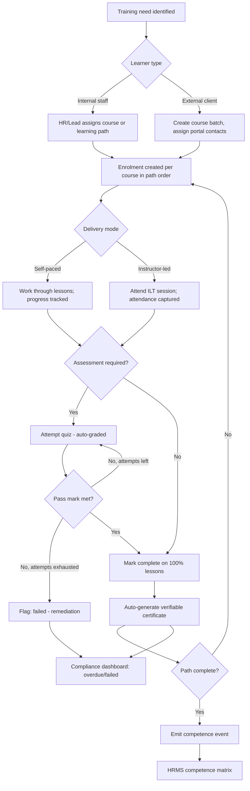
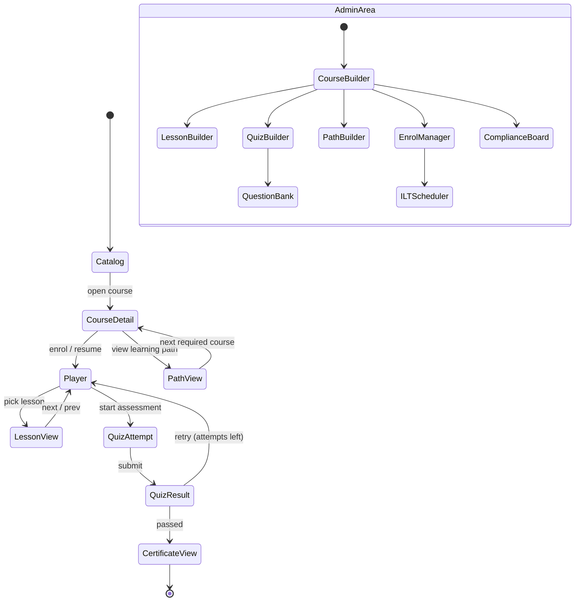
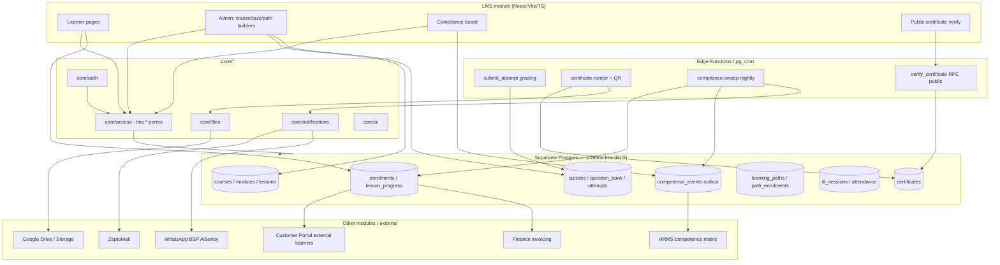

# Module Design — Learning Management System (LMS)

**Module key:** `lms`
**Anchor entities:** Course, Lesson, Enrolment, Quiz, Attempt, Certificate
**Primary users:** HR (internal training & onboarding), Regulatory leads (competence owners), Instructors, all internal staff (learners), external client learners (via Customer Portal)
**Status:** Design (Phase D) — follows `00_ENTERPRISE_ARCHITECTURE.md` §6 template. No code until approved.

> **Scope v2.0: Certification-Body references removed (separate platform).**

---

## 1. Purpose & scope

The LMS is TPS's single system for **delivering, tracking, assessing, and certifying training** — for two distinct audiences whose needs happen to share the same engine:

- **Internal staff learning** — new-hire onboarding paths, FSSAI/FSSR regulatory upskilling, and recurring compliance/refresher training. Completion and competence records **feed HRMS** (staff competence matrix).
- **External learner training** — FoSTaC-style food-safety supervisor courses delivered to client organisations (food business operators). External learners access courses through the **Customer Portal**; the LMS issues **verifiable certificates of completion**.

**Capabilities in scope**
1. Courses & curriculum — courses → modules → lessons; content types video, document/PDF, external link, and **SCORM-lite** (self-contained HTML packages, tracked completion + score, no full SCORM runtime).
2. Enrolments — internal (self, or assigned by HR/manager) and external (assigned to Customer Portal contacts, individually or by batch).
3. Progress tracking — per-lesson state, resumable position, percent complete, time-on-content.
4. Assessments — question bank, quiz assembly, timed/limited attempts, pass mark, auto-grading, item randomisation.
5. Certificates — auto-generated on pass/completion, PDF, publicly **verifiable by certificate number/QR**.
6. Learning paths — ordered, role-based required-training bundles (e.g. "New Regulatory Associate" path) with prerequisites and target due dates.
7. Compliance training tracking — who is **due / overdue / expiring**, recurrence (e.g. annual refresher), exported to HRMS competence status.
8. Instructor-led (ILT) session scheduling — classroom/virtual sessions, roster, attendance capture, feeding the same completion record.

**Explicitly NOT in scope (handled by other modules / deferred)**
- **Not** the competence matrix system of record — LMS *emits* completion/competence events; **HRMS** owns the employee competence matrix and appraisal linkage.
- **Not** payment/invoicing for paid external courses — **Finance & Accounts** owns invoicing; LMS exposes an enrolment reference.
- **Not** a full SCORM/xAPI LRS, live video conferencing, or a proctoring service (ILT virtual sessions link out to the meeting tool; proctoring is future scope).
- **Not** the FoSTaC/FoSCoS government system of record — official FoSTaC issuance stays on FSSAI's portal; LMS runs TPS's internal preparation/mock training and TPS-branded completion certificates (see §11).

---

## 2. Business workflow

### 2A. Internal competence path (new Regulatory Associate — grounded example)
1. HR lead assigns the **"New Regulatory Associate" learning path** to a new employee (or the path auto-assigns on HRMS role = "Trainee Associate").
2. System creates enrolments for each course in the path, in prerequisite order, with a target due date.
3. Learner works through lessons (FSSAI/FSSR regulations, nutraceutical labelling, documentation, report writing); progress is tracked per lesson.
4. Each course ends with a **quiz** (pass mark, e.g. 70%); attempts are auto-graded.
5. On passing all path courses, LMS issues a **certificate** per course and marks the path complete.
6. LMS emits a **competence event** → HRMS updates the staff competence matrix.
7. Recurrence: refresher training (e.g. annual code updates) re-opens an enrolment when due; overdue learners surface on the compliance dashboard.

### 2B. External FoSTaC-style course (food-safety supervisor)
1. Sales/Regulatory creates a **course batch** for a client and assigns external learners (Customer Portal contacts) — individually or by CSV batch.
2. Learners receive an invite (email/WhatsApp via Core notifications) and access the course through the **Customer Portal**.
3. Learner completes lessons + passes the assessment.
4. LMS auto-issues a **verifiable completion certificate** (TPS-branded, QR-verifiable).
5. Certificate/attendance data is available to Sales/Finance for the client engagement record.

### 2C. Instructor-led session
1. Instructor schedules an **ILT session** (date, mode classroom/virtual, capacity) attached to a course.
2. Learners are enrolled onto the session (internal roster or external batch).
3. On the day, instructor captures **attendance**; attendance marks the corresponding lesson/course complete.
4. Optional post-session quiz + certificate as in 2A/2B.

---

## 3. Screen flow

**Screen inventory**

| Route | Screen | Who | Purpose |
|---|---|---|---|
| `/lms` | Learner dashboard | All learners | My courses, due/overdue, resume, certificates |
| `/lms/catalog` | Course catalog | All | Browse/search available courses & paths |
| `/lms/courses/:id` | Course detail | All | Overview, curriculum, enrol/resume |
| `/lms/courses/:id/learn` | Course player | Enrolled | Lesson navigation, content, progress |
| `/lms/courses/:id/quiz/:quizId` | Quiz attempt | Enrolled | Timed attempt, question navigation |
| `/lms/attempts/:attemptId/result` | Quiz result | Learner | Score, pass/fail, review |
| `/lms/paths/:id` | Learning path | Enrolled | Ordered required courses, progress |
| `/lms/certificates/:id` | Certificate view | Learner | View/download PDF |
| `/verify/cert/:certNo` | Public verification | Public (no auth) | Verify certificate authenticity + QR |
| `/lms/admin/courses` | Course builder (list/edit) | `lms.course.manage` | Create/edit courses, modules, lessons |
| `/lms/admin/questions` | Question bank | `lms.question.manage` | Manage question pool by tag/topic |
| `/lms/admin/quizzes` | Quiz builder | `lms.quiz.manage` | Assemble quizzes, rules, pass mark |
| `/lms/admin/paths` | Path builder | `lms.path.manage` | Define role-based required training |
| `/lms/admin/enrolments` | Enrolment manager | `lms.enrolment.manage` | Assign/batch, external learners |
| `/lms/admin/sessions` | ILT scheduler | `lms.session.manage` | Schedule sessions, rosters, attendance |
| `/lms/admin/compliance` | Compliance board | `lms.compliance.view` | Due/overdue/expiring, per role/dept |
| `/lms/admin/reports` | LMS reports | `lms.report.view` | Completion, assessment, compliance exports |

---

## 4. Database design

Schema: `lms` (own Postgres schema; RLS on every table per Enterprise §1.3). External learners link to a Customer Portal contact rather than an `auth.users` staff row.

```mermaid
erDiagram
  courses ||--o{ course_modules : contains
  course_modules ||--o{ lessons : contains
  courses ||--o{ quizzes : has
  quizzes ||--o{ quiz_questions : includes
  question_bank ||--o{ quiz_questions : sourced_from
  quiz_questions ||--o{ question_options : has
  courses ||--o{ enrolments : target_of
  learners ||--o{ enrolments : holds
  enrolments ||--o{ lesson_progress : tracks
  lessons ||--o{ lesson_progress : recorded_for
  enrolments ||--o{ attempts : produces
  quizzes ||--o{ attempts : assessed_by
  attempts ||--o{ attempt_answers : records
  quiz_questions ||--o{ attempt_answers : answered
  enrolments ||--o| certificates : yields
  learning_paths ||--o{ path_courses : sequences
  courses ||--o{ path_courses : member_of
  learning_paths ||--o{ path_enrolments : assigned_as
  learners ||--o{ path_enrolments : holds
  courses ||--o{ ilt_sessions : scheduled_for
  ilt_sessions ||--o{ session_attendance : records
  enrolments ||--o{ session_attendance : linked_to
  courses ||--o{ competence_links : maps_to
  enrolments ||--o{ competence_events : emits

  courses {
    uuid id PK
    text title
    text slug
    text description
    text audience "internal|external|both"
    text category "onboarding|fssai|compliance|fostac|other"
    int pass_mark_default
    int validity_months "null=no expiry; drives recurrence"
    text status "draft|published|archived"
    uuid owner_id FK
    timestamptz created_at
  }
  course_modules {
    uuid id PK
    uuid course_id FK
    text title
    int sort_order
  }
  lessons {
    uuid id PK
    uuid module_id FK
    text title
    text content_type "video|document|link|scorm_lite|text"
    text content_ref "storage path / drive id / url"
    int duration_sec
    int sort_order
    bool is_mandatory
  }
  quizzes {
    uuid id PK
    uuid course_id FK
    text title
    int pass_mark
    int time_limit_sec "null=untimed"
    int max_attempts "null=unlimited"
    int question_count "drawn from pool"
    bool randomize
  }
  question_bank {
    uuid id PK
    text topic_tag
    text stem
    text qtype "single|multi|truefalse"
    text difficulty
    int default_marks
    text status "active|retired"
  }
  quiz_questions {
    uuid id PK
    uuid quiz_id FK
    uuid question_id FK
    int marks
    int sort_order
  }
  question_options {
    uuid id PK
    uuid question_id FK
    text option_text
    bool is_correct
    int sort_order
  }
  learners {
    uuid id PK
    text learner_type "internal|external"
    uuid employee_id FK "HRMS ref, if internal"
    uuid portal_contact_id FK "Customer Portal ref, if external"
    text full_name
    text email
    timestamptz created_at
  }
  enrolments {
    uuid id PK
    uuid course_id FK
    uuid learner_id FK
    uuid path_enrolment_id FK "null if standalone"
    text source "self|assigned|batch|path"
    text status "not_started|in_progress|completed|failed|expired"
    int percent_complete
    date due_date
    date completed_on
    date expires_on
    uuid assigned_by FK
    timestamptz created_at
  }
  lesson_progress {
    uuid id PK
    uuid enrolment_id FK
    uuid lesson_id FK
    text state "not_started|in_progress|completed"
    int position_sec "resume point"
    int score "scorm_lite score, nullable"
    timestamptz completed_at
  }
  attempts {
    uuid id PK
    uuid enrolment_id FK
    uuid quiz_id FK
    int attempt_no
    int score_pct
    bool passed
    timestamptz started_at
    timestamptz submitted_at
  }
  attempt_answers {
    uuid id PK
    uuid attempt_id FK
    uuid quiz_question_id FK
    jsonb selected_option_ids
    bool is_correct
    int marks_awarded
  }
  certificates {
    uuid id PK
    uuid enrolment_id FK
    text certificate_no UK "human+QR verifiable"
    uuid learner_id FK
    uuid course_id FK
    date issued_on
    date valid_until
    text pdf_path "storage"
    text verify_hash "tamper check"
    text status "valid|revoked"
  }
  learning_paths {
    uuid id PK
    text title
    text target_role "HRMS role key; drives auto-assign"
    text audience "internal|external|both"
    text status "draft|published|archived"
  }
  path_courses {
    uuid id PK
    uuid path_id FK
    uuid course_id FK
    int sort_order
    bool is_required
    uuid prerequisite_course_id FK "nullable"
  }
  path_enrolments {
    uuid id PK
    uuid path_id FK
    uuid learner_id FK
    text status "in_progress|completed"
    date due_date
    date completed_on
  }
  ilt_sessions {
    uuid id PK
    uuid course_id FK
    text mode "classroom|virtual"
    text location_or_link
    timestamptz starts_at
    timestamptz ends_at
    int capacity
    uuid instructor_id FK
    text status "scheduled|running|completed|cancelled"
  }
  session_attendance {
    uuid id PK
    uuid session_id FK
    uuid enrolment_id FK
    text status "present|absent|excused"
    timestamptz marked_at
    uuid marked_by FK
  }
  competence_links {
    uuid id PK
    uuid course_id FK
    text competence_code "HRMS competence key"
    text link_type "hrms_competence"
  }
  competence_events {
    uuid id PK
    uuid enrolment_id FK
    uuid learner_id FK
    text competence_code
    text event "attained|expired|revoked"
    date effective_on
    bool consumed "picked up by HRMS"
    timestamptz created_at
  }
```

**Key enums**
- `content_type`: video · document · link · scorm_lite · text
- `enrolment.status`: not_started · in_progress · completed · failed · expired
- `course.audience` / `path.audience`: internal · external · both
- `certificate.status`: valid · revoked
- `competence_event.event`: attained · expired · revoked

**RLS intent per table**

| Table | Read | Write |
|---|---|---|
| `courses`, `course_modules`, `lessons` | published rows: any authenticated learner whose `audience` matches; drafts: `lms.course.manage` | `lms.course.manage` |
| `question_bank`, `quiz_questions`, `question_options` | **never exposed to learners** (correct answers); `lms.question.manage` only | `lms.question.manage` |
| `quizzes` | learners see metadata (title, attempts, pass mark) but not answer keys; questions served via RPC | `lms.quiz.manage` |
| `learners` | own row; managers/HR see internal; external limited to Customer Portal linkage | `lms.enrolment.manage` (create); self for profile fields |
| `enrolments` | own enrolments; `lms.enrolment.view` for team/all | learner (self status transitions) + `lms.enrolment.manage` |
| `lesson_progress`, `attempts`, `attempt_answers` | own only; `lms.report.view` aggregate | own (during attempt), server functions finalize |
| `certificates` | own + `lms.certificate.view`; **public verify via RPC only** (no table select) | server (issue), `lms.certificate.manage` (revoke) |
| `learning_paths`, `path_courses` | published visible; drafts by `lms.path.manage` | `lms.path.manage` |
| `path_enrolments` | own + `lms.enrolment.view` | `lms.enrolment.manage` |
| `ilt_sessions`, `session_attendance` | roster + `lms.session.manage` | `lms.session.manage` |
| `competence_links`, `competence_events` | `lms.compliance.view` + consuming modules (HRMS service role) | server-emitted; consumers flip `consumed` |

**Expand-contract notes**
- All additive first. New content types (e.g. `interactive`) added to a check constraint / enum by expand, never repurposing existing values.
- `learners` decouples LMS from `auth.users` so external (non-auth) learners and future SSO both fit without schema breakage.
- Certificate verification uses `verify_hash` so the public verify RPC never needs to widen table RLS.
- `competence_events` is an **outbox**: LMS writes, HRMS consumes and sets `consumed=true` — no cross-schema FK coupling, safe to evolve each side independently.

---

## 5. API design

Module `api/*` functions are thin typed Supabase wrappers; sensitive logic (grading, certificate issue, verification, competence emit) runs in **RPCs / Edge Functions** so RLS and integrity hold server-side.

| Function / RPC | Inputs | Output | Authz |
|---|---|---|---|
| `listCatalog(filters)` | audience, category, search | Course[] | authenticated; audience-scoped |
| `getCourse(id)` | course id | Course + modules + lessons | enrolled or `lms.course.view` |
| `enrolSelf(courseId)` | courseId | Enrolment | course audience allows self-enrol |
| `assignEnrolments(courseId, learnerIds[], dueDate)` | ids | Enrolment[] | `lms.enrolment.manage` |
| `batchEnrolExternal(courseId, csv/contactIds[])` | contacts | Enrolment[] + invites | `lms.enrolment.manage` |
| `updateLessonProgress(enrolId, lessonId, state, positionSec, score?)` | progress | LessonProgress | owner of enrolment (RLS) |
| `rpc: start_attempt(enrolId, quizId)` | ids | attempt + served questions (no answer keys) | owner; enforces `max_attempts`, time limit |
| `rpc: submit_attempt(attemptId, answers[])` | answers | score, passed, breakdown | owner; **server auto-grades**, writes attempt_answers |
| `rpc: issue_certificate(enrolId)` | enrolId | Certificate | server-triggered on pass/complete; idempotent |
| `rpc: verify_certificate(certNo)` | certNo | {valid, course, learnerName, issuedOn, validUntil, status} | **public**, no auth; returns minimal fields |
| `rpc: revoke_certificate(certId, reason)` | id, reason | Certificate | `lms.certificate.manage` |
| `createCourse / updateCourse / publishCourse` | course payload | Course | `lms.course.manage` |
| `upsertQuestion / retireQuestion` | question payload | Question | `lms.question.manage` |
| `buildQuiz(courseId, rules)` | pool/tags, count, pass mark, time | Quiz | `lms.quiz.manage` |
| `definePath(payload)` / `assignPath(pathId, learnerIds[])` | path + learners | Path / PathEnrolment[] | `lms.path.manage` / `lms.enrolment.manage` |
| `scheduleSession(courseId, payload)` | session | IltSession | `lms.session.manage` |
| `markAttendance(sessionId, rows[])` | roster marks | Attendance[] | `lms.session.manage` |
| `rpc: emit_competence(enrolId)` | enrolId | competence_events row | server-triggered on completion |
| `getComplianceStatus(scope)` | role/dept/date | due/overdue/expiring rows | `lms.compliance.view` |

**Edge Functions**
- `certificate-render` — generates the PDF (template + QR to `/verify/cert/:certNo`), stores in `certificates` bucket, sets `pdf_path`/`verify_hash`. Gated by settings.
- `compliance-sweep` — nightly pg_cron trigger; computes overdue/expiring, re-opens recurring enrolments, emits `competence_events` with `event=expired`.

---

## 6. Permissions

Permission keys namespaced `lms.<entity>.<action>` (Enterprise §5). Roles from `core/access`.

| Permission key | Description | Default roles |
|---|---|---|
| `lms.course.view` | Browse catalog / course detail | all authenticated |
| `lms.course.manage` | Create/edit/publish/archive courses, modules, lessons | HR, L&D Admin, Directors |
| `lms.question.manage` | Manage question bank | L&D Admin, Directors |
| `lms.quiz.manage` | Assemble quizzes & rules | L&D Admin, Directors |
| `lms.path.manage` | Define role-based learning paths | HR, L&D Admin, Directors |
| `lms.enrolment.view` | See others' enrolments (team/all) | HR, Managers, Directors |
| `lms.enrolment.manage` | Assign/batch enrol, external learners | HR, L&D Admin, Managers |
| `lms.session.manage` | Schedule ILT, mark attendance | Instructors, L&D Admin |
| `lms.certificate.view` | View others' certificates | HR, Managers, Directors |
| `lms.certificate.manage` | Revoke/re-issue certificates | L&D Admin, Directors |
| `lms.compliance.view` | Compliance/overdue board | HR, Managers, Directors |
| `lms.report.view` | LMS reports & exports | HR, Directors |
| `lms.learn` | Take enrolled courses, attempt quizzes | all learners (incl. external, portal-scoped) |

**RLS mapping:** each mutation is guarded twice — RLS in DB (authoritative) + `useCan()` in UI (affordance). External learners get **only** `lms.learn` + `lms.course.view`, scoped by their `portal_contact_id` linkage; they can never see other learners, question banks, or admin routes.

---

## 7. Dashboard

**Learner dashboard (`/lms`)**

| Widget | Source |
|---|---|
| My courses in progress (resume) | `enrolments` where learner=self, status=in_progress |
| Due / overdue training | `enrolments` due_date vs today |
| Learning path progress ring | `path_enrolments` + `path_courses` |
| My certificates | `certificates` where learner=self |
| Upcoming ILT sessions | `ilt_sessions` roster=self |

**Admin/compliance dashboard (`/lms/admin/compliance`)**

| KPI / widget | Source |
|---|---|
| % staff compliant (by dept/role) | `enrolments` × HRMS role/dept, category=compliance |
| Overdue count + list | `compliance-sweep` output |
| Certificates issued (period) | `certificates` issued_on |
| Assessment pass rate / avg score | `attempts` aggregate |
| Expiring in 30/60/90 days | `enrolments.expires_on` |
| ILT session utilisation | `ilt_sessions` capacity vs attendance |

---

## 8. Reports

| Report | Columns | Filters | Export |
|---|---|---|---|
| Completion report | Learner, course, status, %; completed_on; due; source | dept, role, audience, date range, course | CSV, PDF |
| Compliance / overdue | Learner, required course, due, days overdue, dept | role, dept, category, overdue-only | CSV, PDF |
| Assessment analytics | Quiz, attempts, avg score, pass rate, per-question difficulty | course, date range | CSV |
| Certificate register | Cert no, learner, course, issued, valid until, status | course, audience, valid/revoked | CSV, PDF |
| External training (per client) | Client, learner, course, completion, cert no | client/batch, date range | CSV, PDF |
| ILT session log | Session, date, instructor, roster size, attendance % | course, instructor, date | CSV |

---

## 9. Notifications

All via `core/notifications` `notify({ userId, type, title, body, ref, channels })` — never direct email/WhatsApp; delivery gated by settings flags (staging stays sandboxed).

| Event | notification_type | Recipients | Channels |
|---|---|---|---|
| Enrolment assigned | `lms.enrolled` | learner | in-app, email |
| External batch invite | `lms.invite` | external learner | email, WhatsApp (BSP toggle) |
| Due date approaching (T-7/T-1) | `lms.due_soon` | learner (+ manager on overdue) | in-app, email |
| Overdue | `lms.overdue` | learner, manager, HR | in-app, email |
| Course completed | `lms.completed` | learner, assigner | in-app |
| Assessment failed (attempts exhausted) | `lms.failed` | learner, HR/manager | in-app, email |
| Certificate issued | `lms.cert_issued` | learner | in-app, email (PDF link) |
| Certificate expiring (recurrence) | `lms.cert_expiring` | learner, HR | in-app, email |
| ILT session scheduled / reminder | `lms.session_reminder` | roster, instructor | in-app, email |
| Competence attained | `lms.competence_attained` | HRMS owner | in-app |

---

## 10. Automations

| Job | Type | Trigger / cadence | Action |
|---|---|---|---|
| `compliance-sweep` | Scheduled (pg_cron → Edge Fn) | nightly | Recompute due/overdue; re-open recurring enrolments (`validity_months`); emit `competence_events event=expired`; queue due/overdue notifications |
| Auto-assign path by role | Event (DB trigger) | HRMS role change / new hire | Create `path_enrolments` + course enrolments for `target_role` |
| Auto-grade | Event (RPC) | on `submit_attempt` | Grade, write `attempt_answers`, set passed |
| Certificate issue | Event (trigger → Edge Fn) | on course/path completion | `issue_certificate` + `certificate-render` PDF |
| Emit competence | Event (trigger) | on completion / expiry | Write `competence_events` outbox |
| Due-date reminders | Scheduled | daily | T-7/T-1 `lms.due_soon` |
| ILT reminders | Scheduled | daily | Day-before `lms.session_reminder` |
| Progress → enrolment rollup | Event (trigger) | on `lesson_progress` update | Recompute `percent_complete`, set completed when 100% + quiz passed |

All scheduled work gated by settings flags per Enterprise §5.

---

## 11. Integrations

| System | Purpose | Boundary / adapter |
|---|---|---|
| **HRMS** (module) | Competence matrix update; role-driven auto-assign; employee identity | `competence_events` outbox (read by HRMS); `learners.employee_id` FK; HRMS role feeds `learning_paths.target_role`. No direct table writes across schemas. |
| **Customer Portal** (module) | External learner delivery surface | `learners.portal_contact_id` FK; external learners routed through portal with `lms.learn` scope only |
| **Finance & Accounts** (module) | Invoicing paid external courses | LMS exposes enrolment/batch ref; Finance owns invoice. No payment logic in LMS |
| **Core Files** (Supabase Storage + Google Drive) | Lesson content, SCORM-lite packages, certificate PDFs | `core/files`; buckets `lms-content`, `certificates`; Drive with `disableConversionToGoogleType: true` |
| **Core Notifications** (ZeptoMail / WhatsApp BSP=AiSensy) | Invites, reminders, cert delivery | `notify()` only; WhatsApp behind toggle until number live |
| **e-sign / PDF render** (Edge Fn) | Certificate generation + QR to public verify | `certificate-render` Edge Function; QR → `/verify/cert/:certNo` |
| **FSSAI FoSCoS / FoSTaC portal** | Official FoSTaC records live on govt portal | **Out of boundary** — LMS runs TPS internal prep/mock + TPS-branded completion certs; no automated govt submission. Manual reconciliation only. |

---

## 12. Future scalability

- **10× learners / external batches:** partition high-volume `lesson_progress` and `attempt_answers` by created_at; move attempt serving/grading fully to Edge Functions; CDN-cache published course content; keep certificate verify RPC read-only and index `certificate_no`.
- **SCORM-lite → full xAPI/LRS:** `content_type` enum expands; a future `xapi_statements` table can attach without touching existing progress model.
- **Multi-entity / tenant:** add nullable `org_id` (expand) to courses/paths/enrolments for future legal entities, then RLS-scope; external client orgs already isolate via `portal_contact_id`.
- **Proctoring & live ILT:** add a proctoring adapter and video-conf integration behind the ILT session boundary without schema break.
- **Content volume:** video/SCORM served from Storage/CDN, not DB; DB holds refs only. Question bank scales with `topic_tag` indexing and pool-draw quizzes.
- **Performance:** stable React Query keys `[lms, entity, ...params]`, 60s staleTime; compliance board reads from a nightly materialized snapshot rather than live scans.

---

## 13. Architecture diagram

---

**Cross-module dependencies (summary):** HRMS (competence matrix via `competence_events` outbox + role-driven path auto-assign), Customer Portal (external learner delivery), Finance & Accounts (external course invoicing ref), plus Core services (auth, access, notifications, files).
