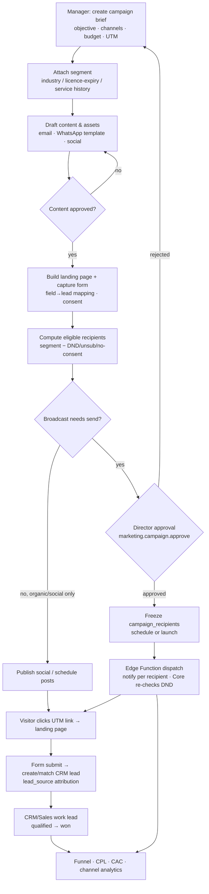
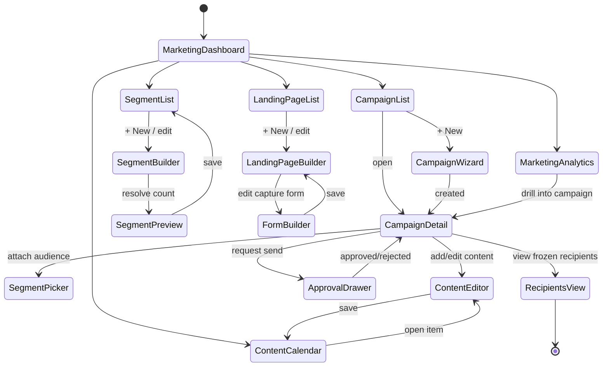
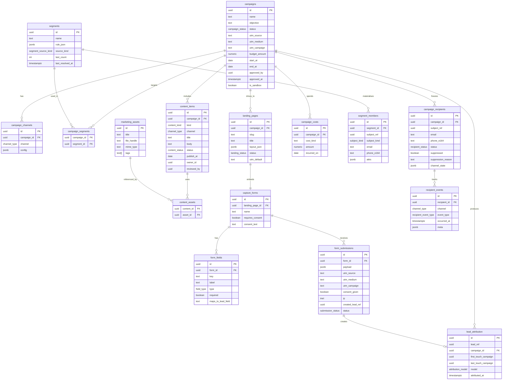
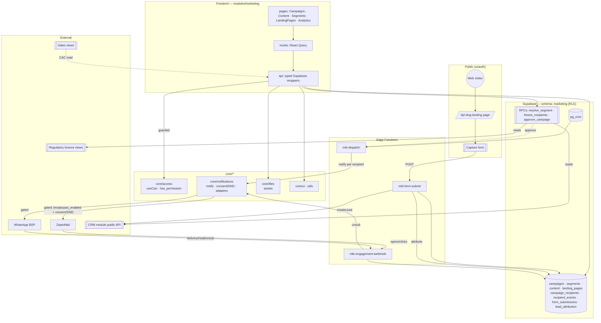

# Marketing — Module Design

**Module key:** `marketing`
**Anchor entities:** Campaign, Content, Audience/Segment, Landing Page
**Primary users:** Marketing (executor/manager), Directors (approve budget & broadcasts)
**Status:** Design (Phase D). Follows `00_ENTERPRISE_ARCHITECTURE.md` §6 template.
**Depends on Core:** `core/access`, `core/notifications` (gated broadcast adapters), `core/files`, `core/ui`, `core/utils`.
**Cross-module reads:** CRM (leads/clients), Regulatory (licence expiry), Sales (conversion outcomes), Finance (spend actuals — future).

---

## 1. Purpose & scope

**Business capability.** Marketing runs TPS Xperts Group's demand generation for regulatory + certification services aimed at food/nutraceutical manufacturers and FBOs in India. It plans and executes multi-channel campaigns (email via ZeptoMail, WhatsApp via BSP, social, LinkedIn), maintains a content calendar (blog articles, regulatory-update posts, social creatives), builds audiences from cross-module signals (industry, licence-expiry window, service history), captures web leads through landing pages and forms, and measures the funnel from impression → lead → Sales-qualified handoff → won, with lead-source attribution and CAC.

**Who uses it.**
- **Marketing executor** — builds campaigns, drafts content, designs landing pages, schedules posts.
- **Marketing manager** — approves content, sets budgets, defines segments, reads analytics.
- **Directors** — approve broadcast sends and budgets, review CAC/funnel.
- **Anonymous web visitors** — submit landing-page forms (public, unauthenticated, rate-limited).

**Grounding example.** An "FSSAI Central Licence renewal due" nurture campaign: a segment of clients whose licence expires in 60–90 days (read from Regulatory), a 3-touch email + WhatsApp sequence (consent/DND-gated), a dedicated landing page with a "Book a renewal consultation" form, each submission creating a CRM lead tagged `source=campaign:fssai-renewal-q3`.

**Explicitly NOT in scope (owned elsewhere):**
- Lead qualification, contact timeline, deal pipeline — **CRM** and **Sales**. Marketing *creates* the lead and hands off; it does not work it.
- Actual email/WhatsApp transport, consent ledger, DND registry — **`core/notifications`** adapters. Marketing composes and requests; Core delivers (or suppresses).
- Invoicing / revenue recognition — **Finance**. Marketing reads won-deal value for CAC only.
- Asset file storage internals — **`core/files`**. Marketing references assets by handle.
- Public website CMS (tpsxperts.com) — external. Marketing owns only landing pages hosted inside the platform + embeddable forms.
- Authenticated in-app notifications — **`core/notifications`** feed. Marketing does not build its own inbox.

---

## 2. Business workflow

### 2.1 Campaign lifecycle (primary process)

1. **Brief.** Manager creates a campaign: objective, channel mix (email/WhatsApp/social/LinkedIn), planned budget, UTM base (`utm_source/medium/campaign`), start/end window.
2. **Audience.** Executor attaches one or more **segments** — either a saved segment or a fresh rule set (e.g. `industry = nutraceutical AND licence_expiry between +60d and +90d`). Segment membership is materialised (snapshot) at build time and re-resolvable.
3. **Content & assets.** Executor drafts channel content (email HTML, WhatsApp template ref, social copy + creative) in the **content calendar**, linked to the campaign. Content moves `draft → in_review → approved`.
4. **Landing page.** If the campaign drives to a page, executor builds/links a **landing page** with a **lead-capture form** (fields → CRM lead mapping, UTM auto-capture, consent checkbox).
5. **Compliance gate.** Before any broadcast, the system computes eligible recipients = segment members **minus** DND/unsubscribed/no-consent (resolved by `core/notifications`). WhatsApp template must be pre-approved (BSP). Executor sees suppressed count.
6. **Approval.** Broadcast campaigns with a real send require **Director approval** (`marketing.campaign.approve`) — budget + audience size + suppression summary shown. Staging is always sandboxed (settings flag).
7. **Schedule / launch.** On approval, campaign → `scheduled` (send-at) or `active` (immediate). Recipient rows are frozen into `campaign_recipients`.
8. **Dispatch.** At send time, an Edge Function iterates `campaign_recipients` and calls `notify()` per recipient with `channels` = campaign channels. Core enforces DND/consent again at delivery (defence in depth) and records per-recipient status.
9. **Engage & capture.** Recipients click UTM-tagged links → landing page → form submit → **CRM lead** created/matched with `lead_source` attribution. Email opens/clicks and WhatsApp delivery/read events flow back into `campaign_recipients`.
10. **Attribution & handoff.** Each new/updated lead carries first-touch + last-touch campaign attribution. CRM/Sales own the lead thereafter; Marketing reads conversion outcomes (qualified/won) back for funnel + CAC.
11. **Measure.** Funnel (sent → delivered → opened → clicked → lead → SQL → won), spend vs budget, CPL, CAC, channel comparison.
12. **Close.** Campaign → `completed` (window ended) or `archived`. Analytics remain queryable.

### 2.2 Content calendar (supporting process)

Executor plans blog / regulatory-update articles and social posts on a calendar; each item has a publish target date, channel, owner, and review state; approved items can be attached to campaigns or published standalone (regulatory-update articles double as SEO/nurture content, e.g. "New FSSR labelling amendment 2026 — what FBOs must change").

---

## 3. Screen flow

**Screen inventory**

| Route | Screen | Purpose | Guard (permission) |
|---|---|---|---|
| `/marketing` | Marketing Dashboard | KPI overview, active campaigns, upcoming content | `marketing.dashboard.view` |
| `/marketing/campaigns` | Campaign List | Filter/search campaigns by status/channel | `marketing.campaign.view` |
| `/marketing/campaigns/new` | Campaign Wizard | Brief → audience → content → review | `marketing.campaign.create` |
| `/marketing/campaigns/:id` | Campaign Detail | Config, content, recipients, metrics | `marketing.campaign.view` |
| `/marketing/campaigns/:id/recipients` | Recipients View | Frozen recipient list + per-channel status | `marketing.campaign.view` |
| `/marketing/content` | Content Calendar | Monthly/list calendar of content items | `marketing.content.view` |
| `/marketing/content/:id` | Content Editor | Draft/edit article or post + review state | `marketing.content.edit` |
| `/marketing/segments` | Segment List | Saved audiences | `marketing.segment.view` |
| `/marketing/segments/:id` | Segment Builder + Preview | Rule builder, live count, cross-module reads | `marketing.segment.edit` |
| `/marketing/landing-pages` | Landing Page List | Published/draft pages, view counts | `marketing.landing_page.view` |
| `/marketing/landing-pages/:id` | Landing Page + Form Builder | Page + capture-form field mapping | `marketing.landing_page.edit` |
| `/marketing/analytics` | Marketing Analytics | Funnel, CAC, channel, attribution | `marketing.analytics.view` |
| `/lp/:slug` | **Public Landing Page** (unauth) | Renders published page + form | public (RLS: published only) |

---

## 4. Database design

Schema: `marketing` (logical). All tables have `id uuid pk default gen_random_uuid()`, `created_at`, `updated_at`, `created_by`, and RLS enabled. Cross-module references to CRM/Regulatory are by id only (no FK across schema boundaries where those are separate modules; soft references + resolver functions).

**Enums**
- `campaign_status`: `draft · pending_approval · scheduled · active · paused · completed · archived · rejected`
- `channel_type`: `email · whatsapp · social · linkedin · web`
- `content_kind`: `blog · regulatory_update · social_post · email_body · whatsapp_template`
- `content_status`: `draft · in_review · approved · published · retired`
- `landing_status`: `draft · published · unpublished`
- `field_type`: `text · email · phone · select · textarea · checkbox · hidden`
- `recipient_status`: `pending · sent · delivered · bounced · failed · suppressed`
- `recipient_event_type`: `sent · delivered · opened · clicked · replied · unsubscribed · failed`
- `submission_status`: `new · lead_created · duplicate · rejected_spam`
- `segment_source_kind`: `static_list · rule_dynamic`
- `subject_kind`: `lead · client · contact · manual`
- `attribution_model`: `first_touch · last_touch · linear`

**RLS intent (per table)**
- All internal tables: `SELECT/INSERT/UPDATE` require the matching `marketing.*` permission via `has_permission()`; `is_sandbox=true` rows only visible/actionable in staging env context.
- `landing_pages`: **public anon SELECT** allowed *only* where `status='published'`; drafts internal-only.
- `capture_forms` / `form_fields`: public anon SELECT for forms whose parent page is published.
- `form_submissions`: **anon INSERT allowed** (rate-limited via Edge Function, not direct table insert in prod — see §5), SELECT internal-only. No anon SELECT/UPDATE.
- `segment_members` / `campaign_recipients`: contain PII (email/phone) — internal-only, `marketing.campaign.view`; never anon.
- `recipient_events`: internal read; write only by dispatch Edge Function (service role) + webhook handlers.
- `lead_attribution`: internal read; write by form/dispatch pipeline.

**Expand-contract notes**
- New channels added as `channel_type` enum values (additive) — never renamed.
- `segment_members` is a *materialised snapshot*; the live rule lives in `segments.rule_json`. Re-resolving replaces the snapshot; historical `campaign_recipients` stay frozen (audit-safe) and are never back-mutated.
- Cross-module subject references (`subject_ref`, `lead_ref`) are soft uuids resolved through CRM/Regulatory public APIs; if those schemas later co-locate, real FKs can be added additively.

---

## 5. API design

Module `api/*` = thin typed Supabase wrappers; heavier/privileged logic = RPC or Edge Function. Every internal call is double-guarded (RLS + `useCan()`).

**`api/` data-access (frontend, authenticated)**

| Function | Input | Output | Authz |
|---|---|---|---|
| `listCampaigns(filter)` | status, channel, q, page | `Campaign[]` | `marketing.campaign.view` |
| `getCampaign(id)` | id | `CampaignDetail` | `marketing.campaign.view` |
| `createCampaign(dto)` | brief fields, UTM, budget | `Campaign` | `marketing.campaign.create` |
| `updateCampaign(id, patch)` | patch | `Campaign` | `marketing.campaign.edit` |
| `attachSegment(campaignId, segmentId)` | ids | ok | `marketing.campaign.edit` |
| `listSegments()` / `getSegment(id)` | — / id | `Segment[]` / `Segment` | `marketing.segment.view` |
| `saveSegment(dto)` | name, rule_json | `Segment` | `marketing.segment.edit` |
| `listContent(filter)` / `saveContent(dto)` | calendar filters / item | `ContentItem[]` / `ContentItem` | `marketing.content.view` / `.edit` |
| `reviewContent(id, decision)` | approve/reject | `ContentItem` | `marketing.content.approve` |
| `listLandingPages()` / `saveLandingPage(dto)` | — / page+form | `LandingPage[]` / `LandingPage` | `marketing.landing_page.view` / `.edit` |
| `getCampaignRecipients(id, page)` | id | `Recipient[]` | `marketing.campaign.view` |
| `getMarketingAnalytics(range)` | date range, channel | funnel + CAC rows | `marketing.analytics.view` |

**RPCs (Postgres functions, `security definer`, permission-checked internally)**

| RPC | Purpose | Authz |
|---|---|---|
| `resolve_segment(segment_id)` | Runs `rule_json` against cross-module views (CRM leads/clients, Regulatory licence-expiry, service history), returns count + refreshes `segment_members`. | `marketing.segment.edit` |
| `preview_segment(rule_json)` | Dry-run count without persisting. | `marketing.segment.view` |
| `freeze_recipients(campaign_id)` | Materialise segment members → `campaign_recipients`, tagging suppressed rows from Core consent/DND view. | `marketing.campaign.approve` |
| `approve_campaign(campaign_id)` | Set approved_by/at, transition to `scheduled`/`active`, write `audit_log`. | `marketing.campaign.approve` |
| `attribute_lead(lead_ref, campaign_id, touch)` | Upsert `lead_attribution` (first/last touch). | service / form pipeline |

**Edge Functions**

| Function | Trigger | Purpose | Authz boundary |
|---|---|---|---|
| `mkt-form-submit` | Public POST from `/lp/:slug` form | Validate, spam/rate-limit (per-IP + honeypot + optional Turnstile), write `form_submissions`, call CRM `createLead()` (public API) with UTM + consent, then `attribute_lead`. **Only path anon writes marketing data in prod.** | anon; service-role to CRM; strict input schema |
| `mkt-dispatch` | pg_cron (send window) / on `approve_campaign` | Iterate `campaign_recipients` (status=pending, not suppressed), call `core/notifications.notify()` per recipient/channel; respects sandbox flag. | service role; gated by `app_settings.broadcasts_enabled` |
| `mkt-engagement-webhook` | ZeptoMail / BSP webhooks | Map open/click/delivery/read/unsub → `recipient_events`, update `campaign_recipients.channel_state`; unsub → forward to Core consent ledger. | signed webhook; service role |

**Broadcast contract (critical).** Marketing never calls ZeptoMail/BSP directly. `mkt-dispatch` calls `core/notifications.notify({ subjectRef, type:'marketing_broadcast', channels, title, body, ref:{campaignId, recipientId} })`. Core resolves DND/consent/sandbox and returns per-channel delivery decisions. Suppression is enforced **twice**: at `freeze_recipients` (visible count) and again at delivery (defence in depth).

---

## 6. Permissions

Keys namespaced `marketing.<entity>.<action>`, aggregated into `PERMISSIONS` by the registry.

| Permission | Marketing Exec | Marketing Mgr | Director | Super Admin |
|---|:--:|:--:|:--:|:--:|
| `marketing.dashboard.view` | ✔ | ✔ | ✔ | ✔ |
| `marketing.campaign.view` | ✔ | ✔ | ✔ | ✔ |
| `marketing.campaign.create` | ✔ | ✔ | — | ✔ |
| `marketing.campaign.edit` | ✔ | ✔ | — | ✔ |
| `marketing.campaign.approve` | — | — | ✔ | ✔ |
| `marketing.segment.view` | ✔ | ✔ | ✔ | ✔ |
| `marketing.segment.edit` | ✔ | ✔ | — | ✔ |
| `marketing.content.view` | ✔ | ✔ | ✔ | ✔ |
| `marketing.content.edit` | ✔ | ✔ | — | ✔ |
| `marketing.content.approve` | — | ✔ | ✔ | ✔ |
| `marketing.landing_page.view` | ✔ | ✔ | ✔ | ✔ |
| `marketing.landing_page.edit` | ✔ | ✔ | — | ✔ |
| `marketing.landing_page.publish` | — | ✔ | ✔ | ✔ |
| `marketing.analytics.view` | ✔ | ✔ | ✔ | ✔ |

**RLS mapping.** Each policy calls `has_permission(auth.uid(), '<key>')`. The *send* path (`freeze_recipients`, `approve_campaign`, `mkt-dispatch`) is gated on `marketing.campaign.approve` **and** the global `app_settings.broadcasts_enabled` flag, so staging never sends to real recipients. Public landing/form access bypasses permission checks but is constrained by `status='published'` RLS + Edge-Function rate limiting.

---

## 7. Dashboard

| Widget | Metric | Data source |
|---|---|---|
| Active campaigns | count + spend-vs-budget bar | `campaigns` (status in active/scheduled) + `campaign_costs` |
| This-month funnel | sent → delivered → clicked → lead → SQL → won | `recipient_events`, `lead_attribution`, CRM/Sales views |
| New leads (MTD) | count by source channel | `lead_attribution` grouped by campaign channel |
| Cost per lead / CAC | ₹ spend ÷ leads / ÷ won | `campaign_costs` ÷ `lead_attribution` / Sales won |
| Content pipeline | items by `content_status` + upcoming publish dates | `content_items` |
| Consent/DND suppression rate | % recipients suppressed last send | `campaign_recipients.suppressed` |
| Top landing pages | views → submissions → conversion % | `landing_pages`, `form_submissions` |
| Expiry-nurture radar | # clients with licence expiring 0–90d not yet in a campaign | Regulatory licence view ⨝ `campaign_recipients` |

All ₹ via `formatRupees`; date buckets via `core/utils.clockBucket`.

---

## 8. Reports

| Report | Columns | Filters | Export |
|---|---|---|---|
| Campaign performance | campaign, channel, sent, delivered, open%, click%, leads, SQL, won, spend, CPL, CAC | date range, channel, status | CSV, PDF |
| Lead-source attribution | lead, first-touch campaign, last-touch campaign, model, created_at, current CRM stage | date range, campaign, model | CSV |
| Channel comparison | channel, spend, leads, CPL, conversion→won%, ROI | date range | CSV, PDF |
| Content calendar export | title, kind, channel, owner, status, publish_at, campaign | month, status, owner | CSV, ICS |
| Segment audit | segment, rule summary, last count, last resolved, campaigns used in | — | CSV |
| Suppression / compliance log | campaign, recipient (masked), channel, suppression_reason, timestamp | campaign, reason | CSV |
| Broadcast delivery log | campaign, recipient (masked), channel, status, event timeline | campaign, status | CSV |

Exports via `core/ui` DataTable export + a `report-export` Edge Function for large PDFs. PII columns masked unless `marketing.campaign.view` + explicit reveal (audit-logged).

---

## 9. Notifications

All via `core/notifications`; `notification_type` enum extended with marketing types. Internal (in-app/email to staff) vs. external broadcast (to prospects, gated) clearly separated.

| Event | Notification type | Recipients | Channels |
|---|---|---|---|
| Content submitted for review | `mkt_content_review_requested` | Marketing manager | in-app, email |
| Content approved/rejected | `mkt_content_reviewed` | Content owner | in-app |
| Campaign send requested | `mkt_campaign_approval_requested` | Directors | in-app, email |
| Campaign approved/rejected | `mkt_campaign_decided` | Campaign creator | in-app, email |
| Broadcast dispatch started/finished | `mkt_broadcast_status` | Campaign creator, manager | in-app |
| New lead captured from landing page | `mkt_lead_captured` | Assigned Sales owner (via CRM), Marketing | in-app |
| Recipient unsubscribed (spike) | `mkt_unsub_alert` | Marketing manager | in-app, email |
| Segment resolve failed (cross-module read) | `mkt_segment_error` | Segment owner | in-app |
| **External broadcast to prospect** | `marketing_broadcast` | Eligible `campaign_recipients` | email/WhatsApp — **gated by `broadcasts_enabled` + per-recipient consent/DND** |

The last row is the only *outbound-to-non-staff* type and always flows through the gated dispatch path.

---

## 10. Automations

| Job | Kind | Cadence / trigger | Action |
|---|---|---|---|
| Scheduled broadcast dispatch | pg_cron → `mkt-dispatch` | every 5 min (send-window check) | Send due `campaign_recipients`; gated by `broadcasts_enabled`. |
| Dynamic segment refresh | pg_cron → `resolve_segment` | nightly | Re-materialise `rule_dynamic` segments; alert on failures. |
| Licence-expiry nurture trigger | DB trigger on Regulatory licence view / nightly job | daily | Auto-enrol clients entering 90/60/30-day expiry window into the standing "renewal-due" campaign segment (opt-in campaign only). |
| Engagement ingestion | Webhook → `mkt-engagement-webhook` | event-driven | Write `recipient_events`; propagate unsub → Core consent. |
| Campaign auto-complete | pg_cron | daily | Move campaigns past `end_at` → `completed`. |
| Attribution rebuild | pg_cron | nightly | Recompute `lead_attribution` for leads touched in last 24h. |
| Form-submission → lead | event (`mkt-form-submit`) | on submit | Create/match CRM lead + attribution. |
| Audit | DB trigger | on every state change | Write `audit_log` (who/what/before/after). |

All scheduled sends respect the settings flag so **staging never dispatches to real contacts**.

---

## 11. Integrations

| System | Purpose | Boundary / adapter |
|---|---|---|
| **ZeptoMail** | Email broadcast + transactional | Via `core/notifications` email adapter only; opens/clicks back through `mkt-engagement-webhook`. |
| **WhatsApp BSP** (e.g. AiSensy) | WhatsApp broadcast on approved templates | Via `core/notifications` WhatsApp adapter; template ids stored on `content_items`; delivery/read via webhook. Number/live-send gated per platform WhatsApp memo. |
| **CRM module** | Lead creation + handoff, segment source | CRM public API (`index.ts`): `createLead()`, `matchContact()`, read leads/clients for segments/attribution. No direct table access. |
| **Regulatory module** | Licence-expiry segment source | Read-only view / public API for licence expiry windows + service history. |
| **Sales module** | Conversion outcomes (SQL/won) for CAC | Read Sales views for funnel closure; no write. |
| **LinkedIn / social** | Organic + paid social publishing | External adapter (manual/scheduled); UTM enforced on outbound links; metrics imported (future) or entered as `campaign_costs`. |
| **Web / tpsxperts.com** | Embeddable capture forms, hosted landing pages | Landing pages served in-app at `/lp/:slug`; external site embeds form pointing to `mkt-form-submit`. |
| **Google Drive/Storage** | Marketing asset storage | Via `core/files`; `marketing_assets.file_handle` references Core, no direct Drive calls. |
| **Turnstile / hCaptcha** (optional) | Bot protection on public forms | Verified inside `mkt-form-submit`. |
| **Razorpay / Finance** (future) | Ad-spend actuals for CAC | Read Finance ledger for marketing cost centre. |

---

## 12. Future scalability

- **10× volume.** `campaign_recipients` + `recipient_events` are the hot tables; partition `recipient_events` by month, index `(campaign_id, status)`. Dispatch batches (e.g. 500/iteration) with cursor state to stay within Edge Function limits; move to a queue table if send volume outgrows cron cadence.
- **Deliverability.** As volume grows, dedicated sending domains/subdomains per brand, warmup, and per-BSP throughput throttling in the adapter (Core concern, Marketing just enqueues).
- **Multi-entity / multi-tenant.** Distinct sub-brands/entities may exist later; add `org_id` to campaigns/segments/landing pages (additive) and scope RLS by org — landing-page slugs namespaced per brand. Fits the platform's single-tenant-now, multi-entity-later posture.
- **Attribution depth.** Current first/last/linear; extendable to time-decay or multi-touch model without schema change (new `attribution_model` enum value + recompute job).
- **Personalisation & A/B.** `campaign_channels.config` + `content_items` variants support A/B split; add `variant` column + assignment on `campaign_recipients` (additive).
- **Data retention.** Suppression/consent evidence retained per compliance; old `recipient_events` archivable to cold storage after N months.
- **Performance.** Segment resolution runs server-side (RPC) against indexed cross-module views; heavy previews debounced and cached with React Query keys `[marketing, segment, ruleHash]`.

---

## 13. Architecture diagram

---

**Handoff summary.** Marketing *produces* CRM leads (via `mkt-form-submit` → CRM public API) and hands them off with first/last-touch attribution; it never works the lead. All outbound email/WhatsApp goes through `core/notifications` adapters, gated by `broadcasts_enabled` + per-recipient consent/DND (enforced twice). Cross-module reads (CRM, Regulatory licence-expiry, Sales outcomes) are read-only via public APIs/views. Permissions follow `marketing.<entity>.<action>`; the send path additionally requires `marketing.campaign.approve` + Director approval.
