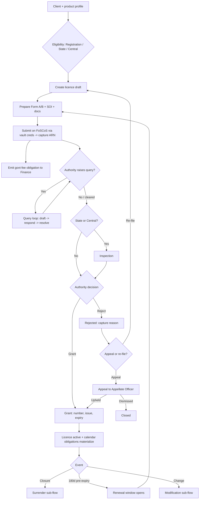
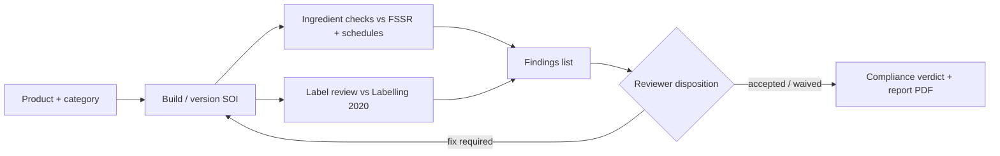
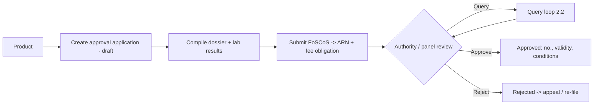
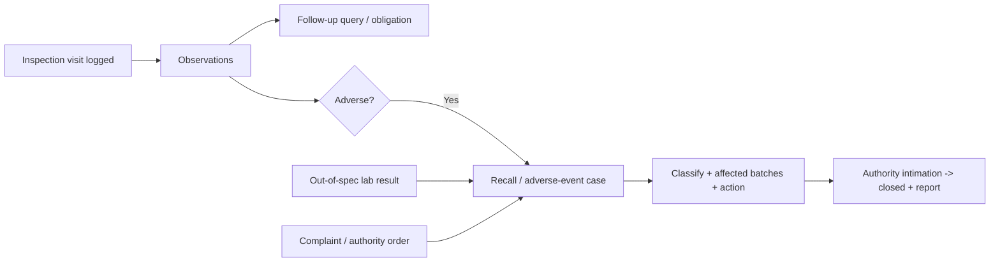
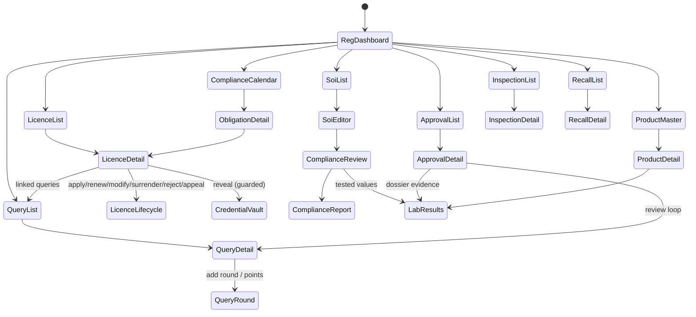
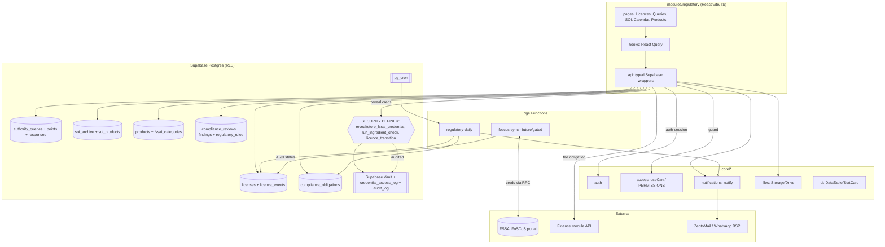

# Module Design — Regulatory

**Module key:** `regulatory`
**Anchor entities:** Licence · Authority query · SOI / Label review · Compliance obligation · Product
**Primary users:** Regulatory executives, Managers, Directors (super_admin for vault + config)
**Status:** Design-only (Phase D). Absorbs and expands existing `licenses`, `authority_queries`, `soi_archive`, `soi_products`, and the FoSCoS credential vault.
**Conforms to:** `00_ENTERPRISE_ARCHITECTURE.md` §5–§6. snake_case DB, permission keys `regulatory.<entity>.<action>`, expand-contract only.

---

## 1. Purpose & scope

The Regulatory module is the system of record for a client's **FSSAI regulatory standing** and the consultancy work TPS performs to keep it compliant. It governs the full FSSAI licence lifecycle, the government query/response loop, ingredient- and label-level compliance review, and the recurring statutory calendar — grounded in real FoSCoS/FSSAI processes.

**In scope**
1. **FSSAI licence lifecycle** — Basic **Registration** (turnover ≤ ₹12 lakh), **State** licence (₹12 lakh–₹20 crore / defined capacity), **Central** licence (> ₹20 crore, importers, e-commerce, 100% EOU, central-govt caterers). Sub-processes: *apply → grant → renew → modify → surrender*, plus expiry/renewal alerting (renewal window opens 180 days before expiry; late fee ₹100/day beyond expiry).
2. **Authority query management** — absorbs `authority_queries`. Models the FoSCoS **deficiency/query** loop: query received → drafting → response submitted → resolved/re-raised, across numbered rounds, with **points** (discrete deficiency items) and **SLA** clocks tied to the authority-set `response_due` (typically 30 days for improvement notices / deficiency letters).
3. **SOI & label compliance** — absorbs `soi_archive` + `soi_products`. Statement of Ingredients versioning, ingredient checks against FSSR 2011 permitted lists / additive schedules / nutraceutical schedules (Schedule VI–VIII of the Health Supplements & Nutraceuticals Regulations 2022), and label review against **FSS (Labelling & Display) Regulations 2020** (mandatory declarations, font/area rules, nutritional panel, allergen & veg/non-veg mark, RDA %).
4. **Compliance calendar** — renewals, **annual return Form D-1** (due 31 May for the prior FY; Form D-2 half-yearly for milk products), Form II / inspection follow-ups, and per-licence recurring obligations.
5. **Product master & category mapping** — canonical product records mapped to FSSAI **category** trees (nutraceutical / health supplement / FSMP / general food) driving which SOI/label rules apply.
6. **Product approval & ingredient NOC** — the distinct FSSAI **product approval / ingredient no-objection-certificate (NOC)** service line for nutraceuticals, health supplements and **novel foods** (non-standardised products, new ingredients, novel-food dossiers). Its own application lifecycle, review states and dossier, separate from the establishment licence.
7. **Structured lab-result ingestion** — capture of **NABL lab test results** (electronic report or typed result set) as structured, comparable values that feed the SOI/label `compliance_reviews` engine, so the compliance verdict is computed against *tested* values (heavy metals, micro, assay/RDA actuals) rather than manually keyed ones. Sourced from the Vendor-Portal lab-test PO deliverable.
8. **Inspection visits, recall & adverse events** — FSSAI/authority **inspection-visit** tracking (scheduled/surprise, observations, follow-up) and a **product-recall / adverse-event** workflow (trigger, classification, action, closure).
9. **FoSCoS credential vault** — existing Supabase Vault credential store (`reveal_fssai_credential` SECURITY DEFINER + `credential_access_log`) plus a boundary for future FoSCoS portal integration (status sync, ARN tracking).

**Explicitly NOT in scope (owned elsewhere)**
- Project workflow, stages, three-clock timing, block requests → **Operations**.
- Invoices, government-fee accounting, payments → **Finance & Accounts** (Regulatory *emits* a fee obligation; Finance records the transaction).
- ISO/NABCB certification audits, NCs, scopes → **Certification**.
- Document storage mechanics and Drive sync → **core/files** + **Document Management** (Regulatory references documents, does not own the bucket).
- Client master, contacts, referrals → **CRM** (Regulatory reads `clients`).
- Legal/authoritative interpretation — the module encodes rule *checks*, not legal advice; a human regulatory reviewer signs off.

---

## 2. Business workflow

### 2.1 Licence lifecycle (new application → grant → maintenance)

1. **Intake & eligibility.** From a client + product profile, determine licence tier (Registration/State/Central) using turnover, capacity, activity (manufacturer/importer/e-commerce/transporter/etc.) and premises count. A licence record is created in `draft`.
2. **Preparation.** Assemble Form A (Registration) or Form B (State/Central) supporting set: constitution proof, KYC, layout plan, list of directors, water test report, FSMS plan (State/Central), NOCs. SOI and product list are drafted/attached (§2.3).
3. **Submission on FoSCoS.** Executive logs into FoSCoS using vault credentials (`reveal_fssai_credential`), submits, records the **Application Reference Number (ARN)**. Licence → `submitted`; a fee obligation is emitted to Finance.
4. **Authority processing.** Department may raise a **query/deficiency** (§2.2). On clearance and (for State/Central) inspection, the licence is **granted**: capture `license_number`, `issue_date`, `expiry_date` (1–5 years as chosen). Licence → `active`.
   - **Rejection → appeal → re-file.** If the authority **rejects** the application (unmet query, ineligibility, adverse inspection), the licence goes `rejected` with a captured reason. Two branches follow: (a) **appeal** to the Designated/Appellate Officer within the statutory window — licence → `appealed`, tracked with its own due clock and outcome (upheld → back to `active`/grant, dismissed → closes); or (b) **re-application** — a fresh application is filed, chained via `parent_license_id` to the rejected record for history. Mirrors the appeals model in `certification.md`.
5. **Maintenance.** Recurring obligations materialize on the compliance calendar (annual return, renewal window). Modifications (address, product, KOB, capacity) run the **modify** sub-flow; loss/closure runs **surrender**.
6. **Renewal.** 180 days before expiry a renewal obligation opens; ≤ expiry = on-time, > expiry incurs ₹100/day late fee (allowed up to a grace window, else re-apply as fresh). On grant, a new expiry is set; the old licence version is archived.

### 2.2 Authority query loop (per round)

1. Authority issues a query (deficiency letter / additional-info / inspection notice / show-cause). Executive records it: type, `received_date`, `round_no`, authority-set `response_due`, and breaks it into **points**.
2. Each point is worked (`open → drafting → answered`), evidence/documents attached. SLA clock runs against `response_due`; amber at T-3 days, red on breach.
3. Response is compiled and submitted on FoSCoS; `response_submitted_date` captured, round → `responded`.
4. Authority either **resolves** (round closed, query resolved) or **re-raises** (new round increments `round_no`). Points carry forward or close individually.

### 2.3 SOI & label compliance review

1. Build/version an **SOI** (domestic or export format) for a product: ordered dynamic columns + per-product rows (existing `soi_archive` + `soi_products` shape). Version increments per project.
2. Run **ingredient checks**: each ingredient matched against the FSSR permitted-additive lists and, for nutraceuticals/health supplements, the applicable **schedule** (vitamins/minerals RDA limits, permitted botanicals/novel foods). Flags: not-permitted, over-limit, needs-INS-number, requires-standardization.
3. Run **label review** against FSS Labelling & Display 2020: mandatory particulars present, principal-display-area font size vs pack area, nutritional information panel, allergen declaration, veg/non-veg logo, FSSAI logo + licence number, RDA %, claims substantiation.
4. Reviewer resolves each finding (accept / waive-with-note / fix-required) and signs off; a compliance verdict + report PDF is produced and archived.

### 2.4 Product approval & ingredient NOC (distinct FSSAI service line)

A separate service from the establishment licence: obtaining FSSAI **product approval** or an **ingredient NOC** for a nutraceutical / health supplement / novel food that is not covered by an existing standard.

1. **Initiate** from a product (§2.5 master). Create a `product_approval_applications` record: approval type (`product_approval | ingredient_noc | novel_food`), linked `product_id`, target category, and dossier checklist → state `draft`.
2. **Compile dossier** — composition/SOI, safety/toxicology data, stability, intended use & dosage, supporting lab results (§2.5), literature/history-of-use. Feeds off the same SOI + compliance engine.
3. **Submit** on FoSCoS (vault creds), capture ARN → `submitted`. A government-fee obligation is emitted to Finance (bigint paise).
4. **Review loop** — authority/scientific-panel queries reuse the §2.2 query loop (linked by `product_approval_id`); states `under_review → clarification → recommended`.
5. **Decision** — `approved` (capture approval no., validity, conditions) or `rejected` (reason; may **appeal** or re-file, mirroring §2.1). Approval outcome unlocks the ingredient/product for label use in §2.3.

### 2.5 Structured lab-result ingestion (NABL → compliance engine)

Lab testing is procured as a **lab-test PO** in the Vendor Portal (module 14). Its deliverable — a NABL test report — is captured here as structured values, not just a PDF, so compliance is verdicted against tested numbers.

1. A lab-test PO deliverable arrives (electronic report or manual entry). Create a `lab_results` (test report) header linked to `product_id`, `soi_id`, the source `vendor_po_id`, lab name, NABL scope, `report_no`, `report_date`.
2. Capture per-analyte rows (`lab_result_items`): parameter, method, result value + unit, and the spec limit. Report file also stored via `core/files`.
3. On save, results **wire back** into `compliance_reviews`: the ingredient/label engine compares tested actuals (heavy metals, microbiology, assay/RDA %) against `regulatory_rules` limits — the verdict now cites `lab_results`, not manually keyed figures.
4. Out-of-spec analytes raise blocker findings and (if severe) can trigger the recall/adverse-event flow (§2.6).

### 2.6 Inspection visits, recall & adverse events

1. **Inspection visit** — record an authority inspection (`scheduled | surprise`), date, officer, scope, observations, and outcome; open follow-up obligations/queries. An adverse inspection can feed the rejection branch (§2.1).
2. **Recall / adverse event** — on a trigger (out-of-spec lab result, consumer complaint, authority order, adverse-event report): classify (Class I/II/III or severity), record affected batches/products, action taken, authority intimation, and drive to `closed` with a closure report. Notifies manager/director.

---

## 3. Screen flow

| Route | Screen | Purpose | Primary permission |
|---|---|---|---|
| `/regulatory` | Regulatory Dashboard | KPIs: expiring licences, open queries, breaching SLAs, due obligations | `regulatory.dashboard.view` |
| `/regulatory/licences` | Licence List | Filter/search licences by tier/status/expiry/client | `regulatory.licence.view` |
| `/regulatory/licences/:id` | Licence Detail | Lifecycle, credentials, linked queries/obligations | `regulatory.licence.view` |
| `/regulatory/licences/:id/lifecycle` | Lifecycle action | apply/grant/renew/modify/surrender transitions | `regulatory.licence.manage` |
| `/regulatory/licences/:id/credential` | Credential reveal panel | FoSCoS creds via RPC (audited) | `regulatory.credential.reveal` |
| `/regulatory/queries` | Authority Query List | Cross-project query queue with SLA badges | `regulatory.query.view` |
| `/regulatory/queries/:id` | Query Detail | Rounds, points, responses, documents | `regulatory.query.view` |
| `/regulatory/soi` | SOI List | Versioned SOIs by client/product | `regulatory.soi.view` |
| `/regulatory/soi/:id` | SOI Editor | Dynamic columns + product rows | `regulatory.soi.edit` |
| `/regulatory/soi/:id/review` | Compliance Review | Ingredient + label findings, disposition | `regulatory.compliance.review` |
| `/regulatory/calendar` | Compliance Calendar | Renewals, returns, Form II, obligations | `regulatory.calendar.view` |
| `/regulatory/products` | Product Master | Products + FSSAI category mapping | `regulatory.product.view` |
| `/regulatory/approvals` | Product Approval List | Product-approval / ingredient-NOC / novel-food applications | `regulatory.approval.view` |
| `/regulatory/approvals/:id` | Approval Detail | Dossier, review loop, decision, appeal | `regulatory.approval.view` |
| `/regulatory/lab-results` | Lab Results | NABL test reports + structured analyte values | `regulatory.labresult.view` |
| `/regulatory/lab-results/:id` | Lab Result Detail | Per-analyte values vs spec; wire-back to review | `regulatory.labresult.view` |
| `/regulatory/inspections` | Inspection Visits | Authority inspection log + follow-ups | `regulatory.inspection.view` |
| `/regulatory/recalls` | Recall / Adverse Events | Recall & adverse-event cases | `regulatory.recall.view` |
| `/regulatory/rules` | Rule Library (admin) | FSSR permitted lists / schedules / label rules | `regulatory.rule.manage` |

---

## 4. Database design

### 4.1 ER diagram (extends existing `licenses`, `authority_queries`, `soi_archive`)

```mermaid
erDiagram
  clients ||--o{ licenses : has
  clients ||--o{ products : owns
  licenses ||--o{ licence_events : "lifecycle log"
  licenses ||--o{ compliance_obligations : "generates"
  licenses ||--o{ credential_access_log : "audited reveals"
  projects ||--o{ authority_queries : "raised on"
  licenses ||--o{ authority_queries : "concerns"
  authority_queries ||--o{ authority_query_points : "breaks into"
  authority_query_points ||--o{ authority_query_responses : "answered by"
  clients ||--o{ soi_archive : "for"
  soi_archive ||--o{ soi_products : "rows"
  soi_archive ||--o{ compliance_reviews : "reviewed by"
  products ||--o{ soi_products : "referenced"
  fssai_categories ||--o{ products : "classifies"
  compliance_reviews ||--o{ compliance_findings : "produces"
  regulatory_rules ||--o{ compliance_findings : "cited by"
  products ||--o{ product_approval_applications : "seeks approval"
  product_approval_applications ||--o{ authority_queries : "review loop"
  products ||--o{ lab_results : "tested"
  soi_archive ||--o{ lab_results : "evidences"
  lab_results ||--o{ lab_result_items : "analytes"
  lab_results ||--o{ compliance_reviews : "feeds tested values"
  licenses ||--o{ inspection_visits : "inspected"
  products ||--o{ recall_events : "recalled"
  lab_results ||--o{ recall_events : "may trigger"

  licenses {
    uuid id PK
    uuid client_id FK
    text license_number
    text license_type "Central|State|Registration"
    text lifecycle_status "EXPAND: enum"
    text application_ref "EXPAND: FoSCoS ARN"
    smallint validity_years "EXPAND"
    date issue_date
    date expiry_date
    date renewal_window_opens "EXPAND: generated -180d"
    text vault_credential_id
    text credential_username
    timestamptz last_credential_accessed_at
    uuid parent_license_id "EXPAND: renewal / re-file chain"
    text rejection_reason "EXPAND: nullable"
    text appeal_status "EXPAND: none|appealed|upheld|dismissed"
    date appeal_due_date "EXPAND: nullable"
  }
  licence_events {
    uuid id PK
    uuid license_id FK
    text event_type "apply|grant|renew|modify|surrender|query|expire"
    jsonb before_data
    jsonb after_data
    uuid actor_id FK
    timestamptz created_at
  }
  authority_queries {
    uuid id PK
    uuid project_id FK
    uuid license_id FK "EXPAND: nullable link"
    uuid product_approval_id FK "EXPAND: nullable link"
    text query_type
    text query_status "EXPAND: open|drafting|responded|resolved|reraised"
    date received_date
    date response_due
    date response_submitted_date
    smallint round_no
    int points_total "EXPAND"
    int points_resolved "EXPAND"
    date resolved_date "EXPAND"
  }
  authority_query_points {
    uuid id PK
    uuid query_id FK
    smallint point_no
    text description
    text status "open|drafting|answered|closed"
    text disposition
    uuid assigned_to FK
  }
  authority_query_responses {
    uuid id PK
    uuid point_id FK
    smallint round_no
    text response_text
    text[] document_ids
    date submitted_date
    uuid submitted_by FK
  }
  soi_archive {
    uuid id PK
    uuid client_id FK
    uuid project_id FK
    uuid product_id FK "EXPAND"
    text soi_type "domestic|export"
    jsonb columns
    integer version_no
    text review_status "EXPAND"
  }
  soi_products {
    uuid id PK
    uuid soi_id FK
    integer sr_no
    jsonb data
  }
  products {
    uuid id PK
    uuid client_id FK
    uuid category_id FK
    text product_name
    text product_kind "nutraceutical|health_supplement|fsmp|general"
    jsonb attributes
    boolean is_active
  }
  fssai_categories {
    uuid id PK
    uuid parent_id FK
    text code
    text name
    text regulation_ref
  }
  compliance_reviews {
    uuid id PK
    uuid soi_id FK
    uuid product_id FK
    text review_kind "ingredient|label|combined"
    text verdict "pass|conditional|fail"
    uuid reviewed_by FK
    text report_path
    timestamptz created_at
  }
  compliance_findings {
    uuid id PK
    uuid review_id FK
    uuid rule_id FK
    text severity "info|warning|blocker"
    text finding_text
    text disposition "open|accepted|waived|fixed"
    text disposition_note
  }
  regulatory_rules {
    uuid id PK
    text rule_domain "additive|schedule|label|rda"
    text regulation_ref
    text rule_key
    jsonb rule_data
    boolean is_active
  }
  compliance_obligations {
    uuid id PK
    uuid license_id FK
    uuid client_id FK
    text obligation_type "renewal|annual_return_d1|half_yearly_d2|form_ii|inspection"
    date due_date
    text status "upcoming|due|submitted|overdue|waived"
    bigint govt_fee_paise "EXPAND: bigint paise"
    uuid sales_opportunity_id "EXPAND: nullable -> sales"
    uuid completed_by FK
  }
  product_approval_applications {
    uuid id PK
    uuid client_id FK
    uuid product_id FK
    text approval_type "product_approval|ingredient_noc|novel_food"
    text application_ref "FoSCoS ARN"
    text status "draft|submitted|under_review|clarification|recommended|approved|rejected|appealed"
    text approval_number
    date approved_on
    date validity_to
    text rejection_reason
    bigint govt_fee_paise "bigint paise"
    jsonb dossier
    uuid reviewed_by FK
  }
  lab_results {
    uuid id PK
    uuid client_id FK
    uuid product_id FK
    uuid soi_id FK "nullable"
    uuid vendor_po_id "EXPAND: source lab-test PO"
    text lab_name
    text nabl_scope
    text report_no
    date report_date
    text ingest_source "electronic|manual"
    text report_path
  }
  lab_result_items {
    uuid id PK
    uuid lab_result_id FK
    text parameter
    text method
    text result_value
    text unit
    text spec_limit
    boolean out_of_spec
  }
  inspection_visits {
    uuid id PK
    uuid license_id FK
    uuid client_id FK
    text visit_type "scheduled|surprise"
    date visit_date
    text officer
    text scope
    text observations
    text outcome "satisfactory|deficiency|adverse"
    uuid recorded_by FK
  }
  recall_events {
    uuid id PK
    uuid client_id FK
    uuid product_id FK
    uuid lab_result_id FK "nullable trigger"
    text trigger "lab_oos|complaint|authority_order|adverse_event"
    text classification "class_i|class_ii|class_iii"
    jsonb affected_batches
    text action_taken
    text status "open|action|intimated|closed"
    text closure_report_path
    uuid owner_id FK
  }
  credential_access_log {
    uuid id PK
    uuid license_id FK
    uuid accessed_by FK
    timestamptz accessed_at
    text reason
  }
```

### 4.2 Table catalogue (new vs expanded)

**Expanded (existing tables — additive only):**
- `licenses` — add `lifecycle_status regulatory_licence_status` (enum), `application_ref text` (FoSCoS ARN), `validity_years smallint`, `renewal_window_opens date generated always as (expiry_date - interval '180 days')` (or trigger-maintained to avoid non-immutable generated expr), `parent_license_id uuid references licenses(id)` for renewal chains. Existing vault columns unchanged.
- `authority_queries` — add `license_id uuid references licenses(id)` (nullable — many queries also stand alone on a project), `query_status query_status_stage` (enum), `points_total int`, `points_resolved int`, `resolved_date date`. Keeps the append-only delete rule.
- `soi_archive` — add `product_id uuid references products(id)`, `review_status text default 'draft'`. Keeps `soi_type`/`columns`/`version_no` from migration 040.
- `soi_products` — unchanged (jsonb `data` per row).

**New tables:** `licence_events`, `authority_query_points`, `authority_query_responses`, `products`, `fssai_categories`, `compliance_reviews`, `compliance_findings`, `regulatory_rules`, `compliance_obligations`.

**New enums:** `regulatory_licence_status` (`draft, submitted, query_raised, granted, active, renewal_due, expired, surrendered, rejected`), `query_status_stage` (`open, drafting, responded, resolved, reraised`). Extend existing `notification_type` with `licence_granted`, `query_sla_breach`, `obligation_due`, `soi_review_flagged`.

### 4.3 RLS intent per table

| Table | Read | Write |
|---|---|---|
| `licenses` (expanded) | staff via `auth_role()` (existing); credentials never selected client-side | `regulatory.licence.manage`; vault columns only via SECURITY DEFINER RPCs |
| `licence_events` | staff read | insert-only via trigger/RPC; no update/delete (append-only rule) |
| `authority_queries` / `_points` / `_responses` | staff read | `regulatory.query.manage`; append-only on queries (existing rule) |
| `products` / `fssai_categories` | staff read | `regulatory.product.manage`; categories `regulatory.rule.manage` |
| `soi_archive` / `soi_products` | staff read (existing permissive) — **tighten** to `auth_role()` on promotion | `regulatory.soi.edit` |
| `compliance_reviews` / `_findings` | staff read | `regulatory.compliance.review` |
| `regulatory_rules` | staff read | `regulatory.rule.manage` (super_admin/director) |
| `compliance_obligations` | staff read | `regulatory.calendar.manage` |
| `credential_access_log` | super_admin/director read | insert-only via RPC; existing no-update/no-delete rules |

### 4.4 Expand-contract notes

- All new columns are `add column if not exists` with defaults; no drops, no type changes on live columns. `renewal_window_opens` maintained by a `before insert/update` trigger (not a generated column, matching the project's prior lesson on non-immutable generated expressions in migration 002).
- `authority_queries` currently keyed to `project_id`; the new `license_id` is **additive/nullable** so existing rows and the Operations query flow keep working. Points/responses are new child tables — no reshaping of the parent.
- `soi_products` permissive RLS from migration 040 is a known open policy; contract step (post-promotion) replaces `using (true)` with `auth_role()` once the module owns writes.
- Credential vault is untouched: `reveal_fssai_credential` / `store_fssai_credential` SECURITY DEFINER + `credential_access_log` remain the only credential path.

---

## 5. API design

Module `api/*` = thin typed Supabase wrappers; hooks wrap them in React Query with keys `['regulatory', entity, ...params]`. Mutations RLS-guarded in DB + `useCan()` in UI.

**Data-access functions (`modules/regulatory/api/`)**
- `listLicences(filters)` / `getLicence(id)` / `createLicenceDraft(input)` / `updateLicence(id, patch)` — CRUD over `licenses` (vault columns excluded from selects).
- `transitionLicence(id, action, payload)` → validates lifecycle_status transition, writes `licence_events`, may emit obligation/fee. authz `regulatory.licence.manage`.
- `listQueries(filters)` / `getQuery(id)` / `createQuery(input)` / `addQueryRound(id, payload)` / `upsertQueryPoint(...)` / `submitResponse(pointId, payload)` — authz `regulatory.query.manage`.
- `listSois(filters)` / `getSoi(id)` / `saveSoi(id, columns, rows)` — over `soi_archive`/`soi_products`; authz `regulatory.soi.edit`.
- `runComplianceReview(soiId, kind)` → creates `compliance_reviews` + `compliance_findings` by evaluating `regulatory_rules`; `disposeFinding(id, disposition, note)`. authz `regulatory.compliance.review`.
- `listObligations(filters)` / `completeObligation(id, payload)` — over `compliance_obligations`; authz `regulatory.calendar.manage`.
- `listProducts` / `upsertProduct` / `listCategories` — product master.

**RPCs (SECURITY DEFINER, existing + new)**
- `reveal_fssai_credential(p_license_id, p_reason)` → text — **existing, unchanged.** Role-gated (`super_admin, director, manager, executive`), updates `last_credential_accessed_*`, inserts `credential_access_log` + `audit_log`. UI maps to `regulatory.credential.reveal`.
- `store_fssai_credential(...)` — **existing, unchanged.** Vault write.
- `run_ingredient_check(p_soi_id)` (new) — server-side evaluation of SOI rows against `regulatory_rules` (`additive`/`schedule`/`rda` domains); returns findings; keeps rule logic off the client. authz via `has_role`.
- `licence_transition(p_license_id, p_action, p_payload jsonb)` (new, optional) — atomic status change + `licence_events` insert + obligation seeding, so lifecycle invariants live in the DB.

**Edge Functions**
- `regulatory-daily` (pg_cron-triggered) — recompute obligation statuses, open renewal windows, raise SLA/expiry notifications via `core/notifications` (gated by `reminder_settings`).
- `foscos-sync` (future, stubbed) — FoSCoS portal boundary: poll ARN status, reconcile `lifecycle_status`. Ships disabled behind a settings flag.

---

## 6. Permissions

Keys namespaced `regulatory.<entity>.<action>`. RLS is authoritative; `useCan()` mirrors for affordance.

| Permission key | super_admin | director | manager | executive | accounts | auditor |
|---|:--:|:--:|:--:|:--:|:--:|:--:|
| `regulatory.dashboard.view` | ✔ | ✔ | ✔ | ✔ | – | ✔(read) |
| `regulatory.licence.view` | ✔ | ✔ | ✔ | ✔ | ✔(ref) | ✔ |
| `regulatory.licence.manage` | ✔ | ✔ | ✔ | ✔ | – | – |
| `regulatory.credential.reveal` | ✔ | ✔ | ✔ | ✔ | – | – |
| `regulatory.credential.store` | ✔ | ✔ | – | – | – | – |
| `regulatory.query.view` | ✔ | ✔ | ✔ | ✔ | – | ✔ |
| `regulatory.query.manage` | ✔ | ✔ | ✔ | ✔ | – | – |
| `regulatory.soi.view` | ✔ | ✔ | ✔ | ✔ | – | ✔ |
| `regulatory.soi.edit` | ✔ | ✔ | ✔ | ✔ | – | – |
| `regulatory.compliance.review` | ✔ | ✔ | ✔ | ✔ | – | – |
| `regulatory.calendar.view` | ✔ | ✔ | ✔ | ✔ | ✔ | ✔ |
| `regulatory.calendar.manage` | ✔ | ✔ | ✔ | ✔ | – | – |
| `regulatory.product.view` | ✔ | ✔ | ✔ | ✔ | – | ✔ |
| `regulatory.product.manage` | ✔ | ✔ | ✔ | ✔ | – | – |
| `regulatory.rule.manage` | ✔ | ✔ | – | – | – | – |

**RLS mapping:** read permissions → `select` policies gated by `auth_role()`; `.manage`/`.edit`/`.review` → `insert/update` policies checking `has_role(...)` for the mapped roles. Credential reveal is **not** a table policy — it is the role guard inside `reveal_fssai_credential`, so the reveal path can never be reached by direct table select (vault columns hold only the secret *id*, never the plaintext). `auditor` is read-only across the board.

---

## 7. Dashboard

| Widget | Metric | Source |
|---|---|---|
| Licences expiring (30/60/90d) | count buckets + list | `licenses` where `is_active` and `expiry_date` in window |
| Renewal windows open | licences past `renewal_window_opens`, not yet renewed | `licenses` + `compliance_obligations(renewal)` |
| Open authority queries | count by status + oldest age | `authority_queries` where status ∉ (resolved) |
| SLA at risk / breached | queries with `response_due` ≤ T+3 / < today | `authority_queries` |
| Obligations due this month | Form D-1/D-2, Form II, inspections | `compliance_obligations` |
| SOI reviews flagged | reviews with `verdict != pass` / blocker findings | `compliance_reviews` + `compliance_findings` |
| Credential reveals (30d) | audit count, by user | `credential_access_log` |
| Licences by tier | Central/State/Registration split | `licenses` |

Widgets read via React Query keys `['regulatory','dashboard',widget]`, staleTime 60s.

---

## 8. Reports

| Report | Columns | Filters | Export |
|---|---|---|---|
| Licence register | client, number, tier, category, issue, expiry, status | tier, status, client, expiry range | CSV, PDF |
| Expiry & renewal forecast | licence, expiry, window-open, days-left, renewal status | window (30/60/90/180d), tier | CSV, PDF |
| Authority query log | project, licence, type, round, received, due, submitted, status, points resolved | status, type, SLA breach, date | CSV, PDF |
| SLA compliance | query, due, submitted, on-time?, days variance | period, executive | CSV |
| SOI / compliance review | product, SOI version, verdict, blocker count, reviewer | verdict, product kind, period | CSV, PDF |
| Compliance calendar | client, licence, obligation, due, status | obligation type, status, month | CSV, PDF, iCal |
| Credential access audit | licence, user, accessed_at, reason | user, licence, date | CSV (super_admin/director only) |
| Government-fee obligations | licence, action, amount, emitted, Finance ref | status, period | CSV (shared with Finance) |

Export via `core/ui` DataTable export + a PDF/CSV helper; iCal for the calendar.

---

## 9. Notifications

Via `core/notifications` only; `notification_type` extended. Delivery gated by `reminder_settings`/`app_settings` (email via ZeptoMail, WhatsApp via BSP once live).

| Event | notification_type | Recipients | Channels |
|---|---|---|---|
| Licence 90/60/30/7d to expiry | `license_expiring` (existing) | assigned executive, manager | in-app, email |
| Renewal window opened (T-180d) | `obligation_due` (new) | executive, manager | in-app, email |
| Licence granted | `licence_granted` (new) | executive, manager, director | in-app, email |
| Authority query received | `query_received` (existing) | assigned executive, manager | in-app, email, WhatsApp* |
| Query SLA T-3 / breached | `query_sla_breach` (new) | executive, manager, director on breach | in-app, email |
| Obligation due (Form D-1/D-2, Form II) | `obligation_due` (new) | executive, manager | in-app, email |
| SOI review flagged (blocker) | `soi_review_flagged` (new) | reviewer, manager | in-app |
| Credential revealed | (audit only, no push by default) | — | audit_log |

\*WhatsApp stays a stub/toggle until the BSP number is live (per project standard).

---

## 10. Automations

| Job | Trigger | Cadence | Action |
|---|---|---|---|
| Expiry & renewal sweep | pg_cron → `regulatory-daily` Edge Fn | daily 06:30 IST | open renewal windows, set `renewal_due`, emit expiry notifications |
| Obligation materializer | pg_cron | daily | ensure Form D-1 (due 31 May), D-2 (half-yearly), Form II rows exist per active licence; flip `upcoming→due→overdue` by date |
| SLA monitor | pg_cron | daily 07:00 | mark queries `query_sla_breach`, notify |
| Licence event log | DB trigger on `licenses` update | event | write `licence_events(before/after)` + `audit_log` |
| Query rollups | DB trigger on `authority_query_points` | event | recompute `points_total/points_resolved`, auto-close query when all points closed |
| SOI review on save | app-invoked RPC `run_ingredient_check` | on demand | regenerate findings; optionally auto on `saveSoi` |
| FoSCoS status reconcile | `foscos-sync` Edge Fn (future) | hourly when enabled | poll ARN, update `lifecycle_status` |

All scheduled work gated by settings flags so staging stays sandboxed.

---

## 11. Integrations

| System | Direction | Boundary / adapter |
|---|---|---|
| **FSSAI FoSCoS portal** | out (submit), in (status) | **Manual-assisted today** via credential vault; **`foscos-sync` Edge Function** is the future automated boundary (ARN submit/poll). All portal access flows through `reveal_fssai_credential` — plaintext never leaves the DB function; the frontend receives the secret only at reveal time over the authenticated RPC and never persists it. |
| **Supabase Vault** | store/reveal | `store_fssai_credential` / `reveal_fssai_credential` SECURITY DEFINER; `credential_access_log` + `audit_log` append-only. Unchanged by this module. |
| **Finance & Accounts** | out | Regulatory emits a government-fee obligation on submission/renewal; Finance records the payment and returns a ref. Cross-module via Finance's public API, not direct table writes. |
| **core/notifications** | out | `notify({...channels})` — email (ZeptoMail), in-app, WhatsApp (BSP, gated). |
| **core/files / Document Management** | in/out | SOI PDFs, query responses, licence certificates stored via `core/files` (bucket `documents`/`regulatory`), referenced by path — module does not own storage mechanics. |
| **AI Assistant** (module 12) | out | SOI/label findings and FSSR rule context can seed regulatory Q&A / response drafting (read-only reference). |
| **e-sign (future)** | out | signed compliance reports / response letters — stubbed adapter. |

Boundary principle: the module never talks to email/WhatsApp/FoSCoS directly except through the named adapters; the vault RPC is the sole credential path.

---

## 12. Future scalability

- **10× licences/queries:** partial indexes already exist (`licenses_expiry_idx`); add composite indexes on `authority_queries(query_status, response_due)` and `compliance_obligations(status, due_date)`. Dashboard buckets move to materialized views refreshed by the daily cron if row counts warrant.
- **FoSCoS automation:** the `foscos-sync` boundary lets manual submission scale to portal automation without touching the rest of the module (adapter swap behind a flag).
- **Rule engine growth:** `regulatory_rules` is jsonb-driven so new FSSR schedules / amended Labelling rules are data, not code — versioned via `is_active` + `regulation_ref`, enabling point-in-time "which rules applied when reviewed" replay.
- **Multi-entity / tenant:** all tables carry `client_id`; a future `org_id` column + RLS predicate generalizes to multiple TPS entities or a SaaS offering without reshaping.
- **Data volume:** append-only logs (`licence_events`, `credential_access_log`, `authority_query_responses`) are archival candidates for partitioning by year once large.
- **Product master reuse:** `products` + `fssai_categories` become the shared catalogue that Sales/CRM and label-artwork tooling can reference.

---

## 13. Architecture diagram

**Boundaries enforced:** the module imports only `@/core/*` + its own folder; credential plaintext exists only inside the SECURITY DEFINER RPC; every state change is RLS-guarded and audited; external systems (FoSCoS, Finance, mail) are reached only through named adapters.
