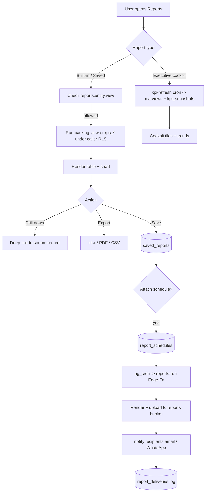
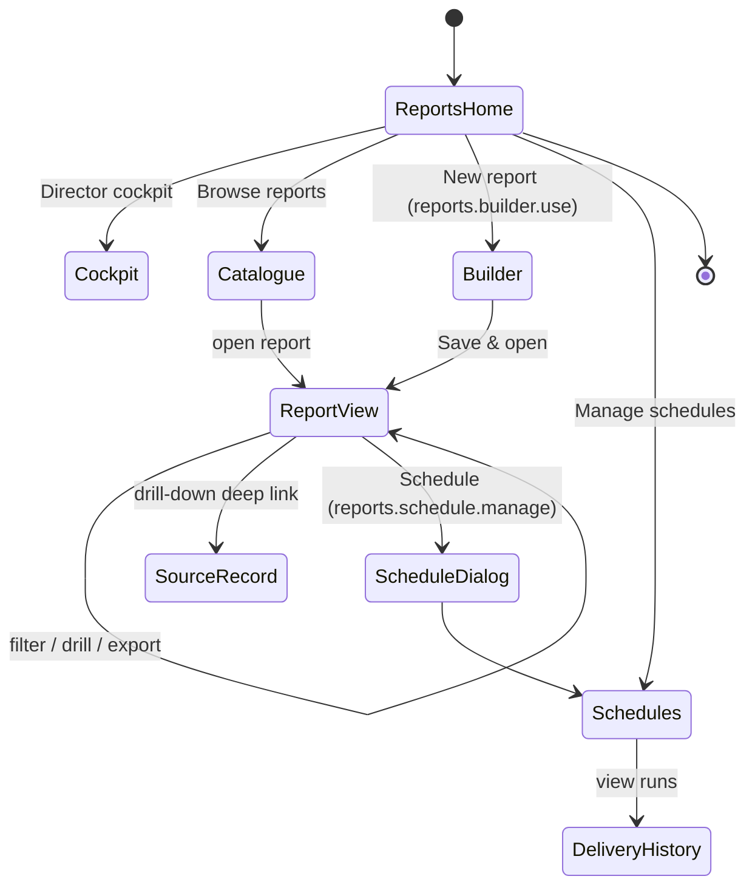
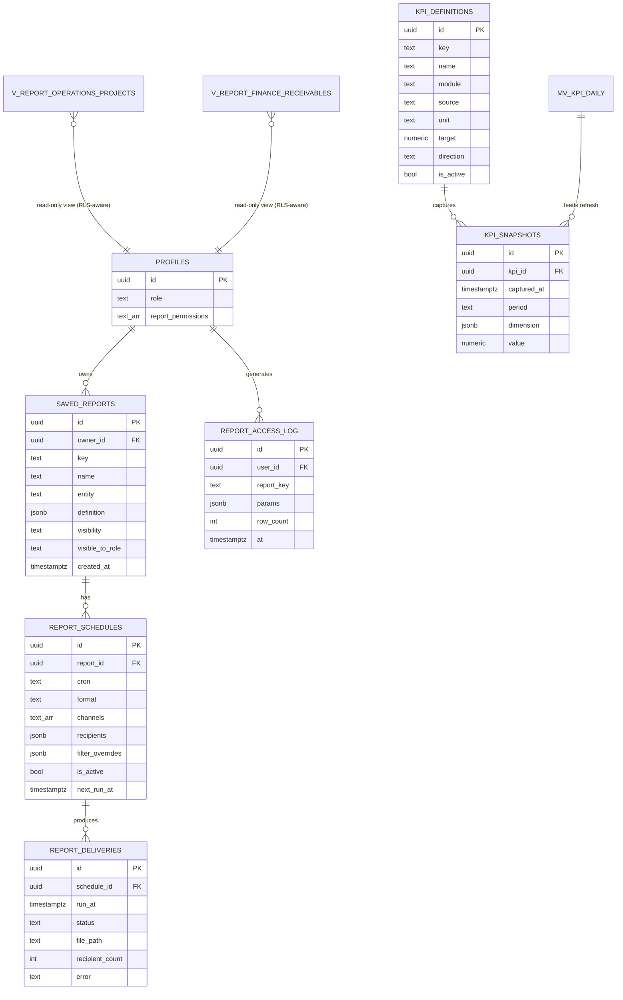
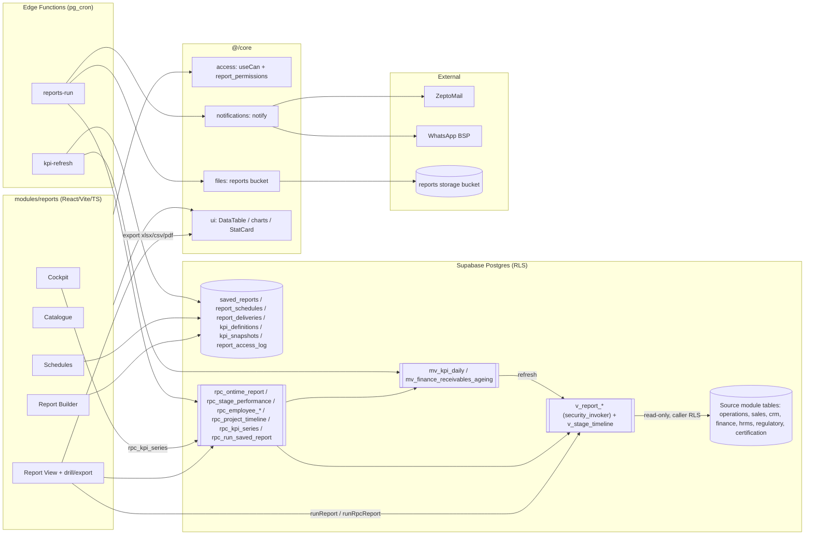

# Module Design — Reports & Analytics

**Module key:** `reports` · **Module #16** · **Anchor entities:** Saved Report, Report Schedule, KPI Definition
**Status:** Design (Phase D). Follows `00_ENTERPRISE_ARCHITECTURE.md` §6 template.
**Primary users:** Directors (cockpit), Managers (operational reports), plus per-entity grants via `profiles.report_permissions`.
**Nature:** Cross-cutting **read-only analytics layer** over every other module. Owns no source-of-truth business data.

---

## 1. Purpose & scope

**Business capability.** Reports & Analytics is the single cross-module reporting and business-intelligence surface for the TPS Enterprise Platform. It reads from every other module (Operations, Sales, CRM, Finance, HRMS, Regulatory, Certification, …) through a governed layer of **RLS-aware analytics views**, and turns that data into: operational reports, an executive KPI cockpit, a self-service report builder, scheduled deliveries, and exports (Excel/PDF/CSV).

**Who uses it.**
- **Directors** — executive cockpit, cross-module KPIs, trends, board-style summaries.
- **Managers** — operational reports for their teams/projects (throughput, pending payments, queries, renewals).
- **Accounts** — receivables/collections, govt-fee reconciliation.
- **HR** — attendance/leave analytics (scoped to HRMS reports).
- **Executives / others** — only the specific report tabs granted to them via `profiles.report_permissions` (the existing per-user grant mechanism, generalized).

**What it explicitly does NOT do.**
- It does **not** store or mutate business records. No writes to Operations/Finance/HRMS tables. The only tables it owns are its own metadata (`saved_reports`, `report_schedules`, `kpi_definitions`, `kpi_snapshots`, `report_deliveries`, `report_access_log`).
- It does **not** re-implement domain logic. It reuses the existing `rpc_ontime_report`, `rpc_stage_performance`, `rpc_employee_summary`, `rpc_employee_timeline`, `rpc_project_timeline`, and the `v_stage_timeline` view, and adds new **views/materialized views** — never duplicated source data.
- It does **not** bypass security. Every view and RPC is RLS-aware; a user sees exactly the rows they could see in the source module.
- It is **not** a general SQL console. The report builder composes over a curated, whitelisted set of reporting entities/columns — not arbitrary table access.
- Heavy statistical/ML forecasting is out of scope; only **basic trend & forecast** (moving average, linear projection, period-over-period deltas).

**Relationship to existing V1 reporting.** The current `Reports` page (Performance / Pending-Payments / Queries / Referrals / Govt-Fees / Timeline / Stage-Performance / Employee-Timeline tabs) becomes the **Operations & Finance report pack** inside this module. Its tab keys (`pending_payments`, `queries`, `govt_fees`, …) map 1:1 onto `report_permissions` grant keys, which this module formalizes into the `reports.<entity>.<action>` permission namespace.

---

## 2. Business workflow

TPS's real reporting need is "one place where a director sees the whole business and a manager pulls the exact list they need, without exporting Excel and stitching WhatsApp updates." Three end-to-end processes cover it.

### 2.1 View a report (on-demand)
1. User opens **Reports** → picks a report from the catalogue (built-in or a saved report they can access).
2. UI checks `reports.<entity>.view` permission (affordance) and loads the report definition.
3. The report hook calls the backing **RPC or analytics view** with the user's filters (date range, project, employee, client, status).
4. Postgres executes the view/RPC **under the caller's RLS** — rows are already scoped to what the user may see.
5. Results render as table + chart(s); user can drill down (row → source record via deep link), re-filter, or export.

### 2.2 Build & save a report
1. User (with `reports.builder.use`) opens **Report Builder**, picks a **reporting entity** (e.g. `operations_projects`, `finance_receivables`).
2. Chooses columns, filters, grouping, sort, and a visualization; live preview runs against the entity's view.
3. Saves as a **Saved Report** with a name, visibility (`private` / `shared` / `role:<role>`), and default filters → row in `saved_reports`.
4. Optionally attaches a **schedule** (§2.3).

### 2.3 Schedule & deliver a report
1. User with `reports.schedule.manage` attaches a schedule to a saved report: cadence (cron), format (PDF/Excel/CSV), recipients (internal users and/or external emails), channel (email / WhatsApp link).
2. `pg_cron` fires the **`reports-run`** Edge Function on cadence.
3. The function runs the report **as a service role but re-applies the report's saved RLS scope / owner context** (see §5), renders the export, uploads it to the `reports` storage bucket, and calls `core/notifications.notify()` for each recipient.
4. Delivery outcome (success/fail, file ref, recipient set) is written to `report_deliveries`.

### 2.4 Executive KPI refresh (cockpit)
1. `pg_cron` runs **`kpi-refresh`** (e.g. hourly/nightly) → refreshes materialized views and writes point-in-time values to `kpi_snapshots`.
2. Director opens the **Cockpit**; KPI tiles read the latest `kpi_snapshots` (fast) and trends read the snapshot history.

---

## 3. Screen flow

Single route group `/reports/*`, lazy-loaded, gated by `hasAnyReportAccess` (full role OR any `report_permissions` grant).

### Screen inventory

| Route | Screen | Purpose | Min permission |
|---|---|---|---|
| `/reports` | Reports Home | Landing: catalogue + entry to cockpit/builder | any report access |
| `/reports/cockpit` | Executive Cockpit | KPI tiles, cross-module trends, alerts | `reports.cockpit.view` (director default) |
| `/reports/catalogue` | Report Catalogue | List built-in + saved reports the user can access | any report access |
| `/reports/view/:reportKey` | Report View | Run/filter/drill/export a report | `reports.<entity>.view` |
| `/reports/builder` | Report Builder | Compose & save a report | `reports.builder.use` |
| `/reports/schedules` | Schedules | List/manage report schedules | `reports.schedule.manage` |
| `/reports/schedules/:id` | Delivery History | Runs & outcomes for a schedule | `reports.schedule.manage` |

The legacy `/reports/performance` tabbed page is preserved as the built-in **Operations & Finance pack**, each tab reachable as `/reports/view/<tabKey>` so existing `report_permissions` grants keep working during coexistence.

---

## 4. Database design

**Design rule (from §1 & Enterprise §3):** this module **owns only metadata tables** plus a **views layer**. The views/matviews read source-module tables; they never copy them. All views run `security_invoker = true` so the querying user's RLS applies; matviews (which cannot be security_invoker) are guarded by a wrapping security-invoker view + RLS-safe RPC (see §5).

### Owned metadata tables

| Table | Key columns | Notes |
|---|---|---|
| `saved_reports` | `id`, `owner_id`→profiles, `key` (unique slug), `name`, `entity` (reporting-entity id), `definition` jsonb (columns/filters/group/sort/viz), `visibility` enum(`private`,`shared`,`role`), `visible_to_role`, `created_at`, `updated_at` | Report builder output. `definition` is validated against the whitelisted entity schema. |
| `report_schedules` | `id`, `report_id`→saved_reports, `cron` text, `format` enum(`pdf`,`xlsx`,`csv`), `channels` text[] (`email`,`whatsapp`), `recipients` jsonb (userIds + external emails), `filter_overrides` jsonb, `is_active`, `next_run_at`, `created_by` | One saved report → many schedules. Gated by settings flags for actual dispatch. |
| `report_deliveries` | `id`, `schedule_id`→report_schedules, `run_at`, `status` enum(`success`,`failed`,`skipped`), `file_path` (reports bucket), `recipient_count`, `error`, `duration_ms` | Append-only run log. |
| `kpi_definitions` | `id`, `key` (unique), `name`, `module`, `source` (view/rpc name), `value_expr` / `agg`, `unit`, `format`, `target`, `direction` enum(`up_good`,`down_good`), `is_active` | Declarative KPI catalogue driving the cockpit. |
| `kpi_snapshots` | `id`, `kpi_id`→kpi_definitions, `captured_at`, `period` (`day`/`month`/…), `dimension` jsonb (e.g. `{team:'A'}`), `value` numeric | Point-in-time history for tiles + trend/forecast. Written by `kpi-refresh`. |
| `report_access_log` | `id`, `user_id`, `report_key`, `params` jsonb, `row_count`, `at` | Audit of who ran what (feeds Admin `audit_log` too). |

### Analytics VIEWS layer (read-only, over module tables)

These are the governed reporting surface. Existing objects are **reused**; new ones **expand** the set.

| View / Matview | Reads from | Purpose |
|---|---|---|
| `v_stage_timeline` *(existing)* | operations stage/clock tables | Per-stage timeline, base for on-time & stage-performance |
| `v_report_operations_projects` | projects, stages, profiles | One row/project: status, current stage, on-time flag, assignee, ageing |
| `v_report_operations_throughput` | stages, `v_stage_timeline` | Stages completed per period / team (throughput) |
| `v_report_sales_pipeline` | sales deals, quotations | Pipeline by stage, value, conversion inputs |
| `v_report_finance_receivables` | invoices, payments, govt-fees | Outstanding, ageing buckets, collections |
| `v_report_hrms_attendance` | attendance, leaves | Present/absent/leave, hours, per employee/period |
| `v_report_regulatory_renewals` | licences, compliance | Renewals due, days-to-expiry buckets |
| `v_report_certification_cycle` | applications, audits, NCs | Audit-cycle stage, NC ageing (open days) |
| `mv_kpi_daily` | the `v_report_*` views | Materialized daily rollups powering cockpit tiles/trends |
| `mv_finance_receivables_ageing` | `v_report_finance_receivables` | Pre-aggregated ageing for fast dashboards |

Reused RPCs surfaced through this module: `rpc_ontime_report`, `rpc_stage_performance`, `rpc_employee_summary`, `rpc_employee_timeline`, `rpc_project_timeline`.

**RLS intent per table.**
- `saved_reports`: SELECT where `owner_id = auth.uid()` OR `visibility='shared'` OR (`visibility='role'` AND `visible_to_role = auth_role()`). INSERT/UPDATE/DELETE only by owner or `reports.builder.manage_all` (admin).
- `report_schedules` / `report_deliveries`: visible/manageable to the parent report's owner and holders of `reports.schedule.manage`; `report_deliveries` is insert-only from the Edge Function (service role).
- `kpi_definitions`: SELECT for anyone with `reports.cockpit.view`; write only `reports.kpi.manage` (admin/director).
- `kpi_snapshots`: SELECT for `reports.cockpit.view`; insert only service role (`kpi-refresh`).
- `report_access_log`: insert by any authenticated user (self rows); SELECT restricted to `reports.audit.view` (admin/director).
- **Analytics views**: `security_invoker=true` so the caller's own RLS on source tables governs every row — no view leaks data a user couldn't already read. Matviews are never exposed directly (see §5).

**Expand-contract notes.** All new objects are additive: new metadata tables, new `v_report_*`/`mv_*` objects, and a new `reports.*` permission set that is a **superset** of today's `report_permissions` string keys. Legacy `report_permissions` values (`pending_payments`, `queries`, `govt_fees`) are mapped to `reports.<entity>.view` at read time by a compatibility shim, so nothing breaks during coexistence; the free-text array can be contracted to typed keys later.

---

## 5. API design

Module `api/*` functions are thin typed Supabase wrappers; hooks wrap them in React Query with keys `[ 'reports', entity, …params ]`.

### `api/` functions (frontend → Supabase)
| Function | Inputs | Output | AuthZ |
|---|---|---|---|
| `listReportCatalogue()` | — | built-in defs + accessible `saved_reports` | any report access; RLS filters saved rows |
| `runReport(entity, filters)` | entity id, filter obj | rows (typed) | RLS on backing view; UI checks `reports.<entity>.view` |
| `runRpcReport(name, params)` | one of the whitelisted `rpc_*` names, params | rows | RPC internally scopes to caller; UI-gated |
| `getSavedReport(key)` / `saveReport(def)` / `deleteReport(id)` | report def | saved row | owner or `reports.builder.*` (RLS) |
| `listSchedules()` / `upsertSchedule(s)` / `toggleSchedule(id,on)` | schedule | rows | `reports.schedule.manage` |
| `getDeliveryHistory(scheduleId)` | id | delivery rows | `reports.schedule.manage` |
| `listKpis()` / `getKpiSnapshots(kpiKey, range)` | kpi key, date range | definitions / snapshot series | `reports.cockpit.view` |
| `exportReport(rows, format, meta)` | rows, `xlsx`/`csv`/`pdf` | client-side file (xlsx lib) | same as the report it came from |

### RPCs / Edge Functions (backend)
| Name | Kind | Inputs | Output | AuthZ |
|---|---|---|---|---|
| `rpc_ontime_report` *(existing)* | RPC | filters | on-time rows | caller RLS |
| `rpc_stage_performance` *(existing)* | RPC | filters | stage stats | caller RLS |
| `rpc_employee_summary` / `rpc_employee_timeline` *(existing)* | RPC | employee, from, to | summary/timeline | caller RLS |
| `rpc_project_timeline` *(existing)* | RPC | project id | timeline | caller RLS |
| `rpc_kpi_series` *(new)* | RPC (security definer, re-checks `reports.cockpit.view`) | kpi key, period, range, dimension | snapshot series incl. moving-avg & linear projection | permission-checked in body |
| `rpc_run_saved_report` *(new)* | RPC | saved-report key, filter overrides | rows, executed under caller RLS via the entity's `security_invoker` view | reads `saved_reports` under RLS |
| `reports-run` *(new)* | Edge Function (pg_cron) | schedule id | renders export, uploads to bucket, notifies, logs delivery | service role; **re-applies report owner's scope** by running the entity view with the owner's JWT claims, so scheduled output never exceeds owner visibility |
| `kpi-refresh` *(new)* | Edge Function (pg_cron) | — | `REFRESH MATERIALIZED VIEW CONCURRENTLY` + insert `kpi_snapshots` | service role |

**Matview safety pattern:** matviews (`mv_*`) are not security-invoker, so they are never queried directly by clients. They are read only inside `security definer` RPCs (`rpc_kpi_series`) that first re-check the caller's `reports.cockpit.view` permission and apply any owner/team scoping — closing the RLS-bypass gap materialized views would otherwise open.

---

## 6. Permissions

Namespace: `reports.<entity>.<action>`. Registered via `modules/reports/permissions.ts` and aggregated by `core/access`.

| Permission key | Meaning | Default roles |
|---|---|---|
| `reports.cockpit.view` | Executive KPI cockpit | super_admin, director |
| `reports.operations.view` | Operations reports (throughput, stage perf, timelines) | super_admin, director, manager |
| `reports.finance.view` | Receivables, pending payments, govt-fees, collections | super_admin, director, manager, accounts |
| `reports.sales.view` | Sales pipeline/conversion | super_admin, director, manager |
| `reports.crm.view` | Referrals, client/lead reports | super_admin, director, manager |
| `reports.hrms.view` | Attendance/leave analytics | super_admin, director, hr |
| `reports.regulatory.view` | Renewals/compliance | super_admin, director, manager |
| `reports.certification.view` | Audit cycle / NC ageing | super_admin, director, auditor |
| `reports.builder.use` | Create/save personal reports | super_admin, director, manager |
| `reports.builder.manage_all` | Edit/delete any saved report | super_admin, director |
| `reports.schedule.manage` | Create/manage schedules & deliveries | super_admin, director, manager |
| `reports.kpi.manage` | Edit KPI definitions | super_admin, director |
| `reports.audit.view` | View report access log | super_admin, director |

**Integration with `profiles.report_permissions`.** The existing per-user grant array continues to work: `core/access` resolves a user's effective report permissions as **role-default `reports.*` keys ∪ mapped `report_permissions` entries**. The legacy grantable tabs map as `pending_payments → reports.finance.view`, `queries → reports.regulatory.view` (queries pack), `govt_fees → reports.finance.view`. This lets an executive be granted a single report without holding a broad role. **RLS mapping:** every `runReport`/view read is authorized twice — RLS on the source tables (authoritative) + `useCan('reports.<entity>.view')` for UI affordance; scheduled runs re-check via the owner's scope in `reports-run`.

---

## 7. Dashboard

The module both **provides** the platform's cross-module dashboards and **has** its own health widgets.

**Executive Cockpit (`/reports/cockpit`)** — director-facing, one screen:
| Widget | KPI | Source |
|---|---|---|
| On-time delivery % | share of stages closed on/before due | `rpc_ontime_report` / `mv_kpi_daily` |
| Throughput | stages completed this period vs last | `v_report_operations_throughput` |
| Receivables outstanding | total + ageing buckets | `mv_finance_receivables_ageing` |
| Collections this month | payments received vs target | `v_report_finance_receivables` |
| Sales pipeline value & conversion | open value, win-rate | `v_report_sales_pipeline` |
| Attendance rate | present/expected | `v_report_hrms_attendance` |
| Renewals due (30/60/90) | licences expiring | `v_report_regulatory_renewals` |
| Open NCs & ageing | certification NCs by age | `v_report_certification_cycle` |
| KPI trend sparklines | any KPI over time | `kpi_snapshots` via `rpc_kpi_series` |

**Module self-dashboard** (on Reports Home): scheduled-report health (last-run status, failures), most-used reports, delivery success rate — from `report_deliveries` + `report_access_log`.

---

## 8. Reports

Built-in report pack (the V1 tabs, now formalized) plus builder-defined reports.

| Report | Key columns | Filters | Export |
|---|---|---|---|
| Performance / On-time | project, stage, due, actual, on-time flag, assignee | date range, team, project | xlsx, pdf, csv |
| Pending Payments | client, project, invoice, amount, ageing bucket | date range, client, bucket | xlsx, csv |
| Queries Report | project, query, raised/closed, ageing, status | date range, status | xlsx, csv |
| Referrals | referrer, referred client, project, value, status | date range | xlsx, csv |
| Govt Fees | project, authority, fee, paid/pending, date | date range, authority | xlsx, csv |
| Project Timeline | project, stage sequence, durations, blocks | project | pdf, xlsx |
| Stage Performance | stage, avg/median duration, on-time %, count | date range, team | xlsx, csv |
| Employee Timeline / Summary | employee, stages handled, avg duration, load | employee, date range | xlsx, csv |
| Sales Pipeline | deal, stage, value, age, owner, conversion | date range, owner, stage | xlsx, csv |
| Receivables Ageing | client, 0-30/31-60/61-90/90+ buckets | as-of date, client | xlsx, pdf |
| Attendance & Leave | employee, present/absent/leave, hours | month, employee | xlsx, csv |
| Renewals & Compliance | licence, client, expiry, days-left bucket | horizon (30/60/90) | xlsx, csv |
| Certification Cycle / NC Ageing | application, audit stage, open NCs, age | date range, auditor | xlsx, csv |
| *Saved (builder) reports* | user-defined | user-defined | xlsx, csv, pdf |

**Export formats.** Excel/CSV via the existing `xlsx` (^0.18.5) dependency, client-side for on-demand runs. PDF via a print-to-PDF/HTML-render path in `reports-run` for scheduled deliveries (server-side) and a lightweight client PDF for on-screen export. All exports carry a header (report name, filters, generated-by, timestamp) for auditability.

---

## 9. Notifications

Delivery goes exclusively through `core/notifications.notify()` (never direct email/WhatsApp), gated by settings flags so staging stays sandboxed.

| Event | notification_type | Recipients | Channels |
|---|---|---|---|
| Scheduled report delivered | `report.delivered` | schedule recipients (internal userIds + external emails) | email (PDF/Excel attachment or link), WhatsApp (link to file in bucket) |
| Scheduled report failed | `report.failed` | schedule owner + `reports.schedule.manage` admins | in-app + email |
| KPI breached target | `report.kpi_alert` | `reports.cockpit.view` holders (or KPI-defined watchers) | in-app + email |
| Shared report shared with you | `report.shared` | target user/role | in-app |

WhatsApp is a stub/toggle until the BSP number is live (per platform WhatsApp integration note); email via ZeptoMail is the default working channel.

---

## 10. Automations

| Job | Type | Trigger / cadence | Action |
|---|---|---|---|
| `kpi-refresh` | Scheduled (pg_cron → Edge Fn) | hourly (tiles) + nightly (full) | `REFRESH MATERIALIZED VIEW CONCURRENTLY mv_*`; insert `kpi_snapshots`; emit `kpi_alert` on breach |
| `reports-run` | Scheduled (pg_cron → Edge Fn) | per `report_schedules.cron`; driven by `next_run_at` | render export, upload to `reports` bucket, notify recipients, write `report_deliveries`, set next `next_run_at` |
| Schedule sweeper | Scheduled | every 15 min | pick due schedules (`is_active AND next_run_at <= now()`), enqueue `reports-run` |
| Delivery-failure escalation | Event (trigger on `report_deliveries` insert where status=failed) | on failure | `notify()` owner + admins |
| Access logging | Event (in `runReport`/RPC body) | on each report run | insert `report_access_log` (+ mirror to Admin `audit_log`) |

All scheduled dispatch is **gated by settings flags** (`reminder_settings` / `app_settings`) so staging never emails real recipients.

---

## 11. Integrations

| External system | Use | Boundary / adapter |
|---|---|---|
| **ZeptoMail** | Email delivery of scheduled reports & alerts | via `core/notifications` dispatch adapter — module never calls email API directly |
| **WhatsApp BSP (AiSensy)** | Report link delivery | via `core/notifications`; toggle stub until number live |
| **Supabase Storage (`reports` bucket)** | Store rendered PDF/Excel for scheduled deliveries & re-download | via `core/files`; RLS storage policy scoped to owner + recipients |
| **`xlsx` library** | Client-side Excel/CSV export | in-module `api/export.ts`; no external service |
| **PDF renderer** | Server-side PDF for schedules (HTML→PDF) | inside `reports-run` Edge Function |
| **Google Sheets** (future) | Optional push of a report to a Sheet | via `core/files` Drive/Sheets abstraction (deferred) |
| **Source modules** | Data | **not an external integration** — read via the governed `v_report_*` views / reused `rpc_*`; never direct cross-module table imports |

Cross-module code dependency stays within Enterprise rules: the module reads data through DB views/RPCs, not by importing other modules' `api/*`. The only frontend cross-module coupling is optional deep-link URLs for drill-down (e.g. `/operations/projects/:id`), resolved as plain routes.

---

## 12. Future scalability

- **10× data volume.** On-demand reports move from raw views to reading `mv_*` rollups; add time-partitioning on high-volume source tables (attendance, stage events) and BRIN indexes on date columns. `kpi_snapshots` is naturally append-only and partitions by month.
- **Refresh cost.** `REFRESH … CONCURRENTLY` keeps the cockpit online during refresh; if refresh windows grow, move to incremental rollups (per-day upserts into `mv_kpi_daily`) instead of full refresh.
- **Report builder scale.** Whitelisted reporting entities keep query cost bounded; add per-entity statement timeouts and a max-rows guard; long exports run through `reports-run` (async) rather than the request path.
- **Multi-entity / tenant.** TPS Xperts (consultancy) and TPS Global Certification (CB) are distinct legal entities; a future `org_id` column on source tables flows automatically into `v_report_*` views and RLS, so reports become org-scoped with no report-layer rewrite. Cockpit gains an org switcher.
- **Delivery volume.** Schedule sweeper + queue pattern scales horizontally; delivery history partitioned by month; dedupe identical renders across recipients.
- **Advanced analytics.** Basic trend/forecast (moving average, linear projection) lives in `rpc_kpi_series`; a heavier forecasting/anomaly layer can later run as a separate Edge Function writing back into `kpi_snapshots` without touching the read path.

---

## 13. Architecture diagram

**Summary of the read-only pattern:** module tables hold only metadata; all business data is read through `security_invoker` views (`v_report_*`, `v_stage_timeline`) and existing `rpc_*` functions, so every report is automatically RLS-scoped to the caller; materialized views are reached only via permission-checked `security definer` RPCs; delivery and export go through `core/notifications` and `core/files`. No source-of-truth data is ever duplicated.
