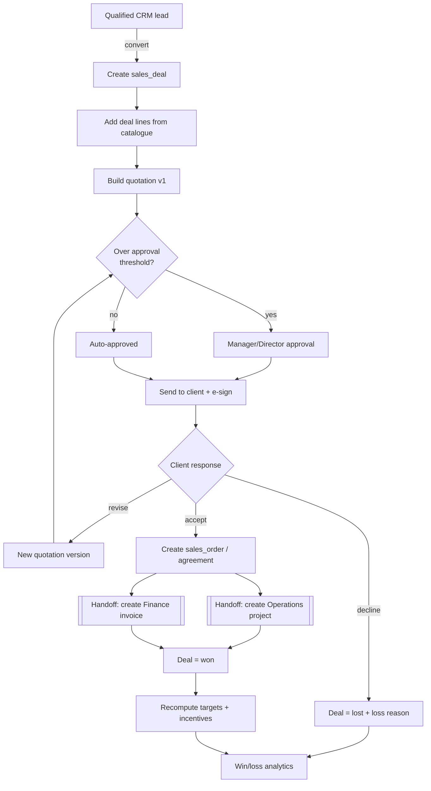
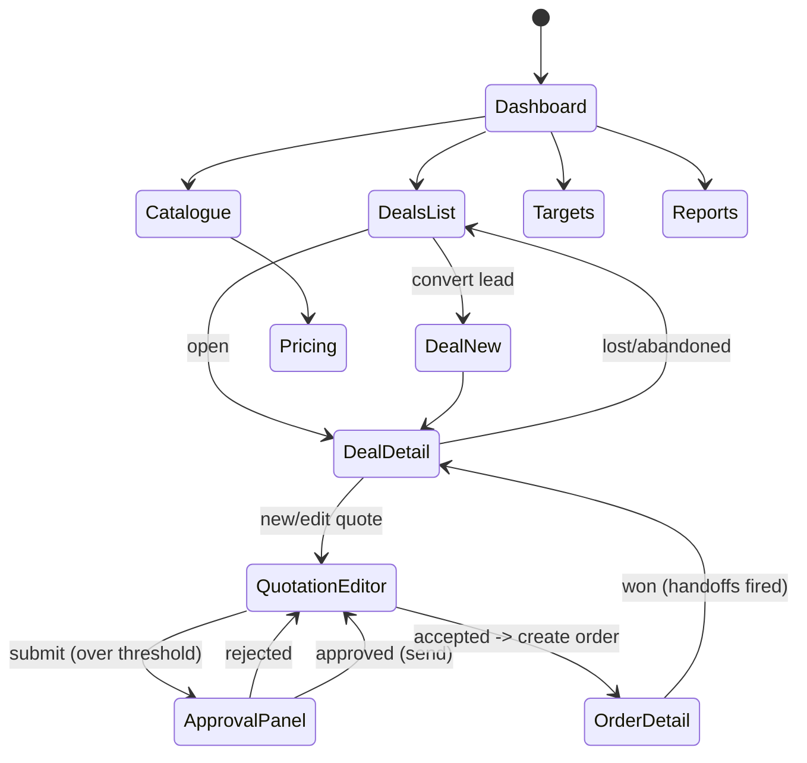
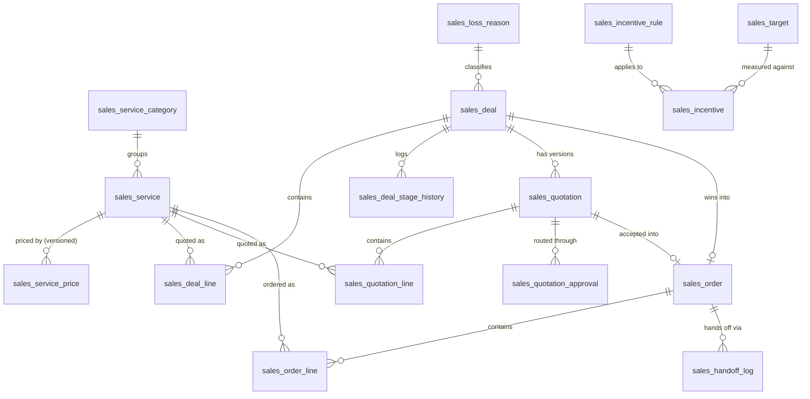

# Module Design — Sales

**Status:** Design (Phase D). Follows §6 of `00_ENTERPRISE_ARCHITECTURE.md`.
**Module key:** `sales`
**Anchor entities:** Deal, Quotation, Order (Service Agreement)
**Primary users:** Sales (executive), Manager, Director; read-only touch points for Accounts.
**Depends on:** `@/core/*`, and the **public `index.ts` APIs** of `crm` (leads/clients), `operations` (project creation), `finance` (invoice creation).

---

## 1. Purpose & scope

### Business capability
Sales owns the **money-getting pipeline** for TPS Xperts Group's regulatory-consulting and NABCB-certification services: turning a qualified CRM lead into a priced, approved, signed commercial commitment, then handing that commitment to Operations (to deliver the work) and Finance (to bill for it).

The commercial reality this module must model is **B2B regulatory-services quoting**, where every deal is a mix of:
- **Consulting / professional fee** — TPS's own revenue (e.g. drafting an FSSAI licence application, running a certification audit). This is what Sales targets and incentives are measured on.
- **Government / pass-through fee** — statutory fees paid to FSSAI/FoSCoS or an accreditation body on the client's behalf. This is *not* TPS revenue; it must be quoted transparently, billed separately, and never counted toward margin, targets, or incentives.

### Who uses it
| Role | What they do here |
|---|---|
| `executive` (Sales) | Owns deals, builds quotations, records win/loss. |
| `manager` | Approves quotations above threshold, sets/monitors targets, reassigns deals. |
| `director` | Full oversight, pricing/catalogue governance, incentive sign-off. |
| `accounts` | Read deal/order financials for invoicing reconciliation (no editing of deals). |
| `super_admin` | Configuration and break-glass. |
| `auditor` | Read-only (external ISO/NABCB audit trail). |

### Explicitly NOT in scope
- **Lead capture / nurturing / contact management** → CRM module. Sales consumes a CRM `lead` + `client`; it does not create leads.
- **Project execution, stages, tasks, deliverables** → Operations. Sales *creates* the project via a handoff contract, then lets go.
- **Invoicing, payment collection, receipts, government-fee ledger** → Finance. Sales *creates* the invoice request via a handoff contract; it does not track payments.
- **Certification audit execution, NC handling, certificate issuance** → Certification module. Sales only sells the audit (the commercial order); Certification runs it.
- **Payroll disbursement of incentives** → HRMS/Payroll. Sales *computes* incentive amounts and marks them approved; Payroll pays them.

---

## 2. Business workflow

### End-to-end process (grounded in TPS operations)

1. **Deal creation.** A CRM lead reaches "qualified". Sales converts it into a `sales_deal` (owner, source, client/lead ref, estimated value). One lead → one primary deal; a deal always points back to its CRM origin.
2. **Scoping & line items.** The executive adds `sales_deal_line` rows from the **service catalogue** (e.g. "FSSAI State Licence — New Application", "Annual Return filing", "Label Artwork Review", "ISO 22000 Stage 1+2 Audit"). Each line pulls the current **consulting fee** and **government fee** from the versioned price book; the executive may apply a line discount (bounded by role).
3. **Quotation build.** Lines are frozen into a `sales_quotation` (version 1). The quote clearly separates *Professional Fees (subtotal + GST)* from *Government / Statutory Fees (pass-through, no GST by TPS)*. A PDF is generated and stored.
4. **Internal approval.** If the quote's consulting value or discount exceeds the executive's approval limit, it routes to `manager`/`director` (`sales_quotation_approval`). Below threshold, it auto-approves.
5. **Send & e-sign.** Approved quote is sent to the client. Client acceptance is captured either as an e-sign event or a manual "accepted" mark with uploaded proof. Revisions create a **new version** (v2, v3…) — quotes are immutable once sent; the old version is `superseded`.
6. **Order / Service Agreement.** An accepted quotation becomes a `sales_order` (the binding service agreement). This locks scope, price, and terms.
7. **Handoff → Operations.** On order activation, a **project-creation handoff** fires: Operations receives client, service scope, and `quoted_amount`, and returns a `project_id`. The order stores the back-reference. (See §5 Handoff Contracts.)
8. **Handoff → Finance.** In parallel, an **invoice handoff** fires per the order's billing schedule: Finance receives billable lines split into *consulting* and *government-fee* buckets and returns `invoice_id`(s). Sales never touches payment state after this.
9. **Win.** Deal stage → `won`. Actual won value = order consulting subtotal. Targets and incentives recompute.
10. **Loss / abandon.** If the client declines, deal → `lost` with a `sales_loss_reason` (price, competitor, timeline, no-budget, non-responsive…). Feeds win/loss analytics.
11. **Targets & incentives.** Monthly/quarterly `sales_target` per owner/team; `sales_incentive` rows are computed from *won consulting revenue only* against `sales_incentive_rule`, then approved by director and exported to Payroll.



---

## 3. Screen flow

### Screen inventory
| Route | Screen | Purpose | Guard (permission) |
|---|---|---|---|
| `/sales` | Sales Dashboard | KPIs, pipeline, my deals, targets | `sales.dashboard.view` |
| `/sales/deals` | Deals (Kanban + table) | Pipeline by stage, filters | `sales.deal.view` |
| `/sales/deals/:id` | Deal detail | Lines, quotations, activity, win/loss | `sales.deal.view` |
| `/sales/deals/new` | New deal (from lead) | Convert CRM lead → deal | `sales.deal.create` |
| `/sales/quotations` | Quotations list | All versions, status filter | `sales.quotation.view` |
| `/sales/quotations/:id` | Quotation editor / preview | Build lines, PDF preview, send | `sales.quotation.view` |
| `/sales/quotations/:id/approve` | Approval panel | Approve/reject with note | `sales.quotation.approve` |
| `/sales/orders` | Orders / Agreements | Active agreements, handoff status | `sales.order.view` |
| `/sales/orders/:id` | Order detail | Scope lock, project link, invoice links | `sales.order.view` |
| `/sales/catalogue` | Service catalogue | Services, categories, active flags | `sales.catalogue.view` |
| `/sales/catalogue/pricing` | Pricing (versioned) | Consulting + govt fee price book | `sales.price.manage` |
| `/sales/targets` | Targets & incentives | Set targets, view attainment/payouts | `sales.target.view` |
| `/sales/reports` | Sales reports | Pipeline, win/loss, forecast, incentive | `sales.report.view` |



---

## 4. Database design

All tables live in the `public` schema, prefixed `sales_`, snake_case. Money stored as `numeric(14,2)` in INR. Every table carries `id uuid pk default gen_random_uuid()`, `created_at timestamptz default now()`, `updated_at timestamptz`, and (where mutated) `created_by uuid references auth.users`. RLS enabled on **every** table.

### Enums
| Enum | Values |
|---|---|
| `sales_service_type` | `fssai_new`, `fssai_renewal`, `fssai_modification`, `annual_return`, `form_ii`, `artwork`, `claim_check`, `certification_audit`, `other` |
| `sales_fee_type` | `consulting`, `govt_pass_through` |
| `sales_deal_stage` | `prospecting`, `qualification`, `quotation`, `negotiation`, `verbal_commit`, `won`, `lost`, `abandoned` |
| `sales_quotation_status` | `draft`, `pending_approval`, `approved`, `sent`, `accepted`, `rejected`, `expired`, `superseded` |
| `sales_order_status` | `draft`, `active`, `handed_off`, `completed`, `cancelled` |
| `sales_handoff_type` | `project`, `invoice` |
| `sales_handoff_status` | `pending`, `success`, `failed` |
| `sales_incentive_status` | `pending`, `approved`, `paid`, `void` |
| `sales_target_period` | `monthly`, `quarterly`, `annual` |

### Tables (16)
| Table | Purpose | Key columns |
|---|---|---|
| `sales_service_category` | Catalogue grouping | `name`, `slug`, `sort_order`, `is_active` |
| `sales_service` | Catalogue item (what TPS sells) | `code` (uniq), `name`, `service_type`, `category_id fk`, `default_hsn_sac`, `requires_govt_fee bool`, `operations_service_template` (hint for project creation), `is_active` |
| `sales_service_price` | **Versioned** pricing per service | `service_id fk`, `consulting_fee`, `govt_fee`, `currency`, `effective_from`, `effective_to`, `is_current bool` |
| `sales_deal` | Opportunity | `code` (uniq, e.g. DEAL-2026-0001), `crm_lead_id`, `client_id`, `title`, `owner_id fk`, `stage`, `source`, `estimated_value`, `probability_pct`, `expected_close_date`, `loss_reason_id fk`, `won_at`, `lost_at` |
| `sales_deal_line` | Draft scope on the deal | `deal_id fk`, `service_id fk`, `qty`, `consulting_fee`, `govt_fee`, `discount_pct`, `line_total_consulting`, `notes` |
| `sales_deal_stage_history` | Stage transitions (audit) | `deal_id fk`, `from_stage`, `to_stage`, `changed_by`, `changed_at`, `note` |
| `sales_loss_reason` | Lookup of loss/abandon reasons | `label`, `is_active` |
| `sales_quotation` | Versioned commercial offer | `deal_id fk`, `version int`, `status`, `valid_until`, `consulting_subtotal`, `discount_total`, `gst_amount`, `govt_fee_total`, `grand_total`, `pdf_path`, `sent_at`, `accepted_at`, `superseded_by fk` |
| `sales_quotation_line` | Frozen line snapshot | `quotation_id fk`, `service_id fk`, `description`, `qty`, `unit_consulting_fee`, `govt_fee`, `discount_pct`, `fee_type`, `line_total` |
| `sales_quotation_approval` | Approval / e-sign chain | `quotation_id fk`, `approver_id fk`, `decision` (`approved`/`rejected`), `decided_at`, `esign_provider`, `esign_ref`, `note` |
| `sales_order` | Service agreement (binding) | `code` (uniq, ORD-2026-0001), `deal_id fk`, `quotation_id fk`, `client_id`, `status`, `total_consulting`, `total_govt_fee`, `billing_schedule` (`upfront`/`milestone`/`on_completion`), `operations_project_id` (back-ref), `signed_agreement_path`, `activated_at` |
| `sales_order_line` | Order scope lock | `order_id fk`, `service_id fk`, `qty`, `consulting_fee`, `govt_fee`, `fee_type`, `line_total` |
| `sales_handoff_log` | Idempotent outbound handoffs | `order_id fk`, `handoff_type`, `status`, `target_ref` (project_id/invoice_id), `payload jsonb`, `attempts`, `last_error`, `completed_at` — **unique(order_id, handoff_type)** |
| `sales_target` | Quota per owner/team | `owner_id fk` (nullable for team), `team` (nullable), `period_type`, `period_start`, `period_end`, `target_consulting_amount` |
| `sales_incentive_rule` | Incentive policy | `name`, `basis` (`won_consulting`), `rate_pct`, `min_attainment_pct`, `effective_from`, `effective_to`, `is_active` |
| `sales_incentive` | Computed payout | `owner_id fk`, `period_start`, `period_end`, `rule_id fk`, `won_amount`, `attainment_pct`, `incentive_amount`, `status`, `approved_by`, `payroll_ref` |



### RLS intent (per table)
- **Read:** `sales.*.view` holders. Executives see rows they own (`owner_id = auth.uid()`) plus team rows if `manager`/`director`; managers/directors/super_admin/auditor see all. `accounts` gets read on `sales_order`, `sales_order_line`, `sales_quotation` only (for reconciliation).
- **Write:** `sales_deal` / `sales_deal_line` / `sales_quotation*` insert-update limited to the deal owner or a manager+. Discount ceilings enforced in a `BEFORE` trigger, not just UI.
- **Catalogue & pricing** (`sales_service*`): read for all sales roles; write only `sales.price.manage` (director/super_admin). Price rows are **append-only** (expand-contract): never update an effective price, insert a new version and flip `is_current`.
- **Orders & handoff_log:** insert/activate limited to `manager`+; `sales_handoff_log` is written only by the handoff RPC (SECURITY DEFINER), never by the client directly.
- **Targets/incentives:** targets writable by `manager`+; incentive rows are trigger/RPC-computed and only `approved` by `director` (`sales.incentive.approve`).
- `auditor` role: `SELECT`-only policy across all `sales_*` tables.

### Expand-contract notes
- Reuses existing `operations.projects.quoted_amount` / `paid_amount` — Sales writes `quoted_amount` **only via the handoff RPC** at project creation; it never back-writes Operations tables directly.
- `sales_service.operations_service_template` and `sales_order.operations_project_id` are additive nullable columns — safe to add before Operations consumes them.
- New enums are additive; new values appended at the end (never reordered) to preserve stored ordinals.

---

## 5. API design

Module `api/*` functions are thin typed Supabase wrappers; cross-module side effects and idempotency live in **SECURITY DEFINER RPCs** so authorization and the handoff contract are enforced in the DB.

### `api/*` (typed data access)
| Function | Inputs | Output | Authz |
|---|---|---|---|
| `listDeals(filters)` | stage, owner, source, q, page | `Deal[]` | `sales.deal.view` (RLS-scoped) |
| `getDeal(id)` | `id` | `Deal + lines + quotations` | `sales.deal.view` |
| `createDealFromLead(leadId, payload)` | CRM lead id, owner, title | `Deal` | `sales.deal.create` |
| `updateDealStage(id, toStage, note)` | id, stage, note | `Deal` | `sales.deal.edit` |
| `upsertDealLine(dealId, line)` | service_id, qty, discount | `DealLine` | `sales.deal.edit` |
| `createQuotation(dealId)` | deal id (snapshots current lines) | `Quotation v(n)` | `sales.quotation.create` |
| `reviseQuotation(quotationId)` | id | new version, supersedes prior | `sales.quotation.create` |
| `generateQuotationPdf(quotationId)` | id | `{ pdf_path }` (Edge Function) | `sales.quotation.view` |
| `listCatalogue()` / `getCurrentPrice(serviceId)` | — / service | `Service[]` / price | `sales.catalogue.view` |
| `upsertServicePrice(serviceId, price)` | consulting_fee, govt_fee, effective_from | new version row | `sales.price.manage` |
| `listOrders(filters)` / `getOrder(id)` | filters / id | `Order[]` / `Order` | `sales.order.view` |
| `setTarget(payload)` / `listTargets(period)` | owner/team, period, amount | `Target` | `sales.target.manage` / `.view` |

### RPCs / Edge Functions
| Name | Kind | Inputs | Output | Authz |
|---|---|---|---|---|
| `sales_submit_quotation_for_approval(quotation_id)` | RPC | id | routes: `pending_approval` or auto-`approved` per threshold | `sales.quotation.create` |
| `sales_decide_quotation(quotation_id, decision, note, esign_ref)` | RPC | id, approve/reject | updates status + `sales_quotation_approval` | `sales.quotation.approve` |
| `sales_accept_quotation(quotation_id, proof_path)` | RPC | id | creates `sales_order` (draft) from accepted quote | `sales.order.create` |
| `sales_activate_order(order_id)` | RPC (SECURITY DEFINER) | id | activates order, **fires both handoffs**, marks deal `won` | `sales.order.activate` |
| `sales_create_project_handoff(order_id)` | RPC (DEFINER) | id | calls `operations.create_project_from_order(...)`; writes `sales_handoff_log(project)`; sets `operations_project_id` | internal (called by activate) |
| `sales_create_invoice_handoff(order_id)` | RPC (DEFINER) | id | calls `finance.create_invoice_from_order(...)`; writes `sales_handoff_log(invoice)` | internal |
| `sales_recompute_incentives(period_start, period_end)` | RPC | period | upserts `sales_incentive` from won revenue vs rules & targets | `sales.incentive.manage` |
| `generate-quotation-pdf` | Edge Function | quotation_id | renders PDF → Storage `sales-quotations` bucket | invoked via signed call |

### Handoff contracts (explicit)

**Deal → Operations (project creation).** Consumed via `operations` public API `operations.create_project_from_order(input)`:
```
input  = {
  order_id, client_id,
  services: [{ service_type, service_code, qty, operations_service_template }],
  quoted_amount,                 // = sales_order.total_consulting (consulting ONLY)
  govt_fee_total,                // informational; Operations does not bill it
  sales_owner_id, agreement_path
}
output = { project_id }
```
Rules: consulting-only `quoted_amount` (never includes pass-through govt fee); idempotent on `order_id`; failure leaves order `active` with `sales_handoff_log.status = failed` for retry. Sales writes back `operations_project_id`; it never mutates other Operations columns.

**Deal → Finance (invoice creation).** Consumed via `finance` public API `finance.create_invoice_from_order(input)`:
```
input  = {
  order_id, client_id, billing_schedule,
  lines: [{ description, fee_type ('consulting'|'govt_pass_through'),
            amount, hsn_sac, gst_applicable }],
  project_id                    // link once Operations returns it
}
output = { invoice_id[] }       // consulting + govt-fee split per Finance policy
```
Rules: `consulting` lines carry GST; `govt_pass_through` lines are billed at cost with no TPS GST. Idempotent on `(order_id, billing_schedule)` via `sales_handoff_log`. Sales does not read or write payment state — it only requests invoice creation.

---

## 6. Permissions

Keys namespaced `sales.<entity>.<action>`. Default role grants (✓ = default holder):

| Permission | executive | manager | director | accounts | auditor | super_admin |
|---|:--:|:--:|:--:|:--:|:--:|:--:|
| `sales.dashboard.view` | ✓ | ✓ | ✓ |  | ✓ | ✓ |
| `sales.deal.view` | own | ✓ | ✓ |  | ✓ | ✓ |
| `sales.deal.create` | ✓ | ✓ | ✓ |  |  | ✓ |
| `sales.deal.edit` | own | ✓ | ✓ |  |  | ✓ |
| `sales.deal.reassign` |  | ✓ | ✓ |  |  | ✓ |
| `sales.quotation.view` | own | ✓ | ✓ | ✓ | ✓ | ✓ |
| `sales.quotation.create` | ✓ | ✓ | ✓ |  |  | ✓ |
| `sales.quotation.approve` |  | ✓ | ✓ |  |  | ✓ |
| `sales.order.view` | own | ✓ | ✓ | ✓ | ✓ | ✓ |
| `sales.order.create` | ✓ | ✓ | ✓ |  |  | ✓ |
| `sales.order.activate` |  | ✓ | ✓ |  |  | ✓ |
| `sales.catalogue.view` | ✓ | ✓ | ✓ | ✓ | ✓ | ✓ |
| `sales.price.manage` |  |  | ✓ |  |  | ✓ |
| `sales.target.view` | own | ✓ | ✓ |  | ✓ | ✓ |
| `sales.target.manage` |  | ✓ | ✓ |  |  | ✓ |
| `sales.incentive.manage` |  | ✓ | ✓ |  |  | ✓ |
| `sales.incentive.approve` |  |  | ✓ |  |  | ✓ |
| `sales.report.view` | own | ✓ | ✓ | ✓ | ✓ | ✓ |

**RLS mapping.** `useCan()` gates UI affordance; the authoritative check is RLS. "own" = row `owner_id = auth.uid()` (or via `sales_deal.owner_id` for child rows). Approval/activation/price/incentive actions additionally check the permission inside their SECURITY DEFINER RPCs, so even a crafted client call is rejected. Discount ceilings and quotation-approval thresholds are enforced in `BEFORE` triggers keyed to the actor's role.

---

## 7. Dashboard

| Widget | Metric | Source |
|---|---|---|
| Pipeline value | Sum `estimated_value × probability_pct` by open stage | `sales_deal` (open stages) |
| Weighted forecast (period) | Expected consulting revenue this month/quarter | `sales_deal` + `sales_deal_line` |
| Won consulting (MTD/QTD) | Sum `sales_order.total_consulting` for `won` deals | `sales_order` + `sales_deal` |
| Target attainment | Won ÷ `target_consulting_amount` | `sales_target` + won revenue |
| Deals by stage | Kanban count/value per stage | `sales_deal` |
| Quotations pending approval | Count `status = pending_approval` | `sales_quotation` |
| Win rate | won ÷ (won + lost) over window | `sales_deal` |
| Handoff health | Orders with `failed`/`pending` handoffs | `sales_handoff_log` |
| Govt-fee under management | Sum `total_govt_fee` on active orders | `sales_order` |
| My incentive (period) | Projected payout | `sales_incentive` |

All widgets RLS-scoped: executives see own numbers; managers/directors see team/company. staleTime 60s; query keys `['sales', <widget>, ...params]`.

---

## 8. Reports

| Report | Columns | Filters | Export |
|---|---|---|---|
| Pipeline report | Deal, client, owner, stage, value, weighted, expected close | owner/team, stage, source, date range | CSV, PDF |
| Win/Loss analysis | Deal, outcome, loss reason, competitor, value, days-to-close | period, owner, reason | CSV, PDF |
| Quotation register | Quote #, version, deal, status, consulting, govt fee, grand total, valid-until | status, owner, date | CSV, PDF |
| Sales forecast | Owner, weighted pipeline, committed, target, gap | period, team | CSV, PDF |
| Order / agreement register | Order #, client, consulting, govt fee, billing schedule, project link, invoice link | status, date | CSV, PDF |
| Government-fee pass-through | Order, service, govt fee, invoice ref | period, client | CSV, PDF |
| Target attainment | Owner/team, target, won, attainment %, incentive | period | CSV, PDF |
| Incentive payout | Owner, period, won amount, rate, incentive, status | period, status | CSV, PDF |

Exports go through the shared reporting export path (server-rendered CSV/PDF); no client-side heavy joins.

---

## 9. Notifications

Via `core/notifications` only (`notify({...})`); channels gated by settings. New `notification_type` values prefixed `sales_`.

| Event | notification_type | Recipients | Channels |
|---|---|---|---|
| Quotation submitted for approval | `sales_quote_approval_requested` | Approving manager/director | in-app, email |
| Quotation approved/rejected | `sales_quote_decided` | Deal owner | in-app, email |
| Quotation sent to client | `sales_quote_sent` | Deal owner (cc manager) | in-app |
| Quotation accepted (won) | `sales_deal_won` | Owner, manager, director | in-app, email |
| Quotation nearing expiry (valid_until −3d) | `sales_quote_expiring` | Deal owner | in-app, email |
| Deal lost | `sales_deal_lost` | Manager | in-app |
| Order activated / handoff done | `sales_order_activated` | Owner, accounts, ops manager | in-app, email |
| **Handoff failed** | `sales_handoff_failed` | Manager, super_admin | in-app, email |
| Incentive approved | `sales_incentive_approved` | Owner | in-app, email |
| Target at risk (period, <70% with <20% time left) | `sales_target_at_risk` | Owner, manager | in-app |

WhatsApp channel is available where the recipient/setting permits (client-facing quote-sent), but stays a stub until the BSP number is live — respects the platform's settings-gated dispatch.

---

## 10. Automations

| Job | Type | Trigger / cadence | Action |
|---|---|---|---|
| Deal stage-change audit | DB trigger (`AFTER UPDATE` on `sales_deal.stage`) | on change | insert `sales_deal_stage_history` + `notify` |
| Discount ceiling enforcement | DB trigger (`BEFORE` on deal/quote line) | on write | reject if `discount_pct` > role limit |
| Quotation supersede | DB trigger | on `reviseQuotation` | mark prior version `superseded`, set `superseded_by` |
| Handoff on order activation | RPC-driven (`sales_activate_order`) | on activate | fire project + invoice handoffs, log to `sales_handoff_log` |
| Handoff retry | pg_cron → Edge Function (gated) | every 15 min | retry `sales_handoff_log` rows in `failed`/`pending` (bounded attempts) |
| Quotation expiry sweep | pg_cron → Edge Function | daily 07:00 IST | mark past `valid_until` as `expired`; send `sales_quote_expiring` at −3d |
| Incentive recompute | pg_cron → Edge Function | nightly + on `won` | run `sales_recompute_incentives` for open periods |
| Stale deal nudge | pg_cron → Edge Function | daily | notify owners of deals with no activity > N days |
| Target-at-risk check | pg_cron → Edge Function | weekly | compute attainment vs elapsed period, notify |

All scheduled work is settings-gated so staging stays sandboxed. Event work writes audit rows via the shared `audit_log` helper.

---

## 11. Integrations

| System | Purpose | Boundary / adapter |
|---|---|---|
| **Operations module** | Create delivery project from won order | `operations.create_project_from_order()` public API (in-DB RPC). Consulting-only `quoted_amount`. |
| **Finance module** | Create invoice(s) from order | `finance.create_invoice_from_order()` public API; consulting vs govt-fee split. |
| **CRM module** | Source lead/client for a deal | `crm` public API (read `lead`, `client`); no write-back beyond marking lead converted via CRM's own API. |
| **e-sign provider** | Client acceptance signature on quote/agreement | Adapter in module `api/`; stores `esign_provider` + `esign_ref` on `sales_quotation_approval`. Provider TBD (Zoho Sign / Digio) — abstracted behind one interface. |
| **PDF generation** | Quotation + agreement PDFs | `generate-quotation-pdf` Edge Function → `sales-quotations` Storage bucket (RLS storage policy). |
| **ZeptoMail (email)** | Quote-sent, approvals, won/lost, incentives | via `core/notifications` dispatch only. |
| **WhatsApp BSP (AiSensy)** | Client-facing quote delivery | via `core/notifications`; stubbed/off until number live. |
| **Google Drive** (`core/files`) | Signed-agreement archival | `core/files` unified API; `disableConversionToGoogleType: true`. |
| **FSSAI FoSCoS** | *Reference only* — govt fee schedule informs catalogue pricing | Manual/curated into `sales_service_price`; no live API dependency for quoting. |

Sales never calls email/WhatsApp/Drive directly — always through Core. Cross-module calls go through the other module's `index.ts` public API (or in-DB RPC), never its internals.

---

## 12. Future scalability

- **10× deal volume:** pipeline/forecast queries are the hot path — covered by indexes on `sales_deal(owner_id, stage, expected_close_date)` and materialized `sales_forecast_daily` refreshed by pg_cron if aggregation cost grows. Kanban paginates per column.
- **Multi-entity (TPS Xperts Group + TPS Global Certification):** add nullable `business_unit`/`legal_entity_id` to `sales_deal`/`sales_order` (additive) so consulting deals and certification-audit deals report separately while sharing one pipeline. RLS extends with an entity-scope predicate.
- **Multi-tenant (if productized):** the module is already schema- and RLS-isolated; a `tenant_id` column + tenant predicate on every RLS policy is the only structural change — no query rewrites.
- **Catalogue/pricing growth:** versioned `sales_service_price` already supports unlimited history; add region/client-tier price lists as an additional dimension without touching existing rows.
- **Approval complexity:** current threshold model can graduate to a rules table (`sales_approval_rule`) driving multi-step chains without changing quotation schema.
- **Incentive plans:** `sales_incentive_rule` is data-driven; tiered/accelerator plans add rows, not code. Payout export to Payroll stays a single contract.
- **Data volume:** stage history, handoff logs, and superseded quotations are append-only and archivable to cold storage by `created_at` partitioning if needed.

---

## 13. Architecture diagram

```mermaid
flowchart TB
    subgraph UI[Sales UI · modules/sales]
        P[pages: deals, quotations, orders, catalogue, targets, reports]
        H[hooks: React Query]
        A[api: typed Supabase wrappers]
        P --> H --> A
    end

    subgraph Core[Core Platform · core/*]
        AUTH[auth]
        ACCESS[access: useCan / RLS keys]
        NOTIF[notifications: notify]
        FILES[files: Storage + Drive]
        UIU[ui + utils]
    end

    subgraph DB[(Supabase Postgres · RLS)]
        T[sales_* tables]
        RPC[[SECURITY DEFINER RPCs:<br/>activate_order, handoffs,<br/>recompute_incentives]]
        TRG[triggers: stage history,<br/>discount ceiling, supersede]
        CRON[pg_cron: expiry, retry,<br/>incentives, nudges]
    end

    subgraph Modules[Other modules · via public index.ts / RPC]
        OPS[operations.create_project_from_order]
        FIN[finance.create_invoice_from_order]
        CRM[crm: lead / client]
    end

    subgraph Ext[External integrations]
        ESIGN[e-sign provider]
        MAIL[ZeptoMail]
        WA[WhatsApp BSP · gated]
        DRIVE[Google Drive]
        EDGE[Edge Fn: generate-quotation-pdf]
    end

    A -->|client| DB
    A --> ACCESS
    A --> AUTH
    RPC --> OPS
    RPC --> FIN
    A --> CRM
    RPC --> NOTIF
    CRON --> NOTIF
    NOTIF --> MAIL
    NOTIF --> WA
    A --> FILES --> DRIVE
    EDGE --> FILES
    A --> ESIGN
    ACCESS -. reflects .-> T
```

---

**Handoff summary (contract recap):** `sales_activate_order` is the single choke point that turns a won deal into downstream work — it calls `operations.create_project_from_order` (consulting-only `quoted_amount`) and `finance.create_invoice_from_order` (consulting vs govt-fee split), both idempotent via `sales_handoff_log`, and marks the deal `won`. Sales owns nothing about delivery or payment after that.
