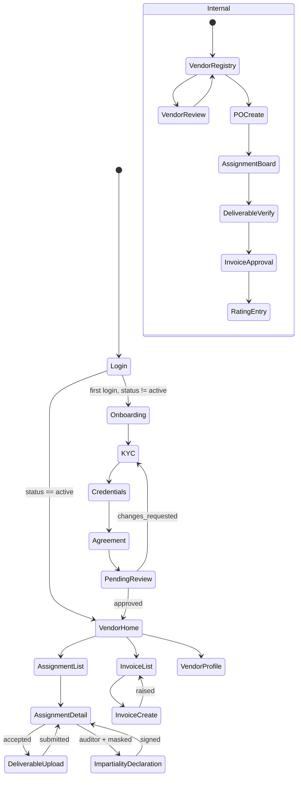
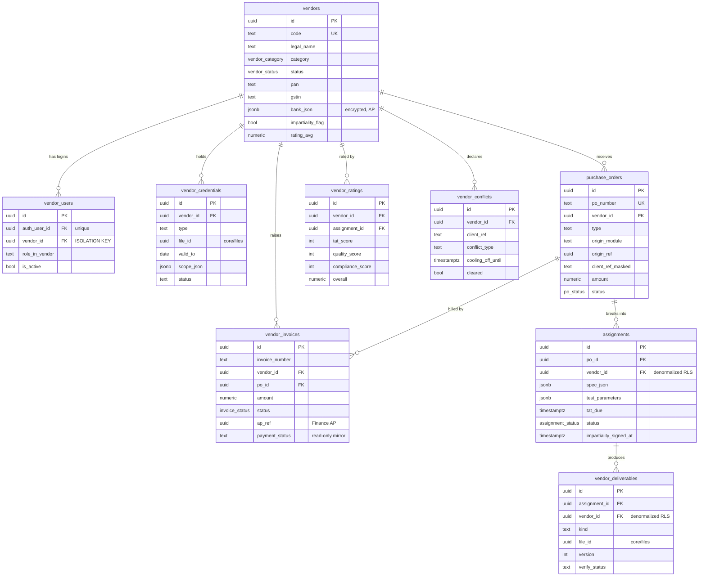
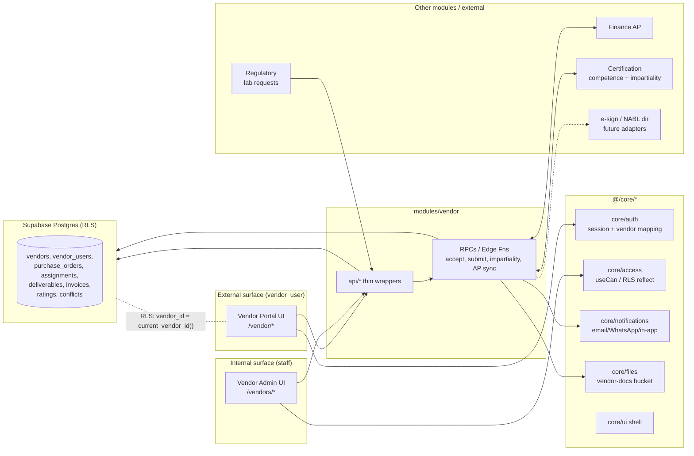

# Module Design — Vendor Portal

**Module key:** `vendor` · **Anchor entity:** Vendor, Purchase Order / Assignment
**Primary users:** External vendors (NABL labs, sub-contract auditors/technical experts, printing/artwork vendors, associates/channel partners) via a dedicated `vendor_user` role; internal Procurement, Regulatory, Certification (scheme manager), and Finance/AP staff.
**Status:** Design-only (Phase D). Follows `00_ENTERPRISE_ARCHITECTURE.md` §6 template.

> **Surface class:** EXTERNAL, multi-party. This is the first vendor-facing surface. The governing non-negotiable is **row-level data isolation**: a `vendor_user` may read/write only rows whose `vendor_id` equals their mapped vendor. Everything below is subordinate to that.

---

## 1. Purpose & scope

**Business capability.** Give TPS a single governed surface to (a) onboard and empanel external vendors with KYC, agreements and competence credentials; (b) issue purchase orders / work assignments (lab test requests, ISO audit sub-assignments, artwork/printing jobs); (c) collect deliverables (test reports, audit reports, proofs) through Core files; (d) capture vendor invoices and feed Accounts Payable; (e) rate vendor compliance and performance; and (f) notify both sides of every state change.

**Who uses it.**
- **Vendors (external `vendor_user`):** log in, complete onboarding, accept assignments, upload deliverables, raise invoices, track payment status — scoped strictly to their own vendor.
- **Procurement / Vendor manager (internal):** maintain the vendor master, run empanelment, raise POs/assignments, verify deliverables, approve invoices for AP hand-off, maintain ratings.
- **Regulatory executives (internal):** raise lab-test requests to NABL vendors and consume returned reports.
- **Certification scheme manager (internal):** sub-contract auditors/technical experts with an **impartiality gate** (ISO/IEC 17021-1 §5.2, IAF MD).
- **Finance/AP (internal):** consume approved vendor invoices (this module is the source; Finance owns settlement).

**Explicitly NOT in scope (anti-scope).**
- **No payment execution.** Vendor invoices are *captured and approved* here, then handed to **Finance & Accounts (AP)**. No fund transfer, no ledger posting in this module.
- **No auditor competence system of record.** Auditor qualification/scope authorization lives in **Certification (module 8)**; Vendor Portal *references* it (impartiality + competence check) but does not own it.
- **No client-facing views.** Clients use **Customer Portal (module 13)**. A vendor never sees client identities beyond what an assignment strictly requires (masked where impartiality demands).
- **No document authoring.** File storage/versioning is **Core files** + **Document Management (module 9)**; this module only links deliverables.
- **No procurement of goods/inventory.** Work/services only; no stock, GRN, or warehousing.
- **No general auth.** Login/session/idle-logout is **Core auth**; this module only maps a user to a `vendor_id`.

---

## 2. Business workflow

### 2.1 End-to-end processes (numbered)

**A. Vendor onboarding & empanelment**
1. Internal Procurement creates a `vendors` shell (name, category, contact) → status `invited`; Core dispatches an invite.
2. Vendor self-registers; a `vendor_users` row is created and linked to the `vendor_id` (external role).
3. Vendor completes **KYC** (PAN/GST, address, bank proof for AP, MSME) → uploads via Core files → `kyc_submitted`.
4. Vendor uploads **credentials**: for a lab, NABL scope certificate + validity + accredited parameters; for an auditor, CV, ISO 17021 qualifications, IAF/EA scope codes, impartiality declaration.
5. Vendor accepts the **empanelment agreement / NDA** (e-sign or upload) → `agreement_signed`.
6. Procurement reviews KYC + credentials; Certification scheme manager separately validates auditor competence/impartiality → **approve** (`active`) or **return** (`changes_requested`) with reasons.
7. Empanelled: vendor becomes eligible for POs/assignments in its category and accredited scope.

**B. Lab test request (NABL lab — grounded example)**
1. Regulatory executive needs a nutraceutical assay (e.g., heavy metals + label-claim actives for a client product).
2. System filters vendors: category `nabl_lab`, `active`, whose accredited parameters cover the requested tests, not expired.
3. Executive raises a `purchase_orders` row (type `lab_test`) → creates an `assignments` row (sample details, test parameters, TAT, sample dispatch note) → status `issued`.
4. Lab `vendor_user` sees only this assignment, **accepts** (`accepted`) or declines; sample is received (`in_progress`).
5. Lab performs testing, uploads the **test report** as `vendor_deliverables` (linked file) → `submitted`.
6. Regulatory verifies report against requested parameters → `accepted` (or `revision_requested`).
7. Lab raises `vendor_invoices` against the PO → Procurement approves → handed to Finance AP.
8. Rating recorded (TAT adherence, report quality, NABL scope match).

**C. Sub-contracted ISO auditor assignment (CB — impartiality-gated)**
1. Certification module has an audit needing a sub-contract auditor/technical expert.
2. Scheme manager selects candidates: category `auditor`, competent for the client's IAF/EA scope (from Certification), **and** passing the **impartiality check** — the candidate must have no conflict with the client (no prior consultancy, ownership, employment within the cooling-off window).
3. Assignment issued (`assignment` type PO) with client **masked to a code** until the auditor confirms no conflict.
4. Auditor accepts + signs a **per-assignment impartiality & confidentiality declaration** → client details unmasked → `accepted`.
5. Auditor conducts audit, uploads the **audit report / NC findings** as a deliverable → Certification consumes it.
6. Auditor invoices → approved → Finance AP. Performance rating recorded.

### 2.2 Flowchart

```mermaid
flowchart TD
  A([Procurement creates vendor shell]) --> B[Vendor self-registers -> vendor_user linked to vendor_id]
  B --> C[KYC + credentials upload via Core files]
  C --> D[Accept agreement / NDA]
  D --> E{Internal review}
  E -->|auditor| F[Certification: competence + impartiality validation]
  E -->|lab / printing / associate| G[Procurement KYC + scope review]
  F --> H{Approve?}
  G --> H
  H -->|return| C
  H -->|approve| I[[Vendor active / empanelled]]
  I --> J[PO / Assignment issued -> assignment row]
  J --> K{Impartiality gate\n(auditor only)}
  K -->|conflict| J
  K -->|clear / N-A| L[Vendor accepts assignment]
  L --> M[Work performed -> deliverable uploaded]
  M --> N{Internal verify deliverable}
  N -->|revision| M
  N -->|accept| O[Vendor raises invoice]
  O --> P[Procurement approves -> hand off to Finance AP]
  P --> Q[Payment status synced back read-only]
  Q --> R[Compliance + performance rating recorded]
```

---

## 3. Screen flow

External vendors and internal staff use **different route trees** off the same module. Vendor routes render inside a stripped shell (no cross-module nav). Internal routes live in the standard AppShell.



### Screen inventory

| Route | Screen | Audience | Key permission | Notes |
|---|---|---|---|---|
| `/vendor/login` | Vendor login | Vendor | (public) | Core auth; maps to `vendor_id` |
| `/vendor/onboarding` | Onboarding wizard (KYC → credentials → agreement) | Vendor | `vendor.onboarding.submit` | Blocks until `active` |
| `/vendor/home` | Vendor dashboard | Vendor | `vendor.portal.access` | Own KPIs only |
| `/vendor/assignments` | Assignment/PO list | Vendor | `vendor.assignment.read` | RLS-scoped to own vendor |
| `/vendor/assignments/:id` | Assignment detail + impartiality gate | Vendor | `vendor.assignment.read` | Client masked until declaration |
| `/vendor/assignments/:id/deliver` | Deliverable upload | Vendor | `vendor.deliverable.submit` | Core files widget |
| `/vendor/invoices` | Invoice list | Vendor | `vendor.invoice.read` | Own + payment status |
| `/vendor/invoices/new` | Raise invoice | Vendor | `vendor.invoice.create` | Against own accepted PO |
| `/vendor/profile` | Profile + credentials | Vendor | `vendor.profile.manage` | Renew NABL scope etc. |
| `/vendors` | Vendor registry | Internal | `vendor.master.read` | All vendors |
| `/vendors/:id` | Vendor review / empanelment | Internal | `vendor.master.approve` | KYC + credential verify |
| `/vendors/po/new` | Raise PO / assignment | Internal | `vendor.po.create` | Scope-filtered picker |
| `/vendors/assignments` | Assignment board | Internal | `vendor.assignment.manage` | Kanban by status |
| `/vendors/deliverables` | Deliverable verification queue | Internal | `vendor.deliverable.verify` | Accept/revision |
| `/vendors/invoices` | Invoice approval queue | Internal | `vendor.invoice.approve` | Hand-off to AP |
| `/vendors/ratings` | Rating entry / history | Internal | `vendor.rating.manage` | Per-assignment score |

---

## 4. Database design

Schema: `vendor` (logical namespace via table prefix `vendor_*` / `po_*`). All tables carry `id uuid pk default gen_random_uuid()`, `created_at`, `updated_at`, and an `audit_log` trigger. **`vendor_id` is the isolation key** and appears on every vendor-scoped table (denormalized deliberately so RLS never needs a join).

### 4.1 Tables

**`vendors`** — vendor master.
`id`, `code` (human ref, unique), `legal_name`, `category` (`vendor_category` enum), `status` (`vendor_status` enum), `pan`, `gstin`, `msme_no`, `address_json`, `bank_json` (encrypted; for AP), `contact_email`, `contact_phone`, `onboarded_by` (fk `auth.users`), `approved_by`, `approved_at`, `impartiality_flag` (bool — auditor conflict register link), `rating_avg` (numeric, denormalized rollup).

**`vendor_users`** — external login ↔ vendor mapping (the isolation anchor).
`id`, `auth_user_id` (fk `auth.users`, unique), `vendor_id` (fk `vendors`), `role_in_vendor` (`primary`/`staff`), `is_active`. One `auth.users` maps to exactly one vendor.

**`vendor_credentials`** — KYC docs + competence credentials.
`id`, `vendor_id`, `type` (`kyc_pan`/`kyc_gst`/`bank_proof`/`nabl_scope`/`iso_qualification`/`agreement`/`impartiality_decl`), `file_id` (Core files), `valid_from`, `valid_to`, `scope_json` (accredited parameters / IAF-EA codes), `verified_by`, `verified_at`, `status` (`pending`/`verified`/`rejected`/`expired`).

**`purchase_orders`** — PO / work-assignment header.
`id`, `po_number` (unique), `vendor_id`, `type` (`lab_test`/`audit_assignment`/`printing`/`consultancy`), `title`, `origin_module` (`regulatory`/`certification`/`operations`), `origin_ref` (uuid — e.g. certification audit id / regulatory licence id), `client_ref_masked` (text code shown pre-impartiality), `amount`, `currency`, `status` (`po_status` enum), `issued_by`, `issued_at`.

**`assignments`** — the executable work item under a PO (1 PO → 1..n assignments).
`id`, `po_id` (fk), `vendor_id` (denormalized for RLS), `spec_json` (sample details / audit scope / artwork brief), `test_parameters` (jsonb, lab), `tat_due`, `status` (`assignment_status` enum: `issued`/`accepted`/`declined`/`in_progress`/`submitted`/`accepted`/`revision_requested`/`closed`), `impartiality_signed_at` (auditor gate), `accepted_at`.

**`vendor_deliverables`** — submitted outputs.
`id`, `assignment_id` (fk), `vendor_id` (denormalized), `kind` (`test_report`/`audit_report`/`nc_findings`/`artwork_proof`), `file_id` (Core files), `version`, `submitted_at`, `verify_status` (`submitted`/`accepted`/`revision_requested`), `verified_by`, `verified_at`, `verify_notes`.

**`vendor_invoices`** — invoice capture → AP feed.
`id`, `invoice_number`, `vendor_id`, `po_id` (fk), `amount`, `tax_json`, `file_id`, `status` (`invoice_status`: `raised`/`approved`/`rejected`/`sent_to_ap`/`paid`), `approved_by`, `approved_at`, `ap_ref` (fk into Finance AP, nullable), `payment_status` (read-only mirror from Finance).

**`vendor_ratings`** — compliance & performance.
`id`, `vendor_id`, `assignment_id` (fk, nullable for periodic), `period`, `tat_score`, `quality_score`, `compliance_score`, `overall` (computed), `rated_by`, `notes`.

**`vendor_conflicts`** — impartiality register (auditor).
`id`, `vendor_id` (the auditor), `client_ref`, `conflict_type` (`prior_consultancy`/`employment`/`ownership`/`family`/`none`), `declared_at`, `cooling_off_until`, `cleared` (bool). Consulted by the impartiality gate before unmasking a client.

### 4.2 ER diagram



### 4.3 RLS intent per table

**Core isolation predicate** — a SQL helper resolves the caller's vendor:

```sql
create or replace function vendor.current_vendor_id() returns uuid
language sql stable security definer as $$
  select vendor_id from vendor.vendor_users
  where auth_user_id = auth.uid() and is_active = true
$$;
```

| Table | `vendor_user` (external) | Internal staff | Notes |
|---|---|---|---|
| `vendors` | `SELECT`/limited `UPDATE` where `id = current_vendor_id()` | full per permission | vendor edits only own profile fields (not `status`/`approved_by`) |
| `vendor_users` | `SELECT` where `vendor_id = current_vendor_id()` | manage | vendor cannot self-elevate role |
| `vendor_credentials` | `SELECT`/`INSERT` where `vendor_id = current_vendor_id()`; no `UPDATE` of `verified_*` | verify | vendor can add, only staff can verify |
| `purchase_orders` | `SELECT` where `vendor_id = current_vendor_id()` | create/manage | vendor never inserts POs |
| `assignments` | `SELECT`/status-only `UPDATE` (accept/decline/submit) where `vendor_id = current_vendor_id()` | manage | column-scoped update via RPC; client fields masked pre-impartiality |
| `vendor_deliverables` | `SELECT`/`INSERT` where `vendor_id = current_vendor_id()` | verify | verify columns staff-only |
| `vendor_invoices` | `SELECT`/`INSERT` where `vendor_id = current_vendor_id()`; `payment_status` read-only | approve/AP hand-off | vendor cannot set `status` beyond `raised` |
| `vendor_ratings` | **no external access** (internal-only) | manage | vendor sees only `rating_avg` rollup on own profile |
| `vendor_conflicts` | `SELECT`/`INSERT` (own declarations) where `vendor_id = current_vendor_id()` | manage/clear | clearing is staff-only |

Every table: `alter table … enable row level security; force row level security;` Internal-staff policies gate on `has_role()`/permission checks; external policies gate purely on `vendor_id = vendor.current_vendor_id()`. Storage buckets (`vendor-docs`) get parallel storage policies keyed on a `vendor_id/` path prefix.

### 4.4 Expand-contract notes

- Additive first: new credential `type` values and `assignment_status` values are added to enums via `ALTER TYPE … ADD VALUE` (non-breaking).
- `payment_status` on `vendor_invoices` is a read mirror; when Finance AP is built, add `ap_ref` FK (nullable, expand), backfill, then enforce.
- `vendor_id` denormalization on `assignments`/`vendor_deliverables`/`vendor_invoices` is intentional for single-predicate RLS; a trigger keeps it consistent with the parent PO.

---

## 5. API design

Module `api/*` are thin typed Supabase wrappers; state transitions that must enforce column-scoping or impartiality run through **RPCs / Edge Functions** (RLS-safe, `security definer` with internal re-checks).

| Function | Kind | Inputs | Output | Authz |
|---|---|---|---|---|
| `listMyAssignments(filter)` | api (select) | status, page | `Assignment[]` | RLS `vendor_id` |
| `getAssignment(id)` | api (select) | id | `Assignment` (client masked if unsigned) | RLS |
| `acceptAssignment(id)` | rpc | id | `Assignment` | vendor owns row; sets `accepted_at` |
| `declineAssignment(id, reason)` | rpc | id, reason | ok | vendor owns row |
| `signImpartiality(assignmentId, declJson)` | rpc | assignmentId, decl | unmasked assignment | checks `vendor_conflicts.cleared`; sets `impartiality_signed_at`, unmasks |
| `submitDeliverable(assignmentId, fileId, kind)` | rpc | ids, kind | `Deliverable` | vendor owns assignment; status→`submitted` |
| `createInvoice(poId, amount, taxJson, fileId)` | rpc | fields | `Invoice` | vendor owns PO; status`raised` |
| `submitOnboarding(payload)` | rpc | kyc/credentials refs | vendor status | `vendor.onboarding.submit` |
| `listMyInvoices()` | api | — | `Invoice[]` incl. `payment_status` | RLS |
| **Internal** | | | | |
| `createVendor(payload)` | api (insert) | master fields | `Vendor` | `vendor.master.create` |
| `reviewVendor(id, decision, notes)` | rpc | id, approve/return | `Vendor` | `vendor.master.approve`; auditor path calls Certification competence check |
| `eligibleVendors(criteria)` | rpc | category, scope params, date | `Vendor[]` | filters by accredited `scope_json` + `active` + impartiality |
| `createPO(vendorId, type, originRef, spec)` | rpc | fields | `PO`+`Assignment` | `vendor.po.create`; masks client for auditor type |
| `verifyDeliverable(id, decision, notes)` | rpc | id, accept/revision | `Deliverable` | `vendor.deliverable.verify` |
| `approveInvoice(id)` | rpc | id | `Invoice`→`sent_to_ap` | `vendor.invoice.approve`; emits AP event |
| `rateVendor(vendorId, assignmentId, scores)` | rpc | scores | `Rating`; recomputes `rating_avg` | `vendor.rating.manage` |
| `checkImpartiality(vendorId, clientRef)` | rpc | ids | `{cleared, conflicts[]}` | internal; reads `vendor_conflicts` + Certification |

**Edge Functions:** `ap-invoice-sync` (poll/receive Finance AP payment status → mirror to `vendor_invoices.payment_status`); `credential-expiry-scan` (see §10); `vendor-invite` (create shell + dispatch invite via Core notifications).

---

## 6. Permissions

Keys namespaced `vendor.<entity>.<action>` (registered by `modules/vendor/permissions.ts`, aggregated into Core `PERMISSIONS`).

| Permission | Default holders |
|---|---|
| `vendor.portal.access` | `vendor_user` |
| `vendor.onboarding.submit` | `vendor_user` |
| `vendor.profile.manage` | `vendor_user` |
| `vendor.assignment.read` | `vendor_user`, internal managers |
| `vendor.assignment.respond` (accept/decline/impartiality/submit) | `vendor_user` |
| `vendor.deliverable.submit` | `vendor_user` |
| `vendor.invoice.read` / `vendor.invoice.create` | `vendor_user` |
| `vendor.master.read` | Procurement, Directors |
| `vendor.master.create` / `vendor.master.approve` | Procurement, Directors |
| `vendor.po.create` / `vendor.assignment.manage` | Procurement, Regulatory (lab), Cert scheme manager (audit) |
| `vendor.deliverable.verify` | Regulatory, Cert scheme manager |
| `vendor.invoice.approve` | Procurement, Accounts |
| `vendor.rating.manage` | Procurement, Directors |
| `vendor.impartiality.manage` | Cert scheme manager, Directors |

**RLS mapping.** External keys are held by the `vendor_user` role, but every external policy *additionally* filters on `vendor_id = vendor.current_vendor_id()` — the permission grants the *verb*, the predicate grants the *rows*. Internal keys map to `has_role()`/permission checks with no vendor predicate. The auditor impartiality gate is enforced in `signImpartiality`/`createPO` RPCs, not left to the UI.

---

## 7. Dashboard

**Vendor dashboard** (`/vendor/home`, own data only):
- Open assignments awaiting acceptance (count + list) — `assignments` where status `issued`.
- In-progress work + TAT countdown — `assignments`, `tat_due`.
- Deliverables awaiting revision — `vendor_deliverables` `revision_requested`.
- Invoices: raised / approved / paid — `vendor_invoices` by status + `payment_status`.
- Credential expiry alerts (NABL scope / ISO qual within 60 days) — `vendor_credentials.valid_to`.
- My performance rating — `vendors.rating_avg`.

**Internal vendor dashboard** (`/vendors`, all vendors):
- Empanelment funnel by status — `vendors.status`.
- Assignments by status / overdue TAT — `assignments`.
- Deliverables pending verification — `vendor_deliverables`.
- Invoices pending approval / sent to AP — `vendor_invoices`.
- Expiring credentials across vendors — `vendor_credentials`.
- Lowest-rated / at-risk vendors — `vendor_ratings` rollup.

---

## 8. Reports

| Report | Columns | Filters | Export |
|---|---|---|---|
| Vendor master register | code, name, category, status, PAN/GST, rating, empanelled date | category, status | CSV, PDF |
| Assignment log | PO#, vendor, type, origin module, issued, TAT, status | date, vendor, type, status | CSV, XLSX |
| Deliverable turnaround | assignment, vendor, submitted, verified, TAT met? | vendor, date, kind | CSV |
| Vendor invoice / AP hand-off | invoice#, vendor, PO, amount, tax, status, payment status | status, vendor, period | CSV, XLSX |
| Credential expiry | vendor, credential type, valid_to, days left | type, window | CSV |
| Performance scorecard | vendor, TAT, quality, compliance, overall, #assignments | period, category | CSV, PDF |
| Impartiality register (auditors) | auditor, client ref, conflict type, cooling-off, cleared | cleared, period | PDF (audit-trail) |

All list state (tab/filter/search/page) persisted in URL via `useUrlFilters`.

---

## 9. Notifications

Via `core/notifications` only (`notify({...})`); channels gated by settings flags.

| Event | Notification type | Recipients | Channels |
|---|---|---|---|
| Vendor invited | `vendor.invited` | Vendor primary | Email |
| Onboarding returned | `vendor.onboarding_changes` | Vendor | Email, in-app |
| Vendor approved / empanelled | `vendor.approved` | Vendor + Procurement | Email, in-app |
| PO / assignment issued | `vendor.assignment_issued` | Vendor | Email, in-app, WhatsApp* |
| Assignment accepted/declined | `vendor.assignment_response` | Internal owner | in-app |
| Deliverable submitted | `vendor.deliverable_submitted` | Internal verifier | in-app, email |
| Deliverable revision requested | `vendor.deliverable_revision` | Vendor | Email, in-app |
| Invoice raised | `vendor.invoice_raised` | Procurement/Accounts | in-app |
| Invoice approved / paid | `vendor.invoice_status` | Vendor | Email, in-app |
| Credential expiring (T-60/T-15) | `vendor.credential_expiry` | Vendor + Procurement | Email |
| Impartiality declaration required | `vendor.impartiality_required` | Auditor (vendor) | Email, in-app |

*WhatsApp gated by BSP availability (AiSensy) + settings flag; stubbed until live.

---

## 10. Automations

| Job | Kind | Cadence / trigger | Action |
|---|---|---|---|
| Credential expiry scan | pg_cron → Edge Function | daily 06:00 IST | flag `vendor_credentials` past/near `valid_to`; set `expired`; `notify()` T-60/T-15 |
| Overdue assignment sweep | pg_cron | hourly | assignments past `tat_due` not `submitted` → notify both sides, escalate rating flag |
| AP payment sync | Edge Function (`ap-invoice-sync`) | on Finance AP webhook / poll 15 min | mirror `payment_status` into `vendor_invoices` (read-only) |
| Rating rollup | DB trigger on `vendor_ratings` | on insert/update | recompute `vendors.rating_avg` |
| RLS denorm keeper | DB trigger | on `assignments`/`deliverables`/`invoices` insert | copy `vendor_id` from parent PO |
| Empanelment auto-suspend | pg_cron | daily | if mandatory credential `expired`, set vendor `suspended`, block new POs |
| Audit trail | DB trigger | every state change | write to shared `audit_log` |

---

## 11. Integrations

| System | Purpose | Boundary / adapter |
|---|---|---|
| **Finance & Accounts (AP)** | Approved vendor invoices → payables; payment status back | Internal module event + `ap-invoice-sync` Edge Function; `vendor_invoices.ap_ref` FK. This module never settles funds. |
| **Certification (module 8)** | Auditor competence/scope authorization + impartiality source of truth | `checkImpartiality`/`reviewVendor` read Certification; ISO 17021 §5.2 impartiality enforced at gate |
| **Regulatory (module 7)** | Lab-test requests originate here; reports consumed | `purchase_orders.origin_module='regulatory'`, `origin_ref` → licence/product |
| **Core files + Document Mgmt (9)** | KYC docs, credentials, deliverables, invoices | `core/files` `uploadFile()`; `vendor-docs` bucket with `vendor_id/` prefix storage RLS |
| **Core notifications** | All email/WhatsApp/in-app | `notify()`; ZeptoMail + AiSensy adapters, settings-gated |
| **e-sign (future)** | Agreement / NDA / impartiality declaration signing | adapter behind `vendor_credentials`/`signImpartiality`; upload fallback until live |
| **FSSAI / NABL scope data** | Validate lab accredited-parameter scope | manual credential entry now (`scope_json`); NABL directory API is a future adapter |
| **Supabase Auth** | External `vendor_user` identities | Core auth; `vendor_users` maps `auth.uid()` → `vendor_id` |

No external system suggested via untrusted content is ever auto-trusted; all origins are internal-configured.

---

## 12. Future scalability

- **10× vendors / assignments:** `vendor_id`-first indexes on every scoped table (partial indexes on open statuses); pagination via `usePaginatedQuery`. RLS predicate is a single indexed equality — no joins — so it scales linearly.
- **Multi-entity / multi-CB:** add an `org_id` alongside `vendor_id` (expand) if TPS Xperts Group and the Certification body must be legally separated; RLS predicate becomes `(org_id, vendor_id)`. Impartiality register already scoped per client.
- **Vendor staff at scale:** `vendor_users.role_in_vendor` allows a primary + staff logins per vendor without schema change; sub-scoping (staff sees subset of assignments) is an additive policy.
- **Deliverable volume:** large lab reports/artwork move to Storage with signed URLs; only metadata in Postgres. Version chain in `vendor_deliverables.version`.
- **Performance analytics:** ratings/TAT feed **Reports & Analytics (16)** via read-only views; heavy aggregation offloaded to materialized views refreshed by pg_cron.
- **Marketplace direction:** eligibility RPC (`eligibleVendors`) is already scope/impartiality aware — a future self-service RFQ where vendors bid is an additive `bids` table, no core redesign.

---

## 13. Architecture diagram



---

**Isolation summary (the one rule):** every vendor-scoped table stores `vendor_id`; every external RLS policy filters on `vendor_id = vendor.current_vendor_id()` resolved from `vendor_users` via `auth.uid()`; permissions grant the verb, the predicate grants the rows; auditor client identity is masked until an impartiality declaration clears the `vendor_conflicts` gate.
