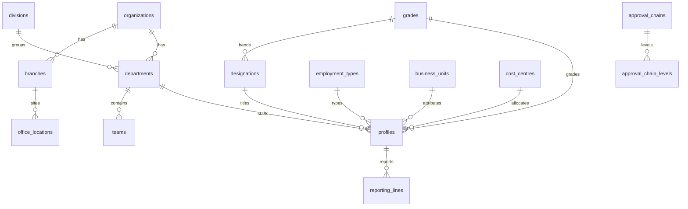
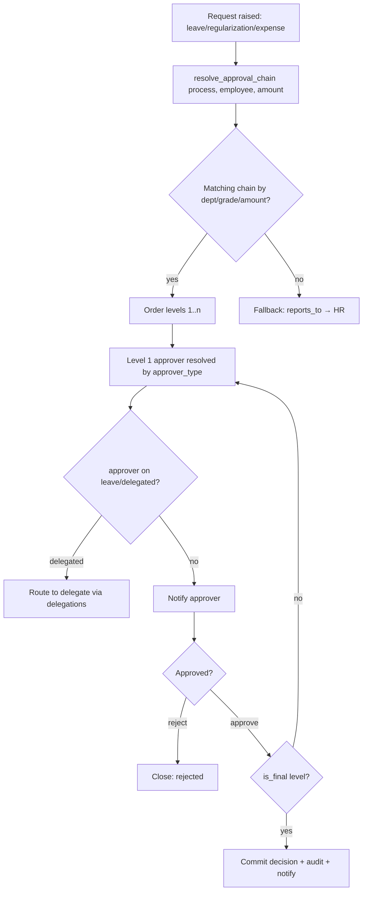
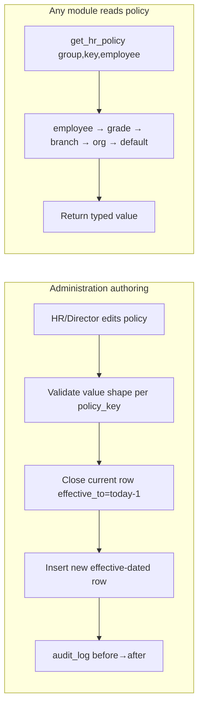
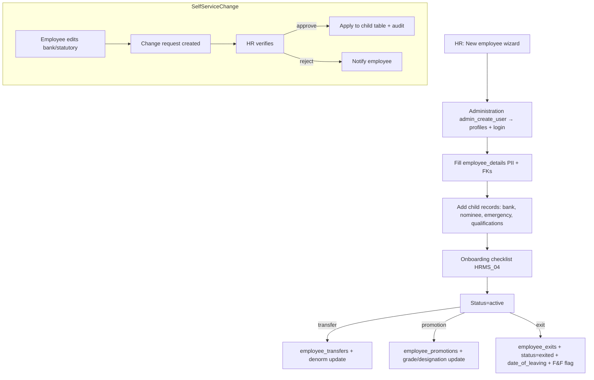

# HRMS_01 — Foundation: Company/Org Setup · Configurable HR Settings · Employee Master

> **STATUS: DESIGN ONLY — NOT IMPLEMENTED.** No code, SQL, migrations, React, or API code is
> produced here. This is the FRS / TDS / DB-spec / UI / Workflow / Permission / API specification
> for HRMS Wave 3, document 01 of 04. Implementation begins only after explicit user approval.
> Production is frozen (`v2.0-wave2-complete`); all work targets staging only.

**Module key:** `hrms` · **Doc scope:** organizational master data, configurable HR policy, employee master
**Companion docs:** `HRMS_02_TIME_ATTENDANCE_LEAVE.md`, `HRMS_03_PAYROLL_STATUTORY.md`, `HRMS_04_TALENT_LIFECYCLE_EXPERIENCE.md`
**Timezone:** `Asia/Kolkata` (IST) · **Currency:** INR (`formatRupees`)
**Permission helper (authoritative):** `has_perm(key)` / `has_perm(key, scope)` — never `has_permission(...)`.

---

## 0. Binding constraints for this document (recap of ERP Constitution)

| # | Rule | How this doc honors it |
|---|---|---|
| 1 | **Reuse before create; extend before replace** | Extends `profiles`, `employee_details`, `organizations`, `office_locations`, `attendance_settings`. New tables only for genuinely new concepts (branches, departments, designations, grades, employee child-records). |
| 2 | **No duplicate data** | `profiles` stays the auth identity + operational fields; `employee_details` stays the PII/HR record. New master tables hold reference data only; the employee row never re-stores what `profiles` already carries (name, email, role, department string → FK). |
| 3 | **Additive / expand-contract only** | Every change to an existing table = new **nullable** column or new child table. No column drops, renames, or type changes. String columns (`profiles.department`, `profiles.designation`) are *shadowed* by nullable FK columns; the string stays authoritative until backfill + cutover (contract later). |
| 4 | **Everything configurable via Administration — nothing hardcoded** | All policy (timings, weekly-off, grace, half-day, OT, WFH, comp-off, shifts, holidays, leave, payroll) is stored as Administration-governed settings (§2). Office 09:00–18:00, Sat+Sun weekly off, etc. are **seed defaults**, editable in the UI, never literals in code. |
| 5 | **Reuse cross-cutting services** | Administration (settings/flags/roles/permissions), Document Management (`documents`), Audit Log (`audit_log`), Notifications (`core/notifications`), Numbering (`org_number_series`). |

**Multi-entity note.** TPS Xperts Group is the single organization today; the Certification Body is a **separate legal entity, out of scope**. All master data below carries a nullable `org_id` (→ `organizations`) so future branches/entities are a *data insert*, not a schema change. `organizations` is the single legal-entity master (per Administration §4).

---

# AREA 1 — Company & Organization Setup

Configurable master data that models the shape of the company: the legal entity, its branches, and the
department/division/team/cost-centre/location/designation/grade hierarchies that every downstream HR
process (attendance, leave, payroll, approvals, reporting) references.

## 1.1 Functional Requirements (FRS)

| ID | Requirement | Priority |
|---|---|---|
| F1.1 | Maintain **Company** (legal entity) records — reuse `organizations`; do not recreate. HR views/edits legal name, trade name, GSTIN, PAN, TAN, PF/ESI establishment codes, LIN, registered + communication addresses, logo, authorized signatories. | Must |
| F1.2 | Maintain **Branches / Sub-units** under a company (e.g. Mohali HO, future field offices) with address, GSTIN-per-state, and a link to one or more office/work locations. | Must |
| F1.3 | Maintain **Departments** (e.g. Regulatory, Certification-Ops, Accounts, Admin, Sales) with a department head (HOD). | Must |
| F1.4 | Maintain **Divisions** (grouping above/around departments, e.g. "Consulting", "Corporate Services") — optional layer. | Should |
| F1.5 | Maintain **Teams** (sub-department working groups) with a team lead. | Should |
| F1.6 | Maintain **Business Units** (P&L / practice-line grouping, e.g. "Nutraceutical Regulatory", "ISO Certification Support") for reporting and cost attribution. | Should |
| F1.7 | Maintain **Cost Centres** for payroll/expense cost allocation; link to Finance's cost dimension. | Should |
| F1.8 | Maintain **Office Locations** (physical, geofenced) — reuse `office_locations`; extend with address/type/branch link. | Must |
| F1.9 | Maintain **Work Locations** as an assignable attribute of an employee: `on_site`, `wfh`, `hybrid`, `field`, `client_site`. | Must |
| F1.10 | Maintain **Designations** (job titles, e.g. "Regulatory Executive", "Lead Auditor") independent of the person. | Must |
| F1.11 | Maintain **Grades / Bands** (e.g. G1–G6 / L1–L5) that drive leave entitlement, approval limits, salary bands. | Must |
| F1.12 | Maintain **Employment Types** (`full_time`, `part_time`, `contract`, `probation`, `intern`, `consultant`, `retainer`). Configurable list, not an enum literal. | Must |
| F1.13 | Model the **Reporting Hierarchy** (who reports to whom) — primary manager + optional dotted-line, effective-dated. | Must |
| F1.14 | Model the **Approval Hierarchy** (who approves what: leave, regularization, expense, payroll) as configurable multi-level chains resolvable by department/grade/amount, with delegation support. | Must |
| F1.15 | All the above are **effective-dated** where they change over time (reporting, hierarchy) and **soft-deactivatable** (`is_active`), never hard-deleted while referenced. | Must |
| F1.16 | Every create/update/deactivate is **audited** (`audit_log`) and **permission-guarded** (`hrms.config.manage`). | Must |

## 1.2 Technical Design (TDS)

- **Layering.** Organization master data is *configuration*, edited under **Administration → Organization** (co-located with `organizations`/entity settings) and consumed read-only by HRMS/CRM/Finance/Reports. HRMS **owns the HR-facing screens**; the tables are platform-shared reference data.
- **Reuse map.**
  - `organizations` → **Company** (legal entity). No new company table.
  - `office_locations` → **Office Location** (extend additively).
  - `profiles.department` / `profiles.designation` (text) → shadowed by nullable FK columns `profiles.department_id`, `profiles.designation_id`, `profiles.grade_id`, `profiles.branch_id`, `profiles.employment_type_id`, `profiles.work_location`, `profiles.reports_to` (all additive, nullable). Text columns remain authoritative during expand; FKs backfilled; contract only after all readers move to FK.
- **Hierarchy representation.** Adjacency-list (`parent_id` self-FK) for department/division/team and reporting (`reports_to`). Approval chains are **rule rows** (ordered levels) rather than hardcoded graphs, resolved at request time by an RPC (`resolve_approval_chain`). Reporting graph is queried with recursive CTE for org-chart rendering.
- **Effective-dating.** Reporting relationships and approval-chain assignments carry `effective_from` / `effective_to` (null = current); a partial unique index enforces one current row per employee.
- **Scoping.** Every master table carries nullable `org_id` (→ `organizations`) and, where relevant, `branch_id`. Single-org today; multi-branch tomorrow with no schema change.
- **Referential safety.** Deactivation (not deletion) when a master row is referenced; RPC guards block deactivating a department that still has active employees (returns a validation error listing dependents).

## 1.3 Database Design (specification — not executed SQL)

> All new tables: **RLS on**, `has_perm()`-based policies, standard audit columns (`created_at`, `updated_at`, `created_by`, `updated_by`), `is_active boolean default true`, nullable `org_id uuid → organizations`. Convention: singular-domain, plural-table names, `uuid` PKs (`default gen_random_uuid()`).

### 1.3.1 Extend existing tables (additive, nullable)

**`organizations`** (extend — Company master; owned by Administration, surfaced in HRMS read-mostly)

| New column | Type | Notes |
|---|---|---|
| `tan` | text | Tax deduction account no. (TDS) |
| `pf_establishment_code` | text | EPFO establishment ID |
| `esi_establishment_code` | text | ESIC establishment ID |
| `lin` | text | Labour Identification Number |
| `communication_address` | text | If different from registered `address` |
| `hr_contact_email` | text | Default HR sender/reply-to |

**`office_locations`** (extend — physical geofenced site)

| New column | Type | Notes |
|---|---|---|
| `branch_id` | uuid → `branches.id` | Which branch this site belongs to |
| `location_type` | text | `head_office` / `branch` / `client_site` / `warehouse` (config list) |
| `address` | text | Postal address (geo already exists) |
| `org_id` | uuid → `organizations.id` | Entity scope |

**`profiles`** (extend — operational FK shadows; additive nullable only)

| New column | Type | Notes |
|---|---|---|
| `department_id` | uuid → `departments.id` | Shadows `profiles.department` (text) |
| `designation_id` | uuid → `designations.id` | Shadows `profiles.designation` (text) |
| `grade_id` | uuid → `grades.id` | Drives entitlements/bands |
| `branch_id` | uuid → `branches.id` | Posting location |
| `team_id` | uuid → `teams.id` | Working group |
| `business_unit_id` | uuid → `business_units.id` | P&L attribution |
| `cost_centre_id` | uuid → `cost_centres.id` | Cost allocation |
| `employment_type_id` | uuid → `employment_types.id` | FT/contract/etc. |
| `work_location` | text | `on_site`/`wfh`/`hybrid`/`field`/`client_site` (config list) |
| `reports_to` | uuid → `profiles.id` | Primary manager (self-FK) |
| `org_id` | uuid → `organizations.id` | Already added by Administration; reused here |

> `profiles.hod_email` / `profiles.department` (text) are **retained** for backward-compat; `reports_to` + `department_id` supersede them post-cutover.

### 1.3.2 New master tables

| Table | Key columns | FKs | Indexes | Constraints |
|---|---|---|---|---|
| `branches` | `id` PK, `code` text, `name` text, `gstin` text, `is_active` | `org_id`→organizations | uniq(`org_id`,`code`); idx(`org_id`) | code required per org |
| `departments` | `id` PK, `code`, `name`, `hod_id`, `parent_id` (self, sub-dept), `is_active` | `org_id`, `hod_id`→profiles, `division_id`→divisions | uniq(`org_id`,`code`); idx(`division_id`) | no self-parent cycle (app-checked) |
| `divisions` | `id` PK, `code`, `name`, `head_id`, `is_active` | `org_id`, `head_id`→profiles | uniq(`org_id`,`code`) | — |
| `teams` | `id` PK, `code`, `name`, `lead_id`, `department_id`, `is_active` | `org_id`, `department_id`→departments, `lead_id`→profiles | idx(`department_id`) | — |
| `business_units` | `id` PK, `code`, `name`, `head_id`, `is_active` | `org_id`, `head_id`→profiles | uniq(`org_id`,`code`) | — |
| `cost_centres` | `id` PK, `code`, `name`, `finance_dimension_ref` text, `is_active` | `org_id` | uniq(`org_id`,`code`) | maps to Finance cost dim |
| `designations` | `id` PK, `code`, `title`, `grade_id` (default band), `is_active` | `org_id`, `grade_id`→grades | uniq(`org_id`,`code`) | — |
| `grades` | `id` PK, `code`, `name`, `rank` int, `min_ctc` numeric, `max_ctc` numeric, `is_active` | `org_id` | uniq(`org_id`,`code`); idx(`rank`) | rank orders bands |
| `employment_types` | `id` PK, `code`, `name`, `is_payroll_eligible` bool, `is_active` | `org_id` | uniq(`org_id`,`code`) | seeded list, extensible |
| `reporting_lines` | `id` PK, `employee_id`, `manager_id`, `line_type` (`primary`/`dotted`), `effective_from`, `effective_to` (null=current) | both→profiles | partial-uniq(`employee_id`,`line_type`) where `effective_to is null`; idx(`manager_id`) | employee ≠ manager; no cycle (RPC-checked) |
| `approval_chains` | `id` PK, `code`, `name`, `process` (`leave`/`regularization`/`expense`/`payroll`/`onboarding`), `scope_department_id` (nullable), `scope_grade_id` (nullable), `is_active` | `org_id`, scope FKs | idx(`process`,`org_id`) | one default chain per (process, scope) |
| `approval_chain_levels` | `id` PK, `chain_id`, `level_no` int, `approver_type` (`reports_to`/`role`/`specific_user`/`department_head`/`grade_holder`), `approver_ref` (uuid/role_key nullable), `min_amount` numeric (nullable), `max_amount` numeric (nullable), `is_final` bool | `chain_id`→approval_chains, `approver_ref`→profiles (when specific) | uniq(`chain_id`,`level_no`) | levels ordered; amount bands for expense/payroll |

**Audit approach.** All 12 tables get a shared `AFTER INSERT/UPDATE/DELETE` audit trigger writing `audit_log` (actor, action, table, record_id, before→after). No hard deletes — deactivation flips `is_active`; a `BEFORE DELETE` guard raises unless super_admin performs an explicit purge (rare, audited).

**Relationships (ER summary).**

## 1.4 UI Design

**Menu placement:** `Administration → Organization` (config authorship) with read-mirrors surfaced inside `HRMS → Setup`. Guarded by `hrms.config.manage` (write) / `hrms.config.view` (read).

| Route | Screen | Who | Purpose |
|---|---|---|---|
| `/admin/org/company` | Company profile | super_admin, director, hr | Edit legal/tax/PF-ESI/signatories (over `organizations`) |
| `/admin/org/branches` | Branches | super_admin, director, hr | List/add branches + linked office locations |
| `/admin/org/structure` | Org structure | super_admin, director, hr | Tree editor: divisions → departments → teams |
| `/admin/org/designations` | Designations & grades | super_admin, director, hr | Manage titles + bands |
| `/admin/org/employment-types` | Employment types | super_admin, hr | Configurable list |
| `/admin/org/cost-centres` | Cost centres / business units | super_admin, director, accounts | For cost attribution |
| `/admin/org/approval-chains` | Approval hierarchy | super_admin, director | Define per-process multi-level chains |
| `/hrms/setup` | HR setup hub | hr, director | Read mirror + quick links, org chart |
| `/hrms/org-chart` | Org chart | all (read) | Recursive reporting-line visualization |

**Forms & interactions.**
- Tree editor with drag-to-reparent (writes `parent_id`), inline HOD/lead picker (searches `profiles`).
- Designation form auto-suggests default grade; grade form enforces `min_ctc ≤ max_ctc`.
- Approval-chain builder: ordered level rows, each choosing `approver_type` and (if `specific_user`/`role`) a picker; amount-band inputs appear only for `expense`/`payroll` processes.
- Deactivation modal shows dependent counts ("3 active employees, 2 teams") and blocks if non-zero.

## 1.5 Workflow — Approval Hierarchy resolution

- `approver_type` resolution: `reports_to` → `reporting_lines` current primary manager; `department_head` → `departments.hod_id`; `role` → any active holder of `role_key` (with delegation fallback); `grade_holder`/`specific_user` → explicit.
- Amount bands (expense/payroll) select which levels apply (e.g. ≤₹10k stops at manager; >₹10k adds director).
- Delegation honored via Administration `delegations` inside `has_perm` — approvals never stall when a HOD travels.

## 1.6 Permission Matrix (Area 1)

| Permission key | super_admin | director | hr | manager | accounts | executive | auditor |
|---|:--:|:--:|:--:|:--:|:--:|:--:|:--:|
| `hrms.config.view` | ✓ | ✓ | ✓ | team | ✓ | — | read |
| `hrms.config.manage` | ✓ | ✓ | ✓ | — | — | — | — |
| `hrms.org.company.manage` | ✓ | ✓ | ▲ | — | — | — | — |
| `hrms.org.structure.manage` | ✓ | ✓ | ✓ | — | — | — | — |
| `hrms.org.costcentre.manage` | ✓ | ✓ | — | ✓ | — | — | — |
| `hrms.org.approvalchain.manage` | ✓ | ✓ | — | — | — | — | — |

✓ = default grant · ▲ = grantable via per-user override, off by default · "team"/"read" = scoped grant. Keys map to `has_perm()` predicates in the RLS table below.

**RLS intent (Area 1 tables).**

| Table(s) | SELECT | INSERT/UPDATE (soft) / deactivate |
|---|---|---|
| `branches`, `divisions`, `departments`, `teams`, `business_units`, `designations`, `grades`, `employment_types` | any authenticated (dropdowns) | `has_perm('hrms.org.structure.manage')` |
| `cost_centres` | authenticated | `has_perm('hrms.org.costcentre.manage')` |
| `approval_chains`, `approval_chain_levels` | `has_perm('hrms.config.view')` | `has_perm('hrms.org.approvalchain.manage')` |
| `reporting_lines` | self + manager-chain + `hrms.employee.read` | `has_perm('hrms.employee.manage')` (via RPC) |
| `organizations` (extended cols) | `admin.entity.view` | `admin.entity.edit` OR `hrms.org.company.manage` |
| `office_locations` (extended) | authenticated | existing attendance-admin policy + `hrms.org.structure.manage` |

## 1.7 API Design (described, not coded)

**Data-access (`modules/hrms/api/org/`)** — thin typed Supabase wrappers, React Query keys `['hrms','org',entity,...]`.

| Function | Inputs | Output | Authz |
|---|---|---|---|
| `listDepartments(orgId?)` | org | `Department[]` (tree) | `hrms.config.view` |
| `listDesignations()` / `listGrades()` / `listEmploymentTypes()` | — | reference arrays | authenticated |
| `listBranches()` / `listOfficeLocations()` | — | arrays | authenticated |
| `getOrgChart(rootId?)` | root | recursive reporting tree | `hrms.employee.read` |
| `listApprovalChains(process)` | process | `ApprovalChain[]` + levels | `hrms.config.view` |

**RPCs / Edge Functions (SECURITY DEFINER where they cross rows / enforce invariants).**

| Name | Kind | Inputs | Output | Authz (in body) |
|---|---|---|---|---|
| `upsert_department` / `upsert_designation` / `upsert_grade` / `upsert_team` … | RPC | patch | row | `has_perm('hrms.org.structure.manage')` |
| `deactivate_master(entity, id)` | RPC | entity, id | void / dependents error | structure/costcentre perm; blocks if referenced |
| `set_reporting_line` | RPC | employee_id, manager_id, line_type | row | `hrms.employee.manage`; cycle + self checks; closes prior current |
| `resolve_approval_chain` | RPC (stable) | process, employee_id, amount? | ordered approver list | authenticated (used by request flows) |
| `upsert_approval_chain` | RPC | chain + levels jsonb | chain | `hrms.org.approvalchain.manage` |
| `get_org_tree` | RPC (stable) | root? | jsonb tree | `hrms.employee.read` |

All mutating RPCs write `audit_log`; validation errors surface via `toast()`.

---

# AREA 2 — HR Settings (all configurable via Administration)

**Principle:** *nothing hardcoded.* Every policy value below is stored as an Administration-governed setting
and read at runtime. Office **09:00–18:00**, weekly off **Sat+Sun**, grace **10 min**, etc. are **seed
defaults** shipped once, then editable — never literals in code.

## 2.1 Functional Requirements (FRS)

| ID | Policy area | Configurable items |
|---|---|---|
| F2.1 | **Office timing** | Start/end time (default 09:00–18:00), core hours, break duration, per-branch/shift override |
| F2.2 | **Working days** | Which weekdays are working; nth-weekday patterns (e.g. 2nd Saturday off) |
| F2.3 | **Weekly off** | Default Sat+Sun; per-branch/grade/employee override; alternating-Saturday rule |
| F2.4 | **Late-coming** | Grace minutes, late threshold, penalty policy (warn / half-day after N lates / LOP) |
| F2.5 | **Early-leaving** | Grace minutes, min hours for full day, penalty policy |
| F2.6 | **Grace time** | Separate grace for in and out; monthly free-late count |
| F2.7 | **Half-day** | Min hours qualifying full vs half day; half-day cut-off time |
| F2.8 | **Overtime (OT)** | Eligible grades/types, min OT minutes, OT rate multiplier, cap, approval required flag |
| F2.9 | **Work-from-home (WFH)** | Allowed grades/types, max days/month, approval chain, geofence bypass flag |
| F2.10 | **Outdoor / on-duty (OD)** | Field-staff bypass, OD request + approval, treated-as-present rule |
| F2.11 | **Comp-off** | Earn rule (work on WO/holiday), validity window, encashable flag, approval |
| F2.12 | **Shift rules** | Shift definitions (name, in/out, break, night-shift flag), rotation, weekly-off per shift |
| F2.13 | **Attendance rules** | Rounding, min hours/day, auto-absent cut-off, regularization window (days back), monthly cap |
| F2.14 | **Holiday calendar** | Per-year, per-branch holiday list; mandatory vs optional/restricted holidays |
| F2.15 | **Leave rules** | Leave types, annual quota, accrual, carry-forward cap, encashment, negative-balance, notice, sandwich rule (detail table in HRMS_02) |
| F2.16 | **Payroll rules** | Pay cycle, cut-off day, LOP basis, rounding, statutory rates (PF/ESI/PT/TDS), arrears (detail in HRMS_03) |
| F2.17 | **Scoping & precedence** | Every setting resolvable at org → branch → grade → employee, most-specific wins; effective-dated |
| F2.18 | **Governance** | All edits audited; change requires `hrms.config.manage`; staging values isolated from prod |

## 2.2 Technical Design — how settings are stored (Administration mechanism)

**Reuse + extend the Administration settings substrate — three tiers:**

1. **Global toggles → `feature_flags`** (existing typed registry). New HRMS flags (additive inserts, no enum churn): `hrms_overtime_enabled`, `hrms_wfh_enabled`, `hrms_compoff_enabled`, `hrms_shifts_enabled`, `hrms_regularization_enabled`, `hrms_face_match_attendance` (mirrors existing gate). Each has prod value + `stage_value` so staging stays sandboxed.

2. **Simple singletons → `app_settings`** (existing KV). Coarse org-wide defaults keyed `hrms.<area>.<key>` (e.g. `hrms.timing.office_start = "09:00"`). Retained for backward-compat and simple values; `attendance_settings` singleton continues to hold `expected_start_time`/`standard_hours` (extended additively — see below).

3. **Scoped, typed, effective-dated policy → new `hr_policy_settings` (recommended primary mechanism).** Because HR policy must resolve at **org → branch → grade → employee** and change over time, a KV singleton is insufficient. `hr_policy_settings` is an Administration-owned, typed, scoped, versioned policy store. It is the canonical mechanism; `app_settings`/`feature_flags` remain for global toggles/coarse defaults.

**`attendance_settings`** (extend the existing singleton, additive nullable) — coarse defaults that a scoped policy can override:

| New column | Type | Default | Notes |
|---|---|---|---|
| `office_start_time` | time | `09:00` | Renamed concept alongside existing `expected_start_time` (kept) |
| `office_end_time` | time | `18:00` | — |
| `working_days` | int[] | `{1,2,3,4,5,6}` | ISO weekday numbers |
| `weekly_offs` | int[] | `{7}` (+config Sat) | Default Sun; Sat configurable |
| `grace_in_minutes` | int | `10` | — |
| `grace_out_minutes` | int | `10` | — |
| `half_day_min_hours` | numeric | `4` | — |
| `full_day_min_hours` | numeric | `8` | — |
| `regularization_window_days` | int | `7` | Days back allowed |
| `ot_enabled` | bool | `false` | Master OT gate (mirrors flag) |

> These are **coarse org defaults**. Any per-branch/grade/employee variation lives in `hr_policy_settings`, which **overrides** the singleton at resolution time.

## 2.3 Database Design — `hr_policy_settings`

**`hr_policy_settings`** (new — the scoped, typed HR policy store)

| Column | Type | Notes |
|---|---|---|
| `id` | uuid PK | |
| `org_id` | uuid → organizations | Entity scope |
| `policy_group` | text | `timing`/`working_days`/`weekly_off`/`late`/`early`/`grace`/`half_day`/`overtime`/`wfh`/`outdoor`/`comp_off`/`shift`/`attendance`/`leave`/`payroll` |
| `policy_key` | text | e.g. `office_start`, `grace_in_min`, `ot_multiplier` |
| `value` | jsonb | Typed payload (`{"time":"09:00"}`, `{"days":[1,2,3,4,5]}`, `{"number":1.5}`) |
| `scope_level` | text | `org` / `branch` / `grade` / `employee` |
| `scope_ref` | uuid | FK target implied by `scope_level` (null for org) |
| `effective_from` | date | Default today |
| `effective_to` | date | null = current |
| `is_active` | bool | |
| audit cols | | `created_by`/`updated_by`/timestamps |

**Indexes:** idx(`org_id`,`policy_group`,`policy_key`,`scope_level`); partial-uniq(`org_id`,`policy_group`,`policy_key`,`scope_level`,`scope_ref`) where `effective_to is null`.
**Constraints:** `scope_ref` required unless `scope_level='org'`; `value` shape validated per `policy_key` in the write RPC.

**Resolution rule (most-specific-wins).** `get_hr_policy(group, key, employee_id)` resolves in precedence order **employee → grade → branch → org → `attendance_settings`/`app_settings` default → seeded fallback**, honoring effective dates. This single resolver is the *only* runtime read path; no module hardcodes a policy value.

**Shift definitions → `shifts`** (new; referenced by attendance in HRMS_02):

| Column | Type | Notes |
|---|---|---|
| `id` PK, `org_id`, `code`, `name` | — | |
| `start_time`, `end_time`, `break_minutes` | time/int | |
| `is_night_shift`, `weekly_offs` int[], `grace_in_minutes`, `grace_out_minutes` | — | Per-shift override |
| `is_active` | bool | |

**Holiday calendar → `holidays`** (already specified in `hrms.md` §4; extended here with `branch_id` for per-branch calendars and `holiday_type` `mandatory`/`optional`/`restricted`). Leave-type and payroll-rule tables are detailed in HRMS_02 / HRMS_03; this doc only establishes that they too resolve through `hr_policy_settings` + their own config tables.

**Audit approach.** `hr_policy_settings`, `shifts`, extended `attendance_settings` all carry the shared audit trigger. Because policy changes are financially/legally material, every write records before→after in `audit_log`, and effective-dating preserves history (old rows are closed with `effective_to`, never overwritten).

## 2.4 UI Design

**Menu:** `Administration → HR Settings` (authoring), mirrored under `HRMS → Setup → Policies`.

| Route | Screen | Purpose |
|---|---|---|
| `/admin/hr-settings` | HR settings hub | Cards per policy group; shows resolved default + override count |
| `/admin/hr-settings/timing` | Office timing & working days | Start/end, working days, weekly-off pattern, grace |
| `/admin/hr-settings/attendance-rules` | Late/early/half-day/OT/regularization | Thresholds + penalties |
| `/admin/hr-settings/shifts` | Shifts | Define/rotate shifts |
| `/admin/hr-settings/wfh-od-compoff` | WFH / OD / Comp-off | Eligibility, caps, approval toggles |
| `/admin/hr-settings/holidays` | Holiday calendar | Per-year, per-branch calendar editor |
| `/admin/hr-settings/leave` | Leave rules | Types, quotas, carry-forward (→ HRMS_02) |
| `/admin/hr-settings/payroll` | Payroll rules | Cycle, statutory rates (→ HRMS_03) |
| `/admin/flags` | Feature flags | HRMS toggles (existing Administration screen) |

**Interactions.**
- Each setting row shows: **effective value**, **source scope** (org/branch/grade/employee chip), and an **"Add override"** action opening a scope picker.
- Weekly-off editor: weekday checkboxes + "alternate Saturday" rule builder.
- Every save shows a diff ("09:30 → 09:00") and writes a new effective-dated row; a **staging banner** indicates when `stage_value` differs from prod.

## 2.5 Workflow — setting change & resolution

No approval workflow on settings themselves (governance is permission + audit), but changes to statutory
rates (payroll) may be routed through a two-person confirm in a later phase (noted, not built here).

## 2.6 Permission Matrix (Area 2)

| Permission key | super_admin | director | hr | manager | accounts | executive | auditor |
|---|:--:|:--:|:--:|:--:|:--:|:--:|:--:|
| `hrms.config.view` | ✓ | ✓ | ✓ | team | ✓ | — | read |
| `hrms.config.manage` | ✓ | ✓ | ✓ | — | — | — | — |
| `hrms.config.payroll.manage` (statutory rates) | ✓ | ✓ | ▲ | — | — | — | — |
| `hrms.config.flags.manage` | ✓ | ✓ | — | — | — | — | — |

**RLS intent.**

| Table | SELECT | INSERT/UPDATE |
|---|---|---|
| `hr_policy_settings` | `has_perm('hrms.config.view')` (+ self reads own-scoped) | `has_perm('hrms.config.manage')`; payroll group requires `hrms.config.payroll.manage` |
| `shifts` | authenticated | `has_perm('hrms.config.manage')` |
| `attendance_settings` (extended) | authenticated | existing attendance-admin + `hrms.config.manage` |
| `feature_flags` (HRMS keys) | authenticated | `has_perm('hrms.config.flags.manage')` / `admin.flag.manage` |

## 2.7 API Design

| Name | Kind | Inputs | Output | Authz |
|---|---|---|---|---|
| `getHrPolicy(group,key,employeeId?)` | RPC (stable) | group,key,employee | resolved typed value | authenticated |
| `getResolvedPolicies(employeeId)` | RPC (stable) | employee | full effective policy set | self / `hrms.config.view` |
| `setHrPolicy` | RPC (definer) | org/scope, group, key, value, effective_from | row | `hrms.config.manage` (payroll → payroll perm); validates shape; closes prior current |
| `listPolicyOverrides(group)` | api | group | rows by scope | `hrms.config.view` |
| `upsertShift` | RPC | shift patch | row | `hrms.config.manage` |
| `setFeatureFlag` (reuse Administration `admin_set_feature_flag`) | RPC | key, value, prod/stage | void | `admin.flag.manage` |

---

# AREA 3 — Employee Master (complete profile)

The complete employee record, built as an **extension of `employee_details`** (PII/HR record) and
`profiles` (auth identity + operational fields) — **no duplication**. Repeating groups (qualifications,
experience, family, nominees, etc.) become **child tables**. Free-standing single-value HR fields become
**additive nullable columns on `employee_details`**.

## 3.1 Functional Requirements (FRS)

| ID | Requirement |
|---|---|
| F3.1 | Capture full **Personal Info** — name (from `profiles`), father/mother/spouse, DOB, gender, blood group, marital status, nationality, religion (optional), personal email/phone, addresses. |
| F3.2 | Capture **Employment Info** — employee code (from `profiles`), DOJ, confirmation date, probation end, employment type, department/designation/grade/branch/team/BU (FKs), work location, reporting manager, employee status. |
| F3.3 | Capture **Reporting Info** — primary + dotted-line managers (via `reporting_lines`), HOD, approval-chain membership. |
| F3.4 | Reference **Salary Info** — link to current `salary_structures` (detail owned by HRMS_03); master shows CTC band + grade only. |
| F3.5 | Capture **Bank Details** (one primary + history) — account no, IFSC, bank, branch, account type, name-as-per-bank. |
| F3.6 | Capture **Government IDs** — Aadhaar (exists), PAN (exists), passport, driving licence, voter ID. |
| F3.7 | Capture **Statutory** — PF number, UAN, ESI IP number, PRAN (NPS), PT state. |
| F3.8 | Capture **Nominees** (PF/gratuity/insurance) — name, relation, share %, DOB. |
| F3.9 | Capture **Emergency Contacts** (≥1) — name, relation, phone, address. |
| F3.10 | Capture **Qualifications** — degree, institution, year, grade, specialization. |
| F3.11 | Capture **Experience** (prior employment) — employer, designation, from/to, last CTC, reason for leaving. |
| F3.12 | Capture **Skills** — skill, proficiency, years; optional link to LMS competencies. |
| F3.13 | Capture **Certificates** — name, issuer, number, issue/expiry, verification (e.g. FoSTaC, Lead Auditor) with expiry alerts. |
| F3.14 | Capture **Medical Info** — blood group, allergies, chronic conditions, insurance policy no, disability status (sensitive; strict access). |
| F3.15 | Capture **Family Details** — dependents (name, relation, DOB, dependent flag, insurance-covered). |
| F3.16 | Store **Employee Photo** and **Digital Signature** (files). |
| F3.17 | Attach **Documents** — reuse **Document Management** (`documents`); employee docs are tagged, not a parallel store. |
| F3.18 | Maintain **Status** — `active`/`probation`/`notice`/`on_leave`/`suspended`/`resigned`/`exited` with transitions. |
| F3.19 | Maintain **Transfer History** — department/branch/location changes, effective-dated. |
| F3.20 | Maintain **Promotion History** — designation/grade changes, effective-dated. |
| F3.21 | Maintain **Salary Revision History** — CTC revisions (references `salary_structures` effective rows; HRMS_03). |
| F3.22 | Maintain **Exit History** — resignation, LWD, exit type, F&F flag, clearance, rehire-eligibility. |
| F3.23 | Enforce **field-level access** — PII/medical/salary visible only to self + HR/director per RLS; audited reads for sensitive classes. |
| F3.24 | Support **self-service** partial edit (contact, emergency, bank-request) with HR verification for sensitive changes. |

## 3.2 Technical Design (TDS)

- **No duplication of `profiles`.** Name, email, role, employee_code, department/designation FKs, is_field_staff, is_active live on `profiles`. `employee_details` (PK = `user_id` → `profiles.id`, 1:1) holds PII + single-value HR fields. Repeating groups → child tables keyed by `employee_id → profiles.id`.
- **Extend `employee_details` additively** for single-value fields not yet present (gender, blood group, marital status, confirmation/probation dates, statutory numbers, digital-signature path, medical fields). Existing columns (`aadhar_no`, `pan_no`, `date_of_joining`, addresses, emergency_contact text) are **kept**; richer emergency contacts move to a child table while the legacy text field remains for back-compat.
- **Documents reuse.** Employee documents are rows in the platform `documents` table with `entity_type='employee'`, `entity_id=user_id`, plus a `doc_category` tag (aadhaar/pan/offer/degree/certificate/medical). No new employee-document store; the `employee_documents` concept in `hrms.md` §4 is reconciled to a **view/tag over `documents`** (expand-contract: if `employee_documents` already shipped, it is retained and back-filled as a thin index into `documents`).
- **History tables are append-only** (transfer/promotion/status/exit); the *current* value is denormalized onto `profiles`/`employee_details` for fast reads, with history preserving the trail.
- **Sensitivity tiers.** Tier-1 (operational, staff-visible) on `profiles`. Tier-2 (PII) on `employee_details`. Tier-3 (medical, salary) in strictly-scoped child tables with read-audit. RLS predicates differ per tier.
- **Photo/signature** stored in Supabase Storage (`hr-docs` bucket) with only the path on the row; face-reference images remain in the existing `face-refs` bucket (unchanged).

## 3.3 Database Design (specification)

### 3.3.1 Extend `employee_details` (additive nullable columns)

| New column | Type | Tier | Notes |
|---|---|---|---|
| `gender` | text | 2 | config list |
| `blood_group` | text | 2 | |
| `marital_status` | text | 2 | |
| `spouse_name` | text | 2 | |
| `nationality` | text | 2 | default 'Indian' |
| `confirmation_date` | date | 2 | |
| `probation_end_date` | date | 2 | |
| `notice_period_days` | int | 2 | from grade default |
| `passport_no` | text | 2 | |
| `driving_licence_no` | text | 2 | |
| `voter_id_no` | text | 2 | |
| `pf_number` | text | 2 | |
| `uan` | text | 2 | EPFO UAN |
| `esi_ip_no` | text | 2 | |
| `pran` | text | 2 | NPS |
| `pt_state` | text | 2 | professional-tax state |
| `photo_path` | text | 2 | Storage `hr-docs` |
| `signature_path` | text | 2 | Storage `hr-docs` |
| `current_status` | text | 1→2 | `active`/`probation`/`notice`/`suspended`/`resigned`/`exited` (denormalized current) |
| `rehire_eligible` | bool | 2 | set on exit |

> `date_of_leaving`, `employment_type`, `bank_*` referenced in `hrms.md` §4 are reconciled here: `date_of_leaving` and `employment_type_id` are additive; **bank details move to a child table** (`employee_bank_accounts`) to support history + multiple accounts, while any already-shipped `bank_*` columns on `employee_details` are retained (back-compat) and treated as the "primary" mirror.

### 3.3.2 New child tables (repeating groups) — all keyed `employee_id uuid → profiles.id`

| Table | Key columns | Indexes | Constraints / notes |
|---|---|---|---|
| `employee_bank_accounts` | `id`, `employee_id`, `account_no`, `ifsc`, `bank_name`, `branch_name`, `account_type`, `name_as_per_bank`, `is_primary`, `verified`, `effective_from`, `effective_to` | idx(`employee_id`); partial-uniq(`employee_id`) where `is_primary and effective_to is null` | one active primary; salary credit uses primary |
| `employee_nominees` | `id`, `employee_id`, `purpose` (`pf`/`gratuity`/`insurance`), `name`, `relation`, `share_percent`, `dob`, `address` | idx(`employee_id`,`purpose`) | shares per purpose sum ≤ 100 (app-checked) |
| `employee_emergency_contacts` | `id`, `employee_id`, `name`, `relation`, `phone`, `alt_phone`, `address`, `is_primary` | idx(`employee_id`) | ≥1 required at activation |
| `employee_qualifications` | `id`, `employee_id`, `degree`, `specialization`, `institution`, `year_of_passing`, `grade_or_percent`, `document_id` | idx(`employee_id`) | `document_id`→`documents` |
| `employee_experiences` | `id`, `employee_id`, `employer`, `designation`, `from_date`, `to_date`, `last_ctc`, `reason_for_leaving`, `document_id` | idx(`employee_id`) | to_date ≥ from_date |
| `employee_skills` | `id`, `employee_id`, `skill`, `proficiency` (`beginner..expert`), `years`, `lms_competency_ref` | idx(`employee_id`) | optional LMS link |
| `employee_certificates` | `id`, `employee_id`, `name`, `issuer`, `certificate_no`, `issue_date`, `expiry_date`, `verified`, `document_id` | idx(`employee_id`); idx(`expiry_date`) | expiry drives `doc_expiring` alerts |
| `employee_family_members` | `id`, `employee_id`, `name`, `relation`, `dob`, `is_dependent`, `insurance_covered`, `occupation` | idx(`employee_id`) | for insurance/ESI dependents |
| `employee_medical_info` | `id`, `employee_id` (uniq 1:1), `blood_group`, `allergies`, `chronic_conditions`, `disability_status`, `insurance_policy_no`, `insurer`, `notes` | uniq(`employee_id`) | **Tier-3 strict RLS + read-audit** |
| `employee_transfers` | `id`, `employee_id`, `from_department_id`, `to_department_id`, `from_branch_id`, `to_branch_id`, `from_location_id`, `to_location_id`, `effective_date`, `order_ref`, `remarks`, `approved_by` | idx(`employee_id`,`effective_date`) | append-only history |
| `employee_promotions` | `id`, `employee_id`, `from_designation_id`, `to_designation_id`, `from_grade_id`, `to_grade_id`, `effective_date`, `order_ref`, `remarks`, `approved_by` | idx(`employee_id`,`effective_date`) | append-only |
| `employee_status_history` | `id`, `employee_id`, `from_status`, `to_status`, `effective_date`, `reason`, `changed_by` | idx(`employee_id`,`effective_date`) | append-only; drives `current_status` denorm |
| `employee_exits` | `id`, `employee_id` (uniq 1:1 latest), `resignation_date`, `last_working_day`, `exit_type` (`resignation`/`termination`/`retirement`/`end_of_contract`/`absconding`), `notice_served`, `ff_flag`, `clearance_status`, `rehire_eligible`, `exit_interview_ref`, `remarks` | uniq(`employee_id`) | sets `date_of_leaving`, triggers F&F (HRMS_03) |

> **Salary Revision History** is **not** re-modeled here — it is the effective-dated `salary_structures` rows (HRMS_03). The employee master shows it read-only via a reference view.

**Audit approach.** All child + history tables carry the shared audit trigger. **History tables are append-only** (`no_update`/`no_delete` rules like `audit_log`). Sensitive tables (`employee_medical_info`, `employee_bank_accounts`, salary reference) additionally log **SELECT reveals** of the most sensitive fields via a read-audit helper (mirrors `credential_access_log` pattern), so PII egress is traceable.

**ER summary.**

```mermaid
erDiagram
    profiles ||--|| employee_details : "1:1 PII"
    profiles ||--o{ employee_bank_accounts : "banks"
    profiles ||--o{ employee_nominees : "nominees"
    profiles ||--o{ employee_emergency_contacts : "emergency"
    profiles ||--o{ employee_qualifications : "education"
    profiles ||--o{ employee_experiences : "prior work"
    profiles ||--o{ employee_skills : "skills"
    profiles ||--o{ employee_certificates : "certs"
    profiles ||--o{ employee_family_members : "family"
    profiles ||--|| employee_medical_info : "1:1 medical"
    profiles ||--o{ employee_transfers : "transfers"
    profiles ||--o{ employee_promotions : "promotions"
    profiles ||--o{ employee_status_history : "status"
    profiles ||--|| employee_exits : "exit"
    profiles ||--o{ documents : "employee docs (tagged)"
    profiles ||--o{ salary_structures : "salary (HRMS_03)"
```

## 3.4 UI Design

**Menu:** `HRMS → Employees`. Profile is a **tabbed record**; sensitive tabs gated by permission + read-audit.

| Route | Screen / Tab | Who | Purpose |
|---|---|---|---|
| `/hrms/employees` | Employee list | hr, director, manager(team) | Search/filter by dept/grade/status/branch/field |
| `/hrms/employees/new` | New employee wizard | hr | Create (delegates login creation to Administration `admin_create_user`) |
| `/hrms/employees/:id` | Profile — **Overview** | hr, self | Photo, status, key employment facts |
| `/hrms/employees/:id/personal` | Personal | hr, self | Personal info + addresses (Tier-2) |
| `/hrms/employees/:id/employment` | Employment | hr, self(read) | Dept/designation/grade/type/manager |
| `/hrms/employees/:id/bank` | Bank & statutory | hr, self(request) | Bank accounts, PF/UAN/ESI/PRAN |
| `/hrms/employees/:id/ids` | Government IDs | hr, self | Aadhaar/PAN/passport/DL/voter |
| `/hrms/employees/:id/nominees` | Nominees & family | hr, self | Nominees, dependents |
| `/hrms/employees/:id/emergency` | Emergency contacts | hr, self | ≥1 contact |
| `/hrms/employees/:id/qualifications` | Education & experience | hr, self | Degrees, prior jobs |
| `/hrms/employees/:id/skills-certs` | Skills & certificates | hr, self, manager | Certs with expiry chips |
| `/hrms/employees/:id/medical` | Medical | hr, director, self | **Tier-3**, read-audited |
| `/hrms/employees/:id/documents` | Documents | hr, self | Reuses Document Management picker |
| `/hrms/employees/:id/history` | History | hr, director | Transfer / promotion / status / salary-revision / exit timelines |
| `/hrms/me/profile` | My profile | all | Self-service view + limited edit |

**Interactions.**
- Sensitive tabs show a "🔒 access logged" badge; opening writes a read-audit row.
- Self-service edits to bank/statutory create a **change request** HR verifies (not a direct write); contact/emergency edits apply directly.
- Certificate/document expiry surfaces as chips + feeds `doc_expiring` notifications.
- Status change opens a transition modal (reason + effective date) writing `employee_status_history` and the `current_status` denorm.

## 3.5 Workflow — employee lifecycle & sensitive-field change

## 3.6 Permission Matrix (Area 3)

| Permission key | super_admin | director | hr | manager | accounts | executive | auditor |
|---|:--:|:--:|:--:|:--:|:--:|:--:|:--:|
| `hrms.employee.read` | ✓ | ✓ | ✓ | team | — | — | read |
| `hrms.employee.manage` | ✓ | ✓ | ✓ | — | — | — | — |
| `hrms.employee.pii.read` | ✓ | ✓ | ✓ | — | — | — | — |
| `hrms.employee.medical.read` | ✓ | ✓ | ✓(▲) | — | — | — | — |
| `hrms.employee.bank.read` | ✓ | ✓ | ✓ | — | payroll-run only | — | — |
| `hrms.employee.self.read` | self | self | self | self | self | self | self |
| `hrms.employee.self.edit` | self† | self† | self† | self† | self† | self† | self† |
| `hrms.employee.status.manage` | ✓ | ✓ | ✓ | — | — | — | — |
| `hrms.employee.export` (PII roster) | ✓ | ✓ | ▲ | — | — | — | — |

✓ default · ▲ override-only · † self-edit limited to non-sensitive fields (contact/emergency); bank/statutory via verified change-request. `hrms.employee.export` is a distinct verb (per Administration §8) and every export writes `audit_log`.

**RLS intent (Area 3).**

| Table | SELECT | INSERT/UPDATE |
|---|---|---|
| `employee_details` (extended) | self OR `has_perm('hrms.employee.pii.read')` | self (limited) OR `has_perm('hrms.employee.manage')` |
| `employee_bank_accounts` | self OR `hrms.employee.bank.read` | self→change-request; HR direct via RPC |
| `employee_medical_info` | self OR `hrms.employee.medical.read`; **read-audited** | self OR `hrms.employee.manage` |
| child tables (nominees/emergency/quals/exp/skills/certs/family) | self OR `hrms.employee.read` | self OR `hrms.employee.manage` |
| history tables (transfers/promotions/status/exits) | self(read) OR `hrms.employee.read` | append-only via RPC (`hrms.employee.manage`/`status.manage`) |
| `documents` (employee-tagged) | reuse Document Management RLS + self | reuse DMS write policy |

## 3.7 API Design

**Data-access (`modules/hrms/api/employee/`)**

| Function | Inputs | Output | Authz |
|---|---|---|---|
| `listEmployees(filter)` | dept, grade, status, branch, field, search | `Employee[]` | `hrms.employee.read` (team-scoped for manager) |
| `getEmployee(id)` | id | profile + details + child summaries | self OR `hrms.employee.read` |
| `getEmployeePII(id)` | id | tier-2 fields | self OR `hrms.employee.pii.read` |
| `getEmployeeMedical(id)` | id | tier-3 (writes read-audit) | self OR `hrms.employee.medical.read` |
| `listBankAccounts/Nominees/Emergency/Qualifications/Experiences/Skills/Certificates/Family(id)` | id | child arrays | self OR scoped perm |
| `getEmployeeHistory(id)` | id | transfer/promotion/status/exit/salary-rev timelines | self OR `hrms.employee.read` |

**RPCs / Edge Functions**

| Name | Kind | Inputs | Output | Authz |
|---|---|---|---|---|
| `create_employee` | RPC (definer) | core fields | employee_id | `hrms.employee.manage`; calls Administration `admin_create_user`; atomic |
| `upsert_employee_details` | RPC | id, patch | row | self(limited) / `hrms.employee.manage` |
| `upsert_employee_child(entity)` | RPC | entity, id, patch | row | self / `hrms.employee.manage`; sensitive → change-request path |
| `request_sensitive_change` | RPC | id, field, new_value | request row | self; notifies HR |
| `verify_sensitive_change` | RPC | request_id, decision | applied row | `hrms.employee.manage`; audited |
| `record_transfer` / `record_promotion` | RPC | id, changes, effective_date | history row + denorm update | `hrms.employee.manage` |
| `change_employee_status` | RPC | id, to_status, reason, effective_date | history row | `hrms.employee.status.manage` |
| `record_exit` | RPC | id, exit fields | exit row + status + `date_of_leaving` + F&F flag | `hrms.employee.status.manage` |
| `export_employee_roster` | Edge Function | filter | file path | `hrms.employee.export`; logs `audit_log` |

All async wrapped in try/catch; user-facing errors via `toast()`; state changes stamp `audit_log`; sensitive reads stamp the read-audit log.

---

## 4. Cross-cutting reconciliation & integration notes

| Concern | Resolution in this doc |
|---|---|
| **`hrms.md` §4 `employee_documents`** | Reconciled to a tag/view over the platform `documents` table (Document Management is the single store). If already shipped, kept and back-filled as a thin index — expand-contract, no duplication. |
| **`hrms.md` §4 `bank_*` on `employee_details`** | Kept for back-compat as the "primary" mirror; authoritative multi-account history lives in `employee_bank_accounts`. |
| **Department/designation as text vs FK** | Both coexist during expand; FK columns backfilled; string columns contracted only after all readers migrate. |
| **Attendance settings singleton** | Extended additively; scoped variation delegated to `hr_policy_settings`; `get_hr_policy` is the sole runtime resolver. |
| **Numbering (transfer/promotion order refs)** | Uses Administration `org_number_series` (single numbering owner) — no module-local sequence. |
| **Notifications** | New types (`doc_expiring`, `cert_expiring`, `employee_status_changed`, `sensitive_change_requested`) are inserts into `notification_types` (no enum churn); delivery via `core/notifications`, gated by flags. |
| **Audit** | Shared trigger on all new tables; read-audit on Tier-3; every export logged. |
| **Finance/Payroll** | Employee master supplies grade/CTC band + cost centre; salary detail + F&F execution owned by HRMS_03/Finance. |
| **Feature flags** | All HRMS toggles registered in `feature_flags` with `stage_value` so staging stays sandboxed. |

## 5. Deliverable status for this doc

- [x] Company & Organization Setup — FRS / TDS / DB spec / UI / Workflow / Permissions / API
- [x] Configurable HR Settings — mechanism (feature_flags + app_settings + `hr_policy_settings`) with full spec, nothing hardcoded
- [x] Employee Master — extends `employee_details`/`profiles` (existing vs new fields + child tables), no `profiles` duplication
- [x] Expand-contract / additive-only preserved throughout; every policy Administration-configurable
- [ ] Time/Attendance/Leave (HRMS_02), Payroll/Statutory (HRMS_03), Talent/Lifecycle (HRMS_04) — separate docs

> **Stop condition:** design only. No implementation, migrations, SQL, React, or API code. Await user review + approval.
