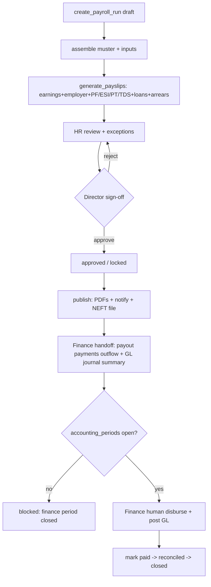

# HRMS_03 — Payroll, Statutory Compliance & Travel/Expense (India)

> **STATUS: DESIGN ONLY — NOT IMPLEMENTED.** No code, SQL, migrations, React, or API
> code is produced here. This is the FRS/TDS/DB-spec/UI/Workflow/Permission/API
> specification for the Payroll & Statutory sub-domain of Wave 3 HRMS. Wave 1 + Wave 2
> are frozen (`v2.0-wave2-complete`); production untouched; staging only.
>
> **Read first:** `wave3/00_WAVE3_DESIGN_OVERVIEW.md`, `modules/hrms.md`,
> `modules/finance.md`, `modules/expenses.md`, `modules/administration.md`,
> and `wave3/HRMS_02_TIME_ATTENDANCE_LEAVE.md` (muster/LOP/overtime/comp-off inputs).

---

## 0. Design conventions (binding for this document)

| Convention | Rule |
|---|---|
| **Money unit** | **Every** money column is `bigint` **paise** (₹1 = 100 paise). Never `numeric`/float rupees. `formatRupees()` divides by 100 for display; all arithmetic is integer paise. Mixing units is a 100× data-corruption bug. Percentages (PF %, ESI %) are stored as `numeric(7,4)` **rates**, applied to paise amounts, result rounded to whole paise (banker's/`ROUND_HALF_UP` — configurable, default half-up). |
| **Nothing hardcoded** | PF %, ESI %/ceiling, PT slabs, TDS slabs/regime params, gratuity formula, bonus ceilings, rounding rule — **all** live in versioned, effective-dated **Administration** config tables (`payroll_config`, `statutory_rate_versions`, `pt_slabs`, `tds_slabs`, …). Statutory rates change yearly; a rate change is a new **data row**, not a code deploy. |
| **Reuse before create** | Extend `employee_details` (additive nullable cols); reuse `profiles`, `attendance_days`, `leave_ledger`, `documents`, `audit_log`, `notification`, `app_settings`/`feature_flags`, `organizations`. |
| **Expand-contract** | Additive-first; new enums appended (never reordered/removed); no destructive DB change; ERP is the single system of record. |
| **System of record** | HRMS **produces** the approved payroll register + statutory registers. **Finance** disburses salary and posts GL (HRMS never pays, never posts ledger directly). T&E claim side is HRMS; reimbursement/GL/on-bill is Finance (`expenses.md`). |
| **Timezone / entity** | Wall-clock `Asia/Kolkata` (IST). Every payroll table carries `org_id` FK → `organizations` (single legal-entity master; multi-entity ready — PF/ESI/PT registers file per `org_id`). |
| **Confidentiality** | Salary + statutory data is the most sensitive PII in the platform. Reads gated by `hrms.salary.view` / `hrms.payroll.view` + strict RLS (own row OR HR/director/super_admin). No `manager (HOD)` salary visibility. Every read of another person's salary/payslip is audit-logged. |

**New enums (appended to platform enum registry, never reordered):**
- `pay_component_type`: `earning, deduction, employer_contribution, reimbursement_info`
- `calc_basis`: `fixed, percent_of_basic, percent_of_ctc, percent_of_gross, slab, formula, balancing`
- `payroll_run_status`: `draft, processing, review, approved, published, paid, closed, cancelled`
- `payslip_status`: `draft, computed, held, published, revised`
- `statutory_kind`: `pf, esi, pt, tds, lwf, gratuity`
- `loan_status`: `requested, hod_approved, approved, disbursed, active, closed, foreclosed, rejected, cancelled`
- `loan_type`: `salary_advance, staff_loan`
- `arrear_reason`: `revision, correction, promotion, bonus, retro_statutory`
- `payout_status`: `pending_finance, disbursed, failed, reconciled`
- `tds_regime`: `old, new`

---

## 1. Salary Structure & CTC

### 1.1 Functional Requirements

| # | Requirement |
|---|---|
| FR-1.1 | HR/Director define **CTC** per employee; the system derives **gross** and **net** deterministically from a component set. CTC = employer's total annual cost = gross earnings + employer statutory (PF-ER, ESI-ER) + gratuity accrual + any employer-funded benefits. |
| FR-1.2 | **Salary structure templates per grade/band** (e.g. Trainee, Executive, Sr. Executive, Manager, HOD, Director). A template is a reusable ordered set of components with calc rules; applying it to an employee instantiates an effective-dated structure. |
| FR-1.3 | Configurable **components**: earnings (Basic, HRA, Conveyance/Transport, Special Allowance, Medical, LTA, City Compensatory, Books & Periodicals, Fuel/Telephone reimbursement-as-allowance), deductions (PF-EE, ESI-EE, PT, TDS, LWF, loan EMI, salary advance recovery), employer contributions (PF-ER incl. EPS split, ESI-ER, gratuity accrual, LWF-ER). |
| FR-1.4 | Component **calc basis** must be configurable: `fixed` (₹ paise), `percent_of_basic`, `percent_of_ctc`, `percent_of_gross`, `slab`, `formula`, or `balancing` (the residual "Special Allowance" plug that makes gross tie to target). Exactly one **balancing** earning per structure. |
| FR-1.5 | **Effective-dating**: a structure has `effective_from` / `effective_to` (null = current). A revision creates a **new** structure version; history is immutable and drives arrears. No in-place edit of a past structure. |
| FR-1.6 | **CTC ↔ gross ↔ net** must be reconcilable and shown in a live breakup builder: change CTC → recompute components (top-down) or change components → recompute CTC (bottom-up). Both directions supported; balancing component absorbs rounding. |
| FR-1.7 | **Proration basis** configurable: calendar days, fixed 30-day, or actual working days (default: actual paid days ÷ month days). Used for mid-month join/leave and LOP. |
| FR-1.8 | Minimum-wage & statutory **floors** validated (e.g. Basic ≥ configured % of gross so PF is not under-stated; PT/ESI wage definitions honored). Warnings, not silent changes. |
| FR-1.9 | Structure changes are **approval-gated** (HR proposes → Director approves) and fully audit-logged with before/after JSON. |
| FR-1.10 | Support **loss-of-pay-neutral** components (e.g. reimbursements flagged `reimbursement_info` that display on payslip but are paid via Finance/T&E, never prorated as salary). |

### 1.2 Technical Design — calculation flow

**Deriving the monthly breakup from CTC (top-down):**

```
1. annual_ctc (paise)  →  monthly_ctc = annual_ctc / 12   (carry remainder to Special Allowance)
2. Resolve each component in template order by calc_basis:
     - Basic          = percent_of_ctc  (e.g. 40–50% of monthly_ctc)  [config]
     - HRA            = percent_of_basic (e.g. 40% non-metro / 50% metro) [config]
     - Conveyance     = fixed
     - Employer PF    = min(Basic, pf_wage_ceiling) × pf_er_rate       [statutory_rate_versions]
     - Employer ESI   = if gross ≤ esi_ceiling: gross × esi_er_rate else 0
     - Gratuity accrual = Basic × gratuity_accrual_rate (≈ 4.81%)      [config]
3. gross_monthly = Σ(earning components)      (excludes employer contributions)
4. Special Allowance (balancing) = monthly_ctc − Σ(all non-balancing earnings)
                                              − employer_PF − employer_ESI − gratuity_accrual
5. net_monthly = gross_monthly − Σ(employee deductions: PF-EE, ESI-EE, PT, TDS, LWF, EMIs)
6. Assert: gross_monthly + employer_PF + employer_ESI + gratuity_accrual + benefits == monthly_ctc
   (residual paise → Special Allowance so identity holds exactly)
```

- **Determinism:** the resolver is a pure function `resolveStructure(components, statutory_version, ctc_or_gross_target, direction)` → array of resolved lines in paise. It reads statutory rates from the **effective version** for the pay period (never live/global constants).
- **Rounding:** each derived amount rounded to whole paise per `payroll_config.rounding_rule`; the **balancing** component absorbs the accumulated rounding delta so the CTC identity is exact.
- **Wage bases:** PF-wage, ESI-wage, PT-wage, gratuity-wage are each a **configurable subset of components** (a `wage_base_map` in config), because "PF wages" ≠ "ESI wages" ≠ "gross" under Indian law. This is data, not code.

### 1.3 Database Design (specification — NOT CREATE TABLE)

**`salary_structure_templates`** — reusable per-grade blueprint.

| Column | Type | Notes |
|---|---|---|
| id | uuid PK | |
| org_id | uuid FK → organizations | entity dimension |
| code | text | unique per org (e.g. `GRADE_MANAGER`) |
| name | text | |
| grade | text | maps to `employee_details.grade`/band |
| pay_frequency | text | default `monthly` |
| rounding_rule | text | `half_up`/`bankers`/`floor` (override of global) nullable |
| is_active | boolean | |
| created_by, created_at, updated_at | | audit |

Constraints: `unique(org_id, code)`. Index: `(org_id, grade, is_active)`.

**`salary_template_components`** — ordered component lines of a template.

| Column | Type | Notes |
|---|---|---|
| id | uuid PK | |
| template_id | uuid FK → salary_structure_templates | ON DELETE handled by soft-inactivate, not cascade |
| seq | int | resolution/display order |
| kind | pay_component_type | earning/deduction/employer_contribution/reimbursement_info |
| code | text | `BASIC/HRA/CONV/SPECIAL/PF_EE/...` |
| name | text | display |
| calc_basis | calc_basis | fixed/percent_*/slab/formula/balancing |
| percent_value | numeric(7,4) | for percent_* bases |
| fixed_amount_paise | bigint | for `fixed` |
| formula_ref | text | key into config-registered formula (no code in DB) |
| is_balancing | boolean | exactly one true per template (earning) |
| taxable | boolean | counts toward TDS taxable income |
| part_of_pf_wage | boolean | wage-base membership |
| part_of_esi_wage | boolean | |
| part_of_pt_wage | boolean | |
| part_of_gratuity_wage | boolean | |
| is_active | boolean | |

Constraints: `unique(template_id, code)`; partial unique `(template_id) where is_balancing` (one balancing). Index: `(template_id, seq)`.

**`salary_structures`** — effective-dated per-employee instantiation (extends the `salary_structures` stub in `hrms.md` §4 with additive columns).

| Column | Type | Notes |
|---|---|---|
| id | uuid PK | |
| org_id | uuid FK → organizations | |
| user_id | uuid FK → profiles | employee |
| template_id | uuid FK → salary_structure_templates | nullable (custom) |
| effective_from | date | |
| effective_to | date | null = current |
| ctc_annual_paise | bigint | target annual CTC |
| gross_monthly_paise | bigint | derived, stored snapshot |
| net_monthly_paise | bigint | derived, stored snapshot |
| pay_frequency | text | `monthly` |
| proration_basis | text | `calendar/fixed_30/working_days` |
| statutory_version_id | uuid FK → statutory_rate_versions | version used to derive |
| status | text | `draft/pending_approval/approved/superseded` |
| approved_by | uuid FK → profiles | |
| approved_at | timestamptz | |
| revision_reason | text | drives arrears |
| is_active | boolean | |
| created_by, created_at, updated_at | | audit |

Constraints: no overlapping active `[effective_from, effective_to)` per `user_id` (enforced by exclusion/guard in RPC). Indexes: `(user_id, effective_from desc)`, `(org_id, status)`, partial `(user_id) where effective_to is null` (current structure lookup).

**`salary_components`** — resolved component lines per structure version (paise, immutable once approved).

| Column | Type | Notes |
|---|---|---|
| id | uuid PK | |
| structure_id | uuid FK → salary_structures | |
| seq | int | |
| kind | pay_component_type | |
| code | text | |
| name | text | |
| calc_basis | calc_basis | resolved basis (audit) |
| amount_monthly_paise | bigint | resolved amount |
| percent_value | numeric(7,4) | nullable (audit of rule used) |
| taxable | boolean | snapshot |
| part_of_pf_wage / part_of_esi_wage / part_of_pt_wage / part_of_gratuity_wage | boolean | wage-base snapshot |

Constraints: `unique(structure_id, code)`. Index: `(structure_id, seq)`. **Immutable** after parent structure `approved` (guard trigger; revisions create a new structure).

**Additive columns on existing `employee_details`** (nullable, expand-contract):
`grade text`, `pf_uan text`, `esi_ip_no text`, `pran text` (NPS, future), `pf_opted boolean default true`, `esi_applicable boolean` (derived+override), `tds_regime tds_regime default 'new'`, `pt_state text` (state code for PT slab, default from office), `lwf_applicable boolean`, `pf_wage_capped boolean default true` (cap at ceiling vs actual Basic), `bank_account_no text`, `bank_ifsc text`, `bank_name text`, `payment_mode text default 'NEFT'`. (No existing column altered.)

**Audit:** trigger on `salary_structures`, `salary_components`, `salary_template_components` → `audit_log` (who/what/when/before/after JSON). Reads of these tables for a `user_id ≠ auth.uid()` logged via SECURITY DEFINER read-wrapper for salary-view access.

### 1.4 UI Design

| Route | Screen | Who | Purpose |
|---|---|---|---|
| `/hrms/payroll/templates` | Structure templates | HR, director | List/create per-grade templates |
| `/hrms/payroll/templates/:id` | Template builder | HR, director | Component rows, calc basis, wage-base flags, live preview |
| `/hrms/employees/:id/salary` | Employee salary tab | HR, director, **self (read)** | Current structure + history timeline |
| `/hrms/employees/:id/salary/new` | CTC breakup builder | HR, director | Enter CTC → live top-down breakup (or bottom-up); shows CTC↔gross↔net reconciliation, floor warnings, balancing plug; submit for approval |

**CTC breakup builder** shows a two-column live calculator: left = inputs (CTC, template, effective date, proration basis, PF cap toggle, TDS regime); right = resolved monthly earnings / employer contributions / deductions / **net take-home**, plus an "annual CTC identity" strip proving `gross + employer costs = CTC`. Employee self-view is **read-only, own row only**, no template internals.

### 1.5 Workflow — structure create/revise (approval-gated)

```
HR drafts structure (from template or custom)
   → resolver computes lines (draft)
   → HR submits → status pending_approval  → notify Director
Director reviews breakup + floor warnings
   → approve → status approved, prior current structure effective_to = new.effective_from - 1, status superseded
              → if effective_from is in a past/closed period → flag arrears (see §3)
   → reject  → status draft (back to HR) with reason
All transitions audit-logged; approved structure/components immutable.
```

### 1.6 Permission Matrix (salary structure)

| Permission key | super_admin | director | hr | manager(HOD) | accounts | self |
|---|:--:|:--:|:--:|:--:|:--:|:--:|
| `hrms.salary.view` | ✓ | ✓ | ✓ | — | — | own |
| `hrms.salary.manage` (draft/edit template + structure) | ✓ | ✓ | ✓ | — | — | — |
| `hrms.salary.approve` (approve/revise) | ✓ | ✓ | — | — | — | — |
| `hrms.salary.template.manage` | ✓ | ✓ | ✓ | — | — | — |

RLS: `salary_structures`/`salary_components` SELECT = `user_id = auth.uid()` OR `has_perm('hrms.salary.view')`; write = `has_perm('hrms.salary.manage')` (draft) / `hrms.salary.approve` (approve) via SECURITY DEFINER RPC only. No `team` scope — HODs never see salaries.

### 1.7 API Design (described)

**Data-access (`modules/hrms/api/payroll/`):**
- `listSalaryTemplates(orgId)` → `Template[]` · `hrms.salary.template.manage`
- `getSalaryStructure(userId, asOfDate?)` → current/as-of structure + resolved lines · self or `hrms.salary.view`
- `listSalaryHistory(userId)` → `Structure[]` (effective-dated) · self or `hrms.salary.view`

**RPCs (SECURITY DEFINER — business rules + RLS cannot be bypassed):**
- `preview_salary_breakup(template_id|components, ctc_paise|gross_paise, direction, statutory_version_id, effective_date)` → resolved lines (no write) · `hrms.salary.manage`
- `upsert_salary_structure_draft(user_id, payload)` → draft structure · `hrms.salary.manage`; validates one balancing, floor rules, no overlap.
- `submit_salary_structure(structure_id)` → pending_approval + notify · `hrms.salary.manage`
- `approve_salary_structure(structure_id, decision, reason)` → approved/superseded prior + arrears flag · `hrms.salary.approve`; atomic, audit-logged.

All async wrapped in try/catch; user-facing errors via `toast()`; every state change writes `audit_log`.

---

## 2. Statutory Compliance (India)

> **Golden rule:** every rate, ceiling, threshold, slab, and cut-off date below is **configuration data** in Administration-owned, versioned, effective-dated tables. The values shown are **illustrative current values**, not constants to compile in. A statutory change (e.g. the long-pending PF/ESI wage-ceiling revisions, a new PT slab, a Budget TDS change) is applied by inserting a **new `statutory_rate_versions` row** with a future `effective_from` — zero code change, zero deploy.

### 2.1 Functional Requirements

| # | Requirement |
|---|---|
| FR-2.1 | **PF (EPF & MP Act):** employee contribution and employer contribution computed on **PF wages** (configurable wage base, default Basic + DA). Employer split into **EPF** and **EPS** (pension) with a configurable EPS wage ceiling; **EDLI** and **admin charges** computed as configurable % of PF wages. PF-wage capping (at ceiling) vs uncapped (on actual Basic) is a per-employee toggle (`pf_wage_capped`). Voluntary PF (VPF) supported as an extra employee % over statutory. |
| FR-2.2 | **ESI (ESI Act):** applies only where **ESI gross ≤ ceiling** (configurable). Employee and employer rates configurable. **Contribution-period stickiness**: once in a contribution period an employee crosses the ceiling mid-period, ESI continues to period end (Apr–Sep / Oct–Mar) — implemented via configurable contribution-period calendar. |
| FR-2.3 | **Professional Tax (state Act):** **state-wise monthly slabs** on PT wages; slab tables per state, with special rules (e.g. some states levy a higher amount in a specific month; some states are half-yearly). Employee's PT state from `employee_details.pt_state` (defaults from office location). Nil-PT states (e.g. no PT) supported by an empty/zero slab set. |
| FR-2.4 | **TDS (Income Tax — salary, Sec 192):** compute **estimated annual tax** under employee's declared **regime (old/new)**, spread over remaining months (year-to-date true-up). Support **investment declarations** & **proofs** (80C, 80D, HRA exemption, home-loan interest, standard deduction, Chapter VI-A), **previous-employer income**, **other-income** declarations, surcharge & cess, rebate (87A), and marginal relief — **all thresholds configurable** per assessment year. |
| FR-2.5 | **Gratuity (Payment of Gratuity Act):** monthly **accrual** (part of CTC, ≈ 4.81% of Basic — configurable) and **payout** on exit for employees with ≥ configurable qualifying service (default 5 years), formula `last_drawn_basic_da × 15/26 × completed_years` with a configurable statutory cap; payout is a **Full & Final** item, not a monthly payslip line. |
| FR-2.6 | **LWF (Labour Welfare Fund):** optional, state-wise, periodicity-based (some states half-yearly/annual) employee + employer contribution; configurable. |
| FR-2.7 | **Statutory registers / returns export:** PF **ECR** text file, ESI **contribution** file, **PT** challan/return summary, **Form 24Q** (quarterly TDS) inputs and **Form 16** Part-B inputs, LWF statement — each per `org_id` per period, exportable. Filing itself is **out-of-band** (EPFO/ESIC/TRACES portals) — ERP generates the file, a human uploads. |
| FR-2.8 | **Effective-dated versioning + audit:** which statutory version a payslip used is stored on the payslip; recomputing a locked period is disallowed (arrears used instead). Every config change is audit-logged with effective date. |

### 2.2 Technical Design — statutory calculation flow

**Per employee, per pay period, the payroll engine resolves the effective statutory version for that period, then:**

```
PF:
  pf_wage      = Σ components where part_of_pf_wage           (paise)
  pf_wage_base = pf_wage_capped ? min(pf_wage, pf_wage_ceiling) : pf_wage
  pf_ee        = round(pf_wage_base × pf_ee_rate)             (+ VPF if any)
  eps          = round(min(pf_wage, eps_wage_ceiling) × eps_rate)
  epf_er       = round(pf_wage_base × pf_er_rate) − eps       (employer EPF = ER share − EPS)
  edli         = round(min(pf_wage, edli_ceiling) × edli_rate)
  pf_admin     = round(pf_wage_base × pf_admin_rate)

ESI (only if esi_applicable for the contribution period):
  esi_wage = Σ components where part_of_esi_wage
  in_scope = esi_wage ≤ esi_ceiling  OR  sticky_continuation(period)
  esi_ee   = in_scope ? roundup(esi_wage × esi_ee_rate) : 0     (ESI rounds UP to next rupee)
  esi_er   = in_scope ? roundup(esi_wage × esi_er_rate) : 0

PT:
  pt_wage = Σ components where part_of_pt_wage   (usually = gross)
  pt      = slab_lookup(pt_slabs[state, period], pt_wage)   (+ special-month rule)

TDS (Sec 192, YTD true-up):
  proj_annual_income = ytd_taxable + (est_monthly_taxable × remaining_months)
                       + prev_employer_income + declared_other_income
  gross_tax   = apply_slabs(tds_slabs[regime, AY], taxable_after_deductions)
  tax_after_rebate = apply_87A(gross_tax); + surcharge(+marginal_relief) + cess
  tds_this_month = round((annual_tax − tds_deducted_ytd) / remaining_months)

Gratuity accrual (monthly, into CTC/liability, NOT a payslip deduction/earning):
  grat_accrual = round(basic_da × gratuity_accrual_rate)
```

- **Rounding is per-statute and configurable:** PF to nearest rupee, ESI **rounded up** to next rupee, PT exact slab amount, TDS to nearest rupee — encoded as per-statute `rounding_rule` in config, never hardcoded.
- **Wage-base membership** (`part_of_pf_wage` etc.) is a component-level config flag (§1.3) — the engine sums by flag, so redefining "PF wages" is a data edit.
- The engine is a **pure function of (resolved salary components, muster/LOP, statutory version, employee statutory profile)** → statutory line amounts; it never reads live global constants.

### 2.3 Database Design (specification) — Administration-owned statutory config

**`statutory_rate_versions`** — the versioned rate set (one row = one effective rate regime).

| Column | Type | Notes |
|---|---|---|
| id | uuid PK | |
| org_id | uuid FK → organizations | nullable = platform default |
| effective_from | date | inclusive |
| effective_to | date | null = current |
| pf_ee_rate | numeric(7,4) | e.g. 0.1200 |
| pf_er_rate | numeric(7,4) | |
| eps_rate | numeric(7,4) | |
| pf_wage_ceiling_paise | bigint | e.g. 1500000 (₹15,000) |
| eps_wage_ceiling_paise | bigint | |
| edli_rate, edli_ceiling_paise | numeric/bigint | |
| pf_admin_rate | numeric(7,4) | |
| esi_ee_rate, esi_er_rate | numeric(7,4) | |
| esi_wage_ceiling_paise | bigint | e.g. 2100000 (₹21,000) |
| esi_contrib_period_1, _2 | daterange | Apr–Sep / Oct–Mar (config) |
| gratuity_accrual_rate | numeric(7,4) | ≈ 0.0481 |
| gratuity_qualifying_years | int | default 5 |
| gratuity_formula_ref | text | `15/26` formula key |
| gratuity_cap_paise | bigint | statutory max |
| rounding_rules | jsonb | per-statute rounding map |
| notes | text | citation of the notification |
| created_by, created_at | | audit |

Constraints: no overlapping `[effective_from, effective_to)` per `org_id`. Index: `(org_id, effective_from desc)`.

**`pt_slabs`** — state-wise professional-tax slabs.

| Column | Type | Notes |
|---|---|---|
| id | uuid PK | |
| state_code | text | e.g. `PB, MH, KA, WB` |
| effective_from / effective_to | date | versioned |
| from_wage_paise | bigint | inclusive lower bound (monthly PT wage) |
| to_wage_paise | bigint | nullable = ∞ |
| amount_paise | bigint | PT for the slab |
| special_month | int | nullable (e.g. higher amount in a set month) |
| special_amount_paise | bigint | nullable |
| periodicity | text | `monthly/half_yearly/annual` |

Constraints: `unique(state_code, effective_from, from_wage_paise)`; non-overlapping ranges per `(state_code, effective_from)`. Index: `(state_code, effective_from, from_wage_paise)`.

**`tds_slabs`** — income-tax slabs per regime per assessment year.

| Column | Type | Notes |
|---|---|---|
| id | uuid PK | |
| regime | tds_regime | old/new |
| assessment_year | text | e.g. `AY2027-28` |
| from_income_paise / to_income_paise | bigint | slab bounds (annual) |
| rate | numeric(7,4) | marginal rate |
| effective_from | date | |

Companion config (in `payroll_config` jsonb or sibling tables): standard deduction, 87A rebate threshold+amount, surcharge slabs+marginal relief, cess rate, Chapter VI-A caps (80C/80D/…), HRA exemption rule params. All **per AY**, versioned.

**`payroll_config`** — singleton-per-org tunables not fitting a rate version.

| Column | Type | Notes |
|---|---|---|
| id | uuid PK | |
| org_id | uuid FK → organizations | |
| proration_basis_default | text | |
| rounding_rule_default | text | |
| wage_base_map | jsonb | which component codes belong to which wage base (fallback to component flags) |
| lwf_config | jsonb | state-wise LWF amounts + periodicity |
| bonus_config | jsonb | Payment of Bonus Act: wage ceiling, min 8.33%/max 20%, eligibility |
| pt_special_rules | jsonb | per-state edge cases |
| effective_from | date | versioned |

**`employee_statutory_profile`** — per-employee statutory switches (or additive columns on `employee_details`, §1.3). If a separate table: `user_id FK`, `pf_opted`, `pf_wage_capped`, `vpf_rate`, `esi_applicable`, `pt_state`, `lwf_applicable`, `tds_regime`, effective-dated.

**`tds_declarations`** — investment declaration & proofs per employee per FY.

| Column | Type | Notes |
|---|---|---|
| id | uuid PK | |
| org_id, user_id | uuid FK | |
| financial_year | text | e.g. `FY2026-27` |
| regime | tds_regime | declared regime |
| declared_80c_paise, declared_80d_paise, home_loan_interest_paise, hra_claim_paise, other_chapter_via_paise | bigint | declared amounts |
| prev_employer_income_paise, prev_employer_tds_paise | bigint | |
| other_income_paise | bigint | |
| status | text | `declared/proofs_submitted/verified/locked` |
| verified_by | uuid FK | HR/finance |
| document_ref | uuid FK → documents | proof pack |
| created_at, updated_at | | audit |

Constraints: `unique(org_id, user_id, financial_year)`. Proof files via `core/files`/`documents`.

**Audit:** all config tables + declarations → `audit_log`; the **statutory_version_id used** is stamped on each `payslip` (§4) for forensic reproducibility.

### 2.4 UI Design

| Route | Screen | Who | Purpose |
|---|---|---|---|
| `/admin/payroll/statutory` | Statutory rate versions | super_admin, director, hr | View/insert effective-dated PF/ESI/gratuity versions; diff vs previous |
| `/admin/payroll/pt-slabs` | PT slabs | super_admin, hr | Per-state slab editor, effective-dated |
| `/admin/payroll/tds-slabs` | TDS slabs & params | super_admin, hr | Regime slabs, rebate/surcharge/cess per AY |
| `/hrms/payroll/tds/declarations` | TDS declarations inbox | hr | Review/verify employee declarations & proofs |
| `/hrms/me/tds` | My tax declaration | self | Declare regime + investments, upload proofs, see projected TDS |
| `/hrms/payroll/statutory-registers` | Statutory registers | hr, accounts | Generate ECR/ESI/PT/24Q/Form-16 exports per period |

Config screens show an **effective-date picker** and a read-only "value used for July 2026" resolver so HR sees exactly which version a given period will use. Editing never mutates a past version — it inserts a new one.

### 2.5 Workflow — statutory config change & TDS declaration

```
Rate change (e.g. new PF ceiling):
  super_admin/director opens Statutory versions → "New version"
  → set effective_from (future), edit rates → save (draft)
  → review diff → activate → prior version effective_to = new − 1 day
  → audit_log; future payroll runs auto-pick the version by period date. No deploy.

TDS declaration:
  Employee submits declaration (regime + investments)  → status declared
  → uploads proofs (Jan–Mar window)                    → proofs_submitted
  → HR/Finance verifies against proofs                 → verified
  → year-end lock                                       → locked
  Payroll engine reads the latest verified declaration each month for YTD true-up.
```

### 2.6 Permission Matrix (statutory)

| Permission key | super_admin | director | hr | accounts | self |
|---|:--:|:--:|:--:|:--:|:--:|
| `hrms.statutory.config.view` | ✓ | ✓ | ✓ | ✓ (read) | — |
| `hrms.statutory.config.manage` (rate versions, slabs) | ✓ | ✓ | ✓* | — | — |
| `hrms.statutory.register.export` | ✓ | ✓ | ✓ | ✓ | — |
| `hrms.tds.declaration.submit` | self | self | self | self | own |
| `hrms.tds.declaration.verify` | ✓ | ✓ | ✓ | ✓ | — |

`*` HR may edit PT/TDS slabs; **rate-version activation** may be restricted to super_admin/director via a stricter grant if desired. RLS: config tables SELECT = `hrms.statutory.config.view`; write = `hrms.statutory.config.manage` via SECURITY DEFINER. `tds_declarations` SELECT = own OR `hrms.tds.declaration.verify`; employee writes own until `verified`.

### 2.7 API Design (described)

**Data-access:**
- `getEffectiveStatutoryVersion(orgId, asOfDate)` → version · `hrms.statutory.config.view`
- `listPtSlabs(state, asOfDate)` / `listTdsSlabs(regime, ay)` → slabs · config.view
- `getMyTdsDeclaration(fy)` / `listTdsDeclarations(fy, status)` → declarations · self / verify

**RPCs / Edge Functions (SECURITY DEFINER):**
- `upsert_statutory_version(payload)` / `activate_statutory_version(id)` → version · `hrms.statutory.config.manage`; enforces non-overlap, audit.
- `upsert_pt_slabs(state, rows)` / `upsert_tds_slabs(regime, ay, rows)` · config.manage.
- `submit_tds_declaration(fy, payload)` · self; `verify_tds_declaration(id, decision)` · verify.
- `compute_tds_projection(user_id, period)` → projected annual tax + monthly TDS (pure, no write) · used by payroll engine & self-service preview.
- `export_statutory_register(org_id, period, kind)` (Edge Fn) → ECR / ESI / PT / 24Q / Form-16 file → stored in `hr-docs`/documents · `hrms.statutory.register.export`.

Filing to EPFO/ESIC/TRACES is manual/out-of-band; ERP produces the file only.

---

## 3. Earnings, Deductions, Loans, Advances & Arrears

### 3.1 Functional Requirements

| # | Requirement |
|---|---|
| FR-3.1 | **Ad-hoc earnings** per period: **Bonus** (statutory Payment-of-Bonus and/or discretionary), **Incentive/Commission**, **overtime pay** (from Attendance OT — doc 02), **comp-off encashment**, one-time allowances. Each is a period-scoped input row, flagged taxable/PF-wage/ESI-wage per config. |
| FR-3.2 | **Ad-hoc deductions** per period: canteen, notice-pay recovery, asset recovery, excess-advance recovery, penalties. |
| FR-3.3 | **Reimbursements-as-info:** fuel/telephone/LTA reimbursements that appear on the payslip for information but are **paid via Finance/T&E**, never treated as salary and never prorated for LOP (`reimbursement_info` component). True out-of-pocket T&E stays in §5 / `expenses.md`. |
| FR-3.4 | **Loans & Salary Advances:** employee requests a **salary advance** (short, recovered next month(s)) or a **staff loan** (principal, tenure, optional interest). Approval chain HOD → HR/Director. On approval, **disbursement is a Finance payout** (HRMS never pays). Recovery is an **EMI deduction** auto-injected into each payslip until closed; supports part-prepayment, foreclosure, and pause (during LOP). |
| FR-3.5 | **Arrears:** salary revision effective in a **past** period (incl. a **closed** payroll month) generates an **arrears earning** in the next open run = Σ(new − old) per affected month, split by wage-base so statutory recomputes on arrears correctly. Reasons: revision/promotion/correction/retro-statutory. |
| FR-3.6 | **Loan amortization schedule** generated at approval (principal, EMIs, interest if any, balance) and shown to employee; each payslip EMI posts a **loan_ledger** entry reducing balance. |
| FR-3.7 | All earnings/deductions/loan inputs are **effective-dated & audit-logged**; ad-hoc inputs are attached to a specific `payroll_run` and locked when the run locks. |

### 3.2 Technical Design — calculation flow

```
Per-run inputs assembled BEFORE payslip compute:
  earnings_adhoc[]   (bonus/incentive/OT/comp-off encashment)   → payslip_lines (earning)
  deductions_adhoc[] (recoveries/penalties)                     → payslip_lines (deduction)
  loan_emi           = active loans' due EMI this period        → payslip_lines (deduction)  + loan_ledger debit
  arrears            = Σ over affected months (new−old) per wage base → payslip_lines (earning, arrear)

Statutory recompute:
  - bonus/incentive taxable → added to TDS projected income (not PF/ESI unless flagged)
  - arrears: recompute PF/ESI/PT/TDS on the arrear per its month's statutory version;
    TDS on arrears may use Sec 89 relief (Form 10E) — captured as data, computed/claimed by employee, not auto-filed
  - loan interest (if any) is a perquisite for TDS only if concessional vs SBI benchmark (configurable flag)
```

- **Loan EMI vs net-pay guard:** total deductions cannot drive net pay below a configurable floor (e.g. 0 or min-wage protection) — excess EMI auto-deferred to next month (configurable behavior).
- **LOP interplay:** during unpaid leave, loan EMI can be configured to **pause** (extend tenure) or **continue** (accrue arrears) — a per-loan setting.

### 3.3 Database Design (specification)

**`payroll_inputs`** — ad-hoc earnings/deductions staged for a run.

| Column | Type | Notes |
|---|---|---|
| id | uuid PK | |
| org_id | uuid FK → organizations | |
| run_id | uuid FK → payroll_runs | nullable until attached |
| user_id | uuid FK → profiles | |
| kind | pay_component_type | earning/deduction/reimbursement_info |
| code | text | `BONUS/INCENTIVE/OT/COMPOFF_ENCASH/CANTEEN/PENALTY/...` |
| name | text | |
| amount_paise | bigint | |
| taxable | boolean | |
| part_of_pf_wage / part_of_esi_wage / part_of_pt_wage | boolean | wage-base membership |
| source | text | `manual/attendance_ot/compoff/incentive_engine` |
| source_ref | uuid | link to OT/comp-off/incentive record |
| status | text | `staged/applied/void` |
| created_by, created_at | | audit |

Index: `(run_id)`, `(user_id, run_id)`. Locked (immutable) when run locks.

**`loans`** — salary advance / staff loan master.

| Column | Type | Notes |
|---|---|---|
| id | uuid PK | |
| org_id, user_id | uuid FK | |
| loan_type | loan_type | salary_advance/staff_loan |
| principal_paise | bigint | |
| interest_rate | numeric(7,4) | annual, nullable (0 for advance) |
| interest_method | text | `flat/reducing/none` |
| tenure_months | int | |
| emi_paise | bigint | derived |
| start_period | text | `YYYY-MM` first recovery |
| lop_behavior | text | `pause/continue` |
| status | loan_status | requested…active…closed/foreclosed |
| outstanding_paise | bigint | running balance |
| reason | text | |
| hod_approver, approver | uuid FK | approval chain |
| approved_at | timestamptz | |
| finance_payout_id | uuid FK → payments | Finance disbursement (outflow) |
| created_by, created_at, updated_at | | audit |

Index: `(user_id, status)`, `(org_id, status)`. Constraint: `outstanding_paise ≥ 0`.

**`loan_schedule`** — amortization plan (immutable snapshot at approval; regenerated on foreclosure/part-pay).

| Column | Type | Notes |
|---|---|---|
| id | uuid PK | |
| loan_id | uuid FK → loans | |
| seq | int | installment no |
| due_period | text | `YYYY-MM` |
| principal_component_paise | bigint | |
| interest_component_paise | bigint | |
| emi_paise | bigint | |
| balance_paise | bigint | after this EMI |
| status | text | `scheduled/paid/skipped/prepaid` |

Index: `(loan_id, seq)`.

**`loan_ledger`** — actual movements (disbursement, EMI recovery, prepayment, foreclosure, waiver).

| Column | Type | Notes |
|---|---|---|
| id | uuid PK | |
| loan_id | uuid FK → loans | |
| user_id | uuid FK | |
| entry_type | text | `disburse/emi_recovery/prepay/foreclose/waiver/pause` |
| period | text | `YYYY-MM` nullable |
| delta_principal_paise | bigint | signed |
| delta_interest_paise | bigint | signed |
| balance_after_paise | bigint | |
| payslip_id | uuid FK → payslips | nullable (EMI source) |
| payment_id | uuid FK → payments | nullable (Finance disburse) |
| created_at | | |

Index: `(loan_id, period)`, `(payslip_id)`.

**`arrears`** — retro pay owed from a salary revision.

| Column | Type | Notes |
|---|---|---|
| id | uuid PK | |
| org_id, user_id | uuid FK | |
| reason | arrear_reason | revision/promotion/correction/retro_statutory |
| from_period, to_period | text | `YYYY-MM` range recomputed |
| old_structure_id, new_structure_id | uuid FK → salary_structures | |
| gross_arrear_paise | bigint | Σ(new−old) earnings |
| statutory_arrear_json | jsonb | per-month PF/ESI/PT/TDS deltas |
| net_arrear_paise | bigint | |
| paid_in_run_id | uuid FK → payroll_runs | nullable until paid |
| status | text | `computed/applied/paid` |
| created_by, created_at | | audit |

Index: `(user_id, status)`, `(paid_in_run_id)`.

**Audit:** all four tables → `audit_log`; loan approval and any waiver require dual-control (HR + Director) and are individually logged.

### 3.4 UI Design

| Route | Screen | Who | Purpose |
|---|---|---|---|
| `/hrms/payroll/:runId/inputs` | Run inputs grid | hr | Enter/import bonus, incentive, OT (auto from attendance), recoveries per employee |
| `/hrms/payroll/loans` | Loans register | hr, director | All loans/advances, outstanding, status |
| `/hrms/payroll/loans/:id` | Loan detail | hr, director, self(own) | Schedule, ledger, prepay/foreclose actions |
| `/hrms/me/loans` | My loans/advances | self | Request advance/loan, view schedule + outstanding |
| `/hrms/payroll/arrears` | Arrears queue | hr, director | Review computed arrears, attach to next run |

### 3.5 Workflow — loan approval & arrears

```
Loan/Advance:
  Employee requests (type, amount, tenure)      → status requested → notify HOD
  HOD recommends                                → hod_approved     → notify HR/Director
  HR/Director approves (checks eligibility/limit)→ approved
     → loan_schedule generated
     → HANDOFF to Finance: create payout (payment, direction=outflow) → status disbursed
     → loan_ledger disburse entry; status active
  Each payroll run: EMI deduction auto-injected → loan_ledger emi_recovery; balance ↓
  Balance 0 → status closed.  Prepay/foreclose → schedule regenerated.

Arrears:
  Salary revision approved with past effective_from
     → compute_arrears (per-month new−old, statutory recompute) → arrears row status computed
     → HR attaches to next open run → applied → paid when run approved.
```

### 3.6 Permission Matrix (earnings/deductions/loans)

| Permission key | super_admin | director | hr | manager(HOD) | accounts | self |
|---|:--:|:--:|:--:|:--:|:--:|:--:|
| `hrms.payroll.input.manage` (ad-hoc earn/deduct) | ✓ | ✓ | ✓ | — | — | — |
| `hrms.loan.request` | self | self | self | self | self | own |
| `hrms.loan.recommend` (HOD) | ✓ | ✓ | ✓ | team | — | — |
| `hrms.loan.approve` | ✓ | ✓ | — | — | — | — |
| `hrms.loan.view` | ✓ | ✓ | ✓ | — | approved payout only | own |
| `hrms.arrears.manage` | ✓ | ✓ | ✓ | — | — | — |

RLS: `payroll_inputs`/`arrears` write = `hrms.payroll.input.manage`/`hrms.arrears.manage`; `loans`/`loan_ledger` SELECT = own OR `hrms.loan.view`; state transitions via SECURITY DEFINER RPCs (approval, disburse, EMI). Finance sees only the `payments` payout row it must disburse, not the loan PII.

### 3.7 API Design (described)

**Data-access:** `listPayrollInputs(runId)`, `listLoans(filter)`, `getLoan(id)` (+schedule+ledger), `getMyLoans()`, `listArrears(status)`.

**RPCs / Edge Functions (SECURITY DEFINER):**
- `upsert_payroll_input(run_id, user_id, payload)` · `hrms.payroll.input.manage`; blocked once run locked.
- `import_overtime_inputs(run_id)` — pulls approved OT/comp-off encashment from Attendance/Leave (doc 02) into `payroll_inputs`.
- `request_loan(payload)` · self; `recommend_loan(id)` · HOD; `approve_loan(id, decision)` · `hrms.loan.approve` → generates schedule + **emits Finance payout handoff**.
- `record_loan_disbursed(id, payment_id)` — called after Finance confirms payout; flips `active`.
- `prepay_loan(id, amount)` / `foreclose_loan(id)` — regenerate schedule; ledger entries.
- `compute_arrears(user_id, new_structure_id)` — per-month recompute; writes `arrears` (status computed).
- `apply_arrears_to_run(arrears_id, run_id)` · `hrms.arrears.manage`.

Loan disbursement money movement is **executed by a human in Finance** (platform safety rule — HRMS never transfers funds); HRMS only records the resulting `payments` row reference.

---

## 4. Payroll Processing

### 4.1 Functional Requirements

| # | Requirement |
|---|---|
| FR-4.1 | **Monthly payroll run** per `org_id` per period. States: `draft → processing → review → approved → published → paid → closed` (+`cancelled`). A period can be auto-pre-drafted (cron, `hrms.md` §10) for HR. |
| FR-4.2 | **Inputs consolidation:** muster (paid days / LOP / weekly-off / holidays) from Attendance (doc 02), approved **overtime** & **comp-off** encashment, approved leave from `leave_ledger`, ad-hoc `payroll_inputs`, active loan EMIs, applicable arrears, TDS declarations. **LOP proration** per configured basis. |
| FR-4.3 | **Payslip generation:** per employee compute earnings, employer contributions, statutory deductions (PF/ESI/PT/TDS/LWF), ad-hoc, loan EMI, arrears → gross, total deductions, **net pay** (all paise). Store which `statutory_version_id` and `salary_structure_id` were used. |
| FR-4.4 | **Review & exceptions:** variance-vs-last-month report, zero/negative-net flags, missing-PII flags (no UAN/PAN/bank), ESI-scope changes, new joiners/leavers. HR resolves before approval. |
| FR-4.5 | **Lock / approval:** HR moves `draft→review`; **Director sign-off** moves `review→approved` and **locks** the run (payslips immutable). Re-open only by super_admin before publish, fully audited. Approving is dual-control (HR prepared, Director approved). |
| FR-4.6 | **Payslip PDF** generation reusing **Document Management** (Edge Fn → `hr-docs`/`documents`), branded per `org_id`; published to employee self-service. |
| FR-4.7 | **Payroll register** (all employees × components + statutory totals) exportable (XLSX/PDF). |
| FR-4.8 | **Bank transfer (NEFT) file** generated from net pay + employee bank details in the bank's format (config per `bank_account`); **HRMS produces the file, a human uploads to the bank** — HRMS never initiates transfer. Net-pay total ties to the Finance payout. |
| FR-4.9 | **Finance handoff:** on publish, emit (a) a **salary payout** = Finance `payments` (`direction=outflow`) per employee or a batch, and (b) a **payroll expense journal summary** for Finance to post to GL (salary expense, PF/ESI/PT/TDS **payable** liabilities, net-pay bank credit). Respect `accounting_periods` lock — a run cannot be booked into a **closed** finance period. |
| FR-4.10 | **Full & Final (F&F):** leaver's final run includes EL encashment, gratuity (if eligible), pending arrears/reimbursements, minus recoveries (notice, loan foreclosure, asset) → net F&F. |
| FR-4.11 | **Statutory registers** (§2.7) generated from the approved run per period. |

### 4.2 Technical Design — payroll run flow

```
create_payroll_run(org, year, month) → run (draft)
  ├─ assemble muster: attendance_days ∩ leave_ledger ∩ holidays ∩ weekly_offs  → paid_days, lop_days
  ├─ import_overtime_inputs, ad-hoc payroll_inputs, active loan EMIs, applicable arrears
generate_payslips(run_id)  [Edge Function, batched]  → status processing→review
  for each active employee in org for the period:
     structure   = getSalaryStructure(user, period)          (effective-dated)
     stat_ver    = getEffectiveStatutoryVersion(org, period)
     proration   = paid_days / month_days  (per basis)
     earnings    = structure earnings × proration  + arrears + adhoc earnings + OT
     employer    = PF-ER/EPS/EDLI/admin, ESI-ER, gratuity accrual   (on prorated wages)
     deductions  = PF-EE + ESI-EE + PT + TDS(YTD true-up) + LWF + loan EMI + adhoc deductions
     gross       = Σ earnings ;  net = gross − Σ deductions
     write payslip + payslip_lines (paise) ; stamp structure_id + statutory_version_id
     loan_ledger emi_recovery ; update loan balance
  run totals = Σ gross / Σ deductions / Σ net / Σ statutory
HR review (exceptions) → approve_payroll_run(run_id) [Director] → approved (locked)
publish_payroll_run(run_id) →
     render payslip PDFs (Doc Mgmt) → publish to self-service + notify
     generate NEFT file (config format)  [human uploads to bank]
     Finance handoff: payout payments(outflow) + expense journal summary  → status published
Finance disburses (human) + posts GL → mark run paid (payout_status reconciled) → closed
```

- **Idempotency:** `generate_payslips` is re-runnable while `draft/review` (regenerates lines); blocked once `approved`.
- **Reproducibility:** stamping `statutory_version_id`/`structure_id` on each payslip means a payslip can always be re-derived exactly even after rates change.
- **Finance boundary:** HRMS calls the **Finance module `index.ts`** public API only (never Finance internals). It hands a payout request + journal summary; **Finance owns** `payments`, `ledger_entries`, `accounting_periods` and does the actual booking/disbursement. The GL summary maps to Finance `ledger_accounts` (Salary Expense Dr; PF/ESI/PT/TDS Payable Cr; Bank/Net-pay Payable Cr) — posted by Finance's SECURITY DEFINER function.

### 4.3 Database Design (specification) — extends `hrms.md` §4 payroll tables

**`payroll_runs`** (extend stub with additive columns):

| Column | Type | Notes |
|---|---|---|
| id | uuid PK | |
| org_id | uuid FK → organizations | entity |
| period_year, period_month | int | |
| status | payroll_run_status | draft…closed/cancelled |
| statutory_version_id | uuid FK | version resolved for the run |
| gross_total_paise, deduction_total_paise, net_total_paise | bigint | |
| pf_total_paise, esi_total_paise, pt_total_paise, tds_total_paise, lwf_total_paise | bigint | statutory totals |
| employer_cost_total_paise | bigint | incl employer contributions |
| headcount | int | payslips in run |
| finance_journal_id | uuid | Finance GL journal ref (nullable) |
| finance_period_locked | boolean | resolved from `accounting_periods` |
| created_by | uuid FK | HR |
| approved_by | uuid FK | Director |
| approved_at, published_at, paid_at, closed_at | timestamptz | |

Constraints: `unique(org_id, period_year, period_month)` (one run/month/entity). Index: `(org_id, period_year, period_month)`, `(status)`.

**`payslips`** (extend stub):

| Column | Type | Notes |
|---|---|---|
| id | uuid PK | |
| run_id | uuid FK → payroll_runs | |
| org_id, user_id | uuid FK | |
| salary_structure_id | uuid FK | snapshot used |
| statutory_version_id | uuid FK | snapshot used |
| paid_days, lop_days, month_days | numeric | muster |
| gross_paise, total_deductions_paise, net_pay_paise | bigint | |
| pf_ee_paise, pf_er_paise, eps_paise, edli_paise, pf_admin_paise | bigint | |
| esi_ee_paise, esi_er_paise | bigint | |
| pt_paise, tds_paise, lwf_ee_paise, lwf_er_paise | bigint | |
| gratuity_accrual_paise | bigint | employer accrual (info) |
| loan_emi_paise, arrear_paise | bigint | |
| status | payslip_status | draft/computed/held/published/revised |
| pdf_document_id | uuid FK → documents | payslip PDF |
| payout_id | uuid FK → payments | Finance disbursement |
| payout_status | payout_status | pending_finance/disbursed/reconciled |
| is_ff | boolean | Full & Final |
| computed_at, published_at | timestamptz | |

Constraints: `unique(run_id, user_id)`. Index: `(run_id)`, `(user_id, run_id)`, partial `(user_id) where status='published'`. **Immutable after run `approved`** (guard); corrections via a **revised** payslip in a later run + arrears, never in-place edit.

**`payslip_lines`** (extend stub): `id PK`, `payslip_id FK`, `seq`, `kind pay_component_type`, `code`, `name`, `amount_paise bigint`, `taxable boolean`, `wage-base flags`. Index `(payslip_id, seq)`. Immutable with parent.

**`payroll_payout_batches`** — NEFT/Finance handoff batch.

| Column | Type | Notes |
|---|---|---|
| id | uuid PK | |
| run_id | uuid FK → payroll_runs | |
| org_id | uuid FK | |
| bank_account_id | uuid FK → finance bank_accounts | disbursing account |
| total_net_paise | bigint | ties to run net_total |
| neft_file_document_id | uuid FK → documents | generated file |
| finance_payment_id | uuid FK → payments | Finance outflow record |
| status | payout_status | pending_finance/disbursed/reconciled |
| created_at | | |

Index: `(run_id)`.

**Audit:** `payroll_runs`, `payslips`, `payslip_lines`, `payroll_payout_batches` → `audit_log`; every **read** of a payslip not one's own is logged (salary confidentiality). Run approval/publish are dual-control audited events.

### 4.4 UI Design

| Route | Screen | Who | Purpose |
|---|---|---|---|
| `/hrms/payroll` | Payroll runs | hr, director | Monthly runs list + status + net payable |
| `/hrms/payroll/:runId` | Run detail | hr, director | Payslip grid, statutory totals, exceptions panel, sign-off |
| `/hrms/payroll/:runId/exceptions` | Exceptions | hr | Zero/negative net, missing PII, variance vs last month |
| `/hrms/payroll/:runId/register` | Payroll register | hr, director, accounts(approved) | Full grid export (XLSX/PDF) |
| `/hrms/payroll/:runId/neft` | Bank transfer file | hr, accounts | Generate NEFT file (config format) for human bank upload |
| `/hrms/payroll/:runId/:payslipId` | Payslip | hr, director, **self(own)** | Earnings/deductions/net, PDF |
| `/hrms/me/payslips` | My payslips | self | Published payslips, download PDF |

Run detail shows a **status stepper** (draft→…→closed), statutory totals strip, exceptions badge (blocks approval until cleared), and a **Finance handoff panel** (payout batch + journal summary preview, greyed if finance period closed).

### 4.5 Workflow — payroll run approval

```
[cron/HR] create_payroll_run → draft
HR: assemble inputs, generate_payslips → processing → review
HR: clear exceptions
HR: submit for approval (review)                 → notify Director
Director: review totals + register → approve      → approved (LOCKED)  [dual-control]
HR: publish_payroll_run → render PDFs + notify + NEFT file + Finance handoff → published
Finance (human): disburse net pay + post GL       → HRMS marks paid → reconciled → closed
   (Finance rejects if accounting_periods month is closed → HRMS run stays published, flagged)
Cancel path: cancel_payroll_run (super_admin, pre-publish only) → cancelled, audited.
```



### 4.6 Permission Matrix (payroll processing)

| Permission key | super_admin | director | hr | manager(HOD) | accounts | auditor | self |
|---|:--:|:--:|:--:|:--:|:--:|:--:|:--:|
| `hrms.payroll.view` | ✓ | ✓ | ✓ | — | approved only | read | — |
| `hrms.payroll.process` (run/generate/register/NEFT) | ✓ | — | ✓ | — | — | — | — |
| `hrms.payroll.approve` (sign-off/lock) | ✓ | ✓ | — | — | — | — | — |
| `hrms.payroll.publish` | ✓ | — | ✓ | — | — | — | — |
| `hrms.payroll.reopen` | ✓ | — | — | — | — | — | — |
| `hrms.payslip.view.self` | self | self | self | self | self | self | own |
| `hrms.payroll.finance.handoff` | ✓ | ✓ | ✓ | — | ✓ | — | — |

RLS: `payroll_runs`/`payslips`/`payslip_lines` SELECT = own payslip OR `hrms.payroll.view` (accounts read approved only; auditor read-only via `hrms.payroll.audit.read`); all state transitions via SECURITY DEFINER RPCs role-guarded. No `manager (HOD)` payroll/salary visibility anywhere.

### 4.7 API Design (described)

**Data-access:** `listPayrollRuns(orgId, year)`, `getPayrollRun(id)` (+totals+exceptions), `getPayslip(id)` (+lines), `getMyPayslips()`, `getPayrollRegister(runId)`.

**RPCs / Edge Functions (SECURITY DEFINER):**
- `create_payroll_run(org_id, year, month)` · `hrms.payroll.process` (also cron).
- `generate_payslips(run_id)` (Edge Fn, batched) — muster proration + PF/ESI/PT/TDS + loans + arrears; re-runnable pre-approval.
- `approve_payroll_run(run_id)` · `hrms.payroll.approve` — locks, dual-control, audit.
- `publish_payroll_run(run_id)` · `hrms.payroll.publish` — PDF render + notify + NEFT file + Finance handoff row.
- `generate_neft_file(run_id, bank_account_id)` (Edge Fn) → bank-format file → `documents`; **no bank API call** (human uploads).
- `handoff_to_finance(run_id)` — calls Finance module `index.ts`: create payout `payments`(outflow) + expense-journal summary; **rejects if `accounting_periods` period closed**.
- `mark_run_paid(run_id, finance_refs)` — after Finance confirms; `reconciled → closed`.
- `compute_full_and_final(user_id)` — EL encashment + gratuity + arrears − recoveries → F&F payslip in offboarding run.
- `cancel_payroll_run(run_id)` · `hrms.payroll.reopen`/super_admin, pre-publish only.

Finance interaction is **module-boundary only** (Finance `index.ts`); HRMS never writes `payments`/`ledger_entries`/`accounting_periods` directly. Actual disbursement is **human-executed** in Finance/bank (platform safety rule).

---

## 5. Travel & Expense (T&E)

> **Constitution (Scope v2.0):** T&E is a **shared HRMS + Finance sub-domain, not a standalone module.** The employee-facing **claim / travel-request / advance** surface lives under **HRMS/People**; **reimbursement disbursement, GL posting, and bill-to-client on-billing live in Finance.** The full design already exists in **`modules/expenses.md`** — this section is the **HRMS-side integration spec** and does **not** re-specify tables owned there. **Per-diem and mileage reimbursements are NOT salary and never enter the payroll run** (they settle via Finance as reimbursements, not payslips).

### 5.1 Functional Requirements (HRMS claim side)

| # | Requirement |
|---|---|
| FR-5.1 | **Travel request (pre-trip):** claimant raises purpose, from/to, dates, mode (road/rail/air), estimated cost, optional linked **project** (cost object). Approval HOD → (Director if over threshold). |
| FR-5.2 | **Cash/UPI advance** against an approved trip; approved by HOD/Accounts; **disbursed by a human via Finance** (T&E records `disbursed` on Finance confirmation — never pays). |
| FR-5.3 | **Expense claim (post-trip):** container + lines, each with category, amount (paise), date, **receipt file** (via `core/files`/Document Management), GST fields, optional **billable** flag + project cost object; **mileage** (km × configurable rate) and **per-diem** (configurable day-rate) lines for field visits. |
| FR-5.4 | **Approval chain → reimbursement:** HOD (L1) → Accounts (L2, receipts/GST/advance-settlement) → net reimbursable packaged as a **reimbursement payable handed to Finance** (human disburses). |
| FR-5.5 | **Billable pass-through:** billable lines post to **engagement cost** (Operations profitability) and enable Finance to on-bill the client (actuals or agreed mark-up) — **Finance decides invoice presentation** (`finance.md` §2 pass-through). |
| FR-5.6 | **Policy/rate layer configurable via Administration:** category limits, per-diem rates, mileage rate (paise/km), air-travel approval threshold, GST/ITC capture — all data, not code (mirrors `expenses.md` policy tables). |
| FR-5.7 | **Employee master reuse:** HRMS supplies the employee identity, **grade** (for per-diem entitlement), and the **HOD graph** (`hod_email`/department) that drives the approval routing — read-only to T&E. |

### 5.2 Technical Design — where each piece lives

```
HRMS/People surface (this doc, employee-facing):
  travel_requests → advances → expense_claims → expense_lines (+mileage/per-diem)
  approval routing via HRMS employee master (grade, HOD graph)   [read-only from HRMS]
  (these tables are OWNED & specified in expenses.md — not re-created here)

Finance surface (finance.md):
  reimbursements payable  → human disburses via payments(outflow) → reconcile
  billable line → engagement_cost → on-bill line on client invoice
  GL posting of reimbursement + ITC

Boundary rule: HRMS T&E calls Finance module index.ts to emit the reimbursement payable
and billable cost; Finance executes money movement + booking. T&E NEVER moves money.
Payroll engine explicitly EXCLUDES all T&E amounts — no per-diem/mileage/reimbursement
ever appears as a payslip earning or deduction (only `reimbursement_info` display lines,
which carry ₹0 payroll effect, may mirror a fuel/telephone allowance already in structure).
```

### 5.3 Database Design (reference — owned by `expenses.md`, NOT re-specified)

The T&E tables are **specified in `modules/expenses.md`** (money in `bigint` paise, RLS on, `has_role()`/`auth_role()`): `travel_requests`, `advances`, `expense_claims`, `expense_lines`, `expense_categories`, `mileage_logs`, `reimbursements`, `engagement_cost`, plus policy/rate tables. Statuses: `expense_claim_status` (`draft…approved…reimbursed…cancelled`), `travel_request_status`. This document adds **no new T&E tables**; it only asserts the **HRMS read dependencies** (employee master / grade / HOD graph) and the **exclusion invariant** (T&E amounts never enter `payroll_runs`/`payslips`/`payslip_lines`).

### 5.4 UI Design (routes owned by T&E / `expenses.md`)

Surfaced under `/expenses/*` (T&E), reachable from the HRMS self-service hub (`/hrms/me`) via a "Travel & Expenses" card: `/expenses` (dashboard), `/expenses/claims`, `/expenses/travel`, `/expenses/advances`, `/expenses/approvals`, `/expenses/reimbursements/:id`, `/expenses/policy`. HRMS contributes only the deep-link and the employee/grade/HOD context.

### 5.5 Workflow — claim → reimbursement (human-executed payout)

```
Claimant raises travel_request → HOD approve (→Director if > threshold)
   → advance requested → HOD/Accounts approve → Finance human disburses → advance disbursed
Trip → expense_claim + lines (+mileage/per-diem, receipts) → submit
   → HOD approve (L1) → Accounts review (L2: receipts/GST, settle advance)
   → net reimbursable → reimbursement payable → Finance human disburses → paid
   → billable lines → engagement_cost → Finance on-bill to client
```

### 5.6 Permission Matrix (T&E — HRMS-relevant keys; full set in `expenses.md`)

| Permission key | super_admin | director | hr | manager(HOD) | accounts | self |
|---|:--:|:--:|:--:|:--:|:--:|:--:|
| `expenses.claim.create` | self | self | self | self | self | own |
| `expenses.travel.request` | self | self | self | self | self | own |
| `expenses.approve.hod` (L1) | ✓ | ✓ | — | team | — | — |
| `expenses.approve.accounts` (L2) | ✓ | ✓ | — | — | ✓ | — |
| `expenses.reimbursement.handoff` (→Finance) | ✓ | ✓ | — | — | ✓ | — |
| `expenses.policy.manage` (categories/rates) | ✓ | ✓ | — | — | — | — |

HR/payroll roles have **no special T&E salary-style visibility**; T&E confidentiality follows `expenses.md`. The reimbursement payout is executed by a **human in Finance** (no auto-payout) — consistent with §3/§4 and platform safety rules.

### 5.7 API Design (described — thin HRMS bridge)

- `getEmployeeTravelContext(userId)` — grade (per-diem entitlement) + HOD graph for T&E routing · `hrms.employee.read` (scoped).
- All claim/travel/advance/reimbursement RPCs are **owned by T&E** (`expenses.md`) and call **Finance module `index.ts`** for the payable + on-bill. HRMS exposes only the employee-context read; it never owns the money movement.

---

## 6. Cross-cutting: configurability, reuse & integration summary

### 6.1 Everything configurable via Administration (nothing hardcoded)

| Configurable item | Where it lives | Change mechanism |
|---|---|---|
| PF %, EPS %, EDLI, admin %, wage ceilings | `statutory_rate_versions` | New effective-dated row |
| ESI %/ceiling, contribution periods | `statutory_rate_versions` | New effective-dated row |
| PT slabs (state-wise) | `pt_slabs` | New effective-dated rows per state |
| TDS slabs/regime/rebate/surcharge/cess/VI-A caps | `tds_slabs` + `payroll_config` | New rows per AY |
| Gratuity accrual %, qualifying years, formula, cap | `statutory_rate_versions` | New effective-dated row |
| LWF (state-wise, periodicity) | `payroll_config.lwf_config` | Config edit |
| Bonus ceiling / min-max % / eligibility | `payroll_config.bonus_config` | Config edit |
| Rounding rules (per statute) | `statutory_rate_versions.rounding_rules` / `payroll_config` | Config edit |
| Proration basis | `payroll_config` / `salary_structures` | Config / per-structure |
| Component definitions & wage-base membership | `salary_template_components` (flags) | Template edit |
| Per-diem / mileage rates, category limits | T&E policy tables (`expenses.md`) | Config edit |

All the above are surfaced in `/admin/payroll/*`, versioned + effective-dated + audit-logged; the payroll engine **resolves by period date** and stamps the version used on each payslip.

### 6.2 Reuse & extend (no duplication)

- **Extends** `employee_details` (additive nullable statutory/bank columns), the `hrms.md` §4 stubs for `salary_structures`/`salary_components`/`payroll_runs`/`payslips`/`payslip_lines`.
- **Reuses** `profiles`, `attendance_days`/`leave_ledger` (muster/LOP/OT/comp-off — doc 02), `documents`/`core files` (payslip/letter/receipt storage), `audit_log`, `notification`, `app_settings`/`feature_flags`, `organizations` (entity), Administration permission registry + `has_perm()`/`auth_role()`.

### 6.3 Integration map

| System | Boundary | HRMS role |
|---|---|---|
| **Attendance/Leave (Wave 3 doc 02)** | read muster / OT / comp-off | consumes LOP/OT/comp-off as payroll inputs |
| **Finance (Wave 2)** — `payments`, `ledger_entries`/`ledger_accounts`, `accounting_periods` | Finance module `index.ts` | HRMS **emits** salary payout (`payments` outflow) + expense-journal summary; Finance **posts GL** & disburses; run rejected into a **closed** finance period |
| **Administration** | config + roles + Vault | statutory config, feature flags (staging sandbox), integration secrets |
| **Document Management** | `core/files` / `documents` | payslip PDFs, NEFT file, proofs, F&F statement |
| **Notifications** | `core/notifications` | payslip published, run approved, loan decided, doc/PII alerts (WhatsApp gated) |
| **T&E / Expenses (`expenses.md`)** | shared sub-domain | HRMS owns claim side; Finance owns reimbursement/GL/on-bill; **never enters payroll** |
| **Statutory portals (EPFO/ESIC/TRACES)** | export files | ERP generates ECR/ESI/PT/24Q/Form-16; human files out-of-band |
| **Bank (NEFT)** | file export only | HRMS produces file; **human uploads**; HRMS never initiates a transfer |

### 6.4 Money & safety invariants (recap)

1. **All money = `bigint` paise.** Percentages are rates applied to paise, rounded per config.
2. **Nothing statutory is hardcoded** — every rate/slab/threshold is versioned config resolved by period date.
3. **HRMS never moves money and never posts GL** — Finance disburses + books; disbursement is **human-executed**.
4. **Salary/statutory data is maximally confidential** — no HOD visibility; cross-user reads audit-logged; RLS own-row-or-HR/director.
5. **Locked = immutable** — approved runs/payslips/structures are immutable; corrections flow through arrears/F&F, never in-place edits.
6. **Additive/backward-compatible** — expand-contract only; ERP remains the single system of record.

---

## 7. Deliverables coverage (this document)

- [x] Salary Structure & CTC — components, templates, CTC↔gross↔net, effective-dating (§1)
- [x] Statutory Compliance — PF/ESI/PT/TDS/Gratuity/LWF, configurable versions, registers/24Q/Form-16 (§2)
- [x] Earnings/Deductions — bonus/incentive/OT, loans/advances, arrears (§3)
- [x] Payroll Processing — run lifecycle, payslips, register, NEFT file, Finance handoff, F&F (§4)
- [x] Travel & Expense — HRMS claim-side integration spec + Finance handoff (§5, defers tables to `expenses.md`)
- [x] For each: FRS, Technical Design, DB spec (paise), UI, Workflow, Permission Matrix, API — plus configurability & integration (§6)

**STOP CONDITION:** Design only. No code, SQL, migrations, React, or API code produced. Await user review + approval before implementation.
